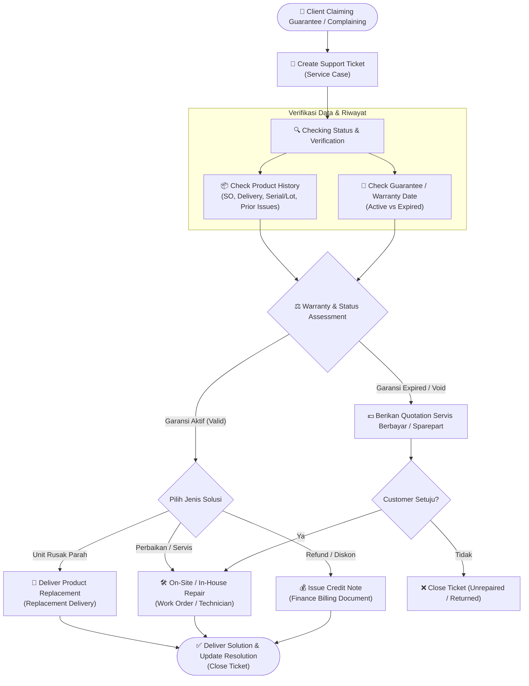
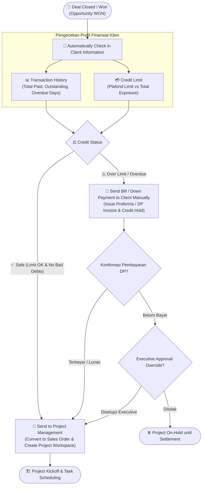

# CRM & Customer Service Workflow Specification

Dokumen ini memetakan flow operasional **Customer Relationship Management (CRM)** dan **Customer Support/Service** pada ERP. Format diagram menggunakan **Mermaid** dan deskripsi terstruktur sehingga mudah disesuaikan (*editable*), dikembangkan, dan diintegrasikan ke backend maupun frontend.

---

## 📑 Daftar Isi
1. [Flow 1: Ticket Support & Warranty / Complaint Management](#1-flow-1-ticket-support--warranty--complaint-management)
2. [Flow 2: Deal Management & Credit Assessment (Won to Execution)](#2-flow-2-deal-management--credit-assessment-won-to-execution)
3. [Mapping Relasi Model ERP](#3-mapping-relasi-model-erp)
4. [Panduan Update & Modifikasi Flow](#4-panduan-update--modifikasi-flow)

---

## 1. Flow 1: Ticket Support & Warranty / Complaint Management

Alur penanganan keluhan pelanggan, klaim garansi produk, perbaikan (*repair*), maupun penggantian unit (*replacement*).

### 1.1 Visual Flow Diagram (Mermaid)



### 1.2 Detail Tahapan & Field Data

| Step | Action / Aktivitas | Data Input / Checks | Output / State | Terkait Model ERP |
|---|---|---|---|---|
| **1** | **Create Support Ticket** | Customer, Contact, Product, Serial Number / Lot, Problem Subject & Description, Priority. | Ticket status: `OPEN`, SLA due date dihitung otomatis. | `service.Case` |
| **2** | **Checking Status** | Lookup riwayat transaksi dan status unit. | Verifikasi kepemilikan dan integritas serial number. | `service.Case`, `sales.Order` |
| **2a** | **Product History** | Riwayat Delivery, riwayat reparasi sebelumnya, catatan log keluhan. | Track record histori produk. | `sales.Delivery`, `inventory.SerialNumber` |
| **2b** | **Product Guarantee Date** | Tanggal serah terima vs masa berlaku garansi kontrak/SLA. | Status: `WARRANTY_ACTIVE` / `WARRANTY_EXPIRED`. | `sales.Contract`, `master_data.Product` |
| **3** | **Deliver Solution** | Keputusan penanganan (Ganti unit, perbaikan, credit note). | Ticket status: `RESOLVED` / `CLOSED`. | `service.Resolution`, `sales.Delivery`, `finance.BillingDocument` |

---

## 2. Flow 2: Deal Management & Credit Assessment (Won to Execution)

Alur otomatisasi ketika Opportunity/Deal berstatus `WON` untuk memeriksa kesehatan finansial & batas kredit klien sebelum dialihkan ke Project Management.

### 2.1 Visual Flow Diagram (Mermaid)



### 2.2 Detail Tahapan & Aturan Keputusan

| Step | Kondisi / Evaluasi | Tindakan Sistem | Output / State | Terkait Model ERP |
|---|---|---|---|---|
| **1** | **Deal Won** | Opportunity stage diubah menjadi `WON`. | Trigger background check / webhook. | `crm.Opportunity` |
| **2** | **Transaction History** | Menghitung rasio pembayaran on-time, total nilai transaksi lampau, dan ada/tidaknya piutang macet. | Skor track record klien (`GOOD` / `RISKY`). | `finance.BillingDocument`, `finance.Payment` |
| **2a** | **Credit Limit** | `Total Piutang Belum Lunas + Nilai Deal Baru` $\le$ `Credit Limit Party`. | Flag: `SAFE` atau `EXCEEDED`. | `master_data.CustomerProfile`, `crm.CreditStatusSnapshot` |
| **3A** | **Credit Status = Safe** | Limit mencukupi, tidak ada tunggakan jatuh tempo. | Konversi ke Sales Order dan handoff ke Project Management. | `sales.Order`, `projects.Project` |
| **3B** | **Credit Status = Over** | Limit terlampaui atau terdapat faktur jatuh tempo. | Terbitkan Proforma Invoice / DP, set status `CREDIT_HOLD`. | `finance.BillingDocument`, `core.WorkflowApproval` |

---

## 3. Mapping Relasi Model ERP

```text
[CRM Lead] ──> [CRM Opportunity] ──> [Sales Quotation] ──> [Sales Order] ──> [Project Workspace]
                        │                                          │
                        ▼ (Cek Kredit)                             ▼ (Klaim Servis)
             [Customer Profile / Snapshot]                  [Service Case / Ticket]
                        │                                          │
                        ▼                                          ▼
             [Finance Billing / DP]                         [Service Resolution]
                                                            ├── Replacement Delivery
                                                            └── Credit Note
```

---

## 4. Panduan Update & Modifikasi Flow

Untuk menyesuaikan flow sesuai kebutuhan bisnis di masa mendatang:

1. **Menambah Cabang Logika / Decision**:
   - Tambahkan node bertanda `{ "Pertanyaan Kondisi" }` pada diagram Mermaid.
   - Buat cabang panah `-- "Pilihan A" -->` dan `-- "Pilihan B" -->`.
2. **Menambah Step Baru**:
   - Gunakan format kotak `STEP_NAME["📝 Nama Langkah"]`.
3. **Sinkronisasi ke Codebase**:
   - Logika Service Ticket berada di `backend/apps/service/`.
   - Logika Deal & Credit Check berada di `backend/apps/crm/` dan `backend/apps/finance/`.
   - UI interaktif prototype dapat dilihat pada folder `uji_prototype/`.
