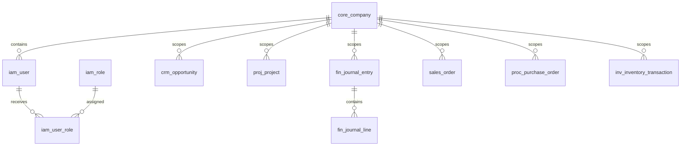
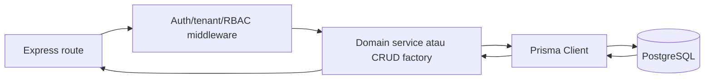

# Database Documentation

Dokumen ini adalah dokumentasi **AS-IS** database untuk backend Express dan frontend Next. Ia dibaca bersama [System Documentation](./SYSTEM_DOCUMENTATION.md). Nilai credential sengaja tidak dicantumkan.

## Status dan cakupan

- **IMPLEMENTED:** PostgreSQL melalui Prisma Client; schema sumber berada di `backend-express/prisma/schema.prisma`.
- **IMPLEMENTED:** 252 model Prisma dan 1 enum terdeteksi pada schema saat audit.
- **IMPLEMENTED:** migrasi SQL khusus Q3/Q7 dan beberapa script sinkronisasi/seed tersedia.
- **NOT FOUND:** mekanisme rollback otomatis, backup terjadwal, point-in-time recovery, atau disaster-recovery orchestration.
- Nama fisik tabel/kolom mengikuti nama model/field kecuali bila `@@map` atau `@map` disebut pada atribut schema.

## 1. Database Overview

| Aspek | Implementasi aktual |
|---|---|
| Engine | PostgreSQL (terlihat dari `provider = "postgresql"`) |
| ORM | Prisma Client |
| Koneksi | `DATABASE_URL` untuk runtime/pooler dan `DIRECT_URL` untuk migration/schema operation; `src/config/database.ts` membuat singleton `PrismaClient` |
| Inisialisasi | Server biasa memanggil `$connect()`; handler Vercel mengekspor aplikasi tanpa listener |
| Schema | `backend-express/prisma/schema.prisma` |
| Migrasi | SQL di `prisma/migrations/*/migration.sql`, dijalankan melalui Prisma CLI atau script SQL khusus sesuai script yang tersedia |
| Seed | `prisma/seed.ts` plus script setup/seed di `scripts/` |
| Logging query | query/warn/error pada development; error pada production |

## 2. ID, tipe, enum, dan konvensi

Mayoritas primary key adalah `String` dengan default UUID/CUID sesuai atribut per tabel; dokumentasi kolom di bawah mempertahankan ekspresi default aktual. Relasi list Prisma bukan kolom fisik dan tidak dimasukkan sebagai kolom. Field relasi object dicatat hanya bila membawa `@relation`; foreign-key scalar tetap ditampilkan sebagai kolom.

### Enum

- `RoleCode`: `SUPER_ADMIN         @map("ROLE-SUPER-ADMIN")`, `COMPANY_ADMIN       @map("ROLE-COMPANY-ADMIN")`, `DIRECTOR            @map("ROLE-DIRECTOR")`, `OPERATIONAL_MANAGER @map("ROLE-OM")`, `PROJECT_MANAGER     @map("ROLE-PM")`, `SUPERVISOR          @map("ROLE-SUPERVISOR")`, `CRM_LEAD            @map("ROLE-CRM-LEAD")`, `SALES               @map("ROLE-SALES")`, `FINANCE             @map("ROLE-FINANCE")`, `STAFF               @map("ROLE-STAFF")`, `@@map("iam_role_code")`

## 3. Peta domain dan ERD ringkas

Diagram ringkas sengaja hanya menunjukkan tulang punggung lintas modul; relasi lengkap per model tercatat pada atribut `@relation` dan bagian tabel di bawah.

## 4. Complete Schema dan Table-by-Table Explanation

### Domain `core` — Data inti, company, audit, konfigurasi, dan idempotensi

#### `core_tenant`

**Purpose/ownership.** Data inti, company, audit, konfigurasi, dan idempotensi; model ini merepresentasikan Core Tenant. Record digunakan oleh Prisma delegate `prisma.core_tenant` pada route/service/script yang merujuk model tersebut. Lifecycle aktual mengikuti operasi create/update/delete pada pemanggil; tidak ada soft-delete yang boleh diasumsikan kecuali field status/deletion tercantum eksplisit.

| Column | Type | Nullable | Default | Primary Key | Foreign Key / Relation | Description |
|---|---|---:|---|---:|---|---|
| `id` | `text/varchar (Prisma String)` | No | `uuid()` | Yes | — | Id |
| `code` | `text/varchar (Prisma String)` | No | `—` | No | — | Code |
| `name` | `text/varchar (Prisma String)` | No | `—` | No | — | Name |
| `status` | `text/varchar (Prisma String)` | No | `—` | No | — | Status |
| `created_at` | `timestamp` | Yes | `—` | No | — | Created At |
| `updated_at` | `timestamp` | Yes | `—` | No | — | Updated At |

**Rules and relationships.** Primary key: `id`. Unique constraints: `code`. Block attributes: `@@map("core_tenant")`. Relations: none declared as relation object.

#### `core_company`

**Purpose/ownership.** Data inti, company, audit, konfigurasi, dan idempotensi; model ini merepresentasikan Core Company. Record digunakan oleh Prisma delegate `prisma.core_company` pada route/service/script yang merujuk model tersebut. Lifecycle aktual mengikuti operasi create/update/delete pada pemanggil; tidak ada soft-delete yang boleh diasumsikan kecuali field status/deletion tercantum eksplisit.

| Column | Type | Nullable | Default | Primary Key | Foreign Key / Relation | Description |
|---|---|---:|---|---:|---|---|
| `id` | `text/varchar (Prisma String)` | No | `uuid()` | Yes | — | Id |
| `tenant_id` | `text/varchar (Prisma String)` | Yes | `—` | No | — | Tenant Id; physical column: tenant_id |
| `company_code` | `text/varchar (Prisma String)` | No | `—` | No | — | Company Code |
| `legal_name` | `text/varchar (Prisma String)` | No | `—` | No | — | Legal Name |
| `tax_number` | `text/varchar (Prisma String)` | No | `—` | No | — | Tax Number |
| `base_currency_id` | `text/varchar (Prisma String)` | Yes | `—` | No | — | Base Currency Id; physical column: base_currency_id |
| `fiscal_year_start` | `timestamp` | Yes | `—` | No | — | Fiscal Year Start |
| `status` | `text/varchar (Prisma String)` | No | `—` | No | — | Status |

**Rules and relationships.** Primary key: `id`. Unique constraints: none declared. Block attributes: `@@map("core_company")`. Relations: none declared as relation object.

#### `core_organization`

**Purpose/ownership.** Data inti, company, audit, konfigurasi, dan idempotensi; model ini merepresentasikan Core Organization. Record digunakan oleh Prisma delegate `prisma.core_organization` pada route/service/script yang merujuk model tersebut. Lifecycle aktual mengikuti operasi create/update/delete pada pemanggil; tidak ada soft-delete yang boleh diasumsikan kecuali field status/deletion tercantum eksplisit.

| Column | Type | Nullable | Default | Primary Key | Foreign Key / Relation | Description |
|---|---|---:|---|---:|---|---|
| `created_by_id` | `text/varchar (Prisma String)` | Yes | `—` | No | — | Created By Id; physical column: created_by_id |
| `created_at` | `timestamp` | Yes | `now()` | No | — | Created At |
| `updated_at` | `timestamp` | Yes | `—` | No | — | Updated At |
| `id` | `text/varchar (Prisma String)` | No | `uuid()` | Yes | — | Id |
| `tenant_id` | `text/varchar (Prisma String)` | Yes | `—` | No | — | Tenant Id; physical column: tenant_id |
| `company_id` | `text/varchar (Prisma String)` | Yes | `—` | No | — | Company Id; physical column: company_id |
| `parent_id` | `text/varchar (Prisma String)` | Yes | `—` | No | — | Parent Id; physical column: parent_id |
| `organization_code` | `text/varchar (Prisma String)` | No | `—` | No | — | Organization Code |
| `organization_name` | `text/varchar (Prisma String)` | No | `—` | No | — | Organization Name |
| `organization_type` | `text/varchar (Prisma String)` | No | `—` | No | — | Organization Type |
| `status` | `text/varchar (Prisma String)` | No | `—` | No | — | Status |

**Rules and relationships.** Primary key: `id`. Unique constraints: none declared. Block attributes: `@@index([tenant_id, company_id])`; `@@map("core_organization")`. Relations: none declared as relation object.

#### `core_business_document`

**Purpose/ownership.** Data inti, company, audit, konfigurasi, dan idempotensi; model ini merepresentasikan Core Business Document. Record digunakan oleh Prisma delegate `prisma.core_business_document` pada route/service/script yang merujuk model tersebut. Lifecycle aktual mengikuti operasi create/update/delete pada pemanggil; tidak ada soft-delete yang boleh diasumsikan kecuali field status/deletion tercantum eksplisit.

| Column | Type | Nullable | Default | Primary Key | Foreign Key / Relation | Description |
|---|---|---:|---|---:|---|---|
| `created_by_id` | `text/varchar (Prisma String)` | Yes | `—` | No | — | Created By Id; physical column: created_by_id |
| `id` | `text/varchar (Prisma String)` | No | `uuid()` | Yes | — | Id |
| `tenant_id` | `text/varchar (Prisma String)` | Yes | `—` | No | — | Tenant Id; physical column: tenant_id |
| `company_id` | `text/varchar (Prisma String)` | Yes | `—` | No | — | Company Id; physical column: company_id |
| `document_type` | `text/varchar (Prisma String)` | No | `—` | No | — | Document Type |
| `document_number` | `text/varchar (Prisma String)` | No | `—` | No | — | Document Number |
| `status` | `text/varchar (Prisma String)` | No | `—` | No | — | Status |
| `document_date` | `timestamp` | Yes | `—` | No | — | Document Date |
| `posting_date` | `timestamp` | Yes | `—` | No | — | Posting Date |
| `version` | `integer` | Yes | `—` | No | — | Version |
| `created_by` | `text/varchar (Prisma String)` | Yes | `—` | No | — | Created By |
| `approved_by` | `text/varchar (Prisma String)` | Yes | `—` | No | — | Approved By |
| `posted_by` | `text/varchar (Prisma String)` | Yes | `—` | No | — | Posted By |
| `reversal_of_id` | `text/varchar (Prisma String)` | Yes | `—` | No | — | Reversal Of Id; physical column: reversal_of_id |
| `created_at` | `timestamp` | Yes | `—` | No | — | Created At |
| `updated_at` | `timestamp` | Yes | `—` | No | — | Updated At |

**Rules and relationships.** Primary key: `id`. Unique constraints: none declared. Block attributes: `@@index([tenant_id, company_id])`; `@@map("core_business_document")`. Relations: none declared as relation object.

#### `core_document_link`

**Purpose/ownership.** Data inti, company, audit, konfigurasi, dan idempotensi; model ini merepresentasikan Core Document Link. Record digunakan oleh Prisma delegate `prisma.core_document_link` pada route/service/script yang merujuk model tersebut. Lifecycle aktual mengikuti operasi create/update/delete pada pemanggil; tidak ada soft-delete yang boleh diasumsikan kecuali field status/deletion tercantum eksplisit.

| Column | Type | Nullable | Default | Primary Key | Foreign Key / Relation | Description |
|---|---|---:|---|---:|---|---|
| `tenant_id` | `text/varchar (Prisma String)` | Yes | `—` | No | — | Tenant Id; physical column: tenant_id |
| `company_id` | `text/varchar (Prisma String)` | Yes | `—` | No | — | Company Id; physical column: company_id |
| `created_by_id` | `text/varchar (Prisma String)` | Yes | `—` | No | — | Created By Id; physical column: created_by_id |
| `updated_at` | `timestamp` | Yes | `—` | No | — | Updated At |
| `id` | `text/varchar (Prisma String)` | No | `uuid()` | Yes | — | Id |
| `source_document_id` | `text/varchar (Prisma String)` | Yes | `—` | No | — | Source Document Id; physical column: source_document_id |
| `target_document_id` | `text/varchar (Prisma String)` | Yes | `—` | No | — | Target Document Id; physical column: target_document_id |
| `link_type` | `text/varchar (Prisma String)` | No | `—` | No | — | Link Type |
| `created_at` | `timestamp` | Yes | `—` | No | — | Created At |

**Rules and relationships.** Primary key: `id`. Unique constraints: none declared. Block attributes: `@@index([tenant_id, company_id])`; `@@map("core_document_link")`. Relations: none declared as relation object.

#### `core_workflow_instance`

**Purpose/ownership.** Data inti, company, audit, konfigurasi, dan idempotensi; model ini merepresentasikan Core Workflow Instance. Record digunakan oleh Prisma delegate `prisma.core_workflow_instance` pada route/service/script yang merujuk model tersebut. Lifecycle aktual mengikuti operasi create/update/delete pada pemanggil; tidak ada soft-delete yang boleh diasumsikan kecuali field status/deletion tercantum eksplisit.

| Column | Type | Nullable | Default | Primary Key | Foreign Key / Relation | Description |
|---|---|---:|---|---:|---|---|
| `tenant_id` | `text/varchar (Prisma String)` | Yes | `—` | No | — | Tenant Id; physical column: tenant_id |
| `company_id` | `text/varchar (Prisma String)` | Yes | `—` | No | — | Company Id; physical column: company_id |
| `created_by_id` | `text/varchar (Prisma String)` | Yes | `—` | No | — | Created By Id; physical column: created_by_id |
| `created_at` | `timestamp` | Yes | `now()` | No | — | Created At |
| `updated_at` | `timestamp` | Yes | `—` | No | — | Updated At |
| `id` | `text/varchar (Prisma String)` | No | `uuid()` | Yes | — | Id |
| `document_id` | `text/varchar (Prisma String)` | Yes | `—` | No | — | Document Id; physical column: document_id |
| `workflow_code` | `text/varchar (Prisma String)` | No | `—` | No | — | Workflow Code |
| `current_state` | `text/varchar (Prisma String)` | No | `—` | No | — | Current State |
| `status` | `text/varchar (Prisma String)` | No | `—` | No | — | Status |
| `started_at` | `timestamp` | Yes | `—` | No | — | Started At |
| `completed_at` | `timestamp` | Yes | `—` | No | — | Completed At |

**Rules and relationships.** Primary key: `id`. Unique constraints: none declared. Block attributes: `@@index([tenant_id, company_id])`; `@@map("core_workflow_instance")`. Relations: none declared as relation object.

#### `core_workflow_approval`

**Purpose/ownership.** Data inti, company, audit, konfigurasi, dan idempotensi; model ini merepresentasikan Core Workflow Approval. Record digunakan oleh Prisma delegate `prisma.core_workflow_approval` pada route/service/script yang merujuk model tersebut. Lifecycle aktual mengikuti operasi create/update/delete pada pemanggil; tidak ada soft-delete yang boleh diasumsikan kecuali field status/deletion tercantum eksplisit.

| Column | Type | Nullable | Default | Primary Key | Foreign Key / Relation | Description |
|---|---|---:|---|---:|---|---|
| `tenant_id` | `text/varchar (Prisma String)` | Yes | `—` | No | — | Tenant Id; physical column: tenant_id |
| `company_id` | `text/varchar (Prisma String)` | Yes | `—` | No | — | Company Id; physical column: company_id |
| `created_by_id` | `text/varchar (Prisma String)` | Yes | `—` | No | — | Created By Id; physical column: created_by_id |
| `created_at` | `timestamp` | Yes | `now()` | No | — | Created At |
| `updated_at` | `timestamp` | Yes | `—` | No | — | Updated At |
| `id` | `text/varchar (Prisma String)` | No | `uuid()` | Yes | — | Id |
| `workflow_instance_id` | `text/varchar (Prisma String)` | Yes | `—` | No | — | Workflow Instance Id; physical column: workflow_instance_id |
| `approver_user_id` | `text/varchar (Prisma String)` | Yes | `—` | No | — | Approver User Id; physical column: approver_user_id |
| `approval_level` | `text/varchar (Prisma String)` | No | `—` | No | — | Approval Level |
| `decision` | `text/varchar (Prisma String)` | No | `—` | No | — | Decision |
| `remarks` | `text/varchar (Prisma String)` | No | `—` | No | — | Remarks |
| `decided_at` | `timestamp` | Yes | `—` | No | — | Decided At |

**Rules and relationships.** Primary key: `id`. Unique constraints: none declared. Block attributes: `@@index([tenant_id, company_id])`; `@@map("core_workflow_approval")`. Relations: none declared as relation object.

#### `core_audit_event`

**Purpose/ownership.** Data inti, company, audit, konfigurasi, dan idempotensi; model ini merepresentasikan Core Audit Event. Record digunakan oleh Prisma delegate `prisma.core_audit_event` pada route/service/script yang merujuk model tersebut. Lifecycle aktual mengikuti operasi create/update/delete pada pemanggil; tidak ada soft-delete yang boleh diasumsikan kecuali field status/deletion tercantum eksplisit.

| Column | Type | Nullable | Default | Primary Key | Foreign Key / Relation | Description |
|---|---|---:|---|---:|---|---|
| `created_by_id` | `text/varchar (Prisma String)` | Yes | `—` | No | — | Created By Id; physical column: created_by_id |
| `created_at` | `timestamp` | Yes | `now()` | No | — | Created At |
| `updated_at` | `timestamp` | Yes | `—` | No | — | Updated At |
| `id` | `text/varchar (Prisma String)` | No | `uuid()` | Yes | — | Id |
| `tenant_id` | `text/varchar (Prisma String)` | Yes | `—` | No | — | Tenant Id; physical column: tenant_id |
| `company_id` | `text/varchar (Prisma String)` | Yes | `—` | No | — | Company Id; physical column: company_id |
| `document_id` | `text/varchar (Prisma String)` | Yes | `—` | No | — | Document Id; physical column: document_id |
| `user_id` | `text/varchar (Prisma String)` | Yes | `—` | No | — | User Id; physical column: user_id |
| `entity_name` | `text/varchar (Prisma String)` | No | `—` | No | — | Entity Name |
| `entity_id` | `text/varchar (Prisma String)` | Yes | `—` | No | — | Entity Id |
| `event_type` | `text/varchar (Prisma String)` | No | `—` | No | — | Event Type |
| `before_data` | `json/jsonb` | No | `—` | No | — | Before Data |
| `after_data` | `json/jsonb` | No | `—` | No | — | After Data |
| `occurred_at` | `timestamp` | Yes | `—` | No | — | Occurred At |

**Rules and relationships.** Primary key: `id`. Unique constraints: none declared. Block attributes: `@@index([tenant_id, company_id])`; `@@map("core_audit_event")`. Relations: none declared as relation object.

#### `core_notification`

**Purpose/ownership.** Data inti, company, audit, konfigurasi, dan idempotensi; model ini merepresentasikan Core Notification. Record digunakan oleh Prisma delegate `prisma.core_notification` pada route/service/script yang merujuk model tersebut. Lifecycle aktual mengikuti operasi create/update/delete pada pemanggil; tidak ada soft-delete yang boleh diasumsikan kecuali field status/deletion tercantum eksplisit.

| Column | Type | Nullable | Default | Primary Key | Foreign Key / Relation | Description |
|---|---|---:|---|---:|---|---|
| `created_by_id` | `text/varchar (Prisma String)` | Yes | `—` | No | — | Created By Id; physical column: created_by_id |
| `updated_at` | `timestamp` | Yes | `—` | No | — | Updated At |
| `id` | `text/varchar (Prisma String)` | No | `uuid()` | Yes | — | Id |
| `tenant_id` | `text/varchar (Prisma String)` | Yes | `—` | No | — | Tenant Id; physical column: tenant_id |
| `company_id` | `text/varchar (Prisma String)` | Yes | `—` | No | — | Company Id; physical column: company_id |
| `source_document_id` | `text/varchar (Prisma String)` | Yes | `—` | No | — | Source Document Id; physical column: source_document_id |
| `alert_event_id` | `text/varchar (Prisma String)` | Yes | `—` | No | — | Alert Event Id; physical column: alert_event_id |
| `notification_type` | `text/varchar (Prisma String)` | No | `—` | No | — | Notification Type |
| `title` | `text/varchar (Prisma String)` | No | `—` | No | — | Title |
| `message` | `text/varchar (Prisma String)` | No | `—` | No | — | Message |
| `action_url` | `text/varchar (Prisma String)` | No | `—` | No | — | Action Url |
| `priority` | `text/varchar (Prisma String)` | No | `—` | No | — | Priority |
| `created_at` | `timestamp` | Yes | `—` | No | — | Created At |
| `expires_at` | `timestamp` | Yes | `—` | No | — | Expires At |

**Rules and relationships.** Primary key: `id`. Unique constraints: none declared. Block attributes: `@@index([tenant_id, company_id])`; `@@map("core_notification")`. Relations: none declared as relation object.

#### `core_notification_recipient`

**Purpose/ownership.** Data inti, company, audit, konfigurasi, dan idempotensi; model ini merepresentasikan Core Notification Recipient. Record digunakan oleh Prisma delegate `prisma.core_notification_recipient` pada route/service/script yang merujuk model tersebut. Lifecycle aktual mengikuti operasi create/update/delete pada pemanggil; tidak ada soft-delete yang boleh diasumsikan kecuali field status/deletion tercantum eksplisit.

| Column | Type | Nullable | Default | Primary Key | Foreign Key / Relation | Description |
|---|---|---:|---|---:|---|---|
| `tenant_id` | `text/varchar (Prisma String)` | Yes | `—` | No | — | Tenant Id; physical column: tenant_id |
| `company_id` | `text/varchar (Prisma String)` | Yes | `—` | No | — | Company Id; physical column: company_id |
| `created_by_id` | `text/varchar (Prisma String)` | Yes | `—` | No | — | Created By Id; physical column: created_by_id |
| `created_at` | `timestamp` | Yes | `now()` | No | — | Created At |
| `updated_at` | `timestamp` | Yes | `—` | No | — | Updated At |
| `id` | `text/varchar (Prisma String)` | No | `uuid()` | Yes | — | Id |
| `notification_id` | `text/varchar (Prisma String)` | Yes | `—` | No | — | Notification Id; physical column: notification_id |
| `recipient_user_id` | `text/varchar (Prisma String)` | Yes | `—` | No | — | Recipient User Id; physical column: recipient_user_id |
| `recipient_role_id` | `text/varchar (Prisma String)` | Yes | `—` | No | — | Recipient Role Id; physical column: recipient_role_id |
| `delivered_at` | `timestamp` | Yes | `—` | No | — | Delivered At |
| `read_at` | `timestamp` | Yes | `—` | No | — | Read At |
| `dismissed_at` | `timestamp` | Yes | `—` | No | — | Dismissed At |
| `delivery_status` | `text/varchar (Prisma String)` | No | `—` | No | — | Delivery Status |

**Rules and relationships.** Primary key: `id`. Unique constraints: none declared. Block attributes: `@@index([tenant_id, company_id])`; `@@map("core_notification_recipient")`. Relations: none declared as relation object.

#### `core_quick_action`

**Purpose/ownership.** Data inti, company, audit, konfigurasi, dan idempotensi; model ini merepresentasikan Core Quick Action. Record digunakan oleh Prisma delegate `prisma.core_quick_action` pada route/service/script yang merujuk model tersebut. Lifecycle aktual mengikuti operasi create/update/delete pada pemanggil; tidak ada soft-delete yang boleh diasumsikan kecuali field status/deletion tercantum eksplisit.

| Column | Type | Nullable | Default | Primary Key | Foreign Key / Relation | Description |
|---|---|---:|---|---:|---|---|
| `company_id` | `text/varchar (Prisma String)` | Yes | `—` | No | — | Company Id; physical column: company_id |
| `created_by_id` | `text/varchar (Prisma String)` | Yes | `—` | No | — | Created By Id; physical column: created_by_id |
| `created_at` | `timestamp` | Yes | `now()` | No | — | Created At |
| `updated_at` | `timestamp` | Yes | `—` | No | — | Updated At |
| `id` | `text/varchar (Prisma String)` | No | `uuid()` | Yes | — | Id |
| `tenant_id` | `text/varchar (Prisma String)` | Yes | `—` | No | — | Tenant Id; physical column: tenant_id |
| `action_code` | `text/varchar (Prisma String)` | No | `—` | No | — | Action Code |
| `action_name` | `text/varchar (Prisma String)` | No | `—` | No | — | Action Name |
| `module_code` | `text/varchar (Prisma String)` | No | `—` | No | — | Module Code |
| `entity_name` | `text/varchar (Prisma String)` | No | `—` | No | — | Entity Name |
| `route_path` | `text/varchar (Prisma String)` | No | `—` | No | — | Route Path |
| `required_permission_id` | `text/varchar (Prisma String)` | Yes | `—` | No | — | Required Permission Id; physical column: required_permission_id |
| `default_payload` | `json/jsonb` | No | `—` | No | — | Default Payload |
| `active` | `boolean` | No | `—` | No | — | Active |

**Rules and relationships.** Primary key: `id`. Unique constraints: `action_code`. Block attributes: `@@index([tenant_id, company_id])`; `@@map("core_quick_action")`. Relations: none declared as relation object.

#### `core_file`

**Purpose/ownership.** Data inti, company, audit, konfigurasi, dan idempotensi; model ini merepresentasikan Core File. Record digunakan oleh Prisma delegate `prisma.core_file` pada route/service/script yang merujuk model tersebut. Lifecycle aktual mengikuti operasi create/update/delete pada pemanggil; tidak ada soft-delete yang boleh diasumsikan kecuali field status/deletion tercantum eksplisit.

| Column | Type | Nullable | Default | Primary Key | Foreign Key / Relation | Description |
|---|---|---:|---|---:|---|---|
| `created_by_id` | `text/varchar (Prisma String)` | Yes | `—` | No | — | Created By Id; physical column: created_by_id |
| `created_at` | `timestamp` | Yes | `now()` | No | — | Created At |
| `updated_at` | `timestamp` | Yes | `—` | No | — | Updated At |
| `id` | `text/varchar (Prisma String)` | No | `uuid()` | Yes | — | Id |
| `tenant_id` | `text/varchar (Prisma String)` | Yes | `—` | No | — | Tenant Id; physical column: tenant_id |
| `company_id` | `text/varchar (Prisma String)` | Yes | `—` | No | — | Company Id; physical column: company_id |
| `file_name` | `text/varchar (Prisma String)` | No | `—` | No | — | File Name |
| `storage_key` | `text/varchar (Prisma String)` | No | `—` | No | — | Storage Key |
| `mime_type` | `text/varchar (Prisma String)` | No | `—` | No | — | Mime Type |
| `file_size` | `bigint` | Yes | `—` | No | — | File Size |
| `checksum` | `text/varchar (Prisma String)` | No | `—` | No | — | Checksum |
| `uploaded_by` | `text/varchar (Prisma String)` | Yes | `—` | No | — | Uploaded By |
| `uploaded_at` | `timestamp` | Yes | `—` | No | — | Uploaded At |
| `status` | `text/varchar (Prisma String)` | No | `—` | No | — | Status |

**Rules and relationships.** Primary key: `id`. Unique constraints: none declared. Block attributes: `@@index([tenant_id, company_id])`; `@@map("core_file")`. Relations: none declared as relation object.

#### `core_document_attachment`

**Purpose/ownership.** Data inti, company, audit, konfigurasi, dan idempotensi; model ini merepresentasikan Core Document Attachment. Record digunakan oleh Prisma delegate `prisma.core_document_attachment` pada route/service/script yang merujuk model tersebut. Lifecycle aktual mengikuti operasi create/update/delete pada pemanggil; tidak ada soft-delete yang boleh diasumsikan kecuali field status/deletion tercantum eksplisit.

| Column | Type | Nullable | Default | Primary Key | Foreign Key / Relation | Description |
|---|---|---:|---|---:|---|---|
| `tenant_id` | `text/varchar (Prisma String)` | Yes | `—` | No | — | Tenant Id; physical column: tenant_id |
| `company_id` | `text/varchar (Prisma String)` | Yes | `—` | No | — | Company Id; physical column: company_id |
| `created_by_id` | `text/varchar (Prisma String)` | Yes | `—` | No | — | Created By Id; physical column: created_by_id |
| `created_at` | `timestamp` | Yes | `now()` | No | — | Created At |
| `updated_at` | `timestamp` | Yes | `—` | No | — | Updated At |
| `id` | `text/varchar (Prisma String)` | No | `uuid()` | Yes | — | Id |
| `document_id` | `text/varchar (Prisma String)` | Yes | `—` | No | — | Document Id; physical column: document_id |
| `file_id` | `text/varchar (Prisma String)` | Yes | `—` | No | — | File Id; physical column: file_id |
| `attachment_type` | `text/varchar (Prisma String)` | No | `—` | No | — | Attachment Type |
| `sort_order` | `integer` | Yes | `—` | No | — | Sort Order |
| `visible_to_customer` | `boolean` | No | `—` | No | — | Visible To Customer |

**Rules and relationships.** Primary key: `id`. Unique constraints: none declared. Block attributes: `@@index([tenant_id, company_id])`; `@@map("core_document_attachment")`. Relations: none declared as relation object.

#### `core_document_template`

**Purpose/ownership.** Data inti, company, audit, konfigurasi, dan idempotensi; model ini merepresentasikan Core Document Template. Record digunakan oleh Prisma delegate `prisma.core_document_template` pada route/service/script yang merujuk model tersebut. Lifecycle aktual mengikuti operasi create/update/delete pada pemanggil; tidak ada soft-delete yang boleh diasumsikan kecuali field status/deletion tercantum eksplisit.

| Column | Type | Nullable | Default | Primary Key | Foreign Key / Relation | Description |
|---|---|---:|---|---:|---|---|
| `id` | `text/varchar (Prisma String)` | No | `uuid()` | Yes | — | Id |
| `tenant_id` | `text/varchar (Prisma String)` | Yes | `—` | No | — | Tenant Id; physical column: tenant_id |
| `company_id` | `text/varchar (Prisma String)` | Yes | `—` | No | — | Company Id; physical column: company_id |
| `template_code` | `text/varchar (Prisma String)` | No | `—` | No | — | Template Code |
| `template_name` | `text/varchar (Prisma String)` | No | `—` | No | — | Template Name |
| `document_type` | `text/varchar (Prisma String)` | No | `—` | No | — | Document Type |
| `output_format` | `text/varchar (Prisma String)` | No | `—` | No | — | Output Format |
| `status` | `text/varchar (Prisma String)` | No | `—` | No | — | Status |

**Rules and relationships.** Primary key: `id`. Unique constraints: `template_code`. Block attributes: `@@map("core_document_template")`. Relations: none declared as relation object.

#### `core_document_template_version`

**Purpose/ownership.** Data inti, company, audit, konfigurasi, dan idempotensi; model ini merepresentasikan Core Document Template Version. Record digunakan oleh Prisma delegate `prisma.core_document_template_version` pada route/service/script yang merujuk model tersebut. Lifecycle aktual mengikuti operasi create/update/delete pada pemanggil; tidak ada soft-delete yang boleh diasumsikan kecuali field status/deletion tercantum eksplisit.

| Column | Type | Nullable | Default | Primary Key | Foreign Key / Relation | Description |
|---|---|---:|---|---:|---|---|
| `id` | `text/varchar (Prisma String)` | No | `uuid()` | Yes | — | Id |
| `template_id` | `text/varchar (Prisma String)` | Yes | `—` | No | — | Template Id; physical column: template_id |
| `version_number` | `integer` | Yes | `—` | No | — | Version Number |
| `header_markup` | `text/varchar (Prisma String)` | No | `—` | No | — | Header Markup |
| `body_markup` | `text/varchar (Prisma String)` | No | `—` | No | — | Body Markup |
| `footer_markup` | `text/varchar (Prisma String)` | No | `—` | No | — | Footer Markup |
| `style_json` | `json/jsonb` | No | `—` | No | — | Style Json |
| `effective_from` | `timestamp` | Yes | `—` | No | — | Effective From |
| `effective_to` | `timestamp` | Yes | `—` | No | — | Effective To |
| `status` | `text/varchar (Prisma String)` | No | `—` | No | — | Status |

**Rules and relationships.** Primary key: `id`. Unique constraints: none declared. Block attributes: `@@map("core_document_template_version")`. Relations: none declared as relation object.

#### `core_document_template_field`

**Purpose/ownership.** Data inti, company, audit, konfigurasi, dan idempotensi; model ini merepresentasikan Core Document Template Field. Record digunakan oleh Prisma delegate `prisma.core_document_template_field` pada route/service/script yang merujuk model tersebut. Lifecycle aktual mengikuti operasi create/update/delete pada pemanggil; tidak ada soft-delete yang boleh diasumsikan kecuali field status/deletion tercantum eksplisit.

| Column | Type | Nullable | Default | Primary Key | Foreign Key / Relation | Description |
|---|---|---:|---|---:|---|---|
| `id` | `text/varchar (Prisma String)` | No | `uuid()` | Yes | — | Id |
| `template_version_id` | `text/varchar (Prisma String)` | Yes | `—` | No | — | Template Version Id; physical column: template_version_id |
| `field_code` | `text/varchar (Prisma String)` | No | `—` | No | — | Field Code |
| `source_path` | `text/varchar (Prisma String)` | No | `—` | No | — | Source Path |
| `field_type` | `text/varchar (Prisma String)` | No | `—` | No | — | Field Type |
| `format_pattern` | `text/varchar (Prisma String)` | No | `—` | No | — | Format Pattern |
| `required` | `boolean` | No | `—` | No | — | Required |
| `sort_order` | `integer` | Yes | `—` | No | — | Sort Order |

**Rules and relationships.** Primary key: `id`. Unique constraints: none declared. Block attributes: `@@map("core_document_template_field")`. Relations: none declared as relation object.

#### `core_generated_document`

**Purpose/ownership.** Data inti, company, audit, konfigurasi, dan idempotensi; model ini merepresentasikan Core Generated Document. Record digunakan oleh Prisma delegate `prisma.core_generated_document` pada route/service/script yang merujuk model tersebut. Lifecycle aktual mengikuti operasi create/update/delete pada pemanggil; tidak ada soft-delete yang boleh diasumsikan kecuali field status/deletion tercantum eksplisit.

| Column | Type | Nullable | Default | Primary Key | Foreign Key / Relation | Description |
|---|---|---:|---|---:|---|---|
| `tenant_id` | `text/varchar (Prisma String)` | Yes | `—` | No | — | Tenant Id; physical column: tenant_id |
| `company_id` | `text/varchar (Prisma String)` | Yes | `—` | No | — | Company Id; physical column: company_id |
| `created_by_id` | `text/varchar (Prisma String)` | Yes | `—` | No | — | Created By Id; physical column: created_by_id |
| `created_at` | `timestamp` | Yes | `now()` | No | — | Created At |
| `updated_at` | `timestamp` | Yes | `—` | No | — | Updated At |
| `id` | `text/varchar (Prisma String)` | No | `uuid()` | Yes | — | Id |
| `business_document_id` | `text/varchar (Prisma String)` | Yes | `—` | No | — | Business Document Id; physical column: business_document_id |
| `template_version_id` | `text/varchar (Prisma String)` | Yes | `—` | No | — | Template Version Id; physical column: template_version_id |
| `file_id` | `text/varchar (Prisma String)` | Yes | `—` | No | — | File Id; physical column: file_id |
| `generation_number` | `integer` | Yes | `—` | No | — | Generation Number |
| `generation_status` | `text/varchar (Prisma String)` | No | `—` | No | — | Generation Status |
| `generated_by` | `text/varchar (Prisma String)` | Yes | `—` | No | — | Generated By |
| `generated_at` | `timestamp` | Yes | `—` | No | — | Generated At |

**Rules and relationships.** Primary key: `id`. Unique constraints: none declared. Block attributes: `@@index([tenant_id, company_id])`; `@@map("core_generated_document")`. Relations: none declared as relation object.

#### `core_document_signature`

**Purpose/ownership.** Data inti, company, audit, konfigurasi, dan idempotensi; model ini merepresentasikan Core Document Signature. Record digunakan oleh Prisma delegate `prisma.core_document_signature` pada route/service/script yang merujuk model tersebut. Lifecycle aktual mengikuti operasi create/update/delete pada pemanggil; tidak ada soft-delete yang boleh diasumsikan kecuali field status/deletion tercantum eksplisit.

| Column | Type | Nullable | Default | Primary Key | Foreign Key / Relation | Description |
|---|---|---:|---|---:|---|---|
| `tenant_id` | `text/varchar (Prisma String)` | Yes | `—` | No | — | Tenant Id; physical column: tenant_id |
| `company_id` | `text/varchar (Prisma String)` | Yes | `—` | No | — | Company Id; physical column: company_id |
| `created_by_id` | `text/varchar (Prisma String)` | Yes | `—` | No | — | Created By Id; physical column: created_by_id |
| `created_at` | `timestamp` | Yes | `now()` | No | — | Created At |
| `updated_at` | `timestamp` | Yes | `—` | No | — | Updated At |
| `id` | `text/varchar (Prisma String)` | No | `uuid()` | Yes | — | Id |
| `generated_document_id` | `text/varchar (Prisma String)` | Yes | `—` | No | — | Generated Document Id; physical column: generated_document_id |
| `signer_user_id` | `text/varchar (Prisma String)` | Yes | `—` | No | — | Signer User Id; physical column: signer_user_id |
| `signer_party_id` | `text/varchar (Prisma String)` | Yes | `—` | No | — | Signer Party Id; physical column: signer_party_id |
| `signature_type` | `text/varchar (Prisma String)` | No | `—` | No | — | Signature Type |
| `signature_status` | `text/varchar (Prisma String)` | No | `—` | No | — | Signature Status |
| `requested_at` | `timestamp` | Yes | `—` | No | — | Requested At |
| `signed_at` | `timestamp` | Yes | `—` | No | — | Signed At |
| `verification_reference` | `text/varchar (Prisma String)` | No | `—` | No | — | Verification Reference |

**Rules and relationships.** Primary key: `id`. Unique constraints: none declared. Block attributes: `@@index([tenant_id, company_id])`; `@@map("core_document_signature")`. Relations: none declared as relation object.

#### `core_user_recent_item`

**Purpose/ownership.** Data inti, company, audit, konfigurasi, dan idempotensi; model ini merepresentasikan Core User Recent Item. Record digunakan oleh Prisma delegate `prisma.core_user_recent_item` pada route/service/script yang merujuk model tersebut. Lifecycle aktual mengikuti operasi create/update/delete pada pemanggil; tidak ada soft-delete yang boleh diasumsikan kecuali field status/deletion tercantum eksplisit.

| Column | Type | Nullable | Default | Primary Key | Foreign Key / Relation | Description |
|---|---|---:|---|---:|---|---|
| `tenant_id` | `text/varchar (Prisma String)` | Yes | `—` | No | — | Tenant Id; physical column: tenant_id |
| `company_id` | `text/varchar (Prisma String)` | Yes | `—` | No | — | Company Id; physical column: company_id |
| `created_by_id` | `text/varchar (Prisma String)` | Yes | `—` | No | — | Created By Id; physical column: created_by_id |
| `id` | `text/varchar (Prisma String)` | No | `uuid()` | Yes | — | Id |
| `created_at` | `timestamp` | No | `—` | No | — | Created At |
| `updated_at` | `timestamp` | No | `—` | No | — | Updated At |
| `user_id` | `text/varchar (Prisma String)` | No | `—` | No | — | User Id; physical column: user_id |
| `item_type` | `text/varchar (Prisma String)` | No | `—` | No | — | Item Type |
| `object_id` | `text/varchar (Prisma String)` | No | `—` | No | — | Object Id |
| `title` | `text/varchar (Prisma String)` | No | `—` | No | — | Title |
| `target_url` | `text/varchar (Prisma String)` | No | `—` | No | — | Target Url |
| `last_accessed_at` | `timestamp` | No | `—` | No | — | Last Accessed At |

**Rules and relationships.** Primary key: `id`. Unique constraints: none declared. Block attributes: `@@index([tenant_id, company_id])`; `@@map("core_user_recent_item")`. Relations: none declared as relation object.

#### `core_app_notification`

**Purpose/ownership.** Data inti, company, audit, konfigurasi, dan idempotensi; model ini merepresentasikan Core App Notification. Record digunakan oleh Prisma delegate `prisma.core_app_notification` pada route/service/script yang merujuk model tersebut. Lifecycle aktual mengikuti operasi create/update/delete pada pemanggil; tidak ada soft-delete yang boleh diasumsikan kecuali field status/deletion tercantum eksplisit.

| Column | Type | Nullable | Default | Primary Key | Foreign Key / Relation | Description |
|---|---|---:|---|---:|---|---|
| `tenant_id` | `text/varchar (Prisma String)` | Yes | `—` | No | — | Tenant Id; physical column: tenant_id |
| `company_id` | `text/varchar (Prisma String)` | Yes | `—` | No | — | Company Id; physical column: company_id |
| `created_by_id` | `text/varchar (Prisma String)` | Yes | `—` | No | — | Created By Id; physical column: created_by_id |
| `id` | `text/varchar (Prisma String)` | No | `uuid()` | Yes | — | Id |
| `created_at` | `timestamp` | No | `—` | No | — | Created At |
| `updated_at` | `timestamp` | No | `—` | No | — | Updated At |
| `recipient_id` | `text/varchar (Prisma String)` | No | `—` | No | — | Recipient Id; physical column: recipient_id |
| `actor_id` | `text/varchar (Prisma String)` | Yes | `—` | No | — | Actor Id; physical column: actor_id |
| `category` | `text/varchar (Prisma String)` | No | `—` | No | — | Category |
| `title` | `text/varchar (Prisma String)` | No | `—` | No | — | Title |
| `description` | `text/varchar (Prisma String)` | No | `—` | No | — | Description |
| `target_url` | `text/varchar (Prisma String)` | No | `—` | No | — | Target Url |
| `is_read` | `boolean` | No | `—` | No | — | Is Read |

**Rules and relationships.** Primary key: `id`. Unique constraints: none declared. Block attributes: `@@index([tenant_id, company_id])`; `@@map("core_app_notification")`. Relations: none declared as relation object.

#### `core_activity_feed`

**Purpose/ownership.** Data inti, company, audit, konfigurasi, dan idempotensi; model ini merepresentasikan Core Activity Feed. Record digunakan oleh Prisma delegate `prisma.core_activity_feed` pada route/service/script yang merujuk model tersebut. Lifecycle aktual mengikuti operasi create/update/delete pada pemanggil; tidak ada soft-delete yang boleh diasumsikan kecuali field status/deletion tercantum eksplisit.

| Column | Type | Nullable | Default | Primary Key | Foreign Key / Relation | Description |
|---|---|---:|---|---:|---|---|
| `tenant_id` | `text/varchar (Prisma String)` | Yes | `—` | No | — | Tenant Id; physical column: tenant_id |
| `created_by_id` | `text/varchar (Prisma String)` | Yes | `—` | No | — | Created By Id; physical column: created_by_id |
| `id` | `text/varchar (Prisma String)` | No | `uuid()` | Yes | — | Id |
| `created_at` | `timestamp` | No | `—` | No | — | Created At |
| `updated_at` | `timestamp` | No | `—` | No | — | Updated At |
| `company_id` | `text/varchar (Prisma String)` | Yes | `—` | No | — | Company Id; physical column: company_id |
| `actor_id` | `text/varchar (Prisma String)` | No | `—` | No | — | Actor Id; physical column: actor_id |
| `verb` | `text/varchar (Prisma String)` | No | `—` | No | — | Verb |
| `target_name` | `text/varchar (Prisma String)` | No | `—` | No | — | Target Name |
| `target_url` | `text/varchar (Prisma String)` | No | `—` | No | — | Target Url |

**Rules and relationships.** Primary key: `id`. Unique constraints: none declared. Block attributes: `@@index([tenant_id, company_id])`; `@@map("core_activity_feed")`. Relations: none declared as relation object.

#### `core_team_contact`

**Purpose/ownership.** Data inti, company, audit, konfigurasi, dan idempotensi; model ini merepresentasikan Core Team Contact. Record digunakan oleh Prisma delegate `prisma.core_team_contact` pada route/service/script yang merujuk model tersebut. Lifecycle aktual mengikuti operasi create/update/delete pada pemanggil; tidak ada soft-delete yang boleh diasumsikan kecuali field status/deletion tercantum eksplisit.

| Column | Type | Nullable | Default | Primary Key | Foreign Key / Relation | Description |
|---|---|---:|---|---:|---|---|
| `tenant_id` | `text/varchar (Prisma String)` | Yes | `—` | No | — | Tenant Id; physical column: tenant_id |
| `company_id` | `text/varchar (Prisma String)` | Yes | `—` | No | — | Company Id; physical column: company_id |
| `created_by_id` | `text/varchar (Prisma String)` | Yes | `—` | No | — | Created By Id; physical column: created_by_id |
| `created_at` | `timestamp` | Yes | `now()` | No | — | Created At |
| `updated_at` | `timestamp` | Yes | `—` | No | — | Updated At |
| `id` | `text/varchar (Prisma String)` | No | `uuid()` | Yes | — | Id |
| `user_id` | `text/varchar (Prisma String)` | No | `—` | No | — | User Id; physical column: user_id |
| `display_order` | `integer` | No | `—` | No | — | Display Order |
| `is_pinned` | `boolean` | No | `—` | No | — | Is Pinned |
| `custom_status` | `text/varchar (Prisma String)` | No | `—` | No | — | Custom Status |

**Rules and relationships.** Primary key: `id`. Unique constraints: `user_id`. Block attributes: `@@index([tenant_id, company_id])`; `@@map("core_team_contact")`. Relations: none declared as relation object.

#### `core_idempotency_key`

**Purpose/ownership.** Data inti, company, audit, konfigurasi, dan idempotensi; model ini merepresentasikan Core Idempotency Key. Record digunakan oleh Prisma delegate `prisma.core_idempotency_key` pada route/service/script yang merujuk model tersebut. Lifecycle aktual mengikuti operasi create/update/delete pada pemanggil; tidak ada soft-delete yang boleh diasumsikan kecuali field status/deletion tercantum eksplisit.

| Column | Type | Nullable | Default | Primary Key | Foreign Key / Relation | Description |
|---|---|---:|---|---:|---|---|
| `id` | `text/varchar (Prisma String)` | No | `uuid()` | Yes | — | Id |
| `tenant_id` | `text/varchar (Prisma String)` | Yes | `—` | No | — | Tenant Id; physical column: tenant_id |
| `company_id` | `text/varchar (Prisma String)` | Yes | `—` | No | — | Company Id; physical column: company_id |
| `user_id` | `text/varchar (Prisma String)` | No | `—` | No | — | User Id; physical column: user_id |
| `idempotency_key` | `text/varchar (Prisma String)` | No | `—` | No | — | Idempotency Key; physical column: idempotency_key |
| `method` | `text/varchar (Prisma String)` | No | `—` | No | — | Method |
| `request_path` | `text/varchar (Prisma String)` | No | `—` | No | — | Request Path; physical column: request_path |
| `request_hash` | `text/varchar (Prisma String)` | No | `—` | No | — | Request Hash; physical column: request_hash |
| `state` | `text/varchar (Prisma String)` | No | `"PROCESSING"` | No | — | State |
| `response_status` | `integer` | Yes | `—` | No | — | Response Status; physical column: response_status |
| `response_body` | `json/jsonb` | Yes | `—` | No | — | Response Body; physical column: response_body |
| `created_at` | `timestamp` | No | `now()` | No | — | Created At |
| `completed_at` | `timestamp` | Yes | `—` | No | — | Completed At; physical column: completed_at |
| `expires_at` | `timestamp` | No | `—` | No | — | Expires At; physical column: expires_at |

**Rules and relationships.** Primary key: `id`. Unique constraints: `@@unique([user_id, method, request_path, idempotency_key])`. Block attributes: `@@unique([user_id, method, request_path, idempotency_key])`; `@@index([tenant_id, company_id, created_at])`; `@@map("core_idempotency_key")`. Relations: none declared as relation object.

### Domain `iam` — Identity, authentication, role, permission, dan akses tenant

#### `iam_user`

**Purpose/ownership.** Identity, authentication, role, permission, dan akses tenant; model ini merepresentasikan Iam User. Record digunakan oleh Prisma delegate `prisma.iam_user` pada route/service/script yang merujuk model tersebut. Lifecycle aktual mengikuti operasi create/update/delete pada pemanggil; tidak ada soft-delete yang boleh diasumsikan kecuali field status/deletion tercantum eksplisit.

| Column | Type | Nullable | Default | Primary Key | Foreign Key / Relation | Description |
|---|---|---:|---|---:|---|---|
| `is_superuser` | `boolean` | No | `—` | No | — | Is Superuser |
| `id` | `text/varchar (Prisma String)` | No | `uuid()` | Yes | — | Id |
| `tenant_id` | `text/varchar (Prisma String)` | Yes | `—` | No | — | Tenant Id; physical column: tenant_id |
| `username` | `text/varchar (Prisma String)` | No | `—` | No | — | Username |
| `email` | `text/varchar (Prisma String)` | No | `—` | No | — | Email |
| `password_hash` | `text/varchar (Prisma String)` | No | `—` | No | — | Password Hash; physical column: password_hash |
| `full_name` | `text/varchar (Prisma String)` | No | `—` | No | — | Full Name |
| `status` | `text/varchar (Prisma String)` | No | `—` | No | — | Status |
| `last_login_at` | `timestamp` | Yes | `—` | No | — | Last Login At; physical column: last_login_at |
| `is_staff` | `boolean` | No | `—` | No | — | Is Staff |
| `is_active` | `boolean` | No | `—` | No | — | Is Active |
| `date_joined` | `timestamp` | No | `—` | No | — | Date Joined |
| `active_role_id` | `text/varchar (Prisma String)` | Yes | `—` | No | — | Active Role Id; physical column: active_role_id |

**Rules and relationships.** Primary key: `id`. Unique constraints: `username`, `email`. Block attributes: `@@map("iam_user")`. Relations: none declared as relation object.

#### `iam_role`

**Purpose/ownership.** Identity, authentication, role, permission, dan akses tenant; model ini merepresentasikan Iam Role. Record digunakan oleh Prisma delegate `prisma.iam_role` pada route/service/script yang merujuk model tersebut. Lifecycle aktual mengikuti operasi create/update/delete pada pemanggil; tidak ada soft-delete yang boleh diasumsikan kecuali field status/deletion tercantum eksplisit.

| Column | Type | Nullable | Default | Primary Key | Foreign Key / Relation | Description |
|---|---|---:|---|---:|---|---|
| `id` | `text/varchar (Prisma String)` | No | `uuid()` | Yes | — | Id |
| `tenant_id` | `text/varchar (Prisma String)` | Yes | `—` | No | — | Tenant Id; physical column: tenant_id |
| `company_id` | `text/varchar (Prisma String)` | Yes | `—` | No | — | Company Id; physical column: company_id |
| `role_code` | `RoleCode` | No | `—` | No | — | Role Code |
| `role_name` | `text/varchar (Prisma String)` | No | `—` | No | — | Role Name |
| `description` | `text/varchar (Prisma String)` | No | `—` | No | — | Description |
| `custom_code` | `text/varchar (Prisma String)` | Yes | `—` | No | — | Custom Code; physical column: custom_code |
| `is_system` | `boolean` | No | `true` | No | — | Is System |

**Rules and relationships.** Primary key: `id`. Unique constraints: none declared. Block attributes: `@@index([tenant_id, company_id])`; `@@map("iam_role")`. Relations: none declared as relation object.

#### `iam_permission`

**Purpose/ownership.** Identity, authentication, role, permission, dan akses tenant; model ini merepresentasikan Iam Permission. Record digunakan oleh Prisma delegate `prisma.iam_permission` pada route/service/script yang merujuk model tersebut. Lifecycle aktual mengikuti operasi create/update/delete pada pemanggil; tidak ada soft-delete yang boleh diasumsikan kecuali field status/deletion tercantum eksplisit.

| Column | Type | Nullable | Default | Primary Key | Foreign Key / Relation | Description |
|---|---|---:|---|---:|---|---|
| `id` | `text/varchar (Prisma String)` | No | `uuid()` | Yes | — | Id |
| `permission_code` | `text/varchar (Prisma String)` | No | `—` | No | — | Permission Code |
| `module_code` | `text/varchar (Prisma String)` | No | `—` | No | — | Module Code |
| `resource_name` | `text/varchar (Prisma String)` | No | `—` | No | — | Resource Name |
| `action_name` | `text/varchar (Prisma String)` | No | `—` | No | — | Action Name |

**Rules and relationships.** Primary key: `id`. Unique constraints: `permission_code`. Block attributes: `@@map("iam_permission")`. Relations: none declared as relation object.

#### `iam_user_role`

**Purpose/ownership.** Identity, authentication, role, permission, dan akses tenant; model ini merepresentasikan Iam User Role. Record digunakan oleh Prisma delegate `prisma.iam_user_role` pada route/service/script yang merujuk model tersebut. Lifecycle aktual mengikuti operasi create/update/delete pada pemanggil; tidak ada soft-delete yang boleh diasumsikan kecuali field status/deletion tercantum eksplisit.

| Column | Type | Nullable | Default | Primary Key | Foreign Key / Relation | Description |
|---|---|---:|---|---:|---|---|
| `tenant_id` | `text/varchar (Prisma String)` | Yes | `—` | No | — | Tenant Id; physical column: tenant_id |
| `created_by_id` | `text/varchar (Prisma String)` | Yes | `—` | No | — | Created By Id; physical column: created_by_id |
| `created_at` | `timestamp` | Yes | `now()` | No | — | Created At |
| `updated_at` | `timestamp` | Yes | `—` | No | — | Updated At |
| `id` | `text/varchar (Prisma String)` | No | `uuid()` | Yes | — | Id |
| `user_id` | `text/varchar (Prisma String)` | Yes | `—` | No | — | User Id; physical column: user_id |
| `role_id` | `text/varchar (Prisma String)` | Yes | `—` | No | — | Role Id; physical column: role_id |
| `company_id` | `text/varchar (Prisma String)` | Yes | `—` | No | — | Company Id; physical column: company_id |
| `organization_id` | `text/varchar (Prisma String)` | Yes | `—` | No | — | Organization Id; physical column: organization_id |

**Rules and relationships.** Primary key: `id`. Unique constraints: none declared. Block attributes: `@@index([tenant_id, company_id])`; `@@map("iam_user_role")`. Relations: none declared as relation object.

#### `iam_user_company_membership`

**Purpose/ownership.** Identity, authentication, role, permission, dan akses tenant; model ini merepresentasikan Iam User Company Membership. Record digunakan oleh Prisma delegate `prisma.iam_user_company_membership` pada route/service/script yang merujuk model tersebut. Lifecycle aktual mengikuti operasi create/update/delete pada pemanggil; tidak ada soft-delete yang boleh diasumsikan kecuali field status/deletion tercantum eksplisit.

| Column | Type | Nullable | Default | Primary Key | Foreign Key / Relation | Description |
|---|---|---:|---|---:|---|---|
| `id` | `text/varchar (Prisma String)` | No | `uuid()` | Yes | — | Id |
| `tenant_id` | `text/varchar (Prisma String)` | No | `—` | No | — | Tenant Id; physical column: tenant_id |
| `company_id` | `text/varchar (Prisma String)` | No | `—` | No | — | Company Id; physical column: company_id |
| `user_id` | `text/varchar (Prisma String)` | No | `—` | No | — | User Id; physical column: user_id |
| `status` | `text/varchar (Prisma String)` | No | `"ACTIVE"` | No | — | Status |
| `created_by_id` | `text/varchar (Prisma String)` | Yes | `—` | No | — | Created By Id; physical column: created_by_id |
| `created_at` | `timestamp` | No | `now()` | No | — | Created At |
| `updated_at` | `timestamp` | No | `—` | No | — | Updated At |

**Rules and relationships.** Primary key: `id`. Unique constraints: `user_id`. Block attributes: `@@index([tenant_id, company_id])`; `@@map("iam_user_company_membership")`. Relations: none declared as relation object.

#### `iam_company_module_access`

**Purpose/ownership.** Identity, authentication, role, permission, dan akses tenant; model ini merepresentasikan Iam Company Module Access. Record digunakan oleh Prisma delegate `prisma.iam_company_module_access` pada route/service/script yang merujuk model tersebut. Lifecycle aktual mengikuti operasi create/update/delete pada pemanggil; tidak ada soft-delete yang boleh diasumsikan kecuali field status/deletion tercantum eksplisit.

| Column | Type | Nullable | Default | Primary Key | Foreign Key / Relation | Description |
|---|---|---:|---|---:|---|---|
| `id` | `text/varchar (Prisma String)` | No | `uuid()` | Yes | — | Id |
| `tenant_id` | `text/varchar (Prisma String)` | No | `—` | No | — | Tenant Id; physical column: tenant_id |
| `company_id` | `text/varchar (Prisma String)` | No | `—` | No | — | Company Id; physical column: company_id |
| `module_code` | `text/varchar (Prisma String)` | No | `—` | No | — | Module Code; physical column: module_code |
| `enabled` | `boolean` | No | `false` | No | — | Enabled |
| `allow_read` | `boolean` | No | `false` | No | — | Allow Read |
| `allow_write` | `boolean` | No | `false` | No | — | Allow Write |
| `source` | `text/varchar (Prisma String)` | No | `"MANUAL"` | No | — | Source |
| `effective_from` | `timestamp` | Yes | `—` | No | — | Effective From; physical column: effective_from |
| `effective_until` | `timestamp` | Yes | `—` | No | — | Effective Until; physical column: effective_until |
| `enabled_by_id` | `text/varchar (Prisma String)` | Yes | `—` | No | — | Enabled By Id; physical column: enabled_by_id |
| `created_at` | `timestamp` | No | `now()` | No | — | Created At |
| `updated_at` | `timestamp` | No | `—` | No | — | Updated At |

**Rules and relationships.** Primary key: `id`. Unique constraints: `@@unique([company_id, module_code])`. Block attributes: `@@unique([company_id, module_code])`; `@@index([tenant_id, company_id])`; `@@map("iam_company_module_access")`. Relations: none declared as relation object.

#### `iam_role_permission`

**Purpose/ownership.** Identity, authentication, role, permission, dan akses tenant; model ini merepresentasikan Iam Role Permission. Record digunakan oleh Prisma delegate `prisma.iam_role_permission` pada route/service/script yang merujuk model tersebut. Lifecycle aktual mengikuti operasi create/update/delete pada pemanggil; tidak ada soft-delete yang boleh diasumsikan kecuali field status/deletion tercantum eksplisit.

| Column | Type | Nullable | Default | Primary Key | Foreign Key / Relation | Description |
|---|---|---:|---|---:|---|---|
| `tenant_id` | `text/varchar (Prisma String)` | Yes | `—` | No | — | Tenant Id; physical column: tenant_id |
| `company_id` | `text/varchar (Prisma String)` | Yes | `—` | No | — | Company Id; physical column: company_id |
| `created_by_id` | `text/varchar (Prisma String)` | Yes | `—` | No | — | Created By Id; physical column: created_by_id |
| `created_at` | `timestamp` | Yes | `now()` | No | — | Created At |
| `updated_at` | `timestamp` | Yes | `—` | No | — | Updated At |
| `id` | `text/varchar (Prisma String)` | No | `uuid()` | Yes | — | Id |
| `role_id` | `text/varchar (Prisma String)` | Yes | `—` | No | — | Role Id; physical column: role_id |
| `permission_id` | `text/varchar (Prisma String)` | Yes | `—` | No | — | Permission Id; physical column: permission_id |
| `allowed` | `boolean` | No | `—` | No | — | Allowed |

**Rules and relationships.** Primary key: `id`. Unique constraints: none declared. Block attributes: `@@index([tenant_id, company_id])`; `@@map("iam_role_permission")`. Relations: none declared as relation object.

#### `iam_role_hierarchy`

**Purpose/ownership.** Identity, authentication, role, permission, dan akses tenant; model ini merepresentasikan Iam Role Hierarchy. Record digunakan oleh Prisma delegate `prisma.iam_role_hierarchy` pada route/service/script yang merujuk model tersebut. Lifecycle aktual mengikuti operasi create/update/delete pada pemanggil; tidak ada soft-delete yang boleh diasumsikan kecuali field status/deletion tercantum eksplisit.

| Column | Type | Nullable | Default | Primary Key | Foreign Key / Relation | Description |
|---|---|---:|---|---:|---|---|
| `tenant_id` | `text/varchar (Prisma String)` | Yes | `—` | No | — | Tenant Id; physical column: tenant_id |
| `company_id` | `text/varchar (Prisma String)` | Yes | `—` | No | — | Company Id; physical column: company_id |
| `created_by_id` | `text/varchar (Prisma String)` | Yes | `—` | No | — | Created By Id; physical column: created_by_id |
| `created_at` | `timestamp` | Yes | `now()` | No | — | Created At |
| `updated_at` | `timestamp` | Yes | `—` | No | — | Updated At |
| `id` | `text/varchar (Prisma String)` | No | `uuid()` | Yes | — | Id |
| `parent_role_id` | `text/varchar (Prisma String)` | Yes | `—` | No | — | Parent Role Id; physical column: parent_role_id |
| `child_role_id` | `text/varchar (Prisma String)` | Yes | `—` | No | — | Child Role Id; physical column: child_role_id |
| `inheritance_mode` | `text/varchar (Prisma String)` | No | `—` | No | — | Inheritance Mode |
| `active` | `boolean` | No | `—` | No | — | Active |

**Rules and relationships.** Primary key: `id`. Unique constraints: none declared. Block attributes: `@@index([tenant_id, company_id])`; `@@map("iam_role_hierarchy")`. Relations: none declared as relation object.

#### `iam_data_scope_policy`

**Purpose/ownership.** Identity, authentication, role, permission, dan akses tenant; model ini merepresentasikan Iam Data Scope Policy. Record digunakan oleh Prisma delegate `prisma.iam_data_scope_policy` pada route/service/script yang merujuk model tersebut. Lifecycle aktual mengikuti operasi create/update/delete pada pemanggil; tidak ada soft-delete yang boleh diasumsikan kecuali field status/deletion tercantum eksplisit.

| Column | Type | Nullable | Default | Primary Key | Foreign Key / Relation | Description |
|---|---|---:|---|---:|---|---|
| `company_id` | `text/varchar (Prisma String)` | Yes | `—` | No | — | Company Id; physical column: company_id |
| `created_by_id` | `text/varchar (Prisma String)` | Yes | `—` | No | — | Created By Id; physical column: created_by_id |
| `created_at` | `timestamp` | Yes | `now()` | No | — | Created At |
| `updated_at` | `timestamp` | Yes | `—` | No | — | Updated At |
| `id` | `text/varchar (Prisma String)` | No | `uuid()` | Yes | — | Id |
| `tenant_id` | `text/varchar (Prisma String)` | Yes | `—` | No | — | Tenant Id; physical column: tenant_id |
| `policy_code` | `text/varchar (Prisma String)` | No | `—` | No | — | Policy Code |
| `module_code` | `text/varchar (Prisma String)` | No | `—` | No | — | Module Code |
| `entity_name` | `text/varchar (Prisma String)` | No | `—` | No | — | Entity Name |
| `scope_type` | `text/varchar (Prisma String)` | No | `—` | No | — | Scope Type |
| `condition_json` | `json/jsonb` | No | `—` | No | — | Condition Json |
| `active` | `boolean` | No | `—` | No | — | Active |

**Rules and relationships.** Primary key: `id`. Unique constraints: `policy_code`. Block attributes: `@@index([tenant_id, company_id])`; `@@map("iam_data_scope_policy")`. Relations: none declared as relation object.

#### `iam_role_data_scope`

**Purpose/ownership.** Identity, authentication, role, permission, dan akses tenant; model ini merepresentasikan Iam Role Data Scope. Record digunakan oleh Prisma delegate `prisma.iam_role_data_scope` pada route/service/script yang merujuk model tersebut. Lifecycle aktual mengikuti operasi create/update/delete pada pemanggil; tidak ada soft-delete yang boleh diasumsikan kecuali field status/deletion tercantum eksplisit.

| Column | Type | Nullable | Default | Primary Key | Foreign Key / Relation | Description |
|---|---|---:|---|---:|---|---|
| `tenant_id` | `text/varchar (Prisma String)` | Yes | `—` | No | — | Tenant Id; physical column: tenant_id |
| `company_id` | `text/varchar (Prisma String)` | Yes | `—` | No | — | Company Id; physical column: company_id |
| `created_by_id` | `text/varchar (Prisma String)` | Yes | `—` | No | — | Created By Id; physical column: created_by_id |
| `created_at` | `timestamp` | Yes | `now()` | No | — | Created At |
| `updated_at` | `timestamp` | Yes | `—` | No | — | Updated At |
| `id` | `text/varchar (Prisma String)` | No | `uuid()` | Yes | — | Id |
| `role_id` | `text/varchar (Prisma String)` | Yes | `—` | No | — | Role Id; physical column: role_id |
| `policy_id` | `text/varchar (Prisma String)` | Yes | `—` | No | — | Policy Id; physical column: policy_id |
| `access_level` | `text/varchar (Prisma String)` | No | `—` | No | — | Access Level |
| `can_export` | `boolean` | No | `—` | No | — | Can Export |
| `can_share` | `boolean` | No | `—` | No | — | Can Share |

**Rules and relationships.** Primary key: `id`. Unique constraints: none declared. Block attributes: `@@index([tenant_id, company_id])`; `@@map("iam_role_data_scope")`. Relations: none declared as relation object.

#### `iam_field_permission`

**Purpose/ownership.** Identity, authentication, role, permission, dan akses tenant; model ini merepresentasikan Iam Field Permission. Record digunakan oleh Prisma delegate `prisma.iam_field_permission` pada route/service/script yang merujuk model tersebut. Lifecycle aktual mengikuti operasi create/update/delete pada pemanggil; tidak ada soft-delete yang boleh diasumsikan kecuali field status/deletion tercantum eksplisit.

| Column | Type | Nullable | Default | Primary Key | Foreign Key / Relation | Description |
|---|---|---:|---|---:|---|---|
| `tenant_id` | `text/varchar (Prisma String)` | Yes | `—` | No | — | Tenant Id; physical column: tenant_id |
| `company_id` | `text/varchar (Prisma String)` | Yes | `—` | No | — | Company Id; physical column: company_id |
| `created_by_id` | `text/varchar (Prisma String)` | Yes | `—` | No | — | Created By Id; physical column: created_by_id |
| `created_at` | `timestamp` | Yes | `now()` | No | — | Created At |
| `updated_at` | `timestamp` | Yes | `—` | No | — | Updated At |
| `id` | `text/varchar (Prisma String)` | No | `uuid()` | Yes | — | Id |
| `role_id` | `text/varchar (Prisma String)` | Yes | `—` | No | — | Role Id; physical column: role_id |
| `module_code` | `text/varchar (Prisma String)` | No | `—` | No | — | Module Code |
| `entity_name` | `text/varchar (Prisma String)` | No | `—` | No | — | Entity Name |
| `field_name` | `text/varchar (Prisma String)` | No | `—` | No | — | Field Name |
| `can_view` | `boolean` | No | `—` | No | — | Can View |
| `can_edit` | `boolean` | No | `—` | No | — | Can Edit |
| `masking_type` | `text/varchar (Prisma String)` | No | `—` | No | — | Masking Type |

**Rules and relationships.** Primary key: `id`. Unique constraints: none declared. Block attributes: `@@index([tenant_id, company_id])`; `@@map("iam_field_permission")`. Relations: none declared as relation object.

#### `iam_information_share_rule`

**Purpose/ownership.** Identity, authentication, role, permission, dan akses tenant; model ini merepresentasikan Iam Information Share Rule. Record digunakan oleh Prisma delegate `prisma.iam_information_share_rule` pada route/service/script yang merujuk model tersebut. Lifecycle aktual mengikuti operasi create/update/delete pada pemanggil; tidak ada soft-delete yang boleh diasumsikan kecuali field status/deletion tercantum eksplisit.

| Column | Type | Nullable | Default | Primary Key | Foreign Key / Relation | Description |
|---|---|---:|---|---:|---|---|
| `company_id` | `text/varchar (Prisma String)` | Yes | `—` | No | — | Company Id; physical column: company_id |
| `created_by_id` | `text/varchar (Prisma String)` | Yes | `—` | No | — | Created By Id; physical column: created_by_id |
| `created_at` | `timestamp` | Yes | `now()` | No | — | Created At |
| `updated_at` | `timestamp` | Yes | `—` | No | — | Updated At |
| `id` | `text/varchar (Prisma String)` | No | `uuid()` | Yes | — | Id |
| `tenant_id` | `text/varchar (Prisma String)` | Yes | `—` | No | — | Tenant Id; physical column: tenant_id |
| `source_module_code` | `text/varchar (Prisma String)` | No | `—` | No | — | Source Module Code |
| `target_module_code` | `text/varchar (Prisma String)` | No | `—` | No | — | Target Module Code |
| `entity_name` | `text/varchar (Prisma String)` | No | `—` | No | — | Entity Name |
| `field_set_code` | `text/varchar (Prisma String)` | No | `—` | No | — | Field Set Code |
| `share_direction` | `text/varchar (Prisma String)` | No | `—` | No | — | Share Direction |
| `filter_json` | `json/jsonb` | No | `—` | No | — | Filter Json |
| `access_level` | `text/varchar (Prisma String)` | No | `—` | No | — | Access Level |
| `active` | `boolean` | No | `—` | No | — | Active |

**Rules and relationships.** Primary key: `id`. Unique constraints: none declared. Block attributes: `@@index([tenant_id, company_id])`; `@@map("iam_information_share_rule")`. Relations: none declared as relation object.

#### `iam_approval_limit`

**Purpose/ownership.** Identity, authentication, role, permission, dan akses tenant; model ini merepresentasikan Iam Approval Limit. Record digunakan oleh Prisma delegate `prisma.iam_approval_limit` pada route/service/script yang merujuk model tersebut. Lifecycle aktual mengikuti operasi create/update/delete pada pemanggil; tidak ada soft-delete yang boleh diasumsikan kecuali field status/deletion tercantum eksplisit.

| Column | Type | Nullable | Default | Primary Key | Foreign Key / Relation | Description |
|---|---|---:|---|---:|---|---|
| `tenant_id` | `text/varchar (Prisma String)` | Yes | `—` | No | — | Tenant Id; physical column: tenant_id |
| `company_id` | `text/varchar (Prisma String)` | Yes | `—` | No | — | Company Id; physical column: company_id |
| `created_by_id` | `text/varchar (Prisma String)` | Yes | `—` | No | — | Created By Id; physical column: created_by_id |
| `created_at` | `timestamp` | Yes | `now()` | No | — | Created At |
| `updated_at` | `timestamp` | Yes | `—` | No | — | Updated At |
| `id` | `text/varchar (Prisma String)` | No | `uuid()` | Yes | — | Id |
| `role_id` | `text/varchar (Prisma String)` | Yes | `—` | No | — | Role Id; physical column: role_id |
| `user_id` | `text/varchar (Prisma String)` | Yes | `—` | No | — | User Id; physical column: user_id |
| `currency_id` | `text/varchar (Prisma String)` | Yes | `—` | No | — | Currency Id; physical column: currency_id |
| `approval_type` | `text/varchar (Prisma String)` | No | `—` | No | — | Approval Type |
| `minimum_amount` | `decimal/numeric` | Yes | `—` | No | — | Minimum Amount |
| `maximum_amount` | `decimal/numeric` | Yes | `—` | No | — | Maximum Amount |
| `active` | `boolean` | No | `—` | No | — | Active |

**Rules and relationships.** Primary key: `id`. Unique constraints: none declared. Block attributes: `@@index([tenant_id, company_id])`; `@@map("iam_approval_limit")`. Relations: none declared as relation object.

#### `iam_user_project_access`

**Purpose/ownership.** Identity, authentication, role, permission, dan akses tenant; model ini merepresentasikan Iam User Project Access. Record digunakan oleh Prisma delegate `prisma.iam_user_project_access` pada route/service/script yang merujuk model tersebut. Lifecycle aktual mengikuti operasi create/update/delete pada pemanggil; tidak ada soft-delete yang boleh diasumsikan kecuali field status/deletion tercantum eksplisit.

| Column | Type | Nullable | Default | Primary Key | Foreign Key / Relation | Description |
|---|---|---:|---|---:|---|---|
| `tenant_id` | `text/varchar (Prisma String)` | Yes | `—` | No | — | Tenant Id; physical column: tenant_id |
| `company_id` | `text/varchar (Prisma String)` | Yes | `—` | No | — | Company Id; physical column: company_id |
| `created_by_id` | `text/varchar (Prisma String)` | Yes | `—` | No | — | Created By Id; physical column: created_by_id |
| `created_at` | `timestamp` | Yes | `now()` | No | — | Created At |
| `updated_at` | `timestamp` | Yes | `—` | No | — | Updated At |
| `id` | `text/varchar (Prisma String)` | No | `uuid()` | Yes | — | Id |
| `user_id` | `text/varchar (Prisma String)` | Yes | `—` | No | — | User Id; physical column: user_id |
| `project_id` | `text/varchar (Prisma String)` | Yes | `—` | No | — | Project Id; physical column: project_id |
| `project_role` | `text/varchar (Prisma String)` | No | `—` | No | — | Project Role |
| `access_level` | `text/varchar (Prisma String)` | No | `—` | No | — | Access Level |
| `valid_from` | `timestamp` | Yes | `—` | No | — | Valid From |
| `valid_to` | `timestamp` | Yes | `—` | No | — | Valid To |

**Rules and relationships.** Primary key: `id`. Unique constraints: none declared. Block attributes: `@@index([tenant_id, company_id])`; `@@map("iam_user_project_access")`. Relations: none declared as relation object.

### Domain `master` — Model pendukung atau lintas domain

#### `master_party`

**Purpose/ownership.** Data pendukung; model ini merepresentasikan Master Party. Record digunakan oleh Prisma delegate `prisma.master_party` pada route/service/script yang merujuk model tersebut. Lifecycle aktual mengikuti operasi create/update/delete pada pemanggil; tidak ada soft-delete yang boleh diasumsikan kecuali field status/deletion tercantum eksplisit.

| Column | Type | Nullable | Default | Primary Key | Foreign Key / Relation | Description |
|---|---|---:|---|---:|---|---|
| `company_id` | `text/varchar (Prisma String)` | Yes | `—` | No | — | Company Id; physical column: company_id |
| `created_by_id` | `text/varchar (Prisma String)` | Yes | `—` | No | — | Created By Id; physical column: created_by_id |
| `created_at` | `timestamp` | Yes | `now()` | No | — | Created At |
| `updated_at` | `timestamp` | Yes | `—` | No | — | Updated At |
| `id` | `text/varchar (Prisma String)` | No | `uuid()` | Yes | — | Id |
| `tenant_id` | `text/varchar (Prisma String)` | Yes | `—` | No | — | Tenant Id; physical column: tenant_id |
| `party_code` | `text/varchar (Prisma String)` | No | `—` | No | — | Party Code |
| `party_type` | `text/varchar (Prisma String)` | No | `—` | No | — | Party Type |
| `legal_name` | `text/varchar (Prisma String)` | No | `—` | No | — | Legal Name |
| `display_name` | `text/varchar (Prisma String)` | No | `—` | No | — | Display Name |
| `tax_number` | `text/varchar (Prisma String)` | No | `—` | No | — | Tax Number |
| `default_currency_id` | `text/varchar (Prisma String)` | Yes | `—` | No | — | Default Currency Id; physical column: default_currency_id |
| `status` | `text/varchar (Prisma String)` | No | `—` | No | — | Status |

**Rules and relationships.** Primary key: `id`. Unique constraints: none declared. Block attributes: `@@index([tenant_id, company_id])`; `@@map("master_party")`. Relations: none declared as relation object.

#### `master_party_role`

**Purpose/ownership.** Data pendukung; model ini merepresentasikan Master Party Role. Record digunakan oleh Prisma delegate `prisma.master_party_role` pada route/service/script yang merujuk model tersebut. Lifecycle aktual mengikuti operasi create/update/delete pada pemanggil; tidak ada soft-delete yang boleh diasumsikan kecuali field status/deletion tercantum eksplisit.

| Column | Type | Nullable | Default | Primary Key | Foreign Key / Relation | Description |
|---|---|---:|---|---:|---|---|
| `tenant_id` | `text/varchar (Prisma String)` | Yes | `—` | No | — | Tenant Id; physical column: tenant_id |
| `company_id` | `text/varchar (Prisma String)` | Yes | `—` | No | — | Company Id; physical column: company_id |
| `created_by_id` | `text/varchar (Prisma String)` | Yes | `—` | No | — | Created By Id; physical column: created_by_id |
| `created_at` | `timestamp` | Yes | `now()` | No | — | Created At |
| `updated_at` | `timestamp` | Yes | `—` | No | — | Updated At |
| `id` | `text/varchar (Prisma String)` | No | `uuid()` | Yes | — | Id |
| `party_id` | `text/varchar (Prisma String)` | Yes | `—` | No | — | Party Id; physical column: party_id |
| `role_type` | `text/varchar (Prisma String)` | No | `—` | No | — | Role Type |
| `valid_from` | `timestamp` | Yes | `—` | No | — | Valid From |
| `valid_to` | `timestamp` | Yes | `—` | No | — | Valid To |
| `active` | `boolean` | No | `—` | No | — | Active |

**Rules and relationships.** Primary key: `id`. Unique constraints: none declared. Block attributes: `@@index([tenant_id, company_id])`; `@@map("master_party_role")`. Relations: none declared as relation object.

#### `master_contact`

**Purpose/ownership.** Data pendukung; model ini merepresentasikan Master Contact. Record digunakan oleh Prisma delegate `prisma.master_contact` pada route/service/script yang merujuk model tersebut. Lifecycle aktual mengikuti operasi create/update/delete pada pemanggil; tidak ada soft-delete yang boleh diasumsikan kecuali field status/deletion tercantum eksplisit.

| Column | Type | Nullable | Default | Primary Key | Foreign Key / Relation | Description |
|---|---|---:|---|---:|---|---|
| `tenant_id` | `text/varchar (Prisma String)` | Yes | `—` | No | — | Tenant Id; physical column: tenant_id |
| `company_id` | `text/varchar (Prisma String)` | Yes | `—` | No | — | Company Id; physical column: company_id |
| `created_by_id` | `text/varchar (Prisma String)` | Yes | `—` | No | — | Created By Id; physical column: created_by_id |
| `created_at` | `timestamp` | Yes | `now()` | No | — | Created At |
| `updated_at` | `timestamp` | Yes | `—` | No | — | Updated At |
| `id` | `text/varchar (Prisma String)` | No | `uuid()` | Yes | — | Id |
| `party_id` | `text/varchar (Prisma String)` | Yes | `—` | No | — | Party Id; physical column: party_id |
| `contact_name` | `text/varchar (Prisma String)` | No | `—` | No | — | Contact Name |
| `job_title` | `text/varchar (Prisma String)` | No | `—` | No | — | Job Title |
| `email` | `text/varchar (Prisma String)` | No | `—` | No | — | Email |
| `phone` | `text/varchar (Prisma String)` | No | `—` | No | — | Phone |
| `primary_contact` | `boolean` | No | `—` | No | — | Primary Contact |

**Rules and relationships.** Primary key: `id`. Unique constraints: none declared. Block attributes: `@@index([tenant_id, company_id])`; `@@map("master_contact")`. Relations: none declared as relation object.

#### `master_address`

**Purpose/ownership.** Data pendukung; model ini merepresentasikan Master Address. Record digunakan oleh Prisma delegate `prisma.master_address` pada route/service/script yang merujuk model tersebut. Lifecycle aktual mengikuti operasi create/update/delete pada pemanggil; tidak ada soft-delete yang boleh diasumsikan kecuali field status/deletion tercantum eksplisit.

| Column | Type | Nullable | Default | Primary Key | Foreign Key / Relation | Description |
|---|---|---:|---|---:|---|---|
| `tenant_id` | `text/varchar (Prisma String)` | Yes | `—` | No | — | Tenant Id; physical column: tenant_id |
| `company_id` | `text/varchar (Prisma String)` | Yes | `—` | No | — | Company Id; physical column: company_id |
| `created_by_id` | `text/varchar (Prisma String)` | Yes | `—` | No | — | Created By Id; physical column: created_by_id |
| `created_at` | `timestamp` | Yes | `now()` | No | — | Created At |
| `updated_at` | `timestamp` | Yes | `—` | No | — | Updated At |
| `id` | `text/varchar (Prisma String)` | No | `uuid()` | Yes | — | Id |
| `party_id` | `text/varchar (Prisma String)` | Yes | `—` | No | — | Party Id; physical column: party_id |
| `address_type` | `text/varchar (Prisma String)` | No | `—` | No | — | Address Type |
| `address_line` | `text/varchar (Prisma String)` | No | `—` | No | — | Address Line |
| `city` | `text/varchar (Prisma String)` | No | `—` | No | — | City |
| `province` | `text/varchar (Prisma String)` | No | `—` | No | — | Province |
| `postal_code` | `text/varchar (Prisma String)` | No | `—` | No | — | Postal Code |
| `country_code` | `text/varchar (Prisma String)` | No | `—` | No | — | Country Code |
| `primary_address` | `boolean` | No | `—` | No | — | Primary Address |

**Rules and relationships.** Primary key: `id`. Unique constraints: none declared. Block attributes: `@@index([tenant_id, company_id])`; `@@map("master_address")`. Relations: none declared as relation object.

#### `master_customer_profile`

**Purpose/ownership.** Data pendukung; model ini merepresentasikan Master Customer Profile. Record digunakan oleh Prisma delegate `prisma.master_customer_profile` pada route/service/script yang merujuk model tersebut. Lifecycle aktual mengikuti operasi create/update/delete pada pemanggil; tidak ada soft-delete yang boleh diasumsikan kecuali field status/deletion tercantum eksplisit.

| Column | Type | Nullable | Default | Primary Key | Foreign Key / Relation | Description |
|---|---|---:|---|---:|---|---|
| `tenant_id` | `text/varchar (Prisma String)` | Yes | `—` | No | — | Tenant Id; physical column: tenant_id |
| `company_id` | `text/varchar (Prisma String)` | Yes | `—` | No | — | Company Id; physical column: company_id |
| `created_by_id` | `text/varchar (Prisma String)` | Yes | `—` | No | — | Created By Id; physical column: created_by_id |
| `created_at` | `timestamp` | Yes | `now()` | No | — | Created At |
| `updated_at` | `timestamp` | Yes | `—` | No | — | Updated At |
| `id` | `text/varchar (Prisma String)` | No | `uuid()` | Yes | — | Id |
| `party_id` | `text/varchar (Prisma String)` | Yes | `—` | No | — | Party Id; physical column: party_id |
| `customer_code` | `text/varchar (Prisma String)` | No | `—` | No | — | Customer Code |
| `credit_limit` | `decimal/numeric` | Yes | `—` | No | — | Credit Limit |
| `credit_hold` | `boolean` | No | `—` | No | — | Credit Hold |
| `payment_term_id` | `text/varchar (Prisma String)` | Yes | `—` | No | — | Payment Term Id; physical column: payment_term_id |
| `price_list_id` | `text/varchar (Prisma String)` | Yes | `—` | No | — | Price List Id |
| `receivable_account_id` | `text/varchar (Prisma String)` | Yes | `—` | No | — | Receivable Account Id; physical column: receivable_account_id |
| `risk_category` | `text/varchar (Prisma String)` | No | `—` | No | — | Risk Category |

**Rules and relationships.** Primary key: `id`. Unique constraints: none declared. Block attributes: `@@index([tenant_id, company_id])`; `@@map("master_customer_profile")`. Relations: none declared as relation object.

#### `master_supplier_profile`

**Purpose/ownership.** Data pendukung; model ini merepresentasikan Master Supplier Profile. Record digunakan oleh Prisma delegate `prisma.master_supplier_profile` pada route/service/script yang merujuk model tersebut. Lifecycle aktual mengikuti operasi create/update/delete pada pemanggil; tidak ada soft-delete yang boleh diasumsikan kecuali field status/deletion tercantum eksplisit.

| Column | Type | Nullable | Default | Primary Key | Foreign Key / Relation | Description |
|---|---|---:|---|---:|---|---|
| `tenant_id` | `text/varchar (Prisma String)` | Yes | `—` | No | — | Tenant Id; physical column: tenant_id |
| `company_id` | `text/varchar (Prisma String)` | Yes | `—` | No | — | Company Id; physical column: company_id |
| `created_by_id` | `text/varchar (Prisma String)` | Yes | `—` | No | — | Created By Id; physical column: created_by_id |
| `created_at` | `timestamp` | Yes | `now()` | No | — | Created At |
| `updated_at` | `timestamp` | Yes | `—` | No | — | Updated At |
| `id` | `text/varchar (Prisma String)` | No | `uuid()` | Yes | — | Id |
| `party_id` | `text/varchar (Prisma String)` | Yes | `—` | No | — | Party Id; physical column: party_id |
| `supplier_code` | `text/varchar (Prisma String)` | No | `—` | No | — | Supplier Code |
| `payment_term_id` | `text/varchar (Prisma String)` | Yes | `—` | No | — | Payment Term Id; physical column: payment_term_id |
| `lead_time_days` | `integer` | Yes | `—` | No | — | Lead Time Days |
| `minimum_order_value` | `decimal/numeric` | Yes | `—` | No | — | Minimum Order Value |
| `payable_account_id` | `text/varchar (Prisma String)` | Yes | `—` | No | — | Payable Account Id; physical column: payable_account_id |
| `approved_supplier` | `boolean` | No | `—` | No | — | Approved Supplier |

**Rules and relationships.** Primary key: `id`. Unique constraints: none declared. Block attributes: `@@index([tenant_id, company_id])`; `@@map("master_supplier_profile")`. Relations: none declared as relation object.

#### `master_product_category`

**Purpose/ownership.** Data pendukung; model ini merepresentasikan Master Product Category. Record digunakan oleh Prisma delegate `prisma.master_product_category` pada route/service/script yang merujuk model tersebut. Lifecycle aktual mengikuti operasi create/update/delete pada pemanggil; tidak ada soft-delete yang boleh diasumsikan kecuali field status/deletion tercantum eksplisit.

| Column | Type | Nullable | Default | Primary Key | Foreign Key / Relation | Description |
|---|---|---:|---|---:|---|---|
| `company_id` | `text/varchar (Prisma String)` | Yes | `—` | No | — | Company Id; physical column: company_id |
| `created_by_id` | `text/varchar (Prisma String)` | Yes | `—` | No | — | Created By Id; physical column: created_by_id |
| `created_at` | `timestamp` | Yes | `now()` | No | — | Created At |
| `updated_at` | `timestamp` | Yes | `—` | No | — | Updated At |
| `id` | `text/varchar (Prisma String)` | No | `uuid()` | Yes | — | Id |
| `tenant_id` | `text/varchar (Prisma String)` | Yes | `—` | No | — | Tenant Id; physical column: tenant_id |
| `parent_id` | `text/varchar (Prisma String)` | Yes | `—` | No | — | Parent Id; physical column: parent_id |
| `category_code` | `text/varchar (Prisma String)` | No | `—` | No | — | Category Code |
| `category_name` | `text/varchar (Prisma String)` | No | `—` | No | — | Category Name |
| `status` | `text/varchar (Prisma String)` | No | `—` | No | — | Status |

**Rules and relationships.** Primary key: `id`. Unique constraints: none declared. Block attributes: `@@index([tenant_id, company_id])`; `@@map("master_product_category")`. Relations: none declared as relation object.

#### `master_uom`

**Purpose/ownership.** Data pendukung; model ini merepresentasikan Master Uom. Record digunakan oleh Prisma delegate `prisma.master_uom` pada route/service/script yang merujuk model tersebut. Lifecycle aktual mengikuti operasi create/update/delete pada pemanggil; tidak ada soft-delete yang boleh diasumsikan kecuali field status/deletion tercantum eksplisit.

| Column | Type | Nullable | Default | Primary Key | Foreign Key / Relation | Description |
|---|---|---:|---|---:|---|---|
| `company_id` | `text/varchar (Prisma String)` | Yes | `—` | No | — | Company Id; physical column: company_id |
| `created_by_id` | `text/varchar (Prisma String)` | Yes | `—` | No | — | Created By Id; physical column: created_by_id |
| `created_at` | `timestamp` | Yes | `now()` | No | — | Created At |
| `updated_at` | `timestamp` | Yes | `—` | No | — | Updated At |
| `id` | `text/varchar (Prisma String)` | No | `uuid()` | Yes | — | Id |
| `tenant_id` | `text/varchar (Prisma String)` | Yes | `—` | No | — | Tenant Id; physical column: tenant_id |
| `uom_code` | `text/varchar (Prisma String)` | No | `—` | No | — | Uom Code |
| `uom_name` | `text/varchar (Prisma String)` | No | `—` | No | — | Uom Name |
| `dimension_type` | `text/varchar (Prisma String)` | No | `—` | No | — | Dimension Type |
| `base_uom` | `boolean` | No | `—` | No | — | Base Uom |

**Rules and relationships.** Primary key: `id`. Unique constraints: none declared. Block attributes: `@@index([tenant_id, company_id])`; `@@map("master_uom")`. Relations: none declared as relation object.

#### `master_product`

**Purpose/ownership.** Data pendukung; model ini merepresentasikan Master Product. Record digunakan oleh Prisma delegate `prisma.master_product` pada route/service/script yang merujuk model tersebut. Lifecycle aktual mengikuti operasi create/update/delete pada pemanggil; tidak ada soft-delete yang boleh diasumsikan kecuali field status/deletion tercantum eksplisit.

| Column | Type | Nullable | Default | Primary Key | Foreign Key / Relation | Description |
|---|---|---:|---|---:|---|---|
| `company_id` | `text/varchar (Prisma String)` | Yes | `—` | No | — | Company Id; physical column: company_id |
| `created_by_id` | `text/varchar (Prisma String)` | Yes | `—` | No | — | Created By Id; physical column: created_by_id |
| `created_at` | `timestamp` | Yes | `now()` | No | — | Created At |
| `updated_at` | `timestamp` | Yes | `—` | No | — | Updated At |
| `id` | `text/varchar (Prisma String)` | No | `uuid()` | Yes | — | Id |
| `tenant_id` | `text/varchar (Prisma String)` | Yes | `—` | No | — | Tenant Id; physical column: tenant_id |
| `category_id` | `text/varchar (Prisma String)` | Yes | `—` | No | — | Category Id; physical column: category_id |
| `base_uom_id` | `text/varchar (Prisma String)` | Yes | `—` | No | — | Base Uom Id; physical column: base_uom_id |
| `product_code` | `text/varchar (Prisma String)` | No | `—` | No | — | Product Code |
| `product_name` | `text/varchar (Prisma String)` | No | `—` | No | — | Product Name |
| `product_type` | `text/varchar (Prisma String)` | No | `—` | No | — | Product Type |
| `costing_method` | `text/varchar (Prisma String)` | No | `—` | No | — | Costing Method |
| `stock_item` | `boolean` | No | `—` | No | — | Stock Item |
| `purchase_item` | `boolean` | No | `—` | No | — | Purchase Item |
| `sales_item` | `boolean` | No | `—` | No | — | Sales Item |
| `manufactured_item` | `boolean` | No | `—` | No | — | Manufactured Item |
| `lot_controlled` | `boolean` | No | `—` | No | — | Lot Controlled |
| `serial_controlled` | `boolean` | No | `—` | No | — | Serial Controlled |
| `status` | `text/varchar (Prisma String)` | No | `—` | No | — | Status |

**Rules and relationships.** Primary key: `id`. Unique constraints: none declared. Block attributes: `@@index([tenant_id, company_id])`; `@@map("master_product")`. Relations: none declared as relation object.

#### `master_currency`

**Purpose/ownership.** Data pendukung; model ini merepresentasikan Master Currency. Record digunakan oleh Prisma delegate `prisma.master_currency` pada route/service/script yang merujuk model tersebut. Lifecycle aktual mengikuti operasi create/update/delete pada pemanggil; tidak ada soft-delete yang boleh diasumsikan kecuali field status/deletion tercantum eksplisit.

| Column | Type | Nullable | Default | Primary Key | Foreign Key / Relation | Description |
|---|---|---:|---|---:|---|---|
| `id` | `text/varchar (Prisma String)` | No | `uuid()` | Yes | — | Id |
| `currency_code` | `text/varchar (Prisma String)` | No | `—` | No | — | Currency Code |
| `currency_name` | `text/varchar (Prisma String)` | No | `—` | No | — | Currency Name |
| `symbol` | `text/varchar (Prisma String)` | No | `—` | No | — | Symbol |
| `decimal_places` | `integer` | Yes | `—` | No | — | Decimal Places |

**Rules and relationships.** Primary key: `id`. Unique constraints: `currency_code`. Block attributes: `@@map("master_currency")`. Relations: none declared as relation object.

#### `master_exchange_rate`

**Purpose/ownership.** Data pendukung; model ini merepresentasikan Master Exchange Rate. Record digunakan oleh Prisma delegate `prisma.master_exchange_rate` pada route/service/script yang merujuk model tersebut. Lifecycle aktual mengikuti operasi create/update/delete pada pemanggil; tidak ada soft-delete yang boleh diasumsikan kecuali field status/deletion tercantum eksplisit.

| Column | Type | Nullable | Default | Primary Key | Foreign Key / Relation | Description |
|---|---|---:|---|---:|---|---|
| `tenant_id` | `text/varchar (Prisma String)` | Yes | `—` | No | — | Tenant Id; physical column: tenant_id |
| `created_by_id` | `text/varchar (Prisma String)` | Yes | `—` | No | — | Created By Id; physical column: created_by_id |
| `created_at` | `timestamp` | Yes | `now()` | No | — | Created At |
| `updated_at` | `timestamp` | Yes | `—` | No | — | Updated At |
| `id` | `text/varchar (Prisma String)` | No | `uuid()` | Yes | — | Id |
| `company_id` | `text/varchar (Prisma String)` | Yes | `—` | No | — | Company Id; physical column: company_id |
| `from_currency_id` | `text/varchar (Prisma String)` | Yes | `—` | No | — | From Currency Id; physical column: from_currency_id |
| `to_currency_id` | `text/varchar (Prisma String)` | Yes | `—` | No | — | To Currency Id; physical column: to_currency_id |
| `rate_date` | `timestamp` | Yes | `—` | No | — | Rate Date |
| `exchange_rate` | `decimal/numeric` | Yes | `—` | No | — | Exchange Rate |
| `rate_source` | `text/varchar (Prisma String)` | No | `—` | No | — | Rate Source |

**Rules and relationships.** Primary key: `id`. Unique constraints: none declared. Block attributes: `@@index([tenant_id, company_id])`; `@@map("master_exchange_rate")`. Relations: none declared as relation object.

#### `master_payment_term`

**Purpose/ownership.** Data pendukung; model ini merepresentasikan Master Payment Term. Record digunakan oleh Prisma delegate `prisma.master_payment_term` pada route/service/script yang merujuk model tersebut. Lifecycle aktual mengikuti operasi create/update/delete pada pemanggil; tidak ada soft-delete yang boleh diasumsikan kecuali field status/deletion tercantum eksplisit.

| Column | Type | Nullable | Default | Primary Key | Foreign Key / Relation | Description |
|---|---|---:|---|---:|---|---|
| `company_id` | `text/varchar (Prisma String)` | Yes | `—` | No | — | Company Id; physical column: company_id |
| `created_by_id` | `text/varchar (Prisma String)` | Yes | `—` | No | — | Created By Id; physical column: created_by_id |
| `created_at` | `timestamp` | Yes | `now()` | No | — | Created At |
| `updated_at` | `timestamp` | Yes | `—` | No | — | Updated At |
| `id` | `text/varchar (Prisma String)` | No | `uuid()` | Yes | — | Id |
| `tenant_id` | `text/varchar (Prisma String)` | Yes | `—` | No | — | Tenant Id; physical column: tenant_id |
| `term_code` | `text/varchar (Prisma String)` | No | `—` | No | — | Term Code |
| `term_name` | `text/varchar (Prisma String)` | No | `—` | No | — | Term Name |
| `due_days` | `integer` | Yes | `—` | No | — | Due Days |
| `early_discount_percent` | `decimal/numeric` | Yes | `—` | No | — | Early Discount Percent |
| `early_discount_days` | `integer` | Yes | `—` | No | — | Early Discount Days |

**Rules and relationships.** Primary key: `id`. Unique constraints: none declared. Block attributes: `@@index([tenant_id, company_id])`; `@@map("master_payment_term")`. Relations: none declared as relation object.

#### `master_tax_code`

**Purpose/ownership.** Data pendukung; model ini merepresentasikan Master Tax Code. Record digunakan oleh Prisma delegate `prisma.master_tax_code` pada route/service/script yang merujuk model tersebut. Lifecycle aktual mengikuti operasi create/update/delete pada pemanggil; tidak ada soft-delete yang boleh diasumsikan kecuali field status/deletion tercantum eksplisit.

| Column | Type | Nullable | Default | Primary Key | Foreign Key / Relation | Description |
|---|---|---:|---|---:|---|---|
| `company_id` | `text/varchar (Prisma String)` | Yes | `—` | No | — | Company Id; physical column: company_id |
| `created_by_id` | `text/varchar (Prisma String)` | Yes | `—` | No | — | Created By Id; physical column: created_by_id |
| `created_at` | `timestamp` | Yes | `now()` | No | — | Created At |
| `updated_at` | `timestamp` | Yes | `—` | No | — | Updated At |
| `id` | `text/varchar (Prisma String)` | No | `uuid()` | Yes | — | Id |
| `tenant_id` | `text/varchar (Prisma String)` | Yes | `—` | No | — | Tenant Id; physical column: tenant_id |
| `tax_code` | `text/varchar (Prisma String)` | No | `—` | No | — | Tax Code |
| `tax_name` | `text/varchar (Prisma String)` | No | `—` | No | — | Tax Name |
| `tax_type` | `text/varchar (Prisma String)` | No | `—` | No | — | Tax Type |
| `tax_rate` | `decimal/numeric` | Yes | `—` | No | — | Tax Rate |
| `effective_from` | `timestamp` | Yes | `—` | No | — | Effective From |
| `effective_to` | `timestamp` | Yes | `—` | No | — | Effective To |
| `input_account_id` | `text/varchar (Prisma String)` | Yes | `—` | No | — | Input Account Id; physical column: input_account_id |
| `output_account_id` | `text/varchar (Prisma String)` | Yes | `—` | No | — | Output Account Id; physical column: output_account_id |

**Rules and relationships.** Primary key: `id`. Unique constraints: none declared. Block attributes: `@@index([tenant_id, company_id])`; `@@map("master_tax_code")`. Relations: none declared as relation object.

#### `master_cost_center`

**Purpose/ownership.** Data pendukung; model ini merepresentasikan Master Cost Center. Record digunakan oleh Prisma delegate `prisma.master_cost_center` pada route/service/script yang merujuk model tersebut. Lifecycle aktual mengikuti operasi create/update/delete pada pemanggil; tidak ada soft-delete yang boleh diasumsikan kecuali field status/deletion tercantum eksplisit.

| Column | Type | Nullable | Default | Primary Key | Foreign Key / Relation | Description |
|---|---|---:|---|---:|---|---|
| `tenant_id` | `text/varchar (Prisma String)` | Yes | `—` | No | — | Tenant Id; physical column: tenant_id |
| `created_by_id` | `text/varchar (Prisma String)` | Yes | `—` | No | — | Created By Id; physical column: created_by_id |
| `created_at` | `timestamp` | Yes | `now()` | No | — | Created At |
| `updated_at` | `timestamp` | Yes | `—` | No | — | Updated At |
| `id` | `text/varchar (Prisma String)` | No | `uuid()` | Yes | — | Id |
| `company_id` | `text/varchar (Prisma String)` | Yes | `—` | No | — | Company Id; physical column: company_id |
| `parent_id` | `text/varchar (Prisma String)` | Yes | `—` | No | — | Parent Id; physical column: parent_id |
| `cost_center_code` | `text/varchar (Prisma String)` | No | `—` | No | — | Cost Center Code |
| `cost_center_name` | `text/varchar (Prisma String)` | No | `—` | No | — | Cost Center Name |
| `status` | `text/varchar (Prisma String)` | No | `—` | No | — | Status |

**Rules and relationships.** Primary key: `id`. Unique constraints: none declared. Block attributes: `@@index([tenant_id, company_id])`; `@@map("master_cost_center")`. Relations: none declared as relation object.

#### `master_department`

**Purpose/ownership.** Data pendukung; model ini merepresentasikan Master Department. Record digunakan oleh Prisma delegate `prisma.master_department` pada route/service/script yang merujuk model tersebut. Lifecycle aktual mengikuti operasi create/update/delete pada pemanggil; tidak ada soft-delete yang boleh diasumsikan kecuali field status/deletion tercantum eksplisit.

| Column | Type | Nullable | Default | Primary Key | Foreign Key / Relation | Description |
|---|---|---:|---|---:|---|---|
| `tenant_id` | `text/varchar (Prisma String)` | Yes | `—` | No | — | Tenant Id; physical column: tenant_id |
| `created_by_id` | `text/varchar (Prisma String)` | Yes | `—` | No | — | Created By Id; physical column: created_by_id |
| `created_at` | `timestamp` | Yes | `now()` | No | — | Created At |
| `updated_at` | `timestamp` | Yes | `—` | No | — | Updated At |
| `id` | `text/varchar (Prisma String)` | No | `uuid()` | Yes | — | Id |
| `company_id` | `text/varchar (Prisma String)` | Yes | `—` | No | — | Company Id; physical column: company_id |
| `parent_id` | `text/varchar (Prisma String)` | Yes | `—` | No | — | Parent Id; physical column: parent_id |
| `department_code` | `text/varchar (Prisma String)` | No | `—` | No | — | Department Code |
| `department_name` | `text/varchar (Prisma String)` | No | `—` | No | — | Department Name |
| `status` | `text/varchar (Prisma String)` | No | `—` | No | — | Status |

**Rules and relationships.** Primary key: `id`. Unique constraints: none declared. Block attributes: `@@index([tenant_id, company_id])`; `@@map("master_department")`. Relations: none declared as relation object.

#### `master_employee`

**Purpose/ownership.** Data pendukung; model ini merepresentasikan Master Employee. Record digunakan oleh Prisma delegate `prisma.master_employee` pada route/service/script yang merujuk model tersebut. Lifecycle aktual mengikuti operasi create/update/delete pada pemanggil; tidak ada soft-delete yang boleh diasumsikan kecuali field status/deletion tercantum eksplisit.

| Column | Type | Nullable | Default | Primary Key | Foreign Key / Relation | Description |
|---|---|---:|---|---:|---|---|
| `company_id` | `text/varchar (Prisma String)` | Yes | `—` | No | — | Company Id; physical column: company_id |
| `created_by_id` | `text/varchar (Prisma String)` | Yes | `—` | No | — | Created By Id; physical column: created_by_id |
| `created_at` | `timestamp` | Yes | `now()` | No | — | Created At |
| `updated_at` | `timestamp` | Yes | `—` | No | — | Updated At |
| `id` | `text/varchar (Prisma String)` | No | `uuid()` | Yes | — | Id |
| `tenant_id` | `text/varchar (Prisma String)` | Yes | `—` | No | — | Tenant Id; physical column: tenant_id |
| `party_id` | `text/varchar (Prisma String)` | Yes | `—` | No | — | Party Id; physical column: party_id |
| `department_id` | `text/varchar (Prisma String)` | Yes | `—` | No | — | Department Id; physical column: department_id |
| `employee_number` | `text/varchar (Prisma String)` | No | `—` | No | — | Employee Number |
| `employment_status` | `text/varchar (Prisma String)` | No | `—` | No | — | Employment Status |
| `standard_hourly_rate` | `decimal/numeric` | Yes | `—` | No | — | Standard Hourly Rate |

**Rules and relationships.** Primary key: `id`. Unique constraints: none declared. Block attributes: `@@index([tenant_id, company_id])`; `@@map("master_employee")`. Relations: none declared as relation object.

#### `master_warehouse`

**Purpose/ownership.** Data pendukung; model ini merepresentasikan Master Warehouse. Record digunakan oleh Prisma delegate `prisma.master_warehouse` pada route/service/script yang merujuk model tersebut. Lifecycle aktual mengikuti operasi create/update/delete pada pemanggil; tidak ada soft-delete yang boleh diasumsikan kecuali field status/deletion tercantum eksplisit.

| Column | Type | Nullable | Default | Primary Key | Foreign Key / Relation | Description |
|---|---|---:|---|---:|---|---|
| `tenant_id` | `text/varchar (Prisma String)` | Yes | `—` | No | — | Tenant Id; physical column: tenant_id |
| `created_by_id` | `text/varchar (Prisma String)` | Yes | `—` | No | — | Created By Id; physical column: created_by_id |
| `created_at` | `timestamp` | Yes | `now()` | No | — | Created At |
| `updated_at` | `timestamp` | Yes | `—` | No | — | Updated At |
| `id` | `text/varchar (Prisma String)` | No | `uuid()` | Yes | — | Id |
| `company_id` | `text/varchar (Prisma String)` | Yes | `—` | No | — | Company Id; physical column: company_id |
| `warehouse_code` | `text/varchar (Prisma String)` | No | `—` | No | — | Warehouse Code |
| `warehouse_name` | `text/varchar (Prisma String)` | No | `—` | No | — | Warehouse Name |
| `warehouse_type` | `text/varchar (Prisma String)` | No | `—` | No | — | Warehouse Type |
| `status` | `text/varchar (Prisma String)` | No | `—` | No | — | Status |

**Rules and relationships.** Primary key: `id`. Unique constraints: none declared. Block attributes: `@@index([tenant_id, company_id])`; `@@map("master_warehouse")`. Relations: none declared as relation object.

#### `master_warehouse_location`

**Purpose/ownership.** Data pendukung; model ini merepresentasikan Master Warehouse Location. Record digunakan oleh Prisma delegate `prisma.master_warehouse_location` pada route/service/script yang merujuk model tersebut. Lifecycle aktual mengikuti operasi create/update/delete pada pemanggil; tidak ada soft-delete yang boleh diasumsikan kecuali field status/deletion tercantum eksplisit.

| Column | Type | Nullable | Default | Primary Key | Foreign Key / Relation | Description |
|---|---|---:|---|---:|---|---|
| `tenant_id` | `text/varchar (Prisma String)` | Yes | `—` | No | — | Tenant Id; physical column: tenant_id |
| `company_id` | `text/varchar (Prisma String)` | Yes | `—` | No | — | Company Id; physical column: company_id |
| `created_by_id` | `text/varchar (Prisma String)` | Yes | `—` | No | — | Created By Id; physical column: created_by_id |
| `created_at` | `timestamp` | Yes | `now()` | No | — | Created At |
| `updated_at` | `timestamp` | Yes | `—` | No | — | Updated At |
| `id` | `text/varchar (Prisma String)` | No | `uuid()` | Yes | — | Id |
| `warehouse_id` | `text/varchar (Prisma String)` | Yes | `—` | No | — | Warehouse Id; physical column: warehouse_id |
| `parent_id` | `text/varchar (Prisma String)` | Yes | `—` | No | — | Parent Id; physical column: parent_id |
| `location_code` | `text/varchar (Prisma String)` | No | `—` | No | — | Location Code |
| `location_name` | `text/varchar (Prisma String)` | No | `—` | No | — | Location Name |
| `location_type` | `text/varchar (Prisma String)` | No | `—` | No | — | Location Type |
| `quality_hold` | `boolean` | No | `—` | No | — | Quality Hold |
| `active` | `boolean` | No | `—` | No | — | Active |

**Rules and relationships.** Primary key: `id`. Unique constraints: none declared. Block attributes: `@@index([tenant_id, company_id])`; `@@map("master_warehouse_location")`. Relations: none declared as relation object.

#### `master_work_center`

**Purpose/ownership.** Data pendukung; model ini merepresentasikan Master Work Center. Record digunakan oleh Prisma delegate `prisma.master_work_center` pada route/service/script yang merujuk model tersebut. Lifecycle aktual mengikuti operasi create/update/delete pada pemanggil; tidak ada soft-delete yang boleh diasumsikan kecuali field status/deletion tercantum eksplisit.

| Column | Type | Nullable | Default | Primary Key | Foreign Key / Relation | Description |
|---|---|---:|---|---:|---|---|
| `tenant_id` | `text/varchar (Prisma String)` | Yes | `—` | No | — | Tenant Id; physical column: tenant_id |
| `created_by_id` | `text/varchar (Prisma String)` | Yes | `—` | No | — | Created By Id; physical column: created_by_id |
| `created_at` | `timestamp` | Yes | `now()` | No | — | Created At |
| `updated_at` | `timestamp` | Yes | `—` | No | — | Updated At |
| `id` | `text/varchar (Prisma String)` | No | `uuid()` | Yes | — | Id |
| `company_id` | `text/varchar (Prisma String)` | Yes | `—` | No | — | Company Id; physical column: company_id |
| `work_center_code` | `text/varchar (Prisma String)` | No | `—` | No | — | Work Center Code |
| `work_center_name` | `text/varchar (Prisma String)` | No | `—` | No | — | Work Center Name |
| `hourly_rate` | `decimal/numeric` | Yes | `—` | No | — | Hourly Rate |
| `capacity_per_day` | `decimal/numeric` | Yes | `—` | No | — | Capacity Per Day |
| `status` | `text/varchar (Prisma String)` | No | `—` | No | — | Status |

**Rules and relationships.** Primary key: `id`. Unique constraints: none declared. Block attributes: `@@index([tenant_id, company_id])`; `@@map("master_work_center")`. Relations: none declared as relation object.

#### `master_machine`

**Purpose/ownership.** Data pendukung; model ini merepresentasikan Master Machine. Record digunakan oleh Prisma delegate `prisma.master_machine` pada route/service/script yang merujuk model tersebut. Lifecycle aktual mengikuti operasi create/update/delete pada pemanggil; tidak ada soft-delete yang boleh diasumsikan kecuali field status/deletion tercantum eksplisit.

| Column | Type | Nullable | Default | Primary Key | Foreign Key / Relation | Description |
|---|---|---:|---|---:|---|---|
| `tenant_id` | `text/varchar (Prisma String)` | Yes | `—` | No | — | Tenant Id; physical column: tenant_id |
| `created_by_id` | `text/varchar (Prisma String)` | Yes | `—` | No | — | Created By Id; physical column: created_by_id |
| `created_at` | `timestamp` | Yes | `now()` | No | — | Created At |
| `updated_at` | `timestamp` | Yes | `—` | No | — | Updated At |
| `id` | `text/varchar (Prisma String)` | No | `uuid()` | Yes | — | Id |
| `company_id` | `text/varchar (Prisma String)` | Yes | `—` | No | — | Company Id; physical column: company_id |
| `work_center_id` | `text/varchar (Prisma String)` | Yes | `—` | No | — | Work Center Id; physical column: work_center_id |
| `asset_id` | `text/varchar (Prisma String)` | Yes | `—` | No | — | Asset Id; physical column: asset_id |
| `machine_code` | `text/varchar (Prisma String)` | No | `—` | No | — | Machine Code |
| `machine_name` | `text/varchar (Prisma String)` | No | `—` | No | — | Machine Name |
| `hourly_rate` | `decimal/numeric` | Yes | `—` | No | — | Hourly Rate |
| `status` | `text/varchar (Prisma String)` | No | `—` | No | — | Status |

**Rules and relationships.** Primary key: `id`. Unique constraints: none declared. Block attributes: `@@index([tenant_id, company_id])`; `@@map("master_machine")`. Relations: none declared as relation object.

### Domain `crm` — Customer relationship management

#### `crm_lead`

**Purpose/ownership.** Customer relationship management; model ini merepresentasikan Crm Lead. Record digunakan oleh Prisma delegate `prisma.crm_lead` pada route/service/script yang merujuk model tersebut. Lifecycle aktual mengikuti operasi create/update/delete pada pemanggil; tidak ada soft-delete yang boleh diasumsikan kecuali field status/deletion tercantum eksplisit.

| Column | Type | Nullable | Default | Primary Key | Foreign Key / Relation | Description |
|---|---|---:|---|---:|---|---|
| `created_by_id` | `text/varchar (Prisma String)` | Yes | `—` | No | — | Created By Id; physical column: created_by_id |
| `created_at` | `timestamp` | Yes | `now()` | No | — | Created At |
| `updated_at` | `timestamp` | Yes | `—` | No | — | Updated At |
| `id` | `text/varchar (Prisma String)` | No | `uuid()` | Yes | — | Id |
| `document_id` | `text/varchar (Prisma String)` | Yes | `—` | No | — | Document Id; physical column: document_id |
| `tenant_id` | `text/varchar (Prisma String)` | Yes | `—` | No | — | Tenant Id; physical column: tenant_id |
| `company_id` | `text/varchar (Prisma String)` | Yes | `—` | No | — | Company Id; physical column: company_id |
| `party_id` | `text/varchar (Prisma String)` | Yes | `—` | No | — | Party Id; physical column: party_id |
| `owner_user_id` | `text/varchar (Prisma String)` | Yes | `—` | No | — | Owner User Id; physical column: owner_user_id |
| `lead_source` | `text/varchar (Prisma String)` | No | `—` | No | — | Lead Source |
| `lead_status` | `text/varchar (Prisma String)` | No | `—` | No | — | Lead Status |
| `estimated_value` | `decimal/numeric` | Yes | `—` | No | — | Estimated Value |
| `expected_close_date` | `timestamp` | Yes | `—` | No | — | Expected Close Date |

**Rules and relationships.** Primary key: `id`. Unique constraints: none declared. Block attributes: `@@index([tenant_id, company_id])`; `@@map("crm_lead")`. Relations: none declared as relation object.

#### `crm_opportunity`

**Purpose/ownership.** Customer relationship management; model ini merepresentasikan Crm Opportunity. Record digunakan oleh Prisma delegate `prisma.crm_opportunity` pada route/service/script yang merujuk model tersebut. Lifecycle aktual mengikuti operasi create/update/delete pada pemanggil; tidak ada soft-delete yang boleh diasumsikan kecuali field status/deletion tercantum eksplisit.

| Column | Type | Nullable | Default | Primary Key | Foreign Key / Relation | Description |
|---|---|---:|---|---:|---|---|
| `created_by_id` | `text/varchar (Prisma String)` | Yes | `—` | No | — | Created By Id; physical column: created_by_id |
| `created_at` | `timestamp` | Yes | `now()` | No | — | Created At |
| `updated_at` | `timestamp` | Yes | `—` | No | — | Updated At |
| `id` | `text/varchar (Prisma String)` | No | `uuid()` | Yes | — | Id |
| `tenant_id` | `text/varchar (Prisma String)` | Yes | `—` | No | — | Tenant Id; physical column: tenant_id |
| `company_id` | `text/varchar (Prisma String)` | Yes | `—` | No | — | Company Id; physical column: company_id |
| `document_id` | `text/varchar (Prisma String)` | Yes | `—` | No | — | Document Id; physical column: document_id |
| `customer_party_id` | `text/varchar (Prisma String)` | Yes | `—` | No | — | Customer Party Id; physical column: customer_party_id |
| `lead_id` | `text/varchar (Prisma String)` | Yes | `—` | No | — | Lead Id; physical column: lead_id |
| `owner_user_id` | `text/varchar (Prisma String)` | Yes | `—` | No | — | Owner User Id; physical column: owner_user_id |
| `pipeline_stage` | `text/varchar (Prisma String)` | No | `—` | No | — | Pipeline Stage |
| `stage_id` | `text/varchar (Prisma String)` | Yes | `—` | No | — | Stage Id; physical column: stage_id |
| `opportunity_name` | `text/varchar (Prisma String)` | No | `—` | No | — | Opportunity Name |
| `lost_reason` | `text/varchar (Prisma String)` | No | `—` | No | — | Lost Reason |
| `opened_at` | `timestamp` | Yes | `—` | No | — | Opened At |
| `closed_at` | `timestamp` | Yes | `—` | No | — | Closed At |
| `probability_percent` | `decimal/numeric` | Yes | `—` | No | — | Probability Percent |
| `expected_amount` | `decimal/numeric` | Yes | `—` | No | — | Expected Amount |
| `expected_margin` | `decimal/numeric` | Yes | `—` | No | — | Expected Margin |
| `expected_close_date` | `timestamp` | Yes | `—` | No | — | Expected Close Date |
| `status` | `text/varchar (Prisma String)` | No | `—` | No | — | Status |

**Rules and relationships.** Primary key: `id`. Unique constraints: none declared. Block attributes: `@@index([tenant_id, company_id])`; `@@map("crm_opportunity")`. Relations: none declared as relation object.

#### `crm_opportunity_product`

**Purpose/ownership.** Customer relationship management; model ini merepresentasikan Crm Opportunity Product. Record digunakan oleh Prisma delegate `prisma.crm_opportunity_product` pada route/service/script yang merujuk model tersebut. Lifecycle aktual mengikuti operasi create/update/delete pada pemanggil; tidak ada soft-delete yang boleh diasumsikan kecuali field status/deletion tercantum eksplisit.

| Column | Type | Nullable | Default | Primary Key | Foreign Key / Relation | Description |
|---|---|---:|---|---:|---|---|
| `tenant_id` | `text/varchar (Prisma String)` | Yes | `—` | No | — | Tenant Id; physical column: tenant_id |
| `company_id` | `text/varchar (Prisma String)` | Yes | `—` | No | — | Company Id; physical column: company_id |
| `created_by_id` | `text/varchar (Prisma String)` | Yes | `—` | No | — | Created By Id; physical column: created_by_id |
| `created_at` | `timestamp` | Yes | `now()` | No | — | Created At |
| `updated_at` | `timestamp` | Yes | `—` | No | — | Updated At |
| `id` | `text/varchar (Prisma String)` | No | `uuid()` | Yes | — | Id |
| `opportunity_id` | `text/varchar (Prisma String)` | Yes | `—` | No | — | Opportunity Id; physical column: opportunity_id |
| `product_id` | `text/varchar (Prisma String)` | Yes | `—` | No | — | Product Id; physical column: product_id |
| `quantity` | `decimal/numeric` | Yes | `—` | No | — | Quantity |
| `uom_id` | `text/varchar (Prisma String)` | Yes | `—` | No | — | Uom Id; physical column: uom_id |
| `estimated_unit_price` | `decimal/numeric` | Yes | `—` | No | — | Estimated Unit Price |
| `estimated_cost` | `decimal/numeric` | Yes | `—` | No | — | Estimated Cost |

**Rules and relationships.** Primary key: `id`. Unique constraints: none declared. Block attributes: `@@index([tenant_id, company_id])`; `@@map("crm_opportunity_product")`. Relations: none declared as relation object.

#### `crm_activity`

**Purpose/ownership.** Customer relationship management; model ini merepresentasikan Crm Activity. Record digunakan oleh Prisma delegate `prisma.crm_activity` pada route/service/script yang merujuk model tersebut. Lifecycle aktual mengikuti operasi create/update/delete pada pemanggil; tidak ada soft-delete yang boleh diasumsikan kecuali field status/deletion tercantum eksplisit.

| Column | Type | Nullable | Default | Primary Key | Foreign Key / Relation | Description |
|---|---|---:|---|---:|---|---|
| `tenant_id` | `text/varchar (Prisma String)` | Yes | `—` | No | — | Tenant Id; physical column: tenant_id |
| `company_id` | `text/varchar (Prisma String)` | Yes | `—` | No | — | Company Id; physical column: company_id |
| `created_by_id` | `text/varchar (Prisma String)` | Yes | `—` | No | — | Created By Id; physical column: created_by_id |
| `created_at` | `timestamp` | Yes | `now()` | No | — | Created At |
| `updated_at` | `timestamp` | Yes | `—` | No | — | Updated At |
| `id` | `text/varchar (Prisma String)` | No | `uuid()` | Yes | — | Id |
| `opportunity_id` | `text/varchar (Prisma String)` | Yes | `—` | No | — | Opportunity Id; physical column: opportunity_id |
| `party_id` | `text/varchar (Prisma String)` | Yes | `—` | No | — | Party Id; physical column: party_id |
| `assigned_user_id` | `text/varchar (Prisma String)` | Yes | `—` | No | — | Assigned User Id; physical column: assigned_user_id |
| `activity_type` | `text/varchar (Prisma String)` | No | `—` | No | — | Activity Type |
| `subject` | `text/varchar (Prisma String)` | No | `—` | No | — | Subject |
| `scheduled_at` | `timestamp` | Yes | `—` | No | — | Scheduled At |
| `completed_at` | `timestamp` | Yes | `—` | No | — | Completed At |
| `status` | `text/varchar (Prisma String)` | No | `—` | No | — | Status |

**Rules and relationships.** Primary key: `id`. Unique constraints: none declared. Block attributes: `@@index([tenant_id, company_id])`; `@@map("crm_activity")`. Relations: none declared as relation object.

#### `crm_pipeline`

**Purpose/ownership.** Customer relationship management; model ini merepresentasikan Crm Pipeline. Record digunakan oleh Prisma delegate `prisma.crm_pipeline` pada route/service/script yang merujuk model tersebut. Lifecycle aktual mengikuti operasi create/update/delete pada pemanggil; tidak ada soft-delete yang boleh diasumsikan kecuali field status/deletion tercantum eksplisit.

| Column | Type | Nullable | Default | Primary Key | Foreign Key / Relation | Description |
|---|---|---:|---|---:|---|---|
| `created_by_id` | `text/varchar (Prisma String)` | Yes | `—` | No | — | Created By Id; physical column: created_by_id |
| `created_at` | `timestamp` | Yes | `now()` | No | — | Created At |
| `updated_at` | `timestamp` | Yes | `—` | No | — | Updated At |
| `id` | `text/varchar (Prisma String)` | No | `uuid()` | Yes | — | Id |
| `tenant_id` | `text/varchar (Prisma String)` | Yes | `—` | No | — | Tenant Id; physical column: tenant_id |
| `company_id` | `text/varchar (Prisma String)` | Yes | `—` | No | — | Company Id; physical column: company_id |
| `pipeline_code` | `text/varchar (Prisma String)` | No | `—` | No | — | Pipeline Code |
| `pipeline_name` | `text/varchar (Prisma String)` | No | `—` | No | — | Pipeline Name |
| `default_pipeline` | `boolean` | No | `—` | No | — | Default Pipeline |
| `status` | `text/varchar (Prisma String)` | No | `—` | No | — | Status |

**Rules and relationships.** Primary key: `id`. Unique constraints: `pipeline_code`. Block attributes: `@@index([tenant_id, company_id])`; `@@map("crm_pipeline")`. Relations: none declared as relation object.

#### `crm_pipeline_stage`

**Purpose/ownership.** Customer relationship management; model ini merepresentasikan Crm Pipeline Stage. Record digunakan oleh Prisma delegate `prisma.crm_pipeline_stage` pada route/service/script yang merujuk model tersebut. Lifecycle aktual mengikuti operasi create/update/delete pada pemanggil; tidak ada soft-delete yang boleh diasumsikan kecuali field status/deletion tercantum eksplisit.

| Column | Type | Nullable | Default | Primary Key | Foreign Key / Relation | Description |
|---|---|---:|---|---:|---|---|
| `tenant_id` | `text/varchar (Prisma String)` | Yes | `—` | No | — | Tenant Id; physical column: tenant_id |
| `company_id` | `text/varchar (Prisma String)` | Yes | `—` | No | — | Company Id; physical column: company_id |
| `created_by_id` | `text/varchar (Prisma String)` | Yes | `—` | No | — | Created By Id; physical column: created_by_id |
| `created_at` | `timestamp` | Yes | `now()` | No | — | Created At |
| `updated_at` | `timestamp` | Yes | `—` | No | — | Updated At |
| `id` | `text/varchar (Prisma String)` | No | `uuid()` | Yes | — | Id |
| `pipeline_id` | `text/varchar (Prisma String)` | Yes | `—` | No | — | Pipeline Id; physical column: pipeline_id |
| `stage_code` | `text/varchar (Prisma String)` | No | `—` | No | — | Stage Code |
| `stage_name` | `text/varchar (Prisma String)` | No | `—` | No | — | Stage Name |
| `position_order` | `integer` | Yes | `—` | No | — | Position Order |
| `default_probability_percent` | `decimal/numeric` | Yes | `—` | No | — | Default Probability Percent |
| `closed_won` | `boolean` | No | `—` | No | — | Closed Won |
| `closed_lost` | `boolean` | No | `—` | No | — | Closed Lost |
| `status` | `text/varchar (Prisma String)` | No | `—` | No | — | Status |

**Rules and relationships.** Primary key: `id`. Unique constraints: none declared. Block attributes: `@@index([tenant_id, company_id])`; `@@map("crm_pipeline_stage")`. Relations: none declared as relation object.

#### `crm_opportunity_stage_history`

**Purpose/ownership.** Customer relationship management; model ini merepresentasikan Crm Opportunity Stage History. Record digunakan oleh Prisma delegate `prisma.crm_opportunity_stage_history` pada route/service/script yang merujuk model tersebut. Lifecycle aktual mengikuti operasi create/update/delete pada pemanggil; tidak ada soft-delete yang boleh diasumsikan kecuali field status/deletion tercantum eksplisit.

| Column | Type | Nullable | Default | Primary Key | Foreign Key / Relation | Description |
|---|---|---:|---|---:|---|---|
| `tenant_id` | `text/varchar (Prisma String)` | Yes | `—` | No | — | Tenant Id; physical column: tenant_id |
| `company_id` | `text/varchar (Prisma String)` | Yes | `—` | No | — | Company Id; physical column: company_id |
| `created_by_id` | `text/varchar (Prisma String)` | Yes | `—` | No | — | Created By Id; physical column: created_by_id |
| `created_at` | `timestamp` | Yes | `now()` | No | — | Created At |
| `updated_at` | `timestamp` | Yes | `—` | No | — | Updated At |
| `id` | `text/varchar (Prisma String)` | No | `uuid()` | Yes | — | Id |
| `opportunity_id` | `text/varchar (Prisma String)` | Yes | `—` | No | — | Opportunity Id; physical column: opportunity_id |
| `from_stage_id` | `text/varchar (Prisma String)` | Yes | `—` | No | — | From Stage Id; physical column: from_stage_id |
| `to_stage_id` | `text/varchar (Prisma String)` | Yes | `—` | No | — | To Stage Id; physical column: to_stage_id |
| `changed_by` | `text/varchar (Prisma String)` | Yes | `—` | No | — | Changed By |
| `changed_at` | `timestamp` | Yes | `—` | No | — | Changed At |
| `change_reason` | `text/varchar (Prisma String)` | No | `—` | No | — | Change Reason |

**Rules and relationships.** Primary key: `id`. Unique constraints: none declared. Block attributes: `@@index([tenant_id, company_id])`; `@@map("crm_opportunity_stage_history")`. Relations: none declared as relation object.

#### `crm_executive_approval`

**Purpose/ownership.** Customer relationship management; model ini merepresentasikan Crm Executive Approval. Record digunakan oleh Prisma delegate `prisma.crm_executive_approval` pada route/service/script yang merujuk model tersebut. Lifecycle aktual mengikuti operasi create/update/delete pada pemanggil; tidak ada soft-delete yang boleh diasumsikan kecuali field status/deletion tercantum eksplisit.

| Column | Type | Nullable | Default | Primary Key | Foreign Key / Relation | Description |
|---|---|---:|---|---:|---|---|
| `tenant_id` | `text/varchar (Prisma String)` | Yes | `—` | No | — | Tenant Id; physical column: tenant_id |
| `created_by_id` | `text/varchar (Prisma String)` | Yes | `—` | No | — | Created By Id; physical column: created_by_id |
| `created_at` | `timestamp` | Yes | `now()` | No | — | Created At |
| `updated_at` | `timestamp` | Yes | `—` | No | — | Updated At |
| `id` | `text/varchar (Prisma String)` | No | `uuid()` | Yes | — | Id |
| `company_id` | `text/varchar (Prisma String)` | Yes | `—` | No | — | Company Id; physical column: company_id |
| `document_id` | `text/varchar (Prisma String)` | Yes | `—` | No | — | Document Id; physical column: document_id |
| `opportunity_id` | `text/varchar (Prisma String)` | Yes | `—` | No | — | Opportunity Id; physical column: opportunity_id |
| `quotation_id` | `text/varchar (Prisma String)` | Yes | `—` | No | — | Quotation Id; physical column: quotation_id |
| `contract_id` | `text/varchar (Prisma String)` | Yes | `—` | No | — | Contract Id; physical column: contract_id |
| `project_id` | `text/varchar (Prisma String)` | Yes | `—` | No | — | Project Id; physical column: project_id |
| `requested_by` | `text/varchar (Prisma String)` | Yes | `—` | No | — | Requested By |
| `approver_user_id` | `text/varchar (Prisma String)` | Yes | `—` | No | — | Approver User Id; physical column: approver_user_id |
| `approval_type` | `text/varchar (Prisma String)` | No | `—` | No | — | Approval Type |
| `requested_amount` | `decimal/numeric` | Yes | `—` | No | — | Requested Amount |
| `decision` | `text/varchar (Prisma String)` | No | `—` | No | — | Decision |
| `remarks` | `text/varchar (Prisma String)` | No | `—` | No | — | Remarks |
| `requested_at` | `timestamp` | Yes | `—` | No | — | Requested At |
| `decided_at` | `timestamp` | Yes | `—` | No | — | Decided At |

**Rules and relationships.** Primary key: `id`. Unique constraints: none declared. Block attributes: `@@index([tenant_id, company_id])`; `@@map("crm_executive_approval")`. Relations: none declared as relation object.

#### `crm_credit_status_snapshot`

**Purpose/ownership.** Customer relationship management; model ini merepresentasikan Crm Credit Status Snapshot. Record digunakan oleh Prisma delegate `prisma.crm_credit_status_snapshot` pada route/service/script yang merujuk model tersebut. Lifecycle aktual mengikuti operasi create/update/delete pada pemanggil; tidak ada soft-delete yang boleh diasumsikan kecuali field status/deletion tercantum eksplisit.

| Column | Type | Nullable | Default | Primary Key | Foreign Key / Relation | Description |
|---|---|---:|---|---:|---|---|
| `tenant_id` | `text/varchar (Prisma String)` | Yes | `—` | No | — | Tenant Id; physical column: tenant_id |
| `created_by_id` | `text/varchar (Prisma String)` | Yes | `—` | No | — | Created By Id; physical column: created_by_id |
| `created_at` | `timestamp` | Yes | `now()` | No | — | Created At |
| `updated_at` | `timestamp` | Yes | `—` | No | — | Updated At |
| `id` | `text/varchar (Prisma String)` | No | `uuid()` | Yes | — | Id |
| `customer_party_id` | `text/varchar (Prisma String)` | Yes | `—` | No | — | Customer Party Id; physical column: customer_party_id |
| `company_id` | `text/varchar (Prisma String)` | Yes | `—` | No | — | Company Id; physical column: company_id |
| `snapshot_at` | `timestamp` | Yes | `—` | No | — | Snapshot At |
| `credit_limit` | `decimal/numeric` | Yes | `—` | No | — | Credit Limit |
| `outstanding_receivable` | `decimal/numeric` | Yes | `—` | No | — | Outstanding Receivable |
| `overdue_amount` | `decimal/numeric` | Yes | `—` | No | — | Overdue Amount |
| `available_credit` | `decimal/numeric` | Yes | `—` | No | — | Available Credit |
| `risk_category` | `text/varchar (Prisma String)` | No | `—` | No | — | Risk Category |
| `credit_status` | `text/varchar (Prisma String)` | No | `—` | No | — | Credit Status |

**Rules and relationships.** Primary key: `id`. Unique constraints: none declared. Block attributes: `@@index([tenant_id, company_id])`; `@@map("crm_credit_status_snapshot")`. Relations: none declared as relation object.

#### `crm_channel_account`

**Purpose/ownership.** Customer relationship management; model ini merepresentasikan Crm Channel Account. Record digunakan oleh Prisma delegate `prisma.crm_channel_account` pada route/service/script yang merujuk model tersebut. Lifecycle aktual mengikuti operasi create/update/delete pada pemanggil; tidak ada soft-delete yang boleh diasumsikan kecuali field status/deletion tercantum eksplisit.

| Column | Type | Nullable | Default | Primary Key | Foreign Key / Relation | Description |
|---|---|---:|---|---:|---|---|
| `created_by_id` | `text/varchar (Prisma String)` | Yes | `—` | No | — | Created By Id; physical column: created_by_id |
| `created_at` | `timestamp` | Yes | `now()` | No | — | Created At |
| `updated_at` | `timestamp` | Yes | `—` | No | — | Updated At |
| `id` | `text/varchar (Prisma String)` | No | `uuid()` | Yes | — | Id |
| `tenant_id` | `text/varchar (Prisma String)` | Yes | `—` | No | — | Tenant Id; physical column: tenant_id |
| `company_id` | `text/varchar (Prisma String)` | Yes | `—` | No | — | Company Id; physical column: company_id |
| `channel_type` | `text/varchar (Prisma String)` | No | `—` | No | — | Channel Type |
| `account_name` | `text/varchar (Prisma String)` | No | `—` | No | — | Account Name |
| `external_account_id` | `text/varchar (Prisma String)` | No | `—` | No | — | External Account Id |
| `credential_reference` | `text/varchar (Prisma String)` | No | `—` | No | — | Credential Reference |
| `active` | `boolean` | No | `—` | No | — | Active |

**Rules and relationships.** Primary key: `id`. Unique constraints: none declared. Block attributes: `@@index([tenant_id, company_id])`; `@@map("crm_channel_account")`. Relations: none declared as relation object.

#### `crm_conversation`

**Purpose/ownership.** Customer relationship management; model ini merepresentasikan Crm Conversation. Record digunakan oleh Prisma delegate `prisma.crm_conversation` pada route/service/script yang merujuk model tersebut. Lifecycle aktual mengikuti operasi create/update/delete pada pemanggil; tidak ada soft-delete yang boleh diasumsikan kecuali field status/deletion tercantum eksplisit.

| Column | Type | Nullable | Default | Primary Key | Foreign Key / Relation | Description |
|---|---|---:|---|---:|---|---|
| `tenant_id` | `text/varchar (Prisma String)` | Yes | `—` | No | — | Tenant Id; physical column: tenant_id |
| `company_id` | `text/varchar (Prisma String)` | Yes | `—` | No | — | Company Id; physical column: company_id |
| `created_by_id` | `text/varchar (Prisma String)` | Yes | `—` | No | — | Created By Id; physical column: created_by_id |
| `created_at` | `timestamp` | Yes | `now()` | No | — | Created At |
| `updated_at` | `timestamp` | Yes | `—` | No | — | Updated At |
| `id` | `text/varchar (Prisma String)` | No | `uuid()` | Yes | — | Id |
| `channel_account_id` | `text/varchar (Prisma String)` | Yes | `—` | No | — | Channel Account Id; physical column: channel_account_id |
| `customer_party_id` | `text/varchar (Prisma String)` | Yes | `—` | No | — | Customer Party Id; physical column: customer_party_id |
| `contact_id` | `text/varchar (Prisma String)` | Yes | `—` | No | — | Contact Id; physical column: contact_id |
| `opportunity_id` | `text/varchar (Prisma String)` | Yes | `—` | No | — | Opportunity Id; physical column: opportunity_id |
| `service_case_id` | `text/varchar (Prisma String)` | Yes | `—` | No | — | Service Case Id; physical column: service_case_id |
| `assigned_user_id` | `text/varchar (Prisma String)` | Yes | `—` | No | — | Assigned User Id; physical column: assigned_user_id |
| `external_conversation_id` | `text/varchar (Prisma String)` | No | `—` | No | — | External Conversation Id |
| `subject` | `text/varchar (Prisma String)` | No | `—` | No | — | Subject |
| `opened_at` | `timestamp` | Yes | `—` | No | — | Opened At |
| `closed_at` | `timestamp` | Yes | `—` | No | — | Closed At |
| `priority` | `text/varchar (Prisma String)` | No | `—` | No | — | Priority |
| `status` | `text/varchar (Prisma String)` | No | `—` | No | — | Status |

**Rules and relationships.** Primary key: `id`. Unique constraints: none declared. Block attributes: `@@index([tenant_id, company_id])`; `@@map("crm_conversation")`. Relations: none declared as relation object.

#### `crm_conversation_participant`

**Purpose/ownership.** Customer relationship management; model ini merepresentasikan Crm Conversation Participant. Record digunakan oleh Prisma delegate `prisma.crm_conversation_participant` pada route/service/script yang merujuk model tersebut. Lifecycle aktual mengikuti operasi create/update/delete pada pemanggil; tidak ada soft-delete yang boleh diasumsikan kecuali field status/deletion tercantum eksplisit.

| Column | Type | Nullable | Default | Primary Key | Foreign Key / Relation | Description |
|---|---|---:|---|---:|---|---|
| `tenant_id` | `text/varchar (Prisma String)` | Yes | `—` | No | — | Tenant Id; physical column: tenant_id |
| `company_id` | `text/varchar (Prisma String)` | Yes | `—` | No | — | Company Id; physical column: company_id |
| `created_by_id` | `text/varchar (Prisma String)` | Yes | `—` | No | — | Created By Id; physical column: created_by_id |
| `created_at` | `timestamp` | Yes | `now()` | No | — | Created At |
| `updated_at` | `timestamp` | Yes | `—` | No | — | Updated At |
| `id` | `text/varchar (Prisma String)` | No | `uuid()` | Yes | — | Id |
| `conversation_id` | `text/varchar (Prisma String)` | Yes | `—` | No | — | Conversation Id; physical column: conversation_id |
| `party_id` | `text/varchar (Prisma String)` | Yes | `—` | No | — | Party Id; physical column: party_id |
| `contact_id` | `text/varchar (Prisma String)` | Yes | `—` | No | — | Contact Id; physical column: contact_id |
| `user_id` | `text/varchar (Prisma String)` | Yes | `—` | No | — | User Id; physical column: user_id |
| `participant_type` | `text/varchar (Prisma String)` | No | `—` | No | — | Participant Type |
| `joined_at` | `timestamp` | Yes | `—` | No | — | Joined At |
| `left_at` | `timestamp` | Yes | `—` | No | — | Left At |

**Rules and relationships.** Primary key: `id`. Unique constraints: none declared. Block attributes: `@@index([tenant_id, company_id])`; `@@map("crm_conversation_participant")`. Relations: none declared as relation object.

#### `crm_message`

**Purpose/ownership.** Customer relationship management; model ini merepresentasikan Crm Message. Record digunakan oleh Prisma delegate `prisma.crm_message` pada route/service/script yang merujuk model tersebut. Lifecycle aktual mengikuti operasi create/update/delete pada pemanggil; tidak ada soft-delete yang boleh diasumsikan kecuali field status/deletion tercantum eksplisit.

| Column | Type | Nullable | Default | Primary Key | Foreign Key / Relation | Description |
|---|---|---:|---|---:|---|---|
| `tenant_id` | `text/varchar (Prisma String)` | Yes | `—` | No | — | Tenant Id; physical column: tenant_id |
| `company_id` | `text/varchar (Prisma String)` | Yes | `—` | No | — | Company Id; physical column: company_id |
| `created_by_id` | `text/varchar (Prisma String)` | Yes | `—` | No | — | Created By Id; physical column: created_by_id |
| `created_at` | `timestamp` | Yes | `now()` | No | — | Created At |
| `updated_at` | `timestamp` | Yes | `—` | No | — | Updated At |
| `id` | `text/varchar (Prisma String)` | No | `uuid()` | Yes | — | Id |
| `conversation_id` | `text/varchar (Prisma String)` | Yes | `—` | No | — | Conversation Id; physical column: conversation_id |
| `sender_user_id` | `text/varchar (Prisma String)` | Yes | `—` | No | — | Sender User Id; physical column: sender_user_id |
| `sender_party_id` | `text/varchar (Prisma String)` | Yes | `—` | No | — | Sender Party Id; physical column: sender_party_id |
| `external_message_id` | `text/varchar (Prisma String)` | No | `—` | No | — | External Message Id |
| `direction` | `text/varchar (Prisma String)` | No | `—` | No | — | Direction |
| `message_type` | `text/varchar (Prisma String)` | No | `—` | No | — | Message Type |
| `message_text` | `text/varchar (Prisma String)` | No | `—` | No | — | Message Text |
| `sent_at` | `timestamp` | Yes | `—` | No | — | Sent At |
| `received_at` | `timestamp` | Yes | `—` | No | — | Received At |
| `status` | `text/varchar (Prisma String)` | No | `—` | No | — | Status |

**Rules and relationships.** Primary key: `id`. Unique constraints: none declared. Block attributes: `@@index([tenant_id, company_id])`; `@@map("crm_message")`. Relations: none declared as relation object.

#### `crm_message_attachment`

**Purpose/ownership.** Customer relationship management; model ini merepresentasikan Crm Message Attachment. Record digunakan oleh Prisma delegate `prisma.crm_message_attachment` pada route/service/script yang merujuk model tersebut. Lifecycle aktual mengikuti operasi create/update/delete pada pemanggil; tidak ada soft-delete yang boleh diasumsikan kecuali field status/deletion tercantum eksplisit.

| Column | Type | Nullable | Default | Primary Key | Foreign Key / Relation | Description |
|---|---|---:|---|---:|---|---|
| `tenant_id` | `text/varchar (Prisma String)` | Yes | `—` | No | — | Tenant Id; physical column: tenant_id |
| `company_id` | `text/varchar (Prisma String)` | Yes | `—` | No | — | Company Id; physical column: company_id |
| `created_by_id` | `text/varchar (Prisma String)` | Yes | `—` | No | — | Created By Id; physical column: created_by_id |
| `created_at` | `timestamp` | Yes | `now()` | No | — | Created At |
| `updated_at` | `timestamp` | Yes | `—` | No | — | Updated At |
| `id` | `text/varchar (Prisma String)` | No | `uuid()` | Yes | — | Id |
| `message_id` | `text/varchar (Prisma String)` | Yes | `—` | No | — | Message Id; physical column: message_id |
| `file_id` | `text/varchar (Prisma String)` | Yes | `—` | No | — | File Id; physical column: file_id |
| `attachment_type` | `text/varchar (Prisma String)` | No | `—` | No | — | Attachment Type |

**Rules and relationships.** Primary key: `id`. Unique constraints: none declared. Block attributes: `@@index([tenant_id, company_id])`; `@@map("crm_message_attachment")`. Relations: none declared as relation object.

#### `crm_message_delivery_status`

**Purpose/ownership.** Customer relationship management; model ini merepresentasikan Crm Message Delivery Status. Record digunakan oleh Prisma delegate `prisma.crm_message_delivery_status` pada route/service/script yang merujuk model tersebut. Lifecycle aktual mengikuti operasi create/update/delete pada pemanggil; tidak ada soft-delete yang boleh diasumsikan kecuali field status/deletion tercantum eksplisit.

| Column | Type | Nullable | Default | Primary Key | Foreign Key / Relation | Description |
|---|---|---:|---|---:|---|---|
| `tenant_id` | `text/varchar (Prisma String)` | Yes | `—` | No | — | Tenant Id; physical column: tenant_id |
| `company_id` | `text/varchar (Prisma String)` | Yes | `—` | No | — | Company Id; physical column: company_id |
| `created_by_id` | `text/varchar (Prisma String)` | Yes | `—` | No | — | Created By Id; physical column: created_by_id |
| `created_at` | `timestamp` | Yes | `now()` | No | — | Created At |
| `updated_at` | `timestamp` | Yes | `—` | No | — | Updated At |
| `id` | `text/varchar (Prisma String)` | No | `uuid()` | Yes | — | Id |
| `message_id` | `text/varchar (Prisma String)` | Yes | `—` | No | — | Message Id; physical column: message_id |
| `delivery_status` | `text/varchar (Prisma String)` | No | `—` | No | — | Delivery Status |
| `status_at` | `timestamp` | Yes | `—` | No | — | Status At |
| `failure_code` | `text/varchar (Prisma String)` | No | `—` | No | — | Failure Code |
| `failure_message` | `text/varchar (Prisma String)` | No | `—` | No | — | Failure Message |

**Rules and relationships.** Primary key: `id`. Unique constraints: none declared. Block attributes: `@@index([tenant_id, company_id])`; `@@map("crm_message_delivery_status")`. Relations: none declared as relation object.

#### `crm_feedback`

**Purpose/ownership.** Customer relationship management; model ini merepresentasikan Crm Feedback. Record digunakan oleh Prisma delegate `prisma.crm_feedback` pada route/service/script yang merujuk model tersebut. Lifecycle aktual mengikuti operasi create/update/delete pada pemanggil; tidak ada soft-delete yang boleh diasumsikan kecuali field status/deletion tercantum eksplisit.

| Column | Type | Nullable | Default | Primary Key | Foreign Key / Relation | Description |
|---|---|---:|---|---:|---|---|
| `tenant_id` | `text/varchar (Prisma String)` | Yes | `—` | No | — | Tenant Id; physical column: tenant_id |
| `company_id` | `text/varchar (Prisma String)` | Yes | `—` | No | — | Company Id; physical column: company_id |
| `created_by_id` | `text/varchar (Prisma String)` | Yes | `—` | No | — | Created By Id; physical column: created_by_id |
| `created_at` | `timestamp` | Yes | `now()` | No | — | Created At |
| `updated_at` | `timestamp` | Yes | `—` | No | — | Updated At |
| `id` | `text/varchar (Prisma String)` | No | `uuid()` | Yes | — | Id |
| `document_id` | `text/varchar (Prisma String)` | Yes | `—` | No | — | Document Id; physical column: document_id |
| `customer_party_id` | `text/varchar (Prisma String)` | Yes | `—` | No | — | Customer Party Id; physical column: customer_party_id |
| `contact_id` | `text/varchar (Prisma String)` | Yes | `—` | No | — | Contact Id; physical column: contact_id |
| `project_id` | `text/varchar (Prisma String)` | Yes | `—` | No | — | Project Id; physical column: project_id |
| `sales_order_id` | `text/varchar (Prisma String)` | Yes | `—` | No | — | Sales Order Id; physical column: sales_order_id |
| `delivery_id` | `text/varchar (Prisma String)` | Yes | `—` | No | — | Delivery Id; physical column: delivery_id |
| `service_case_id` | `text/varchar (Prisma String)` | Yes | `—` | No | — | Service Case Id; physical column: service_case_id |
| `feedback_type` | `text/varchar (Prisma String)` | No | `—` | No | — | Feedback Type |
| `rating_value` | `integer` | Yes | `—` | No | — | Rating Value |
| `nps_score` | `decimal/numeric` | Yes | `—` | No | — | Nps Score |
| `feedback_text` | `text/varchar (Prisma String)` | No | `—` | No | — | Feedback Text |
| `submitted_at` | `timestamp` | Yes | `—` | No | — | Submitted At |
| `status` | `text/varchar (Prisma String)` | No | `—` | No | — | Status |

**Rules and relationships.** Primary key: `id`. Unique constraints: none declared. Block attributes: `@@index([tenant_id, company_id])`; `@@map("crm_feedback")`. Relations: none declared as relation object.

#### `crm_survey`

**Purpose/ownership.** Customer relationship management; model ini merepresentasikan Crm Survey. Record digunakan oleh Prisma delegate `prisma.crm_survey` pada route/service/script yang merujuk model tersebut. Lifecycle aktual mengikuti operasi create/update/delete pada pemanggil; tidak ada soft-delete yang boleh diasumsikan kecuali field status/deletion tercantum eksplisit.

| Column | Type | Nullable | Default | Primary Key | Foreign Key / Relation | Description |
|---|---|---:|---|---:|---|---|
| `created_by_id` | `text/varchar (Prisma String)` | Yes | `—` | No | — | Created By Id; physical column: created_by_id |
| `created_at` | `timestamp` | Yes | `now()` | No | — | Created At |
| `updated_at` | `timestamp` | Yes | `—` | No | — | Updated At |
| `id` | `text/varchar (Prisma String)` | No | `uuid()` | Yes | — | Id |
| `tenant_id` | `text/varchar (Prisma String)` | Yes | `—` | No | — | Tenant Id; physical column: tenant_id |
| `company_id` | `text/varchar (Prisma String)` | Yes | `—` | No | — | Company Id; physical column: company_id |
| `survey_code` | `text/varchar (Prisma String)` | No | `—` | No | — | Survey Code |
| `survey_name` | `text/varchar (Prisma String)` | No | `—` | No | — | Survey Name |
| `survey_type` | `text/varchar (Prisma String)` | No | `—` | No | — | Survey Type |
| `active_from` | `timestamp` | Yes | `—` | No | — | Active From |
| `active_to` | `timestamp` | Yes | `—` | No | — | Active To |
| `status` | `text/varchar (Prisma String)` | No | `—` | No | — | Status |

**Rules and relationships.** Primary key: `id`. Unique constraints: `survey_code`. Block attributes: `@@index([tenant_id, company_id])`; `@@map("crm_survey")`. Relations: none declared as relation object.

#### `crm_survey_question`

**Purpose/ownership.** Customer relationship management; model ini merepresentasikan Crm Survey Question. Record digunakan oleh Prisma delegate `prisma.crm_survey_question` pada route/service/script yang merujuk model tersebut. Lifecycle aktual mengikuti operasi create/update/delete pada pemanggil; tidak ada soft-delete yang boleh diasumsikan kecuali field status/deletion tercantum eksplisit.

| Column | Type | Nullable | Default | Primary Key | Foreign Key / Relation | Description |
|---|---|---:|---|---:|---|---|
| `tenant_id` | `text/varchar (Prisma String)` | Yes | `—` | No | — | Tenant Id; physical column: tenant_id |
| `company_id` | `text/varchar (Prisma String)` | Yes | `—` | No | — | Company Id; physical column: company_id |
| `created_by_id` | `text/varchar (Prisma String)` | Yes | `—` | No | — | Created By Id; physical column: created_by_id |
| `created_at` | `timestamp` | Yes | `now()` | No | — | Created At |
| `updated_at` | `timestamp` | Yes | `—` | No | — | Updated At |
| `id` | `text/varchar (Prisma String)` | No | `uuid()` | Yes | — | Id |
| `survey_id` | `text/varchar (Prisma String)` | Yes | `—` | No | — | Survey Id; physical column: survey_id |
| `question_text` | `text/varchar (Prisma String)` | No | `—` | No | — | Question Text |
| `answer_type` | `text/varchar (Prisma String)` | No | `—` | No | — | Answer Type |
| `required` | `boolean` | No | `—` | No | — | Required |
| `position_order` | `integer` | Yes | `—` | No | — | Position Order |
| `option_json` | `json/jsonb` | No | `—` | No | — | Option Json |

**Rules and relationships.** Primary key: `id`. Unique constraints: none declared. Block attributes: `@@index([tenant_id, company_id])`; `@@map("crm_survey_question")`. Relations: none declared as relation object.

#### `crm_survey_response`

**Purpose/ownership.** Customer relationship management; model ini merepresentasikan Crm Survey Response. Record digunakan oleh Prisma delegate `prisma.crm_survey_response` pada route/service/script yang merujuk model tersebut. Lifecycle aktual mengikuti operasi create/update/delete pada pemanggil; tidak ada soft-delete yang boleh diasumsikan kecuali field status/deletion tercantum eksplisit.

| Column | Type | Nullable | Default | Primary Key | Foreign Key / Relation | Description |
|---|---|---:|---|---:|---|---|
| `tenant_id` | `text/varchar (Prisma String)` | Yes | `—` | No | — | Tenant Id; physical column: tenant_id |
| `company_id` | `text/varchar (Prisma String)` | Yes | `—` | No | — | Company Id; physical column: company_id |
| `created_by_id` | `text/varchar (Prisma String)` | Yes | `—` | No | — | Created By Id; physical column: created_by_id |
| `created_at` | `timestamp` | Yes | `now()` | No | — | Created At |
| `updated_at` | `timestamp` | Yes | `—` | No | — | Updated At |
| `id` | `text/varchar (Prisma String)` | No | `uuid()` | Yes | — | Id |
| `survey_id` | `text/varchar (Prisma String)` | Yes | `—` | No | — | Survey Id; physical column: survey_id |
| `customer_party_id` | `text/varchar (Prisma String)` | Yes | `—` | No | — | Customer Party Id; physical column: customer_party_id |
| `contact_id` | `text/varchar (Prisma String)` | Yes | `—` | No | — | Contact Id; physical column: contact_id |
| `project_id` | `text/varchar (Prisma String)` | Yes | `—` | No | — | Project Id; physical column: project_id |
| `sales_order_id` | `text/varchar (Prisma String)` | Yes | `—` | No | — | Sales Order Id; physical column: sales_order_id |
| `started_at` | `timestamp` | Yes | `—` | No | — | Started At |
| `submitted_at` | `timestamp` | Yes | `—` | No | — | Submitted At |
| `response_status` | `text/varchar (Prisma String)` | No | `—` | No | — | Response Status |

**Rules and relationships.** Primary key: `id`. Unique constraints: none declared. Block attributes: `@@index([tenant_id, company_id])`; `@@map("crm_survey_response")`. Relations: none declared as relation object.

#### `crm_survey_answer`

**Purpose/ownership.** Customer relationship management; model ini merepresentasikan Crm Survey Answer. Record digunakan oleh Prisma delegate `prisma.crm_survey_answer` pada route/service/script yang merujuk model tersebut. Lifecycle aktual mengikuti operasi create/update/delete pada pemanggil; tidak ada soft-delete yang boleh diasumsikan kecuali field status/deletion tercantum eksplisit.

| Column | Type | Nullable | Default | Primary Key | Foreign Key / Relation | Description |
|---|---|---:|---|---:|---|---|
| `tenant_id` | `text/varchar (Prisma String)` | Yes | `—` | No | — | Tenant Id; physical column: tenant_id |
| `company_id` | `text/varchar (Prisma String)` | Yes | `—` | No | — | Company Id; physical column: company_id |
| `created_by_id` | `text/varchar (Prisma String)` | Yes | `—` | No | — | Created By Id; physical column: created_by_id |
| `created_at` | `timestamp` | Yes | `now()` | No | — | Created At |
| `updated_at` | `timestamp` | Yes | `—` | No | — | Updated At |
| `id` | `text/varchar (Prisma String)` | No | `uuid()` | Yes | — | Id |
| `response_id` | `text/varchar (Prisma String)` | Yes | `—` | No | — | Response Id; physical column: response_id |
| `question_id` | `text/varchar (Prisma String)` | Yes | `—` | No | — | Question Id; physical column: question_id |
| `numeric_answer` | `decimal/numeric` | Yes | `—` | No | — | Numeric Answer |
| `text_answer` | `text/varchar (Prisma String)` | No | `—` | No | — | Text Answer |
| `option_answer` | `json/jsonb` | No | `—` | No | — | Option Answer |

**Rules and relationships.** Primary key: `id`. Unique constraints: none declared. Block attributes: `@@index([tenant_id, company_id])`; `@@map("crm_survey_answer")`. Relations: none declared as relation object.

#### `crm_customer_inquiry`

**Purpose/ownership.** Customer relationship management; model ini merepresentasikan Crm Customer Inquiry. Record digunakan oleh Prisma delegate `prisma.crm_customer_inquiry` pada route/service/script yang merujuk model tersebut. Lifecycle aktual mengikuti operasi create/update/delete pada pemanggil; tidak ada soft-delete yang boleh diasumsikan kecuali field status/deletion tercantum eksplisit.

| Column | Type | Nullable | Default | Primary Key | Foreign Key / Relation | Description |
|---|---|---:|---|---:|---|---|
| `created_by_id` | `text/varchar (Prisma String)` | Yes | `—` | No | — | Created By Id; physical column: created_by_id |
| `id` | `text/varchar (Prisma String)` | No | `uuid()` | Yes | — | Id |
| `tenant_id` | `text/varchar (Prisma String)` | Yes | `—` | No | — | Tenant Id; physical column: tenant_id |
| `company_id` | `text/varchar (Prisma String)` | Yes | `—` | No | — | Company Id; physical column: company_id |
| `document_id` | `text/varchar (Prisma String)` | Yes | `—` | No | — | Document Id; physical column: document_id |
| `customer_party_id` | `text/varchar (Prisma String)` | Yes | `—` | No | — | Customer Party Id; physical column: customer_party_id |
| `contact_id` | `text/varchar (Prisma String)` | Yes | `—` | No | — | Contact Id; physical column: contact_id |
| `owner_user_id` | `text/varchar (Prisma String)` | Yes | `—` | No | — | Owner User Id; physical column: owner_user_id |
| `opportunity_id` | `text/varchar (Prisma String)` | Yes | `—` | No | — | Opportunity Id; physical column: opportunity_id |
| `inquiry_number` | `text/varchar (Prisma String)` | No | `—` | No | — | Inquiry Number |
| `source_channel` | `text/varchar (Prisma String)` | No | `—` | No | — | Source Channel |
| `subject` | `text/varchar (Prisma String)` | No | `—` | No | — | Subject |
| `description` | `text/varchar (Prisma String)` | No | `—` | No | — | Description |
| `customer_name` | `text/varchar (Prisma String)` | No | `—` | No | — | Customer Name |
| `customer_email` | `text/varchar (Prisma String)` | No | `—` | No | — | Customer Email |
| `expected_delivery_date` | `timestamp` | Yes | `—` | No | — | Expected Delivery Date |
| `status` | `text/varchar (Prisma String)` | No | `—` | No | — | Status |
| `qualified_at` | `timestamp` | Yes | `—` | No | — | Qualified At |
| `quoted_at` | `timestamp` | Yes | `—` | No | — | Quoted At |
| `closed_at` | `timestamp` | Yes | `—` | No | — | Closed At |
| `created_at` | `timestamp` | No | `—` | No | — | Created At |
| `updated_at` | `timestamp` | No | `—` | No | — | Updated At |

**Rules and relationships.** Primary key: `id`. Unique constraints: `opportunity_id`. Block attributes: `@@index([tenant_id, company_id])`; `@@map("crm_customer_inquiry")`. Relations: none declared as relation object.

#### `crm_inquiry_requirement`

**Purpose/ownership.** Customer relationship management; model ini merepresentasikan Crm Inquiry Requirement. Record digunakan oleh Prisma delegate `prisma.crm_inquiry_requirement` pada route/service/script yang merujuk model tersebut. Lifecycle aktual mengikuti operasi create/update/delete pada pemanggil; tidak ada soft-delete yang boleh diasumsikan kecuali field status/deletion tercantum eksplisit.

| Column | Type | Nullable | Default | Primary Key | Foreign Key / Relation | Description |
|---|---|---:|---|---:|---|---|
| `tenant_id` | `text/varchar (Prisma String)` | Yes | `—` | No | — | Tenant Id; physical column: tenant_id |
| `company_id` | `text/varchar (Prisma String)` | Yes | `—` | No | — | Company Id; physical column: company_id |
| `created_by_id` | `text/varchar (Prisma String)` | Yes | `—` | No | — | Created By Id; physical column: created_by_id |
| `created_at` | `timestamp` | Yes | `now()` | No | — | Created At |
| `updated_at` | `timestamp` | Yes | `—` | No | — | Updated At |
| `id` | `text/varchar (Prisma String)` | No | `uuid()` | Yes | — | Id |
| `inquiry_id` | `text/varchar (Prisma String)` | No | `—` | No | — | Inquiry Id; physical column: inquiry_id |
| `product_id` | `text/varchar (Prisma String)` | Yes | `—` | No | — | Product Id; physical column: product_id |
| `uom_id` | `text/varchar (Prisma String)` | Yes | `—` | No | — | Uom Id; physical column: uom_id |
| `requirement_type` | `text/varchar (Prisma String)` | No | `—` | No | — | Requirement Type |
| `description` | `text/varchar (Prisma String)` | No | `—` | No | — | Description |
| `specification_json` | `json/jsonb` | No | `—` | No | — | Specification Json |
| `quantity` | `decimal/numeric` | No | `—` | No | — | Quantity |
| `target_unit_price` | `decimal/numeric` | No | `—` | No | — | Target Unit Price |
| `status` | `text/varchar (Prisma String)` | No | `—` | No | — | Status |

**Rules and relationships.** Primary key: `id`. Unique constraints: none declared. Block attributes: `@@index([tenant_id, company_id])`; `@@map("crm_inquiry_requirement")`. Relations: none declared as relation object.

#### `crm_cost_estimate`

**Purpose/ownership.** Customer relationship management; model ini merepresentasikan Crm Cost Estimate. Record digunakan oleh Prisma delegate `prisma.crm_cost_estimate` pada route/service/script yang merujuk model tersebut. Lifecycle aktual mengikuti operasi create/update/delete pada pemanggil; tidak ada soft-delete yang boleh diasumsikan kecuali field status/deletion tercantum eksplisit.

| Column | Type | Nullable | Default | Primary Key | Foreign Key / Relation | Description |
|---|---|---:|---|---:|---|---|
| `created_by_id` | `text/varchar (Prisma String)` | Yes | `—` | No | — | Created By Id; physical column: created_by_id |
| `id` | `text/varchar (Prisma String)` | No | `uuid()` | Yes | — | Id |
| `tenant_id` | `text/varchar (Prisma String)` | Yes | `—` | No | — | Tenant Id; physical column: tenant_id |
| `company_id` | `text/varchar (Prisma String)` | Yes | `—` | No | — | Company Id; physical column: company_id |
| `inquiry_id` | `text/varchar (Prisma String)` | Yes | `—` | No | — | Inquiry Id; physical column: inquiry_id |
| `opportunity_id` | `text/varchar (Prisma String)` | Yes | `—` | No | — | Opportunity Id; physical column: opportunity_id |
| `estimate_number` | `text/varchar (Prisma String)` | No | `—` | No | — | Estimate Number |
| `version_number` | `integer` | No | `—` | No | — | Version Number |
| `direct_cost` | `decimal/numeric` | No | `—` | No | — | Direct Cost |
| `overhead_cost` | `decimal/numeric` | No | `—` | No | — | Overhead Cost |
| `contingency_amount` | `decimal/numeric` | No | `—` | No | — | Contingency Amount |
| `total_cost` | `decimal/numeric` | No | `—` | No | — | Total Cost |
| `markup_percent` | `decimal/numeric` | No | `—` | No | — | Markup Percent |
| `offered_amount` | `decimal/numeric` | No | `—` | No | — | Offered Amount |
| `margin_amount` | `decimal/numeric` | No | `—` | No | — | Margin Amount |
| `margin_percent` | `decimal/numeric` | No | `—` | No | — | Margin Percent |
| `status` | `text/varchar (Prisma String)` | No | `—` | No | — | Status |
| `calculated_at` | `timestamp` | Yes | `—` | No | — | Calculated At |
| `calculated_by_id` | `text/varchar (Prisma String)` | Yes | `—` | No | — | Calculated By Id; physical column: calculated_by_id |
| `created_at` | `timestamp` | No | `—` | No | — | Created At |
| `updated_at` | `timestamp` | No | `—` | No | — | Updated At |

**Rules and relationships.** Primary key: `id`. Unique constraints: none declared. Block attributes: `@@index([tenant_id, company_id])`; `@@map("crm_cost_estimate")`. Relations: none declared as relation object.

#### `crm_cost_estimate_line`

**Purpose/ownership.** Customer relationship management; model ini merepresentasikan Crm Cost Estimate Line. Record digunakan oleh Prisma delegate `prisma.crm_cost_estimate_line` pada route/service/script yang merujuk model tersebut. Lifecycle aktual mengikuti operasi create/update/delete pada pemanggil; tidak ada soft-delete yang boleh diasumsikan kecuali field status/deletion tercantum eksplisit.

| Column | Type | Nullable | Default | Primary Key | Foreign Key / Relation | Description |
|---|---|---:|---|---:|---|---|
| `tenant_id` | `text/varchar (Prisma String)` | Yes | `—` | No | — | Tenant Id; physical column: tenant_id |
| `company_id` | `text/varchar (Prisma String)` | Yes | `—` | No | — | Company Id; physical column: company_id |
| `created_by_id` | `text/varchar (Prisma String)` | Yes | `—` | No | — | Created By Id; physical column: created_by_id |
| `created_at` | `timestamp` | Yes | `now()` | No | — | Created At |
| `updated_at` | `timestamp` | Yes | `—` | No | — | Updated At |
| `id` | `text/varchar (Prisma String)` | No | `uuid()` | Yes | — | Id |
| `estimate_id` | `text/varchar (Prisma String)` | No | `—` | No | — | Estimate Id; physical column: estimate_id |
| `requirement_id` | `text/varchar (Prisma String)` | Yes | `—` | No | — | Requirement Id; physical column: requirement_id |
| `product_id` | `text/varchar (Prisma String)` | Yes | `—` | No | — | Product Id; physical column: product_id |
| `cost_element` | `text/varchar (Prisma String)` | No | `—` | No | — | Cost Element |
| `description` | `text/varchar (Prisma String)` | No | `—` | No | — | Description |
| `quantity` | `decimal/numeric` | No | `—` | No | — | Quantity |
| `unit_cost` | `decimal/numeric` | No | `—` | No | — | Unit Cost |
| `amount` | `decimal/numeric` | No | `—` | No | — | Amount |
| `calculation_source` | `text/varchar (Prisma String)` | No | `—` | No | — | Calculation Source |

**Rules and relationships.** Primary key: `id`. Unique constraints: none declared. Block attributes: `@@index([tenant_id, company_id])`; `@@map("crm_cost_estimate_line")`. Relations: none declared as relation object.

#### `crm_quotation_version`

**Purpose/ownership.** Customer relationship management; model ini merepresentasikan Crm Quotation Version. Record digunakan oleh Prisma delegate `prisma.crm_quotation_version` pada route/service/script yang merujuk model tersebut. Lifecycle aktual mengikuti operasi create/update/delete pada pemanggil; tidak ada soft-delete yang boleh diasumsikan kecuali field status/deletion tercantum eksplisit.

| Column | Type | Nullable | Default | Primary Key | Foreign Key / Relation | Description |
|---|---|---:|---|---:|---|---|
| `tenant_id` | `text/varchar (Prisma String)` | Yes | `—` | No | — | Tenant Id; physical column: tenant_id |
| `company_id` | `text/varchar (Prisma String)` | Yes | `—` | No | — | Company Id; physical column: company_id |
| `updated_at` | `timestamp` | Yes | `—` | No | — | Updated At |
| `id` | `text/varchar (Prisma String)` | No | `uuid()` | Yes | — | Id |
| `quotation_id` | `text/varchar (Prisma String)` | No | `—` | No | — | Quotation Id; physical column: quotation_id |
| `estimate_id` | `text/varchar (Prisma String)` | Yes | `—` | No | — | Estimate Id; physical column: estimate_id |
| `version_number` | `integer` | No | `—` | No | — | Version Number |
| `subtotal` | `decimal/numeric` | No | `—` | No | — | Subtotal |
| `tax_amount` | `decimal/numeric` | No | `—` | No | — | Tax Amount |
| `total_amount` | `decimal/numeric` | No | `—` | No | — | Total Amount |
| `estimated_cost` | `decimal/numeric` | No | `—` | No | — | Estimated Cost |
| `margin_percent` | `decimal/numeric` | No | `—` | No | — | Margin Percent |
| `payload_json` | `json/jsonb` | No | `—` | No | — | Payload Json |
| `created_by_id` | `text/varchar (Prisma String)` | Yes | `—` | No | — | Created By Id; physical column: created_by_id |
| `created_at` | `timestamp` | No | `—` | No | — | Created At |

**Rules and relationships.** Primary key: `id`. Unique constraints: none declared. Block attributes: `@@index([tenant_id, company_id])`; `@@map("crm_quotation_version")`. Relations: none declared as relation object.

#### `crm_quotation_delivery`

**Purpose/ownership.** Customer relationship management; model ini merepresentasikan Crm Quotation Delivery. Record digunakan oleh Prisma delegate `prisma.crm_quotation_delivery` pada route/service/script yang merujuk model tersebut. Lifecycle aktual mengikuti operasi create/update/delete pada pemanggil; tidak ada soft-delete yang boleh diasumsikan kecuali field status/deletion tercantum eksplisit.

| Column | Type | Nullable | Default | Primary Key | Foreign Key / Relation | Description |
|---|---|---:|---|---:|---|---|
| `tenant_id` | `text/varchar (Prisma String)` | Yes | `—` | No | — | Tenant Id; physical column: tenant_id |
| `company_id` | `text/varchar (Prisma String)` | Yes | `—` | No | — | Company Id; physical column: company_id |
| `created_by_id` | `text/varchar (Prisma String)` | Yes | `—` | No | — | Created By Id; physical column: created_by_id |
| `created_at` | `timestamp` | Yes | `now()` | No | — | Created At |
| `updated_at` | `timestamp` | Yes | `—` | No | — | Updated At |
| `id` | `text/varchar (Prisma String)` | No | `uuid()` | Yes | — | Id |
| `quotation_id` | `text/varchar (Prisma String)` | No | `—` | No | — | Quotation Id; physical column: quotation_id |
| `version_id` | `text/varchar (Prisma String)` | Yes | `—` | No | — | Version Id; physical column: version_id |
| `channel` | `text/varchar (Prisma String)` | No | `—` | No | — | Channel |
| `recipient` | `text/varchar (Prisma String)` | No | `—` | No | — | Recipient |
| `external_reference` | `text/varchar (Prisma String)` | No | `—` | No | — | External Reference |
| `status` | `text/varchar (Prisma String)` | No | `—` | No | — | Status |
| `sent_at` | `timestamp` | Yes | `—` | No | — | Sent At |
| `delivered_at` | `timestamp` | Yes | `—` | No | — | Delivered At |
| `failure_reason` | `text/varchar (Prisma String)` | No | `—` | No | — | Failure Reason |

**Rules and relationships.** Primary key: `id`. Unique constraints: none declared. Block attributes: `@@index([tenant_id, company_id])`; `@@map("crm_quotation_delivery")`. Relations: none declared as relation object.

#### `crm_workflow_event`

**Purpose/ownership.** Customer relationship management; model ini merepresentasikan Crm Workflow Event. Record digunakan oleh Prisma delegate `prisma.crm_workflow_event` pada route/service/script yang merujuk model tersebut. Lifecycle aktual mengikuti operasi create/update/delete pada pemanggil; tidak ada soft-delete yang boleh diasumsikan kecuali field status/deletion tercantum eksplisit.

| Column | Type | Nullable | Default | Primary Key | Foreign Key / Relation | Description |
|---|---|---:|---|---:|---|---|
| `tenant_id` | `text/varchar (Prisma String)` | Yes | `—` | No | — | Tenant Id; physical column: tenant_id |
| `created_by_id` | `text/varchar (Prisma String)` | Yes | `—` | No | — | Created By Id; physical column: created_by_id |
| `updated_at` | `timestamp` | Yes | `—` | No | — | Updated At |
| `id` | `text/varchar (Prisma String)` | No | `uuid()` | Yes | — | Id |
| `company_id` | `text/varchar (Prisma String)` | Yes | `—` | No | — | Company Id; physical column: company_id |
| `inquiry_id` | `text/varchar (Prisma String)` | Yes | `—` | No | — | Inquiry Id; physical column: inquiry_id |
| `opportunity_id` | `text/varchar (Prisma String)` | Yes | `—` | No | — | Opportunity Id; physical column: opportunity_id |
| `event_type` | `text/varchar (Prisma String)` | No | `—` | No | — | Event Type |
| `from_status` | `text/varchar (Prisma String)` | No | `—` | No | — | From Status |
| `to_status` | `text/varchar (Prisma String)` | No | `—` | No | — | To Status |
| `actor_id` | `text/varchar (Prisma String)` | Yes | `—` | No | — | Actor Id; physical column: actor_id |
| `payload_json` | `json/jsonb` | No | `—` | No | — | Payload Json |
| `created_at` | `timestamp` | No | `—` | No | — | Created At |

**Rules and relationships.** Primary key: `id`. Unique constraints: none declared. Block attributes: `@@index([tenant_id, company_id])`; `@@map("crm_workflow_event")`. Relations: none declared as relation object.

#### `crm_customer_feedback`

**Purpose/ownership.** Customer relationship management; model ini merepresentasikan Crm Customer Feedback. Record digunakan oleh Prisma delegate `prisma.crm_customer_feedback` pada route/service/script yang merujuk model tersebut. Lifecycle aktual mengikuti operasi create/update/delete pada pemanggil; tidak ada soft-delete yang boleh diasumsikan kecuali field status/deletion tercantum eksplisit.

| Column | Type | Nullable | Default | Primary Key | Foreign Key / Relation | Description |
|---|---|---:|---|---:|---|---|
| `tenant_id` | `text/varchar (Prisma String)` | Yes | `—` | No | — | Tenant Id; physical column: tenant_id |
| `created_by_id` | `text/varchar (Prisma String)` | Yes | `—` | No | — | Created By Id; physical column: created_by_id |
| `created_at` | `timestamp` | Yes | `now()` | No | — | Created At |
| `updated_at` | `timestamp` | Yes | `—` | No | — | Updated At |
| `id` | `text/varchar (Prisma String)` | No | `uuid()` | Yes | — | Id |
| `company_id` | `text/varchar (Prisma String)` | Yes | `—` | No | — | Company Id; physical column: company_id |
| `customer_id` | `text/varchar (Prisma String)` | Yes | `—` | No | — | Customer Id; physical column: customer_id |
| `project_id` | `text/varchar (Prisma String)` | Yes | `—` | No | — | Project Id; physical column: project_id |
| `lead_id` | `text/varchar (Prisma String)` | Yes | `—` | No | — | Lead Id; physical column: lead_id |
| `opportunity_id` | `text/varchar (Prisma String)` | Yes | `—` | No | — | Opportunity Id; physical column: opportunity_id |
| `rating` | `integer` | No | `—` | No | — | Rating |
| `feedback_type` | `text/varchar (Prisma String)` | No | `—` | No | — | Feedback Type |
| `aspect_quality` | `integer` | No | `—` | No | — | Aspect Quality |
| `aspect_timeline` | `integer` | No | `—` | No | — | Aspect Timeline |
| `aspect_communication` | `integer` | No | `—` | No | — | Aspect Communication |
| `comments` | `text/varchar (Prisma String)` | No | `—` | No | — | Comments |
| `submitted_by_name` | `text/varchar (Prisma String)` | No | `—` | No | — | Submitted By Name |
| `submitted_at` | `timestamp` | No | `—` | No | — | Submitted At |

**Rules and relationships.** Primary key: `id`. Unique constraints: none declared. Block attributes: `@@index([tenant_id, company_id])`; `@@map("crm_customer_feedback")`. Relations: none declared as relation object.

### Domain `sales` — Penjualan dan dokumen komersial

#### `sales_quotation`

**Purpose/ownership.** Penjualan dan dokumen komersial; model ini merepresentasikan Sales Quotation. Record digunakan oleh Prisma delegate `prisma.sales_quotation` pada route/service/script yang merujuk model tersebut. Lifecycle aktual mengikuti operasi create/update/delete pada pemanggil; tidak ada soft-delete yang boleh diasumsikan kecuali field status/deletion tercantum eksplisit.

| Column | Type | Nullable | Default | Primary Key | Foreign Key / Relation | Description |
|---|---|---:|---|---:|---|---|
| `tenant_id` | `text/varchar (Prisma String)` | Yes | `—` | No | — | Tenant Id; physical column: tenant_id |
| `company_id` | `text/varchar (Prisma String)` | Yes | `—` | No | — | Company Id; physical column: company_id |
| `created_by_id` | `text/varchar (Prisma String)` | Yes | `—` | No | — | Created By Id; physical column: created_by_id |
| `created_at` | `timestamp` | Yes | `now()` | No | — | Created At |
| `updated_at` | `timestamp` | Yes | `—` | No | — | Updated At |
| `id` | `text/varchar (Prisma String)` | No | `uuid()` | Yes | — | Id |
| `document_id` | `text/varchar (Prisma String)` | Yes | `—` | No | — | Document Id; physical column: document_id |
| `opportunity_id` | `text/varchar (Prisma String)` | Yes | `—` | No | — | Opportunity Id; physical column: opportunity_id |
| `customer_party_id` | `text/varchar (Prisma String)` | Yes | `—` | No | — | Customer Party Id; physical column: customer_party_id |
| `currency_id` | `text/varchar (Prisma String)` | Yes | `—` | No | — | Currency Id; physical column: currency_id |
| `payment_term_id` | `text/varchar (Prisma String)` | Yes | `—` | No | — | Payment Term Id; physical column: payment_term_id |
| `valid_until` | `timestamp` | Yes | `—` | No | — | Valid Until |
| `subtotal` | `decimal/numeric` | Yes | `—` | No | — | Subtotal |
| `tax_amount` | `decimal/numeric` | Yes | `—` | No | — | Tax Amount |
| `total_amount` | `decimal/numeric` | Yes | `—` | No | — | Total Amount |
| `estimated_total_cost` | `decimal/numeric` | Yes | `—` | No | — | Estimated Total Cost |
| `estimated_margin` | `decimal/numeric` | Yes | `—` | No | — | Estimated Margin |
| `status` | `text/varchar (Prisma String)` | No | `—` | No | — | Status |

**Rules and relationships.** Primary key: `id`. Unique constraints: none declared. Block attributes: `@@index([tenant_id, company_id])`; `@@map("sales_quotation")`. Relations: none declared as relation object.

#### `sales_quotation_line`

**Purpose/ownership.** Penjualan dan dokumen komersial; model ini merepresentasikan Sales Quotation Line. Record digunakan oleh Prisma delegate `prisma.sales_quotation_line` pada route/service/script yang merujuk model tersebut. Lifecycle aktual mengikuti operasi create/update/delete pada pemanggil; tidak ada soft-delete yang boleh diasumsikan kecuali field status/deletion tercantum eksplisit.

| Column | Type | Nullable | Default | Primary Key | Foreign Key / Relation | Description |
|---|---|---:|---|---:|---|---|
| `tenant_id` | `text/varchar (Prisma String)` | Yes | `—` | No | — | Tenant Id; physical column: tenant_id |
| `company_id` | `text/varchar (Prisma String)` | Yes | `—` | No | — | Company Id; physical column: company_id |
| `created_by_id` | `text/varchar (Prisma String)` | Yes | `—` | No | — | Created By Id; physical column: created_by_id |
| `created_at` | `timestamp` | Yes | `now()` | No | — | Created At |
| `updated_at` | `timestamp` | Yes | `—` | No | — | Updated At |
| `id` | `text/varchar (Prisma String)` | No | `uuid()` | Yes | — | Id |
| `quotation_id` | `text/varchar (Prisma String)` | Yes | `—` | No | — | Quotation Id; physical column: quotation_id |
| `product_id` | `text/varchar (Prisma String)` | Yes | `—` | No | — | Product Id; physical column: product_id |
| `description` | `text/varchar (Prisma String)` | No | `—` | No | — | Description |
| `quantity` | `decimal/numeric` | Yes | `—` | No | — | Quantity |
| `uom_id` | `text/varchar (Prisma String)` | Yes | `—` | No | — | Uom Id; physical column: uom_id |
| `unit_price` | `decimal/numeric` | Yes | `—` | No | — | Unit Price |
| `discount_amount` | `decimal/numeric` | Yes | `—` | No | — | Discount Amount |
| `tax_code_id` | `text/varchar (Prisma String)` | Yes | `—` | No | — | Tax Code Id; physical column: tax_code_id |
| `line_total` | `decimal/numeric` | Yes | `—` | No | — | Line Total |

**Rules and relationships.** Primary key: `id`. Unique constraints: none declared. Block attributes: `@@index([tenant_id, company_id])`; `@@map("sales_quotation_line")`. Relations: none declared as relation object.

#### `sales_quotation_cost`

**Purpose/ownership.** Penjualan dan dokumen komersial; model ini merepresentasikan Sales Quotation Cost. Record digunakan oleh Prisma delegate `prisma.sales_quotation_cost` pada route/service/script yang merujuk model tersebut. Lifecycle aktual mengikuti operasi create/update/delete pada pemanggil; tidak ada soft-delete yang boleh diasumsikan kecuali field status/deletion tercantum eksplisit.

| Column | Type | Nullable | Default | Primary Key | Foreign Key / Relation | Description |
|---|---|---:|---|---:|---|---|
| `tenant_id` | `text/varchar (Prisma String)` | Yes | `—` | No | — | Tenant Id; physical column: tenant_id |
| `company_id` | `text/varchar (Prisma String)` | Yes | `—` | No | — | Company Id; physical column: company_id |
| `created_by_id` | `text/varchar (Prisma String)` | Yes | `—` | No | — | Created By Id; physical column: created_by_id |
| `created_at` | `timestamp` | Yes | `now()` | No | — | Created At |
| `updated_at` | `timestamp` | Yes | `—` | No | — | Updated At |
| `id` | `text/varchar (Prisma String)` | No | `uuid()` | Yes | — | Id |
| `quotation_line_id` | `text/varchar (Prisma String)` | Yes | `—` | No | — | Quotation Line Id; physical column: quotation_line_id |
| `cost_element` | `text/varchar (Prisma String)` | No | `—` | No | — | Cost Element |
| `quantity` | `decimal/numeric` | Yes | `—` | No | — | Quantity |
| `rate` | `decimal/numeric` | Yes | `—` | No | — | Rate |
| `amount` | `decimal/numeric` | Yes | `—` | No | — | Amount |
| `calculation_source` | `text/varchar (Prisma String)` | No | `—` | No | — | Calculation Source |

**Rules and relationships.** Primary key: `id`. Unique constraints: none declared. Block attributes: `@@index([tenant_id, company_id])`; `@@map("sales_quotation_cost")`. Relations: none declared as relation object.

#### `sales_contract`

**Purpose/ownership.** Penjualan dan dokumen komersial; model ini merepresentasikan Sales Contract. Record digunakan oleh Prisma delegate `prisma.sales_contract` pada route/service/script yang merujuk model tersebut. Lifecycle aktual mengikuti operasi create/update/delete pada pemanggil; tidak ada soft-delete yang boleh diasumsikan kecuali field status/deletion tercantum eksplisit.

| Column | Type | Nullable | Default | Primary Key | Foreign Key / Relation | Description |
|---|---|---:|---|---:|---|---|
| `tenant_id` | `text/varchar (Prisma String)` | Yes | `—` | No | — | Tenant Id; physical column: tenant_id |
| `company_id` | `text/varchar (Prisma String)` | Yes | `—` | No | — | Company Id; physical column: company_id |
| `created_by_id` | `text/varchar (Prisma String)` | Yes | `—` | No | — | Created By Id; physical column: created_by_id |
| `created_at` | `timestamp` | Yes | `now()` | No | — | Created At |
| `updated_at` | `timestamp` | Yes | `—` | No | — | Updated At |
| `id` | `text/varchar (Prisma String)` | No | `uuid()` | Yes | — | Id |
| `document_id` | `text/varchar (Prisma String)` | Yes | `—` | No | — | Document Id; physical column: document_id |
| `customer_party_id` | `text/varchar (Prisma String)` | Yes | `—` | No | — | Customer Party Id; physical column: customer_party_id |
| `contract_number` | `text/varchar (Prisma String)` | No | `—` | No | — | Contract Number |
| `start_date` | `timestamp` | Yes | `—` | No | — | Start Date |
| `end_date` | `timestamp` | Yes | `—` | No | — | End Date |
| `contract_type` | `text/varchar (Prisma String)` | No | `—` | No | — | Contract Type |
| `billing_frequency` | `text/varchar (Prisma String)` | No | `—` | No | — | Billing Frequency |
| `order_frequency` | `text/varchar (Prisma String)` | No | `—` | No | — | Order Frequency |
| `status` | `text/varchar (Prisma String)` | No | `—` | No | — | Status |

**Rules and relationships.** Primary key: `id`. Unique constraints: none declared. Block attributes: `@@index([tenant_id, company_id])`; `@@map("sales_contract")`. Relations: none declared as relation object.

#### `sales_contract_line`

**Purpose/ownership.** Penjualan dan dokumen komersial; model ini merepresentasikan Sales Contract Line. Record digunakan oleh Prisma delegate `prisma.sales_contract_line` pada route/service/script yang merujuk model tersebut. Lifecycle aktual mengikuti operasi create/update/delete pada pemanggil; tidak ada soft-delete yang boleh diasumsikan kecuali field status/deletion tercantum eksplisit.

| Column | Type | Nullable | Default | Primary Key | Foreign Key / Relation | Description |
|---|---|---:|---|---:|---|---|
| `tenant_id` | `text/varchar (Prisma String)` | Yes | `—` | No | — | Tenant Id; physical column: tenant_id |
| `company_id` | `text/varchar (Prisma String)` | Yes | `—` | No | — | Company Id; physical column: company_id |
| `created_by_id` | `text/varchar (Prisma String)` | Yes | `—` | No | — | Created By Id; physical column: created_by_id |
| `created_at` | `timestamp` | Yes | `now()` | No | — | Created At |
| `updated_at` | `timestamp` | Yes | `—` | No | — | Updated At |
| `id` | `text/varchar (Prisma String)` | No | `uuid()` | Yes | — | Id |
| `contract_id` | `text/varchar (Prisma String)` | Yes | `—` | No | — | Contract Id; physical column: contract_id |
| `product_id` | `text/varchar (Prisma String)` | Yes | `—` | No | — | Product Id; physical column: product_id |
| `contracted_quantity` | `decimal/numeric` | Yes | `—` | No | — | Contracted Quantity |
| `unit_price` | `decimal/numeric` | Yes | `—` | No | — | Unit Price |
| `tax_code_id` | `text/varchar (Prisma String)` | Yes | `—` | No | — | Tax Code Id; physical column: tax_code_id |
| `recurrence_rule` | `text/varchar (Prisma String)` | No | `—` | No | — | Recurrence Rule |

**Rules and relationships.** Primary key: `id`. Unique constraints: none declared. Block attributes: `@@index([tenant_id, company_id])`; `@@map("sales_contract_line")`. Relations: none declared as relation object.

#### `sales_order`

**Purpose/ownership.** Penjualan dan dokumen komersial; model ini merepresentasikan Sales Order. Record digunakan oleh Prisma delegate `prisma.sales_order` pada route/service/script yang merujuk model tersebut. Lifecycle aktual mengikuti operasi create/update/delete pada pemanggil; tidak ada soft-delete yang boleh diasumsikan kecuali field status/deletion tercantum eksplisit.

| Column | Type | Nullable | Default | Primary Key | Foreign Key / Relation | Description |
|---|---|---:|---|---:|---|---|
| `tenant_id` | `text/varchar (Prisma String)` | Yes | `—` | No | — | Tenant Id; physical column: tenant_id |
| `company_id` | `text/varchar (Prisma String)` | Yes | `—` | No | — | Company Id; physical column: company_id |
| `created_by_id` | `text/varchar (Prisma String)` | Yes | `—` | No | — | Created By Id; physical column: created_by_id |
| `created_at` | `timestamp` | Yes | `now()` | No | — | Created At |
| `updated_at` | `timestamp` | Yes | `—` | No | — | Updated At |
| `id` | `text/varchar (Prisma String)` | No | `uuid()` | Yes | — | Id |
| `document_id` | `text/varchar (Prisma String)` | Yes | `—` | No | — | Document Id; physical column: document_id |
| `quotation_id` | `text/varchar (Prisma String)` | Yes | `—` | No | — | Quotation Id; physical column: quotation_id |
| `contract_id` | `text/varchar (Prisma String)` | Yes | `—` | No | — | Contract Id; physical column: contract_id |
| `customer_party_id` | `text/varchar (Prisma String)` | Yes | `—` | No | — | Customer Party Id; physical column: customer_party_id |
| `currency_id` | `text/varchar (Prisma String)` | Yes | `—` | No | — | Currency Id; physical column: currency_id |
| `payment_term_id` | `text/varchar (Prisma String)` | Yes | `—` | No | — | Payment Term Id; physical column: payment_term_id |
| `order_date` | `timestamp` | Yes | `—` | No | — | Order Date |
| `requested_delivery_date` | `timestamp` | Yes | `—` | No | — | Requested Delivery Date |
| `subtotal` | `decimal/numeric` | Yes | `—` | No | — | Subtotal |
| `tax_amount` | `decimal/numeric` | Yes | `—` | No | — | Tax Amount |
| `total_amount` | `decimal/numeric` | Yes | `—` | No | — | Total Amount |
| `status` | `text/varchar (Prisma String)` | No | `—` | No | — | Status |

**Rules and relationships.** Primary key: `id`. Unique constraints: none declared. Block attributes: `@@index([tenant_id, company_id])`; `@@map("sales_order")`. Relations: none declared as relation object.

#### `sales_order_line`

**Purpose/ownership.** Penjualan dan dokumen komersial; model ini merepresentasikan Sales Order Line. Record digunakan oleh Prisma delegate `prisma.sales_order_line` pada route/service/script yang merujuk model tersebut. Lifecycle aktual mengikuti operasi create/update/delete pada pemanggil; tidak ada soft-delete yang boleh diasumsikan kecuali field status/deletion tercantum eksplisit.

| Column | Type | Nullable | Default | Primary Key | Foreign Key / Relation | Description |
|---|---|---:|---|---:|---|---|
| `tenant_id` | `text/varchar (Prisma String)` | Yes | `—` | No | — | Tenant Id; physical column: tenant_id |
| `company_id` | `text/varchar (Prisma String)` | Yes | `—` | No | — | Company Id; physical column: company_id |
| `created_by_id` | `text/varchar (Prisma String)` | Yes | `—` | No | — | Created By Id; physical column: created_by_id |
| `created_at` | `timestamp` | Yes | `now()` | No | — | Created At |
| `updated_at` | `timestamp` | Yes | `—` | No | — | Updated At |
| `id` | `text/varchar (Prisma String)` | No | `uuid()` | Yes | — | Id |
| `sales_order_id` | `text/varchar (Prisma String)` | Yes | `—` | No | — | Sales Order Id; physical column: sales_order_id |
| `product_id` | `text/varchar (Prisma String)` | Yes | `—` | No | — | Product Id; physical column: product_id |
| `ordered_quantity` | `decimal/numeric` | Yes | `—` | No | — | Ordered Quantity |
| `delivered_quantity` | `decimal/numeric` | Yes | `—` | No | — | Delivered Quantity |
| `invoiced_quantity` | `decimal/numeric` | Yes | `—` | No | — | Invoiced Quantity |
| `uom_id` | `text/varchar (Prisma String)` | Yes | `—` | No | — | Uom Id; physical column: uom_id |
| `unit_price` | `decimal/numeric` | Yes | `—` | No | — | Unit Price |
| `tax_code_id` | `text/varchar (Prisma String)` | Yes | `—` | No | — | Tax Code Id; physical column: tax_code_id |
| `project_id` | `text/varchar (Prisma String)` | Yes | `—` | No | — | Project Id; physical column: project_id |
| `fulfillment_method` | `text/varchar (Prisma String)` | No | `—` | No | — | Fulfillment Method |

**Rules and relationships.** Primary key: `id`. Unique constraints: none declared. Block attributes: `@@index([tenant_id, company_id])`; `@@map("sales_order_line")`. Relations: none declared as relation object.

#### `sales_delivery`

**Purpose/ownership.** Penjualan dan dokumen komersial; model ini merepresentasikan Sales Delivery. Record digunakan oleh Prisma delegate `prisma.sales_delivery` pada route/service/script yang merujuk model tersebut. Lifecycle aktual mengikuti operasi create/update/delete pada pemanggil; tidak ada soft-delete yang boleh diasumsikan kecuali field status/deletion tercantum eksplisit.

| Column | Type | Nullable | Default | Primary Key | Foreign Key / Relation | Description |
|---|---|---:|---|---:|---|---|
| `tenant_id` | `text/varchar (Prisma String)` | Yes | `—` | No | — | Tenant Id; physical column: tenant_id |
| `company_id` | `text/varchar (Prisma String)` | Yes | `—` | No | — | Company Id; physical column: company_id |
| `created_by_id` | `text/varchar (Prisma String)` | Yes | `—` | No | — | Created By Id; physical column: created_by_id |
| `created_at` | `timestamp` | Yes | `now()` | No | — | Created At |
| `updated_at` | `timestamp` | Yes | `—` | No | — | Updated At |
| `id` | `text/varchar (Prisma String)` | No | `uuid()` | Yes | — | Id |
| `document_id` | `text/varchar (Prisma String)` | Yes | `—` | No | — | Document Id; physical column: document_id |
| `sales_order_id` | `text/varchar (Prisma String)` | Yes | `—` | No | — | Sales Order Id; physical column: sales_order_id |
| `customer_party_id` | `text/varchar (Prisma String)` | Yes | `—` | No | — | Customer Party Id; physical column: customer_party_id |
| `warehouse_id` | `text/varchar (Prisma String)` | Yes | `—` | No | — | Warehouse Id; physical column: warehouse_id |
| `delivery_date` | `timestamp` | Yes | `—` | No | — | Delivery Date |
| `delivery_status` | `text/varchar (Prisma String)` | No | `—` | No | — | Delivery Status |

**Rules and relationships.** Primary key: `id`. Unique constraints: none declared. Block attributes: `@@index([tenant_id, company_id])`; `@@map("sales_delivery")`. Relations: none declared as relation object.

#### `sales_delivery_line`

**Purpose/ownership.** Penjualan dan dokumen komersial; model ini merepresentasikan Sales Delivery Line. Record digunakan oleh Prisma delegate `prisma.sales_delivery_line` pada route/service/script yang merujuk model tersebut. Lifecycle aktual mengikuti operasi create/update/delete pada pemanggil; tidak ada soft-delete yang boleh diasumsikan kecuali field status/deletion tercantum eksplisit.

| Column | Type | Nullable | Default | Primary Key | Foreign Key / Relation | Description |
|---|---|---:|---|---:|---|---|
| `tenant_id` | `text/varchar (Prisma String)` | Yes | `—` | No | — | Tenant Id; physical column: tenant_id |
| `company_id` | `text/varchar (Prisma String)` | Yes | `—` | No | — | Company Id; physical column: company_id |
| `created_by_id` | `text/varchar (Prisma String)` | Yes | `—` | No | — | Created By Id; physical column: created_by_id |
| `created_at` | `timestamp` | Yes | `now()` | No | — | Created At |
| `updated_at` | `timestamp` | Yes | `—` | No | — | Updated At |
| `id` | `text/varchar (Prisma String)` | No | `uuid()` | Yes | — | Id |
| `delivery_id` | `text/varchar (Prisma String)` | Yes | `—` | No | — | Delivery Id; physical column: delivery_id |
| `sales_order_line_id` | `text/varchar (Prisma String)` | Yes | `—` | No | — | Sales Order Line Id; physical column: sales_order_line_id |
| `product_id` | `text/varchar (Prisma String)` | Yes | `—` | No | — | Product Id; physical column: product_id |
| `lot_id` | `text/varchar (Prisma String)` | Yes | `—` | No | — | Lot Id; physical column: lot_id |
| `serial_number_id` | `text/varchar (Prisma String)` | Yes | `—` | No | — | Serial Number Id; physical column: serial_number_id |
| `quantity` | `decimal/numeric` | Yes | `—` | No | — | Quantity |
| `uom_id` | `text/varchar (Prisma String)` | Yes | `—` | No | — | Uom Id; physical column: uom_id |

**Rules and relationships.** Primary key: `id`. Unique constraints: none declared. Block attributes: `@@index([tenant_id, company_id])`; `@@map("sales_delivery_line")`. Relations: none declared as relation object.

#### `sales_demand_supply_link`

**Purpose/ownership.** Penjualan dan dokumen komersial; model ini merepresentasikan Sales Demand Supply Link. Record digunakan oleh Prisma delegate `prisma.sales_demand_supply_link` pada route/service/script yang merujuk model tersebut. Lifecycle aktual mengikuti operasi create/update/delete pada pemanggil; tidak ada soft-delete yang boleh diasumsikan kecuali field status/deletion tercantum eksplisit.

| Column | Type | Nullable | Default | Primary Key | Foreign Key / Relation | Description |
|---|---|---:|---|---:|---|---|
| `tenant_id` | `text/varchar (Prisma String)` | Yes | `—` | No | — | Tenant Id; physical column: tenant_id |
| `company_id` | `text/varchar (Prisma String)` | Yes | `—` | No | — | Company Id; physical column: company_id |
| `created_by_id` | `text/varchar (Prisma String)` | Yes | `—` | No | — | Created By Id; physical column: created_by_id |
| `created_at` | `timestamp` | Yes | `now()` | No | — | Created At |
| `updated_at` | `timestamp` | Yes | `—` | No | — | Updated At |
| `id` | `text/varchar (Prisma String)` | No | `uuid()` | Yes | — | Id |
| `sales_order_line_id` | `text/varchar (Prisma String)` | Yes | `—` | No | — | Sales Order Line Id; physical column: sales_order_line_id |
| `project_id` | `text/varchar (Prisma String)` | Yes | `—` | No | — | Project Id; physical column: project_id |
| `production_order_id` | `text/varchar (Prisma String)` | Yes | `—` | No | — | Production Order Id; physical column: production_order_id |
| `purchase_order_line_id` | `text/varchar (Prisma String)` | Yes | `—` | No | — | Purchase Order Line Id; physical column: purchase_order_line_id |
| `stock_reservation_id` | `text/varchar (Prisma String)` | Yes | `—` | No | — | Stock Reservation Id; physical column: stock_reservation_id |
| `demand_quantity` | `decimal/numeric` | Yes | `—` | No | — | Demand Quantity |
| `allocated_quantity` | `decimal/numeric` | Yes | `—` | No | — | Allocated Quantity |
| `fulfilled_quantity` | `decimal/numeric` | Yes | `—` | No | — | Fulfilled Quantity |
| `status` | `text/varchar (Prisma String)` | No | `—` | No | — | Status |

**Rules and relationships.** Primary key: `id`. Unique constraints: none declared. Block attributes: `@@index([tenant_id, company_id])`; `@@map("sales_demand_supply_link")`. Relations: none declared as relation object.

#### `sales_order_change_request`

**Purpose/ownership.** Penjualan dan dokumen komersial; model ini merepresentasikan Sales Order Change Request. Record digunakan oleh Prisma delegate `prisma.sales_order_change_request` pada route/service/script yang merujuk model tersebut. Lifecycle aktual mengikuti operasi create/update/delete pada pemanggil; tidak ada soft-delete yang boleh diasumsikan kecuali field status/deletion tercantum eksplisit.

| Column | Type | Nullable | Default | Primary Key | Foreign Key / Relation | Description |
|---|---|---:|---|---:|---|---|
| `tenant_id` | `text/varchar (Prisma String)` | Yes | `—` | No | — | Tenant Id; physical column: tenant_id |
| `company_id` | `text/varchar (Prisma String)` | Yes | `—` | No | — | Company Id; physical column: company_id |
| `created_by_id` | `text/varchar (Prisma String)` | Yes | `—` | No | — | Created By Id; physical column: created_by_id |
| `created_at` | `timestamp` | Yes | `now()` | No | — | Created At |
| `updated_at` | `timestamp` | Yes | `—` | No | — | Updated At |
| `id` | `text/varchar (Prisma String)` | No | `uuid()` | Yes | — | Id |
| `document_id` | `text/varchar (Prisma String)` | Yes | `—` | No | — | Document Id; physical column: document_id |
| `sales_order_id` | `text/varchar (Prisma String)` | Yes | `—` | No | — | Sales Order Id; physical column: sales_order_id |
| `project_id` | `text/varchar (Prisma String)` | Yes | `—` | No | — | Project Id; physical column: project_id |
| `requested_by` | `text/varchar (Prisma String)` | Yes | `—` | No | — | Requested By |
| `change_type` | `text/varchar (Prisma String)` | No | `—` | No | — | Change Type |
| `change_reason` | `text/varchar (Prisma String)` | No | `—` | No | — | Change Reason |
| `value_impact` | `decimal/numeric` | Yes | `—` | No | — | Value Impact |
| `schedule_impact_days` | `integer` | Yes | `—` | No | — | Schedule Impact Days |
| `approval_status` | `text/varchar (Prisma String)` | No | `—` | No | — | Approval Status |
| `status` | `text/varchar (Prisma String)` | No | `—` | No | — | Status |

**Rules and relationships.** Primary key: `id`. Unique constraints: none declared. Block attributes: `@@index([tenant_id, company_id])`; `@@map("sales_order_change_request")`. Relations: none declared as relation object.

#### `sales_recurring_order_rule`

**Purpose/ownership.** Penjualan dan dokumen komersial; model ini merepresentasikan Sales Recurring Order Rule. Record digunakan oleh Prisma delegate `prisma.sales_recurring_order_rule` pada route/service/script yang merujuk model tersebut. Lifecycle aktual mengikuti operasi create/update/delete pada pemanggil; tidak ada soft-delete yang boleh diasumsikan kecuali field status/deletion tercantum eksplisit.

| Column | Type | Nullable | Default | Primary Key | Foreign Key / Relation | Description |
|---|---|---:|---|---:|---|---|
| `tenant_id` | `text/varchar (Prisma String)` | Yes | `—` | No | — | Tenant Id; physical column: tenant_id |
| `company_id` | `text/varchar (Prisma String)` | Yes | `—` | No | — | Company Id; physical column: company_id |
| `created_by_id` | `text/varchar (Prisma String)` | Yes | `—` | No | — | Created By Id; physical column: created_by_id |
| `created_at` | `timestamp` | Yes | `now()` | No | — | Created At |
| `updated_at` | `timestamp` | Yes | `—` | No | — | Updated At |
| `id` | `text/varchar (Prisma String)` | No | `uuid()` | Yes | — | Id |
| `contract_id` | `text/varchar (Prisma String)` | Yes | `—` | No | — | Contract Id; physical column: contract_id |
| `customer_party_id` | `text/varchar (Prisma String)` | Yes | `—` | No | — | Customer Party Id; physical column: customer_party_id |
| `source_sales_order_id` | `text/varchar (Prisma String)` | Yes | `—` | No | — | Source Sales Order Id; physical column: source_sales_order_id |
| `recurrence_rule` | `text/varchar (Prisma String)` | No | `—` | No | — | Recurrence Rule |
| `next_order_date` | `timestamp` | Yes | `—` | No | — | Next Order Date |
| `end_date` | `timestamp` | Yes | `—` | No | — | End Date |
| `auto_create` | `boolean` | No | `—` | No | — | Auto Create |
| `approval_required` | `boolean` | No | `—` | No | — | Approval Required |
| `status` | `text/varchar (Prisma String)` | No | `—` | No | — | Status |

**Rules and relationships.** Primary key: `id`. Unique constraints: none declared. Block attributes: `@@index([tenant_id, company_id])`; `@@map("sales_recurring_order_rule")`. Relations: none declared as relation object.

#### `sales_recurring_order_run`

**Purpose/ownership.** Penjualan dan dokumen komersial; model ini merepresentasikan Sales Recurring Order Run. Record digunakan oleh Prisma delegate `prisma.sales_recurring_order_run` pada route/service/script yang merujuk model tersebut. Lifecycle aktual mengikuti operasi create/update/delete pada pemanggil; tidak ada soft-delete yang boleh diasumsikan kecuali field status/deletion tercantum eksplisit.

| Column | Type | Nullable | Default | Primary Key | Foreign Key / Relation | Description |
|---|---|---:|---|---:|---|---|
| `tenant_id` | `text/varchar (Prisma String)` | Yes | `—` | No | — | Tenant Id; physical column: tenant_id |
| `company_id` | `text/varchar (Prisma String)` | Yes | `—` | No | — | Company Id; physical column: company_id |
| `created_by_id` | `text/varchar (Prisma String)` | Yes | `—` | No | — | Created By Id; physical column: created_by_id |
| `created_at` | `timestamp` | Yes | `now()` | No | — | Created At |
| `updated_at` | `timestamp` | Yes | `—` | No | — | Updated At |
| `id` | `text/varchar (Prisma String)` | No | `uuid()` | Yes | — | Id |
| `recurring_order_rule_id` | `text/varchar (Prisma String)` | Yes | `—` | No | — | Recurring Order Rule Id; physical column: recurring_order_rule_id |
| `generated_sales_order_id` | `text/varchar (Prisma String)` | Yes | `—` | No | — | Generated Sales Order Id; physical column: generated_sales_order_id |
| `scheduled_date` | `timestamp` | Yes | `—` | No | — | Scheduled Date |
| `generated_at` | `timestamp` | Yes | `—` | No | — | Generated At |
| `run_status` | `text/varchar (Prisma String)` | No | `—` | No | — | Run Status |
| `failure_reason` | `text/varchar (Prisma String)` | No | `—` | No | — | Failure Reason |

**Rules and relationships.** Primary key: `id`. Unique constraints: none declared. Block attributes: `@@index([tenant_id, company_id])`; `@@map("sales_recurring_order_run")`. Relations: none declared as relation object.

### Domain `project` — Model pendukung atau lintas domain

#### `project_project`

**Purpose/ownership.** Data pendukung; model ini merepresentasikan Project Project. Record digunakan oleh Prisma delegate `prisma.project_project` pada route/service/script yang merujuk model tersebut. Lifecycle aktual mengikuti operasi create/update/delete pada pemanggil; tidak ada soft-delete yang boleh diasumsikan kecuali field status/deletion tercantum eksplisit.

| Column | Type | Nullable | Default | Primary Key | Foreign Key / Relation | Description |
|---|---|---:|---|---:|---|---|
| `created_by_id` | `text/varchar (Prisma String)` | Yes | `—` | No | — | Created By Id; physical column: created_by_id |
| `created_at` | `timestamp` | Yes | `now()` | No | — | Created At |
| `updated_at` | `timestamp` | Yes | `—` | No | — | Updated At |
| `id` | `text/varchar (Prisma String)` | No | `uuid()` | Yes | — | Id |
| `document_id` | `text/varchar (Prisma String)` | Yes | `—` | No | — | Document Id; physical column: document_id |
| `tenant_id` | `text/varchar (Prisma String)` | Yes | `—` | No | — | Tenant Id; physical column: tenant_id |
| `company_id` | `text/varchar (Prisma String)` | Yes | `—` | No | — | Company Id; physical column: company_id |
| `customer_party_id` | `text/varchar (Prisma String)` | Yes | `—` | No | — | Customer Party Id; physical column: customer_party_id |
| `sales_order_id` | `text/varchar (Prisma String)` | Yes | `—` | No | — | Sales Order Id; physical column: sales_order_id |
| `project_manager_id` | `text/varchar (Prisma String)` | Yes | `—` | No | — | Project Manager Id; physical column: project_manager_id |
| `cost_center_id` | `text/varchar (Prisma String)` | Yes | `—` | No | — | Cost Center Id; physical column: cost_center_id |
| `project_code` | `text/varchar (Prisma String)` | No | `—` | No | — | Project Code |
| `project_name` | `text/varchar (Prisma String)` | No | `—` | No | — | Project Name |
| `customer_name` | `text/varchar (Prisma String)` | No | `—` | No | — | Customer Name |
| `manager_name` | `text/varchar (Prisma String)` | No | `—` | No | — | Manager Name |
| `description` | `text/varchar (Prisma String)` | No | `—` | No | — | Description |
| `planned_start_date` | `timestamp` | Yes | `—` | No | — | Planned Start Date |
| `planned_end_date` | `timestamp` | Yes | `—` | No | — | Planned End Date |
| `actual_start_date` | `timestamp` | Yes | `—` | No | — | Actual Start Date |
| `actual_end_date` | `timestamp` | Yes | `—` | No | — | Actual End Date |
| `budget_amount` | `decimal/numeric` | Yes | `—` | No | — | Budget Amount |
| `contract_amount` | `decimal/numeric` | Yes | `—` | No | — | Contract Amount |
| `target_margin_percent` | `decimal/numeric` | Yes | `—` | No | — | Target Margin Percent |
| `progress_percent` | `decimal/numeric` | Yes | `—` | No | — | Progress Percent |
| `status` | `text/varchar (Prisma String)` | No | `—` | No | — | Status |
| `lifecycle_status` | `text/varchar (Prisma String)` | No | `—` | No | — | Lifecycle Status |
| `health_status` | `text/varchar (Prisma String)` | No | `—` | No | — | Health Status |
| `source_type` | `text/varchar (Prisma String)` | No | `—` | No | — | Source Type |
| `verified_at` | `timestamp` | Yes | `—` | No | — | Verified At |
| `verified_by` | `text/varchar (Prisma String)` | Yes | `—` | No | — | Verified By |
| `started_at` | `timestamp` | Yes | `—` | No | — | Started At |
| `closed_at` | `timestamp` | Yes | `—` | No | — | Closed At |
| `closed_by` | `text/varchar (Prisma String)` | Yes | `—` | No | — | Closed By |

**Rules and relationships.** Primary key: `id`. Unique constraints: none declared. Block attributes: `@@index([tenant_id, company_id])`; `@@map("project_project")`. Relations: none declared as relation object.

#### `project_control_item`

**Purpose/ownership.** Data pendukung; model ini merepresentasikan Project Control Item. Record digunakan oleh Prisma delegate `prisma.project_control_item` pada route/service/script yang merujuk model tersebut. Lifecycle aktual mengikuti operasi create/update/delete pada pemanggil; tidak ada soft-delete yang boleh diasumsikan kecuali field status/deletion tercantum eksplisit.

| Column | Type | Nullable | Default | Primary Key | Foreign Key / Relation | Description |
|---|---|---:|---|---:|---|---|
| `tenant_id` | `text/varchar (Prisma String)` | Yes | `—` | No | — | Tenant Id; physical column: tenant_id |
| `company_id` | `text/varchar (Prisma String)` | Yes | `—` | No | — | Company Id; physical column: company_id |
| `id` | `text/varchar (Prisma String)` | No | `uuid()` | Yes | — | Id |
| `project_id` | `text/varchar (Prisma String)` | No | `—` | No | — | Project Id; physical column: project_id |
| `daily_task_id` | `text/varchar (Prisma String)` | Yes | `—` | No | Logical link to `project_daily_task.id` (no physical FK) | Checklist owner used by automatic progress rollup. |
| `item_type` | `text/varchar (Prisma String)` | No | `—` | No | — | Item Type |
| `title` | `text/varchar (Prisma String)` | No | `—` | No | — | Title |
| `owner_name` | `text/varchar (Prisma String)` | No | `—` | No | — | Owner Name |
| `status` | `text/varchar (Prisma String)` | No | `—` | No | — | Status |
| `target_date` | `timestamp` | Yes | `—` | No | — | Target Date |
| `quantity` | `decimal/numeric` | Yes | `—` | No | — | Quantity |
| `description` | `text/varchar (Prisma String)` | No | `—` | No | — | Description |
| `created_by_id` | `text/varchar (Prisma String)` | Yes | `—` | No | — | Created By Id; physical column: created_by_id |
| `updated_by_id` | `text/varchar (Prisma String)` | Yes | `—` | No | — | Updated By Id; physical column: updated_by_id |
| `created_at` | `timestamp` | No | `—` | No | — | Created At |
| `updated_at` | `timestamp` | No | `—` | No | — | Updated At |

**Rules and relationships.** Primary key: `id`. Unique constraints: none declared. Block attributes: `@@index([tenant_id, company_id])`, `@@index([daily_task_id])`; `@@map("project_control_item")`. Bila `daily_task_id` terisi, perubahan checklist memicu perhitungan ulang daily → weekly → main task → project; nilai progress tidak menjadi input manual.

#### `project_expense`

**Purpose/ownership.** Data pendukung; model ini merepresentasikan Project Expense. Record digunakan oleh Prisma delegate `prisma.project_expense` pada route/service/script yang merujuk model tersebut. Lifecycle aktual mengikuti operasi create/update/delete pada pemanggil; tidak ada soft-delete yang boleh diasumsikan kecuali field status/deletion tercantum eksplisit.

| Column | Type | Nullable | Default | Primary Key | Foreign Key / Relation | Description |
|---|---|---:|---|---:|---|---|
| `tenant_id` | `text/varchar (Prisma String)` | Yes | `—` | No | — | Tenant Id; physical column: tenant_id |
| `company_id` | `text/varchar (Prisma String)` | Yes | `—` | No | — | Company Id; physical column: company_id |
| `id` | `text/varchar (Prisma String)` | No | `uuid()` | Yes | — | Id |
| `project_id` | `text/varchar (Prisma String)` | No | `—` | No | — | Project Id; physical column: project_id |
| `billing_document_id` | `text/varchar (Prisma String)` | Yes | `—` | No | — | Billing Document Id; physical column: billing_document_id |
| `title` | `text/varchar (Prisma String)` | No | `—` | No | — | Title |
| `category` | `text/varchar (Prisma String)` | No | `—` | No | — | Category |
| `vendor_name` | `text/varchar (Prisma String)` | No | `—` | No | — | Vendor Name |
| `expense_date` | `timestamp` | Yes | `—` | No | — | Expense Date |
| `amount` | `decimal/numeric` | No | `—` | No | — | Amount |
| `description` | `text/varchar (Prisma String)` | No | `—` | No | — | Description |
| `created_by_id` | `text/varchar (Prisma String)` | Yes | `—` | No | — | Created By Id; physical column: created_by_id |
| `updated_by_id` | `text/varchar (Prisma String)` | Yes | `—` | No | — | Updated By Id; physical column: updated_by_id |
| `created_at` | `timestamp` | No | `—` | No | — | Created At |
| `updated_at` | `timestamp` | No | `—` | No | — | Updated At |

**Rules and relationships.** Primary key: `id`. Unique constraints: none declared. Block attributes: `@@index([tenant_id, company_id])`; `@@map("project_expense")`. Relations: none declared as relation object.

#### `project_lifecycle_event`

**Purpose/ownership.** Data pendukung; model ini merepresentasikan Project Lifecycle Event. Record digunakan oleh Prisma delegate `prisma.project_lifecycle_event` pada route/service/script yang merujuk model tersebut. Lifecycle aktual mengikuti operasi create/update/delete pada pemanggil; tidak ada soft-delete yang boleh diasumsikan kecuali field status/deletion tercantum eksplisit.

| Column | Type | Nullable | Default | Primary Key | Foreign Key / Relation | Description |
|---|---|---:|---|---:|---|---|
| `tenant_id` | `text/varchar (Prisma String)` | Yes | `—` | No | — | Tenant Id; physical column: tenant_id |
| `company_id` | `text/varchar (Prisma String)` | Yes | `—` | No | — | Company Id; physical column: company_id |
| `created_by_id` | `text/varchar (Prisma String)` | Yes | `—` | No | — | Created By Id; physical column: created_by_id |
| `updated_at` | `timestamp` | Yes | `—` | No | — | Updated At |
| `id` | `text/varchar (Prisma String)` | No | `uuid()` | Yes | — | Id |
| `project_id` | `text/varchar (Prisma String)` | No | `—` | No | — | Project Id; physical column: project_id |
| `from_status` | `text/varchar (Prisma String)` | No | `—` | No | — | From Status |
| `to_status` | `text/varchar (Prisma String)` | No | `—` | No | — | To Status |
| `action` | `text/varchar (Prisma String)` | No | `—` | No | — | Action |
| `actor_id` | `text/varchar (Prisma String)` | Yes | `—` | No | — | Actor Id; physical column: actor_id |
| `note` | `text/varchar (Prisma String)` | No | `—` | No | — | Note |
| `payload_json` | `json/jsonb` | No | `—` | No | — | Payload Json |
| `created_at` | `timestamp` | No | `—` | No | — | Created At |

**Rules and relationships.** Primary key: `id`. Unique constraints: none declared. Block attributes: `@@index([tenant_id, company_id])`; `@@map("project_lifecycle_event")`. Relations: none declared as relation object.

#### `project_readiness_check`

**Purpose/ownership.** Data pendukung; model ini merepresentasikan Project Readiness Check. Record digunakan oleh Prisma delegate `prisma.project_readiness_check` pada route/service/script yang merujuk model tersebut. Lifecycle aktual mengikuti operasi create/update/delete pada pemanggil; tidak ada soft-delete yang boleh diasumsikan kecuali field status/deletion tercantum eksplisit.

| Column | Type | Nullable | Default | Primary Key | Foreign Key / Relation | Description |
|---|---|---:|---|---:|---|---|
| `tenant_id` | `text/varchar (Prisma String)` | Yes | `—` | No | — | Tenant Id; physical column: tenant_id |
| `company_id` | `text/varchar (Prisma String)` | Yes | `—` | No | — | Company Id; physical column: company_id |
| `created_by_id` | `text/varchar (Prisma String)` | Yes | `—` | No | — | Created By Id; physical column: created_by_id |
| `created_at` | `timestamp` | Yes | `now()` | No | — | Created At |
| `updated_at` | `timestamp` | Yes | `—` | No | — | Updated At |
| `id` | `text/varchar (Prisma String)` | No | `uuid()` | Yes | — | Id |
| `project_id` | `text/varchar (Prisma String)` | No | `—` | No | — | Project Id; physical column: project_id |
| `check_type` | `text/varchar (Prisma String)` | No | `—` | No | — | Check Type |
| `status` | `text/varchar (Prisma String)` | No | `—` | No | — | Status |
| `message` | `text/varchar (Prisma String)` | No | `—` | No | — | Message |
| `blocking` | `boolean` | No | `—` | No | — | Blocking |
| `checked_at` | `timestamp` | Yes | `—` | No | — | Checked At |
| `details_json` | `json/jsonb` | No | `—` | No | — | Details Json |

**Rules and relationships.** Primary key: `id`. Unique constraints: none declared. Block attributes: `@@index([tenant_id, company_id])`; `@@map("project_readiness_check")`. Relations: none declared as relation object.

#### `project_member`

**Purpose/ownership.** Data pendukung; model ini merepresentasikan Project Member. Record digunakan oleh Prisma delegate `prisma.project_member` pada route/service/script yang merujuk model tersebut. Lifecycle aktual mengikuti operasi create/update/delete pada pemanggil; tidak ada soft-delete yang boleh diasumsikan kecuali field status/deletion tercantum eksplisit.

| Column | Type | Nullable | Default | Primary Key | Foreign Key / Relation | Description |
|---|---|---:|---|---:|---|---|
| `tenant_id` | `text/varchar (Prisma String)` | Yes | `—` | No | — | Tenant Id; physical column: tenant_id |
| `company_id` | `text/varchar (Prisma String)` | Yes | `—` | No | — | Company Id; physical column: company_id |
| `created_by_id` | `text/varchar (Prisma String)` | Yes | `—` | No | — | Created By Id; physical column: created_by_id |
| `created_at` | `timestamp` | Yes | `now()` | No | — | Created At |
| `updated_at` | `timestamp` | Yes | `—` | No | — | Updated At |
| `id` | `text/varchar (Prisma String)` | No | `uuid()` | Yes | — | Id |
| `project_id` | `text/varchar (Prisma String)` | Yes | `—` | No | — | Project Id; physical column: project_id |
| `user_id` | `text/varchar (Prisma String)` | Yes | `—` | No | — | User Id; physical column: user_id |
| `employee_id` | `text/varchar (Prisma String)` | Yes | `—` | No | — | Employee Id; physical column: employee_id |
| `project_role` | `text/varchar (Prisma String)` | No | `—` | No | — | Project Role |
| `status` | `text/varchar (Prisma String)` | No | `—` | No | — | Status |
| `permissions_json` | `json/jsonb` | No | `—` | No | — | Permissions Json |
| `assigned_at` | `timestamp` | Yes | `—` | No | — | Assigned At |
| `joined_at` | `timestamp` | Yes | `—` | No | — | Joined At |
| `left_at` | `timestamp` | Yes | `—` | No | — | Left At |

**Rules and relationships.** Primary key: `id`. Unique constraints: none declared. Block attributes: `@@index([tenant_id, company_id])`; `@@map("project_member")`. Relations: none declared as relation object.

#### `project_task`

**Purpose/ownership.** Data pendukung; model ini merepresentasikan Project Task. Record digunakan oleh Prisma delegate `prisma.project_task` pada route/service/script yang merujuk model tersebut. Lifecycle aktual mengikuti operasi create/update/delete pada pemanggil; tidak ada soft-delete yang boleh diasumsikan kecuali field status/deletion tercantum eksplisit.

| Column | Type | Nullable | Default | Primary Key | Foreign Key / Relation | Description |
|---|---|---:|---|---:|---|---|
| `tenant_id` | `text/varchar (Prisma String)` | Yes | `—` | No | — | Tenant Id; physical column: tenant_id |
| `company_id` | `text/varchar (Prisma String)` | Yes | `—` | No | — | Company Id; physical column: company_id |
| `id` | `text/varchar (Prisma String)` | No | `uuid()` | Yes | — | Id |
| `project_id` | `text/varchar (Prisma String)` | Yes | `—` | No | — | Project Id; physical column: project_id |
| `parent_task_id` | `text/varchar (Prisma String)` | Yes | `—` | No | — | Parent Task Id; physical column: parent_task_id |
| `work_center_id` | `text/varchar (Prisma String)` | Yes | `—` | No | — | Work Center Id; physical column: work_center_id |
| `production_order_id` | `text/varchar (Prisma String)` | Yes | `—` | No | — | Production Order Id; physical column: production_order_id |
| `assigned_to_id` | `text/varchar (Prisma String)` | Yes | `—` | No | — | Assigned To Id; physical column: assigned_to_id |
| `created_by_id` | `text/varchar (Prisma String)` | Yes | `—` | No | — | Created By Id; physical column: created_by_id |
| `updated_by_id` | `text/varchar (Prisma String)` | Yes | `—` | No | — | Updated By Id; physical column: updated_by_id |
| `task_code` | `text/varchar (Prisma String)` | No | `—` | No | — | Task Code |
| `task_name` | `text/varchar (Prisma String)` | No | `—` | No | — | Task Name |
| `description` | `text/varchar (Prisma String)` | No | `—` | No | — | Description |
| `priority` | `text/varchar (Prisma String)` | No | `—` | No | — | Priority |
| `evidence_json` | `json/jsonb` | No | `—` | No | — | Evidence Json |
| `planned_start_at` | `timestamp` | Yes | `—` | No | — | Planned Start At |
| `planned_end_at` | `timestamp` | Yes | `—` | No | — | Planned End At |
| `actual_start_at` | `timestamp` | Yes | `—` | No | — | Actual Start At |
| `actual_end_at` | `timestamp` | Yes | `—` | No | — | Actual End At |
| `planned_hours` | `decimal/numeric` | Yes | `—` | No | — | Planned Hours |
| `actual_hours` | `decimal/numeric` | Yes | `—` | No | — | Actual Hours |
| `progress_percent` | `decimal/numeric` | Yes | `—` | No | — | Progress Percent |
| `weight_percent` | `decimal/numeric` | Yes | `—` | No | — | Weight Percent |
| `status` | `text/varchar (Prisma String)` | No | `—` | No | — | Status |
| `created_at` | `timestamp` | Yes | `—` | No | — | Created At |
| `updated_at` | `timestamp` | Yes | `—` | No | — | Updated At |

**Rules and relationships.** Primary key: `id`. Unique constraints: none declared. Block attributes: `@@index([tenant_id, company_id])`; `@@map("project_task")`. Relations: none declared as relation object.

#### `project_task_dependency`

**Purpose/ownership.** Data pendukung; model ini merepresentasikan Project Task Dependency. Record digunakan oleh Prisma delegate `prisma.project_task_dependency` pada route/service/script yang merujuk model tersebut. Lifecycle aktual mengikuti operasi create/update/delete pada pemanggil; tidak ada soft-delete yang boleh diasumsikan kecuali field status/deletion tercantum eksplisit.

| Column | Type | Nullable | Default | Primary Key | Foreign Key / Relation | Description |
|---|---|---:|---|---:|---|---|
| `tenant_id` | `text/varchar (Prisma String)` | Yes | `—` | No | — | Tenant Id; physical column: tenant_id |
| `company_id` | `text/varchar (Prisma String)` | Yes | `—` | No | — | Company Id; physical column: company_id |
| `created_by_id` | `text/varchar (Prisma String)` | Yes | `—` | No | — | Created By Id; physical column: created_by_id |
| `created_at` | `timestamp` | Yes | `now()` | No | — | Created At |
| `updated_at` | `timestamp` | Yes | `—` | No | — | Updated At |
| `id` | `text/varchar (Prisma String)` | No | `uuid()` | Yes | — | Id |
| `predecessor_task_id` | `text/varchar (Prisma String)` | Yes | `—` | No | — | Predecessor Task Id; physical column: predecessor_task_id |
| `successor_task_id` | `text/varchar (Prisma String)` | Yes | `—` | No | — | Successor Task Id; physical column: successor_task_id |
| `dependency_type` | `text/varchar (Prisma String)` | No | `—` | No | — | Dependency Type |
| `lag_minutes` | `integer` | Yes | `—` | No | — | Lag Minutes |

**Rules and relationships.** Primary key: `id`. Unique constraints: none declared. Block attributes: `@@index([tenant_id, company_id])`; `@@map("project_task_dependency")`. Relations: none declared as relation object.

#### `project_milestone`

**Purpose/ownership.** Data pendukung; model ini merepresentasikan Project Milestone. Record digunakan oleh Prisma delegate `prisma.project_milestone` pada route/service/script yang merujuk model tersebut. Lifecycle aktual mengikuti operasi create/update/delete pada pemanggil; tidak ada soft-delete yang boleh diasumsikan kecuali field status/deletion tercantum eksplisit.

| Column | Type | Nullable | Default | Primary Key | Foreign Key / Relation | Description |
|---|---|---:|---|---:|---|---|
| `tenant_id` | `text/varchar (Prisma String)` | Yes | `—` | No | — | Tenant Id; physical column: tenant_id |
| `company_id` | `text/varchar (Prisma String)` | Yes | `—` | No | — | Company Id; physical column: company_id |
| `id` | `text/varchar (Prisma String)` | No | `uuid()` | Yes | — | Id |
| `project_id` | `text/varchar (Prisma String)` | Yes | `—` | No | — | Project Id; physical column: project_id |
| `owner_user_id` | `text/varchar (Prisma String)` | Yes | `—` | No | — | Owner User Id; physical column: owner_user_id |
| `created_by_id` | `text/varchar (Prisma String)` | Yes | `—` | No | — | Created By Id; physical column: created_by_id |
| `updated_by_id` | `text/varchar (Prisma String)` | Yes | `—` | No | — | Updated By Id; physical column: updated_by_id |
| `milestone_name` | `text/varchar (Prisma String)` | No | `—` | No | — | Milestone Name |
| `planned_date` | `timestamp` | Yes | `—` | No | — | Planned Date |
| `actual_date` | `timestamp` | Yes | `—` | No | — | Actual Date |
| `weight_percent` | `decimal/numeric` | Yes | `—` | No | — | Weight Percent |
| `status` | `text/varchar (Prisma String)` | No | `—` | No | — | Status |
| `created_at` | `timestamp` | Yes | `—` | No | — | Created At |
| `updated_at` | `timestamp` | Yes | `—` | No | — | Updated At |

**Rules and relationships.** Primary key: `id`. Unique constraints: none declared. Block attributes: `@@index([tenant_id, company_id])`; `@@map("project_milestone")`. Relations: none declared as relation object.

#### `project_material_requirement`

**Purpose/ownership.** Data pendukung; model ini merepresentasikan Project Material Requirement. Record digunakan oleh Prisma delegate `prisma.project_material_requirement` pada route/service/script yang merujuk model tersebut. Lifecycle aktual mengikuti operasi create/update/delete pada pemanggil; tidak ada soft-delete yang boleh diasumsikan kecuali field status/deletion tercantum eksplisit.

| Column | Type | Nullable | Default | Primary Key | Foreign Key / Relation | Description |
|---|---|---:|---|---:|---|---|
| `tenant_id` | `text/varchar (Prisma String)` | Yes | `—` | No | — | Tenant Id; physical column: tenant_id |
| `company_id` | `text/varchar (Prisma String)` | Yes | `—` | No | — | Company Id; physical column: company_id |
| `created_by_id` | `text/varchar (Prisma String)` | Yes | `—` | No | — | Created By Id; physical column: created_by_id |
| `created_at` | `timestamp` | Yes | `now()` | No | — | Created At |
| `updated_at` | `timestamp` | Yes | `—` | No | — | Updated At |
| `id` | `text/varchar (Prisma String)` | No | `uuid()` | Yes | — | Id |
| `project_id` | `text/varchar (Prisma String)` | Yes | `—` | No | — | Project Id; physical column: project_id |
| `task_id` | `text/varchar (Prisma String)` | Yes | `—` | No | — | Task Id; physical column: task_id |
| `product_id` | `text/varchar (Prisma String)` | Yes | `—` | No | — | Product Id; physical column: product_id |
| `warehouse_id` | `text/varchar (Prisma String)` | Yes | `—` | No | — | Warehouse Id; physical column: warehouse_id |
| `required_quantity` | `decimal/numeric` | Yes | `—` | No | — | Required Quantity |
| `reserved_quantity` | `decimal/numeric` | Yes | `—` | No | — | Reserved Quantity |
| `issued_quantity` | `decimal/numeric` | Yes | `—` | No | — | Issued Quantity |
| `required_date` | `timestamp` | Yes | `—` | No | — | Required Date |
| `status` | `text/varchar (Prisma String)` | No | `—` | No | — | Status |

**Rules and relationships.** Primary key: `id`. Unique constraints: none declared. Block attributes: `@@index([tenant_id, company_id])`; `@@map("project_material_requirement")`. Relations: none declared as relation object.

#### `project_budget_line`

**Purpose/ownership.** Data pendukung; model ini merepresentasikan Project Budget Line. Record digunakan oleh Prisma delegate `prisma.project_budget_line` pada route/service/script yang merujuk model tersebut. Lifecycle aktual mengikuti operasi create/update/delete pada pemanggil; tidak ada soft-delete yang boleh diasumsikan kecuali field status/deletion tercantum eksplisit.

| Column | Type | Nullable | Default | Primary Key | Foreign Key / Relation | Description |
|---|---|---:|---|---:|---|---|
| `tenant_id` | `text/varchar (Prisma String)` | Yes | `—` | No | — | Tenant Id; physical column: tenant_id |
| `company_id` | `text/varchar (Prisma String)` | Yes | `—` | No | — | Company Id; physical column: company_id |
| `created_by_id` | `text/varchar (Prisma String)` | Yes | `—` | No | — | Created By Id; physical column: created_by_id |
| `created_at` | `timestamp` | Yes | `now()` | No | — | Created At |
| `updated_at` | `timestamp` | Yes | `—` | No | — | Updated At |
| `id` | `text/varchar (Prisma String)` | No | `uuid()` | Yes | — | Id |
| `project_id` | `text/varchar (Prisma String)` | Yes | `—` | No | — | Project Id; physical column: project_id |
| `cost_element` | `text/varchar (Prisma String)` | No | `—` | No | — | Cost Element |
| `account_id` | `text/varchar (Prisma String)` | Yes | `—` | No | — | Account Id; physical column: account_id |
| `cost_center_id` | `text/varchar (Prisma String)` | Yes | `—` | No | — | Cost Center Id; physical column: cost_center_id |
| `budget_quantity` | `decimal/numeric` | Yes | `—` | No | — | Budget Quantity |
| `budget_rate` | `decimal/numeric` | Yes | `—` | No | — | Budget Rate |
| `budget_amount` | `decimal/numeric` | Yes | `—` | No | — | Budget Amount |

**Rules and relationships.** Primary key: `id`. Unique constraints: none declared. Block attributes: `@@index([tenant_id, company_id])`; `@@map("project_budget_line")`. Relations: none declared as relation object.

#### `project_timesheet`

**Purpose/ownership.** Data pendukung; model ini merepresentasikan Project Timesheet. Record digunakan oleh Prisma delegate `prisma.project_timesheet` pada route/service/script yang merujuk model tersebut. Lifecycle aktual mengikuti operasi create/update/delete pada pemanggil; tidak ada soft-delete yang boleh diasumsikan kecuali field status/deletion tercantum eksplisit.

| Column | Type | Nullable | Default | Primary Key | Foreign Key / Relation | Description |
|---|---|---:|---|---:|---|---|
| `tenant_id` | `text/varchar (Prisma String)` | Yes | `—` | No | — | Tenant Id; physical column: tenant_id |
| `company_id` | `text/varchar (Prisma String)` | Yes | `—` | No | — | Company Id; physical column: company_id |
| `created_by_id` | `text/varchar (Prisma String)` | Yes | `—` | No | — | Created By Id; physical column: created_by_id |
| `created_at` | `timestamp` | Yes | `now()` | No | — | Created At |
| `updated_at` | `timestamp` | Yes | `—` | No | — | Updated At |
| `id` | `text/varchar (Prisma String)` | No | `uuid()` | Yes | — | Id |
| `project_id` | `text/varchar (Prisma String)` | Yes | `—` | No | — | Project Id; physical column: project_id |
| `task_id` | `text/varchar (Prisma String)` | Yes | `—` | No | — | Task Id; physical column: task_id |
| `employee_id` | `text/varchar (Prisma String)` | Yes | `—` | No | — | Employee Id; physical column: employee_id |
| `work_date` | `timestamp` | Yes | `—` | No | — | Work Date |
| `hours` | `decimal/numeric` | Yes | `—` | No | — | Hours |
| `hourly_rate` | `decimal/numeric` | Yes | `—` | No | — | Hourly Rate |
| `amount` | `decimal/numeric` | Yes | `—` | No | — | Amount |
| `approval_status` | `text/varchar (Prisma String)` | No | `—` | No | — | Approval Status |

**Rules and relationships.** Primary key: `id`. Unique constraints: none declared. Block attributes: `@@index([tenant_id, company_id])`; `@@map("project_timesheet")`. Relations: none declared as relation object.

#### `project_change_request`

**Purpose/ownership.** Data pendukung; model ini merepresentasikan Project Change Request. Record digunakan oleh Prisma delegate `prisma.project_change_request` pada route/service/script yang merujuk model tersebut. Lifecycle aktual mengikuti operasi create/update/delete pada pemanggil; tidak ada soft-delete yang boleh diasumsikan kecuali field status/deletion tercantum eksplisit.

| Column | Type | Nullable | Default | Primary Key | Foreign Key / Relation | Description |
|---|---|---:|---|---:|---|---|
| `tenant_id` | `text/varchar (Prisma String)` | Yes | `—` | No | — | Tenant Id; physical column: tenant_id |
| `company_id` | `text/varchar (Prisma String)` | Yes | `—` | No | — | Company Id; physical column: company_id |
| `created_by_id` | `text/varchar (Prisma String)` | Yes | `—` | No | — | Created By Id; physical column: created_by_id |
| `created_at` | `timestamp` | Yes | `now()` | No | — | Created At |
| `updated_at` | `timestamp` | Yes | `—` | No | — | Updated At |
| `id` | `text/varchar (Prisma String)` | No | `uuid()` | Yes | — | Id |
| `document_id` | `text/varchar (Prisma String)` | Yes | `—` | No | — | Document Id; physical column: document_id |
| `project_id` | `text/varchar (Prisma String)` | Yes | `—` | No | — | Project Id; physical column: project_id |
| `change_type` | `text/varchar (Prisma String)` | No | `—` | No | — | Change Type |
| `description` | `text/varchar (Prisma String)` | No | `—` | No | — | Description |
| `schedule_impact_days` | `decimal/numeric` | Yes | `—` | No | — | Schedule Impact Days |
| `cost_impact` | `decimal/numeric` | Yes | `—` | No | — | Cost Impact |
| `approval_status` | `text/varchar (Prisma String)` | No | `—` | No | — | Approval Status |
| `requested_by_id` | `text/varchar (Prisma String)` | Yes | `—` | No | — | Requested By Id; physical column: requested_by_id |
| `analyzed_by_id` | `text/varchar (Prisma String)` | Yes | `—` | No | — | Analyzed By Id; physical column: analyzed_by_id |
| `analyzed_at` | `timestamp` | Yes | `—` | No | — | Analyzed At |
| `submitted_at` | `timestamp` | Yes | `—` | No | — | Submitted At |
| `client_decided_at` | `timestamp` | Yes | `—` | No | — | Client Decided At |
| `client_decision_note` | `text/varchar (Prisma String)` | No | `—` | No | — | Client Decision Note |
| `original_end_date` | `timestamp` | Yes | `—` | No | — | Original End Date |
| `revised_end_date` | `timestamp` | Yes | `—` | No | — | Revised End Date |
| `billing_adjustment` | `decimal/numeric` | No | `—` | No | — | Billing Adjustment |
| `applied_at` | `timestamp` | Yes | `—` | No | — | Applied At |
| `applied_by_id` | `text/varchar (Prisma String)` | Yes | `—` | No | — | Applied By Id; physical column: applied_by_id |
| `status` | `text/varchar (Prisma String)` | No | `—` | No | — | Status |

**Rules and relationships.** Primary key: `id`. Unique constraints: none declared. Block attributes: `@@index([tenant_id, company_id])`; `@@map("project_change_request")`. Relations: none declared as relation object.

#### `project_board`

**Purpose/ownership.** Data pendukung; model ini merepresentasikan Project Board. Record digunakan oleh Prisma delegate `prisma.project_board` pada route/service/script yang merujuk model tersebut. Lifecycle aktual mengikuti operasi create/update/delete pada pemanggil; tidak ada soft-delete yang boleh diasumsikan kecuali field status/deletion tercantum eksplisit.

| Column | Type | Nullable | Default | Primary Key | Foreign Key / Relation | Description |
|---|---|---:|---|---:|---|---|
| `tenant_id` | `text/varchar (Prisma String)` | Yes | `—` | No | — | Tenant Id; physical column: tenant_id |
| `company_id` | `text/varchar (Prisma String)` | Yes | `—` | No | — | Company Id; physical column: company_id |
| `created_by_id` | `text/varchar (Prisma String)` | Yes | `—` | No | — | Created By Id; physical column: created_by_id |
| `created_at` | `timestamp` | Yes | `now()` | No | — | Created At |
| `updated_at` | `timestamp` | Yes | `—` | No | — | Updated At |
| `id` | `text/varchar (Prisma String)` | No | `uuid()` | Yes | — | Id |
| `project_id` | `text/varchar (Prisma String)` | Yes | `—` | No | — | Project Id; physical column: project_id |
| `board_name` | `text/varchar (Prisma String)` | No | `—` | No | — | Board Name |
| `board_type` | `text/varchar (Prisma String)` | No | `—` | No | — | Board Type |
| `default_board` | `boolean` | No | `—` | No | — | Default Board |
| `status` | `text/varchar (Prisma String)` | No | `—` | No | — | Status |

**Rules and relationships.** Primary key: `id`. Unique constraints: none declared. Block attributes: `@@index([tenant_id, company_id])`; `@@map("project_board")`. Relations: none declared as relation object.

#### `project_board_column`

**Purpose/ownership.** Data pendukung; model ini merepresentasikan Project Board Column. Record digunakan oleh Prisma delegate `prisma.project_board_column` pada route/service/script yang merujuk model tersebut. Lifecycle aktual mengikuti operasi create/update/delete pada pemanggil; tidak ada soft-delete yang boleh diasumsikan kecuali field status/deletion tercantum eksplisit.

| Column | Type | Nullable | Default | Primary Key | Foreign Key / Relation | Description |
|---|---|---:|---|---:|---|---|
| `tenant_id` | `text/varchar (Prisma String)` | Yes | `—` | No | — | Tenant Id; physical column: tenant_id |
| `company_id` | `text/varchar (Prisma String)` | Yes | `—` | No | — | Company Id; physical column: company_id |
| `created_by_id` | `text/varchar (Prisma String)` | Yes | `—` | No | — | Created By Id; physical column: created_by_id |
| `created_at` | `timestamp` | Yes | `now()` | No | — | Created At |
| `updated_at` | `timestamp` | Yes | `—` | No | — | Updated At |
| `id` | `text/varchar (Prisma String)` | No | `uuid()` | Yes | — | Id |
| `board_id` | `text/varchar (Prisma String)` | Yes | `—` | No | — | Board Id; physical column: board_id |
| `column_name` | `text/varchar (Prisma String)` | No | `—` | No | — | Column Name |
| `mapped_task_status` | `text/varchar (Prisma String)` | No | `—` | No | — | Mapped Task Status |
| `position_order` | `integer` | Yes | `—` | No | — | Position Order |
| `wip_limit` | `integer` | Yes | `—` | No | — | Wip Limit |

**Rules and relationships.** Primary key: `id`. Unique constraints: none declared. Block attributes: `@@index([tenant_id, company_id])`; `@@map("project_board_column")`. Relations: none declared as relation object.

#### `project_task_board_position`

**Purpose/ownership.** Data pendukung; model ini merepresentasikan Project Task Board Position. Record digunakan oleh Prisma delegate `prisma.project_task_board_position` pada route/service/script yang merujuk model tersebut. Lifecycle aktual mengikuti operasi create/update/delete pada pemanggil; tidak ada soft-delete yang boleh diasumsikan kecuali field status/deletion tercantum eksplisit.

| Column | Type | Nullable | Default | Primary Key | Foreign Key / Relation | Description |
|---|---|---:|---|---:|---|---|
| `tenant_id` | `text/varchar (Prisma String)` | Yes | `—` | No | — | Tenant Id; physical column: tenant_id |
| `company_id` | `text/varchar (Prisma String)` | Yes | `—` | No | — | Company Id; physical column: company_id |
| `created_by_id` | `text/varchar (Prisma String)` | Yes | `—` | No | — | Created By Id; physical column: created_by_id |
| `created_at` | `timestamp` | Yes | `now()` | No | — | Created At |
| `updated_at` | `timestamp` | Yes | `—` | No | — | Updated At |
| `id` | `text/varchar (Prisma String)` | No | `uuid()` | Yes | — | Id |
| `task_id` | `text/varchar (Prisma String)` | Yes | `—` | No | — | Task Id; physical column: task_id |
| `board_column_id` | `text/varchar (Prisma String)` | Yes | `—` | No | — | Board Column Id; physical column: board_column_id |
| `position_order` | `decimal/numeric` | Yes | `—` | No | — | Position Order |
| `moved_at` | `timestamp` | Yes | `—` | No | — | Moved At |
| `moved_by` | `text/varchar (Prisma String)` | Yes | `—` | No | — | Moved By |

**Rules and relationships.** Primary key: `id`. Unique constraints: none declared. Block attributes: `@@index([tenant_id, company_id])`; `@@map("project_task_board_position")`. Relations: none declared as relation object.

#### `project_health_rule`

**Purpose/ownership.** Data pendukung; model ini merepresentasikan Project Health Rule. Record digunakan oleh Prisma delegate `prisma.project_health_rule` pada route/service/script yang merujuk model tersebut. Lifecycle aktual mengikuti operasi create/update/delete pada pemanggil; tidak ada soft-delete yang boleh diasumsikan kecuali field status/deletion tercantum eksplisit.

| Column | Type | Nullable | Default | Primary Key | Foreign Key / Relation | Description |
|---|---|---:|---|---:|---|---|
| `tenant_id` | `text/varchar (Prisma String)` | Yes | `—` | No | — | Tenant Id; physical column: tenant_id |
| `created_by_id` | `text/varchar (Prisma String)` | Yes | `—` | No | — | Created By Id; physical column: created_by_id |
| `created_at` | `timestamp` | Yes | `now()` | No | — | Created At |
| `updated_at` | `timestamp` | Yes | `—` | No | — | Updated At |
| `id` | `text/varchar (Prisma String)` | No | `uuid()` | Yes | — | Id |
| `company_id` | `text/varchar (Prisma String)` | Yes | `—` | No | — | Company Id; physical column: company_id |
| `rule_code` | `text/varchar (Prisma String)` | No | `—` | No | — | Rule Code |
| `health_dimension` | `text/varchar (Prisma String)` | No | `—` | No | — | Health Dimension |
| `operator` | `text/varchar (Prisma String)` | No | `—` | No | — | Operator |
| `warning_threshold` | `decimal/numeric` | Yes | `—` | No | — | Warning Threshold |
| `critical_threshold` | `decimal/numeric` | Yes | `—` | No | — | Critical Threshold |
| `weight_percent` | `decimal/numeric` | Yes | `—` | No | — | Weight Percent |
| `active` | `boolean` | No | `—` | No | — | Active |

**Rules and relationships.** Primary key: `id`. Unique constraints: `rule_code`. Block attributes: `@@index([tenant_id, company_id])`; `@@map("project_health_rule")`. Relations: none declared as relation object.

#### `project_health_snapshot`

**Purpose/ownership.** Data pendukung; model ini merepresentasikan Project Health Snapshot. Record digunakan oleh Prisma delegate `prisma.project_health_snapshot` pada route/service/script yang merujuk model tersebut. Lifecycle aktual mengikuti operasi create/update/delete pada pemanggil; tidak ada soft-delete yang boleh diasumsikan kecuali field status/deletion tercantum eksplisit.

| Column | Type | Nullable | Default | Primary Key | Foreign Key / Relation | Description |
|---|---|---:|---|---:|---|---|
| `tenant_id` | `text/varchar (Prisma String)` | Yes | `—` | No | — | Tenant Id; physical column: tenant_id |
| `company_id` | `text/varchar (Prisma String)` | Yes | `—` | No | — | Company Id; physical column: company_id |
| `created_by_id` | `text/varchar (Prisma String)` | Yes | `—` | No | — | Created By Id; physical column: created_by_id |
| `created_at` | `timestamp` | Yes | `now()` | No | — | Created At |
| `updated_at` | `timestamp` | Yes | `—` | No | — | Updated At |
| `id` | `text/varchar (Prisma String)` | No | `uuid()` | Yes | — | Id |
| `project_id` | `text/varchar (Prisma String)` | Yes | `—` | No | — | Project Id; physical column: project_id |
| `snapshot_at` | `timestamp` | Yes | `—` | No | — | Snapshot At |
| `schedule_score` | `decimal/numeric` | Yes | `—` | No | — | Schedule Score |
| `cost_score` | `decimal/numeric` | Yes | `—` | No | — | Cost Score |
| `quality_score` | `decimal/numeric` | Yes | `—` | No | — | Quality Score |
| `resource_score` | `decimal/numeric` | Yes | `—` | No | — | Resource Score |
| `risk_score` | `decimal/numeric` | Yes | `—` | No | — | Risk Score |
| `overall_score` | `decimal/numeric` | Yes | `—` | No | — | Overall Score |
| `health_status` | `text/varchar (Prisma String)` | No | `—` | No | — | Health Status |
| `explanation_json` | `json/jsonb` | No | `—` | No | — | Explanation Json |

**Rules and relationships.** Primary key: `id`. Unique constraints: none declared. Block attributes: `@@index([tenant_id, company_id])`; `@@map("project_health_snapshot")`. Relations: none declared as relation object.

#### `project_risk`

**Purpose/ownership.** Data pendukung; model ini merepresentasikan Project Risk. Record digunakan oleh Prisma delegate `prisma.project_risk` pada route/service/script yang merujuk model tersebut. Lifecycle aktual mengikuti operasi create/update/delete pada pemanggil; tidak ada soft-delete yang boleh diasumsikan kecuali field status/deletion tercantum eksplisit.

| Column | Type | Nullable | Default | Primary Key | Foreign Key / Relation | Description |
|---|---|---:|---|---:|---|---|
| `tenant_id` | `text/varchar (Prisma String)` | Yes | `—` | No | — | Tenant Id; physical column: tenant_id |
| `company_id` | `text/varchar (Prisma String)` | Yes | `—` | No | — | Company Id; physical column: company_id |
| `created_by_id` | `text/varchar (Prisma String)` | Yes | `—` | No | — | Created By Id; physical column: created_by_id |
| `created_at` | `timestamp` | Yes | `now()` | No | — | Created At |
| `updated_at` | `timestamp` | Yes | `—` | No | — | Updated At |
| `id` | `text/varchar (Prisma String)` | No | `uuid()` | Yes | — | Id |
| `document_id` | `text/varchar (Prisma String)` | Yes | `—` | No | — | Document Id; physical column: document_id |
| `project_id` | `text/varchar (Prisma String)` | Yes | `—` | No | — | Project Id; physical column: project_id |
| `owner_user_id` | `text/varchar (Prisma String)` | Yes | `—` | No | — | Owner User Id; physical column: owner_user_id |
| `risk_code` | `text/varchar (Prisma String)` | No | `—` | No | — | Risk Code |
| `risk_category` | `text/varchar (Prisma String)` | No | `—` | No | — | Risk Category |
| `description` | `text/varchar (Prisma String)` | No | `—` | No | — | Description |
| `probability_score` | `integer` | Yes | `—` | No | — | Probability Score |
| `impact_score` | `integer` | Yes | `—` | No | — | Impact Score |
| `risk_score` | `integer` | Yes | `—` | No | — | Risk Score |
| `mitigation_plan` | `text/varchar (Prisma String)` | No | `—` | No | — | Mitigation Plan |
| `due_date` | `timestamp` | Yes | `—` | No | — | Due Date |
| `status` | `text/varchar (Prisma String)` | No | `—` | No | — | Status |

**Rules and relationships.** Primary key: `id`. Unique constraints: none declared. Block attributes: `@@index([tenant_id, company_id])`; `@@map("project_risk")`. Relations: none declared as relation object.

#### `project_issue`

**Purpose/ownership.** Data pendukung; model ini merepresentasikan Project Issue. Record digunakan oleh Prisma delegate `prisma.project_issue` pada route/service/script yang merujuk model tersebut. Lifecycle aktual mengikuti operasi create/update/delete pada pemanggil; tidak ada soft-delete yang boleh diasumsikan kecuali field status/deletion tercantum eksplisit.

| Column | Type | Nullable | Default | Primary Key | Foreign Key / Relation | Description |
|---|---|---:|---|---:|---|---|
| `tenant_id` | `text/varchar (Prisma String)` | Yes | `—` | No | — | Tenant Id; physical column: tenant_id |
| `company_id` | `text/varchar (Prisma String)` | Yes | `—` | No | — | Company Id; physical column: company_id |
| `created_by_id` | `text/varchar (Prisma String)` | Yes | `—` | No | — | Created By Id; physical column: created_by_id |
| `created_at` | `timestamp` | Yes | `now()` | No | — | Created At |
| `updated_at` | `timestamp` | Yes | `—` | No | — | Updated At |
| `id` | `text/varchar (Prisma String)` | No | `uuid()` | Yes | — | Id |
| `document_id` | `text/varchar (Prisma String)` | Yes | `—` | No | — | Document Id; physical column: document_id |
| `project_id` | `text/varchar (Prisma String)` | Yes | `—` | No | — | Project Id; physical column: project_id |
| `task_id` | `text/varchar (Prisma String)` | Yes | `—` | No | — | Task Id; physical column: task_id |
| `assigned_user_id` | `text/varchar (Prisma String)` | Yes | `—` | No | — | Assigned User Id; physical column: assigned_user_id |
| `issue_type` | `text/varchar (Prisma String)` | No | `—` | No | — | Issue Type |
| `severity` | `text/varchar (Prisma String)` | No | `—` | No | — | Severity |
| `description` | `text/varchar (Prisma String)` | No | `—` | No | — | Description |
| `due_date` | `timestamp` | Yes | `—` | No | — | Due Date |
| `resolved_at` | `timestamp` | Yes | `—` | No | — | Resolved At |
| `status` | `text/varchar (Prisma String)` | No | `—` | No | — | Status |
| `source_department` | `text/varchar (Prisma String)` | No | `—` | No | — | Source Department |
| `root_cause` | `text/varchar (Prisma String)` | No | `—` | No | — | Root Cause |
| `milestone_impact` | `text/varchar (Prisma String)` | No | `—` | No | — | Milestone Impact |
| `alert_status` | `text/varchar (Prisma String)` | No | `—` | No | — | Alert Status |
| `reported_by_id` | `text/varchar (Prisma String)` | Yes | `—` | No | — | Reported By Id; physical column: reported_by_id |
| `reported_at` | `timestamp` | Yes | `—` | No | — | Reported At |
| `analyzed_by_id` | `text/varchar (Prisma String)` | Yes | `—` | No | — | Analyzed By Id; physical column: analyzed_by_id |
| `analyzed_at` | `timestamp` | Yes | `—` | No | — | Analyzed At |

**Rules and relationships.** Primary key: `id`. Unique constraints: none declared. Block attributes: `@@index([tenant_id, company_id])`; `@@map("project_issue")`. Relations: none declared as relation object.

#### `project_change_request_material`

**Purpose/ownership.** Data pendukung; model ini merepresentasikan Project Change Request Material. Record digunakan oleh Prisma delegate `prisma.project_change_request_material` pada route/service/script yang merujuk model tersebut. Lifecycle aktual mengikuti operasi create/update/delete pada pemanggil; tidak ada soft-delete yang boleh diasumsikan kecuali field status/deletion tercantum eksplisit.

| Column | Type | Nullable | Default | Primary Key | Foreign Key / Relation | Description |
|---|---|---:|---|---:|---|---|
| `tenant_id` | `text/varchar (Prisma String)` | Yes | `—` | No | — | Tenant Id; physical column: tenant_id |
| `company_id` | `text/varchar (Prisma String)` | Yes | `—` | No | — | Company Id; physical column: company_id |
| `created_by_id` | `text/varchar (Prisma String)` | Yes | `—` | No | — | Created By Id; physical column: created_by_id |
| `created_at` | `timestamp` | Yes | `now()` | No | — | Created At |
| `updated_at` | `timestamp` | Yes | `—` | No | — | Updated At |
| `id` | `text/varchar (Prisma String)` | No | `uuid()` | Yes | — | Id |
| `change_request_id` | `text/varchar (Prisma String)` | No | `—` | No | — | Change Request Id; physical column: change_request_id |
| `product_id` | `text/varchar (Prisma String)` | Yes | `—` | No | — | Product Id; physical column: product_id |
| `warehouse_id` | `text/varchar (Prisma String)` | Yes | `—` | No | — | Warehouse Id; physical column: warehouse_id |
| `quantity_delta` | `decimal/numeric` | No | `—` | No | — | Quantity Delta |
| `unit_cost` | `decimal/numeric` | No | `—` | No | — | Unit Cost |
| `reason` | `text/varchar (Prisma String)` | No | `—` | No | — | Reason |
| `applied_requirement_id` | `text/varchar (Prisma String)` | Yes | `—` | No | — | Applied Requirement Id; physical column: applied_requirement_id |

**Rules and relationships.** Primary key: `id`. Unique constraints: none declared. Block attributes: `@@index([tenant_id, company_id])`; `@@map("project_change_request_material")`. Relations: none declared as relation object.

#### `project_issue_action`

**Purpose/ownership.** Data pendukung; model ini merepresentasikan Project Issue Action. Record digunakan oleh Prisma delegate `prisma.project_issue_action` pada route/service/script yang merujuk model tersebut. Lifecycle aktual mengikuti operasi create/update/delete pada pemanggil; tidak ada soft-delete yang boleh diasumsikan kecuali field status/deletion tercantum eksplisit.

| Column | Type | Nullable | Default | Primary Key | Foreign Key / Relation | Description |
|---|---|---:|---|---:|---|---|
| `tenant_id` | `text/varchar (Prisma String)` | Yes | `—` | No | — | Tenant Id; physical column: tenant_id |
| `company_id` | `text/varchar (Prisma String)` | Yes | `—` | No | — | Company Id; physical column: company_id |
| `updated_at` | `timestamp` | Yes | `—` | No | — | Updated At |
| `id` | `text/varchar (Prisma String)` | No | `uuid()` | Yes | — | Id |
| `issue_id` | `text/varchar (Prisma String)` | No | `—` | No | — | Issue Id; physical column: issue_id |
| `action_type` | `text/varchar (Prisma String)` | No | `—` | No | — | Action Type |
| `description` | `text/varchar (Prisma String)` | No | `—` | No | — | Description |
| `assigned_to_id` | `text/varchar (Prisma String)` | Yes | `—` | No | — | Assigned To Id; physical column: assigned_to_id |
| `equipment_reference` | `text/varchar (Prisma String)` | No | `—` | No | — | Equipment Reference |
| `additional_labor_hours` | `decimal/numeric` | No | `—` | No | — | Additional Labor Hours |
| `status` | `text/varchar (Prisma String)` | No | `—` | No | — | Status |
| `created_by_id` | `text/varchar (Prisma String)` | Yes | `—` | No | — | Created By Id; physical column: created_by_id |
| `created_at` | `timestamp` | No | `—` | No | — | Created At |
| `completed_at` | `timestamp` | Yes | `—` | No | — | Completed At |

**Rules and relationships.** Primary key: `id`. Unique constraints: none declared. Block attributes: `@@index([tenant_id, company_id])`; `@@map("project_issue_action")`. Relations: none declared as relation object.

#### `project_dispatch`

**Purpose/ownership.** Data pendukung; model ini merepresentasikan Project Dispatch. Record digunakan oleh Prisma delegate `prisma.project_dispatch` pada route/service/script yang merujuk model tersebut. Lifecycle aktual mengikuti operasi create/update/delete pada pemanggil; tidak ada soft-delete yang boleh diasumsikan kecuali field status/deletion tercantum eksplisit.

| Column | Type | Nullable | Default | Primary Key | Foreign Key / Relation | Description |
|---|---|---:|---|---:|---|---|
| `tenant_id` | `text/varchar (Prisma String)` | Yes | `—` | No | — | Tenant Id; physical column: tenant_id |
| `company_id` | `text/varchar (Prisma String)` | Yes | `—` | No | — | Company Id; physical column: company_id |
| `created_by_id` | `text/varchar (Prisma String)` | Yes | `—` | No | — | Created By Id; physical column: created_by_id |
| `created_at` | `timestamp` | Yes | `now()` | No | — | Created At |
| `updated_at` | `timestamp` | Yes | `—` | No | — | Updated At |
| `id` | `text/varchar (Prisma String)` | No | `uuid()` | Yes | — | Id |
| `project_id` | `text/varchar (Prisma String)` | No | `—` | No | — | Project Id; physical column: project_id |
| `target_department` | `text/varchar (Prisma String)` | No | `—` | No | — | Target Department |
| `dispatch_type` | `text/varchar (Prisma String)` | No | `—` | No | — | Dispatch Type |
| `subject` | `text/varchar (Prisma String)` | No | `—` | No | — | Subject |
| `payload_json` | `json/jsonb` | No | `—` | No | — | Payload Json |
| `status` | `text/varchar (Prisma String)` | No | `—` | No | — | Status |
| `sent_by_id` | `text/varchar (Prisma String)` | Yes | `—` | No | — | Sent By Id; physical column: sent_by_id |
| `sent_at` | `timestamp` | No | `—` | No | — | Sent At |
| `acknowledged_at` | `timestamp` | Yes | `—` | No | — | Acknowledged At |

**Rules and relationships.** Primary key: `id`. Unique constraints: none declared. Block attributes: `@@index([tenant_id, company_id])`; `@@map("project_dispatch")`. Relations: none declared as relation object.

#### `project_technical_brief`

**Purpose/ownership.** Data pendukung; model ini merepresentasikan Project Technical Brief. Record digunakan oleh Prisma delegate `prisma.project_technical_brief` pada route/service/script yang merujuk model tersebut. Lifecycle aktual mengikuti operasi create/update/delete pada pemanggil; tidak ada soft-delete yang boleh diasumsikan kecuali field status/deletion tercantum eksplisit.

| Column | Type | Nullable | Default | Primary Key | Foreign Key / Relation | Description |
|---|---|---:|---|---:|---|---|
| `tenant_id` | `text/varchar (Prisma String)` | Yes | `—` | No | — | Tenant Id; physical column: tenant_id |
| `company_id` | `text/varchar (Prisma String)` | Yes | `—` | No | — | Company Id; physical column: company_id |
| `created_by_id` | `text/varchar (Prisma String)` | Yes | `—` | No | — | Created By Id; physical column: created_by_id |
| `created_at` | `timestamp` | Yes | `now()` | No | — | Created At |
| `updated_at` | `timestamp` | Yes | `—` | No | — | Updated At |
| `id` | `text/varchar (Prisma String)` | No | `uuid()` | Yes | — | Id |
| `document_id` | `text/varchar (Prisma String)` | Yes | `—` | No | — | Document Id; physical column: document_id |
| `project_id` | `text/varchar (Prisma String)` | Yes | `—` | No | — | Project Id; physical column: project_id |
| `sales_order_id` | `text/varchar (Prisma String)` | Yes | `—` | No | — | Sales Order Id; physical column: sales_order_id |
| `brief_number` | `text/varchar (Prisma String)` | No | `—` | No | — | Brief Number |
| `brief_title` | `text/varchar (Prisma String)` | No | `—` | No | — | Brief Title |
| `objective` | `text/varchar (Prisma String)` | No | `—` | No | — | Objective |
| `scope_summary` | `text/varchar (Prisma String)` | No | `—` | No | — | Scope Summary |
| `owner_user_id` | `text/varchar (Prisma String)` | Yes | `—` | No | — | Owner User Id; physical column: owner_user_id |
| `approval_status` | `text/varchar (Prisma String)` | No | `—` | No | — | Approval Status |
| `status` | `text/varchar (Prisma String)` | No | `—` | No | — | Status |

**Rules and relationships.** Primary key: `id`. Unique constraints: none declared. Block attributes: `@@index([tenant_id, company_id])`; `@@map("project_technical_brief")`. Relations: none declared as relation object.

#### `project_technical_brief_version`

**Purpose/ownership.** Data pendukung; model ini merepresentasikan Project Technical Brief Version. Record digunakan oleh Prisma delegate `prisma.project_technical_brief_version` pada route/service/script yang merujuk model tersebut. Lifecycle aktual mengikuti operasi create/update/delete pada pemanggil; tidak ada soft-delete yang boleh diasumsikan kecuali field status/deletion tercantum eksplisit.

| Column | Type | Nullable | Default | Primary Key | Foreign Key / Relation | Description |
|---|---|---:|---|---:|---|---|
| `tenant_id` | `text/varchar (Prisma String)` | Yes | `—` | No | — | Tenant Id; physical column: tenant_id |
| `company_id` | `text/varchar (Prisma String)` | Yes | `—` | No | — | Company Id; physical column: company_id |
| `created_by_id` | `text/varchar (Prisma String)` | Yes | `—` | No | — | Created By Id; physical column: created_by_id |
| `updated_at` | `timestamp` | Yes | `—` | No | — | Updated At |
| `id` | `text/varchar (Prisma String)` | No | `uuid()` | Yes | — | Id |
| `technical_brief_id` | `text/varchar (Prisma String)` | Yes | `—` | No | — | Technical Brief Id; physical column: technical_brief_id |
| `version_number` | `integer` | Yes | `—` | No | — | Version Number |
| `specification_text` | `text/varchar (Prisma String)` | No | `—` | No | — | Specification Text |
| `specification_json` | `json/jsonb` | No | `—` | No | — | Specification Json |
| `file_id` | `text/varchar (Prisma String)` | Yes | `—` | No | — | File Id; physical column: file_id |
| `created_by` | `text/varchar (Prisma String)` | Yes | `—` | No | — | Created By |
| `created_at` | `timestamp` | Yes | `—` | No | — | Created At |
| `status` | `text/varchar (Prisma String)` | No | `—` | No | — | Status |

**Rules and relationships.** Primary key: `id`. Unique constraints: none declared. Block attributes: `@@index([tenant_id, company_id])`; `@@map("project_technical_brief_version")`. Relations: none declared as relation object.

#### `project_requirement`

**Purpose/ownership.** Data pendukung; model ini merepresentasikan Project Requirement. Record digunakan oleh Prisma delegate `prisma.project_requirement` pada route/service/script yang merujuk model tersebut. Lifecycle aktual mengikuti operasi create/update/delete pada pemanggil; tidak ada soft-delete yang boleh diasumsikan kecuali field status/deletion tercantum eksplisit.

| Column | Type | Nullable | Default | Primary Key | Foreign Key / Relation | Description |
|---|---|---:|---|---:|---|---|
| `tenant_id` | `text/varchar (Prisma String)` | Yes | `—` | No | — | Tenant Id; physical column: tenant_id |
| `company_id` | `text/varchar (Prisma String)` | Yes | `—` | No | — | Company Id; physical column: company_id |
| `created_by_id` | `text/varchar (Prisma String)` | Yes | `—` | No | — | Created By Id; physical column: created_by_id |
| `created_at` | `timestamp` | Yes | `now()` | No | — | Created At |
| `updated_at` | `timestamp` | Yes | `—` | No | — | Updated At |
| `id` | `text/varchar (Prisma String)` | No | `uuid()` | Yes | — | Id |
| `technical_brief_id` | `text/varchar (Prisma String)` | Yes | `—` | No | — | Technical Brief Id; physical column: technical_brief_id |
| `parent_requirement_id` | `text/varchar (Prisma String)` | Yes | `—` | No | — | Parent Requirement Id; physical column: parent_requirement_id |
| `requirement_code` | `text/varchar (Prisma String)` | No | `—` | No | — | Requirement Code |
| `requirement_type` | `text/varchar (Prisma String)` | No | `—` | No | — | Requirement Type |
| `requirement_text` | `text/varchar (Prisma String)` | No | `—` | No | — | Requirement Text |
| `priority` | `text/varchar (Prisma String)` | No | `—` | No | — | Priority |
| `verification_method` | `text/varchar (Prisma String)` | No | `—` | No | — | Verification Method |
| `status` | `text/varchar (Prisma String)` | No | `—` | No | — | Status |

**Rules and relationships.** Primary key: `id`. Unique constraints: none declared. Block attributes: `@@index([tenant_id, company_id])`; `@@map("project_requirement")`. Relations: none declared as relation object.

#### `project_acceptance_criteria`

**Purpose/ownership.** Data pendukung; model ini merepresentasikan Project Acceptance Criteria. Record digunakan oleh Prisma delegate `prisma.project_acceptance_criteria` pada route/service/script yang merujuk model tersebut. Lifecycle aktual mengikuti operasi create/update/delete pada pemanggil; tidak ada soft-delete yang boleh diasumsikan kecuali field status/deletion tercantum eksplisit.

| Column | Type | Nullable | Default | Primary Key | Foreign Key / Relation | Description |
|---|---|---:|---|---:|---|---|
| `tenant_id` | `text/varchar (Prisma String)` | Yes | `—` | No | — | Tenant Id; physical column: tenant_id |
| `company_id` | `text/varchar (Prisma String)` | Yes | `—` | No | — | Company Id; physical column: company_id |
| `created_by_id` | `text/varchar (Prisma String)` | Yes | `—` | No | — | Created By Id; physical column: created_by_id |
| `created_at` | `timestamp` | Yes | `now()` | No | — | Created At |
| `updated_at` | `timestamp` | Yes | `—` | No | — | Updated At |
| `id` | `text/varchar (Prisma String)` | No | `uuid()` | Yes | — | Id |
| `requirement_id` | `text/varchar (Prisma String)` | Yes | `—` | No | — | Requirement Id; physical column: requirement_id |
| `criteria_text` | `text/varchar (Prisma String)` | No | `—` | No | — | Criteria Text |
| `expected_result` | `text/varchar (Prisma String)` | No | `—` | No | — | Expected Result |
| `actual_result` | `text/varchar (Prisma String)` | No | `—` | No | — | Actual Result |
| `passed` | `boolean` | No | `—` | No | — | Passed |
| `verified_by` | `text/varchar (Prisma String)` | Yes | `—` | No | — | Verified By |
| `verified_at` | `timestamp` | Yes | `—` | No | — | Verified At |

**Rules and relationships.** Primary key: `id`. Unique constraints: none declared. Block attributes: `@@index([tenant_id, company_id])`; `@@map("project_acceptance_criteria")`. Relations: none declared as relation object.

#### `project_resource_request`

**Purpose/ownership.** Data pendukung; model ini merepresentasikan Project Resource Request. Record digunakan oleh Prisma delegate `prisma.project_resource_request` pada route/service/script yang merujuk model tersebut. Lifecycle aktual mengikuti operasi create/update/delete pada pemanggil; tidak ada soft-delete yang boleh diasumsikan kecuali field status/deletion tercantum eksplisit.

| Column | Type | Nullable | Default | Primary Key | Foreign Key / Relation | Description |
|---|---|---:|---|---:|---|---|
| `tenant_id` | `text/varchar (Prisma String)` | Yes | `—` | No | — | Tenant Id; physical column: tenant_id |
| `company_id` | `text/varchar (Prisma String)` | Yes | `—` | No | — | Company Id; physical column: company_id |
| `created_by_id` | `text/varchar (Prisma String)` | Yes | `—` | No | — | Created By Id; physical column: created_by_id |
| `created_at` | `timestamp` | Yes | `now()` | No | — | Created At |
| `updated_at` | `timestamp` | Yes | `—` | No | — | Updated At |
| `id` | `text/varchar (Prisma String)` | No | `uuid()` | Yes | — | Id |
| `document_id` | `text/varchar (Prisma String)` | Yes | `—` | No | — | Document Id; physical column: document_id |
| `project_id` | `text/varchar (Prisma String)` | Yes | `—` | No | — | Project Id; physical column: project_id |
| `task_id` | `text/varchar (Prisma String)` | Yes | `—` | No | — | Task Id; physical column: task_id |
| `requested_by` | `text/varchar (Prisma String)` | Yes | `—` | No | — | Requested By |
| `request_date` | `timestamp` | Yes | `—` | No | — | Request Date |
| `required_date` | `timestamp` | Yes | `—` | No | — | Required Date |
| `request_type` | `text/varchar (Prisma String)` | No | `—` | No | — | Request Type |
| `priority` | `text/varchar (Prisma String)` | No | `—` | No | — | Priority |
| `approval_status` | `text/varchar (Prisma String)` | No | `—` | No | — | Approval Status |
| `status` | `text/varchar (Prisma String)` | No | `—` | No | — | Status |

**Rules and relationships.** Primary key: `id`. Unique constraints: none declared. Block attributes: `@@index([tenant_id, company_id])`; `@@map("project_resource_request")`. Relations: none declared as relation object.

#### `project_resource_request_line`

**Purpose/ownership.** Data pendukung; model ini merepresentasikan Project Resource Request Line. Record digunakan oleh Prisma delegate `prisma.project_resource_request_line` pada route/service/script yang merujuk model tersebut. Lifecycle aktual mengikuti operasi create/update/delete pada pemanggil; tidak ada soft-delete yang boleh diasumsikan kecuali field status/deletion tercantum eksplisit.

| Column | Type | Nullable | Default | Primary Key | Foreign Key / Relation | Description |
|---|---|---:|---|---:|---|---|
| `tenant_id` | `text/varchar (Prisma String)` | Yes | `—` | No | — | Tenant Id; physical column: tenant_id |
| `company_id` | `text/varchar (Prisma String)` | Yes | `—` | No | — | Company Id; physical column: company_id |
| `created_by_id` | `text/varchar (Prisma String)` | Yes | `—` | No | — | Created By Id; physical column: created_by_id |
| `created_at` | `timestamp` | Yes | `now()` | No | — | Created At |
| `updated_at` | `timestamp` | Yes | `—` | No | — | Updated At |
| `id` | `text/varchar (Prisma String)` | No | `uuid()` | Yes | — | Id |
| `resource_request_id` | `text/varchar (Prisma String)` | Yes | `—` | No | — | Resource Request Id; physical column: resource_request_id |
| `product_id` | `text/varchar (Prisma String)` | Yes | `—` | No | — | Product Id; physical column: product_id |
| `employee_id` | `text/varchar (Prisma String)` | Yes | `—` | No | — | Employee Id; physical column: employee_id |
| `machine_id` | `text/varchar (Prisma String)` | Yes | `—` | No | — | Machine Id; physical column: machine_id |
| `work_center_id` | `text/varchar (Prisma String)` | Yes | `—` | No | — | Work Center Id; physical column: work_center_id |
| `uom_id` | `text/varchar (Prisma String)` | Yes | `—` | No | — | Uom Id; physical column: uom_id |
| `resource_type` | `text/varchar (Prisma String)` | No | `—` | No | — | Resource Type |
| `requested_quantity` | `decimal/numeric` | Yes | `—` | No | — | Requested Quantity |
| `requested_hours` | `decimal/numeric` | Yes | `—` | No | — | Requested Hours |
| `specification` | `text/varchar (Prisma String)` | No | `—` | No | — | Specification |

**Rules and relationships.** Primary key: `id`. Unique constraints: none declared. Block attributes: `@@index([tenant_id, company_id])`; `@@map("project_resource_request_line")`. Relations: none declared as relation object.

#### `project_resource_allocation`

**Purpose/ownership.** Data pendukung; model ini merepresentasikan Project Resource Allocation. Record digunakan oleh Prisma delegate `prisma.project_resource_allocation` pada route/service/script yang merujuk model tersebut. Lifecycle aktual mengikuti operasi create/update/delete pada pemanggil; tidak ada soft-delete yang boleh diasumsikan kecuali field status/deletion tercantum eksplisit.

| Column | Type | Nullable | Default | Primary Key | Foreign Key / Relation | Description |
|---|---|---:|---|---:|---|---|
| `tenant_id` | `text/varchar (Prisma String)` | Yes | `—` | No | — | Tenant Id; physical column: tenant_id |
| `company_id` | `text/varchar (Prisma String)` | Yes | `—` | No | — | Company Id; physical column: company_id |
| `created_by_id` | `text/varchar (Prisma String)` | Yes | `—` | No | — | Created By Id; physical column: created_by_id |
| `created_at` | `timestamp` | Yes | `now()` | No | — | Created At |
| `updated_at` | `timestamp` | Yes | `—` | No | — | Updated At |
| `id` | `text/varchar (Prisma String)` | No | `uuid()` | Yes | — | Id |
| `resource_request_line_id` | `text/varchar (Prisma String)` | Yes | `—` | No | — | Resource Request Line Id; physical column: resource_request_line_id |
| `stock_reservation_id` | `text/varchar (Prisma String)` | Yes | `—` | No | — | Stock Reservation Id; physical column: stock_reservation_id |
| `employee_id` | `text/varchar (Prisma String)` | Yes | `—` | No | — | Employee Id; physical column: employee_id |
| `machine_id` | `text/varchar (Prisma String)` | Yes | `—` | No | — | Machine Id; physical column: machine_id |
| `allocation_start_at` | `timestamp` | Yes | `—` | No | — | Allocation Start At |
| `allocation_end_at` | `timestamp` | Yes | `—` | No | — | Allocation End At |
| `allocated_quantity` | `decimal/numeric` | Yes | `—` | No | — | Allocated Quantity |
| `allocated_hours` | `decimal/numeric` | Yes | `—` | No | — | Allocated Hours |
| `estimated_cost` | `decimal/numeric` | Yes | `—` | No | — | Estimated Cost |
| `actual_cost` | `decimal/numeric` | Yes | `—` | No | — | Actual Cost |
| `status` | `text/varchar (Prisma String)` | No | `—` | No | — | Status |

**Rules and relationships.** Primary key: `id`. Unique constraints: none declared. Block attributes: `@@index([tenant_id, company_id])`; `@@map("project_resource_allocation")`. Relations: none declared as relation object.

#### `project_progress_snapshot`

**Purpose/ownership.** Data pendukung; model ini merepresentasikan Project Progress Snapshot. Record digunakan oleh Prisma delegate `prisma.project_progress_snapshot` pada route/service/script yang merujuk model tersebut. Lifecycle aktual mengikuti operasi create/update/delete pada pemanggil; tidak ada soft-delete yang boleh diasumsikan kecuali field status/deletion tercantum eksplisit.

| Column | Type | Nullable | Default | Primary Key | Foreign Key / Relation | Description |
|---|---|---:|---|---:|---|---|
| `tenant_id` | `text/varchar (Prisma String)` | Yes | `—` | No | — | Tenant Id; physical column: tenant_id |
| `company_id` | `text/varchar (Prisma String)` | Yes | `—` | No | — | Company Id; physical column: company_id |
| `created_by_id` | `text/varchar (Prisma String)` | Yes | `—` | No | — | Created By Id; physical column: created_by_id |
| `created_at` | `timestamp` | Yes | `now()` | No | — | Created At |
| `updated_at` | `timestamp` | Yes | `—` | No | — | Updated At |
| `id` | `text/varchar (Prisma String)` | No | `uuid()` | Yes | — | Id |
| `project_id` | `text/varchar (Prisma String)` | Yes | `—` | No | — | Project Id; physical column: project_id |
| `work_order_id` | `text/varchar (Prisma String)` | Yes | `—` | No | — | Work Order Id; physical column: work_order_id |
| `snapshot_at` | `timestamp` | Yes | `—` | No | — | Snapshot At |
| `planned_progress_percent` | `decimal/numeric` | Yes | `—` | No | — | Planned Progress Percent |
| `actual_progress_percent` | `decimal/numeric` | Yes | `—` | No | — | Actual Progress Percent |
| `earned_value` | `decimal/numeric` | Yes | `—` | No | — | Earned Value |
| `planned_value` | `decimal/numeric` | Yes | `—` | No | — | Planned Value |
| `actual_cost` | `decimal/numeric` | Yes | `—` | No | — | Actual Cost |
| `progress_status` | `text/varchar (Prisma String)` | No | `—` | No | — | Progress Status |

**Rules and relationships.** Primary key: `id`. Unique constraints: none declared. Block attributes: `@@index([tenant_id, company_id])`; `@@map("project_progress_snapshot")`. Relations: none declared as relation object.

#### `project_equipment_usage`

**Purpose/ownership.** Data pendukung; model ini merepresentasikan Project Equipment Usage. Record digunakan oleh Prisma delegate `prisma.project_equipment_usage` pada route/service/script yang merujuk model tersebut. Lifecycle aktual mengikuti operasi create/update/delete pada pemanggil; tidak ada soft-delete yang boleh diasumsikan kecuali field status/deletion tercantum eksplisit.

| Column | Type | Nullable | Default | Primary Key | Foreign Key / Relation | Description |
|---|---|---:|---|---:|---|---|
| `tenant_id` | `text/varchar (Prisma String)` | Yes | `—` | No | — | Tenant Id; physical column: tenant_id |
| `company_id` | `text/varchar (Prisma String)` | Yes | `—` | No | — | Company Id; physical column: company_id |
| `created_by_id` | `text/varchar (Prisma String)` | Yes | `—` | No | — | Created By Id; physical column: created_by_id |
| `created_at` | `timestamp` | Yes | `now()` | No | — | Created At |
| `updated_at` | `timestamp` | Yes | `—` | No | — | Updated At |
| `id` | `text/varchar (Prisma String)` | No | `uuid()` | Yes | — | Id |
| `project_id` | `text/varchar (Prisma String)` | Yes | `—` | No | — | Project Id; physical column: project_id |
| `task_id` | `text/varchar (Prisma String)` | Yes | `—` | No | — | Task Id; physical column: task_id |
| `machine_id` | `text/varchar (Prisma String)` | Yes | `—` | No | — | Machine Id; physical column: machine_id |
| `asset_id` | `text/varchar (Prisma String)` | Yes | `—` | No | — | Asset Id; physical column: asset_id |
| `employee_id` | `text/varchar (Prisma String)` | Yes | `—` | No | — | Employee Id; physical column: employee_id |
| `start_at` | `timestamp` | Yes | `—` | No | — | Start At |
| `end_at` | `timestamp` | Yes | `—` | No | — | End At |
| `usage_hours` | `decimal/numeric` | Yes | `—` | No | — | Usage Hours |
| `hourly_rate` | `decimal/numeric` | Yes | `—` | No | — | Hourly Rate |
| `total_cost` | `decimal/numeric` | Yes | `—` | No | — | Total Cost |
| `status` | `text/varchar (Prisma String)` | No | `—` | No | — | Status |

**Rules and relationships.** Primary key: `id`. Unique constraints: none declared. Block attributes: `@@index([tenant_id, company_id])`; `@@map("project_equipment_usage")`. Relations: none declared as relation object.

#### `project_weight_indicator`

**Purpose/ownership.** Data pendukung; model ini merepresentasikan Project Weight Indicator. Record digunakan oleh Prisma delegate `prisma.project_weight_indicator` pada route/service/script yang merujuk model tersebut. Lifecycle aktual mengikuti operasi create/update/delete pada pemanggil; tidak ada soft-delete yang boleh diasumsikan kecuali field status/deletion tercantum eksplisit.

| Column | Type | Nullable | Default | Primary Key | Foreign Key / Relation | Description |
|---|---|---:|---|---:|---|---|
| `tenant_id` | `text/varchar (Prisma String)` | Yes | `—` | No | — | Tenant Id; physical column: tenant_id |
| `company_id` | `text/varchar (Prisma String)` | Yes | `—` | No | — | Company Id; physical column: company_id |
| `created_by_id` | `text/varchar (Prisma String)` | Yes | `—` | No | — | Created By Id; physical column: created_by_id |
| `created_at` | `timestamp` | Yes | `now()` | No | — | Created At |
| `updated_at` | `timestamp` | Yes | `—` | No | — | Updated At |
| `id` | `text/varchar (Prisma String)` | No | `uuid()` | Yes | — | Id |
| `project_id` | `text/varchar (Prisma String)` | Yes | `—` | No | — | Project Id; physical column: project_id |
| `opportunity_id` | `text/varchar (Prisma String)` | Yes | `—` | No | — | Opportunity Id; physical column: opportunity_id |
| `sales_order_id` | `text/varchar (Prisma String)` | Yes | `—` | No | — | Sales Order Id; physical column: sales_order_id |
| `currency_id` | `text/varchar (Prisma String)` | Yes | `—` | No | — | Currency Id; physical column: currency_id |
| `base_project_value` | `decimal/numeric` | Yes | `—` | No | — | Base Project Value |
| `weight_percent` | `decimal/numeric` | Yes | `—` | No | — | Weight Percent |
| `weighted_project_value` | `decimal/numeric` | Yes | `—` | No | — | Weighted Project Value |
| `calculated_at` | `timestamp` | Yes | `—` | No | — | Calculated At |
| `status` | `text/varchar (Prisma String)` | No | `—` | No | — | Status |

**Rules and relationships.** Primary key: `id`. Unique constraints: none declared. Block attributes: `@@index([tenant_id, company_id])`; `@@map("project_weight_indicator")`. Relations: none declared as relation object.

#### `project_weight_component`

**Purpose/ownership.** Data pendukung; model ini merepresentasikan Project Weight Component. Record digunakan oleh Prisma delegate `prisma.project_weight_component` pada route/service/script yang merujuk model tersebut. Lifecycle aktual mengikuti operasi create/update/delete pada pemanggil; tidak ada soft-delete yang boleh diasumsikan kecuali field status/deletion tercantum eksplisit.

| Column | Type | Nullable | Default | Primary Key | Foreign Key / Relation | Description |
|---|---|---:|---|---:|---|---|
| `tenant_id` | `text/varchar (Prisma String)` | Yes | `—` | No | — | Tenant Id; physical column: tenant_id |
| `company_id` | `text/varchar (Prisma String)` | Yes | `—` | No | — | Company Id; physical column: company_id |
| `created_by_id` | `text/varchar (Prisma String)` | Yes | `—` | No | — | Created By Id; physical column: created_by_id |
| `created_at` | `timestamp` | Yes | `now()` | No | — | Created At |
| `updated_at` | `timestamp` | Yes | `—` | No | — | Updated At |
| `id` | `text/varchar (Prisma String)` | No | `uuid()` | Yes | — | Id |
| `project_weight_indicator_id` | `text/varchar (Prisma String)` | Yes | `—` | No | — | Project Weight Indicator Id; physical column: project_weight_indicator_id |
| `component_code` | `text/varchar (Prisma String)` | No | `—` | No | — | Component Code |
| `component_name` | `text/varchar (Prisma String)` | No | `—` | No | — | Component Name |
| `raw_value` | `decimal/numeric` | Yes | `—` | No | — | Raw Value |
| `normalized_score` | `decimal/numeric` | Yes | `—` | No | — | Normalized Score |
| `component_weight` | `decimal/numeric` | Yes | `—` | No | — | Component Weight |
| `weighted_score` | `decimal/numeric` | Yes | `—` | No | — | Weighted Score |

**Rules and relationships.** Primary key: `id`. Unique constraints: none declared. Block attributes: `@@index([tenant_id, company_id])`; `@@map("project_weight_component")`. Relations: none declared as relation object.

#### `project_weekly_progress`

**Purpose/ownership.** Data pendukung; model ini merepresentasikan Project Weekly Progress. Record digunakan oleh Prisma delegate `prisma.project_weekly_progress` pada route/service/script yang merujuk model tersebut. Lifecycle aktual mengikuti operasi create/update/delete pada pemanggil; tidak ada soft-delete yang boleh diasumsikan kecuali field status/deletion tercantum eksplisit.

| Column | Type | Nullable | Default | Primary Key | Foreign Key / Relation | Description |
|---|---|---:|---|---:|---|---|
| `tenant_id` | `text/varchar (Prisma String)` | Yes | `—` | No | — | Tenant Id; physical column: tenant_id |
| `company_id` | `text/varchar (Prisma String)` | Yes | `—` | No | — | Company Id; physical column: company_id |
| `created_by_id` | `text/varchar (Prisma String)` | Yes | `—` | No | — | Created By Id; physical column: created_by_id |
| `id` | `text/varchar (Prisma String)` | No | `uuid()` | Yes | — | Id |
| `project_id` | `text/varchar (Prisma String)` | No | `—` | No | — | Project Id; physical column: project_id |
| `week_number` | `integer` | No | `—` | No | — | Week Number |
| `start_date` | `timestamp` | No | `—` | No | — | Start Date |
| `end_date` | `timestamp` | No | `—` | No | — | End Date |
| `target_progress` | `decimal/numeric` | No | `—` | No | — | Target Progress |
| `actual_progress` | `decimal/numeric` | No | `—` | No | — | Actual Progress |
| `previous_progress` | `decimal/numeric` | No | `—` | No | — | Previous Progress |
| `progress_difference` | `decimal/numeric` | No | `—` | No | — | Progress Difference |
| `gap_to_target` | `decimal/numeric` | No | `—` | No | — | Gap To Target |
| `status` | `text/varchar (Prisma String)` | No | `—` | No | — | Status |
| `notes` | `text/varchar (Prisma String)` | No | `—` | No | — | Notes |
| `issues` | `text/varchar (Prisma String)` | No | `—` | No | — | Issues |
| `achievements` | `text/varchar (Prisma String)` | No | `—` | No | — | Achievements |
| `next_week_plan` | `text/varchar (Prisma String)` | No | `—` | No | — | Next Week Plan |
| `is_locked` | `boolean` | No | `—` | No | — | Is Locked |
| `recorded_by_id` | `text/varchar (Prisma String)` | Yes | `—` | No | — | Recorded By Id; physical column: recorded_by_id |
| `created_at` | `timestamp` | No | `—` | No | — | Created At |
| `updated_at` | `timestamp` | No | `—` | No | — | Updated At |

**Rules and relationships.** Primary key: `id`. Unique constraints: none declared. Block attributes: `@@index([tenant_id, company_id])`; `@@map("project_weekly_progress")`. Relations: none declared as relation object.

#### `project_financial_snapshot`

**Purpose/ownership.** Data pendukung; model ini merepresentasikan Project Financial Snapshot. Record digunakan oleh Prisma delegate `prisma.project_financial_snapshot` pada route/service/script yang merujuk model tersebut. Lifecycle aktual mengikuti operasi create/update/delete pada pemanggil; tidak ada soft-delete yang boleh diasumsikan kecuali field status/deletion tercantum eksplisit.

| Column | Type | Nullable | Default | Primary Key | Foreign Key / Relation | Description |
|---|---|---:|---|---:|---|---|
| `tenant_id` | `text/varchar (Prisma String)` | Yes | `—` | No | — | Tenant Id; physical column: tenant_id |
| `company_id` | `text/varchar (Prisma String)` | Yes | `—` | No | — | Company Id; physical column: company_id |
| `created_by_id` | `text/varchar (Prisma String)` | Yes | `—` | No | — | Created By Id; physical column: created_by_id |
| `updated_at` | `timestamp` | Yes | `—` | No | — | Updated At |
| `id` | `text/varchar (Prisma String)` | No | `uuid()` | Yes | — | Id |
| `project_id` | `text/varchar (Prisma String)` | No | `—` | No | — | Project Id; physical column: project_id |
| `snapshot_date` | `timestamp` | No | `—` | No | — | Snapshot Date |
| `planned_budget` | `decimal/numeric` | No | `—` | No | — | Planned Budget |
| `actual_cost` | `decimal/numeric` | No | `—` | No | — | Actual Cost |
| `expected_revenue` | `decimal/numeric` | No | `—` | No | — | Expected Revenue |
| `invoiced_revenue` | `decimal/numeric` | No | `—` | No | — | Invoiced Revenue |
| `realized_revenue` | `decimal/numeric` | No | `—` | No | — | Realized Revenue |
| `expected_gross_profit` | `decimal/numeric` | No | `—` | No | — | Expected Gross Profit |
| `actual_gross_profit` | `decimal/numeric` | No | `—` | No | — | Actual Gross Profit |
| `expected_margin_percent` | `decimal/numeric` | No | `—` | No | — | Expected Margin Percent |
| `actual_margin_percent` | `decimal/numeric` | No | `—` | No | — | Actual Margin Percent |
| `budget_variance` | `decimal/numeric` | No | `—` | No | — | Budget Variance |
| `revenue_variance` | `decimal/numeric` | No | `—` | No | — | Revenue Variance |
| `cost_variance` | `decimal/numeric` | No | `—` | No | — | Cost Variance |
| `budget_utilization_percent` | `decimal/numeric` | No | `—` | No | — | Budget Utilization Percent |
| `revenue_achievement_percent` | `decimal/numeric` | No | `—` | No | — | Revenue Achievement Percent |
| `financial_health_status` | `text/varchar (Prisma String)` | No | `—` | No | — | Financial Health Status |
| `note` | `text/varchar (Prisma String)` | No | `—` | No | — | Note |
| `created_at` | `timestamp` | No | `—` | No | — | Created At |

**Rules and relationships.** Primary key: `id`. Unique constraints: none declared. Block attributes: `@@index([tenant_id, company_id])`; `@@map("project_financial_snapshot")`. Relations: none declared as relation object.

#### `project_main_task`

**Purpose/ownership.** Data pendukung; model ini merepresentasikan Project Main Task. Record digunakan oleh Prisma delegate `prisma.project_main_task` pada route/service/script yang merujuk model tersebut. Lifecycle aktual mengikuti operasi create/update/delete pada pemanggil; tidak ada soft-delete yang boleh diasumsikan kecuali field status/deletion tercantum eksplisit.

| Column | Type | Nullable | Default | Primary Key | Foreign Key / Relation | Description |
|---|---|---:|---|---:|---|---|
| `tenant_id` | `text/varchar (Prisma String)` | Yes | `—` | No | — | Tenant Id; physical column: tenant_id |
| `company_id` | `text/varchar (Prisma String)` | Yes | `—` | No | — | Company Id; physical column: company_id |
| `id` | `text/varchar (Prisma String)` | No | `uuid()` | Yes | — | Id |
| `project_id` | `text/varchar (Prisma String)` | No | `—` | No | — | Project Id; physical column: project_id |
| `name` | `text/varchar (Prisma String)` | No | `—` | No | — | Name |
| `description` | `text/varchar (Prisma String)` | No | `—` | No | — | Description |
| `priority` | `text/varchar (Prisma String)` | No | `—` | No | — | Priority |
| `start_date` | `timestamp` | Yes | `—` | No | — | Start Date |
| `due_date` | `timestamp` | Yes | `—` | No | — | Due Date |
| `weight` | `decimal/numeric` | No | `—` | No | — | Weight |
| `progress` | `decimal/numeric` | No | `—` | No | — | Progress |
| `status` | `text/varchar (Prisma String)` | No | `—` | No | — | Status |
| `is_progress_overridden` | `boolean` | No | `—` | No | — | Is Progress Overridden |
| `override_reason` | `text/varchar (Prisma String)` | No | `—` | No | — | Override Reason |
| `created_by_id` | `text/varchar (Prisma String)` | Yes | `—` | No | — | Created By Id; physical column: created_by_id |
| `created_at` | `timestamp` | No | `—` | No | — | Created At |
| `updated_at` | `timestamp` | No | `—` | No | — | Updated At |

**Rules and relationships.** Primary key: `id`. Unique constraints: none declared. Block attributes: `@@index([tenant_id, company_id])`; `@@map("project_main_task")`. Relations: none declared as relation object.

#### `project_task_assignment`

**Purpose/ownership.** Data pendukung; model ini merepresentasikan Project Task Assignment. Record digunakan oleh Prisma delegate `prisma.project_task_assignment` pada route/service/script yang merujuk model tersebut. Lifecycle aktual mengikuti operasi create/update/delete pada pemanggil; tidak ada soft-delete yang boleh diasumsikan kecuali field status/deletion tercantum eksplisit.

| Column | Type | Nullable | Default | Primary Key | Foreign Key / Relation | Description |
|---|---|---:|---|---:|---|---|
| `tenant_id` | `text/varchar (Prisma String)` | Yes | `—` | No | — | Tenant Id; physical column: tenant_id |
| `company_id` | `text/varchar (Prisma String)` | Yes | `—` | No | — | Company Id; physical column: company_id |
| `created_by_id` | `text/varchar (Prisma String)` | Yes | `—` | No | — | Created By Id; physical column: created_by_id |
| `created_at` | `timestamp` | Yes | `now()` | No | — | Created At |
| `updated_at` | `timestamp` | Yes | `—` | No | — | Updated At |
| `id` | `text/varchar (Prisma String)` | No | `uuid()` | Yes | — | Id |
| `main_task_id` | `text/varchar (Prisma String)` | No | `—` | No | — | Main Task Id; physical column: main_task_id |
| `assignee_id` | `text/varchar (Prisma String)` | No | `—` | No | — | Assignee Id; physical column: assignee_id |
| `assigned_by_id` | `text/varchar (Prisma String)` | Yes | `—` | No | — | Assigned By Id; physical column: assigned_by_id |
| `assigned_at` | `timestamp` | No | `—` | No | — | Assigned At |

**Rules and relationships.** Primary key: `id`. Unique constraints: none declared. Block attributes: `@@index([tenant_id, company_id])`; `@@map("project_task_assignment")`. Relations: none declared as relation object.

#### `project_weekly_task`

**Purpose/ownership.** Data pendukung; model ini merepresentasikan Project Weekly Task. Record digunakan oleh Prisma delegate `prisma.project_weekly_task` pada route/service/script yang merujuk model tersebut. Lifecycle aktual mengikuti operasi create/update/delete pada pemanggil; tidak ada soft-delete yang boleh diasumsikan kecuali field status/deletion tercantum eksplisit.

| Column | Type | Nullable | Default | Primary Key | Foreign Key / Relation | Description |
|---|---|---:|---|---:|---|---|
| `tenant_id` | `text/varchar (Prisma String)` | Yes | `—` | No | — | Tenant Id; physical column: tenant_id |
| `company_id` | `text/varchar (Prisma String)` | Yes | `—` | No | — | Company Id; physical column: company_id |
| `created_by_id` | `text/varchar (Prisma String)` | Yes | `—` | No | — | Created By Id; physical column: created_by_id |
| `id` | `text/varchar (Prisma String)` | No | `uuid()` | Yes | — | Id |
| `main_task_id` | `text/varchar (Prisma String)` | No | `—` | No | — | Main Task Id; physical column: main_task_id |
| `assignee_id` | `text/varchar (Prisma String)` | Yes | `—` | No | — | Assignee Id; physical column: assignee_id |
| `week_number` | `integer` | No | `—` | No | — | Week Number |
| `start_date` | `timestamp` | Yes | `—` | No | — | Start Date |
| `end_date` | `timestamp` | Yes | `—` | No | — | End Date |
| `target_description` | `text/varchar (Prisma String)` | No | `—` | No | — | Target Description |
| `progress` | `decimal/numeric` | No | `—` | No | — | Progress |
| `status` | `text/varchar (Prisma String)` | No | `—` | No | — | Status |
| `is_progress_overridden` | `boolean` | No | `—` | No | — | Is Progress Overridden |
| `override_reason` | `text/varchar (Prisma String)` | No | `—` | No | — | Override Reason |
| `created_at` | `timestamp` | No | `—` | No | — | Created At |
| `updated_at` | `timestamp` | No | `—` | No | — | Updated At |

**Rules and relationships.** Primary key: `id`. Unique constraints: none declared. Block attributes: `@@index([tenant_id, company_id])`; `@@map("project_weekly_task")`. Relations: none declared as relation object.

#### `project_daily_task`

**Purpose/ownership.** Data pendukung; model ini merepresentasikan Project Daily Task. Record digunakan oleh Prisma delegate `prisma.project_daily_task` pada route/service/script yang merujuk model tersebut. Lifecycle aktual mengikuti operasi create/update/delete pada pemanggil; tidak ada soft-delete yang boleh diasumsikan kecuali field status/deletion tercantum eksplisit.

| Column | Type | Nullable | Default | Primary Key | Foreign Key / Relation | Description |
|---|---|---:|---|---:|---|---|
| `tenant_id` | `text/varchar (Prisma String)` | Yes | `—` | No | — | Tenant Id; physical column: tenant_id |
| `company_id` | `text/varchar (Prisma String)` | Yes | `—` | No | — | Company Id; physical column: company_id |
| `created_by_id` | `text/varchar (Prisma String)` | Yes | `—` | No | — | Created By Id; physical column: created_by_id |
| `id` | `text/varchar (Prisma String)` | No | `uuid()` | Yes | — | Id |
| `weekly_task_id` | `text/varchar (Prisma String)` | No | `—` | No | — | Weekly Task Id; physical column: weekly_task_id |
| `owner_id` | `text/varchar (Prisma String)` | No | `—` | No | — | Owner Id; physical column: owner_id |
| `title` | `text/varchar (Prisma String)` | No | `—` | No | — | Title |
| `description` | `text/varchar (Prisma String)` | No | `—` | No | — | Description |
| `planned_date` | `timestamp` | Yes | `—` | No | — | Planned Date |
| `time_slot` | `text/varchar (Prisma String)` | No | `—` | No | — | Time Slot |
| `output_result` | `text/varchar (Prisma String)` | No | `—` | No | — | Output Result |
| `notes` | `text/varchar (Prisma String)` | No | `—` | No | — | Notes |
| `progress` | `decimal/numeric` | No | `—` | No | — | Progress |
| `status` | `text/varchar (Prisma String)` | No | `—` | No | — | Status |
| `is_blocked` | `boolean` | No | `—` | No | — | Is Blocked |
| `block_reason` | `text/varchar (Prisma String)` | No | `—` | No | — | Block Reason |
| `created_at` | `timestamp` | No | `—` | No | — | Created At |
| `updated_at` | `timestamp` | No | `—` | No | — | Updated At |

**Rules and relationships.** Primary key: `id`. Unique constraints: none declared. Block attributes: `@@index([tenant_id, company_id])`; `@@map("project_daily_task")`. Relations: none declared as relation object.

#### `project_task_transfer_request`

**Purpose/ownership.** Data pendukung; model ini merepresentasikan Project Task Transfer Request. Record digunakan oleh Prisma delegate `prisma.project_task_transfer_request` pada route/service/script yang merujuk model tersebut. Lifecycle aktual mengikuti operasi create/update/delete pada pemanggil; tidak ada soft-delete yang boleh diasumsikan kecuali field status/deletion tercantum eksplisit.

| Column | Type | Nullable | Default | Primary Key | Foreign Key / Relation | Description |
|---|---|---:|---|---:|---|---|
| `tenant_id` | `text/varchar (Prisma String)` | Yes | `—` | No | — | Tenant Id; physical column: tenant_id |
| `company_id` | `text/varchar (Prisma String)` | Yes | `—` | No | — | Company Id; physical column: company_id |
| `created_by_id` | `text/varchar (Prisma String)` | Yes | `—` | No | — | Created By Id; physical column: created_by_id |
| `updated_at` | `timestamp` | Yes | `—` | No | — | Updated At |
| `id` | `text/varchar (Prisma String)` | No | `uuid()` | Yes | — | Id |
| `daily_task_id` | `text/varchar (Prisma String)` | No | `—` | No | — | Daily Task Id; physical column: daily_task_id |
| `requested_by_id` | `text/varchar (Prisma String)` | No | `—` | No | — | Requested By Id; physical column: requested_by_id |
| `target_user_id` | `text/varchar (Prisma String)` | No | `—` | No | — | Target User Id; physical column: target_user_id |
| `status` | `text/varchar (Prisma String)` | No | `—` | No | — | Status |
| `reason` | `text/varchar (Prisma String)` | No | `—` | No | — | Reason |
| `reviewed_by_id` | `text/varchar (Prisma String)` | Yes | `—` | No | — | Reviewed By Id; physical column: reviewed_by_id |
| `reviewed_at` | `timestamp` | Yes | `—` | No | — | Reviewed At |
| `review_note` | `text/varchar (Prisma String)` | No | `—` | No | — | Review Note |
| `created_at` | `timestamp` | No | `—` | No | — | Created At |

**Rules and relationships.** Primary key: `id`. Unique constraints: none declared. Block attributes: `@@index([tenant_id, company_id])`; `@@map("project_task_transfer_request")`. Relations: none declared as relation object.

#### `project_task_activity_log`

**Purpose/ownership.** Data pendukung; model ini merepresentasikan Project Task Activity Log. Record digunakan oleh Prisma delegate `prisma.project_task_activity_log` pada route/service/script yang merujuk model tersebut. Lifecycle aktual mengikuti operasi create/update/delete pada pemanggil; tidak ada soft-delete yang boleh diasumsikan kecuali field status/deletion tercantum eksplisit.

| Column | Type | Nullable | Default | Primary Key | Foreign Key / Relation | Description |
|---|---|---:|---|---:|---|---|
| `tenant_id` | `text/varchar (Prisma String)` | Yes | `—` | No | — | Tenant Id; physical column: tenant_id |
| `company_id` | `text/varchar (Prisma String)` | Yes | `—` | No | — | Company Id; physical column: company_id |
| `created_by_id` | `text/varchar (Prisma String)` | Yes | `—` | No | — | Created By Id; physical column: created_by_id |
| `updated_at` | `timestamp` | Yes | `—` | No | — | Updated At |
| `id` | `text/varchar (Prisma String)` | No | `uuid()` | Yes | — | Id |
| `project_id` | `text/varchar (Prisma String)` | No | `—` | No | — | Project Id; physical column: project_id |
| `actor_id` | `text/varchar (Prisma String)` | Yes | `—` | No | — | Actor Id; physical column: actor_id |
| `task_level` | `text/varchar (Prisma String)` | No | `—` | No | — | Task Level |
| `task_id` | `text/varchar (Prisma String)` | Yes | `—` | No | — | Task Id |
| `task_title` | `text/varchar (Prisma String)` | No | `—` | No | — | Task Title |
| `action` | `text/varchar (Prisma String)` | No | `—` | No | — | Action |
| `field_name` | `text/varchar (Prisma String)` | No | `—` | No | — | Field Name |
| `old_value` | `text/varchar (Prisma String)` | No | `—` | No | — | Old Value |
| `new_value` | `text/varchar (Prisma String)` | No | `—` | No | — | New Value |
| `reason` | `text/varchar (Prisma String)` | No | `—` | No | — | Reason |
| `created_at` | `timestamp` | No | `—` | No | — | Created At |

**Rules and relationships.** Primary key: `id`. Unique constraints: none declared. Block attributes: `@@index([tenant_id, company_id])`; `@@map("project_task_activity_log")`. Relations: none declared as relation object.

#### `project_evm_record`

**Purpose/ownership.** Data pendukung; model ini merepresentasikan Project Evm Record. Record digunakan oleh Prisma delegate `prisma.project_evm_record` pada route/service/script yang merujuk model tersebut. Lifecycle aktual mengikuti operasi create/update/delete pada pemanggil; tidak ada soft-delete yang boleh diasumsikan kecuali field status/deletion tercantum eksplisit.

| Column | Type | Nullable | Default | Primary Key | Foreign Key / Relation | Description |
|---|---|---:|---|---:|---|---|
| `tenant_id` | `text/varchar (Prisma String)` | Yes | `—` | No | — | Tenant Id; physical column: tenant_id |
| `company_id` | `text/varchar (Prisma String)` | Yes | `—` | No | — | Company Id; physical column: company_id |
| `created_by_id` | `text/varchar (Prisma String)` | Yes | `—` | No | — | Created By Id; physical column: created_by_id |
| `updated_at` | `timestamp` | Yes | `—` | No | — | Updated At |
| `id` | `text/varchar (Prisma String)` | No | `uuid()` | Yes | — | Id |
| `project_id` | `text/varchar (Prisma String)` | No | `—` | No | — | Project Id; physical column: project_id |
| `as_of_date` | `timestamp` | No | `—` | No | — | As Of Date |
| `week_number` | `integer` | No | `—` | No | — | Week Number |
| `planned_value` | `decimal/numeric` | No | `—` | No | — | Planned Value |
| `earned_value` | `decimal/numeric` | No | `—` | No | — | Earned Value |
| `actual_cost` | `decimal/numeric` | No | `—` | No | — | Actual Cost |
| `cost_variance` | `decimal/numeric` | No | `—` | No | — | Cost Variance |
| `schedule_variance` | `decimal/numeric` | No | `—` | No | — | Schedule Variance |
| `cost_performance_index` | `decimal/numeric` | No | `—` | No | — | Cost Performance Index |
| `schedule_performance_index` | `decimal/numeric` | No | `—` | No | — | Schedule Performance Index |
| `created_at` | `timestamp` | No | `—` | No | — | Created At |

**Rules and relationships.** Primary key: `id`. Unique constraints: none declared. Block attributes: `@@index([tenant_id, company_id])`; `@@map("project_evm_record")`. Relations: none declared as relation object.

### Domain `proc` — Procurement

#### `proc_purchase_requisition`

**Purpose/ownership.** Procurement; model ini merepresentasikan Proc Purchase Requisition. Record digunakan oleh Prisma delegate `prisma.proc_purchase_requisition` pada route/service/script yang merujuk model tersebut. Lifecycle aktual mengikuti operasi create/update/delete pada pemanggil; tidak ada soft-delete yang boleh diasumsikan kecuali field status/deletion tercantum eksplisit.

| Column | Type | Nullable | Default | Primary Key | Foreign Key / Relation | Description |
|---|---|---:|---|---:|---|---|
| `tenant_id` | `text/varchar (Prisma String)` | Yes | `—` | No | — | Tenant Id; physical column: tenant_id |
| `created_by_id` | `text/varchar (Prisma String)` | Yes | `—` | No | — | Created By Id; physical column: created_by_id |
| `created_at` | `timestamp` | Yes | `now()` | No | — | Created At |
| `updated_at` | `timestamp` | Yes | `—` | No | — | Updated At |
| `id` | `text/varchar (Prisma String)` | No | `uuid()` | Yes | — | Id |
| `document_id` | `text/varchar (Prisma String)` | Yes | `—` | No | — | Document Id; physical column: document_id |
| `company_id` | `text/varchar (Prisma String)` | Yes | `—` | No | — | Company Id; physical column: company_id |
| `project_id` | `text/varchar (Prisma String)` | Yes | `—` | No | — | Project Id; physical column: project_id |
| `requested_by` | `text/varchar (Prisma String)` | Yes | `—` | No | — | Requested By |
| `request_date` | `timestamp` | Yes | `—` | No | — | Request Date |
| `required_date` | `timestamp` | Yes | `—` | No | — | Required Date |
| `status` | `text/varchar (Prisma String)` | No | `—` | No | — | Status |

**Rules and relationships.** Primary key: `id`. Unique constraints: none declared. Block attributes: `@@index([tenant_id, company_id])`; `@@map("proc_purchase_requisition")`. Relations: none declared as relation object.

#### `proc_purchase_requisition_line`

**Purpose/ownership.** Procurement; model ini merepresentasikan Proc Purchase Requisition Line. Record digunakan oleh Prisma delegate `prisma.proc_purchase_requisition_line` pada route/service/script yang merujuk model tersebut. Lifecycle aktual mengikuti operasi create/update/delete pada pemanggil; tidak ada soft-delete yang boleh diasumsikan kecuali field status/deletion tercantum eksplisit.

| Column | Type | Nullable | Default | Primary Key | Foreign Key / Relation | Description |
|---|---|---:|---|---:|---|---|
| `tenant_id` | `text/varchar (Prisma String)` | Yes | `—` | No | — | Tenant Id; physical column: tenant_id |
| `company_id` | `text/varchar (Prisma String)` | Yes | `—` | No | — | Company Id; physical column: company_id |
| `created_by_id` | `text/varchar (Prisma String)` | Yes | `—` | No | — | Created By Id; physical column: created_by_id |
| `created_at` | `timestamp` | Yes | `now()` | No | — | Created At |
| `updated_at` | `timestamp` | Yes | `—` | No | — | Updated At |
| `id` | `text/varchar (Prisma String)` | No | `uuid()` | Yes | — | Id |
| `requisition_id` | `text/varchar (Prisma String)` | Yes | `—` | No | — | Requisition Id; physical column: requisition_id |
| `product_id` | `text/varchar (Prisma String)` | Yes | `—` | No | — | Product Id; physical column: product_id |
| `requested_quantity` | `decimal/numeric` | Yes | `—` | No | — | Requested Quantity |
| `uom_id` | `text/varchar (Prisma String)` | Yes | `—` | No | — | Uom Id; physical column: uom_id |
| `warehouse_id` | `text/varchar (Prisma String)` | Yes | `—` | No | — | Warehouse Id; physical column: warehouse_id |
| `project_material_requirement_id` | `text/varchar (Prisma String)` | Yes | `—` | No | — | Project Material Requirement Id; physical column: project_material_requirement_id |

**Rules and relationships.** Primary key: `id`. Unique constraints: none declared. Block attributes: `@@index([tenant_id, company_id])`; `@@map("proc_purchase_requisition_line")`. Relations: none declared as relation object.

#### `proc_rfq`

**Purpose/ownership.** Procurement; model ini merepresentasikan Proc Rfq. Record digunakan oleh Prisma delegate `prisma.proc_rfq` pada route/service/script yang merujuk model tersebut. Lifecycle aktual mengikuti operasi create/update/delete pada pemanggil; tidak ada soft-delete yang boleh diasumsikan kecuali field status/deletion tercantum eksplisit.

| Column | Type | Nullable | Default | Primary Key | Foreign Key / Relation | Description |
|---|---|---:|---|---:|---|---|
| `tenant_id` | `text/varchar (Prisma String)` | Yes | `—` | No | — | Tenant Id; physical column: tenant_id |
| `company_id` | `text/varchar (Prisma String)` | Yes | `—` | No | — | Company Id; physical column: company_id |
| `created_by_id` | `text/varchar (Prisma String)` | Yes | `—` | No | — | Created By Id; physical column: created_by_id |
| `created_at` | `timestamp` | Yes | `now()` | No | — | Created At |
| `updated_at` | `timestamp` | Yes | `—` | No | — | Updated At |
| `id` | `text/varchar (Prisma String)` | No | `uuid()` | Yes | — | Id |
| `document_id` | `text/varchar (Prisma String)` | Yes | `—` | No | — | Document Id; physical column: document_id |
| `requisition_id` | `text/varchar (Prisma String)` | Yes | `—` | No | — | Requisition Id; physical column: requisition_id |
| `issue_date` | `timestamp` | Yes | `—` | No | — | Issue Date |
| `closing_date` | `timestamp` | Yes | `—` | No | — | Closing Date |
| `status` | `text/varchar (Prisma String)` | No | `—` | No | — | Status |

**Rules and relationships.** Primary key: `id`. Unique constraints: none declared. Block attributes: `@@index([tenant_id, company_id])`; `@@map("proc_rfq")`. Relations: none declared as relation object.

#### `proc_supplier_quotation`

**Purpose/ownership.** Procurement; model ini merepresentasikan Proc Supplier Quotation. Record digunakan oleh Prisma delegate `prisma.proc_supplier_quotation` pada route/service/script yang merujuk model tersebut. Lifecycle aktual mengikuti operasi create/update/delete pada pemanggil; tidak ada soft-delete yang boleh diasumsikan kecuali field status/deletion tercantum eksplisit.

| Column | Type | Nullable | Default | Primary Key | Foreign Key / Relation | Description |
|---|---|---:|---|---:|---|---|
| `tenant_id` | `text/varchar (Prisma String)` | Yes | `—` | No | — | Tenant Id; physical column: tenant_id |
| `company_id` | `text/varchar (Prisma String)` | Yes | `—` | No | — | Company Id; physical column: company_id |
| `created_by_id` | `text/varchar (Prisma String)` | Yes | `—` | No | — | Created By Id; physical column: created_by_id |
| `created_at` | `timestamp` | Yes | `now()` | No | — | Created At |
| `updated_at` | `timestamp` | Yes | `—` | No | — | Updated At |
| `id` | `text/varchar (Prisma String)` | No | `uuid()` | Yes | — | Id |
| `document_id` | `text/varchar (Prisma String)` | Yes | `—` | No | — | Document Id; physical column: document_id |
| `rfq_id` | `text/varchar (Prisma String)` | Yes | `—` | No | — | Rfq Id; physical column: rfq_id |
| `supplier_party_id` | `text/varchar (Prisma String)` | Yes | `—` | No | — | Supplier Party Id; physical column: supplier_party_id |
| `currency_id` | `text/varchar (Prisma String)` | Yes | `—` | No | — | Currency Id; physical column: currency_id |
| `quotation_date` | `timestamp` | Yes | `—` | No | — | Quotation Date |
| `valid_until` | `timestamp` | Yes | `—` | No | — | Valid Until |
| `total_amount` | `decimal/numeric` | Yes | `—` | No | — | Total Amount |
| `evaluation_status` | `text/varchar (Prisma String)` | No | `—` | No | — | Evaluation Status |

**Rules and relationships.** Primary key: `id`. Unique constraints: none declared. Block attributes: `@@index([tenant_id, company_id])`; `@@map("proc_supplier_quotation")`. Relations: none declared as relation object.

#### `proc_purchase_order`

**Purpose/ownership.** Procurement; model ini merepresentasikan Proc Purchase Order. Record digunakan oleh Prisma delegate `prisma.proc_purchase_order` pada route/service/script yang merujuk model tersebut. Lifecycle aktual mengikuti operasi create/update/delete pada pemanggil; tidak ada soft-delete yang boleh diasumsikan kecuali field status/deletion tercantum eksplisit.

| Column | Type | Nullable | Default | Primary Key | Foreign Key / Relation | Description |
|---|---|---:|---|---:|---|---|
| `tenant_id` | `text/varchar (Prisma String)` | Yes | `—` | No | — | Tenant Id; physical column: tenant_id |
| `company_id` | `text/varchar (Prisma String)` | Yes | `—` | No | — | Company Id; physical column: company_id |
| `created_by_id` | `text/varchar (Prisma String)` | Yes | `—` | No | — | Created By Id; physical column: created_by_id |
| `created_at` | `timestamp` | Yes | `now()` | No | — | Created At |
| `updated_at` | `timestamp` | Yes | `—` | No | — | Updated At |
| `id` | `text/varchar (Prisma String)` | No | `uuid()` | Yes | — | Id |
| `document_id` | `text/varchar (Prisma String)` | Yes | `—` | No | — | Document Id; physical column: document_id |
| `supplier_quotation_id` | `text/varchar (Prisma String)` | Yes | `—` | No | — | Supplier Quotation Id; physical column: supplier_quotation_id |
| `supplier_party_id` | `text/varchar (Prisma String)` | Yes | `—` | No | — | Supplier Party Id; physical column: supplier_party_id |
| `currency_id` | `text/varchar (Prisma String)` | Yes | `—` | No | — | Currency Id; physical column: currency_id |
| `payment_term_id` | `text/varchar (Prisma String)` | Yes | `—` | No | — | Payment Term Id; physical column: payment_term_id |
| `order_date` | `timestamp` | Yes | `—` | No | — | Order Date |
| `expected_receipt_date` | `timestamp` | Yes | `—` | No | — | Expected Receipt Date |
| `subtotal` | `decimal/numeric` | Yes | `—` | No | — | Subtotal |
| `tax_amount` | `decimal/numeric` | Yes | `—` | No | — | Tax Amount |
| `total_amount` | `decimal/numeric` | Yes | `—` | No | — | Total Amount |
| `status` | `text/varchar (Prisma String)` | No | `—` | No | — | Status |

**Rules and relationships.** Primary key: `id`. Unique constraints: none declared. Block attributes: `@@index([tenant_id, company_id])`; `@@map("proc_purchase_order")`. Relations: none declared as relation object.

#### `proc_purchase_order_line`

**Purpose/ownership.** Procurement; model ini merepresentasikan Proc Purchase Order Line. Record digunakan oleh Prisma delegate `prisma.proc_purchase_order_line` pada route/service/script yang merujuk model tersebut. Lifecycle aktual mengikuti operasi create/update/delete pada pemanggil; tidak ada soft-delete yang boleh diasumsikan kecuali field status/deletion tercantum eksplisit.

| Column | Type | Nullable | Default | Primary Key | Foreign Key / Relation | Description |
|---|---|---:|---|---:|---|---|
| `tenant_id` | `text/varchar (Prisma String)` | Yes | `—` | No | — | Tenant Id; physical column: tenant_id |
| `company_id` | `text/varchar (Prisma String)` | Yes | `—` | No | — | Company Id; physical column: company_id |
| `created_by_id` | `text/varchar (Prisma String)` | Yes | `—` | No | — | Created By Id; physical column: created_by_id |
| `created_at` | `timestamp` | Yes | `now()` | No | — | Created At |
| `updated_at` | `timestamp` | Yes | `—` | No | — | Updated At |
| `id` | `text/varchar (Prisma String)` | No | `uuid()` | Yes | — | Id |
| `purchase_order_id` | `text/varchar (Prisma String)` | Yes | `—` | No | — | Purchase Order Id; physical column: purchase_order_id |
| `requisition_line_id` | `text/varchar (Prisma String)` | Yes | `—` | No | — | Requisition Line Id; physical column: requisition_line_id |
| `product_id` | `text/varchar (Prisma String)` | Yes | `—` | No | — | Product Id; physical column: product_id |
| `ordered_quantity` | `decimal/numeric` | Yes | `—` | No | — | Ordered Quantity |
| `received_quantity` | `decimal/numeric` | Yes | `—` | No | — | Received Quantity |
| `invoiced_quantity` | `decimal/numeric` | Yes | `—` | No | — | Invoiced Quantity |
| `uom_id` | `text/varchar (Prisma String)` | Yes | `—` | No | — | Uom Id; physical column: uom_id |
| `unit_price` | `decimal/numeric` | Yes | `—` | No | — | Unit Price |
| `tax_code_id` | `text/varchar (Prisma String)` | Yes | `—` | No | — | Tax Code Id; physical column: tax_code_id |
| `project_id` | `text/varchar (Prisma String)` | Yes | `—` | No | — | Project Id; physical column: project_id |

**Rules and relationships.** Primary key: `id`. Unique constraints: none declared. Block attributes: `@@index([tenant_id, company_id])`; `@@map("proc_purchase_order_line")`. Relations: none declared as relation object.

#### `proc_goods_receipt`

**Purpose/ownership.** Procurement; model ini merepresentasikan Proc Goods Receipt. Record digunakan oleh Prisma delegate `prisma.proc_goods_receipt` pada route/service/script yang merujuk model tersebut. Lifecycle aktual mengikuti operasi create/update/delete pada pemanggil; tidak ada soft-delete yang boleh diasumsikan kecuali field status/deletion tercantum eksplisit.

| Column | Type | Nullable | Default | Primary Key | Foreign Key / Relation | Description |
|---|---|---:|---|---:|---|---|
| `tenant_id` | `text/varchar (Prisma String)` | Yes | `—` | No | — | Tenant Id; physical column: tenant_id |
| `company_id` | `text/varchar (Prisma String)` | Yes | `—` | No | — | Company Id; physical column: company_id |
| `created_by_id` | `text/varchar (Prisma String)` | Yes | `—` | No | — | Created By Id; physical column: created_by_id |
| `created_at` | `timestamp` | Yes | `now()` | No | — | Created At |
| `updated_at` | `timestamp` | Yes | `—` | No | — | Updated At |
| `id` | `text/varchar (Prisma String)` | No | `uuid()` | Yes | — | Id |
| `document_id` | `text/varchar (Prisma String)` | Yes | `—` | No | — | Document Id; physical column: document_id |
| `purchase_order_id` | `text/varchar (Prisma String)` | Yes | `—` | No | — | Purchase Order Id; physical column: purchase_order_id |
| `supplier_party_id` | `text/varchar (Prisma String)` | Yes | `—` | No | — | Supplier Party Id; physical column: supplier_party_id |
| `warehouse_id` | `text/varchar (Prisma String)` | Yes | `—` | No | — | Warehouse Id; physical column: warehouse_id |
| `receipt_date` | `timestamp` | Yes | `—` | No | — | Receipt Date |
| `inspection_status` | `text/varchar (Prisma String)` | No | `—` | No | — | Inspection Status |
| `status` | `text/varchar (Prisma String)` | No | `—` | No | — | Status |

**Rules and relationships.** Primary key: `id`. Unique constraints: none declared. Block attributes: `@@index([tenant_id, company_id])`; `@@map("proc_goods_receipt")`. Relations: none declared as relation object.

#### `proc_goods_receipt_line`

**Purpose/ownership.** Procurement; model ini merepresentasikan Proc Goods Receipt Line. Record digunakan oleh Prisma delegate `prisma.proc_goods_receipt_line` pada route/service/script yang merujuk model tersebut. Lifecycle aktual mengikuti operasi create/update/delete pada pemanggil; tidak ada soft-delete yang boleh diasumsikan kecuali field status/deletion tercantum eksplisit.

| Column | Type | Nullable | Default | Primary Key | Foreign Key / Relation | Description |
|---|---|---:|---|---:|---|---|
| `tenant_id` | `text/varchar (Prisma String)` | Yes | `—` | No | — | Tenant Id; physical column: tenant_id |
| `company_id` | `text/varchar (Prisma String)` | Yes | `—` | No | — | Company Id; physical column: company_id |
| `created_by_id` | `text/varchar (Prisma String)` | Yes | `—` | No | — | Created By Id; physical column: created_by_id |
| `created_at` | `timestamp` | Yes | `now()` | No | — | Created At |
| `updated_at` | `timestamp` | Yes | `—` | No | — | Updated At |
| `id` | `text/varchar (Prisma String)` | No | `uuid()` | Yes | — | Id |
| `goods_receipt_id` | `text/varchar (Prisma String)` | Yes | `—` | No | — | Goods Receipt Id; physical column: goods_receipt_id |
| `purchase_order_line_id` | `text/varchar (Prisma String)` | Yes | `—` | No | — | Purchase Order Line Id; physical column: purchase_order_line_id |
| `product_id` | `text/varchar (Prisma String)` | Yes | `—` | No | — | Product Id; physical column: product_id |
| `lot_id` | `text/varchar (Prisma String)` | Yes | `—` | No | — | Lot Id; physical column: lot_id |
| `serial_number_id` | `text/varchar (Prisma String)` | Yes | `—` | No | — | Serial Number Id; physical column: serial_number_id |
| `received_quantity` | `decimal/numeric` | Yes | `—` | No | — | Received Quantity |
| `accepted_quantity` | `decimal/numeric` | Yes | `—` | No | — | Accepted Quantity |
| `rejected_quantity` | `decimal/numeric` | Yes | `—` | No | — | Rejected Quantity |
| `uom_id` | `text/varchar (Prisma String)` | Yes | `—` | No | — | Uom Id; physical column: uom_id |

**Rules and relationships.** Primary key: `id`. Unique constraints: none declared. Block attributes: `@@index([tenant_id, company_id])`; `@@map("proc_goods_receipt_line")`. Relations: none declared as relation object.

#### `proc_three_way_match`

**Purpose/ownership.** Procurement; model ini merepresentasikan Proc Three Way Match. Record digunakan oleh Prisma delegate `prisma.proc_three_way_match` pada route/service/script yang merujuk model tersebut. Lifecycle aktual mengikuti operasi create/update/delete pada pemanggil; tidak ada soft-delete yang boleh diasumsikan kecuali field status/deletion tercantum eksplisit.

| Column | Type | Nullable | Default | Primary Key | Foreign Key / Relation | Description |
|---|---|---:|---|---:|---|---|
| `tenant_id` | `text/varchar (Prisma String)` | Yes | `—` | No | — | Tenant Id; physical column: tenant_id |
| `company_id` | `text/varchar (Prisma String)` | Yes | `—` | No | — | Company Id; physical column: company_id |
| `created_by_id` | `text/varchar (Prisma String)` | Yes | `—` | No | — | Created By Id; physical column: created_by_id |
| `created_at` | `timestamp` | Yes | `now()` | No | — | Created At |
| `updated_at` | `timestamp` | Yes | `—` | No | — | Updated At |
| `id` | `text/varchar (Prisma String)` | No | `uuid()` | Yes | — | Id |
| `purchase_order_id` | `text/varchar (Prisma String)` | Yes | `—` | No | — | Purchase Order Id; physical column: purchase_order_id |
| `goods_receipt_id` | `text/varchar (Prisma String)` | Yes | `—` | No | — | Goods Receipt Id; physical column: goods_receipt_id |
| `supplier_invoice_id` | `text/varchar (Prisma String)` | Yes | `—` | No | — | Supplier Invoice Id; physical column: supplier_invoice_id |
| `quantity_variance` | `decimal/numeric` | Yes | `—` | No | — | Quantity Variance |
| `price_variance` | `decimal/numeric` | Yes | `—` | No | — | Price Variance |
| `tax_variance` | `decimal/numeric` | Yes | `—` | No | — | Tax Variance |
| `match_status` | `text/varchar (Prisma String)` | No | `—` | No | — | Match Status |
| `reviewed_by` | `text/varchar (Prisma String)` | Yes | `—` | No | — | Reviewed By |
| `reviewed_at` | `timestamp` | Yes | `—` | No | — | Reviewed At |

**Rules and relationships.** Primary key: `id`. Unique constraints: none declared. Block attributes: `@@index([tenant_id, company_id])`; `@@map("proc_three_way_match")`. Relations: none declared as relation object.

### Domain `inv` — Inventory dan warehouse

#### `inv_lot`

**Purpose/ownership.** Inventory dan warehouse; model ini merepresentasikan Inv Lot. Record digunakan oleh Prisma delegate `prisma.inv_lot` pada route/service/script yang merujuk model tersebut. Lifecycle aktual mengikuti operasi create/update/delete pada pemanggil; tidak ada soft-delete yang boleh diasumsikan kecuali field status/deletion tercantum eksplisit.

| Column | Type | Nullable | Default | Primary Key | Foreign Key / Relation | Description |
|---|---|---:|---|---:|---|---|
| `tenant_id` | `text/varchar (Prisma String)` | Yes | `—` | No | — | Tenant Id; physical column: tenant_id |
| `company_id` | `text/varchar (Prisma String)` | Yes | `—` | No | — | Company Id; physical column: company_id |
| `created_by_id` | `text/varchar (Prisma String)` | Yes | `—` | No | — | Created By Id; physical column: created_by_id |
| `created_at` | `timestamp` | Yes | `now()` | No | — | Created At |
| `updated_at` | `timestamp` | Yes | `—` | No | — | Updated At |
| `id` | `text/varchar (Prisma String)` | No | `uuid()` | Yes | — | Id |
| `product_id` | `text/varchar (Prisma String)` | Yes | `—` | No | — | Product Id; physical column: product_id |
| `lot_number` | `text/varchar (Prisma String)` | No | `—` | No | — | Lot Number |
| `manufacture_date` | `timestamp` | Yes | `—` | No | — | Manufacture Date |
| `expiry_date` | `timestamp` | Yes | `—` | No | — | Expiry Date |
| `quality_status` | `text/varchar (Prisma String)` | No | `—` | No | — | Quality Status |

**Rules and relationships.** Primary key: `id`. Unique constraints: none declared. Block attributes: `@@index([tenant_id, company_id])`; `@@map("inv_lot")`. Relations: none declared as relation object.

#### `inv_serial_number`

**Purpose/ownership.** Inventory dan warehouse; model ini merepresentasikan Inv Serial Number. Record digunakan oleh Prisma delegate `prisma.inv_serial_number` pada route/service/script yang merujuk model tersebut. Lifecycle aktual mengikuti operasi create/update/delete pada pemanggil; tidak ada soft-delete yang boleh diasumsikan kecuali field status/deletion tercantum eksplisit.

| Column | Type | Nullable | Default | Primary Key | Foreign Key / Relation | Description |
|---|---|---:|---|---:|---|---|
| `tenant_id` | `text/varchar (Prisma String)` | Yes | `—` | No | — | Tenant Id; physical column: tenant_id |
| `company_id` | `text/varchar (Prisma String)` | Yes | `—` | No | — | Company Id; physical column: company_id |
| `created_by_id` | `text/varchar (Prisma String)` | Yes | `—` | No | — | Created By Id; physical column: created_by_id |
| `created_at` | `timestamp` | Yes | `now()` | No | — | Created At |
| `updated_at` | `timestamp` | Yes | `—` | No | — | Updated At |
| `id` | `text/varchar (Prisma String)` | No | `uuid()` | Yes | — | Id |
| `product_id` | `text/varchar (Prisma String)` | Yes | `—` | No | — | Product Id; physical column: product_id |
| `serial_number` | `text/varchar (Prisma String)` | No | `—` | No | — | Serial Number |
| `current_location_id` | `text/varchar (Prisma String)` | Yes | `—` | No | — | Current Location Id; physical column: current_location_id |
| `status` | `text/varchar (Prisma String)` | No | `—` | No | — | Status |

**Rules and relationships.** Primary key: `id`. Unique constraints: `serial_number`. Block attributes: `@@index([tenant_id, company_id])`; `@@map("inv_serial_number")`. Relations: none declared as relation object.

#### `inv_stock_move`

**Purpose/ownership.** Inventory dan warehouse; model ini merepresentasikan Inv Stock Move. Record digunakan oleh Prisma delegate `prisma.inv_stock_move` pada route/service/script yang merujuk model tersebut. Lifecycle aktual mengikuti operasi create/update/delete pada pemanggil; tidak ada soft-delete yang boleh diasumsikan kecuali field status/deletion tercantum eksplisit.

| Column | Type | Nullable | Default | Primary Key | Foreign Key / Relation | Description |
|---|---|---:|---|---:|---|---|
| `tenant_id` | `text/varchar (Prisma String)` | Yes | `—` | No | — | Tenant Id; physical column: tenant_id |
| `created_by_id` | `text/varchar (Prisma String)` | Yes | `—` | No | — | Created By Id; physical column: created_by_id |
| `created_at` | `timestamp` | Yes | `now()` | No | — | Created At |
| `updated_at` | `timestamp` | Yes | `—` | No | — | Updated At |
| `id` | `text/varchar (Prisma String)` | No | `uuid()` | Yes | — | Id |
| `document_id` | `text/varchar (Prisma String)` | Yes | `—` | No | — | Document Id; physical column: document_id |
| `company_id` | `text/varchar (Prisma String)` | Yes | `—` | No | — | Company Id; physical column: company_id |
| `move_type` | `text/varchar (Prisma String)` | No | `—` | No | — | Move Type |
| `source_location_id` | `text/varchar (Prisma String)` | Yes | `—` | No | — | Source Location Id; physical column: source_location_id |
| `destination_location_id` | `text/varchar (Prisma String)` | Yes | `—` | No | — | Destination Location Id; physical column: destination_location_id |
| `project_id` | `text/varchar (Prisma String)` | Yes | `—` | No | — | Project Id; physical column: project_id |
| `production_order_id` | `text/varchar (Prisma String)` | Yes | `—` | No | — | Production Order Id; physical column: production_order_id |
| `scheduled_at` | `timestamp` | Yes | `—` | No | — | Scheduled At |
| `completed_at` | `timestamp` | Yes | `—` | No | — | Completed At |
| `status` | `text/varchar (Prisma String)` | No | `—` | No | — | Status |

**Rules and relationships.** Primary key: `id`. Unique constraints: none declared. Block attributes: `@@index([tenant_id, company_id])`; `@@map("inv_stock_move")`. Relations: none declared as relation object.

#### `inv_stock_move_line`

**Purpose/ownership.** Inventory dan warehouse; model ini merepresentasikan Inv Stock Move Line. Record digunakan oleh Prisma delegate `prisma.inv_stock_move_line` pada route/service/script yang merujuk model tersebut. Lifecycle aktual mengikuti operasi create/update/delete pada pemanggil; tidak ada soft-delete yang boleh diasumsikan kecuali field status/deletion tercantum eksplisit.

| Column | Type | Nullable | Default | Primary Key | Foreign Key / Relation | Description |
|---|---|---:|---|---:|---|---|
| `tenant_id` | `text/varchar (Prisma String)` | Yes | `—` | No | — | Tenant Id; physical column: tenant_id |
| `company_id` | `text/varchar (Prisma String)` | Yes | `—` | No | — | Company Id; physical column: company_id |
| `created_by_id` | `text/varchar (Prisma String)` | Yes | `—` | No | — | Created By Id; physical column: created_by_id |
| `created_at` | `timestamp` | Yes | `now()` | No | — | Created At |
| `updated_at` | `timestamp` | Yes | `—` | No | — | Updated At |
| `id` | `text/varchar (Prisma String)` | No | `uuid()` | Yes | — | Id |
| `stock_move_id` | `text/varchar (Prisma String)` | Yes | `—` | No | — | Stock Move Id; physical column: stock_move_id |
| `product_id` | `text/varchar (Prisma String)` | Yes | `—` | No | — | Product Id; physical column: product_id |
| `lot_id` | `text/varchar (Prisma String)` | Yes | `—` | No | — | Lot Id; physical column: lot_id |
| `serial_number_id` | `text/varchar (Prisma String)` | Yes | `—` | No | — | Serial Number Id; physical column: serial_number_id |
| `quantity` | `decimal/numeric` | Yes | `—` | No | — | Quantity |
| `uom_id` | `text/varchar (Prisma String)` | Yes | `—` | No | — | Uom Id; physical column: uom_id |
| `unit_cost` | `decimal/numeric` | Yes | `—` | No | — | Unit Cost |
| `total_value` | `decimal/numeric` | Yes | `—` | No | — | Total Value |

**Rules and relationships.** Primary key: `id`. Unique constraints: none declared. Block attributes: `@@index([tenant_id, company_id])`; `@@map("inv_stock_move_line")`. Relations: none declared as relation object.

#### `inv_stock_reservation`

**Purpose/ownership.** Inventory dan warehouse; model ini merepresentasikan Inv Stock Reservation. Record digunakan oleh Prisma delegate `prisma.inv_stock_reservation` pada route/service/script yang merujuk model tersebut. Lifecycle aktual mengikuti operasi create/update/delete pada pemanggil; tidak ada soft-delete yang boleh diasumsikan kecuali field status/deletion tercantum eksplisit.

| Column | Type | Nullable | Default | Primary Key | Foreign Key / Relation | Description |
|---|---|---:|---|---:|---|---|
| `tenant_id` | `text/varchar (Prisma String)` | Yes | `—` | No | — | Tenant Id; physical column: tenant_id |
| `company_id` | `text/varchar (Prisma String)` | Yes | `—` | No | — | Company Id; physical column: company_id |
| `created_by_id` | `text/varchar (Prisma String)` | Yes | `—` | No | — | Created By Id; physical column: created_by_id |
| `created_at` | `timestamp` | Yes | `now()` | No | — | Created At |
| `updated_at` | `timestamp` | Yes | `—` | No | — | Updated At |
| `id` | `text/varchar (Prisma String)` | No | `uuid()` | Yes | — | Id |
| `product_id` | `text/varchar (Prisma String)` | Yes | `—` | No | — | Product Id; physical column: product_id |
| `warehouse_location_id` | `text/varchar (Prisma String)` | Yes | `—` | No | — | Warehouse Location Id; physical column: warehouse_location_id |
| `project_id` | `text/varchar (Prisma String)` | Yes | `—` | No | — | Project Id; physical column: project_id |
| `sales_order_line_id` | `text/varchar (Prisma String)` | Yes | `—` | No | — | Sales Order Line Id; physical column: sales_order_line_id |
| `production_order_id` | `text/varchar (Prisma String)` | Yes | `—` | No | — | Production Order Id; physical column: production_order_id |
| `reserved_quantity` | `decimal/numeric` | Yes | `—` | No | — | Reserved Quantity |
| `required_date` | `timestamp` | Yes | `—` | No | — | Required Date |
| `status` | `text/varchar (Prisma String)` | No | `—` | No | — | Status |

**Rules and relationships.** Primary key: `id`. Unique constraints: none declared. Block attributes: `@@index([tenant_id, company_id])`; `@@map("inv_stock_reservation")`. Relations: none declared as relation object.

#### `inv_stock_ledger_entry`

**Purpose/ownership.** Inventory dan warehouse; model ini merepresentasikan Inv Stock Ledger Entry. Record digunakan oleh Prisma delegate `prisma.inv_stock_ledger_entry` pada route/service/script yang merujuk model tersebut. Lifecycle aktual mengikuti operasi create/update/delete pada pemanggil; tidak ada soft-delete yang boleh diasumsikan kecuali field status/deletion tercantum eksplisit.

| Column | Type | Nullable | Default | Primary Key | Foreign Key / Relation | Description |
|---|---|---:|---|---:|---|---|
| `created_by_id` | `text/varchar (Prisma String)` | Yes | `—` | No | — | Created By Id; physical column: created_by_id |
| `created_at` | `timestamp` | Yes | `now()` | No | — | Created At |
| `updated_at` | `timestamp` | Yes | `—` | No | — | Updated At |
| `id` | `text/varchar (Prisma String)` | No | `uuid()` | Yes | — | Id |
| `tenant_id` | `text/varchar (Prisma String)` | Yes | `—` | No | — | Tenant Id; physical column: tenant_id |
| `company_id` | `text/varchar (Prisma String)` | Yes | `—` | No | — | Company Id; physical column: company_id |
| `product_id` | `text/varchar (Prisma String)` | Yes | `—` | No | — | Product Id; physical column: product_id |
| `warehouse_location_id` | `text/varchar (Prisma String)` | Yes | `—` | No | — | Warehouse Location Id; physical column: warehouse_location_id |
| `lot_id` | `text/varchar (Prisma String)` | Yes | `—` | No | — | Lot Id; physical column: lot_id |
| `serial_number_id` | `text/varchar (Prisma String)` | Yes | `—` | No | — | Serial Number Id; physical column: serial_number_id |
| `source_document_id` | `text/varchar (Prisma String)` | Yes | `—` | No | — | Source Document Id; physical column: source_document_id |
| `source_line_id` | `text/varchar (Prisma String)` | Yes | `—` | No | — | Source Line Id; physical column: source_line_id |
| `project_id` | `text/varchar (Prisma String)` | Yes | `—` | No | — | Project Id; physical column: project_id |
| `production_order_id` | `text/varchar (Prisma String)` | Yes | `—` | No | — | Production Order Id; physical column: production_order_id |
| `posting_at` | `timestamp` | Yes | `—` | No | — | Posting At |
| `quantity_delta` | `decimal/numeric` | Yes | `—` | No | — | Quantity Delta |
| `value_delta` | `decimal/numeric` | Yes | `—` | No | — | Value Delta |
| `unit_cost` | `decimal/numeric` | Yes | `—` | No | — | Unit Cost |
| `balance_quantity` | `decimal/numeric` | Yes | `—` | No | — | Balance Quantity |
| `balance_value` | `decimal/numeric` | Yes | `—` | No | — | Balance Value |
| `reversal_of_id` | `text/varchar (Prisma String)` | Yes | `—` | No | — | Reversal Of Id; physical column: reversal_of_id |

**Rules and relationships.** Primary key: `id`. Unique constraints: none declared. Block attributes: `@@index([tenant_id, company_id])`; `@@map("inv_stock_ledger_entry")`. Relations: none declared as relation object.

#### `inv_stock_balance`

**Purpose/ownership.** Inventory dan warehouse; model ini merepresentasikan Inv Stock Balance. Record digunakan oleh Prisma delegate `prisma.inv_stock_balance` pada route/service/script yang merujuk model tersebut. Lifecycle aktual mengikuti operasi create/update/delete pada pemanggil; tidak ada soft-delete yang boleh diasumsikan kecuali field status/deletion tercantum eksplisit.

| Column | Type | Nullable | Default | Primary Key | Foreign Key / Relation | Description |
|---|---|---:|---|---:|---|---|
| `tenant_id` | `text/varchar (Prisma String)` | Yes | `—` | No | — | Tenant Id; physical column: tenant_id |
| `created_by_id` | `text/varchar (Prisma String)` | Yes | `—` | No | — | Created By Id; physical column: created_by_id |
| `created_at` | `timestamp` | Yes | `now()` | No | — | Created At |
| `updated_at` | `timestamp` | Yes | `—` | No | — | Updated At |
| `id` | `text/varchar (Prisma String)` | No | `uuid()` | Yes | — | Id |
| `company_id` | `text/varchar (Prisma String)` | Yes | `—` | No | — | Company Id; physical column: company_id |
| `product_id` | `text/varchar (Prisma String)` | Yes | `—` | No | — | Product Id; physical column: product_id |
| `warehouse_location_id` | `text/varchar (Prisma String)` | Yes | `—` | No | — | Warehouse Location Id; physical column: warehouse_location_id |
| `lot_id` | `text/varchar (Prisma String)` | Yes | `—` | No | — | Lot Id; physical column: lot_id |
| `serial_number_id` | `text/varchar (Prisma String)` | Yes | `—` | No | — | Serial Number Id; physical column: serial_number_id |
| `on_hand_quantity` | `decimal/numeric` | Yes | `—` | No | — | On Hand Quantity |
| `reserved_quantity` | `decimal/numeric` | Yes | `—` | No | — | Reserved Quantity |
| `available_quantity` | `decimal/numeric` | Yes | `—` | No | — | Available Quantity |
| `inventory_value` | `decimal/numeric` | Yes | `—` | No | — | Inventory Value |
| `last_ledger_entry_id` | `text/varchar (Prisma String)` | Yes | `—` | No | — | Last Ledger Entry Id; physical column: last_ledger_entry_id |

**Rules and relationships.** Primary key: `id`. Unique constraints: none declared. Block attributes: `@@index([tenant_id, company_id])`; `@@map("inv_stock_balance")`. Relations: none declared as relation object.

#### `inv_valuation_layer`

**Purpose/ownership.** Inventory dan warehouse; model ini merepresentasikan Inv Valuation Layer. Record digunakan oleh Prisma delegate `prisma.inv_valuation_layer` pada route/service/script yang merujuk model tersebut. Lifecycle aktual mengikuti operasi create/update/delete pada pemanggil; tidak ada soft-delete yang boleh diasumsikan kecuali field status/deletion tercantum eksplisit.

| Column | Type | Nullable | Default | Primary Key | Foreign Key / Relation | Description |
|---|---|---:|---|---:|---|---|
| `tenant_id` | `text/varchar (Prisma String)` | Yes | `—` | No | — | Tenant Id; physical column: tenant_id |
| `company_id` | `text/varchar (Prisma String)` | Yes | `—` | No | — | Company Id; physical column: company_id |
| `created_by_id` | `text/varchar (Prisma String)` | Yes | `—` | No | — | Created By Id; physical column: created_by_id |
| `created_at` | `timestamp` | Yes | `now()` | No | — | Created At |
| `updated_at` | `timestamp` | Yes | `—` | No | — | Updated At |
| `id` | `text/varchar (Prisma String)` | No | `uuid()` | Yes | — | Id |
| `product_id` | `text/varchar (Prisma String)` | Yes | `—` | No | — | Product Id; physical column: product_id |
| `warehouse_id` | `text/varchar (Prisma String)` | Yes | `—` | No | — | Warehouse Id; physical column: warehouse_id |
| `receipt_ledger_entry_id` | `text/varchar (Prisma String)` | Yes | `—` | No | — | Receipt Ledger Entry Id; physical column: receipt_ledger_entry_id |
| `original_quantity` | `decimal/numeric` | Yes | `—` | No | — | Original Quantity |
| `remaining_quantity` | `decimal/numeric` | Yes | `—` | No | — | Remaining Quantity |
| `unit_cost` | `decimal/numeric` | Yes | `—` | No | — | Unit Cost |
| `remaining_value` | `decimal/numeric` | Yes | `—` | No | — | Remaining Value |
| `received_at` | `timestamp` | Yes | `—` | No | — | Received At |

**Rules and relationships.** Primary key: `id`. Unique constraints: none declared. Block attributes: `@@index([tenant_id, company_id])`; `@@map("inv_valuation_layer")`. Relations: none declared as relation object.

#### `inv_stock_count`

**Purpose/ownership.** Inventory dan warehouse; model ini merepresentasikan Inv Stock Count. Record digunakan oleh Prisma delegate `prisma.inv_stock_count` pada route/service/script yang merujuk model tersebut. Lifecycle aktual mengikuti operasi create/update/delete pada pemanggil; tidak ada soft-delete yang boleh diasumsikan kecuali field status/deletion tercantum eksplisit.

| Column | Type | Nullable | Default | Primary Key | Foreign Key / Relation | Description |
|---|---|---:|---|---:|---|---|
| `tenant_id` | `text/varchar (Prisma String)` | Yes | `—` | No | — | Tenant Id; physical column: tenant_id |
| `company_id` | `text/varchar (Prisma String)` | Yes | `—` | No | — | Company Id; physical column: company_id |
| `created_by_id` | `text/varchar (Prisma String)` | Yes | `—` | No | — | Created By Id; physical column: created_by_id |
| `created_at` | `timestamp` | Yes | `now()` | No | — | Created At |
| `updated_at` | `timestamp` | Yes | `—` | No | — | Updated At |
| `id` | `text/varchar (Prisma String)` | No | `uuid()` | Yes | — | Id |
| `document_id` | `text/varchar (Prisma String)` | Yes | `—` | No | — | Document Id; physical column: document_id |
| `warehouse_id` | `text/varchar (Prisma String)` | Yes | `—` | No | — | Warehouse Id; physical column: warehouse_id |
| `count_date` | `timestamp` | Yes | `—` | No | — | Count Date |
| `count_type` | `text/varchar (Prisma String)` | No | `—` | No | — | Count Type |
| `status` | `text/varchar (Prisma String)` | No | `—` | No | — | Status |

**Rules and relationships.** Primary key: `id`. Unique constraints: none declared. Block attributes: `@@index([tenant_id, company_id])`; `@@map("inv_stock_count")`. Relations: none declared as relation object.

#### `inv_stock_count_line`

**Purpose/ownership.** Inventory dan warehouse; model ini merepresentasikan Inv Stock Count Line. Record digunakan oleh Prisma delegate `prisma.inv_stock_count_line` pada route/service/script yang merujuk model tersebut. Lifecycle aktual mengikuti operasi create/update/delete pada pemanggil; tidak ada soft-delete yang boleh diasumsikan kecuali field status/deletion tercantum eksplisit.

| Column | Type | Nullable | Default | Primary Key | Foreign Key / Relation | Description |
|---|---|---:|---|---:|---|---|
| `tenant_id` | `text/varchar (Prisma String)` | Yes | `—` | No | — | Tenant Id; physical column: tenant_id |
| `company_id` | `text/varchar (Prisma String)` | Yes | `—` | No | — | Company Id; physical column: company_id |
| `created_by_id` | `text/varchar (Prisma String)` | Yes | `—` | No | — | Created By Id; physical column: created_by_id |
| `created_at` | `timestamp` | Yes | `now()` | No | — | Created At |
| `updated_at` | `timestamp` | Yes | `—` | No | — | Updated At |
| `id` | `text/varchar (Prisma String)` | No | `uuid()` | Yes | — | Id |
| `stock_count_id` | `text/varchar (Prisma String)` | Yes | `—` | No | — | Stock Count Id; physical column: stock_count_id |
| `product_id` | `text/varchar (Prisma String)` | Yes | `—` | No | — | Product Id; physical column: product_id |
| `location_id` | `text/varchar (Prisma String)` | Yes | `—` | No | — | Location Id; physical column: location_id |
| `lot_id` | `text/varchar (Prisma String)` | Yes | `—` | No | — | Lot Id; physical column: lot_id |
| `system_quantity` | `decimal/numeric` | Yes | `—` | No | — | System Quantity |
| `counted_quantity` | `decimal/numeric` | Yes | `—` | No | — | Counted Quantity |
| `variance_quantity` | `decimal/numeric` | Yes | `—` | No | — | Variance Quantity |
| `variance_value` | `decimal/numeric` | Yes | `—` | No | — | Variance Value |

**Rules and relationships.** Primary key: `id`. Unique constraints: none declared. Block attributes: `@@index([tenant_id, company_id])`; `@@map("inv_stock_count_line")`. Relations: none declared as relation object.

### Domain `mfg` — Manufacturing

#### `mfg_bom`

**Purpose/ownership.** Manufacturing; model ini merepresentasikan Mfg Bom. Record digunakan oleh Prisma delegate `prisma.mfg_bom` pada route/service/script yang merujuk model tersebut. Lifecycle aktual mengikuti operasi create/update/delete pada pemanggil; tidak ada soft-delete yang boleh diasumsikan kecuali field status/deletion tercantum eksplisit.

| Column | Type | Nullable | Default | Primary Key | Foreign Key / Relation | Description |
|---|---|---:|---|---:|---|---|
| `company_id` | `text/varchar (Prisma String)` | Yes | `—` | No | — | Company Id; physical column: company_id |
| `created_by_id` | `text/varchar (Prisma String)` | Yes | `—` | No | — | Created By Id; physical column: created_by_id |
| `created_at` | `timestamp` | Yes | `now()` | No | — | Created At |
| `updated_at` | `timestamp` | Yes | `—` | No | — | Updated At |
| `id` | `text/varchar (Prisma String)` | No | `uuid()` | Yes | — | Id |
| `tenant_id` | `text/varchar (Prisma String)` | Yes | `—` | No | — | Tenant Id; physical column: tenant_id |
| `product_id` | `text/varchar (Prisma String)` | Yes | `—` | No | — | Product Id; physical column: product_id |
| `bom_code` | `text/varchar (Prisma String)` | No | `—` | No | — | Bom Code |
| `status` | `text/varchar (Prisma String)` | No | `—` | No | — | Status |

**Rules and relationships.** Primary key: `id`. Unique constraints: none declared. Block attributes: `@@index([tenant_id, company_id])`; `@@map("mfg_bom")`. Relations: none declared as relation object.

#### `mfg_bom_version`

**Purpose/ownership.** Manufacturing; model ini merepresentasikan Mfg Bom Version. Record digunakan oleh Prisma delegate `prisma.mfg_bom_version` pada route/service/script yang merujuk model tersebut. Lifecycle aktual mengikuti operasi create/update/delete pada pemanggil; tidak ada soft-delete yang boleh diasumsikan kecuali field status/deletion tercantum eksplisit.

| Column | Type | Nullable | Default | Primary Key | Foreign Key / Relation | Description |
|---|---|---:|---|---:|---|---|
| `tenant_id` | `text/varchar (Prisma String)` | Yes | `—` | No | — | Tenant Id; physical column: tenant_id |
| `company_id` | `text/varchar (Prisma String)` | Yes | `—` | No | — | Company Id; physical column: company_id |
| `created_by_id` | `text/varchar (Prisma String)` | Yes | `—` | No | — | Created By Id; physical column: created_by_id |
| `created_at` | `timestamp` | Yes | `now()` | No | — | Created At |
| `updated_at` | `timestamp` | Yes | `—` | No | — | Updated At |
| `id` | `text/varchar (Prisma String)` | No | `uuid()` | Yes | — | Id |
| `bom_id` | `text/varchar (Prisma String)` | Yes | `—` | No | — | Bom Id; physical column: bom_id |
| `version_number` | `integer` | Yes | `—` | No | — | Version Number |
| `effective_from` | `timestamp` | Yes | `—` | No | — | Effective From |
| `effective_to` | `timestamp` | Yes | `—` | No | — | Effective To |
| `output_quantity` | `decimal/numeric` | Yes | `—` | No | — | Output Quantity |
| `output_uom_id` | `text/varchar (Prisma String)` | Yes | `—` | No | — | Output Uom Id; physical column: output_uom_id |
| `status` | `text/varchar (Prisma String)` | No | `—` | No | — | Status |

**Rules and relationships.** Primary key: `id`. Unique constraints: none declared. Block attributes: `@@index([tenant_id, company_id])`; `@@map("mfg_bom_version")`. Relations: none declared as relation object.

#### `mfg_bom_line`

**Purpose/ownership.** Manufacturing; model ini merepresentasikan Mfg Bom Line. Record digunakan oleh Prisma delegate `prisma.mfg_bom_line` pada route/service/script yang merujuk model tersebut. Lifecycle aktual mengikuti operasi create/update/delete pada pemanggil; tidak ada soft-delete yang boleh diasumsikan kecuali field status/deletion tercantum eksplisit.

| Column | Type | Nullable | Default | Primary Key | Foreign Key / Relation | Description |
|---|---|---:|---|---:|---|---|
| `tenant_id` | `text/varchar (Prisma String)` | Yes | `—` | No | — | Tenant Id; physical column: tenant_id |
| `company_id` | `text/varchar (Prisma String)` | Yes | `—` | No | — | Company Id; physical column: company_id |
| `created_by_id` | `text/varchar (Prisma String)` | Yes | `—` | No | — | Created By Id; physical column: created_by_id |
| `created_at` | `timestamp` | Yes | `now()` | No | — | Created At |
| `updated_at` | `timestamp` | Yes | `—` | No | — | Updated At |
| `id` | `text/varchar (Prisma String)` | No | `uuid()` | Yes | — | Id |
| `bom_version_id` | `text/varchar (Prisma String)` | Yes | `—` | No | — | Bom Version Id; physical column: bom_version_id |
| `component_product_id` | `text/varchar (Prisma String)` | Yes | `—` | No | — | Component Product Id; physical column: component_product_id |
| `operation_id` | `text/varchar (Prisma String)` | Yes | `—` | No | — | Operation Id; physical column: operation_id |
| `quantity` | `decimal/numeric` | Yes | `—` | No | — | Quantity |
| `uom_id` | `text/varchar (Prisma String)` | Yes | `—` | No | — | Uom Id; physical column: uom_id |
| `scrap_percent` | `decimal/numeric` | Yes | `—` | No | — | Scrap Percent |
| `issue_method` | `text/varchar (Prisma String)` | No | `—` | No | — | Issue Method |

**Rules and relationships.** Primary key: `id`. Unique constraints: none declared. Block attributes: `@@index([tenant_id, company_id])`; `@@map("mfg_bom_line")`. Relations: none declared as relation object.

#### `mfg_routing`

**Purpose/ownership.** Manufacturing; model ini merepresentasikan Mfg Routing. Record digunakan oleh Prisma delegate `prisma.mfg_routing` pada route/service/script yang merujuk model tersebut. Lifecycle aktual mengikuti operasi create/update/delete pada pemanggil; tidak ada soft-delete yang boleh diasumsikan kecuali field status/deletion tercantum eksplisit.

| Column | Type | Nullable | Default | Primary Key | Foreign Key / Relation | Description |
|---|---|---:|---|---:|---|---|
| `company_id` | `text/varchar (Prisma String)` | Yes | `—` | No | — | Company Id; physical column: company_id |
| `created_by_id` | `text/varchar (Prisma String)` | Yes | `—` | No | — | Created By Id; physical column: created_by_id |
| `created_at` | `timestamp` | Yes | `now()` | No | — | Created At |
| `updated_at` | `timestamp` | Yes | `—` | No | — | Updated At |
| `id` | `text/varchar (Prisma String)` | No | `uuid()` | Yes | — | Id |
| `tenant_id` | `text/varchar (Prisma String)` | Yes | `—` | No | — | Tenant Id; physical column: tenant_id |
| `routing_code` | `text/varchar (Prisma String)` | No | `—` | No | — | Routing Code |
| `routing_name` | `text/varchar (Prisma String)` | No | `—` | No | — | Routing Name |
| `status` | `text/varchar (Prisma String)` | No | `—` | No | — | Status |

**Rules and relationships.** Primary key: `id`. Unique constraints: none declared. Block attributes: `@@index([tenant_id, company_id])`; `@@map("mfg_routing")`. Relations: none declared as relation object.

#### `mfg_routing_operation`

**Purpose/ownership.** Manufacturing; model ini merepresentasikan Mfg Routing Operation. Record digunakan oleh Prisma delegate `prisma.mfg_routing_operation` pada route/service/script yang merujuk model tersebut. Lifecycle aktual mengikuti operasi create/update/delete pada pemanggil; tidak ada soft-delete yang boleh diasumsikan kecuali field status/deletion tercantum eksplisit.

| Column | Type | Nullable | Default | Primary Key | Foreign Key / Relation | Description |
|---|---|---:|---|---:|---|---|
| `tenant_id` | `text/varchar (Prisma String)` | Yes | `—` | No | — | Tenant Id; physical column: tenant_id |
| `company_id` | `text/varchar (Prisma String)` | Yes | `—` | No | — | Company Id; physical column: company_id |
| `created_by_id` | `text/varchar (Prisma String)` | Yes | `—` | No | — | Created By Id; physical column: created_by_id |
| `created_at` | `timestamp` | Yes | `now()` | No | — | Created At |
| `updated_at` | `timestamp` | Yes | `—` | No | — | Updated At |
| `id` | `text/varchar (Prisma String)` | No | `uuid()` | Yes | — | Id |
| `routing_id` | `text/varchar (Prisma String)` | Yes | `—` | No | — | Routing Id; physical column: routing_id |
| `work_center_id` | `text/varchar (Prisma String)` | Yes | `—` | No | — | Work Center Id; physical column: work_center_id |
| `sequence_number` | `integer` | Yes | `—` | No | — | Sequence Number |
| `operation_name` | `text/varchar (Prisma String)` | No | `—` | No | — | Operation Name |
| `setup_minutes` | `decimal/numeric` | Yes | `—` | No | — | Setup Minutes |
| `run_minutes_per_unit` | `decimal/numeric` | Yes | `—` | No | — | Run Minutes Per Unit |

**Rules and relationships.** Primary key: `id`. Unique constraints: none declared. Block attributes: `@@index([tenant_id, company_id])`; `@@map("mfg_routing_operation")`. Relations: none declared as relation object.

#### `mfg_production_order`

**Purpose/ownership.** Manufacturing; model ini merepresentasikan Mfg Production Order. Record digunakan oleh Prisma delegate `prisma.mfg_production_order` pada route/service/script yang merujuk model tersebut. Lifecycle aktual mengikuti operasi create/update/delete pada pemanggil; tidak ada soft-delete yang boleh diasumsikan kecuali field status/deletion tercantum eksplisit.

| Column | Type | Nullable | Default | Primary Key | Foreign Key / Relation | Description |
|---|---|---:|---|---:|---|---|
| `tenant_id` | `text/varchar (Prisma String)` | Yes | `—` | No | — | Tenant Id; physical column: tenant_id |
| `created_by_id` | `text/varchar (Prisma String)` | Yes | `—` | No | — | Created By Id; physical column: created_by_id |
| `created_at` | `timestamp` | Yes | `now()` | No | — | Created At |
| `updated_at` | `timestamp` | Yes | `—` | No | — | Updated At |
| `id` | `text/varchar (Prisma String)` | No | `uuid()` | Yes | — | Id |
| `document_id` | `text/varchar (Prisma String)` | Yes | `—` | No | — | Document Id; physical column: document_id |
| `company_id` | `text/varchar (Prisma String)` | Yes | `—` | No | — | Company Id; physical column: company_id |
| `product_id` | `text/varchar (Prisma String)` | Yes | `—` | No | — | Product Id; physical column: product_id |
| `bom_version_id` | `text/varchar (Prisma String)` | Yes | `—` | No | — | Bom Version Id; physical column: bom_version_id |
| `routing_id` | `text/varchar (Prisma String)` | Yes | `—` | No | — | Routing Id; physical column: routing_id |
| `project_id` | `text/varchar (Prisma String)` | Yes | `—` | No | — | Project Id; physical column: project_id |
| `sales_order_line_id` | `text/varchar (Prisma String)` | Yes | `—` | No | — | Sales Order Line Id; physical column: sales_order_line_id |
| `warehouse_id` | `text/varchar (Prisma String)` | Yes | `—` | No | — | Warehouse Id; physical column: warehouse_id |
| `planned_quantity` | `decimal/numeric` | Yes | `—` | No | — | Planned Quantity |
| `completed_quantity` | `decimal/numeric` | Yes | `—` | No | — | Completed Quantity |
| `scrapped_quantity` | `decimal/numeric` | Yes | `—` | No | — | Scrapped Quantity |
| `planned_start_at` | `timestamp` | Yes | `—` | No | — | Planned Start At |
| `planned_end_at` | `timestamp` | Yes | `—` | No | — | Planned End At |
| `actual_start_at` | `timestamp` | Yes | `—` | No | — | Actual Start At |
| `actual_end_at` | `timestamp` | Yes | `—` | No | — | Actual End At |
| `material_status` | `text/varchar (Prisma String)` | No | `—` | No | — | Material Status |
| `quality_status` | `text/varchar (Prisma String)` | No | `—` | No | — | Quality Status |
| `status` | `text/varchar (Prisma String)` | No | `—` | No | — | Status |

**Rules and relationships.** Primary key: `id`. Unique constraints: none declared. Block attributes: `@@index([tenant_id, company_id])`; `@@map("mfg_production_order")`. Relations: none declared as relation object.

#### `mfg_production_material`

**Purpose/ownership.** Manufacturing; model ini merepresentasikan Mfg Production Material. Record digunakan oleh Prisma delegate `prisma.mfg_production_material` pada route/service/script yang merujuk model tersebut. Lifecycle aktual mengikuti operasi create/update/delete pada pemanggil; tidak ada soft-delete yang boleh diasumsikan kecuali field status/deletion tercantum eksplisit.

| Column | Type | Nullable | Default | Primary Key | Foreign Key / Relation | Description |
|---|---|---:|---|---:|---|---|
| `tenant_id` | `text/varchar (Prisma String)` | Yes | `—` | No | — | Tenant Id; physical column: tenant_id |
| `company_id` | `text/varchar (Prisma String)` | Yes | `—` | No | — | Company Id; physical column: company_id |
| `created_by_id` | `text/varchar (Prisma String)` | Yes | `—` | No | — | Created By Id; physical column: created_by_id |
| `created_at` | `timestamp` | Yes | `now()` | No | — | Created At |
| `updated_at` | `timestamp` | Yes | `—` | No | — | Updated At |
| `id` | `text/varchar (Prisma String)` | No | `uuid()` | Yes | — | Id |
| `production_order_id` | `text/varchar (Prisma String)` | Yes | `—` | No | — | Production Order Id; physical column: production_order_id |
| `product_id` | `text/varchar (Prisma String)` | Yes | `—` | No | — | Product Id; physical column: product_id |
| `warehouse_id` | `text/varchar (Prisma String)` | Yes | `—` | No | — | Warehouse Id; physical column: warehouse_id |
| `required_quantity` | `decimal/numeric` | Yes | `—` | No | — | Required Quantity |
| `reserved_quantity` | `decimal/numeric` | Yes | `—` | No | — | Reserved Quantity |
| `issued_quantity` | `decimal/numeric` | Yes | `—` | No | — | Issued Quantity |
| `returned_quantity` | `decimal/numeric` | Yes | `—` | No | — | Returned Quantity |
| `actual_cost` | `decimal/numeric` | Yes | `—` | No | — | Actual Cost |

**Rules and relationships.** Primary key: `id`. Unique constraints: none declared. Block attributes: `@@index([tenant_id, company_id])`; `@@map("mfg_production_material")`. Relations: none declared as relation object.

#### `mfg_work_order`

**Purpose/ownership.** Manufacturing; model ini merepresentasikan Mfg Work Order. Record digunakan oleh Prisma delegate `prisma.mfg_work_order` pada route/service/script yang merujuk model tersebut. Lifecycle aktual mengikuti operasi create/update/delete pada pemanggil; tidak ada soft-delete yang boleh diasumsikan kecuali field status/deletion tercantum eksplisit.

| Column | Type | Nullable | Default | Primary Key | Foreign Key / Relation | Description |
|---|---|---:|---|---:|---|---|
| `tenant_id` | `text/varchar (Prisma String)` | Yes | `—` | No | — | Tenant Id; physical column: tenant_id |
| `company_id` | `text/varchar (Prisma String)` | Yes | `—` | No | — | Company Id; physical column: company_id |
| `created_by_id` | `text/varchar (Prisma String)` | Yes | `—` | No | — | Created By Id; physical column: created_by_id |
| `created_at` | `timestamp` | Yes | `now()` | No | — | Created At |
| `updated_at` | `timestamp` | Yes | `—` | No | — | Updated At |
| `id` | `text/varchar (Prisma String)` | No | `uuid()` | Yes | — | Id |
| `document_id` | `text/varchar (Prisma String)` | Yes | `—` | No | — | Document Id; physical column: document_id |
| `production_order_id` | `text/varchar (Prisma String)` | Yes | `—` | No | — | Production Order Id; physical column: production_order_id |
| `routing_operation_id` | `text/varchar (Prisma String)` | Yes | `—` | No | — | Routing Operation Id; physical column: routing_operation_id |
| `work_center_id` | `text/varchar (Prisma String)` | Yes | `—` | No | — | Work Center Id; physical column: work_center_id |
| `machine_id` | `text/varchar (Prisma String)` | Yes | `—` | No | — | Machine Id; physical column: machine_id |
| `sequence_number` | `integer` | Yes | `—` | No | — | Sequence Number |
| `planned_start_at` | `timestamp` | Yes | `—` | No | — | Planned Start At |
| `planned_end_at` | `timestamp` | Yes | `—` | No | — | Planned End At |
| `actual_start_at` | `timestamp` | Yes | `—` | No | — | Actual Start At |
| `actual_end_at` | `timestamp` | Yes | `—` | No | — | Actual End At |
| `planned_quantity` | `decimal/numeric` | Yes | `—` | No | — | Planned Quantity |
| `completed_quantity` | `decimal/numeric` | Yes | `—` | No | — | Completed Quantity |
| `rejected_quantity` | `decimal/numeric` | Yes | `—` | No | — | Rejected Quantity |
| `status` | `text/varchar (Prisma String)` | No | `—` | No | — | Status |

**Rules and relationships.** Primary key: `id`. Unique constraints: none declared. Block attributes: `@@index([tenant_id, company_id])`; `@@map("mfg_work_order")`. Relations: none declared as relation object.

#### `mfg_labor_log`

**Purpose/ownership.** Manufacturing; model ini merepresentasikan Mfg Labor Log. Record digunakan oleh Prisma delegate `prisma.mfg_labor_log` pada route/service/script yang merujuk model tersebut. Lifecycle aktual mengikuti operasi create/update/delete pada pemanggil; tidak ada soft-delete yang boleh diasumsikan kecuali field status/deletion tercantum eksplisit.

| Column | Type | Nullable | Default | Primary Key | Foreign Key / Relation | Description |
|---|---|---:|---|---:|---|---|
| `tenant_id` | `text/varchar (Prisma String)` | Yes | `—` | No | — | Tenant Id; physical column: tenant_id |
| `company_id` | `text/varchar (Prisma String)` | Yes | `—` | No | — | Company Id; physical column: company_id |
| `created_by_id` | `text/varchar (Prisma String)` | Yes | `—` | No | — | Created By Id; physical column: created_by_id |
| `created_at` | `timestamp` | Yes | `now()` | No | — | Created At |
| `updated_at` | `timestamp` | Yes | `—` | No | — | Updated At |
| `id` | `text/varchar (Prisma String)` | No | `uuid()` | Yes | — | Id |
| `work_order_id` | `text/varchar (Prisma String)` | Yes | `—` | No | — | Work Order Id; physical column: work_order_id |
| `employee_id` | `text/varchar (Prisma String)` | Yes | `—` | No | — | Employee Id; physical column: employee_id |
| `project_id` | `text/varchar (Prisma String)` | Yes | `—` | No | — | Project Id; physical column: project_id |
| `start_at` | `timestamp` | Yes | `—` | No | — | Start At |
| `end_at` | `timestamp` | Yes | `—` | No | — | End At |
| `duration_hours` | `decimal/numeric` | Yes | `—` | No | — | Duration Hours |
| `hourly_rate` | `decimal/numeric` | Yes | `—` | No | — | Hourly Rate |
| `labor_cost` | `decimal/numeric` | Yes | `—` | No | — | Labor Cost |

**Rules and relationships.** Primary key: `id`. Unique constraints: none declared. Block attributes: `@@index([tenant_id, company_id])`; `@@map("mfg_labor_log")`. Relations: none declared as relation object.

#### `mfg_machine_log`

**Purpose/ownership.** Manufacturing; model ini merepresentasikan Mfg Machine Log. Record digunakan oleh Prisma delegate `prisma.mfg_machine_log` pada route/service/script yang merujuk model tersebut. Lifecycle aktual mengikuti operasi create/update/delete pada pemanggil; tidak ada soft-delete yang boleh diasumsikan kecuali field status/deletion tercantum eksplisit.

| Column | Type | Nullable | Default | Primary Key | Foreign Key / Relation | Description |
|---|---|---:|---|---:|---|---|
| `tenant_id` | `text/varchar (Prisma String)` | Yes | `—` | No | — | Tenant Id; physical column: tenant_id |
| `company_id` | `text/varchar (Prisma String)` | Yes | `—` | No | — | Company Id; physical column: company_id |
| `created_by_id` | `text/varchar (Prisma String)` | Yes | `—` | No | — | Created By Id; physical column: created_by_id |
| `created_at` | `timestamp` | Yes | `now()` | No | — | Created At |
| `updated_at` | `timestamp` | Yes | `—` | No | — | Updated At |
| `id` | `text/varchar (Prisma String)` | No | `uuid()` | Yes | — | Id |
| `work_order_id` | `text/varchar (Prisma String)` | Yes | `—` | No | — | Work Order Id; physical column: work_order_id |
| `machine_id` | `text/varchar (Prisma String)` | Yes | `—` | No | — | Machine Id; physical column: machine_id |
| `project_id` | `text/varchar (Prisma String)` | Yes | `—` | No | — | Project Id; physical column: project_id |
| `start_at` | `timestamp` | Yes | `—` | No | — | Start At |
| `end_at` | `timestamp` | Yes | `—` | No | — | End At |
| `run_hours` | `decimal/numeric` | Yes | `—` | No | — | Run Hours |
| `setup_hours` | `decimal/numeric` | Yes | `—` | No | — | Setup Hours |
| `downtime_hours` | `decimal/numeric` | Yes | `—` | No | — | Downtime Hours |
| `hourly_rate` | `decimal/numeric` | Yes | `—` | No | — | Hourly Rate |
| `machine_cost` | `decimal/numeric` | Yes | `—` | No | — | Machine Cost |

**Rules and relationships.** Primary key: `id`. Unique constraints: none declared. Block attributes: `@@index([tenant_id, company_id])`; `@@map("mfg_machine_log")`. Relations: none declared as relation object.

#### `mfg_production_output`

**Purpose/ownership.** Manufacturing; model ini merepresentasikan Mfg Production Output. Record digunakan oleh Prisma delegate `prisma.mfg_production_output` pada route/service/script yang merujuk model tersebut. Lifecycle aktual mengikuti operasi create/update/delete pada pemanggil; tidak ada soft-delete yang boleh diasumsikan kecuali field status/deletion tercantum eksplisit.

| Column | Type | Nullable | Default | Primary Key | Foreign Key / Relation | Description |
|---|---|---:|---|---:|---|---|
| `tenant_id` | `text/varchar (Prisma String)` | Yes | `—` | No | — | Tenant Id; physical column: tenant_id |
| `company_id` | `text/varchar (Prisma String)` | Yes | `—` | No | — | Company Id; physical column: company_id |
| `created_by_id` | `text/varchar (Prisma String)` | Yes | `—` | No | — | Created By Id; physical column: created_by_id |
| `created_at` | `timestamp` | Yes | `now()` | No | — | Created At |
| `updated_at` | `timestamp` | Yes | `—` | No | — | Updated At |
| `id` | `text/varchar (Prisma String)` | No | `uuid()` | Yes | — | Id |
| `production_order_id` | `text/varchar (Prisma String)` | Yes | `—` | No | — | Production Order Id; physical column: production_order_id |
| `product_id` | `text/varchar (Prisma String)` | Yes | `—` | No | — | Product Id; physical column: product_id |
| `lot_id` | `text/varchar (Prisma String)` | Yes | `—` | No | — | Lot Id; physical column: lot_id |
| `output_quantity` | `decimal/numeric` | Yes | `—` | No | — | Output Quantity |
| `unit_cost` | `decimal/numeric` | Yes | `—` | No | — | Unit Cost |
| `total_cost` | `decimal/numeric` | Yes | `—` | No | — | Total Cost |
| `destination_location_id` | `text/varchar (Prisma String)` | Yes | `—` | No | — | Destination Location Id; physical column: destination_location_id |
| `produced_at` | `timestamp` | Yes | `—` | No | — | Produced At |

**Rules and relationships.** Primary key: `id`. Unique constraints: none declared. Block attributes: `@@index([tenant_id, company_id])`; `@@map("mfg_production_output")`. Relations: none declared as relation object.

#### `mfg_scrap`

**Purpose/ownership.** Manufacturing; model ini merepresentasikan Mfg Scrap. Record digunakan oleh Prisma delegate `prisma.mfg_scrap` pada route/service/script yang merujuk model tersebut. Lifecycle aktual mengikuti operasi create/update/delete pada pemanggil; tidak ada soft-delete yang boleh diasumsikan kecuali field status/deletion tercantum eksplisit.

| Column | Type | Nullable | Default | Primary Key | Foreign Key / Relation | Description |
|---|---|---:|---|---:|---|---|
| `tenant_id` | `text/varchar (Prisma String)` | Yes | `—` | No | — | Tenant Id; physical column: tenant_id |
| `company_id` | `text/varchar (Prisma String)` | Yes | `—` | No | — | Company Id; physical column: company_id |
| `created_by_id` | `text/varchar (Prisma String)` | Yes | `—` | No | — | Created By Id; physical column: created_by_id |
| `created_at` | `timestamp` | Yes | `now()` | No | — | Created At |
| `updated_at` | `timestamp` | Yes | `—` | No | — | Updated At |
| `id` | `text/varchar (Prisma String)` | No | `uuid()` | Yes | — | Id |
| `production_order_id` | `text/varchar (Prisma String)` | Yes | `—` | No | — | Production Order Id; physical column: production_order_id |
| `work_order_id` | `text/varchar (Prisma String)` | Yes | `—` | No | — | Work Order Id; physical column: work_order_id |
| `product_id` | `text/varchar (Prisma String)` | Yes | `—` | No | — | Product Id; physical column: product_id |
| `scrap_quantity` | `decimal/numeric` | Yes | `—` | No | — | Scrap Quantity |
| `scrap_value` | `decimal/numeric` | Yes | `—` | No | — | Scrap Value |
| `reason_code` | `text/varchar (Prisma String)` | No | `—` | No | — | Reason Code |
| `disposition` | `text/varchar (Prisma String)` | No | `—` | No | — | Disposition |

**Rules and relationships.** Primary key: `id`. Unique constraints: none declared. Block attributes: `@@index([tenant_id, company_id])`; `@@map("mfg_scrap")`. Relations: none declared as relation object.

#### `mfg_cost_ledger_entry`

**Purpose/ownership.** Manufacturing; model ini merepresentasikan Mfg Cost Ledger Entry. Record digunakan oleh Prisma delegate `prisma.mfg_cost_ledger_entry` pada route/service/script yang merujuk model tersebut. Lifecycle aktual mengikuti operasi create/update/delete pada pemanggil; tidak ada soft-delete yang boleh diasumsikan kecuali field status/deletion tercantum eksplisit.

| Column | Type | Nullable | Default | Primary Key | Foreign Key / Relation | Description |
|---|---|---:|---|---:|---|---|
| `tenant_id` | `text/varchar (Prisma String)` | Yes | `—` | No | — | Tenant Id; physical column: tenant_id |
| `created_by_id` | `text/varchar (Prisma String)` | Yes | `—` | No | — | Created By Id; physical column: created_by_id |
| `created_at` | `timestamp` | Yes | `now()` | No | — | Created At |
| `updated_at` | `timestamp` | Yes | `—` | No | — | Updated At |
| `id` | `text/varchar (Prisma String)` | No | `uuid()` | Yes | — | Id |
| `company_id` | `text/varchar (Prisma String)` | Yes | `—` | No | — | Company Id; physical column: company_id |
| `project_id` | `text/varchar (Prisma String)` | Yes | `—` | No | — | Project Id; physical column: project_id |
| `production_order_id` | `text/varchar (Prisma String)` | Yes | `—` | No | — | Production Order Id; physical column: production_order_id |
| `work_order_id` | `text/varchar (Prisma String)` | Yes | `—` | No | — | Work Order Id; physical column: work_order_id |
| `product_id` | `text/varchar (Prisma String)` | Yes | `—` | No | — | Product Id; physical column: product_id |
| `cost_element` | `text/varchar (Prisma String)` | No | `—` | No | — | Cost Element |
| `quantity` | `decimal/numeric` | Yes | `—` | No | — | Quantity |
| `rate` | `decimal/numeric` | Yes | `—` | No | — | Rate |
| `amount` | `decimal/numeric` | Yes | `—` | No | — | Amount |
| `stock_ledger_entry_id` | `text/varchar (Prisma String)` | Yes | `—` | No | — | Stock Ledger Entry Id; physical column: stock_ledger_entry_id |
| `journal_line_id` | `text/varchar (Prisma String)` | Yes | `—` | No | — | Journal Line Id; physical column: journal_line_id |
| `source_document_id` | `text/varchar (Prisma String)` | Yes | `—` | No | — | Source Document Id; physical column: source_document_id |
| `posting_at` | `timestamp` | Yes | `—` | No | — | Posting At |
| `reversal_of_id` | `text/varchar (Prisma String)` | Yes | `—` | No | — | Reversal Of Id; physical column: reversal_of_id |

**Rules and relationships.** Primary key: `id`. Unique constraints: none declared. Block attributes: `@@index([tenant_id, company_id])`; `@@map("mfg_cost_ledger_entry")`. Relations: none declared as relation object.

### Domain `qa` — Quality management

#### `qa_quality_plan`

**Purpose/ownership.** Quality management; model ini merepresentasikan Qa Quality Plan. Record digunakan oleh Prisma delegate `prisma.qa_quality_plan` pada route/service/script yang merujuk model tersebut. Lifecycle aktual mengikuti operasi create/update/delete pada pemanggil; tidak ada soft-delete yang boleh diasumsikan kecuali field status/deletion tercantum eksplisit.

| Column | Type | Nullable | Default | Primary Key | Foreign Key / Relation | Description |
|---|---|---:|---|---:|---|---|
| `company_id` | `text/varchar (Prisma String)` | Yes | `—` | No | — | Company Id; physical column: company_id |
| `created_by_id` | `text/varchar (Prisma String)` | Yes | `—` | No | — | Created By Id; physical column: created_by_id |
| `created_at` | `timestamp` | Yes | `now()` | No | — | Created At |
| `updated_at` | `timestamp` | Yes | `—` | No | — | Updated At |
| `id` | `text/varchar (Prisma String)` | No | `uuid()` | Yes | — | Id |
| `tenant_id` | `text/varchar (Prisma String)` | Yes | `—` | No | — | Tenant Id; physical column: tenant_id |
| `product_id` | `text/varchar (Prisma String)` | Yes | `—` | No | — | Product Id; physical column: product_id |
| `plan_code` | `text/varchar (Prisma String)` | No | `—` | No | — | Plan Code |
| `inspection_stage` | `text/varchar (Prisma String)` | No | `—` | No | — | Inspection Stage |
| `status` | `text/varchar (Prisma String)` | No | `—` | No | — | Status |

**Rules and relationships.** Primary key: `id`. Unique constraints: none declared. Block attributes: `@@index([tenant_id, company_id])`; `@@map("qa_quality_plan")`. Relations: none declared as relation object.

#### `qa_quality_plan_point`

**Purpose/ownership.** Quality management; model ini merepresentasikan Qa Quality Plan Point. Record digunakan oleh Prisma delegate `prisma.qa_quality_plan_point` pada route/service/script yang merujuk model tersebut. Lifecycle aktual mengikuti operasi create/update/delete pada pemanggil; tidak ada soft-delete yang boleh diasumsikan kecuali field status/deletion tercantum eksplisit.

| Column | Type | Nullable | Default | Primary Key | Foreign Key / Relation | Description |
|---|---|---:|---|---:|---|---|
| `tenant_id` | `text/varchar (Prisma String)` | Yes | `—` | No | — | Tenant Id; physical column: tenant_id |
| `company_id` | `text/varchar (Prisma String)` | Yes | `—` | No | — | Company Id; physical column: company_id |
| `created_by_id` | `text/varchar (Prisma String)` | Yes | `—` | No | — | Created By Id; physical column: created_by_id |
| `created_at` | `timestamp` | Yes | `now()` | No | — | Created At |
| `updated_at` | `timestamp` | Yes | `—` | No | — | Updated At |
| `id` | `text/varchar (Prisma String)` | No | `uuid()` | Yes | — | Id |
| `quality_plan_id` | `text/varchar (Prisma String)` | Yes | `—` | No | — | Quality Plan Id; physical column: quality_plan_id |
| `sequence_number` | `integer` | Yes | `—` | No | — | Sequence Number |
| `parameter_name` | `text/varchar (Prisma String)` | No | `—` | No | — | Parameter Name |
| `measurement_type` | `text/varchar (Prisma String)` | No | `—` | No | — | Measurement Type |
| `minimum_value` | `decimal/numeric` | Yes | `—` | No | — | Minimum Value |
| `maximum_value` | `decimal/numeric` | Yes | `—` | No | — | Maximum Value |
| `target_value` | `decimal/numeric` | Yes | `—` | No | — | Target Value |
| `mandatory` | `boolean` | No | `—` | No | — | Mandatory |

**Rules and relationships.** Primary key: `id`. Unique constraints: none declared. Block attributes: `@@index([tenant_id, company_id])`; `@@map("qa_quality_plan_point")`. Relations: none declared as relation object.

#### `qa_inspection`

**Purpose/ownership.** Quality management; model ini merepresentasikan Qa Inspection. Record digunakan oleh Prisma delegate `prisma.qa_inspection` pada route/service/script yang merujuk model tersebut. Lifecycle aktual mengikuti operasi create/update/delete pada pemanggil; tidak ada soft-delete yang boleh diasumsikan kecuali field status/deletion tercantum eksplisit.

| Column | Type | Nullable | Default | Primary Key | Foreign Key / Relation | Description |
|---|---|---:|---|---:|---|---|
| `tenant_id` | `text/varchar (Prisma String)` | Yes | `—` | No | — | Tenant Id; physical column: tenant_id |
| `company_id` | `text/varchar (Prisma String)` | Yes | `—` | No | — | Company Id; physical column: company_id |
| `created_by_id` | `text/varchar (Prisma String)` | Yes | `—` | No | — | Created By Id; physical column: created_by_id |
| `created_at` | `timestamp` | Yes | `now()` | No | — | Created At |
| `updated_at` | `timestamp` | Yes | `—` | No | — | Updated At |
| `id` | `text/varchar (Prisma String)` | No | `uuid()` | Yes | — | Id |
| `document_id` | `text/varchar (Prisma String)` | Yes | `—` | No | — | Document Id; physical column: document_id |
| `quality_plan_id` | `text/varchar (Prisma String)` | Yes | `—` | No | — | Quality Plan Id; physical column: quality_plan_id |
| `product_id` | `text/varchar (Prisma String)` | Yes | `—` | No | — | Product Id; physical column: product_id |
| `lot_id` | `text/varchar (Prisma String)` | Yes | `—` | No | — | Lot Id; physical column: lot_id |
| `goods_receipt_id` | `text/varchar (Prisma String)` | Yes | `—` | No | — | Goods Receipt Id; physical column: goods_receipt_id |
| `production_order_id` | `text/varchar (Prisma String)` | Yes | `—` | No | — | Production Order Id; physical column: production_order_id |
| `work_order_id` | `text/varchar (Prisma String)` | Yes | `—` | No | — | Work Order Id; physical column: work_order_id |
| `inspector_user_id` | `text/varchar (Prisma String)` | Yes | `—` | No | — | Inspector User Id; physical column: inspector_user_id |
| `inspection_type` | `text/varchar (Prisma String)` | No | `—` | No | — | Inspection Type |
| `quantity_inspected` | `decimal/numeric` | Yes | `—` | No | — | Quantity Inspected |
| `quantity_accepted` | `decimal/numeric` | Yes | `—` | No | — | Quantity Accepted |
| `quantity_rejected` | `decimal/numeric` | Yes | `—` | No | — | Quantity Rejected |
| `inspection_at` | `timestamp` | Yes | `—` | No | — | Inspection At |
| `result` | `text/varchar (Prisma String)` | No | `—` | No | — | Result |
| `status` | `text/varchar (Prisma String)` | No | `—` | No | — | Status |

**Rules and relationships.** Primary key: `id`. Unique constraints: none declared. Block attributes: `@@index([tenant_id, company_id])`; `@@map("qa_inspection")`. Relations: none declared as relation object.

#### `qa_inspection_result`

**Purpose/ownership.** Quality management; model ini merepresentasikan Qa Inspection Result. Record digunakan oleh Prisma delegate `prisma.qa_inspection_result` pada route/service/script yang merujuk model tersebut. Lifecycle aktual mengikuti operasi create/update/delete pada pemanggil; tidak ada soft-delete yang boleh diasumsikan kecuali field status/deletion tercantum eksplisit.

| Column | Type | Nullable | Default | Primary Key | Foreign Key / Relation | Description |
|---|---|---:|---|---:|---|---|
| `tenant_id` | `text/varchar (Prisma String)` | Yes | `—` | No | — | Tenant Id; physical column: tenant_id |
| `company_id` | `text/varchar (Prisma String)` | Yes | `—` | No | — | Company Id; physical column: company_id |
| `created_by_id` | `text/varchar (Prisma String)` | Yes | `—` | No | — | Created By Id; physical column: created_by_id |
| `created_at` | `timestamp` | Yes | `now()` | No | — | Created At |
| `updated_at` | `timestamp` | Yes | `—` | No | — | Updated At |
| `id` | `text/varchar (Prisma String)` | No | `uuid()` | Yes | — | Id |
| `inspection_id` | `text/varchar (Prisma String)` | Yes | `—` | No | — | Inspection Id; physical column: inspection_id |
| `plan_point_id` | `text/varchar (Prisma String)` | Yes | `—` | No | — | Plan Point Id; physical column: plan_point_id |
| `numeric_value` | `decimal/numeric` | Yes | `—` | No | — | Numeric Value |
| `text_value` | `text/varchar (Prisma String)` | No | `—` | No | — | Text Value |
| `passed` | `boolean` | No | `—` | No | — | Passed |
| `remarks` | `text/varchar (Prisma String)` | No | `—` | No | — | Remarks |

**Rules and relationships.** Primary key: `id`. Unique constraints: none declared. Block attributes: `@@index([tenant_id, company_id])`; `@@map("qa_inspection_result")`. Relations: none declared as relation object.

#### `qa_nonconformance`

**Purpose/ownership.** Quality management; model ini merepresentasikan Qa Nonconformance. Record digunakan oleh Prisma delegate `prisma.qa_nonconformance` pada route/service/script yang merujuk model tersebut. Lifecycle aktual mengikuti operasi create/update/delete pada pemanggil; tidak ada soft-delete yang boleh diasumsikan kecuali field status/deletion tercantum eksplisit.

| Column | Type | Nullable | Default | Primary Key | Foreign Key / Relation | Description |
|---|---|---:|---|---:|---|---|
| `tenant_id` | `text/varchar (Prisma String)` | Yes | `—` | No | — | Tenant Id; physical column: tenant_id |
| `company_id` | `text/varchar (Prisma String)` | Yes | `—` | No | — | Company Id; physical column: company_id |
| `created_by_id` | `text/varchar (Prisma String)` | Yes | `—` | No | — | Created By Id; physical column: created_by_id |
| `created_at` | `timestamp` | Yes | `now()` | No | — | Created At |
| `updated_at` | `timestamp` | Yes | `—` | No | — | Updated At |
| `id` | `text/varchar (Prisma String)` | No | `uuid()` | Yes | — | Id |
| `document_id` | `text/varchar (Prisma String)` | Yes | `—` | No | — | Document Id; physical column: document_id |
| `inspection_id` | `text/varchar (Prisma String)` | Yes | `—` | No | — | Inspection Id; physical column: inspection_id |
| `severity` | `text/varchar (Prisma String)` | No | `—` | No | — | Severity |
| `description` | `text/varchar (Prisma String)` | No | `—` | No | — | Description |
| `disposition` | `text/varchar (Prisma String)` | No | `—` | No | — | Disposition |
| `status` | `text/varchar (Prisma String)` | No | `—` | No | — | Status |

**Rules and relationships.** Primary key: `id`. Unique constraints: none declared. Block attributes: `@@index([tenant_id, company_id])`; `@@map("qa_nonconformance")`. Relations: none declared as relation object.

#### `qa_corrective_action`

**Purpose/ownership.** Quality management; model ini merepresentasikan Qa Corrective Action. Record digunakan oleh Prisma delegate `prisma.qa_corrective_action` pada route/service/script yang merujuk model tersebut. Lifecycle aktual mengikuti operasi create/update/delete pada pemanggil; tidak ada soft-delete yang boleh diasumsikan kecuali field status/deletion tercantum eksplisit.

| Column | Type | Nullable | Default | Primary Key | Foreign Key / Relation | Description |
|---|---|---:|---|---:|---|---|
| `tenant_id` | `text/varchar (Prisma String)` | Yes | `—` | No | — | Tenant Id; physical column: tenant_id |
| `company_id` | `text/varchar (Prisma String)` | Yes | `—` | No | — | Company Id; physical column: company_id |
| `created_by_id` | `text/varchar (Prisma String)` | Yes | `—` | No | — | Created By Id; physical column: created_by_id |
| `created_at` | `timestamp` | Yes | `now()` | No | — | Created At |
| `updated_at` | `timestamp` | Yes | `—` | No | — | Updated At |
| `id` | `text/varchar (Prisma String)` | No | `uuid()` | Yes | — | Id |
| `nonconformance_id` | `text/varchar (Prisma String)` | Yes | `—` | No | — | Nonconformance Id; physical column: nonconformance_id |
| `assigned_user_id` | `text/varchar (Prisma String)` | Yes | `—` | No | — | Assigned User Id; physical column: assigned_user_id |
| `action_description` | `text/varchar (Prisma String)` | No | `—` | No | — | Action Description |
| `due_date` | `timestamp` | Yes | `—` | No | — | Due Date |
| `completed_date` | `timestamp` | Yes | `—` | No | — | Completed Date |
| `verification_result` | `text/varchar (Prisma String)` | No | `—` | No | — | Verification Result |
| `status` | `text/varchar (Prisma String)` | No | `—` | No | — | Status |

**Rules and relationships.** Primary key: `id`. Unique constraints: none declared. Block attributes: `@@index([tenant_id, company_id])`; `@@map("qa_corrective_action")`. Relations: none declared as relation object.

### Domain `fin` — Finance, accounting, tax, treasury, dan closing

#### `fin_fiscal_year`

**Purpose/ownership.** Finance, accounting, tax, treasury, dan closing; model ini merepresentasikan Fin Fiscal Year. Record digunakan oleh Prisma delegate `prisma.fin_fiscal_year` pada route/service/script yang merujuk model tersebut. Lifecycle aktual mengikuti operasi create/update/delete pada pemanggil; tidak ada soft-delete yang boleh diasumsikan kecuali field status/deletion tercantum eksplisit.

| Column | Type | Nullable | Default | Primary Key | Foreign Key / Relation | Description |
|---|---|---:|---|---:|---|---|
| `tenant_id` | `text/varchar (Prisma String)` | Yes | `—` | No | — | Tenant Id; physical column: tenant_id |
| `created_by_id` | `text/varchar (Prisma String)` | Yes | `—` | No | — | Created By Id; physical column: created_by_id |
| `created_at` | `timestamp` | Yes | `now()` | No | — | Created At |
| `updated_at` | `timestamp` | Yes | `—` | No | — | Updated At |
| `id` | `text/varchar (Prisma String)` | No | `uuid()` | Yes | — | Id |
| `company_id` | `text/varchar (Prisma String)` | Yes | `—` | No | — | Company Id; physical column: company_id |
| `fiscal_year_name` | `text/varchar (Prisma String)` | No | `—` | No | — | Fiscal Year Name |
| `start_date` | `timestamp` | Yes | `—` | No | — | Start Date |
| `end_date` | `timestamp` | Yes | `—` | No | — | End Date |
| `status` | `text/varchar (Prisma String)` | No | `—` | No | — | Status |

**Rules and relationships.** Primary key: `id`. Unique constraints: none declared. Block attributes: `@@index([tenant_id, company_id])`; `@@map("fin_fiscal_year")`. Relations: none declared as relation object.

#### `fin_fiscal_period`

**Purpose/ownership.** Finance, accounting, tax, treasury, dan closing; model ini merepresentasikan Fin Fiscal Period. Record digunakan oleh Prisma delegate `prisma.fin_fiscal_period` pada route/service/script yang merujuk model tersebut. Lifecycle aktual mengikuti operasi create/update/delete pada pemanggil; tidak ada soft-delete yang boleh diasumsikan kecuali field status/deletion tercantum eksplisit.

| Column | Type | Nullable | Default | Primary Key | Foreign Key / Relation | Description |
|---|---|---:|---|---:|---|---|
| `tenant_id` | `text/varchar (Prisma String)` | Yes | `—` | No | — | Tenant Id; physical column: tenant_id |
| `company_id` | `text/varchar (Prisma String)` | Yes | `—` | No | — | Company Id; physical column: company_id |
| `created_by_id` | `text/varchar (Prisma String)` | Yes | `—` | No | — | Created By Id; physical column: created_by_id |
| `created_at` | `timestamp` | Yes | `now()` | No | — | Created At |
| `updated_at` | `timestamp` | Yes | `—` | No | — | Updated At |
| `id` | `text/varchar (Prisma String)` | No | `uuid()` | Yes | — | Id |
| `fiscal_year_id` | `text/varchar (Prisma String)` | Yes | `—` | No | — | Fiscal Year Id; physical column: fiscal_year_id |
| `period_number` | `integer` | Yes | `—` | No | — | Period Number |
| `start_date` | `timestamp` | Yes | `—` | No | — | Start Date |
| `end_date` | `timestamp` | Yes | `—` | No | — | End Date |
| `status` | `text/varchar (Prisma String)` | No | `—` | No | — | Status |

**Rules and relationships.** Primary key: `id`. Unique constraints: none declared. Block attributes: `@@index([tenant_id, company_id])`; `@@map("fin_fiscal_period")`. Relations: none declared as relation object.

#### `fin_account`

**Purpose/ownership.** Finance, accounting, tax, treasury, dan closing; model ini merepresentasikan Fin Account. Record digunakan oleh Prisma delegate `prisma.fin_account` pada route/service/script yang merujuk model tersebut. Lifecycle aktual mengikuti operasi create/update/delete pada pemanggil; tidak ada soft-delete yang boleh diasumsikan kecuali field status/deletion tercantum eksplisit.

| Column | Type | Nullable | Default | Primary Key | Foreign Key / Relation | Description |
|---|---|---:|---|---:|---|---|
| `tenant_id` | `text/varchar (Prisma String)` | Yes | `—` | No | — | Tenant Id; physical column: tenant_id |
| `created_by_id` | `text/varchar (Prisma String)` | Yes | `—` | No | — | Created By Id; physical column: created_by_id |
| `created_at` | `timestamp` | Yes | `now()` | No | — | Created At |
| `updated_at` | `timestamp` | Yes | `—` | No | — | Updated At |
| `id` | `text/varchar (Prisma String)` | No | `uuid()` | Yes | — | Id |
| `company_id` | `text/varchar (Prisma String)` | Yes | `—` | No | — | Company Id; physical column: company_id |
| `parent_account_id` | `text/varchar (Prisma String)` | Yes | `—` | No | — | Parent Account Id; physical column: parent_account_id |
| `account_code` | `text/varchar (Prisma String)` | No | `—` | No | — | Account Code |
| `account_name` | `text/varchar (Prisma String)` | No | `—` | No | — | Account Name |
| `account_type` | `text/varchar (Prisma String)` | No | `—` | No | — | Account Type |
| `normal_balance` | `text/varchar (Prisma String)` | No | `—` | No | — | Normal Balance |
| `currency_id` | `text/varchar (Prisma String)` | Yes | `—` | No | — | Currency Id; physical column: currency_id |
| `allow_manual_posting` | `boolean` | No | `—` | No | — | Allow Manual Posting |
| `reconciliation_required` | `boolean` | No | `—` | No | — | Reconciliation Required |
| `status` | `text/varchar (Prisma String)` | No | `—` | No | — | Status |

**Rules and relationships.** Primary key: `id`. Unique constraints: none declared. Block attributes: `@@index([tenant_id, company_id])`; `@@map("fin_account")`. Relations: none declared as relation object.

#### `fin_journal`

**Purpose/ownership.** Finance, accounting, tax, treasury, dan closing; model ini merepresentasikan Fin Journal. Record digunakan oleh Prisma delegate `prisma.fin_journal` pada route/service/script yang merujuk model tersebut. Lifecycle aktual mengikuti operasi create/update/delete pada pemanggil; tidak ada soft-delete yang boleh diasumsikan kecuali field status/deletion tercantum eksplisit.

| Column | Type | Nullable | Default | Primary Key | Foreign Key / Relation | Description |
|---|---|---:|---|---:|---|---|
| `tenant_id` | `text/varchar (Prisma String)` | Yes | `—` | No | — | Tenant Id; physical column: tenant_id |
| `created_by_id` | `text/varchar (Prisma String)` | Yes | `—` | No | — | Created By Id; physical column: created_by_id |
| `created_at` | `timestamp` | Yes | `now()` | No | — | Created At |
| `updated_at` | `timestamp` | Yes | `—` | No | — | Updated At |
| `id` | `text/varchar (Prisma String)` | No | `uuid()` | Yes | — | Id |
| `company_id` | `text/varchar (Prisma String)` | Yes | `—` | No | — | Company Id; physical column: company_id |
| `journal_code` | `text/varchar (Prisma String)` | No | `—` | No | — | Journal Code |
| `journal_name` | `text/varchar (Prisma String)` | No | `—` | No | — | Journal Name |
| `journal_type` | `text/varchar (Prisma String)` | No | `—` | No | — | Journal Type |
| `status` | `text/varchar (Prisma String)` | No | `—` | No | — | Status |

**Rules and relationships.** Primary key: `id`. Unique constraints: none declared. Block attributes: `@@index([tenant_id, company_id])`; `@@map("fin_journal")`. Relations: none declared as relation object.

#### `fin_journal_entry`

**Purpose/ownership.** Finance, accounting, tax, treasury, dan closing; model ini merepresentasikan Fin Journal Entry. Record digunakan oleh Prisma delegate `prisma.fin_journal_entry` pada route/service/script yang merujuk model tersebut. Lifecycle aktual mengikuti operasi create/update/delete pada pemanggil; tidak ada soft-delete yang boleh diasumsikan kecuali field status/deletion tercantum eksplisit.

| Column | Type | Nullable | Default | Primary Key | Foreign Key / Relation | Description |
|---|---|---:|---|---:|---|---|
| `tenant_id` | `text/varchar (Prisma String)` | Yes | `—` | No | — | Tenant Id; physical column: tenant_id |
| `company_id` | `text/varchar (Prisma String)` | Yes | `—` | No | — | Company Id; physical column: company_id |
| `created_by_id` | `text/varchar (Prisma String)` | Yes | `—` | No | — | Created By Id; physical column: created_by_id |
| `created_at` | `timestamp` | Yes | `now()` | No | — | Created At |
| `updated_at` | `timestamp` | Yes | `—` | No | — | Updated At |
| `id` | `text/varchar (Prisma String)` | No | `uuid()` | Yes | — | Id |
| `document_id` | `text/varchar (Prisma String)` | Yes | `—` | No | — | Document Id; physical column: document_id |
| `journal_id` | `text/varchar (Prisma String)` | Yes | `—` | No | — | Journal Id; physical column: journal_id |
| `fiscal_period_id` | `text/varchar (Prisma String)` | Yes | `—` | No | — | Fiscal Period Id; physical column: fiscal_period_id |
| `currency_id` | `text/varchar (Prisma String)` | Yes | `—` | No | — | Currency Id; physical column: currency_id |
| `entry_number` | `text/varchar (Prisma String)` | No | `—` | No | — | Entry Number |
| `posting_date` | `timestamp` | Yes | `—` | No | — | Posting Date |
| `exchange_rate` | `decimal/numeric` | Yes | `—` | No | — | Exchange Rate |
| `description` | `text/varchar (Prisma String)` | No | `—` | No | — | Description |
| `source_document_id` | `text/varchar (Prisma String)` | Yes | `—` | No | — | Source Document Id; physical column: source_document_id |
| `reversal_of_entry_id` | `text/varchar (Prisma String)` | Yes | `—` | No | — | Reversal Of Entry Id; physical column: reversal_of_entry_id |
| `status` | `text/varchar (Prisma String)` | No | `—` | No | — | Status |

**Rules and relationships.** Primary key: `id`. Unique constraints: none declared. Block attributes: `@@index([tenant_id, company_id])`; `@@map("fin_journal_entry")`. Relations: none declared as relation object.

#### `fin_journal_line`

**Purpose/ownership.** Finance, accounting, tax, treasury, dan closing; model ini merepresentasikan Fin Journal Line. Record digunakan oleh Prisma delegate `prisma.fin_journal_line` pada route/service/script yang merujuk model tersebut. Lifecycle aktual mengikuti operasi create/update/delete pada pemanggil; tidak ada soft-delete yang boleh diasumsikan kecuali field status/deletion tercantum eksplisit.

| Column | Type | Nullable | Default | Primary Key | Foreign Key / Relation | Description |
|---|---|---:|---|---:|---|---|
| `tenant_id` | `text/varchar (Prisma String)` | Yes | `—` | No | — | Tenant Id; physical column: tenant_id |
| `company_id` | `text/varchar (Prisma String)` | Yes | `—` | No | — | Company Id; physical column: company_id |
| `created_by_id` | `text/varchar (Prisma String)` | Yes | `—` | No | — | Created By Id; physical column: created_by_id |
| `created_at` | `timestamp` | Yes | `now()` | No | — | Created At |
| `updated_at` | `timestamp` | Yes | `—` | No | — | Updated At |
| `id` | `text/varchar (Prisma String)` | No | `uuid()` | Yes | — | Id |
| `journal_entry_id` | `text/varchar (Prisma String)` | Yes | `—` | No | — | Journal Entry Id; physical column: journal_entry_id |
| `account_id` | `text/varchar (Prisma String)` | Yes | `—` | No | — | Account Id; physical column: account_id |
| `party_id` | `text/varchar (Prisma String)` | Yes | `—` | No | — | Party Id; physical column: party_id |
| `project_id` | `text/varchar (Prisma String)` | Yes | `—` | No | — | Project Id; physical column: project_id |
| `cost_center_id` | `text/varchar (Prisma String)` | Yes | `—` | No | — | Cost Center Id; physical column: cost_center_id |
| `department_id` | `text/varchar (Prisma String)` | Yes | `—` | No | — | Department Id; physical column: department_id |
| `product_id` | `text/varchar (Prisma String)` | Yes | `—` | No | — | Product Id; physical column: product_id |
| `warehouse_id` | `text/varchar (Prisma String)` | Yes | `—` | No | — | Warehouse Id; physical column: warehouse_id |
| `debit_base` | `decimal/numeric` | Yes | `—` | No | — | Debit Base |
| `credit_base` | `decimal/numeric` | Yes | `—` | No | — | Credit Base |
| `transaction_currency_id` | `text/varchar (Prisma String)` | Yes | `—` | No | — | Transaction Currency Id; physical column: transaction_currency_id |
| `transaction_amount` | `decimal/numeric` | Yes | `—` | No | — | Transaction Amount |
| `due_date` | `timestamp` | Yes | `—` | No | — | Due Date |
| `source_document_line_id` | `text/varchar (Prisma String)` | Yes | `—` | No | — | Source Document Line Id; physical column: source_document_line_id |

**Rules and relationships.** Primary key: `id`. Unique constraints: none declared. Block attributes: `@@index([tenant_id, company_id])`; `@@map("fin_journal_line")`. Relations: none declared as relation object.

#### `fin_billing_document`

**Purpose/ownership.** Finance, accounting, tax, treasury, dan closing; model ini merepresentasikan Fin Billing Document. Record digunakan oleh Prisma delegate `prisma.fin_billing_document` pada route/service/script yang merujuk model tersebut. Lifecycle aktual mengikuti operasi create/update/delete pada pemanggil; tidak ada soft-delete yang boleh diasumsikan kecuali field status/deletion tercantum eksplisit.

| Column | Type | Nullable | Default | Primary Key | Foreign Key / Relation | Description |
|---|---|---:|---|---:|---|---|
| `tenant_id` | `text/varchar (Prisma String)` | Yes | `—` | No | — | Tenant Id; physical column: tenant_id |
| `created_by_id` | `text/varchar (Prisma String)` | Yes | `—` | No | — | Created By Id; physical column: created_by_id |
| `created_at` | `timestamp` | Yes | `now()` | No | — | Created At |
| `updated_at` | `timestamp` | Yes | `—` | No | — | Updated At |
| `id` | `text/varchar (Prisma String)` | No | `uuid()` | Yes | — | Id |
| `document_id` | `text/varchar (Prisma String)` | Yes | `—` | No | — | Document Id; physical column: document_id |
| `company_id` | `text/varchar (Prisma String)` | Yes | `—` | No | — | Company Id; physical column: company_id |
| `party_id` | `text/varchar (Prisma String)` | Yes | `—` | No | — | Party Id; physical column: party_id |
| `currency_id` | `text/varchar (Prisma String)` | Yes | `—` | No | — | Currency Id; physical column: currency_id |
| `payment_term_id` | `text/varchar (Prisma String)` | Yes | `—` | No | — | Payment Term Id; physical column: payment_term_id |
| `sales_order_id` | `text/varchar (Prisma String)` | Yes | `—` | No | — | Sales Order Id; physical column: sales_order_id |
| `purchase_order_id` | `text/varchar (Prisma String)` | Yes | `—` | No | — | Purchase Order Id; physical column: purchase_order_id |
| `project_id` | `text/varchar (Prisma String)` | Yes | `—` | No | — | Project Id; physical column: project_id |
| `billing_type` | `text/varchar (Prisma String)` | No | `—` | No | — | Billing Type |
| `invoice_number` | `text/varchar (Prisma String)` | No | `—` | No | — | Invoice Number |
| `invoice_date` | `timestamp` | Yes | `—` | No | — | Invoice Date |
| `posting_date` | `timestamp` | Yes | `—` | No | — | Posting Date |
| `due_date` | `timestamp` | Yes | `—` | No | — | Due Date |
| `subtotal` | `decimal/numeric` | Yes | `—` | No | — | Subtotal |
| `tax_amount` | `decimal/numeric` | Yes | `—` | No | — | Tax Amount |
| `total_amount` | `decimal/numeric` | Yes | `—` | No | — | Total Amount |
| `paid_amount` | `decimal/numeric` | Yes | `—` | No | — | Paid Amount |
| `outstanding_amount` | `decimal/numeric` | Yes | `—` | No | — | Outstanding Amount |
| `payment_status` | `text/varchar (Prisma String)` | No | `—` | No | — | Payment Status |
| `status` | `text/varchar (Prisma String)` | No | `—` | No | — | Status |
| `verified_by_id` | `text/varchar (Prisma String)` | Yes | `—` | No | — | Verified By Id; physical column: verified_by_id |
| `verified_at` | `timestamp` | Yes | `—` | No | — | Verified At |
| `approved_by_id` | `text/varchar (Prisma String)` | Yes | `—` | No | — | Approved By Id; physical column: approved_by_id |
| `approved_at` | `timestamp` | Yes | `—` | No | — | Approved At |
| `rejection_reason` | `text/varchar (Prisma String)` | No | `—` | No | — | Rejection Reason |

**Rules and relationships.** Primary key: `id`. Unique constraints: none declared. Block attributes: `@@index([tenant_id, company_id])`; `@@map("fin_billing_document")`. Relations: none declared as relation object.

#### `fin_billing_document_line`

**Purpose/ownership.** Finance, accounting, tax, treasury, dan closing; model ini merepresentasikan Fin Billing Document Line. Record digunakan oleh Prisma delegate `prisma.fin_billing_document_line` pada route/service/script yang merujuk model tersebut. Lifecycle aktual mengikuti operasi create/update/delete pada pemanggil; tidak ada soft-delete yang boleh diasumsikan kecuali field status/deletion tercantum eksplisit.

| Column | Type | Nullable | Default | Primary Key | Foreign Key / Relation | Description |
|---|---|---:|---|---:|---|---|
| `tenant_id` | `text/varchar (Prisma String)` | Yes | `—` | No | — | Tenant Id; physical column: tenant_id |
| `company_id` | `text/varchar (Prisma String)` | Yes | `—` | No | — | Company Id; physical column: company_id |
| `created_by_id` | `text/varchar (Prisma String)` | Yes | `—` | No | — | Created By Id; physical column: created_by_id |
| `created_at` | `timestamp` | Yes | `now()` | No | — | Created At |
| `updated_at` | `timestamp` | Yes | `—` | No | — | Updated At |
| `id` | `text/varchar (Prisma String)` | No | `uuid()` | Yes | — | Id |
| `billing_document_id` | `text/varchar (Prisma String)` | Yes | `—` | No | — | Billing Document Id; physical column: billing_document_id |
| `product_id` | `text/varchar (Prisma String)` | Yes | `—` | No | — | Product Id; physical column: product_id |
| `account_id` | `text/varchar (Prisma String)` | Yes | `—` | No | — | Account Id; physical column: account_id |
| `project_id` | `text/varchar (Prisma String)` | Yes | `—` | No | — | Project Id; physical column: project_id |
| `cost_center_id` | `text/varchar (Prisma String)` | Yes | `—` | No | — | Cost Center Id; physical column: cost_center_id |
| `quantity` | `decimal/numeric` | Yes | `—` | No | — | Quantity |
| `uom_id` | `text/varchar (Prisma String)` | Yes | `—` | No | — | Uom Id; physical column: uom_id |
| `unit_price` | `decimal/numeric` | Yes | `—` | No | — | Unit Price |
| `discount_amount` | `decimal/numeric` | Yes | `—` | No | — | Discount Amount |
| `tax_code_id` | `text/varchar (Prisma String)` | Yes | `—` | No | — | Tax Code Id; physical column: tax_code_id |
| `line_total` | `decimal/numeric` | Yes | `—` | No | — | Line Total |

**Rules and relationships.** Primary key: `id`. Unique constraints: none declared. Block attributes: `@@index([tenant_id, company_id])`; `@@map("fin_billing_document_line")`. Relations: none declared as relation object.

#### `fin_ar_ap_schedule`

**Purpose/ownership.** Finance, accounting, tax, treasury, dan closing; model ini merepresentasikan Fin Ar Ap Schedule. Record digunakan oleh Prisma delegate `prisma.fin_ar_ap_schedule` pada route/service/script yang merujuk model tersebut. Lifecycle aktual mengikuti operasi create/update/delete pada pemanggil; tidak ada soft-delete yang boleh diasumsikan kecuali field status/deletion tercantum eksplisit.

| Column | Type | Nullable | Default | Primary Key | Foreign Key / Relation | Description |
|---|---|---:|---|---:|---|---|
| `tenant_id` | `text/varchar (Prisma String)` | Yes | `—` | No | — | Tenant Id; physical column: tenant_id |
| `company_id` | `text/varchar (Prisma String)` | Yes | `—` | No | — | Company Id; physical column: company_id |
| `created_by_id` | `text/varchar (Prisma String)` | Yes | `—` | No | — | Created By Id; physical column: created_by_id |
| `created_at` | `timestamp` | Yes | `now()` | No | — | Created At |
| `updated_at` | `timestamp` | Yes | `—` | No | — | Updated At |
| `id` | `text/varchar (Prisma String)` | No | `uuid()` | Yes | — | Id |
| `billing_document_id` | `text/varchar (Prisma String)` | Yes | `—` | No | — | Billing Document Id; physical column: billing_document_id |
| `installment_number` | `integer` | Yes | `—` | No | — | Installment Number |
| `due_date` | `timestamp` | Yes | `—` | No | — | Due Date |
| `original_amount` | `decimal/numeric` | Yes | `—` | No | — | Original Amount |
| `paid_amount` | `decimal/numeric` | Yes | `—` | No | — | Paid Amount |
| `outstanding_amount` | `decimal/numeric` | Yes | `—` | No | — | Outstanding Amount |
| `status` | `text/varchar (Prisma String)` | No | `—` | No | — | Status |

**Rules and relationships.** Primary key: `id`. Unique constraints: none declared. Block attributes: `@@index([tenant_id, company_id])`; `@@map("fin_ar_ap_schedule")`. Relations: none declared as relation object.

#### `fin_payment`

**Purpose/ownership.** Finance, accounting, tax, treasury, dan closing; model ini merepresentasikan Fin Payment. Record digunakan oleh Prisma delegate `prisma.fin_payment` pada route/service/script yang merujuk model tersebut. Lifecycle aktual mengikuti operasi create/update/delete pada pemanggil; tidak ada soft-delete yang boleh diasumsikan kecuali field status/deletion tercantum eksplisit.

| Column | Type | Nullable | Default | Primary Key | Foreign Key / Relation | Description |
|---|---|---:|---|---:|---|---|
| `tenant_id` | `text/varchar (Prisma String)` | Yes | `—` | No | — | Tenant Id; physical column: tenant_id |
| `created_by_id` | `text/varchar (Prisma String)` | Yes | `—` | No | — | Created By Id; physical column: created_by_id |
| `created_at` | `timestamp` | Yes | `now()` | No | — | Created At |
| `updated_at` | `timestamp` | Yes | `—` | No | — | Updated At |
| `id` | `text/varchar (Prisma String)` | No | `uuid()` | Yes | — | Id |
| `document_id` | `text/varchar (Prisma String)` | Yes | `—` | No | — | Document Id; physical column: document_id |
| `company_id` | `text/varchar (Prisma String)` | Yes | `—` | No | — | Company Id; physical column: company_id |
| `party_id` | `text/varchar (Prisma String)` | Yes | `—` | No | — | Party Id; physical column: party_id |
| `bank_account_id` | `text/varchar (Prisma String)` | Yes | `—` | No | — | Bank Account Id; physical column: bank_account_id |
| `currency_id` | `text/varchar (Prisma String)` | Yes | `—` | No | — | Currency Id; physical column: currency_id |
| `payment_type` | `text/varchar (Prisma String)` | No | `—` | No | — | Payment Type |
| `payment_date` | `timestamp` | Yes | `—` | No | — | Payment Date |
| `amount` | `decimal/numeric` | Yes | `—` | No | — | Amount |
| `payment_method` | `text/varchar (Prisma String)` | No | `—` | No | — | Payment Method |
| `reference_number` | `text/varchar (Prisma String)` | No | `—` | No | — | Reference Number |
| `journal_entry_id` | `text/varchar (Prisma String)` | Yes | `—` | No | — | Journal Entry Id; physical column: journal_entry_id |
| `status` | `text/varchar (Prisma String)` | No | `—` | No | — | Status |
| `allocation_plan` | `json/jsonb` | No | `—` | No | — | Allocation Plan |
| `submitted_by_id` | `text/varchar (Prisma String)` | Yes | `—` | No | — | Submitted By Id; physical column: submitted_by_id |
| `submitted_at` | `timestamp` | Yes | `—` | No | — | Submitted At |
| `approved_by_id` | `text/varchar (Prisma String)` | Yes | `—` | No | — | Approved By Id; physical column: approved_by_id |
| `approved_at` | `timestamp` | Yes | `—` | No | — | Approved At |
| `executed_by_id` | `text/varchar (Prisma String)` | Yes | `—` | No | — | Executed By Id; physical column: executed_by_id |
| `executed_at` | `timestamp` | Yes | `—` | No | — | Executed At |
| `execution_reference` | `text/varchar (Prisma String)` | No | `—` | No | — | Execution Reference |
| `execution_note` | `text/varchar (Prisma String)` | No | `—` | No | — | Execution Note |
| `failure_reason` | `text/varchar (Prisma String)` | No | `—` | No | — | Failure Reason |

**Rules and relationships.** Primary key: `id`. Unique constraints: none declared. Block attributes: `@@index([tenant_id, company_id])`; `@@map("fin_payment")`. Relations: none declared as relation object.

#### `fin_payment_allocation`

**Purpose/ownership.** Finance, accounting, tax, treasury, dan closing; model ini merepresentasikan Fin Payment Allocation. Record digunakan oleh Prisma delegate `prisma.fin_payment_allocation` pada route/service/script yang merujuk model tersebut. Lifecycle aktual mengikuti operasi create/update/delete pada pemanggil; tidak ada soft-delete yang boleh diasumsikan kecuali field status/deletion tercantum eksplisit.

| Column | Type | Nullable | Default | Primary Key | Foreign Key / Relation | Description |
|---|---|---:|---|---:|---|---|
| `tenant_id` | `text/varchar (Prisma String)` | Yes | `—` | No | — | Tenant Id; physical column: tenant_id |
| `company_id` | `text/varchar (Prisma String)` | Yes | `—` | No | — | Company Id; physical column: company_id |
| `created_by_id` | `text/varchar (Prisma String)` | Yes | `—` | No | — | Created By Id; physical column: created_by_id |
| `created_at` | `timestamp` | Yes | `now()` | No | — | Created At |
| `updated_at` | `timestamp` | Yes | `—` | No | — | Updated At |
| `id` | `text/varchar (Prisma String)` | No | `uuid()` | Yes | — | Id |
| `payment_id` | `text/varchar (Prisma String)` | Yes | `—` | No | — | Payment Id; physical column: payment_id |
| `billing_document_id` | `text/varchar (Prisma String)` | Yes | `—` | No | — | Billing Document Id; physical column: billing_document_id |
| `schedule_id` | `text/varchar (Prisma String)` | Yes | `—` | No | — | Schedule Id; physical column: schedule_id |
| `allocated_amount` | `decimal/numeric` | Yes | `—` | No | — | Allocated Amount |
| `discount_amount` | `decimal/numeric` | Yes | `—` | No | — | Discount Amount |
| `write_off_amount` | `decimal/numeric` | Yes | `—` | No | — | Write Off Amount |
| `exchange_difference` | `decimal/numeric` | Yes | `—` | No | — | Exchange Difference |

**Rules and relationships.** Primary key: `id`. Unique constraints: none declared. Block attributes: `@@index([tenant_id, company_id])`; `@@map("fin_payment_allocation")`. Relations: none declared as relation object.

#### `fin_bank_account`

**Purpose/ownership.** Finance, accounting, tax, treasury, dan closing; model ini merepresentasikan Fin Bank Account. Record digunakan oleh Prisma delegate `prisma.fin_bank_account` pada route/service/script yang merujuk model tersebut. Lifecycle aktual mengikuti operasi create/update/delete pada pemanggil; tidak ada soft-delete yang boleh diasumsikan kecuali field status/deletion tercantum eksplisit.

| Column | Type | Nullable | Default | Primary Key | Foreign Key / Relation | Description |
|---|---|---:|---|---:|---|---|
| `tenant_id` | `text/varchar (Prisma String)` | Yes | `—` | No | — | Tenant Id; physical column: tenant_id |
| `created_by_id` | `text/varchar (Prisma String)` | Yes | `—` | No | — | Created By Id; physical column: created_by_id |
| `created_at` | `timestamp` | Yes | `now()` | No | — | Created At |
| `updated_at` | `timestamp` | Yes | `—` | No | — | Updated At |
| `id` | `text/varchar (Prisma String)` | No | `uuid()` | Yes | — | Id |
| `company_id` | `text/varchar (Prisma String)` | Yes | `—` | No | — | Company Id; physical column: company_id |
| `party_id` | `text/varchar (Prisma String)` | Yes | `—` | No | — | Party Id; physical column: party_id |
| `ledger_account_id` | `text/varchar (Prisma String)` | Yes | `—` | No | — | Ledger Account Id; physical column: ledger_account_id |
| `currency_id` | `text/varchar (Prisma String)` | Yes | `—` | No | — | Currency Id; physical column: currency_id |
| `bank_name` | `text/varchar (Prisma String)` | No | `—` | No | — | Bank Name |
| `account_number` | `text/varchar (Prisma String)` | No | `—` | No | — | Account Number |
| `account_name` | `text/varchar (Prisma String)` | No | `—` | No | — | Account Name |
| `status` | `text/varchar (Prisma String)` | No | `—` | No | — | Status |

**Rules and relationships.** Primary key: `id`. Unique constraints: none declared. Block attributes: `@@index([tenant_id, company_id])`; `@@map("fin_bank_account")`. Relations: none declared as relation object.

#### `fin_bank_statement`

**Purpose/ownership.** Finance, accounting, tax, treasury, dan closing; model ini merepresentasikan Fin Bank Statement. Record digunakan oleh Prisma delegate `prisma.fin_bank_statement` pada route/service/script yang merujuk model tersebut. Lifecycle aktual mengikuti operasi create/update/delete pada pemanggil; tidak ada soft-delete yang boleh diasumsikan kecuali field status/deletion tercantum eksplisit.

| Column | Type | Nullable | Default | Primary Key | Foreign Key / Relation | Description |
|---|---|---:|---|---:|---|---|
| `tenant_id` | `text/varchar (Prisma String)` | Yes | `—` | No | — | Tenant Id; physical column: tenant_id |
| `company_id` | `text/varchar (Prisma String)` | Yes | `—` | No | — | Company Id; physical column: company_id |
| `created_by_id` | `text/varchar (Prisma String)` | Yes | `—` | No | — | Created By Id; physical column: created_by_id |
| `created_at` | `timestamp` | Yes | `now()` | No | — | Created At |
| `updated_at` | `timestamp` | Yes | `—` | No | — | Updated At |
| `id` | `text/varchar (Prisma String)` | No | `uuid()` | Yes | — | Id |
| `bank_account_id` | `text/varchar (Prisma String)` | Yes | `—` | No | — | Bank Account Id; physical column: bank_account_id |
| `statement_date` | `timestamp` | Yes | `—` | No | — | Statement Date |
| `opening_balance` | `decimal/numeric` | Yes | `—` | No | — | Opening Balance |
| `closing_balance` | `decimal/numeric` | Yes | `—` | No | — | Closing Balance |
| `status` | `text/varchar (Prisma String)` | No | `—` | No | — | Status |

**Rules and relationships.** Primary key: `id`. Unique constraints: none declared. Block attributes: `@@index([tenant_id, company_id])`; `@@map("fin_bank_statement")`. Relations: none declared as relation object.

#### `fin_bank_statement_line`

**Purpose/ownership.** Finance, accounting, tax, treasury, dan closing; model ini merepresentasikan Fin Bank Statement Line. Record digunakan oleh Prisma delegate `prisma.fin_bank_statement_line` pada route/service/script yang merujuk model tersebut. Lifecycle aktual mengikuti operasi create/update/delete pada pemanggil; tidak ada soft-delete yang boleh diasumsikan kecuali field status/deletion tercantum eksplisit.

| Column | Type | Nullable | Default | Primary Key | Foreign Key / Relation | Description |
|---|---|---:|---|---:|---|---|
| `tenant_id` | `text/varchar (Prisma String)` | Yes | `—` | No | — | Tenant Id; physical column: tenant_id |
| `company_id` | `text/varchar (Prisma String)` | Yes | `—` | No | — | Company Id; physical column: company_id |
| `created_by_id` | `text/varchar (Prisma String)` | Yes | `—` | No | — | Created By Id; physical column: created_by_id |
| `created_at` | `timestamp` | Yes | `now()` | No | — | Created At |
| `updated_at` | `timestamp` | Yes | `—` | No | — | Updated At |
| `id` | `text/varchar (Prisma String)` | No | `uuid()` | Yes | — | Id |
| `bank_statement_id` | `text/varchar (Prisma String)` | Yes | `—` | No | — | Bank Statement Id; physical column: bank_statement_id |
| `transaction_date` | `timestamp` | Yes | `—` | No | — | Transaction Date |
| `reference_number` | `text/varchar (Prisma String)` | No | `—` | No | — | Reference Number |
| `description` | `text/varchar (Prisma String)` | No | `—` | No | — | Description |
| `debit_amount` | `decimal/numeric` | Yes | `—` | No | — | Debit Amount |
| `credit_amount` | `decimal/numeric` | Yes | `—` | No | — | Credit Amount |
| `running_balance` | `decimal/numeric` | Yes | `—` | No | — | Running Balance |

**Rules and relationships.** Primary key: `id`. Unique constraints: none declared. Block attributes: `@@index([tenant_id, company_id])`; `@@map("fin_bank_statement_line")`. Relations: none declared as relation object.

#### `fin_bank_reconciliation`

**Purpose/ownership.** Finance, accounting, tax, treasury, dan closing; model ini merepresentasikan Fin Bank Reconciliation. Record digunakan oleh Prisma delegate `prisma.fin_bank_reconciliation` pada route/service/script yang merujuk model tersebut. Lifecycle aktual mengikuti operasi create/update/delete pada pemanggil; tidak ada soft-delete yang boleh diasumsikan kecuali field status/deletion tercantum eksplisit.

| Column | Type | Nullable | Default | Primary Key | Foreign Key / Relation | Description |
|---|---|---:|---|---:|---|---|
| `tenant_id` | `text/varchar (Prisma String)` | Yes | `—` | No | — | Tenant Id; physical column: tenant_id |
| `company_id` | `text/varchar (Prisma String)` | Yes | `—` | No | — | Company Id; physical column: company_id |
| `created_by_id` | `text/varchar (Prisma String)` | Yes | `—` | No | — | Created By Id; physical column: created_by_id |
| `created_at` | `timestamp` | Yes | `now()` | No | — | Created At |
| `updated_at` | `timestamp` | Yes | `—` | No | — | Updated At |
| `id` | `text/varchar (Prisma String)` | No | `uuid()` | Yes | — | Id |
| `bank_statement_line_id` | `text/varchar (Prisma String)` | Yes | `—` | No | — | Bank Statement Line Id; physical column: bank_statement_line_id |
| `payment_id` | `text/varchar (Prisma String)` | Yes | `—` | No | — | Payment Id; physical column: payment_id |
| `journal_line_id` | `text/varchar (Prisma String)` | Yes | `—` | No | — | Journal Line Id; physical column: journal_line_id |
| `matched_amount` | `decimal/numeric` | Yes | `—` | No | — | Matched Amount |
| `match_type` | `text/varchar (Prisma String)` | No | `—` | No | — | Match Type |
| `status` | `text/varchar (Prisma String)` | No | `—` | No | — | Status |

**Rules and relationships.** Primary key: `id`. Unique constraints: none declared. Block attributes: `@@index([tenant_id, company_id])`; `@@map("fin_bank_reconciliation")`. Relations: none declared as relation object.

#### `fin_tax_transaction`

**Purpose/ownership.** Finance, accounting, tax, treasury, dan closing; model ini merepresentasikan Fin Tax Transaction. Record digunakan oleh Prisma delegate `prisma.fin_tax_transaction` pada route/service/script yang merujuk model tersebut. Lifecycle aktual mengikuti operasi create/update/delete pada pemanggil; tidak ada soft-delete yang boleh diasumsikan kecuali field status/deletion tercantum eksplisit.

| Column | Type | Nullable | Default | Primary Key | Foreign Key / Relation | Description |
|---|---|---:|---|---:|---|---|
| `tenant_id` | `text/varchar (Prisma String)` | Yes | `—` | No | — | Tenant Id; physical column: tenant_id |
| `created_by_id` | `text/varchar (Prisma String)` | Yes | `—` | No | — | Created By Id; physical column: created_by_id |
| `created_at` | `timestamp` | Yes | `now()` | No | — | Created At |
| `updated_at` | `timestamp` | Yes | `—` | No | — | Updated At |
| `id` | `text/varchar (Prisma String)` | No | `uuid()` | Yes | — | Id |
| `company_id` | `text/varchar (Prisma String)` | Yes | `—` | No | — | Company Id; physical column: company_id |
| `billing_document_id` | `text/varchar (Prisma String)` | Yes | `—` | No | — | Billing Document Id; physical column: billing_document_id |
| `billing_document_line_id` | `text/varchar (Prisma String)` | Yes | `—` | No | — | Billing Document Line Id; physical column: billing_document_line_id |
| `tax_code_id` | `text/varchar (Prisma String)` | Yes | `—` | No | — | Tax Code Id; physical column: tax_code_id |
| `taxable_amount` | `decimal/numeric` | Yes | `—` | No | — | Taxable Amount |
| `tax_rate` | `decimal/numeric` | Yes | `—` | No | — | Tax Rate |
| `tax_amount` | `decimal/numeric` | Yes | `—` | No | — | Tax Amount |
| `tax_direction` | `text/varchar (Prisma String)` | No | `—` | No | — | Tax Direction |
| `tax_date` | `timestamp` | Yes | `—` | No | — | Tax Date |
| `status` | `text/varchar (Prisma String)` | No | `—` | No | — | Status |
| `validation_note` | `text/varchar (Prisma String)` | No | `—` | No | — | Validation Note |
| `validated_by_id` | `text/varchar (Prisma String)` | Yes | `—` | No | — | Validated By Id; physical column: validated_by_id |
| `validated_at` | `timestamp` | Yes | `—` | No | — | Validated At |
| `billing_code` | `text/varchar (Prisma String)` | No | `—` | No | — | Billing Code |
| `payment_reference` | `text/varchar (Prisma String)` | No | `—` | No | — | Payment Reference |
| `paid_at` | `timestamp` | Yes | `—` | No | — | Paid At |
| `ntpn` | `text/varchar (Prisma String)` | No | `—` | No | — | Ntpn |
| `reported_at` | `timestamp` | Yes | `—` | No | — | Reported At |

**Rules and relationships.** Primary key: `id`. Unique constraints: none declared. Block attributes: `@@index([tenant_id, company_id])`; `@@map("fin_tax_transaction")`. Relations: none declared as relation object.

#### `fin_budget`

**Purpose/ownership.** Finance, accounting, tax, treasury, dan closing; model ini merepresentasikan Fin Budget. Record digunakan oleh Prisma delegate `prisma.fin_budget` pada route/service/script yang merujuk model tersebut. Lifecycle aktual mengikuti operasi create/update/delete pada pemanggil; tidak ada soft-delete yang boleh diasumsikan kecuali field status/deletion tercantum eksplisit.

| Column | Type | Nullable | Default | Primary Key | Foreign Key / Relation | Description |
|---|---|---:|---|---:|---|---|
| `tenant_id` | `text/varchar (Prisma String)` | Yes | `—` | No | — | Tenant Id; physical column: tenant_id |
| `created_by_id` | `text/varchar (Prisma String)` | Yes | `—` | No | — | Created By Id; physical column: created_by_id |
| `created_at` | `timestamp` | Yes | `now()` | No | — | Created At |
| `updated_at` | `timestamp` | Yes | `—` | No | — | Updated At |
| `id` | `text/varchar (Prisma String)` | No | `uuid()` | Yes | — | Id |
| `company_id` | `text/varchar (Prisma String)` | Yes | `—` | No | — | Company Id; physical column: company_id |
| `fiscal_year_id` | `text/varchar (Prisma String)` | Yes | `—` | No | — | Fiscal Year Id; physical column: fiscal_year_id |
| `budget_name` | `text/varchar (Prisma String)` | No | `—` | No | — | Budget Name |
| `budget_type` | `text/varchar (Prisma String)` | No | `—` | No | — | Budget Type |
| `status` | `text/varchar (Prisma String)` | No | `—` | No | — | Status |

**Rules and relationships.** Primary key: `id`. Unique constraints: none declared. Block attributes: `@@index([tenant_id, company_id])`; `@@map("fin_budget")`. Relations: none declared as relation object.

#### `fin_budget_line`

**Purpose/ownership.** Finance, accounting, tax, treasury, dan closing; model ini merepresentasikan Fin Budget Line. Record digunakan oleh Prisma delegate `prisma.fin_budget_line` pada route/service/script yang merujuk model tersebut. Lifecycle aktual mengikuti operasi create/update/delete pada pemanggil; tidak ada soft-delete yang boleh diasumsikan kecuali field status/deletion tercantum eksplisit.

| Column | Type | Nullable | Default | Primary Key | Foreign Key / Relation | Description |
|---|---|---:|---|---:|---|---|
| `tenant_id` | `text/varchar (Prisma String)` | Yes | `—` | No | — | Tenant Id; physical column: tenant_id |
| `company_id` | `text/varchar (Prisma String)` | Yes | `—` | No | — | Company Id; physical column: company_id |
| `created_by_id` | `text/varchar (Prisma String)` | Yes | `—` | No | — | Created By Id; physical column: created_by_id |
| `created_at` | `timestamp` | Yes | `now()` | No | — | Created At |
| `updated_at` | `timestamp` | Yes | `—` | No | — | Updated At |
| `id` | `text/varchar (Prisma String)` | No | `uuid()` | Yes | — | Id |
| `budget_id` | `text/varchar (Prisma String)` | Yes | `—` | No | — | Budget Id; physical column: budget_id |
| `account_id` | `text/varchar (Prisma String)` | Yes | `—` | No | — | Account Id; physical column: account_id |
| `project_id` | `text/varchar (Prisma String)` | Yes | `—` | No | — | Project Id; physical column: project_id |
| `cost_center_id` | `text/varchar (Prisma String)` | Yes | `—` | No | — | Cost Center Id; physical column: cost_center_id |
| `department_id` | `text/varchar (Prisma String)` | Yes | `—` | No | — | Department Id; physical column: department_id |
| `period_number` | `integer` | Yes | `—` | No | — | Period Number |
| `budget_amount` | `decimal/numeric` | Yes | `—` | No | — | Budget Amount |

**Rules and relationships.** Primary key: `id`. Unique constraints: none declared. Block attributes: `@@index([tenant_id, company_id])`; `@@map("fin_budget_line")`. Relations: none declared as relation object.

#### `fin_period_closing`

**Purpose/ownership.** Finance, accounting, tax, treasury, dan closing; model ini merepresentasikan Fin Period Closing. Record digunakan oleh Prisma delegate `prisma.fin_period_closing` pada route/service/script yang merujuk model tersebut. Lifecycle aktual mengikuti operasi create/update/delete pada pemanggil; tidak ada soft-delete yang boleh diasumsikan kecuali field status/deletion tercantum eksplisit.

| Column | Type | Nullable | Default | Primary Key | Foreign Key / Relation | Description |
|---|---|---:|---|---:|---|---|
| `tenant_id` | `text/varchar (Prisma String)` | Yes | `—` | No | — | Tenant Id; physical column: tenant_id |
| `company_id` | `text/varchar (Prisma String)` | Yes | `—` | No | — | Company Id; physical column: company_id |
| `created_by_id` | `text/varchar (Prisma String)` | Yes | `—` | No | — | Created By Id; physical column: created_by_id |
| `created_at` | `timestamp` | Yes | `now()` | No | — | Created At |
| `updated_at` | `timestamp` | Yes | `—` | No | — | Updated At |
| `id` | `text/varchar (Prisma String)` | No | `uuid()` | Yes | — | Id |
| `document_id` | `text/varchar (Prisma String)` | Yes | `—` | No | — | Document Id; physical column: document_id |
| `fiscal_period_id` | `text/varchar (Prisma String)` | Yes | `—` | No | — | Fiscal Period Id; physical column: fiscal_period_id |
| `executed_by` | `text/varchar (Prisma String)` | Yes | `—` | No | — | Executed By |
| `requested_by` | `text/varchar (Prisma String)` | Yes | `—` | No | — | Requested By; physical column: requested_by |
| `approved_by` | `text/varchar (Prisma String)` | Yes | `—` | No | — | Approved By; physical column: approved_by |
| `approved_at` | `timestamp` | Yes | `—` | No | — | Approved At; physical column: approved_at |
| `started_at` | `timestamp` | Yes | `—` | No | — | Started At |
| `completed_at` | `timestamp` | Yes | `—` | No | — | Completed At |
| `closing_type` | `text/varchar (Prisma String)` | No | `—` | No | — | Closing Type |
| `status` | `text/varchar (Prisma String)` | No | `—` | No | — | Status |

**Rules and relationships.** Primary key: `id`. Unique constraints: none declared. Block attributes: `@@index([tenant_id, company_id])`; `@@map("fin_period_closing")`. Relations: none declared as relation object.

#### `fin_financial_snapshot`

**Purpose/ownership.** Finance, accounting, tax, treasury, dan closing; model ini merepresentasikan Fin Financial Snapshot. Record digunakan oleh Prisma delegate `prisma.fin_financial_snapshot` pada route/service/script yang merujuk model tersebut. Lifecycle aktual mengikuti operasi create/update/delete pada pemanggil; tidak ada soft-delete yang boleh diasumsikan kecuali field status/deletion tercantum eksplisit.

| Column | Type | Nullable | Default | Primary Key | Foreign Key / Relation | Description |
|---|---|---:|---|---:|---|---|
| `tenant_id` | `text/varchar (Prisma String)` | Yes | `—` | No | — | Tenant Id; physical column: tenant_id |
| `created_by_id` | `text/varchar (Prisma String)` | Yes | `—` | No | — | Created By Id; physical column: created_by_id |
| `created_at` | `timestamp` | Yes | `now()` | No | — | Created At |
| `updated_at` | `timestamp` | Yes | `—` | No | — | Updated At |
| `id` | `text/varchar (Prisma String)` | No | `uuid()` | Yes | — | Id |
| `company_id` | `text/varchar (Prisma String)` | Yes | `—` | No | — | Company Id; physical column: company_id |
| `fiscal_period_id` | `text/varchar (Prisma String)` | Yes | `—` | No | — | Fiscal Period Id; physical column: fiscal_period_id |
| `snapshot_at` | `timestamp` | Yes | `—` | No | — | Snapshot At |
| `revenue_amount` | `decimal/numeric` | Yes | `—` | No | — | Revenue Amount |
| `expense_amount` | `decimal/numeric` | Yes | `—` | No | — | Expense Amount |
| `profit_loss_amount` | `decimal/numeric` | Yes | `—` | No | — | Profit Loss Amount |
| `operating_cashflow` | `decimal/numeric` | Yes | `—` | No | — | Operating Cashflow |
| `investing_cashflow` | `decimal/numeric` | Yes | `—` | No | — | Investing Cashflow |
| `financing_cashflow` | `decimal/numeric` | Yes | `—` | No | — | Financing Cashflow |
| `cash_balance` | `decimal/numeric` | Yes | `—` | No | — | Cash Balance |
| `snapshot_status` | `text/varchar (Prisma String)` | No | `—` | No | — | Snapshot Status |

**Rules and relationships.** Primary key: `id`. Unique constraints: none declared. Block attributes: `@@index([tenant_id, company_id])`; `@@map("fin_financial_snapshot")`. Relations: none declared as relation object.

#### `fin_unit_cost_snapshot`

**Purpose/ownership.** Finance, accounting, tax, treasury, dan closing; model ini merepresentasikan Fin Unit Cost Snapshot. Record digunakan oleh Prisma delegate `prisma.fin_unit_cost_snapshot` pada route/service/script yang merujuk model tersebut. Lifecycle aktual mengikuti operasi create/update/delete pada pemanggil; tidak ada soft-delete yang boleh diasumsikan kecuali field status/deletion tercantum eksplisit.

| Column | Type | Nullable | Default | Primary Key | Foreign Key / Relation | Description |
|---|---|---:|---|---:|---|---|
| `tenant_id` | `text/varchar (Prisma String)` | Yes | `—` | No | — | Tenant Id; physical column: tenant_id |
| `created_by_id` | `text/varchar (Prisma String)` | Yes | `—` | No | — | Created By Id; physical column: created_by_id |
| `created_at` | `timestamp` | Yes | `now()` | No | — | Created At |
| `updated_at` | `timestamp` | Yes | `—` | No | — | Updated At |
| `id` | `text/varchar (Prisma String)` | No | `uuid()` | Yes | — | Id |
| `company_id` | `text/varchar (Prisma String)` | Yes | `—` | No | — | Company Id; physical column: company_id |
| `project_id` | `text/varchar (Prisma String)` | Yes | `—` | No | — | Project Id; physical column: project_id |
| `production_order_id` | `text/varchar (Prisma String)` | Yes | `—` | No | — | Production Order Id; physical column: production_order_id |
| `product_id` | `text/varchar (Prisma String)` | Yes | `—` | No | — | Product Id; physical column: product_id |
| `cost_unit_code` | `text/varchar (Prisma String)` | No | `—` | No | — | Cost Unit Code |
| `snapshot_at` | `timestamp` | Yes | `—` | No | — | Snapshot At |
| `material_cost` | `decimal/numeric` | Yes | `—` | No | — | Material Cost |
| `labor_cost` | `decimal/numeric` | Yes | `—` | No | — | Labor Cost |
| `machine_cost` | `decimal/numeric` | Yes | `—` | No | — | Machine Cost |
| `overhead_cost` | `decimal/numeric` | Yes | `—` | No | — | Overhead Cost |
| `total_cost` | `decimal/numeric` | Yes | `—` | No | — | Total Cost |
| `output_quantity` | `decimal/numeric` | Yes | `—` | No | — | Output Quantity |
| `unit_cost` | `decimal/numeric` | Yes | `—` | No | — | Unit Cost |

**Rules and relationships.** Primary key: `id`. Unique constraints: none declared. Block attributes: `@@index([tenant_id, company_id])`; `@@map("fin_unit_cost_snapshot")`. Relations: none declared as relation object.

#### `fin_recurring_payment_rule`

**Purpose/ownership.** Finance, accounting, tax, treasury, dan closing; model ini merepresentasikan Fin Recurring Payment Rule. Record digunakan oleh Prisma delegate `prisma.fin_recurring_payment_rule` pada route/service/script yang merujuk model tersebut. Lifecycle aktual mengikuti operasi create/update/delete pada pemanggil; tidak ada soft-delete yang boleh diasumsikan kecuali field status/deletion tercantum eksplisit.

| Column | Type | Nullable | Default | Primary Key | Foreign Key / Relation | Description |
|---|---|---:|---|---:|---|---|
| `tenant_id` | `text/varchar (Prisma String)` | Yes | `—` | No | — | Tenant Id; physical column: tenant_id |
| `created_by_id` | `text/varchar (Prisma String)` | Yes | `—` | No | — | Created By Id; physical column: created_by_id |
| `created_at` | `timestamp` | Yes | `now()` | No | — | Created At |
| `updated_at` | `timestamp` | Yes | `—` | No | — | Updated At |
| `id` | `text/varchar (Prisma String)` | No | `uuid()` | Yes | — | Id |
| `company_id` | `text/varchar (Prisma String)` | Yes | `—` | No | — | Company Id; physical column: company_id |
| `party_id` | `text/varchar (Prisma String)` | Yes | `—` | No | — | Party Id; physical column: party_id |
| `bank_account_id` | `text/varchar (Prisma String)` | Yes | `—` | No | — | Bank Account Id; physical column: bank_account_id |
| `expense_account_id` | `text/varchar (Prisma String)` | Yes | `—` | No | — | Expense Account Id; physical column: expense_account_id |
| `currency_id` | `text/varchar (Prisma String)` | Yes | `—` | No | — | Currency Id; physical column: currency_id |
| `rule_code` | `text/varchar (Prisma String)` | No | `—` | No | — | Rule Code |
| `amount` | `decimal/numeric` | Yes | `—` | No | — | Amount |
| `recurrence_rule` | `text/varchar (Prisma String)` | No | `—` | No | — | Recurrence Rule |
| `next_run_date` | `timestamp` | Yes | `—` | No | — | Next Run Date |
| `end_date` | `timestamp` | Yes | `—` | No | — | End Date |
| `approval_required` | `boolean` | No | `—` | No | — | Approval Required |
| `status` | `text/varchar (Prisma String)` | No | `—` | No | — | Status |

**Rules and relationships.** Primary key: `id`. Unique constraints: `rule_code`. Block attributes: `@@index([tenant_id, company_id])`; `@@map("fin_recurring_payment_rule")`. Relations: none declared as relation object.

#### `fin_recurring_payment_run`

**Purpose/ownership.** Finance, accounting, tax, treasury, dan closing; model ini merepresentasikan Fin Recurring Payment Run. Record digunakan oleh Prisma delegate `prisma.fin_recurring_payment_run` pada route/service/script yang merujuk model tersebut. Lifecycle aktual mengikuti operasi create/update/delete pada pemanggil; tidak ada soft-delete yang boleh diasumsikan kecuali field status/deletion tercantum eksplisit.

| Column | Type | Nullable | Default | Primary Key | Foreign Key / Relation | Description |
|---|---|---:|---|---:|---|---|
| `tenant_id` | `text/varchar (Prisma String)` | Yes | `—` | No | — | Tenant Id; physical column: tenant_id |
| `company_id` | `text/varchar (Prisma String)` | Yes | `—` | No | — | Company Id; physical column: company_id |
| `created_by_id` | `text/varchar (Prisma String)` | Yes | `—` | No | — | Created By Id; physical column: created_by_id |
| `created_at` | `timestamp` | Yes | `now()` | No | — | Created At |
| `updated_at` | `timestamp` | Yes | `—` | No | — | Updated At |
| `id` | `text/varchar (Prisma String)` | No | `uuid()` | Yes | — | Id |
| `recurring_rule_id` | `text/varchar (Prisma String)` | Yes | `—` | No | — | Recurring Rule Id; physical column: recurring_rule_id |
| `payment_id` | `text/varchar (Prisma String)` | Yes | `—` | No | — | Payment Id; physical column: payment_id |
| `scheduled_date` | `timestamp` | Yes | `—` | No | — | Scheduled Date |
| `executed_at` | `timestamp` | Yes | `—` | No | — | Executed At |
| `run_status` | `text/varchar (Prisma String)` | No | `—` | No | — | Run Status |
| `failure_reason` | `text/varchar (Prisma String)` | No | `—` | No | — | Failure Reason |

**Rules and relationships.** Primary key: `id`. Unique constraints: none declared. Block attributes: `@@index([tenant_id, company_id])`; `@@map("fin_recurring_payment_run")`. Relations: none declared as relation object.

#### `fin_credit_facility`

**Purpose/ownership.** Finance, accounting, tax, treasury, dan closing; model ini merepresentasikan Fin Credit Facility. Record digunakan oleh Prisma delegate `prisma.fin_credit_facility` pada route/service/script yang merujuk model tersebut. Lifecycle aktual mengikuti operasi create/update/delete pada pemanggil; tidak ada soft-delete yang boleh diasumsikan kecuali field status/deletion tercantum eksplisit.

| Column | Type | Nullable | Default | Primary Key | Foreign Key / Relation | Description |
|---|---|---:|---|---:|---|---|
| `tenant_id` | `text/varchar (Prisma String)` | Yes | `—` | No | — | Tenant Id; physical column: tenant_id |
| `created_by_id` | `text/varchar (Prisma String)` | Yes | `—` | No | — | Created By Id; physical column: created_by_id |
| `created_at` | `timestamp` | Yes | `now()` | No | — | Created At |
| `updated_at` | `timestamp` | Yes | `—` | No | — | Updated At |
| `id` | `text/varchar (Prisma String)` | No | `uuid()` | Yes | — | Id |
| `company_id` | `text/varchar (Prisma String)` | Yes | `—` | No | — | Company Id; physical column: company_id |
| `party_id` | `text/varchar (Prisma String)` | Yes | `—` | No | — | Party Id; physical column: party_id |
| `currency_id` | `text/varchar (Prisma String)` | Yes | `—` | No | — | Currency Id; physical column: currency_id |
| `facility_type` | `text/varchar (Prisma String)` | No | `—` | No | — | Facility Type |
| `facility_number` | `text/varchar (Prisma String)` | No | `—` | No | — | Facility Number |
| `credit_limit` | `decimal/numeric` | Yes | `—` | No | — | Credit Limit |
| `utilized_amount` | `decimal/numeric` | Yes | `—` | No | — | Utilized Amount |
| `available_amount` | `decimal/numeric` | Yes | `—` | No | — | Available Amount |
| `effective_from` | `timestamp` | Yes | `—` | No | — | Effective From |
| `effective_to` | `timestamp` | Yes | `—` | No | — | Effective To |
| `status` | `text/varchar (Prisma String)` | No | `—` | No | — | Status |

**Rules and relationships.** Primary key: `id`. Unique constraints: none declared. Block attributes: `@@index([tenant_id, company_id])`; `@@map("fin_credit_facility")`. Relations: none declared as relation object.

#### `fin_project_wip_snapshot`

**Purpose/ownership.** Finance, accounting, tax, treasury, dan closing; model ini merepresentasikan Fin Project Wip Snapshot. Record digunakan oleh Prisma delegate `prisma.fin_project_wip_snapshot` pada route/service/script yang merujuk model tersebut. Lifecycle aktual mengikuti operasi create/update/delete pada pemanggil; tidak ada soft-delete yang boleh diasumsikan kecuali field status/deletion tercantum eksplisit.

| Column | Type | Nullable | Default | Primary Key | Foreign Key / Relation | Description |
|---|---|---:|---|---:|---|---|
| `tenant_id` | `text/varchar (Prisma String)` | Yes | `—` | No | — | Tenant Id; physical column: tenant_id |
| `company_id` | `text/varchar (Prisma String)` | Yes | `—` | No | — | Company Id; physical column: company_id |
| `created_by_id` | `text/varchar (Prisma String)` | Yes | `—` | No | — | Created By Id; physical column: created_by_id |
| `created_at` | `timestamp` | Yes | `now()` | No | — | Created At |
| `updated_at` | `timestamp` | Yes | `—` | No | — | Updated At |
| `id` | `text/varchar (Prisma String)` | No | `uuid()` | Yes | — | Id |
| `project_id` | `text/varchar (Prisma String)` | Yes | `—` | No | — | Project Id; physical column: project_id |
| `fiscal_period_id` | `text/varchar (Prisma String)` | Yes | `—` | No | — | Fiscal Period Id; physical column: fiscal_period_id |
| `snapshot_date` | `timestamp` | Yes | `—` | No | — | Snapshot Date |
| `completion_percent` | `decimal/numeric` | Yes | `—` | No | — | Completion Percent |
| `recognized_revenue` | `decimal/numeric` | Yes | `—` | No | — | Recognized Revenue |
| `recognized_cost` | `decimal/numeric` | Yes | `—` | No | — | Recognized Cost |
| `wip_asset_amount` | `decimal/numeric` | Yes | `—` | No | — | Wip Asset Amount |
| `accrued_billing_amount` | `decimal/numeric` | Yes | `—` | No | — | Accrued Billing Amount |
| `unbilled_amount` | `decimal/numeric` | Yes | `—` | No | — | Unbilled Amount |
| `status` | `text/varchar (Prisma String)` | No | `—` | No | — | Status |

**Rules and relationships.** Primary key: `id`. Unique constraints: none declared. Block attributes: `@@index([tenant_id, company_id])`; `@@map("fin_project_wip_snapshot")`. Relations: none declared as relation object.

#### `fin_project_funding`

**Purpose/ownership.** Finance, accounting, tax, treasury, dan closing; model ini merepresentasikan Fin Project Funding. Record digunakan oleh Prisma delegate `prisma.fin_project_funding` pada route/service/script yang merujuk model tersebut. Lifecycle aktual mengikuti operasi create/update/delete pada pemanggil; tidak ada soft-delete yang boleh diasumsikan kecuali field status/deletion tercantum eksplisit.

| Column | Type | Nullable | Default | Primary Key | Foreign Key / Relation | Description |
|---|---|---:|---|---:|---|---|
| `created_by_id` | `text/varchar (Prisma String)` | Yes | `—` | No | — | Created By Id; physical column: created_by_id |
| `created_at` | `timestamp` | Yes | `now()` | No | — | Created At |
| `updated_at` | `timestamp` | Yes | `—` | No | — | Updated At |
| `id` | `text/varchar (Prisma String)` | No | `uuid()` | Yes | — | Id |
| `tenant_id` | `text/varchar (Prisma String)` | Yes | `—` | No | — | Tenant Id; physical column: tenant_id |
| `company_id` | `text/varchar (Prisma String)` | Yes | `—` | No | — | Company Id; physical column: company_id |
| `document_id` | `text/varchar (Prisma String)` | Yes | `—` | No | — | Document Id; physical column: document_id |
| `project_id` | `text/varchar (Prisma String)` | Yes | `—` | No | — | Project Id; physical column: project_id |
| `funding_source_party_id` | `text/varchar (Prisma String)` | Yes | `—` | No | — | Funding Source Party Id; physical column: funding_source_party_id |
| `currency_id` | `text/varchar (Prisma String)` | Yes | `—` | No | — | Currency Id; physical column: currency_id |
| `funding_type` | `text/varchar (Prisma String)` | No | `—` | No | — | Funding Type |
| `purpose` | `text/varchar (Prisma String)` | No | `—` | No | — | Purpose |
| `requested_amount` | `decimal/numeric` | Yes | `—` | No | — | Requested Amount |
| `approved_limit` | `decimal/numeric` | Yes | `—` | No | — | Approved Limit |
| `interest_rate` | `decimal/numeric` | Yes | `—` | No | — | Interest Rate |
| `start_date` | `timestamp` | Yes | `—` | No | — | Start Date |
| `maturity_date` | `timestamp` | Yes | `—` | No | — | Maturity Date |
| `status` | `text/varchar (Prisma String)` | No | `—` | No | — | Status |
| `requested_by_id` | `text/varchar (Prisma String)` | Yes | `—` | No | — | Requested By Id; physical column: requested_by_id |
| `submitted_at` | `timestamp` | Yes | `—` | No | — | Submitted At |
| `verified_by_id` | `text/varchar (Prisma String)` | Yes | `—` | No | — | Verified By Id; physical column: verified_by_id |
| `verified_at` | `timestamp` | Yes | `—` | No | — | Verified At |
| `approved_by_id` | `text/varchar (Prisma String)` | Yes | `—` | No | — | Approved By Id; physical column: approved_by_id |
| `approved_at` | `timestamp` | Yes | `—` | No | — | Approved At |
| `rejected_by_id` | `text/varchar (Prisma String)` | Yes | `—` | No | — | Rejected By Id; physical column: rejected_by_id |
| `rejected_at` | `timestamp` | Yes | `—` | No | — | Rejected At |
| `review_note` | `text/varchar (Prisma String)` | No | `—` | No | — | Review Note |

**Rules and relationships.** Primary key: `id`. Unique constraints: none declared. Block attributes: `@@index([tenant_id, company_id])`; `@@map("fin_project_funding")`. Relations: none declared as relation object.

#### `fin_project_funding_transaction`

**Purpose/ownership.** Finance, accounting, tax, treasury, dan closing; model ini merepresentasikan Fin Project Funding Transaction. Record digunakan oleh Prisma delegate `prisma.fin_project_funding_transaction` pada route/service/script yang merujuk model tersebut. Lifecycle aktual mengikuti operasi create/update/delete pada pemanggil; tidak ada soft-delete yang boleh diasumsikan kecuali field status/deletion tercantum eksplisit.

| Column | Type | Nullable | Default | Primary Key | Foreign Key / Relation | Description |
|---|---|---:|---|---:|---|---|
| `tenant_id` | `text/varchar (Prisma String)` | Yes | `—` | No | — | Tenant Id; physical column: tenant_id |
| `company_id` | `text/varchar (Prisma String)` | Yes | `—` | No | — | Company Id; physical column: company_id |
| `created_by_id` | `text/varchar (Prisma String)` | Yes | `—` | No | — | Created By Id; physical column: created_by_id |
| `created_at` | `timestamp` | Yes | `now()` | No | — | Created At |
| `updated_at` | `timestamp` | Yes | `—` | No | — | Updated At |
| `id` | `text/varchar (Prisma String)` | No | `uuid()` | Yes | — | Id |
| `project_funding_id` | `text/varchar (Prisma String)` | Yes | `—` | No | — | Project Funding Id; physical column: project_funding_id |
| `payment_id` | `text/varchar (Prisma String)` | Yes | `—` | No | — | Payment Id; physical column: payment_id |
| `journal_entry_id` | `text/varchar (Prisma String)` | Yes | `—` | No | — | Journal Entry Id; physical column: journal_entry_id |
| `transaction_type` | `text/varchar (Prisma String)` | No | `—` | No | — | Transaction Type |
| `transaction_date` | `timestamp` | Yes | `—` | No | — | Transaction Date |
| `amount` | `decimal/numeric` | Yes | `—` | No | — | Amount |
| `outstanding_balance` | `decimal/numeric` | Yes | `—` | No | — | Outstanding Balance |

**Rules and relationships.** Primary key: `id`. Unique constraints: none declared. Block attributes: `@@index([tenant_id, company_id])`; `@@map("fin_project_funding_transaction")`. Relations: none declared as relation object.

#### `fin_cost_baseline`

**Purpose/ownership.** Finance, accounting, tax, treasury, dan closing; model ini merepresentasikan Fin Cost Baseline. Record digunakan oleh Prisma delegate `prisma.fin_cost_baseline` pada route/service/script yang merujuk model tersebut. Lifecycle aktual mengikuti operasi create/update/delete pada pemanggil; tidak ada soft-delete yang boleh diasumsikan kecuali field status/deletion tercantum eksplisit.

| Column | Type | Nullable | Default | Primary Key | Foreign Key / Relation | Description |
|---|---|---:|---|---:|---|---|
| `tenant_id` | `text/varchar (Prisma String)` | Yes | `—` | No | — | Tenant Id; physical column: tenant_id |
| `company_id` | `text/varchar (Prisma String)` | Yes | `—` | No | — | Company Id; physical column: company_id |
| `created_by_id` | `text/varchar (Prisma String)` | Yes | `—` | No | — | Created By Id; physical column: created_by_id |
| `created_at` | `timestamp` | Yes | `now()` | No | — | Created At |
| `updated_at` | `timestamp` | Yes | `—` | No | — | Updated At |
| `id` | `text/varchar (Prisma String)` | No | `uuid()` | Yes | — | Id |
| `document_id` | `text/varchar (Prisma String)` | Yes | `—` | No | — | Document Id; physical column: document_id |
| `project_id` | `text/varchar (Prisma String)` | Yes | `—` | No | — | Project Id; physical column: project_id |
| `baseline_version` | `integer` | Yes | `—` | No | — | Baseline Version |
| `effective_date` | `timestamp` | Yes | `—` | No | — | Effective Date |
| `total_ideal_cost` | `decimal/numeric` | Yes | `—` | No | — | Total Ideal Cost |
| `approved_by` | `text/varchar (Prisma String)` | Yes | `—` | No | — | Approved By |
| `status` | `text/varchar (Prisma String)` | No | `—` | No | — | Status |

**Rules and relationships.** Primary key: `id`. Unique constraints: none declared. Block attributes: `@@index([tenant_id, company_id])`; `@@map("fin_cost_baseline")`. Relations: none declared as relation object.

#### `fin_cost_baseline_line`

**Purpose/ownership.** Finance, accounting, tax, treasury, dan closing; model ini merepresentasikan Fin Cost Baseline Line. Record digunakan oleh Prisma delegate `prisma.fin_cost_baseline_line` pada route/service/script yang merujuk model tersebut. Lifecycle aktual mengikuti operasi create/update/delete pada pemanggil; tidak ada soft-delete yang boleh diasumsikan kecuali field status/deletion tercantum eksplisit.

| Column | Type | Nullable | Default | Primary Key | Foreign Key / Relation | Description |
|---|---|---:|---|---:|---|---|
| `tenant_id` | `text/varchar (Prisma String)` | Yes | `—` | No | — | Tenant Id; physical column: tenant_id |
| `company_id` | `text/varchar (Prisma String)` | Yes | `—` | No | — | Company Id; physical column: company_id |
| `created_by_id` | `text/varchar (Prisma String)` | Yes | `—` | No | — | Created By Id; physical column: created_by_id |
| `created_at` | `timestamp` | Yes | `now()` | No | — | Created At |
| `updated_at` | `timestamp` | Yes | `—` | No | — | Updated At |
| `id` | `text/varchar (Prisma String)` | No | `uuid()` | Yes | — | Id |
| `cost_baseline_id` | `text/varchar (Prisma String)` | Yes | `—` | No | — | Cost Baseline Id; physical column: cost_baseline_id |
| `product_id` | `text/varchar (Prisma String)` | Yes | `—` | No | — | Product Id; physical column: product_id |
| `account_id` | `text/varchar (Prisma String)` | Yes | `—` | No | — | Account Id; physical column: account_id |
| `cost_center_id` | `text/varchar (Prisma String)` | Yes | `—` | No | — | Cost Center Id; physical column: cost_center_id |
| `cost_element` | `text/varchar (Prisma String)` | No | `—` | No | — | Cost Element |
| `quantity` | `decimal/numeric` | Yes | `—` | No | — | Quantity |
| `unit_rate` | `decimal/numeric` | Yes | `—` | No | — | Unit Rate |
| `ideal_amount` | `decimal/numeric` | Yes | `—` | No | — | Ideal Amount |

**Rules and relationships.** Primary key: `id`. Unique constraints: none declared. Block attributes: `@@index([tenant_id, company_id])`; `@@map("fin_cost_baseline_line")`. Relations: none declared as relation object.

#### `fin_cost_variance`

**Purpose/ownership.** Finance, accounting, tax, treasury, dan closing; model ini merepresentasikan Fin Cost Variance. Record digunakan oleh Prisma delegate `prisma.fin_cost_variance` pada route/service/script yang merujuk model tersebut. Lifecycle aktual mengikuti operasi create/update/delete pada pemanggil; tidak ada soft-delete yang boleh diasumsikan kecuali field status/deletion tercantum eksplisit.

| Column | Type | Nullable | Default | Primary Key | Foreign Key / Relation | Description |
|---|---|---:|---|---:|---|---|
| `tenant_id` | `text/varchar (Prisma String)` | Yes | `—` | No | — | Tenant Id; physical column: tenant_id |
| `company_id` | `text/varchar (Prisma String)` | Yes | `—` | No | — | Company Id; physical column: company_id |
| `created_by_id` | `text/varchar (Prisma String)` | Yes | `—` | No | — | Created By Id; physical column: created_by_id |
| `created_at` | `timestamp` | Yes | `now()` | No | — | Created At |
| `updated_at` | `timestamp` | Yes | `—` | No | — | Updated At |
| `id` | `text/varchar (Prisma String)` | No | `uuid()` | Yes | — | Id |
| `project_id` | `text/varchar (Prisma String)` | Yes | `—` | No | — | Project Id; physical column: project_id |
| `cost_baseline_line_id` | `text/varchar (Prisma String)` | Yes | `—` | No | — | Cost Baseline Line Id; physical column: cost_baseline_line_id |
| `fiscal_period_id` | `text/varchar (Prisma String)` | Yes | `—` | No | — | Fiscal Period Id; physical column: fiscal_period_id |
| `actual_amount` | `decimal/numeric` | Yes | `—` | No | — | Actual Amount |
| `ideal_amount` | `decimal/numeric` | Yes | `—` | No | — | Ideal Amount |
| `variance_amount` | `decimal/numeric` | Yes | `—` | No | — | Variance Amount |
| `variance_percent` | `decimal/numeric` | Yes | `—` | No | — | Variance Percent |
| `calculated_at` | `timestamp` | Yes | `—` | No | — | Calculated At |

**Rules and relationships.** Primary key: `id`. Unique constraints: none declared. Block attributes: `@@index([tenant_id, company_id])`; `@@map("fin_cost_variance")`. Relations: none declared as relation object.

#### `fin_overhead_rule`

**Purpose/ownership.** Finance, accounting, tax, treasury, dan closing; model ini merepresentasikan Fin Overhead Rule. Record digunakan oleh Prisma delegate `prisma.fin_overhead_rule` pada route/service/script yang merujuk model tersebut. Lifecycle aktual mengikuti operasi create/update/delete pada pemanggil; tidak ada soft-delete yang boleh diasumsikan kecuali field status/deletion tercantum eksplisit.

| Column | Type | Nullable | Default | Primary Key | Foreign Key / Relation | Description |
|---|---|---:|---|---:|---|---|
| `tenant_id` | `text/varchar (Prisma String)` | Yes | `—` | No | — | Tenant Id; physical column: tenant_id |
| `created_by_id` | `text/varchar (Prisma String)` | Yes | `—` | No | — | Created By Id; physical column: created_by_id |
| `created_at` | `timestamp` | Yes | `now()` | No | — | Created At |
| `updated_at` | `timestamp` | Yes | `—` | No | — | Updated At |
| `id` | `text/varchar (Prisma String)` | No | `uuid()` | Yes | — | Id |
| `company_id` | `text/varchar (Prisma String)` | Yes | `—` | No | — | Company Id; physical column: company_id |
| `source_account_id` | `text/varchar (Prisma String)` | Yes | `—` | No | — | Source Account Id; physical column: source_account_id |
| `target_cost_center_id` | `text/varchar (Prisma String)` | Yes | `—` | No | — | Target Cost Center Id; physical column: target_cost_center_id |
| `rule_code` | `text/varchar (Prisma String)` | No | `—` | No | — | Rule Code |
| `allocation_basis` | `text/varchar (Prisma String)` | No | `—` | No | — | Allocation Basis |
| `rate_percent` | `decimal/numeric` | Yes | `—` | No | — | Rate Percent |
| `effective_from` | `timestamp` | Yes | `—` | No | — | Effective From |
| `effective_to` | `timestamp` | Yes | `—` | No | — | Effective To |
| `status` | `text/varchar (Prisma String)` | No | `—` | No | — | Status |

**Rules and relationships.** Primary key: `id`. Unique constraints: `rule_code`. Block attributes: `@@index([tenant_id, company_id])`; `@@map("fin_overhead_rule")`. Relations: none declared as relation object.

#### `fin_overhead_allocation`

**Purpose/ownership.** Finance, accounting, tax, treasury, dan closing; model ini merepresentasikan Fin Overhead Allocation. Record digunakan oleh Prisma delegate `prisma.fin_overhead_allocation` pada route/service/script yang merujuk model tersebut. Lifecycle aktual mengikuti operasi create/update/delete pada pemanggil; tidak ada soft-delete yang boleh diasumsikan kecuali field status/deletion tercantum eksplisit.

| Column | Type | Nullable | Default | Primary Key | Foreign Key / Relation | Description |
|---|---|---:|---|---:|---|---|
| `tenant_id` | `text/varchar (Prisma String)` | Yes | `—` | No | — | Tenant Id; physical column: tenant_id |
| `company_id` | `text/varchar (Prisma String)` | Yes | `—` | No | — | Company Id; physical column: company_id |
| `created_by_id` | `text/varchar (Prisma String)` | Yes | `—` | No | — | Created By Id; physical column: created_by_id |
| `created_at` | `timestamp` | Yes | `now()` | No | — | Created At |
| `updated_at` | `timestamp` | Yes | `—` | No | — | Updated At |
| `id` | `text/varchar (Prisma String)` | No | `uuid()` | Yes | — | Id |
| `overhead_rule_id` | `text/varchar (Prisma String)` | Yes | `—` | No | — | Overhead Rule Id; physical column: overhead_rule_id |
| `project_id` | `text/varchar (Prisma String)` | Yes | `—` | No | — | Project Id; physical column: project_id |
| `production_order_id` | `text/varchar (Prisma String)` | Yes | `—` | No | — | Production Order Id; physical column: production_order_id |
| `fiscal_period_id` | `text/varchar (Prisma String)` | Yes | `—` | No | — | Fiscal Period Id; physical column: fiscal_period_id |
| `journal_entry_id` | `text/varchar (Prisma String)` | Yes | `—` | No | — | Journal Entry Id; physical column: journal_entry_id |
| `basis_quantity` | `decimal/numeric` | Yes | `—` | No | — | Basis Quantity |
| `allocated_amount` | `decimal/numeric` | Yes | `—` | No | — | Allocated Amount |
| `posted_at` | `timestamp` | Yes | `—` | No | — | Posted At |
| `status` | `text/varchar (Prisma String)` | No | `—` | No | — | Status |

**Rules and relationships.** Primary key: `id`. Unique constraints: none declared. Block attributes: `@@index([tenant_id, company_id])`; `@@map("fin_overhead_allocation")`. Relations: none declared as relation object.

#### `fin_project_cost_snapshot`

**Purpose/ownership.** Finance, accounting, tax, treasury, dan closing; model ini merepresentasikan Fin Project Cost Snapshot. Record digunakan oleh Prisma delegate `prisma.fin_project_cost_snapshot` pada route/service/script yang merujuk model tersebut. Lifecycle aktual mengikuti operasi create/update/delete pada pemanggil; tidak ada soft-delete yang boleh diasumsikan kecuali field status/deletion tercantum eksplisit.

| Column | Type | Nullable | Default | Primary Key | Foreign Key / Relation | Description |
|---|---|---:|---|---:|---|---|
| `tenant_id` | `text/varchar (Prisma String)` | Yes | `—` | No | — | Tenant Id; physical column: tenant_id |
| `company_id` | `text/varchar (Prisma String)` | Yes | `—` | No | — | Company Id; physical column: company_id |
| `created_by_id` | `text/varchar (Prisma String)` | Yes | `—` | No | — | Created By Id; physical column: created_by_id |
| `created_at` | `timestamp` | Yes | `now()` | No | — | Created At |
| `updated_at` | `timestamp` | Yes | `—` | No | — | Updated At |
| `id` | `text/varchar (Prisma String)` | No | `uuid()` | Yes | — | Id |
| `project_id` | `text/varchar (Prisma String)` | Yes | `—` | No | — | Project Id; physical column: project_id |
| `snapshot_at` | `timestamp` | Yes | `—` | No | — | Snapshot At |
| `budget_amount` | `decimal/numeric` | Yes | `—` | No | — | Budget Amount |
| `committed_cost` | `decimal/numeric` | Yes | `—` | No | — | Committed Cost |
| `actual_cost` | `decimal/numeric` | Yes | `—` | No | — | Actual Cost |
| `overhead_cost` | `decimal/numeric` | Yes | `—` | No | — | Overhead Cost |
| `forecast_cost` | `decimal/numeric` | Yes | `—` | No | — | Forecast Cost |
| `cost_variance` | `decimal/numeric` | Yes | `—` | No | — | Cost Variance |
| `remaining_budget` | `decimal/numeric` | Yes | `—` | No | — | Remaining Budget |

**Rules and relationships.** Primary key: `id`. Unique constraints: none declared. Block attributes: `@@index([tenant_id, company_id])`; `@@map("fin_project_cost_snapshot")`. Relations: none declared as relation object.

#### `fin_project_cost_entry`

**Purpose/ownership.** Finance, accounting, tax, treasury, dan closing; model ini merepresentasikan Fin Project Cost Entry. Record digunakan oleh Prisma delegate `prisma.fin_project_cost_entry` pada route/service/script yang merujuk model tersebut. Lifecycle aktual mengikuti operasi create/update/delete pada pemanggil; tidak ada soft-delete yang boleh diasumsikan kecuali field status/deletion tercantum eksplisit.

| Column | Type | Nullable | Default | Primary Key | Foreign Key / Relation | Description |
|---|---|---:|---|---:|---|---|
| `id` | `text/varchar (Prisma String)` | No | `uuid()` | Yes | — | Id |
| `tenant_id` | `text/varchar (Prisma String)` | Yes | `—` | No | — | Tenant Id; physical column: tenant_id |
| `company_id` | `text/varchar (Prisma String)` | Yes | `—` | No | — | Company Id; physical column: company_id |
| `project_id` | `text/varchar (Prisma String)` | No | `—` | No | — | Project Id; physical column: project_id |
| `source_type` | `text/varchar (Prisma String)` | No | `—` | No | — | Source Type |
| `division_id` | `text/varchar (Prisma String)` | Yes | `—` | No | Logical link to `core_organization.id` (no physical FK) | Divisi perusahaan pemilik/pemicu biaya proyek. |
| `source_reference` | `text/varchar (Prisma String)` | No | `—` | No | — | Source Reference |
| `description` | `text/varchar (Prisma String)` | No | `—` | No | — | Description |
| `cost_element` | `text/varchar (Prisma String)` | No | `—` | No | — | Cost Element |
| `transaction_date` | `timestamp` | No | `—` | No | — | Transaction Date |
| `quantity` | `decimal/numeric` | No | `—` | No | — | Quantity |
| `unit_cost` | `decimal/numeric` | No | `—` | No | — | Unit Cost |
| `total_cost` | `decimal/numeric` | No | `—` | No | — | Total Cost |
| `status` | `text/varchar (Prisma String)` | No | `—` | No | — | Status |
| `validation_note` | `text/varchar (Prisma String)` | No | `—` | No | — | Validation Note |
| `created_by_id` | `text/varchar (Prisma String)` | Yes | `—` | No | — | Created By Id; physical column: created_by_id |
| `validated_by_id` | `text/varchar (Prisma String)` | Yes | `—` | No | — | Validated By Id; physical column: validated_by_id |
| `validated_at` | `timestamp` | Yes | `—` | No | — | Validated At |
| `posted_by_id` | `text/varchar (Prisma String)` | Yes | `—` | No | — | Posted By Id; physical column: posted_by_id |
| `posted_at` | `timestamp` | Yes | `—` | No | — | Posted At |
| `journal_entry_id` | `text/varchar (Prisma String)` | Yes | `—` | No | — | Journal Entry Id; physical column: journal_entry_id |
| `created_at` | `timestamp` | No | `—` | No | — | Created At |
| `updated_at` | `timestamp` | No | `—` | No | — | Updated At |

**Rules and relationships.** Primary key: `id`. Unique constraints: none declared. Block attributes: `@@index([tenant_id, company_id])`, `@@index([division_id])`; `@@map("fin_project_cost_entry")`. `division_id` adalah relasi logis dan belum ditegakkan sebagai physical foreign key.

#### `fin_billing_proposal`

**Purpose/ownership.** Finance, accounting, tax, treasury, dan closing; model ini merepresentasikan Fin Billing Proposal. Record digunakan oleh Prisma delegate `prisma.fin_billing_proposal` pada route/service/script yang merujuk model tersebut. Lifecycle aktual mengikuti operasi create/update/delete pada pemanggil; tidak ada soft-delete yang boleh diasumsikan kecuali field status/deletion tercantum eksplisit.

| Column | Type | Nullable | Default | Primary Key | Foreign Key / Relation | Description |
|---|---|---:|---|---:|---|---|
| `created_by_id` | `text/varchar (Prisma String)` | Yes | `—` | No | — | Created By Id; physical column: created_by_id |
| `id` | `text/varchar (Prisma String)` | No | `uuid()` | Yes | — | Id |
| `tenant_id` | `text/varchar (Prisma String)` | Yes | `—` | No | — | Tenant Id; physical column: tenant_id |
| `company_id` | `text/varchar (Prisma String)` | Yes | `—` | No | — | Company Id; physical column: company_id |
| `project_id` | `text/varchar (Prisma String)` | No | `—` | No | — | Project Id; physical column: project_id |
| `customer_id` | `text/varchar (Prisma String)` | Yes | `—` | No | — | Customer Id; physical column: customer_id |
| `trigger_type` | `text/varchar (Prisma String)` | No | `—` | No | — | Trigger Type |
| `description` | `text/varchar (Prisma String)` | No | `—` | No | — | Description |
| `subtotal` | `decimal/numeric` | No | `—` | No | — | Subtotal |
| `tax_rate` | `decimal/numeric` | No | `—` | No | — | Tax Rate |
| `tax_amount` | `decimal/numeric` | No | `—` | No | — | Tax Amount |
| `total_amount` | `decimal/numeric` | No | `—` | No | — | Total Amount |
| `status` | `text/varchar (Prisma String)` | No | `—` | No | — | Status |
| `requested_by_id` | `text/varchar (Prisma String)` | Yes | `—` | No | — | Requested By Id; physical column: requested_by_id |
| `submitted_at` | `timestamp` | Yes | `—` | No | — | Submitted At |
| `approved_by_id` | `text/varchar (Prisma String)` | Yes | `—` | No | — | Approved By Id; physical column: approved_by_id |
| `approved_at` | `timestamp` | Yes | `—` | No | — | Approved At |
| `rejection_reason` | `text/varchar (Prisma String)` | No | `—` | No | — | Rejection Reason |
| `billing_document_id` | `text/varchar (Prisma String)` | Yes | `—` | No | — | Billing Document Id; physical column: billing_document_id |
| `created_at` | `timestamp` | No | `—` | No | — | Created At |
| `updated_at` | `timestamp` | No | `—` | No | — | Updated At |

**Rules and relationships.** Primary key: `id`. Unique constraints: `billing_document_id`. Block attributes: `@@index([tenant_id, company_id])`; `@@map("fin_billing_proposal")`. Relations: none declared as relation object.

#### `fin_invoice_variance_case`

**Purpose/ownership.** Finance, accounting, tax, treasury, dan closing; model ini merepresentasikan Fin Invoice Variance Case. Record digunakan oleh Prisma delegate `prisma.fin_invoice_variance_case` pada route/service/script yang merujuk model tersebut. Lifecycle aktual mengikuti operasi create/update/delete pada pemanggil; tidak ada soft-delete yang boleh diasumsikan kecuali field status/deletion tercantum eksplisit.

| Column | Type | Nullable | Default | Primary Key | Foreign Key / Relation | Description |
|---|---|---:|---|---:|---|---|
| `tenant_id` | `text/varchar (Prisma String)` | Yes | `—` | No | — | Tenant Id; physical column: tenant_id |
| `created_by_id` | `text/varchar (Prisma String)` | Yes | `—` | No | — | Created By Id; physical column: created_by_id |
| `id` | `text/varchar (Prisma String)` | No | `uuid()` | Yes | — | Id |
| `company_id` | `text/varchar (Prisma String)` | Yes | `—` | No | — | Company Id; physical column: company_id |
| `billing_document_id` | `text/varchar (Prisma String)` | No | `—` | No | — | Billing Document Id; physical column: billing_document_id |
| `three_way_match_id` | `text/varchar (Prisma String)` | No | `—` | No | — | Three Way Match Id; physical column: three_way_match_id |
| `variance_type` | `text/varchar (Prisma String)` | No | `—` | No | — | Variance Type |
| `total_variance` | `decimal/numeric` | No | `—` | No | — | Total Variance |
| `status` | `text/varchar (Prisma String)` | No | `—` | No | — | Status |
| `resolution` | `text/varchar (Prisma String)` | No | `—` | No | — | Resolution |
| `assigned_to_id` | `text/varchar (Prisma String)` | Yes | `—` | No | — | Assigned To Id; physical column: assigned_to_id |
| `resolved_by_id` | `text/varchar (Prisma String)` | Yes | `—` | No | — | Resolved By Id; physical column: resolved_by_id |
| `resolved_at` | `timestamp` | Yes | `—` | No | — | Resolved At |
| `created_at` | `timestamp` | No | `—` | No | — | Created At |
| `updated_at` | `timestamp` | No | `—` | No | — | Updated At |

**Rules and relationships.** Primary key: `id`. Unique constraints: `three_way_match_id`. Block attributes: `@@index([tenant_id, company_id])`; `@@map("fin_invoice_variance_case")`. Relations: none declared as relation object.

#### `fin_customer_credit_limit`

**Purpose/ownership.** Finance, accounting, tax, treasury, dan closing; model ini merepresentasikan Fin Customer Credit Limit. Record digunakan oleh Prisma delegate `prisma.fin_customer_credit_limit` pada route/service/script yang merujuk model tersebut. Lifecycle aktual mengikuti operasi create/update/delete pada pemanggil; tidak ada soft-delete yang boleh diasumsikan kecuali field status/deletion tercantum eksplisit.

| Column | Type | Nullable | Default | Primary Key | Foreign Key / Relation | Description |
|---|---|---:|---|---:|---|---|
| `tenant_id` | `text/varchar (Prisma String)` | Yes | `—` | No | — | Tenant Id; physical column: tenant_id |
| `created_by_id` | `text/varchar (Prisma String)` | Yes | `—` | No | — | Created By Id; physical column: created_by_id |
| `created_at` | `timestamp` | Yes | `now()` | No | — | Created At |
| `id` | `text/varchar (Prisma String)` | No | `uuid()` | Yes | — | Id |
| `company_id` | `text/varchar (Prisma String)` | Yes | `—` | No | — | Company Id; physical column: company_id |
| `customer_id` | `text/varchar (Prisma String)` | No | `—` | No | — | Customer Id; physical column: customer_id |
| `credit_limit` | `decimal/numeric` | No | `—` | No | — | Credit Limit |
| `used_credit` | `decimal/numeric` | No | `—` | No | — | Used Credit |
| `payment_term_days` | `integer` | No | `—` | No | — | Payment Term Days |
| `status` | `text/varchar (Prisma String)` | No | `—` | No | — | Status |
| `notes` | `text/varchar (Prisma String)` | No | `—` | No | — | Notes |
| `updated_at` | `timestamp` | No | `—` | No | — | Updated At |

**Rules and relationships.** Primary key: `id`. Unique constraints: none declared. Block attributes: `@@index([tenant_id, company_id])`; `@@map("fin_customer_credit_limit")`. Relations: none declared as relation object.

### Domain `asset` — Fixed asset management

#### `asset_category`

**Purpose/ownership.** Fixed asset management; model ini merepresentasikan Asset Category. Record digunakan oleh Prisma delegate `prisma.asset_category` pada route/service/script yang merujuk model tersebut. Lifecycle aktual mengikuti operasi create/update/delete pada pemanggil; tidak ada soft-delete yang boleh diasumsikan kecuali field status/deletion tercantum eksplisit.

| Column | Type | Nullable | Default | Primary Key | Foreign Key / Relation | Description |
|---|---|---:|---|---:|---|---|
| `tenant_id` | `text/varchar (Prisma String)` | Yes | `—` | No | — | Tenant Id; physical column: tenant_id |
| `created_by_id` | `text/varchar (Prisma String)` | Yes | `—` | No | — | Created By Id; physical column: created_by_id |
| `created_at` | `timestamp` | Yes | `now()` | No | — | Created At |
| `updated_at` | `timestamp` | Yes | `—` | No | — | Updated At |
| `id` | `text/varchar (Prisma String)` | No | `uuid()` | Yes | — | Id |
| `company_id` | `text/varchar (Prisma String)` | Yes | `—` | No | — | Company Id; physical column: company_id |
| `category_code` | `text/varchar (Prisma String)` | No | `—` | No | — | Category Code |
| `category_name` | `text/varchar (Prisma String)` | No | `—` | No | — | Category Name |
| `asset_account_id` | `text/varchar (Prisma String)` | Yes | `—` | No | — | Asset Account Id; physical column: asset_account_id |
| `accumulated_depreciation_account_id` | `text/varchar (Prisma String)` | Yes | `—` | No | — | Accumulated Depreciation Account Id; physical column: accumulated_depreciation_account_id |
| `depreciation_expense_account_id` | `text/varchar (Prisma String)` | Yes | `—` | No | — | Depreciation Expense Account Id; physical column: depreciation_expense_account_id |

**Rules and relationships.** Primary key: `id`. Unique constraints: none declared. Block attributes: `@@index([tenant_id, company_id])`; `@@map("asset_category")`. Relations: none declared as relation object.

#### `asset_asset`

**Purpose/ownership.** Fixed asset management; model ini merepresentasikan Asset Asset. Record digunakan oleh Prisma delegate `prisma.asset_asset` pada route/service/script yang merujuk model tersebut. Lifecycle aktual mengikuti operasi create/update/delete pada pemanggil; tidak ada soft-delete yang boleh diasumsikan kecuali field status/deletion tercantum eksplisit.

| Column | Type | Nullable | Default | Primary Key | Foreign Key / Relation | Description |
|---|---|---:|---|---:|---|---|
| `tenant_id` | `text/varchar (Prisma String)` | Yes | `—` | No | — | Tenant Id; physical column: tenant_id |
| `created_by_id` | `text/varchar (Prisma String)` | Yes | `—` | No | — | Created By Id; physical column: created_by_id |
| `created_at` | `timestamp` | Yes | `now()` | No | — | Created At |
| `updated_at` | `timestamp` | Yes | `—` | No | — | Updated At |
| `id` | `text/varchar (Prisma String)` | No | `uuid()` | Yes | — | Id |
| `document_id` | `text/varchar (Prisma String)` | Yes | `—` | No | — | Document Id; physical column: document_id |
| `company_id` | `text/varchar (Prisma String)` | Yes | `—` | No | — | Company Id; physical column: company_id |
| `category_id` | `text/varchar (Prisma String)` | Yes | `—` | No | — | Category Id; physical column: category_id |
| `supplier_party_id` | `text/varchar (Prisma String)` | Yes | `—` | No | — | Supplier Party Id; physical column: supplier_party_id |
| `warehouse_location_id` | `text/varchar (Prisma String)` | Yes | `—` | No | — | Warehouse Location Id; physical column: warehouse_location_id |
| `department_id` | `text/varchar (Prisma String)` | Yes | `—` | No | — | Department Id; physical column: department_id |
| `project_id` | `text/varchar (Prisma String)` | Yes | `—` | No | — | Project Id; physical column: project_id |
| `asset_code` | `text/varchar (Prisma String)` | No | `—` | No | — | Asset Code |
| `asset_name` | `text/varchar (Prisma String)` | No | `—` | No | — | Asset Name |
| `serial_number` | `text/varchar (Prisma String)` | No | `—` | No | — | Serial Number |
| `acquisition_date` | `timestamp` | Yes | `—` | No | — | Acquisition Date |
| `available_for_use_date` | `timestamp` | Yes | `—` | No | — | Available For Use Date |
| `acquisition_cost` | `decimal/numeric` | Yes | `—` | No | — | Acquisition Cost |
| `salvage_value` | `decimal/numeric` | Yes | `—` | No | — | Salvage Value |
| `useful_life_months` | `integer` | Yes | `—` | No | — | Useful Life Months |
| `status` | `text/varchar (Prisma String)` | No | `—` | No | — | Status |

**Rules and relationships.** Primary key: `id`. Unique constraints: none declared. Block attributes: `@@index([tenant_id, company_id])`; `@@map("asset_asset")`. Relations: none declared as relation object.

#### `asset_book`

**Purpose/ownership.** Fixed asset management; model ini merepresentasikan Asset Book. Record digunakan oleh Prisma delegate `prisma.asset_book` pada route/service/script yang merujuk model tersebut. Lifecycle aktual mengikuti operasi create/update/delete pada pemanggil; tidak ada soft-delete yang boleh diasumsikan kecuali field status/deletion tercantum eksplisit.

| Column | Type | Nullable | Default | Primary Key | Foreign Key / Relation | Description |
|---|---|---:|---|---:|---|---|
| `tenant_id` | `text/varchar (Prisma String)` | Yes | `—` | No | — | Tenant Id; physical column: tenant_id |
| `company_id` | `text/varchar (Prisma String)` | Yes | `—` | No | — | Company Id; physical column: company_id |
| `created_by_id` | `text/varchar (Prisma String)` | Yes | `—` | No | — | Created By Id; physical column: created_by_id |
| `created_at` | `timestamp` | Yes | `now()` | No | — | Created At |
| `updated_at` | `timestamp` | Yes | `—` | No | — | Updated At |
| `id` | `text/varchar (Prisma String)` | No | `uuid()` | Yes | — | Id |
| `asset_id` | `text/varchar (Prisma String)` | Yes | `—` | No | — | Asset Id; physical column: asset_id |
| `book_type` | `text/varchar (Prisma String)` | No | `—` | No | — | Book Type |
| `depreciation_method` | `text/varchar (Prisma String)` | No | `—` | No | — | Depreciation Method |
| `cost_basis` | `decimal/numeric` | Yes | `—` | No | — | Cost Basis |
| `salvage_value` | `decimal/numeric` | Yes | `—` | No | — | Salvage Value |
| `useful_life_periods` | `integer` | Yes | `—` | No | — | Useful Life Periods |
| `depreciation_start_date` | `timestamp` | Yes | `—` | No | — | Depreciation Start Date |
| `accumulated_depreciation` | `decimal/numeric` | Yes | `—` | No | — | Accumulated Depreciation |
| `net_book_value` | `decimal/numeric` | Yes | `—` | No | — | Net Book Value |

**Rules and relationships.** Primary key: `id`. Unique constraints: none declared. Block attributes: `@@index([tenant_id, company_id])`; `@@map("asset_book")`. Relations: none declared as relation object.

#### `asset_depreciation_line`

**Purpose/ownership.** Fixed asset management; model ini merepresentasikan Asset Depreciation Line. Record digunakan oleh Prisma delegate `prisma.asset_depreciation_line` pada route/service/script yang merujuk model tersebut. Lifecycle aktual mengikuti operasi create/update/delete pada pemanggil; tidak ada soft-delete yang boleh diasumsikan kecuali field status/deletion tercantum eksplisit.

| Column | Type | Nullable | Default | Primary Key | Foreign Key / Relation | Description |
|---|---|---:|---|---:|---|---|
| `tenant_id` | `text/varchar (Prisma String)` | Yes | `—` | No | — | Tenant Id; physical column: tenant_id |
| `company_id` | `text/varchar (Prisma String)` | Yes | `—` | No | — | Company Id; physical column: company_id |
| `created_by_id` | `text/varchar (Prisma String)` | Yes | `—` | No | — | Created By Id; physical column: created_by_id |
| `created_at` | `timestamp` | Yes | `now()` | No | — | Created At |
| `updated_at` | `timestamp` | Yes | `—` | No | — | Updated At |
| `id` | `text/varchar (Prisma String)` | No | `uuid()` | Yes | — | Id |
| `asset_book_id` | `text/varchar (Prisma String)` | Yes | `—` | No | — | Asset Book Id; physical column: asset_book_id |
| `fiscal_period_id` | `text/varchar (Prisma String)` | Yes | `—` | No | — | Fiscal Period Id; physical column: fiscal_period_id |
| `depreciation_date` | `timestamp` | Yes | `—` | No | — | Depreciation Date |
| `opening_book_value` | `decimal/numeric` | Yes | `—` | No | — | Opening Book Value |
| `depreciation_amount` | `decimal/numeric` | Yes | `—` | No | — | Depreciation Amount |
| `accumulated_depreciation` | `decimal/numeric` | Yes | `—` | No | — | Accumulated Depreciation |
| `closing_book_value` | `decimal/numeric` | Yes | `—` | No | — | Closing Book Value |
| `journal_entry_id` | `text/varchar (Prisma String)` | Yes | `—` | No | — | Journal Entry Id; physical column: journal_entry_id |
| `status` | `text/varchar (Prisma String)` | No | `—` | No | — | Status |

**Rules and relationships.** Primary key: `id`. Unique constraints: none declared. Block attributes: `@@index([tenant_id, company_id])`; `@@map("asset_depreciation_line")`. Relations: none declared as relation object.

#### `asset_maintenance`

**Purpose/ownership.** Fixed asset management; model ini merepresentasikan Asset Maintenance. Record digunakan oleh Prisma delegate `prisma.asset_maintenance` pada route/service/script yang merujuk model tersebut. Lifecycle aktual mengikuti operasi create/update/delete pada pemanggil; tidak ada soft-delete yang boleh diasumsikan kecuali field status/deletion tercantum eksplisit.

| Column | Type | Nullable | Default | Primary Key | Foreign Key / Relation | Description |
|---|---|---:|---|---:|---|---|
| `tenant_id` | `text/varchar (Prisma String)` | Yes | `—` | No | — | Tenant Id; physical column: tenant_id |
| `company_id` | `text/varchar (Prisma String)` | Yes | `—` | No | — | Company Id; physical column: company_id |
| `created_by_id` | `text/varchar (Prisma String)` | Yes | `—` | No | — | Created By Id; physical column: created_by_id |
| `created_at` | `timestamp` | Yes | `now()` | No | — | Created At |
| `updated_at` | `timestamp` | Yes | `—` | No | — | Updated At |
| `id` | `text/varchar (Prisma String)` | No | `uuid()` | Yes | — | Id |
| `asset_id` | `text/varchar (Prisma String)` | Yes | `—` | No | — | Asset Id; physical column: asset_id |
| `machine_id` | `text/varchar (Prisma String)` | Yes | `—` | No | — | Machine Id; physical column: machine_id |
| `scheduled_date` | `timestamp` | Yes | `—` | No | — | Scheduled Date |
| `completed_date` | `timestamp` | Yes | `—` | No | — | Completed Date |
| `maintenance_type` | `text/varchar (Prisma String)` | No | `—` | No | — | Maintenance Type |
| `maintenance_cost` | `decimal/numeric` | Yes | `—` | No | — | Maintenance Cost |
| `status` | `text/varchar (Prisma String)` | No | `—` | No | — | Status |

**Rules and relationships.** Primary key: `id`. Unique constraints: none declared. Block attributes: `@@index([tenant_id, company_id])`; `@@map("asset_maintenance")`. Relations: none declared as relation object.

#### `asset_disposal`

**Purpose/ownership.** Fixed asset management; model ini merepresentasikan Asset Disposal. Record digunakan oleh Prisma delegate `prisma.asset_disposal` pada route/service/script yang merujuk model tersebut. Lifecycle aktual mengikuti operasi create/update/delete pada pemanggil; tidak ada soft-delete yang boleh diasumsikan kecuali field status/deletion tercantum eksplisit.

| Column | Type | Nullable | Default | Primary Key | Foreign Key / Relation | Description |
|---|---|---:|---|---:|---|---|
| `tenant_id` | `text/varchar (Prisma String)` | Yes | `—` | No | — | Tenant Id; physical column: tenant_id |
| `company_id` | `text/varchar (Prisma String)` | Yes | `—` | No | — | Company Id; physical column: company_id |
| `created_by_id` | `text/varchar (Prisma String)` | Yes | `—` | No | — | Created By Id; physical column: created_by_id |
| `created_at` | `timestamp` | Yes | `now()` | No | — | Created At |
| `updated_at` | `timestamp` | Yes | `—` | No | — | Updated At |
| `id` | `text/varchar (Prisma String)` | No | `uuid()` | Yes | — | Id |
| `document_id` | `text/varchar (Prisma String)` | Yes | `—` | No | — | Document Id; physical column: document_id |
| `asset_id` | `text/varchar (Prisma String)` | Yes | `—` | No | — | Asset Id; physical column: asset_id |
| `disposal_date` | `timestamp` | Yes | `—` | No | — | Disposal Date |
| `disposal_proceeds` | `decimal/numeric` | Yes | `—` | No | — | Disposal Proceeds |
| `net_book_value` | `decimal/numeric` | Yes | `—` | No | — | Net Book Value |
| `gain_or_loss` | `decimal/numeric` | Yes | `—` | No | — | Gain Or Loss |
| `journal_entry_id` | `text/varchar (Prisma String)` | Yes | `—` | No | — | Journal Entry Id; physical column: journal_entry_id |
| `status` | `text/varchar (Prisma String)` | No | `—` | No | — | Status |

**Rules and relationships.** Primary key: `id`. Unique constraints: none declared. Block attributes: `@@index([tenant_id, company_id])`; `@@map("asset_disposal")`. Relations: none declared as relation object.

### Domain `service` — Model pendukung atau lintas domain

#### `service_case`

**Purpose/ownership.** Data pendukung; model ini merepresentasikan Service Case. Record digunakan oleh Prisma delegate `prisma.service_case` pada route/service/script yang merujuk model tersebut. Lifecycle aktual mengikuti operasi create/update/delete pada pemanggil; tidak ada soft-delete yang boleh diasumsikan kecuali field status/deletion tercantum eksplisit.

| Column | Type | Nullable | Default | Primary Key | Foreign Key / Relation | Description |
|---|---|---:|---|---:|---|---|
| `tenant_id` | `text/varchar (Prisma String)` | Yes | `—` | No | — | Tenant Id; physical column: tenant_id |
| `company_id` | `text/varchar (Prisma String)` | Yes | `—` | No | — | Company Id; physical column: company_id |
| `created_by_id` | `text/varchar (Prisma String)` | Yes | `—` | No | — | Created By Id; physical column: created_by_id |
| `created_at` | `timestamp` | Yes | `now()` | No | — | Created At |
| `updated_at` | `timestamp` | Yes | `—` | No | — | Updated At |
| `id` | `text/varchar (Prisma String)` | No | `uuid()` | Yes | — | Id |
| `document_id` | `text/varchar (Prisma String)` | Yes | `—` | No | — | Document Id; physical column: document_id |
| `customer_party_id` | `text/varchar (Prisma String)` | Yes | `—` | No | — | Customer Party Id; physical column: customer_party_id |
| `contact_id` | `text/varchar (Prisma String)` | Yes | `—` | No | — | Contact Id; physical column: contact_id |
| `sales_order_id` | `text/varchar (Prisma String)` | Yes | `—` | No | — | Sales Order Id; physical column: sales_order_id |
| `billing_document_id` | `text/varchar (Prisma String)` | Yes | `—` | No | — | Billing Document Id; physical column: billing_document_id |
| `product_id` | `text/varchar (Prisma String)` | Yes | `—` | No | — | Product Id; physical column: product_id |
| `serial_number_id` | `text/varchar (Prisma String)` | Yes | `—` | No | — | Serial Number Id; physical column: serial_number_id |
| `assigned_user_id` | `text/varchar (Prisma String)` | Yes | `—` | No | — | Assigned User Id; physical column: assigned_user_id |
| `priority` | `text/varchar (Prisma String)` | No | `—` | No | — | Priority |
| `subject` | `text/varchar (Prisma String)` | No | `—` | No | — | Subject |
| `description` | `text/varchar (Prisma String)` | No | `—` | No | — | Description |
| `sla_due_at` | `timestamp` | Yes | `—` | No | — | Sla Due At |
| `resolved_at` | `timestamp` | Yes | `—` | No | — | Resolved At |
| `status` | `text/varchar (Prisma String)` | No | `—` | No | — | Status |

**Rules and relationships.** Primary key: `id`. Unique constraints: none declared. Block attributes: `@@index([tenant_id, company_id])`; `@@map("service_case")`. Relations: none declared as relation object.

#### `service_case_message`

**Purpose/ownership.** Data pendukung; model ini merepresentasikan Service Case Message. Record digunakan oleh Prisma delegate `prisma.service_case_message` pada route/service/script yang merujuk model tersebut. Lifecycle aktual mengikuti operasi create/update/delete pada pemanggil; tidak ada soft-delete yang boleh diasumsikan kecuali field status/deletion tercantum eksplisit.

| Column | Type | Nullable | Default | Primary Key | Foreign Key / Relation | Description |
|---|---|---:|---|---:|---|---|
| `tenant_id` | `text/varchar (Prisma String)` | Yes | `—` | No | — | Tenant Id; physical column: tenant_id |
| `company_id` | `text/varchar (Prisma String)` | Yes | `—` | No | — | Company Id; physical column: company_id |
| `created_by_id` | `text/varchar (Prisma String)` | Yes | `—` | No | — | Created By Id; physical column: created_by_id |
| `created_at` | `timestamp` | Yes | `now()` | No | — | Created At |
| `updated_at` | `timestamp` | Yes | `—` | No | — | Updated At |
| `id` | `text/varchar (Prisma String)` | No | `uuid()` | Yes | — | Id |
| `service_case_id` | `text/varchar (Prisma String)` | Yes | `—` | No | — | Service Case Id; physical column: service_case_id |
| `sender_user_id` | `text/varchar (Prisma String)` | Yes | `—` | No | — | Sender User Id; physical column: sender_user_id |
| `channel` | `text/varchar (Prisma String)` | No | `—` | No | — | Channel |
| `message_text` | `text/varchar (Prisma String)` | No | `—` | No | — | Message Text |
| `sent_at` | `timestamp` | Yes | `—` | No | — | Sent At |

**Rules and relationships.** Primary key: `id`. Unique constraints: none declared. Block attributes: `@@index([tenant_id, company_id])`; `@@map("service_case_message")`. Relations: none declared as relation object.

#### `service_case_approval`

**Purpose/ownership.** Data pendukung; model ini merepresentasikan Service Case Approval. Record digunakan oleh Prisma delegate `prisma.service_case_approval` pada route/service/script yang merujuk model tersebut. Lifecycle aktual mengikuti operasi create/update/delete pada pemanggil; tidak ada soft-delete yang boleh diasumsikan kecuali field status/deletion tercantum eksplisit.

| Column | Type | Nullable | Default | Primary Key | Foreign Key / Relation | Description |
|---|---|---:|---|---:|---|---|
| `tenant_id` | `text/varchar (Prisma String)` | Yes | `—` | No | — | Tenant Id; physical column: tenant_id |
| `company_id` | `text/varchar (Prisma String)` | Yes | `—` | No | — | Company Id; physical column: company_id |
| `created_by_id` | `text/varchar (Prisma String)` | Yes | `—` | No | — | Created By Id; physical column: created_by_id |
| `created_at` | `timestamp` | Yes | `now()` | No | — | Created At |
| `updated_at` | `timestamp` | Yes | `—` | No | — | Updated At |
| `id` | `text/varchar (Prisma String)` | No | `uuid()` | Yes | — | Id |
| `service_case_id` | `text/varchar (Prisma String)` | Yes | `—` | No | — | Service Case Id; physical column: service_case_id |
| `approver_user_id` | `text/varchar (Prisma String)` | Yes | `—` | No | — | Approver User Id; physical column: approver_user_id |
| `approval_type` | `text/varchar (Prisma String)` | No | `—` | No | — | Approval Type |
| `approved_amount` | `decimal/numeric` | Yes | `—` | No | — | Approved Amount |
| `decision` | `text/varchar (Prisma String)` | No | `—` | No | — | Decision |
| `decided_at` | `timestamp` | Yes | `—` | No | — | Decided At |

**Rules and relationships.** Primary key: `id`. Unique constraints: none declared. Block attributes: `@@index([tenant_id, company_id])`; `@@map("service_case_approval")`. Relations: none declared as relation object.

#### `service_resolution`

**Purpose/ownership.** Data pendukung; model ini merepresentasikan Service Resolution. Record digunakan oleh Prisma delegate `prisma.service_resolution` pada route/service/script yang merujuk model tersebut. Lifecycle aktual mengikuti operasi create/update/delete pada pemanggil; tidak ada soft-delete yang boleh diasumsikan kecuali field status/deletion tercantum eksplisit.

| Column | Type | Nullable | Default | Primary Key | Foreign Key / Relation | Description |
|---|---|---:|---|---:|---|---|
| `tenant_id` | `text/varchar (Prisma String)` | Yes | `—` | No | — | Tenant Id; physical column: tenant_id |
| `company_id` | `text/varchar (Prisma String)` | Yes | `—` | No | — | Company Id; physical column: company_id |
| `created_by_id` | `text/varchar (Prisma String)` | Yes | `—` | No | — | Created By Id; physical column: created_by_id |
| `created_at` | `timestamp` | Yes | `now()` | No | — | Created At |
| `updated_at` | `timestamp` | Yes | `—` | No | — | Updated At |
| `id` | `text/varchar (Prisma String)` | No | `uuid()` | Yes | — | Id |
| `service_case_id` | `text/varchar (Prisma String)` | Yes | `—` | No | — | Service Case Id; physical column: service_case_id |
| `resolution_type` | `text/varchar (Prisma String)` | No | `—` | No | — | Resolution Type |
| `resolution_notes` | `text/varchar (Prisma String)` | No | `—` | No | — | Resolution Notes |
| `credit_note_id` | `text/varchar (Prisma String)` | Yes | `—` | No | — | Credit Note Id; physical column: credit_note_id |
| `replacement_delivery_id` | `text/varchar (Prisma String)` | Yes | `—` | No | — | Replacement Delivery Id; physical column: replacement_delivery_id |
| `resolved_at` | `timestamp` | Yes | `—` | No | — | Resolved At |

**Rules and relationships.** Primary key: `id`. Unique constraints: none declared. Block attributes: `@@index([tenant_id, company_id])`; `@@map("service_resolution")`. Relations: none declared as relation object.

### Domain `analytics` — Model pendukung atau lintas domain

#### `analytics_dashboard`

**Purpose/ownership.** Data pendukung; model ini merepresentasikan Analytics Dashboard. Record digunakan oleh Prisma delegate `prisma.analytics_dashboard` pada route/service/script yang merujuk model tersebut. Lifecycle aktual mengikuti operasi create/update/delete pada pemanggil; tidak ada soft-delete yang boleh diasumsikan kecuali field status/deletion tercantum eksplisit.

| Column | Type | Nullable | Default | Primary Key | Foreign Key / Relation | Description |
|---|---|---:|---|---:|---|---|
| `created_by_id` | `text/varchar (Prisma String)` | Yes | `—` | No | — | Created By Id; physical column: created_by_id |
| `created_at` | `timestamp` | Yes | `now()` | No | — | Created At |
| `updated_at` | `timestamp` | Yes | `—` | No | — | Updated At |
| `id` | `text/varchar (Prisma String)` | No | `uuid()` | Yes | — | Id |
| `tenant_id` | `text/varchar (Prisma String)` | Yes | `—` | No | — | Tenant Id; physical column: tenant_id |
| `company_id` | `text/varchar (Prisma String)` | Yes | `—` | No | — | Company Id; physical column: company_id |
| `dashboard_code` | `text/varchar (Prisma String)` | No | `—` | No | — | Dashboard Code |
| `dashboard_name` | `text/varchar (Prisma String)` | No | `—` | No | — | Dashboard Name |
| `module_code` | `text/varchar (Prisma String)` | No | `—` | No | — | Module Code |
| `dashboard_type` | `text/varchar (Prisma String)` | No | `—` | No | — | Dashboard Type |
| `realtime_enabled` | `boolean` | No | `—` | No | — | Realtime Enabled |
| `status` | `text/varchar (Prisma String)` | No | `—` | No | — | Status |

**Rules and relationships.** Primary key: `id`. Unique constraints: `dashboard_code`. Block attributes: `@@index([tenant_id, company_id])`; `@@map("analytics_dashboard")`. Relations: none declared as relation object.

#### `analytics_dashboard_role`

**Purpose/ownership.** Data pendukung; model ini merepresentasikan Analytics Dashboard Role. Record digunakan oleh Prisma delegate `prisma.analytics_dashboard_role` pada route/service/script yang merujuk model tersebut. Lifecycle aktual mengikuti operasi create/update/delete pada pemanggil; tidak ada soft-delete yang boleh diasumsikan kecuali field status/deletion tercantum eksplisit.

| Column | Type | Nullable | Default | Primary Key | Foreign Key / Relation | Description |
|---|---|---:|---|---:|---|---|
| `tenant_id` | `text/varchar (Prisma String)` | Yes | `—` | No | — | Tenant Id; physical column: tenant_id |
| `company_id` | `text/varchar (Prisma String)` | Yes | `—` | No | — | Company Id; physical column: company_id |
| `created_by_id` | `text/varchar (Prisma String)` | Yes | `—` | No | — | Created By Id; physical column: created_by_id |
| `created_at` | `timestamp` | Yes | `now()` | No | — | Created At |
| `updated_at` | `timestamp` | Yes | `—` | No | — | Updated At |
| `id` | `text/varchar (Prisma String)` | No | `uuid()` | Yes | — | Id |
| `dashboard_id` | `text/varchar (Prisma String)` | Yes | `—` | No | — | Dashboard Id; physical column: dashboard_id |
| `role_id` | `text/varchar (Prisma String)` | Yes | `—` | No | — | Role Id; physical column: role_id |
| `is_default` | `boolean` | No | `—` | No | — | Is Default |
| `can_customize` | `boolean` | No | `—` | No | — | Can Customize |

**Rules and relationships.** Primary key: `id`. Unique constraints: none declared. Block attributes: `@@index([tenant_id, company_id])`; `@@map("analytics_dashboard_role")`. Relations: none declared as relation object.

#### `analytics_widget`

**Purpose/ownership.** Data pendukung; model ini merepresentasikan Analytics Widget. Record digunakan oleh Prisma delegate `prisma.analytics_widget` pada route/service/script yang merujuk model tersebut. Lifecycle aktual mengikuti operasi create/update/delete pada pemanggil; tidak ada soft-delete yang boleh diasumsikan kecuali field status/deletion tercantum eksplisit.

| Column | Type | Nullable | Default | Primary Key | Foreign Key / Relation | Description |
|---|---|---:|---|---:|---|---|
| `tenant_id` | `text/varchar (Prisma String)` | Yes | `—` | No | — | Tenant Id; physical column: tenant_id |
| `company_id` | `text/varchar (Prisma String)` | Yes | `—` | No | — | Company Id; physical column: company_id |
| `created_by_id` | `text/varchar (Prisma String)` | Yes | `—` | No | — | Created By Id; physical column: created_by_id |
| `created_at` | `timestamp` | Yes | `now()` | No | — | Created At |
| `updated_at` | `timestamp` | Yes | `—` | No | — | Updated At |
| `id` | `text/varchar (Prisma String)` | No | `uuid()` | Yes | — | Id |
| `dashboard_id` | `text/varchar (Prisma String)` | Yes | `—` | No | — | Dashboard Id; physical column: dashboard_id |
| `widget_code` | `text/varchar (Prisma String)` | No | `—` | No | — | Widget Code |
| `widget_name` | `text/varchar (Prisma String)` | No | `—` | No | — | Widget Name |
| `widget_type` | `text/varchar (Prisma String)` | No | `—` | No | — | Widget Type |
| `data_source_type` | `text/varchar (Prisma String)` | No | `—` | No | — | Data Source Type |
| `data_source_name` | `text/varchar (Prisma String)` | No | `—` | No | — | Data Source Name |
| `filter_json` | `json/jsonb` | No | `—` | No | — | Filter Json |
| `layout_json` | `json/jsonb` | No | `—` | No | — | Layout Json |
| `refresh_seconds` | `integer` | Yes | `—` | No | — | Refresh Seconds |
| `active` | `boolean` | No | `—` | No | — | Active |

**Rules and relationships.** Primary key: `id`. Unique constraints: none declared. Block attributes: `@@index([tenant_id, company_id])`; `@@map("analytics_widget")`. Relations: none declared as relation object.

#### `analytics_kpi_definition`

**Purpose/ownership.** Data pendukung; model ini merepresentasikan Analytics Kpi Definition. Record digunakan oleh Prisma delegate `prisma.analytics_kpi_definition` pada route/service/script yang merujuk model tersebut. Lifecycle aktual mengikuti operasi create/update/delete pada pemanggil; tidak ada soft-delete yang boleh diasumsikan kecuali field status/deletion tercantum eksplisit.

| Column | Type | Nullable | Default | Primary Key | Foreign Key / Relation | Description |
|---|---|---:|---|---:|---|---|
| `company_id` | `text/varchar (Prisma String)` | Yes | `—` | No | — | Company Id; physical column: company_id |
| `created_by_id` | `text/varchar (Prisma String)` | Yes | `—` | No | — | Created By Id; physical column: created_by_id |
| `created_at` | `timestamp` | Yes | `now()` | No | — | Created At |
| `updated_at` | `timestamp` | Yes | `—` | No | — | Updated At |
| `id` | `text/varchar (Prisma String)` | No | `uuid()` | Yes | — | Id |
| `tenant_id` | `text/varchar (Prisma String)` | Yes | `—` | No | — | Tenant Id; physical column: tenant_id |
| `kpi_code` | `text/varchar (Prisma String)` | No | `—` | No | — | Kpi Code |
| `kpi_name` | `text/varchar (Prisma String)` | No | `—` | No | — | Kpi Name |
| `module_code` | `text/varchar (Prisma String)` | No | `—` | No | — | Module Code |
| `measurement_unit` | `text/varchar (Prisma String)` | No | `—` | No | — | Measurement Unit |
| `aggregation_method` | `text/varchar (Prisma String)` | No | `—` | No | — | Aggregation Method |
| `source_entity` | `text/varchar (Prisma String)` | No | `—` | No | — | Source Entity |
| `formula_expression` | `text/varchar (Prisma String)` | No | `—` | No | — | Formula Expression |
| `period_type` | `text/varchar (Prisma String)` | No | `—` | No | — | Period Type |
| `active` | `boolean` | No | `—` | No | — | Active |

**Rules and relationships.** Primary key: `id`. Unique constraints: `kpi_code`. Block attributes: `@@index([tenant_id, company_id])`; `@@map("analytics_kpi_definition")`. Relations: none declared as relation object.

#### `analytics_kpi_target`

**Purpose/ownership.** Data pendukung; model ini merepresentasikan Analytics Kpi Target. Record digunakan oleh Prisma delegate `prisma.analytics_kpi_target` pada route/service/script yang merujuk model tersebut. Lifecycle aktual mengikuti operasi create/update/delete pada pemanggil; tidak ada soft-delete yang boleh diasumsikan kecuali field status/deletion tercantum eksplisit.

| Column | Type | Nullable | Default | Primary Key | Foreign Key / Relation | Description |
|---|---|---:|---|---:|---|---|
| `tenant_id` | `text/varchar (Prisma String)` | Yes | `—` | No | — | Tenant Id; physical column: tenant_id |
| `created_by_id` | `text/varchar (Prisma String)` | Yes | `—` | No | — | Created By Id; physical column: created_by_id |
| `created_at` | `timestamp` | Yes | `now()` | No | — | Created At |
| `updated_at` | `timestamp` | Yes | `—` | No | — | Updated At |
| `id` | `text/varchar (Prisma String)` | No | `uuid()` | Yes | — | Id |
| `kpi_definition_id` | `text/varchar (Prisma String)` | Yes | `—` | No | — | Kpi Definition Id; physical column: kpi_definition_id |
| `company_id` | `text/varchar (Prisma String)` | Yes | `—` | No | — | Company Id; physical column: company_id |
| `organization_id` | `text/varchar (Prisma String)` | Yes | `—` | No | — | Organization Id; physical column: organization_id |
| `project_id` | `text/varchar (Prisma String)` | Yes | `—` | No | — | Project Id; physical column: project_id |
| `owner_user_id` | `text/varchar (Prisma String)` | Yes | `—` | No | — | Owner User Id; physical column: owner_user_id |
| `period_start` | `timestamp` | Yes | `—` | No | — | Period Start |
| `period_end` | `timestamp` | Yes | `—` | No | — | Period End |
| `target_value` | `decimal/numeric` | Yes | `—` | No | — | Target Value |
| `warning_value` | `decimal/numeric` | Yes | `—` | No | — | Warning Value |
| `critical_value` | `decimal/numeric` | Yes | `—` | No | — | Critical Value |

**Rules and relationships.** Primary key: `id`. Unique constraints: none declared. Block attributes: `@@index([tenant_id, company_id])`; `@@map("analytics_kpi_target")`. Relations: none declared as relation object.

#### `analytics_kpi_result`

**Purpose/ownership.** Data pendukung; model ini merepresentasikan Analytics Kpi Result. Record digunakan oleh Prisma delegate `prisma.analytics_kpi_result` pada route/service/script yang merujuk model tersebut. Lifecycle aktual mengikuti operasi create/update/delete pada pemanggil; tidak ada soft-delete yang boleh diasumsikan kecuali field status/deletion tercantum eksplisit.

| Column | Type | Nullable | Default | Primary Key | Foreign Key / Relation | Description |
|---|---|---:|---|---:|---|---|
| `tenant_id` | `text/varchar (Prisma String)` | Yes | `—` | No | — | Tenant Id; physical column: tenant_id |
| `created_by_id` | `text/varchar (Prisma String)` | Yes | `—` | No | — | Created By Id; physical column: created_by_id |
| `created_at` | `timestamp` | Yes | `now()` | No | — | Created At |
| `updated_at` | `timestamp` | Yes | `—` | No | — | Updated At |
| `id` | `text/varchar (Prisma String)` | No | `uuid()` | Yes | — | Id |
| `kpi_definition_id` | `text/varchar (Prisma String)` | Yes | `—` | No | — | Kpi Definition Id; physical column: kpi_definition_id |
| `company_id` | `text/varchar (Prisma String)` | Yes | `—` | No | — | Company Id; physical column: company_id |
| `organization_id` | `text/varchar (Prisma String)` | Yes | `—` | No | — | Organization Id; physical column: organization_id |
| `project_id` | `text/varchar (Prisma String)` | Yes | `—` | No | — | Project Id; physical column: project_id |
| `owner_user_id` | `text/varchar (Prisma String)` | Yes | `—` | No | — | Owner User Id; physical column: owner_user_id |
| `measured_at` | `timestamp` | Yes | `—` | No | — | Measured At |
| `actual_value` | `decimal/numeric` | Yes | `—` | No | — | Actual Value |
| `target_value` | `decimal/numeric` | Yes | `—` | No | — | Target Value |
| `health_status` | `text/varchar (Prisma String)` | No | `—` | No | — | Health Status |
| `dimension_json` | `json/jsonb` | No | `—` | No | — | Dimension Json |

**Rules and relationships.** Primary key: `id`. Unique constraints: none declared. Block attributes: `@@index([tenant_id, company_id])`; `@@map("analytics_kpi_result")`. Relations: none declared as relation object.

#### `analytics_alert_rule`

**Purpose/ownership.** Data pendukung; model ini merepresentasikan Analytics Alert Rule. Record digunakan oleh Prisma delegate `prisma.analytics_alert_rule` pada route/service/script yang merujuk model tersebut. Lifecycle aktual mengikuti operasi create/update/delete pada pemanggil; tidak ada soft-delete yang boleh diasumsikan kecuali field status/deletion tercantum eksplisit.

| Column | Type | Nullable | Default | Primary Key | Foreign Key / Relation | Description |
|---|---|---:|---|---:|---|---|
| `company_id` | `text/varchar (Prisma String)` | Yes | `—` | No | — | Company Id; physical column: company_id |
| `created_by_id` | `text/varchar (Prisma String)` | Yes | `—` | No | — | Created By Id; physical column: created_by_id |
| `created_at` | `timestamp` | Yes | `now()` | No | — | Created At |
| `updated_at` | `timestamp` | Yes | `—` | No | — | Updated At |
| `id` | `text/varchar (Prisma String)` | No | `uuid()` | Yes | — | Id |
| `tenant_id` | `text/varchar (Prisma String)` | Yes | `—` | No | — | Tenant Id; physical column: tenant_id |
| `kpi_definition_id` | `text/varchar (Prisma String)` | Yes | `—` | No | — | Kpi Definition Id; physical column: kpi_definition_id |
| `rule_code` | `text/varchar (Prisma String)` | No | `—` | No | — | Rule Code |
| `module_code` | `text/varchar (Prisma String)` | No | `—` | No | — | Module Code |
| `entity_name` | `text/varchar (Prisma String)` | No | `—` | No | — | Entity Name |
| `operator` | `text/varchar (Prisma String)` | No | `—` | No | — | Operator |
| `threshold_value` | `decimal/numeric` | Yes | `—` | No | — | Threshold Value |
| `severity` | `text/varchar (Prisma String)` | No | `—` | No | — | Severity |
| `condition_json` | `json/jsonb` | No | `—` | No | — | Condition Json |
| `active` | `boolean` | No | `—` | No | — | Active |

**Rules and relationships.** Primary key: `id`. Unique constraints: `rule_code`. Block attributes: `@@index([tenant_id, company_id])`; `@@map("analytics_alert_rule")`. Relations: none declared as relation object.

#### `analytics_alert_event`

**Purpose/ownership.** Data pendukung; model ini merepresentasikan Analytics Alert Event. Record digunakan oleh Prisma delegate `prisma.analytics_alert_event` pada route/service/script yang merujuk model tersebut. Lifecycle aktual mengikuti operasi create/update/delete pada pemanggil; tidak ada soft-delete yang boleh diasumsikan kecuali field status/deletion tercantum eksplisit.

| Column | Type | Nullable | Default | Primary Key | Foreign Key / Relation | Description |
|---|---|---:|---|---:|---|---|
| `tenant_id` | `text/varchar (Prisma String)` | Yes | `—` | No | — | Tenant Id; physical column: tenant_id |
| `created_by_id` | `text/varchar (Prisma String)` | Yes | `—` | No | — | Created By Id; physical column: created_by_id |
| `created_at` | `timestamp` | Yes | `now()` | No | — | Created At |
| `updated_at` | `timestamp` | Yes | `—` | No | — | Updated At |
| `id` | `text/varchar (Prisma String)` | No | `uuid()` | Yes | — | Id |
| `alert_rule_id` | `text/varchar (Prisma String)` | Yes | `—` | No | — | Alert Rule Id; physical column: alert_rule_id |
| `company_id` | `text/varchar (Prisma String)` | Yes | `—` | No | — | Company Id; physical column: company_id |
| `project_id` | `text/varchar (Prisma String)` | Yes | `—` | No | — | Project Id; physical column: project_id |
| `source_document_id` | `text/varchar (Prisma String)` | Yes | `—` | No | — | Source Document Id; physical column: source_document_id |
| `source_entity_id` | `text/varchar (Prisma String)` | Yes | `—` | No | — | Source Entity Id |
| `measured_value` | `decimal/numeric` | Yes | `—` | No | — | Measured Value |
| `severity` | `text/varchar (Prisma String)` | No | `—` | No | — | Severity |
| `message` | `text/varchar (Prisma String)` | No | `—` | No | — | Message |
| `triggered_at` | `timestamp` | Yes | `—` | No | — | Triggered At |
| `acknowledged_at` | `timestamp` | Yes | `—` | No | — | Acknowledged At |
| `acknowledged_by` | `text/varchar (Prisma String)` | Yes | `—` | No | — | Acknowledged By |
| `status` | `text/varchar (Prisma String)` | No | `—` | No | — | Status |

**Rules and relationships.** Primary key: `id`. Unique constraints: none declared. Block attributes: `@@index([tenant_id, company_id])`; `@@map("analytics_alert_event")`. Relations: none declared as relation object.

### Domain `logistics` — Model pendukung atau lintas domain

#### `logistics_shipment`

**Purpose/ownership.** Data pendukung; model ini merepresentasikan Logistics Shipment. Record digunakan oleh Prisma delegate `prisma.logistics_shipment` pada route/service/script yang merujuk model tersebut. Lifecycle aktual mengikuti operasi create/update/delete pada pemanggil; tidak ada soft-delete yang boleh diasumsikan kecuali field status/deletion tercantum eksplisit.

| Column | Type | Nullable | Default | Primary Key | Foreign Key / Relation | Description |
|---|---|---:|---|---:|---|---|
| `tenant_id` | `text/varchar (Prisma String)` | Yes | `—` | No | — | Tenant Id; physical column: tenant_id |
| `company_id` | `text/varchar (Prisma String)` | Yes | `—` | No | — | Company Id; physical column: company_id |
| `created_by_id` | `text/varchar (Prisma String)` | Yes | `—` | No | — | Created By Id; physical column: created_by_id |
| `created_at` | `timestamp` | Yes | `now()` | No | — | Created At |
| `updated_at` | `timestamp` | Yes | `—` | No | — | Updated At |
| `id` | `text/varchar (Prisma String)` | No | `uuid()` | Yes | — | Id |
| `document_id` | `text/varchar (Prisma String)` | Yes | `—` | No | — | Document Id; physical column: document_id |
| `delivery_id` | `text/varchar (Prisma String)` | Yes | `—` | No | — | Delivery Id; physical column: delivery_id |
| `sales_order_id` | `text/varchar (Prisma String)` | Yes | `—` | No | — | Sales Order Id; physical column: sales_order_id |
| `customer_party_id` | `text/varchar (Prisma String)` | Yes | `—` | No | — | Customer Party Id; physical column: customer_party_id |
| `shipment_number` | `text/varchar (Prisma String)` | No | `—` | No | — | Shipment Number |
| `carrier_name` | `text/varchar (Prisma String)` | No | `—` | No | — | Carrier Name |
| `tracking_number` | `text/varchar (Prisma String)` | No | `—` | No | — | Tracking Number |
| `planned_dispatch_at` | `timestamp` | Yes | `—` | No | — | Planned Dispatch At |
| `actual_dispatch_at` | `timestamp` | Yes | `—` | No | — | Actual Dispatch At |
| `estimated_arrival_at` | `timestamp` | Yes | `—` | No | — | Estimated Arrival At |
| `delivered_at` | `timestamp` | Yes | `—` | No | — | Delivered At |
| `shipment_status` | `text/varchar (Prisma String)` | No | `—` | No | — | Shipment Status |

**Rules and relationships.** Primary key: `id`. Unique constraints: none declared. Block attributes: `@@index([tenant_id, company_id])`; `@@map("logistics_shipment")`. Relations: none declared as relation object.

#### `logistics_shipment_line`

**Purpose/ownership.** Data pendukung; model ini merepresentasikan Logistics Shipment Line. Record digunakan oleh Prisma delegate `prisma.logistics_shipment_line` pada route/service/script yang merujuk model tersebut. Lifecycle aktual mengikuti operasi create/update/delete pada pemanggil; tidak ada soft-delete yang boleh diasumsikan kecuali field status/deletion tercantum eksplisit.

| Column | Type | Nullable | Default | Primary Key | Foreign Key / Relation | Description |
|---|---|---:|---|---:|---|---|
| `tenant_id` | `text/varchar (Prisma String)` | Yes | `—` | No | — | Tenant Id; physical column: tenant_id |
| `company_id` | `text/varchar (Prisma String)` | Yes | `—` | No | — | Company Id; physical column: company_id |
| `created_by_id` | `text/varchar (Prisma String)` | Yes | `—` | No | — | Created By Id; physical column: created_by_id |
| `created_at` | `timestamp` | Yes | `now()` | No | — | Created At |
| `updated_at` | `timestamp` | Yes | `—` | No | — | Updated At |
| `id` | `text/varchar (Prisma String)` | No | `uuid()` | Yes | — | Id |
| `shipment_id` | `text/varchar (Prisma String)` | Yes | `—` | No | — | Shipment Id; physical column: shipment_id |
| `delivery_line_id` | `text/varchar (Prisma String)` | Yes | `—` | No | — | Delivery Line Id; physical column: delivery_line_id |
| `product_id` | `text/varchar (Prisma String)` | Yes | `—` | No | — | Product Id; physical column: product_id |
| `shipped_quantity` | `decimal/numeric` | Yes | `—` | No | — | Shipped Quantity |
| `uom_id` | `text/varchar (Prisma String)` | Yes | `—` | No | — | Uom Id; physical column: uom_id |

**Rules and relationships.** Primary key: `id`. Unique constraints: none declared. Block attributes: `@@index([tenant_id, company_id])`; `@@map("logistics_shipment_line")`. Relations: none declared as relation object.

#### `logistics_tracking_event`

**Purpose/ownership.** Data pendukung; model ini merepresentasikan Logistics Tracking Event. Record digunakan oleh Prisma delegate `prisma.logistics_tracking_event` pada route/service/script yang merujuk model tersebut. Lifecycle aktual mengikuti operasi create/update/delete pada pemanggil; tidak ada soft-delete yang boleh diasumsikan kecuali field status/deletion tercantum eksplisit.

| Column | Type | Nullable | Default | Primary Key | Foreign Key / Relation | Description |
|---|---|---:|---|---:|---|---|
| `tenant_id` | `text/varchar (Prisma String)` | Yes | `—` | No | — | Tenant Id; physical column: tenant_id |
| `company_id` | `text/varchar (Prisma String)` | Yes | `—` | No | — | Company Id; physical column: company_id |
| `created_by_id` | `text/varchar (Prisma String)` | Yes | `—` | No | — | Created By Id; physical column: created_by_id |
| `created_at` | `timestamp` | Yes | `now()` | No | — | Created At |
| `updated_at` | `timestamp` | Yes | `—` | No | — | Updated At |
| `id` | `text/varchar (Prisma String)` | No | `uuid()` | Yes | — | Id |
| `shipment_id` | `text/varchar (Prisma String)` | Yes | `—` | No | — | Shipment Id; physical column: shipment_id |
| `event_code` | `text/varchar (Prisma String)` | No | `—` | No | — | Event Code |
| `event_description` | `text/varchar (Prisma String)` | No | `—` | No | — | Event Description |
| `location_text` | `text/varchar (Prisma String)` | No | `—` | No | — | Location Text |
| `latitude` | `decimal/numeric` | Yes | `—` | No | — | Latitude |
| `longitude` | `decimal/numeric` | Yes | `—` | No | — | Longitude |
| `event_at` | `timestamp` | Yes | `—` | No | — | Event At |
| `source_system` | `text/varchar (Prisma String)` | No | `—` | No | — | Source System |

**Rules and relationships.** Primary key: `id`. Unique constraints: none declared. Block attributes: `@@index([tenant_id, company_id])`; `@@map("logistics_tracking_event")`. Relations: none declared as relation object.

#### `logistics_proof_of_delivery`

**Purpose/ownership.** Data pendukung; model ini merepresentasikan Logistics Proof Of Delivery. Record digunakan oleh Prisma delegate `prisma.logistics_proof_of_delivery` pada route/service/script yang merujuk model tersebut. Lifecycle aktual mengikuti operasi create/update/delete pada pemanggil; tidak ada soft-delete yang boleh diasumsikan kecuali field status/deletion tercantum eksplisit.

| Column | Type | Nullable | Default | Primary Key | Foreign Key / Relation | Description |
|---|---|---:|---|---:|---|---|
| `tenant_id` | `text/varchar (Prisma String)` | Yes | `—` | No | — | Tenant Id; physical column: tenant_id |
| `company_id` | `text/varchar (Prisma String)` | Yes | `—` | No | — | Company Id; physical column: company_id |
| `created_by_id` | `text/varchar (Prisma String)` | Yes | `—` | No | — | Created By Id; physical column: created_by_id |
| `created_at` | `timestamp` | Yes | `now()` | No | — | Created At |
| `updated_at` | `timestamp` | Yes | `—` | No | — | Updated At |
| `id` | `text/varchar (Prisma String)` | No | `uuid()` | Yes | — | Id |
| `shipment_id` | `text/varchar (Prisma String)` | Yes | `—` | No | — | Shipment Id; physical column: shipment_id |
| `received_by_party_id` | `text/varchar (Prisma String)` | Yes | `—` | No | — | Received By Party Id; physical column: received_by_party_id |
| `signature_file_id` | `text/varchar (Prisma String)` | Yes | `—` | No | — | Signature File Id; physical column: signature_file_id |
| `photo_file_id` | `text/varchar (Prisma String)` | Yes | `—` | No | — | Photo File Id; physical column: photo_file_id |
| `receiver_name` | `text/varchar (Prisma String)` | No | `—` | No | — | Receiver Name |
| `received_at` | `timestamp` | Yes | `—` | No | — | Received At |
| `remarks` | `text/varchar (Prisma String)` | No | `—` | No | — | Remarks |
| `verification_status` | `text/varchar (Prisma String)` | No | `—` | No | — | Verification Status |

**Rules and relationships.** Primary key: `id`. Unique constraints: none declared. Block attributes: `@@index([tenant_id, company_id])`; `@@map("logistics_proof_of_delivery")`. Relations: none declared as relation object.

### Domain `implementation` — Model pendukung atau lintas domain

#### `implementation_release`

**Purpose/ownership.** Data pendukung; model ini merepresentasikan Implementation Release. Record digunakan oleh Prisma delegate `prisma.implementation_release` pada route/service/script yang merujuk model tersebut. Lifecycle aktual mengikuti operasi create/update/delete pada pemanggil; tidak ada soft-delete yang boleh diasumsikan kecuali field status/deletion tercantum eksplisit.

| Column | Type | Nullable | Default | Primary Key | Foreign Key / Relation | Description |
|---|---|---:|---|---:|---|---|
| `company_id` | `text/varchar (Prisma String)` | Yes | `—` | No | — | Company Id; physical column: company_id |
| `created_by_id` | `text/varchar (Prisma String)` | Yes | `—` | No | — | Created By Id; physical column: created_by_id |
| `created_at` | `timestamp` | Yes | `now()` | No | — | Created At |
| `updated_at` | `timestamp` | Yes | `—` | No | — | Updated At |
| `id` | `text/varchar (Prisma String)` | No | `uuid()` | Yes | — | Id |
| `tenant_id` | `text/varchar (Prisma String)` | Yes | `—` | No | — | Tenant Id; physical column: tenant_id |
| `release_code` | `text/varchar (Prisma String)` | No | `—` | No | — | Release Code |
| `release_name` | `text/varchar (Prisma String)` | No | `—` | No | — | Release Name |
| `planned_start_date` | `timestamp` | Yes | `—` | No | — | Planned Start Date |
| `planned_launch_date` | `timestamp` | Yes | `—` | No | — | Planned Launch Date |
| `actual_launch_date` | `timestamp` | Yes | `—` | No | — | Actual Launch Date |
| `release_status` | `text/varchar (Prisma String)` | No | `—` | No | — | Release Status |

**Rules and relationships.** Primary key: `id`. Unique constraints: `release_code`. Block attributes: `@@index([tenant_id, company_id])`; `@@map("implementation_release")`. Relations: none declared as relation object.

#### `implementation_phase`

**Purpose/ownership.** Data pendukung; model ini merepresentasikan Implementation Phase. Record digunakan oleh Prisma delegate `prisma.implementation_phase` pada route/service/script yang merujuk model tersebut. Lifecycle aktual mengikuti operasi create/update/delete pada pemanggil; tidak ada soft-delete yang boleh diasumsikan kecuali field status/deletion tercantum eksplisit.

| Column | Type | Nullable | Default | Primary Key | Foreign Key / Relation | Description |
|---|---|---:|---|---:|---|---|
| `tenant_id` | `text/varchar (Prisma String)` | Yes | `—` | No | — | Tenant Id; physical column: tenant_id |
| `company_id` | `text/varchar (Prisma String)` | Yes | `—` | No | — | Company Id; physical column: company_id |
| `created_by_id` | `text/varchar (Prisma String)` | Yes | `—` | No | — | Created By Id; physical column: created_by_id |
| `created_at` | `timestamp` | Yes | `now()` | No | — | Created At |
| `updated_at` | `timestamp` | Yes | `—` | No | — | Updated At |
| `id` | `text/varchar (Prisma String)` | No | `uuid()` | Yes | — | Id |
| `release_id` | `text/varchar (Prisma String)` | Yes | `—` | No | — | Release Id; physical column: release_id |
| `phase_code` | `text/varchar (Prisma String)` | No | `—` | No | — | Phase Code |
| `phase_name` | `text/varchar (Prisma String)` | No | `—` | No | — | Phase Name |
| `phase_order` | `integer` | Yes | `—` | No | — | Phase Order |
| `planned_start_date` | `timestamp` | Yes | `—` | No | — | Planned Start Date |
| `planned_end_date` | `timestamp` | Yes | `—` | No | — | Planned End Date |
| `actual_start_date` | `timestamp` | Yes | `—` | No | — | Actual Start Date |
| `actual_end_date` | `timestamp` | Yes | `—` | No | — | Actual End Date |
| `status` | `text/varchar (Prisma String)` | No | `—` | No | — | Status |

**Rules and relationships.** Primary key: `id`. Unique constraints: none declared. Block attributes: `@@index([tenant_id, company_id])`; `@@map("implementation_phase")`. Relations: none declared as relation object.

#### `implementation_phase_item`

**Purpose/ownership.** Data pendukung; model ini merepresentasikan Implementation Phase Item. Record digunakan oleh Prisma delegate `prisma.implementation_phase_item` pada route/service/script yang merujuk model tersebut. Lifecycle aktual mengikuti operasi create/update/delete pada pemanggil; tidak ada soft-delete yang boleh diasumsikan kecuali field status/deletion tercantum eksplisit.

| Column | Type | Nullable | Default | Primary Key | Foreign Key / Relation | Description |
|---|---|---:|---|---:|---|---|
| `tenant_id` | `text/varchar (Prisma String)` | Yes | `—` | No | — | Tenant Id; physical column: tenant_id |
| `company_id` | `text/varchar (Prisma String)` | Yes | `—` | No | — | Company Id; physical column: company_id |
| `created_by_id` | `text/varchar (Prisma String)` | Yes | `—` | No | — | Created By Id; physical column: created_by_id |
| `created_at` | `timestamp` | Yes | `now()` | No | — | Created At |
| `updated_at` | `timestamp` | Yes | `—` | No | — | Updated At |
| `id` | `text/varchar (Prisma String)` | No | `uuid()` | Yes | — | Id |
| `phase_id` | `text/varchar (Prisma String)` | Yes | `—` | No | — | Phase Id; physical column: phase_id |
| `module_code` | `text/varchar (Prisma String)` | No | `—` | No | — | Module Code |
| `item_type` | `text/varchar (Prisma String)` | No | `—` | No | — | Item Type |
| `item_name` | `text/varchar (Prisma String)` | No | `—` | No | — | Item Name |
| `sequence_order` | `integer` | Yes | `—` | No | — | Sequence Order |
| `status` | `text/varchar (Prisma String)` | No | `—` | No | — | Status |

**Rules and relationships.** Primary key: `id`. Unique constraints: none declared. Block attributes: `@@index([tenant_id, company_id])`; `@@map("implementation_phase_item")`. Relations: none declared as relation object.

#### `implementation_workflow`

**Purpose/ownership.** Data pendukung; model ini merepresentasikan Implementation Workflow. Record digunakan oleh Prisma delegate `prisma.implementation_workflow` pada route/service/script yang merujuk model tersebut. Lifecycle aktual mengikuti operasi create/update/delete pada pemanggil; tidak ada soft-delete yang boleh diasumsikan kecuali field status/deletion tercantum eksplisit.

| Column | Type | Nullable | Default | Primary Key | Foreign Key / Relation | Description |
|---|---|---:|---|---:|---|---|
| `tenant_id` | `text/varchar (Prisma String)` | Yes | `—` | No | — | Tenant Id; physical column: tenant_id |
| `company_id` | `text/varchar (Prisma String)` | Yes | `—` | No | — | Company Id; physical column: company_id |
| `created_by_id` | `text/varchar (Prisma String)` | Yes | `—` | No | — | Created By Id; physical column: created_by_id |
| `created_at` | `timestamp` | Yes | `now()` | No | — | Created At |
| `updated_at` | `timestamp` | Yes | `—` | No | — | Updated At |
| `id` | `text/varchar (Prisma String)` | No | `uuid()` | Yes | — | Id |
| `release_id` | `text/varchar (Prisma String)` | Yes | `—` | No | — | Release Id; physical column: release_id |
| `workflow_code` | `text/varchar (Prisma String)` | No | `—` | No | — | Workflow Code |
| `workflow_name` | `text/varchar (Prisma String)` | No | `—` | No | — | Workflow Name |
| `methodology` | `text/varchar (Prisma String)` | No | `—` | No | — | Methodology |
| `status` | `text/varchar (Prisma String)` | No | `—` | No | — | Status |

**Rules and relationships.** Primary key: `id`. Unique constraints: `workflow_code`. Block attributes: `@@index([tenant_id, company_id])`; `@@map("implementation_workflow")`. Relations: none declared as relation object.

#### `implementation_workflow_stage`

**Purpose/ownership.** Data pendukung; model ini merepresentasikan Implementation Workflow Stage. Record digunakan oleh Prisma delegate `prisma.implementation_workflow_stage` pada route/service/script yang merujuk model tersebut. Lifecycle aktual mengikuti operasi create/update/delete pada pemanggil; tidak ada soft-delete yang boleh diasumsikan kecuali field status/deletion tercantum eksplisit.

| Column | Type | Nullable | Default | Primary Key | Foreign Key / Relation | Description |
|---|---|---:|---|---:|---|---|
| `tenant_id` | `text/varchar (Prisma String)` | Yes | `—` | No | — | Tenant Id; physical column: tenant_id |
| `company_id` | `text/varchar (Prisma String)` | Yes | `—` | No | — | Company Id; physical column: company_id |
| `created_by_id` | `text/varchar (Prisma String)` | Yes | `—` | No | — | Created By Id; physical column: created_by_id |
| `created_at` | `timestamp` | Yes | `now()` | No | — | Created At |
| `updated_at` | `timestamp` | Yes | `—` | No | — | Updated At |
| `id` | `text/varchar (Prisma String)` | No | `uuid()` | Yes | — | Id |
| `workflow_id` | `text/varchar (Prisma String)` | Yes | `—` | No | — | Workflow Id; physical column: workflow_id |
| `stage_code` | `text/varchar (Prisma String)` | No | `—` | No | — | Stage Code |
| `stage_name` | `text/varchar (Prisma String)` | No | `—` | No | — | Stage Name |
| `stage_order` | `integer` | Yes | `—` | No | — | Stage Order |
| `stage_type` | `text/varchar (Prisma String)` | No | `—` | No | — | Stage Type |
| `status` | `text/varchar (Prisma String)` | No | `—` | No | — | Status |

**Rules and relationships.** Primary key: `id`. Unique constraints: none declared. Block attributes: `@@index([tenant_id, company_id])`; `@@map("implementation_workflow_stage")`. Relations: none declared as relation object.

#### `implementation_work_item`

**Purpose/ownership.** Data pendukung; model ini merepresentasikan Implementation Work Item. Record digunakan oleh Prisma delegate `prisma.implementation_work_item` pada route/service/script yang merujuk model tersebut. Lifecycle aktual mengikuti operasi create/update/delete pada pemanggil; tidak ada soft-delete yang boleh diasumsikan kecuali field status/deletion tercantum eksplisit.

| Column | Type | Nullable | Default | Primary Key | Foreign Key / Relation | Description |
|---|---|---:|---|---:|---|---|
| `tenant_id` | `text/varchar (Prisma String)` | Yes | `—` | No | — | Tenant Id; physical column: tenant_id |
| `company_id` | `text/varchar (Prisma String)` | Yes | `—` | No | — | Company Id; physical column: company_id |
| `created_by_id` | `text/varchar (Prisma String)` | Yes | `—` | No | — | Created By Id; physical column: created_by_id |
| `created_at` | `timestamp` | Yes | `now()` | No | — | Created At |
| `updated_at` | `timestamp` | Yes | `—` | No | — | Updated At |
| `id` | `text/varchar (Prisma String)` | No | `uuid()` | Yes | — | Id |
| `release_id` | `text/varchar (Prisma String)` | Yes | `—` | No | — | Release Id; physical column: release_id |
| `phase_id` | `text/varchar (Prisma String)` | Yes | `—` | No | — | Phase Id; physical column: phase_id |
| `workflow_stage_id` | `text/varchar (Prisma String)` | Yes | `—` | No | — | Workflow Stage Id; physical column: workflow_stage_id |
| `assigned_user_id` | `text/varchar (Prisma String)` | Yes | `—` | No | — | Assigned User Id; physical column: assigned_user_id |
| `module_code` | `text/varchar (Prisma String)` | No | `—` | No | — | Module Code |
| `work_item_type` | `text/varchar (Prisma String)` | No | `—` | No | — | Work Item Type |
| `title` | `text/varchar (Prisma String)` | No | `—` | No | — | Title |
| `description` | `text/varchar (Prisma String)` | No | `—` | No | — | Description |
| `planned_start_date` | `timestamp` | Yes | `—` | No | — | Planned Start Date |
| `planned_end_date` | `timestamp` | Yes | `—` | No | — | Planned End Date |
| `completed_at` | `timestamp` | Yes | `—` | No | — | Completed At |
| `status` | `text/varchar (Prisma String)` | No | `—` | No | — | Status |

**Rules and relationships.** Primary key: `id`. Unique constraints: none declared. Block attributes: `@@index([tenant_id, company_id])`; `@@map("implementation_work_item")`. Relations: none declared as relation object.

#### `implementation_test_cycle`

**Purpose/ownership.** Data pendukung; model ini merepresentasikan Implementation Test Cycle. Record digunakan oleh Prisma delegate `prisma.implementation_test_cycle` pada route/service/script yang merujuk model tersebut. Lifecycle aktual mengikuti operasi create/update/delete pada pemanggil; tidak ada soft-delete yang boleh diasumsikan kecuali field status/deletion tercantum eksplisit.

| Column | Type | Nullable | Default | Primary Key | Foreign Key / Relation | Description |
|---|---|---:|---|---:|---|---|
| `tenant_id` | `text/varchar (Prisma String)` | Yes | `—` | No | — | Tenant Id; physical column: tenant_id |
| `company_id` | `text/varchar (Prisma String)` | Yes | `—` | No | — | Company Id; physical column: company_id |
| `created_by_id` | `text/varchar (Prisma String)` | Yes | `—` | No | — | Created By Id; physical column: created_by_id |
| `created_at` | `timestamp` | Yes | `now()` | No | — | Created At |
| `updated_at` | `timestamp` | Yes | `—` | No | — | Updated At |
| `id` | `text/varchar (Prisma String)` | No | `uuid()` | Yes | — | Id |
| `release_id` | `text/varchar (Prisma String)` | Yes | `—` | No | — | Release Id; physical column: release_id |
| `phase_id` | `text/varchar (Prisma String)` | Yes | `—` | No | — | Phase Id; physical column: phase_id |
| `test_scope` | `text/varchar (Prisma String)` | No | `—` | No | — | Test Scope |
| `test_type` | `text/varchar (Prisma String)` | No | `—` | No | — | Test Type |
| `planned_date` | `timestamp` | Yes | `—` | No | — | Planned Date |
| `executed_date` | `timestamp` | Yes | `—` | No | — | Executed Date |
| `passed_count` | `integer` | Yes | `—` | No | — | Passed Count |
| `failed_count` | `integer` | Yes | `—` | No | — | Failed Count |
| `status` | `text/varchar (Prisma String)` | No | `—` | No | — | Status |

**Rules and relationships.** Primary key: `id`. Unique constraints: none declared. Block attributes: `@@index([tenant_id, company_id])`; `@@map("implementation_test_cycle")`. Relations: none declared as relation object.

#### `implementation_gtm_milestone`

**Purpose/ownership.** Data pendukung; model ini merepresentasikan Implementation Gtm Milestone. Record digunakan oleh Prisma delegate `prisma.implementation_gtm_milestone` pada route/service/script yang merujuk model tersebut. Lifecycle aktual mengikuti operasi create/update/delete pada pemanggil; tidak ada soft-delete yang boleh diasumsikan kecuali field status/deletion tercantum eksplisit.

| Column | Type | Nullable | Default | Primary Key | Foreign Key / Relation | Description |
|---|---|---:|---|---:|---|---|
| `tenant_id` | `text/varchar (Prisma String)` | Yes | `—` | No | — | Tenant Id; physical column: tenant_id |
| `company_id` | `text/varchar (Prisma String)` | Yes | `—` | No | — | Company Id; physical column: company_id |
| `created_by_id` | `text/varchar (Prisma String)` | Yes | `—` | No | — | Created By Id; physical column: created_by_id |
| `created_at` | `timestamp` | Yes | `now()` | No | — | Created At |
| `updated_at` | `timestamp` | Yes | `—` | No | — | Updated At |
| `id` | `text/varchar (Prisma String)` | No | `uuid()` | Yes | — | Id |
| `release_id` | `text/varchar (Prisma String)` | Yes | `—` | No | — | Release Id; physical column: release_id |
| `milestone_type` | `text/varchar (Prisma String)` | No | `—` | No | — | Milestone Type |
| `milestone_name` | `text/varchar (Prisma String)` | No | `—` | No | — | Milestone Name |
| `planned_date` | `timestamp` | Yes | `—` | No | — | Planned Date |
| `actual_date` | `timestamp` | Yes | `—` | No | — | Actual Date |
| `status` | `text/varchar (Prisma String)` | No | `—` | No | — | Status |

**Rules and relationships.** Primary key: `id`. Unique constraints: none declared. Block attributes: `@@index([tenant_id, company_id])`; `@@map("implementation_gtm_milestone")`. Relations: none declared as relation object.

### Domain `view` — Model pendukung atau lintas domain

#### `view_finance_main_dashboard`

**Purpose/ownership.** Data pendukung; model ini merepresentasikan View Finance Main Dashboard. Record digunakan oleh Prisma delegate `prisma.view_finance_main_dashboard` pada route/service/script yang merujuk model tersebut. Lifecycle aktual mengikuti operasi create/update/delete pada pemanggil; tidak ada soft-delete yang boleh diasumsikan kecuali field status/deletion tercantum eksplisit.

| Column | Type | Nullable | Default | Primary Key | Foreign Key / Relation | Description |
|---|---|---:|---|---:|---|---|
| `tenant_id` | `text/varchar (Prisma String)` | Yes | `—` | No | — | Tenant Id; physical column: tenant_id |
| `created_by_id` | `text/varchar (Prisma String)` | Yes | `—` | No | — | Created By Id; physical column: created_by_id |
| `created_at` | `timestamp` | Yes | `now()` | No | — | Created At |
| `updated_at` | `timestamp` | Yes | `—` | No | — | Updated At |
| `company_id` | `text/varchar (Prisma String)` | No | `uuid()` | Yes | — | Company Id |
| `calculated_at` | `timestamp` | Yes | `—` | No | — | Calculated At |
| `profit_loss_amount` | `decimal/numeric` | Yes | `—` | No | — | Profit Loss Amount |
| `net_cashflow_amount` | `decimal/numeric` | Yes | `—` | No | — | Net Cashflow Amount |
| `total_unit_hpp` | `decimal/numeric` | Yes | `—` | No | — | Total Unit Hpp |
| `active_alert_count` | `integer` | Yes | `—` | No | — | Active Alert Count |
| `periodic_kpi_count` | `integer` | Yes | `—` | No | — | Periodic Kpi Count |

**Rules and relationships.** Primary key: `company_id`. Unique constraints: none declared. Block attributes: `@@index([tenant_id, company_id])`; `@@map("view_finance_main_dashboard")`. Relations: none declared as relation object.

#### `view_project_dashboard`

**Purpose/ownership.** Data pendukung; model ini merepresentasikan View Project Dashboard. Record digunakan oleh Prisma delegate `prisma.view_project_dashboard` pada route/service/script yang merujuk model tersebut. Lifecycle aktual mengikuti operasi create/update/delete pada pemanggil; tidak ada soft-delete yang boleh diasumsikan kecuali field status/deletion tercantum eksplisit.

| Column | Type | Nullable | Default | Primary Key | Foreign Key / Relation | Description |
|---|---|---:|---|---:|---|---|
| `tenant_id` | `text/varchar (Prisma String)` | Yes | `—` | No | — | Tenant Id; physical column: tenant_id |
| `company_id` | `text/varchar (Prisma String)` | Yes | `—` | No | — | Company Id; physical column: company_id |
| `created_by_id` | `text/varchar (Prisma String)` | Yes | `—` | No | — | Created By Id; physical column: created_by_id |
| `created_at` | `timestamp` | Yes | `now()` | No | — | Created At |
| `updated_at` | `timestamp` | Yes | `—` | No | — | Updated At |
| `project_id` | `text/varchar (Prisma String)` | No | `uuid()` | Yes | — | Project Id |
| `calculated_at` | `timestamp` | Yes | `—` | No | — | Calculated At |
| `overall_kpi_score` | `decimal/numeric` | Yes | `—` | No | — | Overall Kpi Score |
| `planned_progress_percent` | `decimal/numeric` | Yes | `—` | No | — | Planned Progress Percent |
| `actual_progress_percent` | `decimal/numeric` | Yes | `—` | No | — | Actual Progress Percent |
| `project_health_status` | `text/varchar (Prisma String)` | No | `—` | No | — | Project Health Status |
| `overdue_task_count` | `integer` | Yes | `—` | No | — | Overdue Task Count |
| `unread_notification_count` | `integer` | Yes | `—` | No | — | Unread Notification Count |

**Rules and relationships.** Primary key: `project_id`. Unique constraints: none declared. Block attributes: `@@index([tenant_id, company_id])`; `@@map("view_project_dashboard")`. Relations: none declared as relation object.

#### `view_project_timeline_cost`

**Purpose/ownership.** Data pendukung; model ini merepresentasikan View Project Timeline Cost. Record digunakan oleh Prisma delegate `prisma.view_project_timeline_cost` pada route/service/script yang merujuk model tersebut. Lifecycle aktual mengikuti operasi create/update/delete pada pemanggil; tidak ada soft-delete yang boleh diasumsikan kecuali field status/deletion tercantum eksplisit.

| Column | Type | Nullable | Default | Primary Key | Foreign Key / Relation | Description |
|---|---|---:|---|---:|---|---|
| `tenant_id` | `text/varchar (Prisma String)` | Yes | `—` | No | — | Tenant Id; physical column: tenant_id |
| `company_id` | `text/varchar (Prisma String)` | Yes | `—` | No | — | Company Id; physical column: company_id |
| `created_by_id` | `text/varchar (Prisma String)` | Yes | `—` | No | — | Created By Id; physical column: created_by_id |
| `created_at` | `timestamp` | Yes | `now()` | No | — | Created At |
| `updated_at` | `timestamp` | Yes | `—` | No | — | Updated At |
| `project_id` | `text/varchar (Prisma String)` | No | `uuid()` | Yes | — | Project Id |
| `calculated_at` | `timestamp` | Yes | `—` | No | — | Calculated At |
| `labor_hours` | `decimal/numeric` | Yes | `—` | No | — | Labor Hours |
| `machine_hours` | `decimal/numeric` | Yes | `—` | No | — | Machine Hours |
| `labor_cost` | `decimal/numeric` | Yes | `—` | No | — | Labor Cost |
| `equipment_cost` | `decimal/numeric` | Yes | `—` | No | — | Equipment Cost |
| `material_cost` | `decimal/numeric` | Yes | `—` | No | — | Material Cost |
| `overhead_cost` | `decimal/numeric` | Yes | `—` | No | — | Overhead Cost |
| `total_actual_cost` | `decimal/numeric` | Yes | `—` | No | — | Total Actual Cost |

**Rules and relationships.** Primary key: `project_id`. Unique constraints: none declared. Block attributes: `@@index([tenant_id, company_id])`; `@@map("view_project_timeline_cost")`. Relations: none declared as relation object.

#### `view_crm_sales_dashboard`

**Purpose/ownership.** Data pendukung; model ini merepresentasikan View Crm Sales Dashboard. Record digunakan oleh Prisma delegate `prisma.view_crm_sales_dashboard` pada route/service/script yang merujuk model tersebut. Lifecycle aktual mengikuti operasi create/update/delete pada pemanggil; tidak ada soft-delete yang boleh diasumsikan kecuali field status/deletion tercantum eksplisit.

| Column | Type | Nullable | Default | Primary Key | Foreign Key / Relation | Description |
|---|---|---:|---|---:|---|---|
| `tenant_id` | `text/varchar (Prisma String)` | Yes | `—` | No | — | Tenant Id; physical column: tenant_id |
| `created_by_id` | `text/varchar (Prisma String)` | Yes | `—` | No | — | Created By Id; physical column: created_by_id |
| `created_at` | `timestamp` | Yes | `now()` | No | — | Created At |
| `updated_at` | `timestamp` | Yes | `—` | No | — | Updated At |
| `company_id` | `text/varchar (Prisma String)` | No | `uuid()` | Yes | — | Company Id |
| `calculated_at` | `timestamp` | Yes | `—` | No | — | Calculated At |
| `weighted_project_value` | `decimal/numeric` | Yes | `—` | No | — | Weighted Project Value |
| `win_rate_percent` | `decimal/numeric` | Yes | `—` | No | — | Win Rate Percent |
| `prospect_count` | `integer` | Yes | `—` | No | — | Prospect Count |
| `pitch_count` | `integer` | Yes | `—` | No | — | Pitch Count |
| `closing_count` | `integer` | Yes | `—` | No | — | Closing Count |
| `offering_margin_percent` | `decimal/numeric` | Yes | `—` | No | — | Offering Margin Percent |

**Rules and relationships.** Primary key: `company_id`. Unique constraints: none declared. Block attributes: `@@index([tenant_id, company_id])`; `@@map("view_crm_sales_dashboard")`. Relations: none declared as relation object.

### Domain `workflow` — Model pendukung atau lintas domain

#### `workflow_tenant_config`

**Purpose/ownership.** Data pendukung; model ini merepresentasikan Workflow Tenant Config. Record digunakan oleh Prisma delegate `prisma.workflow_tenant_config` pada route/service/script yang merujuk model tersebut. Lifecycle aktual mengikuti operasi create/update/delete pada pemanggil; tidak ada soft-delete yang boleh diasumsikan kecuali field status/deletion tercantum eksplisit.

| Column | Type | Nullable | Default | Primary Key | Foreign Key / Relation | Description |
|---|---|---:|---|---:|---|---|
| `company_id` | `text/varchar (Prisma String)` | Yes | `—` | No | — | Company Id; physical column: company_id |
| `created_by_id` | `text/varchar (Prisma String)` | Yes | `—` | No | — | Created By Id; physical column: created_by_id |
| `id` | `text/varchar (Prisma String)` | No | `uuid()` | Yes | — | Id |
| `tenant_id` | `text/varchar (Prisma String)` | No | `—` | No | — | Tenant Id; physical column: tenant_id |
| `module_code` | `text/varchar (Prisma String)` | No | `—` | No | — | Module Code |
| `workflow_class_path` | `text/varchar (Prisma String)` | No | `—` | No | — | Workflow Class Path |
| `is_active` | `boolean` | No | `—` | No | — | Is Active |
| `config_json` | `json/jsonb` | No | `—` | No | — | Config Json |
| `description` | `text/varchar (Prisma String)` | No | `—` | No | — | Description |
| `created_at` | `timestamp` | No | `—` | No | — | Created At |
| `updated_at` | `timestamp` | No | `—` | No | — | Updated At |

**Rules and relationships.** Primary key: `id`. Unique constraints: none declared. Block attributes: `@@index([tenant_id, company_id])`; `@@map("workflow_tenant_config")`. Relations: none declared as relation object.

#### `workflow_transition_log`

**Purpose/ownership.** Data pendukung; model ini merepresentasikan Workflow Transition Log. Record digunakan oleh Prisma delegate `prisma.workflow_transition_log` pada route/service/script yang merujuk model tersebut. Lifecycle aktual mengikuti operasi create/update/delete pada pemanggil; tidak ada soft-delete yang boleh diasumsikan kecuali field status/deletion tercantum eksplisit.

| Column | Type | Nullable | Default | Primary Key | Foreign Key / Relation | Description |
|---|---|---:|---|---:|---|---|
| `tenant_id` | `text/varchar (Prisma String)` | Yes | `—` | No | — | Tenant Id; physical column: tenant_id |
| `company_id` | `text/varchar (Prisma String)` | Yes | `—` | No | — | Company Id; physical column: company_id |
| `created_by_id` | `text/varchar (Prisma String)` | Yes | `—` | No | — | Created By Id; physical column: created_by_id |
| `updated_at` | `timestamp` | Yes | `—` | No | — | Updated At |
| `id` | `text/varchar (Prisma String)` | No | `uuid()` | Yes | — | Id |
| `tenant_code` | `text/varchar (Prisma String)` | No | `—` | No | — | Tenant Code |
| `module_code` | `text/varchar (Prisma String)` | No | `—` | No | — | Module Code |
| `document_id` | `text/varchar (Prisma String)` | No | `—` | No | — | Document Id |
| `from_status` | `text/varchar (Prisma String)` | No | `—` | No | — | From Status |
| `to_status` | `text/varchar (Prisma String)` | No | `—` | No | — | To Status |
| `triggered_by` | `text/varchar (Prisma String)` | No | `—` | No | — | Triggered By |
| `note` | `text/varchar (Prisma String)` | No | `—` | No | — | Note |
| `created_at` | `timestamp` | No | `—` | No | — | Created At |

**Rules and relationships.** Primary key: `id`. Unique constraints: none declared. Block attributes: `@@index([tenant_id, company_id])`; `@@map("workflow_transition_log")`. Relations: none declared as relation object.

## 5. Foreign Keys, indexes, dan constraints

- `@id`/compound `@@id` membentuk primary index; `@unique` dan `@@unique` membentuk unique index.
- `@@index` pada bagian **Block attributes** adalah index eksplisit. PostgreSQL tidak otomatis membuat index untuk setiap foreign key; bila tidak ada `@@index`, performa bergantung pada index lain/query plan.
- `@relation(fields: [...], references: [...])` adalah sumber kebenaran FK Prisma. Perilaku `onDelete`/`onUpdate` hanya dianggap eksplisit bila tertulis di atribut; selain itu berlaku default Prisma/database.
- Banyak status disimpan sebagai `String`, bukan database enum/CHECK. Validitasnya karena itu terutama dijaga oleh service/workflow, dan generic CRUD dapat menjadi jalur bypass bila tidak dibatasi.

## 6. Lifecycle dan data access

- Controller inline pada route atau service domain memvalidasi konteks, lalu memanggil Prisma secara langsung. Repository layer terpisah **tidak ditemukan**.
- `createCrudRouter` menyediakan metadata, bulk, list, create, get, replace, patch, dan delete untuk banyak model; filtering company/tenant diturunkan dari resource-scope metadata.
- Audit mutation ditulis ke `core_audit_event`; idempotency mutation bisnis ditulis ke `core_idempotency_key`.
- Hard delete tersedia pada generic CRUD kecuali dicegah oleh FK atau rule khusus. Kebijakan retensi global/soft-delete tidak ditemukan.

## 7. Financial transaction rules

- Journal harus seimbang sebelum posting; implementasi rinci berada pada `FinanceService`.
- Status finansial terminal yang dikenali generic CRUD (`POSTED`, `PAID`, `CLOSED`, `LOCKED`, `EXECUTED`, `REVERSED`) tidak boleh diedit/dihapus melalui jalur generik.
- Reversal membuat jejak pembalikan, bukan mengedit jurnal posted secara langsung; endpoint menerapkan role Finance/Director serta separation-of-duties.
- Closing period memakai request → approval → execution dan memisahkan aktor jika company memiliki sedikitnya dua user Finance.
- Idempotency key wajib untuk mutation pada root bisnis yang dikonfigurasi, sehingga retry payload sama dapat direplay dan payload berbeda ditolak.

## 8. Migrations

| Urutan folder | Tujuan aktual |
|---|---|
| `20260903060000_q3_access_and_tenant_scope` | Penyesuaian akses dan tenant scope Q3 |
| `20260903063000_q3_role_catalog_invariant` | Invariant katalog role Q3 |
| `20260903080000_q7_transaction_governance` | Governance transaksi, idempotency, audit/closing Q7 |
| `20260904120000_guideline_access_reporting` | Link checklist ke daily task dan kategori divisi pada biaya proyek untuk revisi non-design guideline |

Command repository: `npm run prisma:migrate` menjalankan `prisma migrate dev`; `scripts/apply_sql_migration.ts` menyediakan eksekusi SQL khusus. Rollback script tidak ditemukan. Karena SQL dan schema dapat berevolusi terpisah, verifikasi drift melalui Prisma sebelum production diperlukan.

### Migration baseline status (configured database, audited 2026-09-04)

Keempat migration awalnya telah diterapkan melalui SQL khusus tetapi belum tercatat di `_prisma_migrations`. Setelah kolom, enum, index, foreign key, unique constraint, dan check constraint terkait diverifikasi, keempat migration dibaseline memakai `prisma migrate resolve --applied`. Pemeriksaan akhir `prisma migrate status` menghasilkan `Database schema is up to date!`; seluruh record memiliki `finished_at` dan tidak memiliki `rolled_back_at`.

Baseline tidak menjalankan ulang SQL dan tidak memodifikasi data bisnis. Database target lain tidak boleh langsung di-resolve: audit keberadaan seluruh objek migration terlebih dahulu. Jika objek belum ada, gunakan deployment migration normal; menandai migration sebagai applied tanpa verifikasi dapat membuat schema tidak lengkap.

## 9. Seed data

| Kategori | File | Isi/peran |
|---|---|---|
| Seed utama | `prisma/seed.ts` | Tenant/company, katalog role/permission, user demo/operasional, dan master awal yang dikodekan seed |
| Operational | `scripts/seed_operational_master.ts` | Master operasional |
| Finance | `scripts/seed_company_finance_master.ts` | Master finance per company |
| Demo/company | `scripts/seed_sinergi_muda_arsa.ts`, `setup_two_companies.ts`, `seed_team_users.ts` | Dataset perusahaan/tim untuk setup atau demo |
| Repair/sync | `repair_role_tenant_assignments.ts`, `sync_company_isolation.ts` | Reparasi mapping role/tenant dan isolasi company |
| Test fixture | Dibuat oleh test Q6/Q7 saat runtime | Record uji dibuat dan dibersihkan secara selektif |

Seed memuat akun demo. Password/credential tidak direproduksi di dokumen ini. Implementasi aktual menetapkan hanya `dummy.admin@example.com` sebagai `is_superuser=true` dan `ROLE-SUPER-ADMIN`; script repair juga menormalisasi seluruh user lain menjadi non-super. Company Admin tetap role terpisah dan company-scoped. Catalog identity dan least-privilege role terbaru dirinci pada [System Documentation](./SYSTEM_DOCUMENTATION.md#canonical-demo-identity-catalog).

Katalog terbaru menetapkan Arof (`arof@arsalynk.com`) sebagai multi-role PM + Finance dengan PM sebagai default active role. Akun `arof.finance@arsalynk.com` tetap dipertahankan sebagai persona Finance khusus. Keduanya disengaja dan tidak boleh dideduplikasi berdasarkan kemiripan nama.

## 10. Data ownership lintas modul

| Prefix data | Owner module | Typical creator | Consumers |
|---|---|---|---|
| `iam_*` | Accounts/IAM | Super Admin atau Company Admin sesuai endpoint | Seluruh middleware dan modul |
| `core_*` | Core | Admin/system middleware | Audit, konfigurasi, semua domain |
| `crm_*` | CRM | Sales/CRM users | Sales, projects, reporting |
| `sales_*` | Sales | Sales users | Projects, finance, logistics |
| `proj_*` | Projects | PM/project team | Finance, resources, reporting |
| `fin_*` | Finance | Finance/authorized business flow | Dashboard, reporting, projects, sales |
| `mdm_*` | Master data | Admin/authorized user | Semua transactional modules |
| `proc_*` | Procurement | Procurement user | Inventory, finance, projects |
| `inv_*` | Inventory | Warehouse/inventory user | Sales, procurement, manufacturing |
| `mfg_*` | Manufacturing | Manufacturing user | Inventory, quality, finance |
| `qa_*` | Quality | QA user | Procurement, manufacturing, service |
| `asset_*` | Assets | Asset/finance user | Finance, maintenance/reporting |
| `svc_*` | Service | Service user | CRM, inventory, finance |
| `log_*` | Logistics | Logistics user | Sales, inventory, procurement |
| `impl_*` | Implementation | Implementation team | Projects, service, reporting |
| `rpt_*` | Reporting | System/report builder | Dashboard/report consumers |
| `req_*` | Requests | Authenticated requester | Approval/execution modules |

## 11. Query & Data Access Layer

Tidak ada repository abstraction terpisah. Alur aktual adalah route/controller inline atau domain service → Prisma delegate → PostgreSQL. `createCrudRouter` membentuk akses generik dari Prisma DMMF; service Finance, CRM, Projects, Core, Accounts dan Assets menangani flow yang memerlukan aturan domain lebih khusus.

## 12. Cross-Module Relationships

IAM/Core menyediakan identity, company, module entitlement dan audit untuk seluruh domain. CRM memberi input komersial ke Sales/Projects; Sales dan Projects menghasilkan kebutuhan Finance/Logistics; Procurement memasok Inventory dan Finance; Manufacturing memakai Inventory dan Quality; Assets/Service/Implementation berkontribusi pada Finance dan Reporting. Relasi persis antar-record tetap ditentukan oleh FK/relationship setiap model pada Complete Schema.

## 13. Data Integrity Rules

- Record company-owned harus membawa `company_id` yang valid dan query aplikasi harus menambahkan scope company.
- Mapping role/user/company harus konsisten dengan satu-company efektif untuk user biasa; Super Admin dikecualikan dari membership operasional.
- Foreign key dan unique constraint yang benar-benar enforceable hanya yang tercantum dalam atribut setiap model.
- Financial terminal records tidak boleh dimutasi langsung melalui flow aplikasi; journal posting harus balance dan reversal/closing memiliki governance khusus.
- Karena banyak status berupa String, service/middleware adalah bagian penting dari integrity boundary, bukan database saja.

## 14. Database Security

- Tenant/company scope bersumber dari authenticated identity; user biasa tidak boleh memilih company lain. Super Admin dapat membaca lintas company tetapi mutation operasional tetap membutuhkan company eksplisit.
- Password hash disimpan, bukan plaintext, dan diverifikasi melalui bcrypt. Database credential hanya dari environment.
- Field `company_id`/tenant dan relasi pada schema adalah dasar isolasi; model global tertentu (currency, permission catalog, workflow templates sesuai implementasi) dapat tidak memiliki owner company.
- Database-level row-level security **not found in repository**; enforcement utama berada di middleware dan query Prisma.
- Encryption-at-rest, dedicated production DB role policy, rotation, dan secrets-manager integration **unable to determine from repository**.

## 15. Backup & Recovery

`scripts/backup_database.ts` adalah satu-satunya implementasi backup yang ditemukan. Jadwal otomatis, restore script teruji, PITR, retention policy, dan disaster-recovery runbook: **NOT IMPLEMENTED / NOT FOUND IN REPOSITORY**.

## 16. Database Known Issues

- **POTENTIAL ISSUE:** banyak status/jenis berupa string bebas tanpa CHECK/enum database; jalur generic CRUD dapat melemahkan state machine bila endpoint tetap terbuka.
- **POTENTIAL ISSUE:** schema sangat besar (252 model) tetapi hanya empat migration folder tersedia; database terkonfigurasi sudah dibaseline dan up to date pada audit 2026-09-04, sementara database target lain tetap membutuhkan pemeriksaan drift sebelum deploy.
- **POTENTIAL ISSUE:** FK/index tidak boleh diasumsikan hanya dari nama `*_id`; hanya atribut relation/index pada schema yang menjaminnya.
- **TECHNICAL DEBT:** generic CRUD melakukan autofill field required pada beberapa kasus, yang dapat menghasilkan nilai sintetik dan menyembunyikan kontrak domain yang belum eksplisit.
- **TECHNICAL DEBT:** hard-delete generik dan kebijakan retention tidak seragam.
- **LIVE DATA DRIFT (audit 2026-09-04):** beberapa assignment pada database terkonfigurasi belum cocok dengan katalog seed—Rian masih Company Admin, Laode belum Company Admin, Melika Ops belum OM, dan Ghost Estimator masih PM. Arof PM + Finance adalah konfigurasi yang disetujui. Rekonsiliasi harus targeted dan diikuti audit `active_role_id`, assignment, tenant, dan membership.
- **ENTITLEMENT:** record module access bersifat fail-closed. Pada audit yang sama tidak ada module access aktif; user dengan role RBAC benar tetap menerima 403 sampai Super Admin mengaktifkan module untuk company tersebut.
