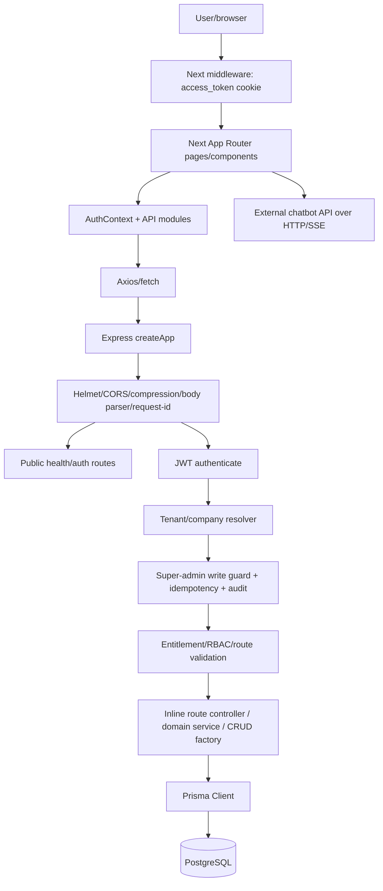
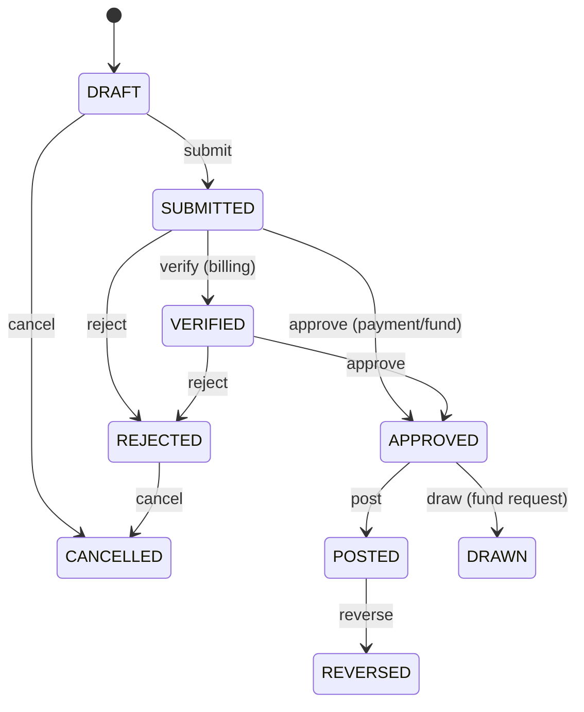
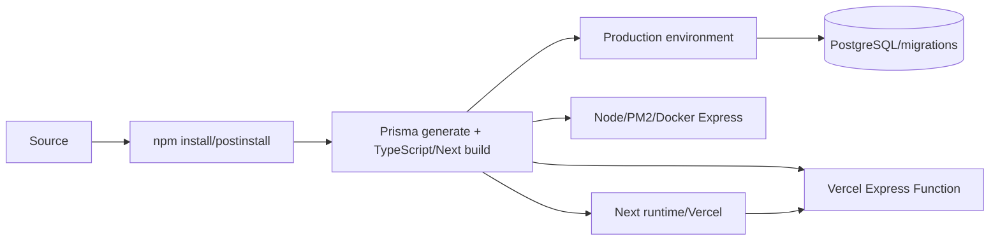

# System Documentation

Dokumen ini adalah **Single Source of Truth teknis AS-IS** untuk backend Express dan frontend Next pada repository ini. Ini bukan README. Dokumentasi database terpisah tersedia di [Database Documentation](./DATABASE_DOCUMENTATION.md). Audit dilakukan terhadap implementasi source, konfigurasi, route, middleware, service, schema, migration, seed, frontend, test, dan deployment yang tersimpan di repository. Secret tidak direproduksi.

## Status legend

- **IMPLEMENTED** — ditemukan dan digunakan pada source/config.
- **PARTIALLY IMPLEMENTED** — sebagian flow ada, tetapi ada jalur/kontrak yang belum konsisten.
- **NOT IMPLEMENTED / NOT FOUND** — tidak ditemukan di repository.
- **UNKNOWN** — tidak dapat dibuktikan dari source saja.
- **TECHNICAL DEBT / POTENTIAL ISSUE** — implementasi ada tetapi memiliki risiko handover/operasi.

## 1. Project Overview

Aplikasi adalah ERP multi-modul Marka+/Arsalynk (nama branding muncul tidak seragam di source) untuk pengelolaan company, IAM, CRM, sales, project, finance/accounting, procurement, inventory, manufacturing, quality, assets, service, logistics, implementation, request, reporting, dan dashboard. Pengguna aktual yang dimodelkan meliputi Super Admin, Company Admin, finance/director, PM, CRM/sales dan staff domain lain.

| Lapisan | Teknologi/implementasi |
|---|---|
| Frontend | Next.js 14 App Router, React 18, TypeScript, Tailwind CSS, Axios, React Hook Form/Zod, Recharts |
| Backend | Node.js >=20, Express 4, TypeScript, Zod, JWT, bcrypt, Prisma |
| Database | PostgreSQL; 252 model Prisma (lihat dokumen database) |
| Authentication | JWT access + refresh; token frontend juga disalin ke cookie untuk middleware navigasi |
| Authorization | role-code/RBAC, permission catalog, module entitlement, tenant/company scope, Super Admin read-only lintas company |
| External service | Chatbot/RAG HTTP+SSE dari frontend melalui `NEXT_PUBLIC_CHATBOT_API_URL` |
| Storage | Tidak ada provider storage backend Express yang ditemukan; upload knowledge dilakukan langsung frontend ke chatbot service eksternal |
| Queue/worker | **NOT FOUND**; semua flow terlihat synchronous/request-driven |
| Runtime/deploy | Backend: local Node, Docker, PM2, atau Vercel Function; frontend: Next build/start dan cocok untuk Vercel |

## 2. System Architecture



### Request dan response flow

1. Next middleware mengecek cookie `access_token` untuk navigasi. Ini bukan validasi kriptografis; backend tetap menjadi trust boundary.
2. Frontend `lib/api/axios.ts` mengambil access token dan company ID dari localStorage, menambahkan Bearer token, `X-Company-ID`, dan idempotency key pada mutation.
3. Express memasang security/common middleware, public routes, lalu authenticated pipeline.
4. `authenticate` memverifikasi JWT dan memuat user aktif serta access context terbaru dari database.
5. `resolveTenant` memaksa user biasa pada satu company; Super Admin dapat memakai konteks lintas-company untuk read atau company eksplisit untuk mutation.
6. Entitlement/RBAC/SoD/validator membatasi route. Route kemudian memakai service domain atau Prisma langsung; generic resources memakai `createCrudRouter`.
7. Response sukses memakai helper `sendSuccess` pada banyak route, tetapi sebagian route mengirim `res.json` langsung. Error diteruskan ke global error handler.

### Authentication flow

```mermaid
sequenceDiagram
 participant B as Browser
 participant N as Next UI/AuthContext
 participant A as Express auth routes
 participant D as PostgreSQL
 B->>N: email/password
 N->>A: POST login
 A->>D: cari user + role/company/module context
 A->>A: bcrypt verify; sign access/refresh JWT
 A-->>N: token + identity/access payload
 N->>N: localStorage + access_token cookie
 N->>A: Bearer access + optional X-Company-ID
 A->>D: reload active identity/access context
 A-->>N: protected response
 N->>A: refresh JWT after 401 (mutex)
```

Logout pada frontend membersihkan local state/cookie; kemampuan revocation server-side harus dilihat dari endpoint auth aktual dan tidak boleh diasumsikan sebagai session store. Password di-hash dengan bcrypt. Refresh menggunakan `/api/v1/auth/token/refresh/`.

### Authorization dan tenant flow

- Role menggunakan role code (enum aplikasi `RoleCode`); permission dan enabled module dimuat oleh `access-context.service.ts`.
- User non-super hanya mempunyai satu company efektif; forged `X-Company-ID` ditolak.
- Super Admin dapat membaca seluruh company, tetapi mutation operasional diblokir tanpa/di luar company eksplisit; pengelolaan company/Company Admin tetap jalur administratif.
- Company Admin mengelola user/role/permission dalam company-nya, terbatas pada module yang sudah diaktifkan Super Admin.
- Middleware entitlement dipasang pada module router tertentu; endpoint yang tidak melewatinya harus dianggap risiko dan diperiksa pada tabel route.

### Error, audit, dan idempotency flow

Mutation pada root bisnis yang dikonfigurasi wajib membawa `Idempotency-Key` 16–128 karakter. Middleware menyimpan hash request/response pada `core_idempotency_key`, mereplay request selesai, menolak key dengan payload berbeda, dan menunggu singkat request yang masih diproses. Middleware audit mencatat mutation (kecuali login/signup/token) ke `core_audit_event`, menyensor key sensitif, dan menghubungkan `request_id`. Prisma error dikenal dipetakan ke 400/404/409; Zod/validation ke 400; error tak dikenal menjadi 500 tanpa detail internal di production.

### External/file/notification flow

Frontend chatbot memanggil service eksternal langsung, termasuk SSE chat, conversation, knowledge ingestion/search, dan multipart upload. Backend Express tidak menjadi proxy dan tidak memiliki storage upload/provider notification/queue yang ditemukan. Email/WhatsApp notification runtime **NOT FOUND**.

## 3. Complete Repository Structure

Cakupan hanya `backend-express/` dan `frontend-next/`; artifact generated `node_modules`, `.next`, dan `dist` tidak didokumentasikan file-per-file.

```text
backend-express/
├── api/                     # adapter Vercel serverless
├── prisma/                  # schema, migration SQL, seed
├── scripts/                 # audit, backup, seed, repair, sync
├── src/
│   ├── config/              # environment dan Prisma
│   ├── middleware(s)/       # request governance
│   ├── modules/             # accounts dan domain ERP
│   ├── types/               # role dan Express augmentation
│   ├── utils/               # CRUD, JWT, password, response, FSM
│   ├── workflows/           # workflow default/tenant-specific
│   ├── app.ts               # Express factory
│   └── server.ts            # process entry
├── tests/                   # Q6/Q7 integration tests
└── package/config/deploy files
frontend-next/
├── app/                     # App Router pages/layouts
├── components/              # administration, finance, requests, shell, UI
├── contexts/                # authentication state
├── lib/api/                 # backend API clients
├── services/                # external chatbot client
├── types/                   # frontend contracts
├── public/                  # static assets
├── middleware.tsx           # navigation guard
└── package/build/style config
```

## 4. Backend Architecture

### Entry points dan dependency flow

- `src/server.ts`: membuat app, membuka Prisma, listen pada `env.PORT`, dan disconnect pada SIGINT/SIGTERM.
- `src/app.ts`: factory `createApp`; urutan middleware adalah bagian security boundary.
- `api/index.js`: memuat compiled `dist/app` dan mengekspor Express untuk Vercel tanpa `listen`.
- Tidak ada controller/repository directory terpisah. Controller banyak berupa handler inline pada route; service hanya pada domain kompleks. Data access umumnya service/handler → Prisma.

### Middleware order

| Urutan | Komponen | Tanggung jawab/side effect |
|---:|---|---|
| 1 | helmet, CORS, compression, body parsers | HTTP headers, origin policy, compression, JSON/urlencoded limit 10 MB |
| 2 | request ID + Morgan | menerima/membuat correlation ID; access log |
| 3 | health + public auth/account mount | endpoint yang harus bisa dicapai tanpa JWT |
| 4 | authenticate | verify JWT, active user, fresh role/company/module context |
| 5 | resolveTenant | company scope dan forged-header prevention |
| 6 | Super Admin write guard | mencegah mutation operasional lintas-company |
| 7 | idempotency | deduplicate/replay mutation bisnis |
| 8 | audit | persist audit event setelah response mutation |
| 9 | entitlement/RBAC + module routes | module access dan role policy |
| 10 | notFound/errorHandler | format 404/error akhir |

### Generic CRUD contract

Setiap resource yang diregistrasikan dengan `createCrudRouter` memiliki:

| Method | Suffix | Purpose | Request/response dan side effect |
|---|---|---|---|
| GET | `/metadata` | Prisma field metadata | no mutation |
| POST | `/bulk` | bulk create/update/delete sesuai action payload | database mutation; scope dan terminal-state guard berlaku |
| GET | `/` | list/search/filter/order/pagination | `page`, `page_size`, filter field; company/tenant scope ditambahkan |
| POST | `/` | create | input difilter terhadap field Prisma; required-field autofill dapat berlaku |
| GET | `/:id` | detail | scoped lookup, 404 bila tidak ada |
| PUT | `/:id` | replace-style update | mutation scoped; status terminal finance dapat diblokir |
| PATCH | `/:id` | partial update | mutation scoped; status terminal finance dapat diblokir |
| DELETE | `/:id` | hard delete | mutation scoped; FK/policy dapat menolak |

Response list/pagination dan error mengikuti helper/global handler sejauh route tidak melakukan response custom. Seluruh mutation root bisnis yang dicakup idempotency membutuhkan header terkait.

## 5. API Documentation

Base path adalah `/api/v1`, kecuali `/health`. **Auth default** setelah public mounts adalah Bearer JWT; tabel mencatat policy tambahan yang dapat dideteksi. Trailing slash umumnya diterima Express.

### Custom endpoints

| Method | Endpoint | Auth | Permission/policy | Source | Purpose/processing |
|---|---|---|---|---|---|
| GET | `/health` | Public | none | `backend-express/src/app.ts` | Liveness response; tidak memerlukan database query eksplisit. |
| PATCH | `/api/v1/accounts/active-role` | JWT/default pipeline | global mount policy | `backend-express/src/modules/accounts/accounts.routes.ts` | Handler memvalidasi request/context, menjalankan operasi route/service aktual, menyentuh Prisma bila diperlukan, lalu mengirim response atau meneruskan error. |
| POST | `/api/v1/accounts/active-role` | JWT/default pipeline | global mount policy | `backend-express/src/modules/accounts/accounts.routes.ts` | Handler memvalidasi request/context, menjalankan operasi route/service aktual, menyentuh Prisma bila diperlukan, lalu mengirim response atau meneruskan error. |
| PATCH | `/api/v1/accounts/auth/active-role` | JWT/default pipeline | global mount policy | `backend-express/src/modules/accounts/accounts.routes.ts` | Handler memvalidasi request/context, menjalankan operasi route/service aktual, menyentuh Prisma bila diperlukan, lalu mengirim response atau meneruskan error. |
| POST | `/api/v1/accounts/auth/active-role` | JWT/default pipeline | global mount policy | `backend-express/src/modules/accounts/accounts.routes.ts` | Handler memvalidasi request/context, menjalankan operasi route/service aktual, menyentuh Prisma bila diperlukan, lalu mengirim response atau meneruskan error. |
| POST | `/api/v1/accounts/auth/login` | JWT/default pipeline | global mount policy | `backend-express/src/modules/accounts/accounts.routes.ts` | Handler memvalidasi request/context, menjalankan operasi route/service aktual, menyentuh Prisma bila diperlukan, lalu mengirim response atau meneruskan error. |
| GET | `/api/v1/accounts/auth/me` | JWT/default pipeline | global mount policy | `backend-express/src/modules/accounts/accounts.routes.ts` | Handler memvalidasi request/context, menjalankan operasi route/service aktual, menyentuh Prisma bila diperlukan, lalu mengirim response atau meneruskan error. |
| POST | `/api/v1/accounts/auth/refresh` | JWT/default pipeline | global mount policy | `backend-express/src/modules/accounts/accounts.routes.ts` | Handler memvalidasi request/context, menjalankan operasi route/service aktual, menyentuh Prisma bila diperlukan, lalu mengirim response atau meneruskan error. |
| POST | `/api/v1/accounts/change-password` | JWT/default pipeline | global mount policy | `backend-express/src/modules/accounts/accounts.routes.ts` | Handler memvalidasi request/context, menjalankan operasi route/service aktual, menyentuh Prisma bila diperlukan, lalu mengirim response atau meneruskan error. |
| GET | `/api/v1/accounts/me` | JWT/default pipeline | global mount policy | `backend-express/src/modules/accounts/accounts.routes.ts` | Handler memvalidasi request/context, menjalankan operasi route/service aktual, menyentuh Prisma bila diperlukan, lalu mengirim response atau meneruskan error. |
| POST | `/api/v1/accounts/update-profile` | JWT/default pipeline | global mount policy | `backend-express/src/modules/accounts/accounts.routes.ts` | Handler memvalidasi request/context, menjalankan operasi route/service aktual, menyentuh Prisma bila diperlukan, lalu mengirim response atau meneruskan error. |
| POST | `/api/v1/analytics/alerts/evaluate` | JWT/default pipeline | global mount policy | `backend-express/src/modules/analytics/analytics.routes.ts` | Handler memvalidasi request/context, menjalankan operasi route/service aktual, menyentuh Prisma bila diperlukan, lalu mengirim response atau meneruskan error. |
| POST | `/api/v1/analytics/kpis/recalculate` | JWT/default pipeline | global mount policy | `backend-express/src/modules/analytics/analytics.routes.ts` | Handler memvalidasi request/context, menjalankan operasi route/service aktual, menyentuh Prisma bila diperlukan, lalu mengirim response atau meneruskan error. |
| POST | `/api/v1/assets/assets/:id/depreciate` | JWT/default pipeline | requireFinanceRole([RoleCode.FINANCE, RoleCode.DIRECTOR]) | `backend-express/src/modules/assets/assets.routes.ts` | Handler memvalidasi request/context, menjalankan operasi route/service aktual, menyentuh Prisma bila diperlukan, lalu mengirim response atau meneruskan error. |
| GET | `/api/v1/assets/assets/:id/depreciation-schedule` | JWT/default pipeline | requireFinanceRole([RoleCode.FINANCE, RoleCode.DIRECTOR]) | `backend-express/src/modules/assets/assets.routes.ts` | Handler memvalidasi request/context, menjalankan operasi route/service aktual, menyentuh Prisma bila diperlukan, lalu mengirim response atau meneruskan error. |
| POST | `/api/v1/assets/assets/:id/dispose` | JWT/default pipeline | requireFinanceRole([RoleCode.FINANCE, RoleCode.DIRECTOR]) | `backend-express/src/modules/assets/assets.routes.ts` | Handler memvalidasi request/context, menjalankan operasi route/service aktual, menyentuh Prisma bila diperlukan, lalu mengirim response atau meneruskan error. |
| POST | `/api/v1/assets/assets/batch-depreciate` | JWT/default pipeline | requireFinanceRole([RoleCode.FINANCE, RoleCode.DIRECTOR]) | `backend-express/src/modules/assets/assets.routes.ts` | Handler memvalidasi request/context, menjalankan operasi route/service aktual, menyentuh Prisma bila diperlukan, lalu mengirim response atau meneruskan error. |
| PATCH | `/api/v1/auth/active-role` | JWT/default pipeline | global mount policy | `backend-express/src/modules/accounts/accounts.routes.ts` | Handler memvalidasi request/context, menjalankan operasi route/service aktual, menyentuh Prisma bila diperlukan, lalu mengirim response atau meneruskan error. |
| POST | `/api/v1/auth/active-role` | JWT/default pipeline | global mount policy | `backend-express/src/modules/accounts/accounts.routes.ts` | Handler memvalidasi request/context, menjalankan operasi route/service aktual, menyentuh Prisma bila diperlukan, lalu mengirim response atau meneruskan error. |
| POST | `/api/v1/auth/change-password` | JWT/default pipeline | global mount policy | `backend-express/src/modules/accounts/accounts.routes.ts` | Handler memvalidasi request/context, menjalankan operasi route/service aktual, menyentuh Prisma bila diperlukan, lalu mengirim response atau meneruskan error. |
| POST | `/api/v1/auth/logout` | JWT/default pipeline | global mount policy | `backend-express/src/modules/accounts/accounts.routes.ts` | Handler memvalidasi request/context, menjalankan operasi route/service aktual, menyentuh Prisma bila diperlukan, lalu mengirim response atau meneruskan error. |
| GET | `/api/v1/auth/me` | JWT/default pipeline | global mount policy | `backend-express/src/modules/accounts/accounts.routes.ts` | Handler memvalidasi request/context, menjalankan operasi route/service aktual, menyentuh Prisma bila diperlukan, lalu mengirim response atau meneruskan error. |
| PATCH | `/api/v1/auth/profile` | JWT/default pipeline | global mount policy | `backend-express/src/modules/accounts/accounts.routes.ts` | Handler memvalidasi request/context, menjalankan operasi route/service aktual, menyentuh Prisma bila diperlukan, lalu mengirim response atau meneruskan error. |
| POST | `/api/v1/auth/token` | Public | global mount policy | `backend-express/src/modules/accounts/accounts.routes.ts` | Handler memvalidasi request/context, menjalankan operasi route/service aktual, menyentuh Prisma bila diperlukan, lalu mengirim response atau meneruskan error. |
| POST | `/api/v1/auth/token/refresh` | Public | global mount policy | `backend-express/src/modules/accounts/accounts.routes.ts` | Handler memvalidasi request/context, menjalankan operasi route/service aktual, menyentuh Prisma bila diperlukan, lalu mengirim response atau meneruskan error. |
| POST | `/api/v1/auth/token/verify` | JWT/default pipeline | global mount policy | `backend-express/src/modules/accounts/accounts.routes.ts` | Handler memvalidasi request/context, menjalankan operasi route/service aktual, menyentuh Prisma bila diperlukan, lalu mengirim response atau meneruskan error. |
| POST | `/api/v1/auth/update-profile` | JWT/default pipeline | global mount policy | `backend-express/src/modules/accounts/accounts.routes.ts` | Handler memvalidasi request/context, menjalankan operasi route/service aktual, menyentuh Prisma bila diperlukan, lalu mengirim response atau meneruskan error. |
| POST | `/api/v1/commands/core/documents/:id/approve` | JWT/default pipeline | global mount policy | `backend-express/src/modules/commands/commands.routes.ts` | Handler memvalidasi request/context, menjalankan operasi route/service aktual, menyentuh Prisma bila diperlukan, lalu mengirim response atau meneruskan error. |
| POST | `/api/v1/commands/core/documents/:id/cancel` | JWT/default pipeline | global mount policy | `backend-express/src/modules/commands/commands.routes.ts` | Handler memvalidasi request/context, menjalankan operasi route/service aktual, menyentuh Prisma bila diperlukan, lalu mengirim response atau meneruskan error. |
| GET | `/api/v1/commands/core/documents/:id/history` | JWT/default pipeline | global mount policy | `backend-express/src/modules/commands/commands.routes.ts` | Handler memvalidasi request/context, menjalankan operasi route/service aktual, menyentuh Prisma bila diperlukan, lalu mengirim response atau meneruskan error. |
| POST | `/api/v1/commands/core/documents/:id/post` | JWT/default pipeline | global mount policy | `backend-express/src/modules/commands/commands.routes.ts` | Handler memvalidasi request/context, menjalankan operasi route/service aktual, menyentuh Prisma bila diperlukan, lalu mengirim response atau meneruskan error. |
| POST | `/api/v1/commands/core/documents/:id/reject` | JWT/default pipeline | global mount policy | `backend-express/src/modules/commands/commands.routes.ts` | Handler memvalidasi request/context, menjalankan operasi route/service aktual, menyentuh Prisma bila diperlukan, lalu mengirim response atau meneruskan error. |
| POST | `/api/v1/commands/core/documents/:id/reverse` | JWT/default pipeline | global mount policy | `backend-express/src/modules/commands/commands.routes.ts` | Handler memvalidasi request/context, menjalankan operasi route/service aktual, menyentuh Prisma bila diperlukan, lalu mengirim response atau meneruskan error. |
| POST | `/api/v1/commands/core/documents/:id/submit` | JWT/default pipeline | global mount policy | `backend-express/src/modules/commands/commands.routes.ts` | Handler memvalidasi request/context, menjalankan operasi route/service aktual, menyentuh Prisma bila diperlukan, lalu mengirim response atau meneruskan error. |
| GET | `/api/v1/commands/finance/flow-status` | JWT/default pipeline | requireRole(RoleCode.CRM_LEAD, RoleCode.SALES, RoleCode.PROJECT_MANAGER, RoleCode.DIRECTOR) | `backend-express/src/modules/commands/commands.routes.ts` | Handler memvalidasi request/context, menjalankan operasi route/service aktual, menyentuh Prisma bila diperlukan, lalu mengirim response atau meneruskan error. |
| POST | `/api/v1/commands/finance/journal-entries/:id/post` | JWT/default pipeline | global mount policy | `backend-express/src/modules/commands/commands.routes.ts` | Handler memvalidasi request/context, menjalankan operasi route/service aktual, menyentuh Prisma bila diperlukan, lalu mengirim response atau meneruskan error. |
| POST | `/api/v1/commands/projects/projects/:id/close` | JWT/default pipeline | global mount policy | `backend-express/src/modules/commands/commands.routes.ts` | Handler memvalidasi request/context, menjalankan operasi route/service aktual, menyentuh Prisma bila diperlukan, lalu mengirim response atau meneruskan error. |
| GET | `/api/v1/commands/projects/projects/:id/costs` | JWT/default pipeline | global mount policy | `backend-express/src/modules/commands/commands.routes.ts` | Handler memvalidasi request/context, menjalankan operasi route/service aktual, menyentuh Prisma bila diperlukan, lalu mengirim response atau meneruskan error. |
| GET | `/api/v1/commands/projects/projects/:id/flow-status` | JWT/default pipeline | global mount policy | `backend-express/src/modules/commands/commands.routes.ts` | Handler memvalidasi request/context, menjalankan operasi route/service aktual, menyentuh Prisma bila diperlukan, lalu mengirim response atau meneruskan error. |
| GET | `/api/v1/commands/projects/projects/:id/health` | JWT/default pipeline | global mount policy | `backend-express/src/modules/commands/commands.routes.ts` | Handler memvalidasi request/context, menjalankan operasi route/service aktual, menyentuh Prisma bila diperlukan, lalu mengirim response atau meneruskan error. |
| POST | `/api/v1/commands/projects/projects/:id/start` | JWT/default pipeline | global mount policy | `backend-express/src/modules/commands/commands.routes.ts` | Handler memvalidasi request/context, menjalankan operasi route/service aktual, menyentuh Prisma bila diperlukan, lalu mengirim response atau meneruskan error. |
| GET | `/api/v1/commands/reporting/crm-sales-dashboard` | JWT/default pipeline | requireRole(RoleCode.CRM_LEAD, RoleCode.SALES, RoleCode.PROJECT_MANAGER, RoleCode.DIRECTOR) | `backend-express/src/modules/commands/commands.routes.ts` | Handler memvalidasi request/context, menjalankan operasi route/service aktual, menyentuh Prisma bila diperlukan, lalu mengirim response atau meneruskan error. |
| GET | `/api/v1/commands/reporting/finance-main-dashboard` | JWT/default pipeline | requireRole(RoleCode.FINANCE, RoleCode.DIRECTOR) | `backend-express/src/modules/commands/commands.routes.ts` | Handler memvalidasi request/context, menjalankan operasi route/service aktual, menyentuh Prisma bila diperlukan, lalu mengirim response atau meneruskan error. |
| GET | `/api/v1/commands/reporting/portfolio-financial-performance` | JWT/default pipeline | requireRole(RoleCode.PROJECT_MANAGER, RoleCode.OPERATIONAL_MANAGER, RoleCode.DIRECTOR, RoleCode.FINANCE) | `backend-express/src/modules/commands/commands.routes.ts` | Handler memvalidasi request/context, menjalankan operasi route/service aktual, menyentuh Prisma bila diperlukan, lalu mengirim response atau meneruskan error. |
| POST | `/api/v1/commands/sales/quotations/:id/convert-to-order` | JWT/default pipeline | global mount policy | `backend-express/src/modules/commands/commands.routes.ts` | Handler memvalidasi request/context, menjalankan operasi route/service aktual, menyentuh Prisma bila diperlukan, lalu mengirim response atau meneruskan error. |
| POST | `/api/v1/commands/workflow/execute/:module/:document_id` | JWT/default pipeline | global mount policy | `backend-express/src/modules/commands/commands.routes.ts` | Handler memvalidasi request/context, menjalankan operasi route/service aktual, menyentuh Prisma bila diperlukan, lalu mengirim response atau meneruskan error. |
| GET | `/api/v1/commands/workflow/registry` | JWT/default pipeline | global mount policy | `backend-express/src/modules/commands/commands.routes.ts` | Handler memvalidasi request/context, menjalankan operasi route/service aktual, menyentuh Prisma bila diperlukan, lalu mengirim response atau meneruskan error. |
| GET | `/api/v1/commands/workflow/transitions/:module/:document_id` | JWT/default pipeline | global mount policy | `backend-express/src/modules/commands/commands.routes.ts` | Handler memvalidasi request/context, menjalankan operasi route/service aktual, menyentuh Prisma bila diperlukan, lalu mengirim response atau meneruskan error. |
| GET | `/api/v1/core/companies/:id/modules` | JWT/default pipeline | global mount policy | `backend-express/src/modules/core/core.routes.ts` | Handler memvalidasi request/context, menjalankan operasi route/service aktual, menyentuh Prisma bila diperlukan, lalu mengirim response atau meneruskan error. |
| PATCH | `/api/v1/core/companies/:id/modules/:moduleCode` | JWT/default pipeline | global mount policy | `backend-express/src/modules/core/core.routes.ts` | Handler memvalidasi request/context, menjalankan operasi route/service aktual, menyentuh Prisma bila diperlukan, lalu mengirim response atau meneruskan error. |
| PUT | `/api/v1/core/companies/:id/modules/:moduleCode` | JWT/default pipeline | global mount policy | `backend-express/src/modules/core/core.routes.ts` | Handler memvalidasi request/context, menjalankan operasi route/service aktual, menyentuh Prisma bila diperlukan, lalu mengirim response atau meneruskan error. |
| GET | `/api/v1/core/company-modules/my-modules` | JWT/default pipeline | global mount policy | `backend-express/src/modules/core/core.routes.ts` | Handler memvalidasi request/context, menjalankan operasi route/service aktual, menyentuh Prisma bila diperlukan, lalu mengirim response atau meneruskan error. |
| GET | `/api/v1/core/recent-items` | JWT/default pipeline | global mount policy | `backend-express/src/modules/core/core.routes.ts` | Handler memvalidasi request/context, menjalankan operasi route/service aktual, menyentuh Prisma bila diperlukan, lalu mengirim response atau meneruskan error. |
| POST | `/api/v1/core/recent-items/track` | JWT/default pipeline | global mount policy | `backend-express/src/modules/core/core.routes.ts` | Handler memvalidasi request/context, menjalankan operasi route/service aktual, menyentuh Prisma bila diperlukan, lalu mengirim response atau meneruskan error. |
| GET | `/api/v1/core/sidebar-feed` | JWT/default pipeline | global mount policy | `backend-express/src/modules/core/core.routes.ts` | Handler memvalidasi request/context, menjalankan operasi route/service aktual, menyentuh Prisma bila diperlukan, lalu mengirim response atau meneruskan error. |
| POST | `/api/v1/core/sidebar-feed/mark-read` | JWT/default pipeline | global mount policy | `backend-express/src/modules/core/core.routes.ts` | Handler memvalidasi request/context, menjalankan operasi route/service aktual, menyentuh Prisma bila diperlukan, lalu mengirim response atau meneruskan error. |
| POST | `/api/v1/core/track-recent` | JWT/default pipeline | global mount policy | `backend-express/src/modules/core/core.routes.ts` | Handler memvalidasi request/context, menjalankan operasi route/service aktual, menyentuh Prisma bila diperlukan, lalu mengirim response atau meneruskan error. |
| POST | `/api/v1/crm/cost-estimates/:id/calculate` | JWT/default pipeline | global mount policy | `backend-express/src/modules/crm/crm.routes.ts` | Handler memvalidasi request/context, menjalankan operasi route/service aktual, menyentuh Prisma bila diperlukan, lalu mengirim response atau meneruskan error. |
| POST | `/api/v1/crm/cost-estimates/:id/create-quotation` | JWT/default pipeline | global mount policy | `backend-express/src/modules/crm/crm.routes.ts` | Handler memvalidasi request/context, menjalankan operasi route/service aktual, menyentuh Prisma bila diperlukan, lalu mengirim response atau meneruskan error. |
| POST | `/api/v1/crm/credit-status-snapshots/calculate` | JWT/default pipeline | global mount policy | `backend-express/src/modules/crm/crm.routes.ts` | Handler memvalidasi request/context, menjalankan operasi route/service aktual, menyentuh Prisma bila diperlukan, lalu mengirim response atau meneruskan error. |
| POST | `/api/v1/crm/customer-inquiries/:id/qualify` | JWT/default pipeline | global mount policy | `backend-express/src/modules/crm/crm.routes.ts` | Handler memvalidasi request/context, menjalankan operasi route/service aktual, menyentuh Prisma bila diperlukan, lalu mengirim response atau meneruskan error. |
| POST | `/api/v1/crm/executive-approvals/:id/approve` | JWT/default pipeline | global mount policy | `backend-express/src/modules/crm/crm.routes.ts` | Handler memvalidasi request/context, menjalankan operasi route/service aktual, menyentuh Prisma bila diperlukan, lalu mengirim response atau meneruskan error. |
| POST | `/api/v1/crm/executive-approvals/:id/decide` | JWT/default pipeline | global mount policy | `backend-express/src/modules/crm/crm.routes.ts` | Handler memvalidasi request/context, menjalankan operasi route/service aktual, menyentuh Prisma bila diperlukan, lalu mengirim response atau meneruskan error. |
| POST | `/api/v1/crm/executive-approvals/:id/reject` | JWT/default pipeline | global mount policy | `backend-express/src/modules/crm/crm.routes.ts` | Handler memvalidasi request/context, menjalankan operasi route/service aktual, menyentuh Prisma bila diperlukan, lalu mengirim response atau meneruskan error. |
| GET | `/api/v1/crm/opportunities/:id/customer-360` | JWT/default pipeline | global mount policy | `backend-express/src/modules/crm/crm.routes.ts` | Handler memvalidasi request/context, menjalankan operasi route/service aktual, menyentuh Prisma bila diperlukan, lalu mengirim response atau meneruskan error. |
| POST | `/api/v1/crm/opportunities/:id/executive-override` | JWT/default pipeline | global mount policy | `backend-express/src/modules/crm/crm.routes.ts` | Handler memvalidasi request/context, menjalankan operasi route/service aktual, menyentuh Prisma bila diperlukan, lalu mengirim response atau meneruskan error. |
| POST | `/api/v1/crm/opportunities/:id/process-deal-won` | JWT/default pipeline | global mount policy | `backend-express/src/modules/crm/crm.routes.ts` | Handler memvalidasi request/context, menjalankan operasi route/service aktual, menyentuh Prisma bila diperlukan, lalu mengirim response atau meneruskan error. |
| GET | `/api/v1/finance/accounts/:id/balance` | JWT/default pipeline | global mount policy | `backend-express/src/modules/finance/finance.routes.ts` | Handler memvalidasi request/context, menjalankan operasi route/service aktual, menyentuh Prisma bila diperlukan, lalu mengirim response atau meneruskan error. |
| POST | `/api/v1/finance/accounts/setup-standard` | JWT/default pipeline | global mount policy | `backend-express/src/modules/finance/finance.routes.ts` | Handler memvalidasi request/context, menjalankan operasi route/service aktual, menyentuh Prisma bila diperlukan, lalu mengirim response atau meneruskan error. |
| GET | `/api/v1/finance/audit-trail` | JWT/default pipeline | global mount policy | `backend-express/src/modules/finance/finance.routes.ts` | Handler memvalidasi request/context, menjalankan operasi route/service aktual, menyentuh Prisma bila diperlukan, lalu mengirim response atau meneruskan error. |
| GET | `/api/v1/finance/balance-sheet` | JWT/default pipeline | requireFinanceRole([RoleCode.FINANCE]) | `backend-express/src/modules/finance/finance.routes.ts` | Handler memvalidasi request/context, menjalankan operasi route/service aktual, menyentuh Prisma bila diperlukan, lalu mengirim response atau meneruskan error. |
| GET | `/api/v1/finance/bank-accounts/:id/balance` | JWT/default pipeline | global mount policy | `backend-express/src/modules/finance/finance.routes.ts` | Handler memvalidasi request/context, menjalankan operasi route/service aktual, menyentuh Prisma bila diperlukan, lalu mengirim response atau meneruskan error. |
| POST | `/api/v1/finance/bank-accounts/:id/import-csv` | JWT/default pipeline | global mount policy | `backend-express/src/modules/finance/finance.routes.ts` | Handler memvalidasi request/context, menjalankan operasi route/service aktual, menyentuh Prisma bila diperlukan, lalu mengirim response atau meneruskan error. |
| POST | `/api/v1/finance/bank-accounts/:id/import-statement` | JWT/default pipeline | requireFinanceRole([RoleCode.FINANCE]) | `backend-express/src/modules/finance/finance.routes.ts` | Handler memvalidasi request/context, menjalankan operasi route/service aktual, menyentuh Prisma bila diperlukan, lalu mengirim response atau meneruskan error. |
| POST | `/api/v1/finance/bank-accounts/internal-transfer` | JWT/default pipeline | requireFinanceRole([RoleCode.FINANCE]) | `backend-express/src/modules/finance/finance.routes.ts` | Handler memvalidasi request/context, menjalankan operasi route/service aktual, menyentuh Prisma bila diperlukan, lalu mengirim response atau meneruskan error. |
| POST | `/api/v1/finance/bank-statement-lines/:id/reconcile` | JWT/default pipeline | requireFinanceRole([RoleCode.FINANCE]) | `backend-express/src/modules/finance/finance.routes.ts` | Handler memvalidasi request/context, menjalankan operasi route/service aktual, menyentuh Prisma bila diperlukan, lalu mengirim response atau meneruskan error. |
| POST | `/api/v1/finance/billing-documents/:id/approve` | JWT/default pipeline | requireFinanceRole([RoleCode.FINANCE, RoleCode.DIRECTOR]) | `backend-express/src/modules/finance/finance.routes.ts` | Handler memvalidasi request/context, menjalankan operasi route/service aktual, menyentuh Prisma bila diperlukan, lalu mengirim response atau meneruskan error. |
| POST | `/api/v1/finance/billing-documents/:id/post` | JWT/default pipeline | requireFinanceRole([RoleCode.FINANCE]) | `backend-express/src/modules/finance/finance.routes.ts` | Handler memvalidasi request/context, menjalankan operasi route/service aktual, menyentuh Prisma bila diperlukan, lalu mengirim response atau meneruskan error. |
| POST | `/api/v1/finance/billing-documents/:id/reject` | JWT/default pipeline | global mount policy | `backend-express/src/modules/finance/finance.routes.ts` | Handler memvalidasi request/context, menjalankan operasi route/service aktual, menyentuh Prisma bila diperlukan, lalu mengirim response atau meneruskan error. |
| POST | `/api/v1/finance/billing-documents/:id/verify` | JWT/default pipeline | requireFinanceRole([RoleCode.FINANCE]) | `backend-express/src/modules/finance/finance.routes.ts` | Handler memvalidasi request/context, menjalankan operasi route/service aktual, menyentuh Prisma bila diperlukan, lalu mengirim response atau meneruskan error. |
| GET | `/api/v1/finance/executive-audit-report` | JWT/default pipeline | global mount policy | `backend-express/src/modules/finance/finance.routes.ts` | Handler memvalidasi request/context, menjalankan operasi route/service aktual, menyentuh Prisma bila diperlukan, lalu mengirim response atau meneruskan error. |
| POST | `/api/v1/finance/fiscal-periods/:id/close` | JWT/default pipeline | requireFinanceRole([RoleCode.FINANCE, RoleCode.DIRECTOR]) | `backend-express/src/modules/finance/finance.routes.ts` | Handler memvalidasi request/context, menjalankan operasi route/service aktual, menyentuh Prisma bila diperlukan, lalu mengirim response atau meneruskan error. |
| POST | `/api/v1/finance/fiscal-periods/:id/reopen` | JWT/default pipeline | requireFinanceRole([RoleCode.FINANCE, RoleCode.DIRECTOR]) | `backend-express/src/modules/finance/finance.routes.ts` | Handler memvalidasi request/context, menjalankan operasi route/service aktual, menyentuh Prisma bila diperlukan, lalu mengirim response atau meneruskan error. |
| GET | `/api/v1/finance/fiscal-periods/status` | JWT/default pipeline | requireFinanceRole([RoleCode.FINANCE, RoleCode.DIRECTOR]) | `backend-express/src/modules/finance/finance.routes.ts` | Handler memvalidasi request/context, menjalankan operasi route/service aktual, menyentuh Prisma bila diperlukan, lalu mengirim response atau meneruskan error. |
| POST | `/api/v1/finance/fiscal-years/:id/reopen-year-end` | JWT/default pipeline | requireSuperadmin() | `backend-express/src/modules/finance/finance.routes.ts` | Handler memvalidasi request/context, menjalankan operasi route/service aktual, menyentuh Prisma bila diperlukan, lalu mengirim response atau meneruskan error. |
| POST | `/api/v1/finance/fiscal-years/:id/year-end-closing` | JWT/default pipeline | requireFinanceRole([RoleCode.FINANCE, RoleCode.DIRECTOR]) | `backend-express/src/modules/finance/finance.routes.ts` | Handler memvalidasi request/context, menjalankan operasi route/service aktual, menyentuh Prisma bila diperlukan, lalu mengirim response atau meneruskan error. |
| POST | `/api/v1/finance/journal-entries/:id/post` | JWT/default pipeline | requireFinanceRole([RoleCode.FINANCE, RoleCode.DIRECTOR]) | `backend-express/src/modules/finance/finance.routes.ts` | Handler memvalidasi request/context, menjalankan operasi route/service aktual, menyentuh Prisma bila diperlukan, lalu mengirim response atau meneruskan error. |
| POST | `/api/v1/finance/journal-entries/:id/reverse` | JWT/default pipeline | requireFinanceRole([RoleCode.FINANCE, RoleCode.DIRECTOR]) | `backend-express/src/modules/finance/finance.routes.ts` | Handler memvalidasi request/context, menjalankan operasi route/service aktual, menyentuh Prisma bila diperlukan, lalu mengirim response atau meneruskan error. |
| POST | `/api/v1/finance/payments/:id/approve` | JWT/default pipeline | requireFinanceRole([RoleCode.FINANCE, RoleCode.DIRECTOR]) | `backend-express/src/modules/finance/finance.routes.ts` | Handler memvalidasi request/context, menjalankan operasi route/service aktual, menyentuh Prisma bila diperlukan, lalu mengirim response atau meneruskan error. |
| POST | `/api/v1/finance/payments/:id/execute` | JWT/default pipeline | global mount policy | `backend-express/src/modules/finance/finance.routes.ts` | Handler memvalidasi request/context, menjalankan operasi route/service aktual, menyentuh Prisma bila diperlukan, lalu mengirim response atau meneruskan error. |
| POST | `/api/v1/finance/payments/:id/submit` | JWT/default pipeline | requireFinanceRole([RoleCode.FINANCE, RoleCode.DIRECTOR]) | `backend-express/src/modules/finance/finance.routes.ts` | Handler memvalidasi request/context, menjalankan operasi route/service aktual, menyentuh Prisma bila diperlukan, lalu mengirim response atau meneruskan error. |
| POST | `/api/v1/finance/period-closings/:id/approve` | JWT/default pipeline | requireFinanceRole([RoleCode.FINANCE]) | `backend-express/src/modules/finance/finance.routes.ts` | Handler memvalidasi request/context, menjalankan operasi route/service aktual, menyentuh Prisma bila diperlukan, lalu mengirim response atau meneruskan error. |
| POST | `/api/v1/finance/period-closings/:id/execute` | JWT/default pipeline | requireFinanceRole([RoleCode.FINANCE, RoleCode.DIRECTOR]) | `backend-express/src/modules/finance/finance.routes.ts` | Handler memvalidasi request/context, menjalankan operasi route/service aktual, menyentuh Prisma bila diperlukan, lalu mengirim response atau meneruskan error. |
| POST | `/api/v1/finance/period-closings/request` | JWT/default pipeline | global mount policy | `backend-express/src/modules/finance/finance.routes.ts` | Handler memvalidasi request/context, menjalankan operasi route/service aktual, menyentuh Prisma bila diperlukan, lalu mengirim response atau meneruskan error. |
| GET | `/api/v1/finance/profit-and-loss` | JWT/default pipeline | global mount policy | `backend-express/src/modules/finance/finance.routes.ts` | Handler memvalidasi request/context, menjalankan operasi route/service aktual, menyentuh Prisma bila diperlukan, lalu mengirim response atau meneruskan error. |
| POST | `/api/v1/finance/project-fundings/:id/decide` | JWT/default pipeline | global mount policy | `backend-express/src/modules/finance/finance.routes.ts` | Handler memvalidasi request/context, menjalankan operasi route/service aktual, menyentuh Prisma bila diperlukan, lalu mengirim response atau meneruskan error. |
| POST | `/api/v1/finance/project-fundings/:id/draw` | JWT/default pipeline | global mount policy | `backend-express/src/modules/finance/finance.routes.ts` | Handler memvalidasi request/context, menjalankan operasi route/service aktual, menyentuh Prisma bila diperlukan, lalu mengirim response atau meneruskan error. |
| POST | `/api/v1/finance/projects/:id/capitalize-wip` | JWT/default pipeline | requireFinanceRole([RoleCode.FINANCE, RoleCode.DIRECTOR]) | `backend-express/src/modules/finance/finance.routes.ts` | Handler memvalidasi request/context, menjalankan operasi route/service aktual, menyentuh Prisma bila diperlukan, lalu mengirim response atau meneruskan error. |
| GET | `/api/v1/finance/tax-summary` | JWT/default pipeline | global mount policy | `backend-express/src/modules/finance/finance.routes.ts` | Handler memvalidasi request/context, menjalankan operasi route/service aktual, menyentuh Prisma bila diperlukan, lalu mengirim response atau meneruskan error. |
| POST | `/api/v1/finance/tax-transactions/:id/record-ntpn` | JWT/default pipeline | global mount policy | `backend-express/src/modules/finance/finance.routes.ts` | Handler memvalidasi request/context, menjalankan operasi route/service aktual, menyentuh Prisma bila diperlukan, lalu mengirim response atau meneruskan error. |
| GET | `/api/v1/finance/trial-balance` | JWT/default pipeline | global mount policy | `backend-express/src/modules/finance/finance.routes.ts` | Handler memvalidasi request/context, menjalankan operasi route/service aktual, menyentuh Prisma bila diperlukan, lalu mengirim response atau meneruskan error. |
| POST | `/api/v1/inventory/stock-moves/:id/complete` | JWT/default pipeline | global mount policy | `backend-express/src/modules/inventory/inventory.routes.ts` | Handler memvalidasi request/context, menjalankan operasi route/service aktual, menyentuh Prisma bila diperlukan, lalu mengirim response atau meneruskan error. |
| POST | `/api/v1/logistics/shipments/:id/proof-of-delivery` | JWT/default pipeline | global mount policy | `backend-express/src/modules/logistics/logistics.routes.ts` | Handler memvalidasi request/context, menjalankan operasi route/service aktual, menyentuh Prisma bila diperlukan, lalu mengirim response atau meneruskan error. |
| POST | `/api/v1/manufacturing/production-orders/:id/issue-materials` | JWT/default pipeline | global mount policy | `backend-express/src/modules/manufacturing/manufacturing.routes.ts` | Handler memvalidasi request/context, menjalankan operasi route/service aktual, menyentuh Prisma bila diperlukan, lalu mengirim response atau meneruskan error. |
| POST | `/api/v1/manufacturing/production-orders/:id/release` | JWT/default pipeline | global mount policy | `backend-express/src/modules/manufacturing/manufacturing.routes.ts` | Handler memvalidasi request/context, menjalankan operasi route/service aktual, menyentuh Prisma bila diperlukan, lalu mengirim response atau meneruskan error. |
| POST | `/api/v1/manufacturing/work-orders/:id/complete` | JWT/default pipeline | global mount policy | `backend-express/src/modules/manufacturing/manufacturing.routes.ts` | Handler memvalidasi request/context, menjalankan operasi route/service aktual, menyentuh Prisma bila diperlukan, lalu mengirim response atau meneruskan error. |
| POST | `/api/v1/manufacturing/work-orders/:id/start` | JWT/default pipeline | global mount policy | `backend-express/src/modules/manufacturing/manufacturing.routes.ts` | Handler memvalidasi request/context, menjalankan operasi route/service aktual, menyentuh Prisma bila diperlukan, lalu mengirim response atau meneruskan error. |
| POST | `/api/v1/master-data/customer-profiles/set-credit-limit` | JWT/default pipeline | global mount policy | `backend-express/src/modules/master_data/master_data.routes.ts` | Handler memvalidasi request/context, menjalankan operasi route/service aktual, menyentuh Prisma bila diperlukan, lalu mengirim response atau meneruskan error. |
| POST | `/api/v1/procurement/purchase-orders/:id/three-way-match` | JWT/default pipeline | global mount policy | `backend-express/src/modules/procurement/procurement.routes.ts` | Handler memvalidasi request/context, menjalankan operasi route/service aktual, menyentuh Prisma bila diperlukan, lalu mengirim response atau meneruskan error. |
| POST | `/api/v1/procurement/purchase-requisitions/:id/convert-to-rfq` | JWT/default pipeline | global mount policy | `backend-express/src/modules/procurement/procurement.routes.ts` | Handler memvalidasi request/context, menjalankan operasi route/service aktual, menyentuh Prisma bila diperlukan, lalu mengirim response atau meneruskan error. |
| GET | `/api/v1/projects/:id/hierarchy` | JWT/default pipeline | global mount policy | `backend-express/src/modules/projects/projects.routes.ts` | Handler memvalidasi request/context, menjalankan operasi route/service aktual, menyentuh Prisma bila diperlukan, lalu mengirim response atau meneruskan error. |
| GET | `/api/v1/projects/customers` | JWT/default pipeline | global mount policy | `backend-express/src/modules/projects/projects.routes.ts` | Handler memvalidasi request/context, menjalankan operasi route/service aktual, menyentuh Prisma bila diperlukan, lalu mengirim response atau meneruskan error. |
| POST | `/api/v1/projects/customers` | JWT/default pipeline | global mount policy | `backend-express/src/modules/projects/projects.routes.ts` | Handler memvalidasi request/context, menjalankan operasi route/service aktual, menyentuh Prisma bila diperlukan, lalu mengirim response atau meneruskan error. |
| POST | `/api/v1/projects/daily-tasks/:id/direct_reassign` | JWT/default pipeline | global mount policy | `backend-express/src/modules/projects/projects.routes.ts` | Handler memvalidasi request/context, menjalankan operasi route/service aktual, menyentuh Prisma bila diperlukan, lalu mengirim response atau meneruskan error. |
| POST | `/api/v1/projects/daily-tasks/:id/direct-reassign` | JWT/default pipeline | global mount policy | `backend-express/src/modules/projects/projects.routes.ts` | Handler memvalidasi request/context, menjalankan operasi route/service aktual, menyentuh Prisma bila diperlukan, lalu mengirim response atau meneruskan error. |
| POST | `/api/v1/projects/daily-tasks/:id/report_blocked` | JWT/default pipeline | global mount policy | `backend-express/src/modules/projects/projects.routes.ts` | Handler memvalidasi request/context, menjalankan operasi route/service aktual, menyentuh Prisma bila diperlukan, lalu mengirim response atau meneruskan error. |
| POST | `/api/v1/projects/daily-tasks/:id/report-blocked` | JWT/default pipeline | global mount policy | `backend-express/src/modules/projects/projects.routes.ts` | Handler memvalidasi request/context, menjalankan operasi route/service aktual, menyentuh Prisma bila diperlukan, lalu mengirim response atau meneruskan error. |
| POST | `/api/v1/projects/daily-tasks/:id/request_transfer` | JWT/default pipeline | global mount policy | `backend-express/src/modules/projects/projects.routes.ts` | Handler memvalidasi request/context, menjalankan operasi route/service aktual, menyentuh Prisma bila diperlukan, lalu mengirim response atau meneruskan error. |
| POST | `/api/v1/projects/daily-tasks/:id/request-transfer` | JWT/default pipeline | global mount policy | `backend-express/src/modules/projects/projects.routes.ts` | Handler memvalidasi request/context, menjalankan operasi route/service aktual, menyentuh Prisma bila diperlukan, lalu mengirim response atau meneruskan error. |
| PATCH | `/api/v1/projects/daily-tasks/:id/update_progress` | JWT/default pipeline | global mount policy | `backend-express/src/modules/projects/projects.routes.ts` | Handler memvalidasi request/context, menjalankan operasi route/service aktual, menyentuh Prisma bila diperlukan, lalu mengirim response atau meneruskan error. |
| POST | `/api/v1/projects/daily-tasks/:id/update_progress` | JWT/default pipeline | global mount policy | `backend-express/src/modules/projects/projects.routes.ts` | Handler memvalidasi request/context, menjalankan operasi route/service aktual, menyentuh Prisma bila diperlukan, lalu mengirim response atau meneruskan error. |
| PATCH | `/api/v1/projects/daily-tasks/:id/update-progress` | JWT/default pipeline | global mount policy | `backend-express/src/modules/projects/projects.routes.ts` | Handler memvalidasi request/context, menjalankan operasi route/service aktual, menyentuh Prisma bila diperlukan, lalu mengirim response atau meneruskan error. |
| POST | `/api/v1/projects/daily-tasks/:id/update-progress` | JWT/default pipeline | global mount policy | `backend-express/src/modules/projects/projects.routes.ts` | Handler memvalidasi request/context, menjalankan operasi route/service aktual, menyentuh Prisma bila diperlukan, lalu mengirim response atau meneruskan error. |
| POST | `/api/v1/projects/main-tasks/:id/assign_members` | JWT/default pipeline | global mount policy | `backend-express/src/modules/projects/projects.routes.ts` | Handler memvalidasi request/context, menjalankan operasi route/service aktual, menyentuh Prisma bila diperlukan, lalu mengirim response atau meneruskan error. |
| POST | `/api/v1/projects/main-tasks/:id/assign-members` | JWT/default pipeline | global mount policy | `backend-express/src/modules/projects/projects.routes.ts` | Handler memvalidasi request/context, menjalankan operasi route/service aktual, menyentuh Prisma bila diperlukan, lalu mengirim response atau meneruskan error. |
| POST | `/api/v1/projects/projects/:id/advance_stage` | JWT/default pipeline | global mount policy | `backend-express/src/modules/projects/projects.routes.ts` | Handler memvalidasi request/context, menjalankan operasi route/service aktual, menyentuh Prisma bila diperlukan, lalu mengirim response atau meneruskan error. |
| POST | `/api/v1/projects/projects/:id/advance-stage` | JWT/default pipeline | global mount policy | `backend-express/src/modules/projects/projects.routes.ts` | Handler memvalidasi request/context, menjalankan operasi route/service aktual, menyentuh Prisma bila diperlukan, lalu mengirim response atau meneruskan error. |
| GET | `/api/v1/projects/projects/:id/costs` | JWT/default pipeline | global mount policy | `backend-express/src/modules/projects/projects.routes.ts` | Handler memvalidasi request/context, menjalankan operasi route/service aktual, menyentuh Prisma bila diperlukan, lalu mengirim response atau meneruskan error. |
| GET | `/api/v1/projects/projects/:id/evm` | JWT/default pipeline | global mount policy | `backend-express/src/modules/projects/projects.routes.ts` | Handler memvalidasi request/context, menjalankan operasi route/service aktual, menyentuh Prisma bila diperlukan, lalu mengirim response atau meneruskan error. |
| GET | `/api/v1/projects/projects/:id/evm-metrics` | JWT/default pipeline | global mount policy | `backend-express/src/modules/projects/projects.routes.ts` | Handler memvalidasi request/context, menjalankan operasi route/service aktual, menyentuh Prisma bila diperlukan, lalu mengirim response atau meneruskan error. |
| GET | `/api/v1/projects/projects/:id/financial-performance` | JWT/default pipeline | global mount policy | `backend-express/src/modules/projects/projects.routes.ts` | Handler memvalidasi request/context, menjalankan operasi route/service aktual, menyentuh Prisma bila diperlukan, lalu mengirim response atau meneruskan error. |
| GET | `/api/v1/projects/projects/:id/funding_requests` | JWT/default pipeline | global mount policy | `backend-express/src/modules/projects/projects.routes.ts` | Handler memvalidasi request/context, menjalankan operasi route/service aktual, menyentuh Prisma bila diperlukan, lalu mengirim response atau meneruskan error. |
| POST | `/api/v1/projects/projects/:id/funding_requests` | JWT/default pipeline | global mount policy | `backend-express/src/modules/projects/projects.routes.ts` | Handler memvalidasi request/context, menjalankan operasi route/service aktual, menyentuh Prisma bila diperlukan, lalu mengirim response atau meneruskan error. |
| GET | `/api/v1/projects/projects/:id/health` | JWT/default pipeline | global mount policy | `backend-express/src/modules/projects/projects.routes.ts` | Handler memvalidasi request/context, menjalankan operasi route/service aktual, menyentuh Prisma bila diperlukan, lalu mengirim response atau meneruskan error. |
| GET | `/api/v1/projects/projects/:id/hierarchy` | JWT/default pipeline | global mount policy | `backend-express/src/modules/projects/projects.routes.ts` | Handler memvalidasi request/context, menjalankan operasi route/service aktual, menyentuh Prisma bila diperlukan, lalu mengirim response atau meneruskan error. |
| GET | `/api/v1/projects/projects/:id/milestones` | JWT/default pipeline | global mount policy | `backend-express/src/modules/projects/projects.routes.ts` | Handler memvalidasi request/context, menjalankan operasi route/service aktual, menyentuh Prisma bila diperlukan, lalu mengirim response atau meneruskan error. |
| POST | `/api/v1/projects/projects/:id/recalculate_health` | JWT/default pipeline | global mount policy | `backend-express/src/modules/projects/projects.routes.ts` | Handler memvalidasi request/context, menjalankan operasi route/service aktual, menyentuh Prisma bila diperlukan, lalu mengirim response atau meneruskan error. |
| POST | `/api/v1/projects/projects/:id/update_financials` | JWT/default pipeline | global mount policy | `backend-express/src/modules/projects/projects.routes.ts` | Handler memvalidasi request/context, menjalankan operasi route/service aktual, menyentuh Prisma bila diperlukan, lalu mengirim response atau meneruskan error. |
| POST | `/api/v1/projects/task-transfers/:id/approve` | JWT/default pipeline | global mount policy | `backend-express/src/modules/projects/projects.routes.ts` | Handler memvalidasi request/context, menjalankan operasi route/service aktual, menyentuh Prisma bila diperlukan, lalu mengirim response atau meneruskan error. |
| POST | `/api/v1/projects/task-transfers/:id/cancel` | JWT/default pipeline | global mount policy | `backend-express/src/modules/projects/projects.routes.ts` | Handler memvalidasi request/context, menjalankan operasi route/service aktual, menyentuh Prisma bila diperlukan, lalu mengirim response atau meneruskan error. |
| POST | `/api/v1/projects/task-transfers/:id/reject` | JWT/default pipeline | global mount policy | `backend-express/src/modules/projects/projects.routes.ts` | Handler memvalidasi request/context, menjalankan operasi route/service aktual, menyentuh Prisma bila diperlukan, lalu mengirim response atau meneruskan error. |
| POST | `/api/v1/quality/inspections/:id/complete` | JWT/default pipeline | global mount policy | `backend-express/src/modules/quality/quality.routes.ts` | Handler memvalidasi request/context, menjalankan operasi route/service aktual, menyentuh Prisma bila diperlukan, lalu mengirim response atau meneruskan error. |
| GET | `/api/v1/recent-items` | JWT/default pipeline | global mount policy | `backend-express/src/modules/core/core.routes.ts` | Handler memvalidasi request/context, menjalankan operasi route/service aktual, menyentuh Prisma bila diperlukan, lalu mengirim response atau meneruskan error. |
| POST | `/api/v1/recent-items/track` | JWT/default pipeline | global mount policy | `backend-express/src/modules/core/core.routes.ts` | Handler memvalidasi request/context, menjalankan operasi route/service aktual, menyentuh Prisma bila diperlukan, lalu mengirim response atau meneruskan error. |
| GET | `/api/v1/reporting/crm-sales-dashboard` | JWT/default pipeline | global mount policy | `backend-express/src/modules/reporting/reporting.routes.ts` | Handler memvalidasi request/context, menjalankan operasi route/service aktual, menyentuh Prisma bila diperlukan, lalu mengirim response atau meneruskan error. |
| GET | `/api/v1/reporting/finance-main-dashboard` | JWT/default pipeline | global mount policy | `backend-express/src/modules/reporting/reporting.routes.ts` | Handler memvalidasi request/context, menjalankan operasi route/service aktual, menyentuh Prisma bila diperlukan, lalu mengirim response atau meneruskan error. |
| GET | `/api/v1/reporting/portfolio-financial-performance` | JWT/default pipeline | global mount policy | `backend-express/src/modules/reporting/reporting.routes.ts` | Handler memvalidasi request/context, menjalankan operasi route/service aktual, menyentuh Prisma bila diperlukan, lalu mengirim response atau meneruskan error. |
| GET | `/api/v1/reporting/periodic-project-summary` | JWT | module REPORTING; company scope; Staff=self | `backend-express/src/modules/reporting/reporting.routes.ts` | Mengompilasi task harian untuk periode DAILY/WEEKLY/MONTHLY tanpa menyimpan snapshot. |
| GET | `/api/v1/reporting/attendance-summary` | JWT | module REPORTING; company scope; Staff=self | `backend-express/src/modules/reporting/reporting.routes.ts` | Merangkum bukti kehadiran dari timesheet proyek. |
| GET | `/api/v1/requests/` | JWT/default pipeline | global mount policy | `backend-express/src/modules/core/request.routes.ts` | Handler memvalidasi request/context, menjalankan operasi route/service aktual, menyentuh Prisma bila diperlukan, lalu mengirim response atau meneruskan error. |
| POST | `/api/v1/requests/` | JWT/default pipeline | global mount policy | `backend-express/src/modules/core/request.routes.ts` | Handler memvalidasi request/context, menjalankan operasi route/service aktual, menyentuh Prisma bila diperlukan, lalu mengirim response atau meneruskan error. |
| POST | `/api/v1/requests/:id/approve-exec` | JWT/default pipeline | global mount policy | `backend-express/src/modules/core/request.routes.ts` | Handler memvalidasi request/context, menjalankan operasi route/service aktual, menyentuh Prisma bila diperlukan, lalu mengirim response atau meneruskan error. |
| POST | `/api/v1/requests/:id/disburse` | JWT/default pipeline | global mount policy | `backend-express/src/modules/core/request.routes.ts` | Handler memvalidasi request/context, menjalankan operasi route/service aktual, menyentuh Prisma bila diperlukan, lalu mengirim response atau meneruskan error. |
| POST | `/api/v1/requests/:id/submit-lpj` | JWT/default pipeline | global mount policy | `backend-express/src/modules/core/request.routes.ts` | Handler memvalidasi request/context, menjalankan operasi route/service aktual, menyentuh Prisma bila diperlukan, lalu mengirim response atau meneruskan error. |
| POST | `/api/v1/requests/:id/validate-om` | JWT/default pipeline | global mount policy | `backend-express/src/modules/core/request.routes.ts` | Handler memvalidasi request/context, menjalankan operasi route/service aktual, menyentuh Prisma bila diperlukan, lalu mengirim response atau meneruskan error. |
| POST | `/api/v1/requests/:id/verify-lpj-om` | JWT/default pipeline | global mount policy | `backend-express/src/modules/core/request.routes.ts` | Handler memvalidasi request/context, menjalankan operasi route/service aktual, menyentuh Prisma bila diperlukan, lalu mengirim response atau meneruskan error. |
| GET | `/api/v1/requests/team-members` | JWT/default pipeline | global mount policy | `backend-express/src/modules/core/request.routes.ts` | Handler memvalidasi request/context, menjalankan operasi route/service aktual, menyentuh Prisma bila diperlukan, lalu mengirim response atau meneruskan error. |
| POST | `/api/v1/sales/deliveries/:id/dispatch` | JWT/default pipeline | global mount policy | `backend-express/src/modules/sales/sales.routes.ts` | Handler memvalidasi request/context, menjalankan operasi route/service aktual, menyentuh Prisma bila diperlukan, lalu mengirim response atau meneruskan error. |
| POST | `/api/v1/sales/orders/:id/allocate` | JWT/default pipeline | global mount policy | `backend-express/src/modules/sales/sales.routes.ts` | Handler memvalidasi request/context, menjalankan operasi route/service aktual, menyentuh Prisma bila diperlukan, lalu mengirim response atau meneruskan error. |
| POST | `/api/v1/sales/orders/:id/confirm` | JWT/default pipeline | global mount policy | `backend-express/src/modules/sales/sales.routes.ts` | Handler memvalidasi request/context, menjalankan operasi route/service aktual, menyentuh Prisma bila diperlukan, lalu mengirim response atau meneruskan error. |
| POST | `/api/v1/sales/orders/:id/convert-to-project` | JWT/default pipeline | global mount policy | `backend-express/src/modules/sales/sales.routes.ts` | Handler memvalidasi request/context, menjalankan operasi route/service aktual, menyentuh Prisma bila diperlukan, lalu mengirim response atau meneruskan error. |
| POST | `/api/v1/sales/quotations/:id/customer-decision` | JWT/default pipeline | global mount policy | `backend-express/src/modules/sales/sales.routes.ts` | Handler memvalidasi request/context, menjalankan operasi route/service aktual, menyentuh Prisma bila diperlukan, lalu mengirim response atau meneruskan error. |
| POST | `/api/v1/sales/quotations/:id/send` | JWT/default pipeline | global mount policy | `backend-express/src/modules/sales/sales.routes.ts` | Handler memvalidasi request/context, menjalankan operasi route/service aktual, menyentuh Prisma bila diperlukan, lalu mengirim response atau meneruskan error. |
| POST | `/api/v1/sales/quotations/:id/submit-approval` | JWT/default pipeline | global mount policy | `backend-express/src/modules/sales/sales.routes.ts` | Handler memvalidasi request/context, menjalankan operasi route/service aktual, menyentuh Prisma bila diperlukan, lalu mengirim response atau meneruskan error. |
| POST | `/api/v1/service/cases/:id/resolve` | JWT/default pipeline | global mount policy | `backend-express/src/modules/service/service.routes.ts` | Handler memvalidasi request/context, menjalankan operasi route/service aktual, menyentuh Prisma bila diperlukan, lalu mengirim response atau meneruskan error. |
| GET | `/api/v1/sidebar-feed` | JWT/default pipeline | global mount policy | `backend-express/src/modules/core/core.routes.ts` | Handler memvalidasi request/context, menjalankan operasi route/service aktual, menyentuh Prisma bila diperlukan, lalu mengirim response atau meneruskan error. |
| POST | `/api/v1/sidebar-feed/mark-read` | JWT/default pipeline | global mount policy | `backend-express/src/modules/core/core.routes.ts` | Handler memvalidasi request/context, menjalankan operasi route/service aktual, menyentuh Prisma bila diperlukan, lalu mengirim response atau meneruskan error. |

### Generic CRUD resource registry

Setiap baris di bawah mewakili delapan pola CRUD yang dijelaskan pada **Generic CRUD contract**; ini menghindari pengulangan kontrak identik tetapi tetap menginventaris seluruh endpoint.

| Base endpoint | Prisma model | Auth/scope | Source |
|---|---|---|---|
| `/api/v1/analytics/alert-events` | `analytics_alert_event` | JWT; tenant/company resource scope; module/RBAC dari mount/route | `backend-express/src/modules/analytics/analytics.routes.ts` |
| `/api/v1/analytics/alert-rules` | `analytics_alert_rule` | JWT; tenant/company resource scope; module/RBAC dari mount/route | `backend-express/src/modules/analytics/analytics.routes.ts` |
| `/api/v1/analytics/alerts` | `analytics_alert_rule` | JWT; tenant/company resource scope; module/RBAC dari mount/route | `backend-express/src/modules/analytics/analytics.routes.ts` |
| `/api/v1/analytics/dashboard-roles` | `analytics_dashboard_role` | JWT; tenant/company resource scope; module/RBAC dari mount/route | `backend-express/src/modules/analytics/analytics.routes.ts` |
| `/api/v1/analytics/dashboard-widgets` | `analytics_widget` | JWT; tenant/company resource scope; module/RBAC dari mount/route | `backend-express/src/modules/analytics/analytics.routes.ts` |
| `/api/v1/analytics/dashboards` | `analytics_dashboard` | JWT; tenant/company resource scope; module/RBAC dari mount/route | `backend-express/src/modules/analytics/analytics.routes.ts` |
| `/api/v1/analytics/kpi-definitions` | `analytics_kpi_definition` | JWT; tenant/company resource scope; module/RBAC dari mount/route | `backend-express/src/modules/analytics/analytics.routes.ts` |
| `/api/v1/analytics/kpi-results` | `analytics_kpi_result` | JWT; tenant/company resource scope; module/RBAC dari mount/route | `backend-express/src/modules/analytics/analytics.routes.ts` |
| `/api/v1/analytics/kpi-targets` | `analytics_kpi_target` | JWT; tenant/company resource scope; module/RBAC dari mount/route | `backend-express/src/modules/analytics/analytics.routes.ts` |
| `/api/v1/analytics/kpis` | `analytics_kpi_definition` | JWT; tenant/company resource scope; module/RBAC dari mount/route | `backend-express/src/modules/analytics/analytics.routes.ts` |
| `/api/v1/analytics/widgets` | `analytics_widget` | JWT; tenant/company resource scope; module/RBAC dari mount/route | `backend-express/src/modules/analytics/analytics.routes.ts` |
| `/api/v1/assets/asset-categories` | `asset_category` | JWT; tenant/company resource scope; module/RBAC dari mount/route | `backend-express/src/modules/assets/assets.routes.ts` |
| `/api/v1/assets/assets` | `asset_asset` | JWT; tenant/company resource scope; module/RBAC dari mount/route | `backend-express/src/modules/assets/assets.routes.ts` |
| `/api/v1/assets/books` | `asset_book` | JWT; tenant/company resource scope; module/RBAC dari mount/route | `backend-express/src/modules/assets/assets.routes.ts` |
| `/api/v1/assets/depreciation-lines` | `asset_depreciation_line` | JWT; tenant/company resource scope; module/RBAC dari mount/route | `backend-express/src/modules/assets/assets.routes.ts` |
| `/api/v1/assets/disposals` | `asset_disposal` | JWT; tenant/company resource scope; module/RBAC dari mount/route | `backend-express/src/modules/assets/assets.routes.ts` |
| `/api/v1/assets/maintenances` | `asset_maintenance` | JWT; tenant/company resource scope; module/RBAC dari mount/route | `backend-express/src/modules/assets/assets.routes.ts` |
| `/api/v1/core/audit-events` | `core_audit_event` | JWT; tenant/company resource scope; module/RBAC dari mount/route | `backend-express/src/modules/core/core.routes.ts` |
| `/api/v1/core/document-attachments` | `core_document_attachment` | JWT; tenant/company resource scope; module/RBAC dari mount/route | `backend-express/src/modules/core/core.routes.ts` |
| `/api/v1/core/document-links` | `core_document_link` | JWT; tenant/company resource scope; module/RBAC dari mount/route | `backend-express/src/modules/core/core.routes.ts` |
| `/api/v1/core/document-signatures` | `core_document_signature` | JWT; tenant/company resource scope; module/RBAC dari mount/route | `backend-express/src/modules/core/core.routes.ts` |
| `/api/v1/core/document-template-fields` | `core_document_template_field` | JWT; tenant/company resource scope; module/RBAC dari mount/route | `backend-express/src/modules/core/core.routes.ts` |
| `/api/v1/core/document-template-versions` | `core_document_template_version` | JWT; tenant/company resource scope; module/RBAC dari mount/route | `backend-express/src/modules/core/core.routes.ts` |
| `/api/v1/core/document-templates` | `core_document_template` | JWT; tenant/company resource scope; module/RBAC dari mount/route | `backend-express/src/modules/core/core.routes.ts` |
| `/api/v1/core/documents` | `core_business_document` | JWT; tenant/company resource scope; module/RBAC dari mount/route | `backend-express/src/modules/core/core.routes.ts` |
| `/api/v1/core/files` | `core_file` | JWT; tenant/company resource scope; module/RBAC dari mount/route | `backend-express/src/modules/core/core.routes.ts` |
| `/api/v1/core/generated-documents` | `core_generated_document` | JWT; tenant/company resource scope; module/RBAC dari mount/route | `backend-express/src/modules/core/core.routes.ts` |
| `/api/v1/core/notification-recipients` | `core_notification_recipient` | JWT; tenant/company resource scope; module/RBAC dari mount/route | `backend-express/src/modules/core/core.routes.ts` |
| `/api/v1/core/notifications` | `core_notification` | JWT; tenant/company resource scope; module/RBAC dari mount/route | `backend-express/src/modules/core/core.routes.ts` |
| `/api/v1/core/quick-actions` | `core_quick_action` | JWT; tenant/company resource scope; module/RBAC dari mount/route | `backend-express/src/modules/core/core.routes.ts` |
| `/api/v1/core/team-contacts` | `core_team_contact` | JWT; tenant/company resource scope; module/RBAC dari mount/route | `backend-express/src/modules/core/core.routes.ts` |
| `/api/v1/core/workflow-approvals` | `core_workflow_approval` | JWT; tenant/company resource scope; module/RBAC dari mount/route | `backend-express/src/modules/core/core.routes.ts` |
| `/api/v1/core/workflow-instances` | `core_workflow_instance` | JWT; tenant/company resource scope; module/RBAC dari mount/route | `backend-express/src/modules/core/core.routes.ts` |
| `/api/v1/crm/activities` | `crm_activity` | JWT; tenant/company resource scope; module/RBAC dari mount/route | `backend-express/src/modules/crm/crm.routes.ts` |
| `/api/v1/crm/channel-accounts` | `crm_channel_account` | JWT; tenant/company resource scope; module/RBAC dari mount/route | `backend-express/src/modules/crm/crm.routes.ts` |
| `/api/v1/crm/conversation-participants` | `crm_conversation_participant` | JWT; tenant/company resource scope; module/RBAC dari mount/route | `backend-express/src/modules/crm/crm.routes.ts` |
| `/api/v1/crm/conversations` | `crm_conversation` | JWT; tenant/company resource scope; module/RBAC dari mount/route | `backend-express/src/modules/crm/crm.routes.ts` |
| `/api/v1/crm/cost-estimate-lines` | `crm_cost_estimate_line` | JWT; tenant/company resource scope; module/RBAC dari mount/route | `backend-express/src/modules/crm/crm.routes.ts` |
| `/api/v1/crm/cost-estimates` | `crm_cost_estimate` | JWT; tenant/company resource scope; module/RBAC dari mount/route | `backend-express/src/modules/crm/crm.routes.ts` |
| `/api/v1/crm/credit-status-snapshots` | `crm_credit_status_snapshot` | JWT; tenant/company resource scope; module/RBAC dari mount/route | `backend-express/src/modules/crm/crm.routes.ts` |
| `/api/v1/crm/customer-feedbacks` | `crm_customer_feedback` | JWT; tenant/company resource scope; module/RBAC dari mount/route | `backend-express/src/modules/crm/crm.routes.ts` |
| `/api/v1/crm/customer-inquiries` | `crm_customer_inquiry` | JWT; tenant/company resource scope; module/RBAC dari mount/route | `backend-express/src/modules/crm/crm.routes.ts` |
| `/api/v1/crm/executive-approvals` | `crm_executive_approval` | JWT; tenant/company resource scope; module/RBAC dari mount/route | `backend-express/src/modules/crm/crm.routes.ts` |
| `/api/v1/crm/feedbacks` | `crm_feedback` | JWT; tenant/company resource scope; module/RBAC dari mount/route | `backend-express/src/modules/crm/crm.routes.ts` |
| `/api/v1/crm/inquiry-requirements` | `crm_inquiry_requirement` | JWT; tenant/company resource scope; module/RBAC dari mount/route | `backend-express/src/modules/crm/crm.routes.ts` |
| `/api/v1/crm/message-attachments` | `crm_message_attachment` | JWT; tenant/company resource scope; module/RBAC dari mount/route | `backend-express/src/modules/crm/crm.routes.ts` |
| `/api/v1/crm/message-delivery-statuses` | `crm_message_delivery_status` | JWT; tenant/company resource scope; module/RBAC dari mount/route | `backend-express/src/modules/crm/crm.routes.ts` |
| `/api/v1/crm/messages` | `crm_message` | JWT; tenant/company resource scope; module/RBAC dari mount/route | `backend-express/src/modules/crm/crm.routes.ts` |
| `/api/v1/crm/opportunities` | `crm_opportunity` | JWT; tenant/company resource scope; module/RBAC dari mount/route | `backend-express/src/modules/crm/crm.routes.ts` |
| `/api/v1/crm/opportunity-products` | `crm_opportunity_product` | JWT; tenant/company resource scope; module/RBAC dari mount/route | `backend-express/src/modules/crm/crm.routes.ts` |
| `/api/v1/crm/opportunity-stage-histories` | `crm_opportunity_stage_history` | JWT; tenant/company resource scope; module/RBAC dari mount/route | `backend-express/src/modules/crm/crm.routes.ts` |
| `/api/v1/crm/pipeline-stages` | `crm_pipeline_stage` | JWT; tenant/company resource scope; module/RBAC dari mount/route | `backend-express/src/modules/crm/crm.routes.ts` |
| `/api/v1/crm/pipelines` | `crm_pipeline` | JWT; tenant/company resource scope; module/RBAC dari mount/route | `backend-express/src/modules/crm/crm.routes.ts` |
| `/api/v1/crm/quotation-deliveries` | `crm_quotation_delivery` | JWT; tenant/company resource scope; module/RBAC dari mount/route | `backend-express/src/modules/crm/crm.routes.ts` |
| `/api/v1/crm/quotation-versions` | `crm_quotation_version` | JWT; tenant/company resource scope; module/RBAC dari mount/route | `backend-express/src/modules/crm/crm.routes.ts` |
| `/api/v1/crm/survey-answers` | `crm_survey_answer` | JWT; tenant/company resource scope; module/RBAC dari mount/route | `backend-express/src/modules/crm/crm.routes.ts` |
| `/api/v1/crm/survey-questions` | `crm_survey_question` | JWT; tenant/company resource scope; module/RBAC dari mount/route | `backend-express/src/modules/crm/crm.routes.ts` |
| `/api/v1/crm/survey-responses` | `crm_survey_response` | JWT; tenant/company resource scope; module/RBAC dari mount/route | `backend-express/src/modules/crm/crm.routes.ts` |
| `/api/v1/crm/surveys` | `crm_survey` | JWT; tenant/company resource scope; module/RBAC dari mount/route | `backend-express/src/modules/crm/crm.routes.ts` |
| `/api/v1/crm/workflow-events` | `crm_workflow_event` | JWT; tenant/company resource scope; module/RBAC dari mount/route | `backend-express/src/modules/crm/crm.routes.ts` |
| `/api/v1/finance/accounts` | `fin_account` | JWT; tenant/company resource scope; module/RBAC dari mount/route | `backend-express/src/modules/finance/finance.routes.ts` |
| `/api/v1/finance/bank-accounts` | `fin_bank_account` | JWT; tenant/company resource scope; module/RBAC dari mount/route | `backend-express/src/modules/finance/finance.routes.ts` |
| `/api/v1/finance/bank-reconciliations` | `fin_bank_reconciliation` | JWT; tenant/company resource scope; module/RBAC dari mount/route | `backend-express/src/modules/finance/finance.routes.ts` |
| `/api/v1/finance/bank-statement-lines` | `fin_bank_statement_line` | JWT; tenant/company resource scope; module/RBAC dari mount/route | `backend-express/src/modules/finance/finance.routes.ts` |
| `/api/v1/finance/bank-statements` | `fin_bank_statement` | JWT; tenant/company resource scope; module/RBAC dari mount/route | `backend-express/src/modules/finance/finance.routes.ts` |
| `/api/v1/finance/billing-document-lines` | `fin_billing_document_line` | JWT; tenant/company resource scope; module/RBAC dari mount/route | `backend-express/src/modules/finance/finance.routes.ts` |
| `/api/v1/finance/billing-documents` | `fin_billing_document` | JWT; tenant/company resource scope; module/RBAC dari mount/route | `backend-express/src/modules/finance/finance.routes.ts` |
| `/api/v1/finance/billing-proposals` | `fin_billing_proposal` | JWT; tenant/company resource scope; module/RBAC dari mount/route | `backend-express/src/modules/finance/finance.routes.ts` |
| `/api/v1/finance/budget-lines` | `fin_budget_line` | JWT; tenant/company resource scope; module/RBAC dari mount/route | `backend-express/src/modules/finance/finance.routes.ts` |
| `/api/v1/finance/budgets` | `fin_budget` | JWT; tenant/company resource scope; module/RBAC dari mount/route | `backend-express/src/modules/finance/finance.routes.ts` |
| `/api/v1/finance/credit-facilities` | `fin_credit_facility` | JWT; tenant/company resource scope; module/RBAC dari mount/route | `backend-express/src/modules/finance/finance.routes.ts` |
| `/api/v1/finance/customer-receipts` | `fin_payment` | JWT; tenant/company resource scope; module/RBAC dari mount/route | `backend-express/src/modules/finance/finance.routes.ts` |
| `/api/v1/finance/fiscal-periods` | `fin_fiscal_period` | JWT; tenant/company resource scope; module/RBAC dari mount/route | `backend-express/src/modules/finance/finance.routes.ts` |
| `/api/v1/finance/fiscal-years` | `fin_fiscal_year` | JWT; tenant/company resource scope; module/RBAC dari mount/route | `backend-express/src/modules/finance/finance.routes.ts` |
| `/api/v1/finance/journal-entries` | `fin_journal_entry` | JWT; tenant/company resource scope; module/RBAC dari mount/route | `backend-express/src/modules/finance/finance.routes.ts` |
| `/api/v1/finance/journal-lines` | `fin_journal_line` | JWT; tenant/company resource scope; module/RBAC dari mount/route | `backend-express/src/modules/finance/finance.routes.ts` |
| `/api/v1/finance/journals` | `fin_journal` | JWT; tenant/company resource scope; module/RBAC dari mount/route | `backend-express/src/modules/finance/finance.routes.ts` |
| `/api/v1/finance/overhead-rules` | `fin_overhead_rule` | JWT; tenant/company resource scope; module/RBAC dari mount/route | `backend-express/src/modules/finance/finance.routes.ts` |
| `/api/v1/finance/payment-allocations` | `fin_payment_allocation` | JWT; tenant/company resource scope; module/RBAC dari mount/route | `backend-express/src/modules/finance/finance.routes.ts` |
| `/api/v1/finance/payment-lines` | `fin_payment_allocation` | JWT; tenant/company resource scope; module/RBAC dari mount/route | `backend-express/src/modules/finance/finance.routes.ts` |
| `/api/v1/finance/payments` | `fin_payment` | JWT; tenant/company resource scope; module/RBAC dari mount/route | `backend-express/src/modules/finance/finance.routes.ts` |
| `/api/v1/finance/project-cost-entries` | `fin_project_cost_entry` | JWT; tenant/company resource scope; module/RBAC dari mount/route | `backend-express/src/modules/finance/finance.routes.ts` |
| `/api/v1/finance/project-fundings` | `fin_project_funding` | JWT; tenant/company resource scope; module/RBAC dari mount/route | `backend-express/src/modules/finance/finance.routes.ts` |
| `/api/v1/finance/recurring-payment-rules` | `fin_recurring_payment_rule` | JWT; tenant/company resource scope; module/RBAC dari mount/route | `backend-express/src/modules/finance/finance.routes.ts` |
| `/api/v1/finance/tax-transactions` | `fin_tax_transaction` | JWT; tenant/company resource scope; module/RBAC dari mount/route | `backend-express/src/modules/finance/finance.routes.ts` |
| `/api/v1/finance/vendor-payments` | `fin_payment` | JWT; tenant/company resource scope; module/RBAC dari mount/route | `backend-express/src/modules/finance/finance.routes.ts` |
| `/api/v1/implementation/gtm-milestones` | `implementation_gtm_milestone` | JWT; tenant/company resource scope; module/RBAC dari mount/route | `backend-express/src/modules/implementation/implementation.routes.ts` |
| `/api/v1/implementation/phase-items` | `implementation_phase_item` | JWT; tenant/company resource scope; module/RBAC dari mount/route | `backend-express/src/modules/implementation/implementation.routes.ts` |
| `/api/v1/implementation/phases` | `implementation_phase` | JWT; tenant/company resource scope; module/RBAC dari mount/route | `backend-express/src/modules/implementation/implementation.routes.ts` |
| `/api/v1/implementation/releases` | `implementation_release` | JWT; tenant/company resource scope; module/RBAC dari mount/route | `backend-express/src/modules/implementation/implementation.routes.ts` |
| `/api/v1/implementation/test-cycles` | `implementation_test_cycle` | JWT; tenant/company resource scope; module/RBAC dari mount/route | `backend-express/src/modules/implementation/implementation.routes.ts` |
| `/api/v1/implementation/work-items` | `implementation_work_item` | JWT; tenant/company resource scope; module/RBAC dari mount/route | `backend-express/src/modules/implementation/implementation.routes.ts` |
| `/api/v1/implementation/workflow-stages` | `implementation_workflow_stage` | JWT; tenant/company resource scope; module/RBAC dari mount/route | `backend-express/src/modules/implementation/implementation.routes.ts` |
| `/api/v1/implementation/workflows` | `implementation_workflow` | JWT; tenant/company resource scope; module/RBAC dari mount/route | `backend-express/src/modules/implementation/implementation.routes.ts` |
| `/api/v1/inventory/lots` | `inv_lot` | JWT; tenant/company resource scope; module/RBAC dari mount/route | `backend-express/src/modules/inventory/inventory.routes.ts` |
| `/api/v1/inventory/reservations` | `inv_stock_reservation` | JWT; tenant/company resource scope; module/RBAC dari mount/route | `backend-express/src/modules/inventory/inventory.routes.ts` |
| `/api/v1/inventory/serial-numbers` | `inv_serial_number` | JWT; tenant/company resource scope; module/RBAC dari mount/route | `backend-express/src/modules/inventory/inventory.routes.ts` |
| `/api/v1/inventory/stock-balances` | `inv_stock_balance` | JWT; tenant/company resource scope; module/RBAC dari mount/route | `backend-express/src/modules/inventory/inventory.routes.ts` |
| `/api/v1/inventory/stock-count-lines` | `inv_stock_count_line` | JWT; tenant/company resource scope; module/RBAC dari mount/route | `backend-express/src/modules/inventory/inventory.routes.ts` |
| `/api/v1/inventory/stock-counts` | `inv_stock_count` | JWT; tenant/company resource scope; module/RBAC dari mount/route | `backend-express/src/modules/inventory/inventory.routes.ts` |
| `/api/v1/inventory/stock-ledgers` | `inv_stock_ledger_entry` | JWT; tenant/company resource scope; module/RBAC dari mount/route | `backend-express/src/modules/inventory/inventory.routes.ts` |
| `/api/v1/inventory/stock-movements` | `inv_stock_move` | JWT; tenant/company resource scope; module/RBAC dari mount/route | `backend-express/src/modules/inventory/inventory.routes.ts` |
| `/api/v1/inventory/stock-moves` | `inv_stock_move` | JWT; tenant/company resource scope; module/RBAC dari mount/route | `backend-express/src/modules/inventory/inventory.routes.ts` |
| `/api/v1/inventory/stock-reservations` | `inv_stock_reservation` | JWT; tenant/company resource scope; module/RBAC dari mount/route | `backend-express/src/modules/inventory/inventory.routes.ts` |
| `/api/v1/inventory/valuation-layers` | `inv_valuation_layer` | JWT; tenant/company resource scope; module/RBAC dari mount/route | `backend-express/src/modules/inventory/inventory.routes.ts` |
| `/api/v1/logistics/proof-of-deliveries` | `logistics_proof_of_delivery` | JWT; tenant/company resource scope; module/RBAC dari mount/route | `backend-express/src/modules/logistics/logistics.routes.ts` |
| `/api/v1/logistics/shipment-lines` | `logistics_shipment_line` | JWT; tenant/company resource scope; module/RBAC dari mount/route | `backend-express/src/modules/logistics/logistics.routes.ts` |
| `/api/v1/logistics/shipments` | `logistics_shipment` | JWT; tenant/company resource scope; module/RBAC dari mount/route | `backend-express/src/modules/logistics/logistics.routes.ts` |
| `/api/v1/logistics/tracking-events` | `logistics_tracking_event` | JWT; tenant/company resource scope; module/RBAC dari mount/route | `backend-express/src/modules/logistics/logistics.routes.ts` |
| `/api/v1/manufacturing/bom-lines` | `mfg_bom_line` | JWT; tenant/company resource scope; module/RBAC dari mount/route | `backend-express/src/modules/manufacturing/manufacturing.routes.ts` |
| `/api/v1/manufacturing/bom-versions` | `mfg_bom_version` | JWT; tenant/company resource scope; module/RBAC dari mount/route | `backend-express/src/modules/manufacturing/manufacturing.routes.ts` |
| `/api/v1/manufacturing/boms` | `mfg_bom` | JWT; tenant/company resource scope; module/RBAC dari mount/route | `backend-express/src/modules/manufacturing/manufacturing.routes.ts` |
| `/api/v1/manufacturing/cost-ledger-entries` | `mfg_cost_ledger_entry` | JWT; tenant/company resource scope; module/RBAC dari mount/route | `backend-express/src/modules/manufacturing/manufacturing.routes.ts` |
| `/api/v1/manufacturing/labor-logs` | `mfg_labor_log` | JWT; tenant/company resource scope; module/RBAC dari mount/route | `backend-express/src/modules/manufacturing/manufacturing.routes.ts` |
| `/api/v1/manufacturing/machine-logs` | `mfg_machine_log` | JWT; tenant/company resource scope; module/RBAC dari mount/route | `backend-express/src/modules/manufacturing/manufacturing.routes.ts` |
| `/api/v1/manufacturing/production-materials` | `mfg_production_material` | JWT; tenant/company resource scope; module/RBAC dari mount/route | `backend-express/src/modules/manufacturing/manufacturing.routes.ts` |
| `/api/v1/manufacturing/production-orders` | `mfg_production_order` | JWT; tenant/company resource scope; module/RBAC dari mount/route | `backend-express/src/modules/manufacturing/manufacturing.routes.ts` |
| `/api/v1/manufacturing/production-outputs` | `mfg_production_output` | JWT; tenant/company resource scope; module/RBAC dari mount/route | `backend-express/src/modules/manufacturing/manufacturing.routes.ts` |
| `/api/v1/manufacturing/routing-operations` | `mfg_routing_operation` | JWT; tenant/company resource scope; module/RBAC dari mount/route | `backend-express/src/modules/manufacturing/manufacturing.routes.ts` |
| `/api/v1/manufacturing/routings` | `mfg_routing` | JWT; tenant/company resource scope; module/RBAC dari mount/route | `backend-express/src/modules/manufacturing/manufacturing.routes.ts` |
| `/api/v1/manufacturing/scraps` | `mfg_scrap` | JWT; tenant/company resource scope; module/RBAC dari mount/route | `backend-express/src/modules/manufacturing/manufacturing.routes.ts` |
| `/api/v1/manufacturing/work-orders` | `mfg_work_order` | JWT; tenant/company resource scope; module/RBAC dari mount/route | `backend-express/src/modules/manufacturing/manufacturing.routes.ts` |
| `/api/v1/master-data/addresses` | `master_address` | JWT; tenant/company resource scope; module/RBAC dari mount/route | `backend-express/src/modules/master_data/master_data.routes.ts` |
| `/api/v1/master-data/contacts` | `master_contact` | JWT; tenant/company resource scope; module/RBAC dari mount/route | `backend-express/src/modules/master_data/master_data.routes.ts` |
| `/api/v1/master-data/cost-centers` | `master_cost_center` | JWT; tenant/company resource scope; module/RBAC dari mount/route | `backend-express/src/modules/master_data/master_data.routes.ts` |
| `/api/v1/master-data/currencies` | `master_currency` | JWT; tenant/company resource scope; module/RBAC dari mount/route | `backend-express/src/modules/master_data/master_data.routes.ts` |
| `/api/v1/master-data/customer-profiles` | `master_customer_profile` | JWT; tenant/company resource scope; module/RBAC dari mount/route | `backend-express/src/modules/master_data/master_data.routes.ts` |
| `/api/v1/master-data/departments` | `master_department` | JWT; tenant/company resource scope; module/RBAC dari mount/route | `backend-express/src/modules/master_data/master_data.routes.ts` |
| `/api/v1/master-data/employees` | `master_employee` | JWT; tenant/company resource scope; module/RBAC dari mount/route | `backend-express/src/modules/master_data/master_data.routes.ts` |
| `/api/v1/master-data/exchange-rates` | `master_exchange_rate` | JWT; tenant/company resource scope; module/RBAC dari mount/route | `backend-express/src/modules/master_data/master_data.routes.ts` |
| `/api/v1/master-data/machines` | `master_machine` | JWT; tenant/company resource scope; module/RBAC dari mount/route | `backend-express/src/modules/master_data/master_data.routes.ts` |
| `/api/v1/master-data/parties` | `master_party` | JWT; tenant/company resource scope; module/RBAC dari mount/route | `backend-express/src/modules/master_data/master_data.routes.ts` |
| `/api/v1/master-data/party-roles` | `master_party_role` | JWT; tenant/company resource scope; module/RBAC dari mount/route | `backend-express/src/modules/master_data/master_data.routes.ts` |
| `/api/v1/master-data/payment-terms` | `master_payment_term` | JWT; tenant/company resource scope; module/RBAC dari mount/route | `backend-express/src/modules/master_data/master_data.routes.ts` |
| `/api/v1/master-data/product-categories` | `master_product_category` | JWT; tenant/company resource scope; module/RBAC dari mount/route | `backend-express/src/modules/master_data/master_data.routes.ts` |
| `/api/v1/master-data/products` | `master_product` | JWT; tenant/company resource scope; module/RBAC dari mount/route | `backend-express/src/modules/master_data/master_data.routes.ts` |
| `/api/v1/master-data/supplier-profiles` | `master_supplier_profile` | JWT; tenant/company resource scope; module/RBAC dari mount/route | `backend-express/src/modules/master_data/master_data.routes.ts` |
| `/api/v1/master-data/tax-codes` | `master_tax_code` | JWT; tenant/company resource scope; module/RBAC dari mount/route | `backend-express/src/modules/master_data/master_data.routes.ts` |
| `/api/v1/master-data/uoms` | `master_uom` | JWT; tenant/company resource scope; module/RBAC dari mount/route | `backend-express/src/modules/master_data/master_data.routes.ts` |
| `/api/v1/master-data/warehouse-locations` | `master_warehouse_location` | JWT; tenant/company resource scope; module/RBAC dari mount/route | `backend-express/src/modules/master_data/master_data.routes.ts` |
| `/api/v1/master-data/warehouses` | `master_warehouse` | JWT; tenant/company resource scope; module/RBAC dari mount/route | `backend-express/src/modules/master_data/master_data.routes.ts` |
| `/api/v1/master-data/work-centers` | `master_work_center` | JWT; tenant/company resource scope; module/RBAC dari mount/route | `backend-express/src/modules/master_data/master_data.routes.ts` |
| `/api/v1/procurement/goods-receipt-lines` | `proc_goods_receipt_line` | JWT; tenant/company resource scope; module/RBAC dari mount/route | `backend-express/src/modules/procurement/procurement.routes.ts` |
| `/api/v1/procurement/goods-receipts` | `proc_goods_receipt` | JWT; tenant/company resource scope; module/RBAC dari mount/route | `backend-express/src/modules/procurement/procurement.routes.ts` |
| `/api/v1/procurement/purchase-order-lines` | `proc_purchase_order_line` | JWT; tenant/company resource scope; module/RBAC dari mount/route | `backend-express/src/modules/procurement/procurement.routes.ts` |
| `/api/v1/procurement/purchase-orders` | `proc_purchase_order` | JWT; tenant/company resource scope; module/RBAC dari mount/route | `backend-express/src/modules/procurement/procurement.routes.ts` |
| `/api/v1/procurement/purchase-requisition-lines` | `proc_purchase_requisition_line` | JWT; tenant/company resource scope; module/RBAC dari mount/route | `backend-express/src/modules/procurement/procurement.routes.ts` |
| `/api/v1/procurement/purchase-requisitions` | `proc_purchase_requisition` | JWT; tenant/company resource scope; module/RBAC dari mount/route | `backend-express/src/modules/procurement/procurement.routes.ts` |
| `/api/v1/procurement/rfqs` | `proc_rfq` | JWT; tenant/company resource scope; module/RBAC dari mount/route | `backend-express/src/modules/procurement/procurement.routes.ts` |
| `/api/v1/procurement/supplier-quotations` | `proc_supplier_quotation` | JWT; tenant/company resource scope; module/RBAC dari mount/route | `backend-express/src/modules/procurement/procurement.routes.ts` |
| `/api/v1/procurement/three-way-matches` | `proc_three_way_match` | JWT; tenant/company resource scope; module/RBAC dari mount/route | `backend-express/src/modules/procurement/procurement.routes.ts` |
| `/api/v1/projects/acceptance-criterias` | `project_acceptance_criteria` | JWT; tenant/company resource scope; module/RBAC dari mount/route | `backend-express/src/modules/projects/projects.routes.ts` |
| `/api/v1/projects/board-columns` | `project_board_column` | JWT; tenant/company resource scope; module/RBAC dari mount/route | `backend-express/src/modules/projects/projects.routes.ts` |
| `/api/v1/projects/boards` | `project_board` | JWT; tenant/company resource scope; module/RBAC dari mount/route | `backend-express/src/modules/projects/projects.routes.ts` |
| `/api/v1/projects/budget-lines` | `project_budget_line` | JWT; tenant/company resource scope; module/RBAC dari mount/route | `backend-express/src/modules/projects/projects.routes.ts` |
| `/api/v1/projects/change-request-materials` | `project_change_request_material` | JWT; tenant/company resource scope; module/RBAC dari mount/route | `backend-express/src/modules/projects/projects.routes.ts` |
| `/api/v1/projects/change-requests` | `project_change_request` | JWT; tenant/company resource scope; module/RBAC dari mount/route | `backend-express/src/modules/projects/projects.routes.ts` |
| `/api/v1/projects/control-items` | `project_control_item` | JWT; tenant/company resource scope; module/RBAC dari mount/route | `backend-express/src/modules/projects/projects.routes.ts` |
| `/api/v1/projects/daily-tasks` | `project_daily_task` | JWT; tenant/company resource scope; module/RBAC dari mount/route | `backend-express/src/modules/projects/projects.routes.ts` |
| `/api/v1/projects/dispatches` | `project_dispatch` | JWT; tenant/company resource scope; module/RBAC dari mount/route | `backend-express/src/modules/projects/projects.routes.ts` |
| `/api/v1/projects/equipment-usages` | `project_equipment_usage` | JWT; tenant/company resource scope; module/RBAC dari mount/route | `backend-express/src/modules/projects/projects.routes.ts` |
| `/api/v1/projects/expenses` | `project_expense` | JWT; tenant/company resource scope; module/RBAC dari mount/route | `backend-express/src/modules/projects/projects.routes.ts` |
| `/api/v1/projects/health-rules` | `project_health_rule` | JWT; tenant/company resource scope; module/RBAC dari mount/route | `backend-express/src/modules/projects/projects.routes.ts` |
| `/api/v1/projects/health-snapshots` | `project_health_snapshot` | JWT; tenant/company resource scope; module/RBAC dari mount/route | `backend-express/src/modules/projects/projects.routes.ts` |
| `/api/v1/projects/issue-actions` | `project_issue_action` | JWT; tenant/company resource scope; module/RBAC dari mount/route | `backend-express/src/modules/projects/projects.routes.ts` |
| `/api/v1/projects/issues` | `project_issue` | JWT; tenant/company resource scope; module/RBAC dari mount/route | `backend-express/src/modules/projects/projects.routes.ts` |
| `/api/v1/projects/lifecycle-events` | `project_lifecycle_event` | JWT; tenant/company resource scope; module/RBAC dari mount/route | `backend-express/src/modules/projects/projects.routes.ts` |
| `/api/v1/projects/main-tasks` | `project_main_task` | JWT; tenant/company resource scope; module/RBAC dari mount/route | `backend-express/src/modules/projects/projects.routes.ts` |
| `/api/v1/projects/material-requirements` | `project_material_requirement` | JWT; tenant/company resource scope; module/RBAC dari mount/route | `backend-express/src/modules/projects/projects.routes.ts` |
| `/api/v1/projects/members` | `project_member` | JWT; tenant/company resource scope; module/RBAC dari mount/route | `backend-express/src/modules/projects/projects.routes.ts` |
| `/api/v1/projects/milestones` | `project_milestone` | JWT; tenant/company resource scope; module/RBAC dari mount/route | `backend-express/src/modules/projects/projects.routes.ts` |
| `/api/v1/projects/progress-snapshots` | `project_progress_snapshot` | JWT; tenant/company resource scope; module/RBAC dari mount/route | `backend-express/src/modules/projects/projects.routes.ts` |
| `/api/v1/projects/projects` | `project_project` | JWT; tenant/company resource scope; module/RBAC dari mount/route | `backend-express/src/modules/projects/projects.routes.ts` |
| `/api/v1/projects/readiness-checks` | `project_readiness_check` | JWT; tenant/company resource scope; module/RBAC dari mount/route | `backend-express/src/modules/projects/projects.routes.ts` |
| `/api/v1/projects/requirements` | `project_requirement` | JWT; tenant/company resource scope; module/RBAC dari mount/route | `backend-express/src/modules/projects/projects.routes.ts` |
| `/api/v1/projects/resource-allocations` | `project_resource_allocation` | JWT; tenant/company resource scope; module/RBAC dari mount/route | `backend-express/src/modules/projects/projects.routes.ts` |
| `/api/v1/projects/resource-request-lines` | `project_resource_request_line` | JWT; tenant/company resource scope; module/RBAC dari mount/route | `backend-express/src/modules/projects/projects.routes.ts` |
| `/api/v1/projects/resource-requests` | `project_resource_request` | JWT; tenant/company resource scope; module/RBAC dari mount/route | `backend-express/src/modules/projects/projects.routes.ts` |
| `/api/v1/projects/risks` | `project_risk` | JWT; tenant/company resource scope; module/RBAC dari mount/route | `backend-express/src/modules/projects/projects.routes.ts` |
| `/api/v1/projects/task-activity-logs` | `project_task_activity_log` | JWT; tenant/company resource scope; module/RBAC dari mount/route | `backend-express/src/modules/projects/projects.routes.ts` |
| `/api/v1/projects/task-assignments` | `project_task_assignment` | JWT; tenant/company resource scope; module/RBAC dari mount/route | `backend-express/src/modules/projects/projects.routes.ts` |
| `/api/v1/projects/task-board-positions` | `project_task_board_position` | JWT; tenant/company resource scope; module/RBAC dari mount/route | `backend-express/src/modules/projects/projects.routes.ts` |
| `/api/v1/projects/task-dependencies` | `project_task_dependency` | JWT; tenant/company resource scope; module/RBAC dari mount/route | `backend-express/src/modules/projects/projects.routes.ts` |
| `/api/v1/projects/task-transfers` | `project_task_transfer_request` | JWT; tenant/company resource scope; module/RBAC dari mount/route | `backend-express/src/modules/projects/projects.routes.ts` |
| `/api/v1/projects/tasks` | `project_task` | JWT; tenant/company resource scope; module/RBAC dari mount/route | `backend-express/src/modules/projects/projects.routes.ts` |
| `/api/v1/projects/technical-brief-versions` | `project_technical_brief_version` | JWT; tenant/company resource scope; module/RBAC dari mount/route | `backend-express/src/modules/projects/projects.routes.ts` |
| `/api/v1/projects/technical-briefs` | `project_technical_brief` | JWT; tenant/company resource scope; module/RBAC dari mount/route | `backend-express/src/modules/projects/projects.routes.ts` |
| `/api/v1/projects/timesheets` | `project_timesheet` | JWT; tenant/company resource scope; module/RBAC dari mount/route | `backend-express/src/modules/projects/projects.routes.ts` |
| `/api/v1/projects/weekly-progress` | `project_weekly_progress` | JWT; tenant/company resource scope; module/RBAC dari mount/route | `backend-express/src/modules/projects/projects.routes.ts` |
| `/api/v1/projects/weekly-tasks` | `project_weekly_task` | JWT; tenant/company resource scope; module/RBAC dari mount/route | `backend-express/src/modules/projects/projects.routes.ts` |
| `/api/v1/projects/weight-components` | `project_weight_component` | JWT; tenant/company resource scope; module/RBAC dari mount/route | `backend-express/src/modules/projects/projects.routes.ts` |
| `/api/v1/projects/weight-indicators` | `project_weight_indicator` | JWT; tenant/company resource scope; module/RBAC dari mount/route | `backend-express/src/modules/projects/projects.routes.ts` |
| `/api/v1/quality/corrective-actions` | `qa_corrective_action` | JWT; tenant/company resource scope; module/RBAC dari mount/route | `backend-express/src/modules/quality/quality.routes.ts` |
| `/api/v1/quality/inspection-results` | `qa_inspection_result` | JWT; tenant/company resource scope; module/RBAC dari mount/route | `backend-express/src/modules/quality/quality.routes.ts` |
| `/api/v1/quality/inspections` | `qa_inspection` | JWT; tenant/company resource scope; module/RBAC dari mount/route | `backend-express/src/modules/quality/quality.routes.ts` |
| `/api/v1/quality/nonconformances` | `qa_nonconformance` | JWT; tenant/company resource scope; module/RBAC dari mount/route | `backend-express/src/modules/quality/quality.routes.ts` |
| `/api/v1/quality/quality-plan-points` | `qa_quality_plan_point` | JWT; tenant/company resource scope; module/RBAC dari mount/route | `backend-express/src/modules/quality/quality.routes.ts` |
| `/api/v1/quality/quality-plans` | `qa_quality_plan` | JWT; tenant/company resource scope; module/RBAC dari mount/route | `backend-express/src/modules/quality/quality.routes.ts` |
| `/api/v1/reporting/crm-sales-dashboards` | `view_crm_sales_dashboard` | JWT; tenant/company resource scope; module/RBAC dari mount/route | `backend-express/src/modules/reporting/reporting.routes.ts` |
| `/api/v1/reporting/finance-main-dashboards` | `view_finance_main_dashboard` | JWT; tenant/company resource scope; module/RBAC dari mount/route | `backend-express/src/modules/reporting/reporting.routes.ts` |
| `/api/v1/reporting/project-dashboards` | `view_project_dashboard` | JWT; tenant/company resource scope; module/RBAC dari mount/route | `backend-express/src/modules/reporting/reporting.routes.ts` |
| `/api/v1/reporting/project-timeline-costs` | `view_project_timeline_cost` | JWT; tenant/company resource scope; module/RBAC dari mount/route | `backend-express/src/modules/reporting/reporting.routes.ts` |
| `/api/v1/sales/contract-lines` | `sales_contract_line` | JWT; tenant/company resource scope; module/RBAC dari mount/route | `backend-express/src/modules/sales/sales.routes.ts` |
| `/api/v1/sales/contracts` | `sales_contract` | JWT; tenant/company resource scope; module/RBAC dari mount/route | `backend-express/src/modules/sales/sales.routes.ts` |
| `/api/v1/sales/deliveries` | `sales_delivery` | JWT; tenant/company resource scope; module/RBAC dari mount/route | `backend-express/src/modules/sales/sales.routes.ts` |
| `/api/v1/sales/delivery-lines` | `sales_delivery_line` | JWT; tenant/company resource scope; module/RBAC dari mount/route | `backend-express/src/modules/sales/sales.routes.ts` |
| `/api/v1/sales/demand-supply-links` | `sales_demand_supply_link` | JWT; tenant/company resource scope; module/RBAC dari mount/route | `backend-express/src/modules/sales/sales.routes.ts` |
| `/api/v1/sales/order-change-requests` | `sales_order_change_request` | JWT; tenant/company resource scope; module/RBAC dari mount/route | `backend-express/src/modules/sales/sales.routes.ts` |
| `/api/v1/sales/order-lines` | `sales_order_line` | JWT; tenant/company resource scope; module/RBAC dari mount/route | `backend-express/src/modules/sales/sales.routes.ts` |
| `/api/v1/sales/orders` | `sales_order` | JWT; tenant/company resource scope; module/RBAC dari mount/route | `backend-express/src/modules/sales/sales.routes.ts` |
| `/api/v1/sales/quotation-costs` | `sales_quotation_cost` | JWT; tenant/company resource scope; module/RBAC dari mount/route | `backend-express/src/modules/sales/sales.routes.ts` |
| `/api/v1/sales/quotation-lines` | `sales_quotation_line` | JWT; tenant/company resource scope; module/RBAC dari mount/route | `backend-express/src/modules/sales/sales.routes.ts` |
| `/api/v1/sales/quotations` | `sales_quotation` | JWT; tenant/company resource scope; module/RBAC dari mount/route | `backend-express/src/modules/sales/sales.routes.ts` |
| `/api/v1/sales/recurring-order-rules` | `sales_recurring_order_rule` | JWT; tenant/company resource scope; module/RBAC dari mount/route | `backend-express/src/modules/sales/sales.routes.ts` |
| `/api/v1/sales/recurring-order-runs` | `sales_recurring_order_run` | JWT; tenant/company resource scope; module/RBAC dari mount/route | `backend-express/src/modules/sales/sales.routes.ts` |
| `/api/v1/service/case-approvals` | `service_case_approval` | JWT; tenant/company resource scope; module/RBAC dari mount/route | `backend-express/src/modules/service/service.routes.ts` |
| `/api/v1/service/case-messages` | `service_case_message` | JWT; tenant/company resource scope; module/RBAC dari mount/route | `backend-express/src/modules/service/service.routes.ts` |
| `/api/v1/service/cases` | `service_case` | JWT; tenant/company resource scope; module/RBAC dari mount/route | `backend-express/src/modules/service/service.routes.ts` |
| `/api/v1/service/resolutions` | `service_resolution` | JWT; tenant/company resource scope; module/RBAC dari mount/route | `backend-express/src/modules/service/service.routes.ts` |
### Endpoint request/response rules

- Request body JSON dibatasi 10 MB; validator Zod digunakan pada route yang memasang `validate`, sementara handler lain melakukan validasi manual atau mengandalkan Prisma.
- Format sukses dominan adalah envelope helper `sendSuccess`, tetapi beberapa handler memakai JSON langsung; frontend clients menangani keduanya pada beberapa titik.
- Error response menyertakan message/status dan `request_id` sesuai global handler. Detail internal disembunyikan di production.
- Interaksi DB dan side effect custom harus ditelusuri dari source route yang dicantumkan; file-by-file catalog di bawah mencatat service/dependency terkait.

## 6. Authentication & Authorization

| Role/category | Resource | Read | Create/update/delete | Catatan |
|---|---|---:|---:|---|
| Super Admin | Company/IAM governance | Yes | Yes melalui endpoint administratif | Dapat membuat Company Admin dan enable module |
| Super Admin | Data operasional lintas company | Yes/reporting | No secara lintas-company | Mutation perlu company eksplisit dan tetap terkena policy |
| Company Admin | User/role/permission company sendiri | Yes | Yes | Tidak boleh mengaktifkan module yang belum di-entitle Super Admin |
| Company Admin | Operasional | Sesuai permission/module | Sesuai permission/module | Bukan kekuasaan lintas company |
| Finance | Finance/accounting | Sesuai entitlement | Sesuai RBAC/FSM/SoD | posting, reversal, approval/closing memiliki guard tambahan |
| Director | Approval/executive finance | Sesuai entitlement | Hanya action yang disyaratkan | Tidak identik dengan Company Admin |
| PM/CRM/Sales/staff lain | Modulnya | Sesuai role/permission | Sesuai role/permission/workflow | Satu company efektif |

Permission matrix penuh bersifat data-driven melalui katalog IAM; source tidak menyediakan satu tabel statis yang menjamin seluruh kombinasi. `ERP_ENFORCE_IAM` dan `ERP_ENFORCE_FIELD_PERMISSIONS` mengontrol enforcement tambahan dan default-nya false.

Implementasi seed dan repair menetapkan hanya `dummy.admin@example.com` sebagai Super Admin. Akun demo lain tetap melalui autentikasi normal dan memperoleh role company-scoped yang ditentukan seed; alamat email tidak menjadi mekanisme authorization saat runtime.

### Canonical demo identity catalog

Catalog berikut berasal dari `backend-express/prisma/seed.ts`. Password demo tidak dicantumkan dalam dokumentasi; seed hanya menerapkan password awal ketika membuat account baru dan tidak menimpa password account yang sudah ada.

| Scope | Login | Role codes | Security scope |
|---|---|---|---|
| SMA | `rian@arsalynk.com` / `rian` | Director | Satu company; executive approval |
| SMA | `melika@arsalynk.com` / `melika` | PM, OM | Satu company; project/operational flow |
| SMA | `melika.ops@arsalynk.com` / `melika.ops` | OM, Supervisor | Satu company; operational/supervision flow |
| SMA | `arof@arsalynk.com` / `arof` | PM, Finance | Satu company; akun multi-role yang sah, default aktif PM dan dapat beralih role tanpa login ulang |
| SMA | `arof.finance@arsalynk.com` / `arof.finance` | Finance | Satu company; persona Finance khusus tetap dipertahankan untuk pengujian/alur SoD |
| SMA | `laode@arsalynk.com` / `laode` | Company Admin, Supervisor, Staff | Satu company; IAM administration dan field/task flow |
| SMA | `jundy@arsalynk.com` / `jundy` | Supervisor, Staff | Satu company; field/task flow |
| SMA | `noorman@arsalynk.com` / `noorman` | Supervisor, Staff | Satu company; field/task flow |
| Global | `dummy.admin@example.com` / `dummy.admin` | Super Admin | Sole global Super Admin; no company membership |
| Ghost | `admin.director@arsalynk.id` / `admin.director` | Company Admin | Ghost company only |
| Ghost | `director@arsalynk.id` / `director` | Director | Ghost company only |
| Ghost | `pm.lead@arsalynk.id` / `pm.lead` | PM | Ghost company only |
| Ghost | `supervisor@arsalynk.id` / `supervisor` | Supervisor, Staff | Ghost company only |
| Ghost | `crm.lead@arsalynk.id` / `crm.lead` | CRM Lead | Ghost company only |
| Ghost | `sales@arsalynk.id` / `sales` | Sales | Ghost company only |
| Ghost | `finance.lead@arsalynk.id` / `finance.lead` | Finance | Ghost company only |
| Ghost | `dummy.finance@example.com` / `dummy.finance` | Finance | Ghost company only |
| Ghost | `estimator@arsalynk.id` / `estimator` | CRM Lead | Ghost company only; cost-estimate access |
| Ghost | `staff.dev@arsalynk.id` / `staff.dev` | Staff | Ghost company only |

### Identity catalog versus live IAM state

`prisma/seed.ts` adalah sumber katalog untuk 19 identity di atas, tetapi perubahan file seed tidak otomatis memperbarui record yang sudah ada sampai seed atau script rekonsiliasi dijalankan. Audit database terkonfigurasi pada 2026-09-04 menemukan drift yang masih harus diperlakukan sebagai kondisi aktual: Rian masih mempunyai assignment Company Admin, Laode belum mempunyai Company Admin, Melika Ops belum mempunyai OM, dan Ghost Estimator masih PM. Arof mempunyai PM + Finance dan **bukan drift**. Jangan menghapus salah satu role Arof saat melakukan rekonsiliasi.

Setelah rekonsiliasi IAM, verifikasi minimum adalah: hanya `dummy.admin@example.com` memiliki Super Admin; setiap user biasa mempunyai tepat satu membership company aktif; `iam_user.active_role_id` menunjuk salah satu assignment milik user; seluruh `iam_user_role.company_id` sama dengan membership; dan role aktual cocok dengan tabel katalog di atas.

### Sidebar feed and contact isolation

`GET /api/v1/sidebar-feed` dan alias `/api/v1/core/sidebar-feed` menerima identity dan `req.companyId` yang sudah diselesaikan middleware. `CoreService.getSidebarFeed(userId, companyId)` membatasi notification ke recipient/company, activity ke company, dan contact ke `iam_user_company_membership` aktif pada company yang sama. Actor juga hanya diserialisasi jika termasuk user company yang diizinkan. Session Super Admin tanpa company eksplisit tidak mengagregasi contact/activity lintas company.

Frontend menganggap feed kosong sebagai hasil valid dan tidak lagi membuat contact dari endpoint daftar user generik. `RightPanel` menampilkan seluruh contact yang dikembalikan backend, diurutkan berdasarkan nama, sehingga Noorman/Oman dan Jundy/Jun tidak hilang karena pemotongan empat item.

**Invariant keamanan:** jangan menambahkan kembali fallback contact global, filter berdasarkan pola email, atau query langsung seluruh `iam_user`. Identitas demo tetap valid; batas keamanan harus berasal dari membership company, bukan nama/email.

## 7. Business Logic dan State Management

### CRM

Inquiry, requirement, estimation, opportunity, activity, pipeline/stage, approval, channel/conversation/message, feedback/survey, quotation version/delivery dan workflow event tersedia. Custom handler mengelola aksi opportunity/estimate/approval; resources lain memakai generic CRUD. Data company-scoped dan entitlement CRM dipasang pada mount.

### Sales dan Projects

Sales menangani quotation/order/invoice/delivery-related entities dan workflow tenant. Projects menangani project, task, member/resource, milestone, cost/progress dan action workflow. Workflow registry memilih implementasi tenant exact lalu fallback `default`. Callback `validateTransition` dan `onStatusChanged` adalah extensibility point; status aktual berasal dari workflow class/domain record.

### Finance/accounting

COA setup, computed balance, journal posting/reversal, trial balance, profit/loss, balance sheet, internal transfer, invoice/payment/fund-request transitions, tax, fixed assets, closing dan CRUD finance tersedia. Governance utama:



| State | Meaning | Who/condition | Reversible/side effect |
|---|---|---|---|
| DRAFT | editable preparation | maker | cancel/submit |
| SUBMITTED | awaiting check/approval | maker submitted | checker/approver must differ when SoD required |
| VERIFIED | checked billing document | Finance checker | approve/reject |
| APPROVED | approved action | Finance/Director per FSM | post/draw depending document |
| POSTED | journal/financial effect final | Finance post | no direct edit; reversal only |
| DRAWN | fund disbursed | Finance | terminal in FSM |
| REJECTED | rejected | distinct checker/approver | cancel possible for configured flows |
| CANCELLED | cancelled before final posting | permitted actor | terminal |
| REVERSED | posted effect countered | Finance/Director, reason/SoD | immutable terminal |

Closing state uses `PENDING_APPROVAL → APPROVED → COMPLETED`; requester cannot approve; with >=2 Finance users, requester, approver, executor must be separated. Generic CRUD additionally treats `PAID`, `CLOSED`, `LOCKED`, `EXECUTED` as terminal finance statuses.

### Procurement, Inventory, Manufacturing, Quality, Assets, Service, Logistics, Implementation

Masing-masing module router mengekspos domain resources melalui custom actions dan/atau generic CRUD. Dependency bisnis mengalir procurement → receipt/inventory → finance; manufacturing → inventory/quality; sales → logistics/finance; asset → depreciation/finance; service → CRM/inventory/finance; implementation → project/service/reporting. Tidak semua dependency memiliki transaction orchestration lintas-module; periksa service/route pemilik sebelum menambahkan side effect.

### Requests, commands, dashboard/reporting

Request management memiliki request, approval, comment/attachment dan lifecycle UI. Commands menyediakan global command/search/action endpoints. Dashboard/frontend mengagregasi feed, CRM, project, finance dan reporting API; reporting/analytics backend menyediakan read/report resources. Tidak ada background materialization worker yang ditemukan.

## 8. Frontend Architecture

- App Router memakai root layout dan authenticated layout. Workspace utama: dashboard, CRM, finance, projects, reporting, resources, tasks; public intent: login/signup/error, tetapi middleware aktual hanya mengecualikan login secara eksplisit sehingga signup/error tanpa token berpotensi ter-redirect.
- `AuthContext` menjadi sumber identity, token, active company, role/module access dan pergantian role tanpa login ulang.
- `lib/api/axios.ts` adalah client standar dengan auth/company/idempotency interceptor dan refresh mutex. API module `auth/crm/feed/finance/project` membungkus kontrak domain.
- Beberapa komponen memakai native `fetch` dan environment variable lain; ini melewati interceptor standar kecuali header dibangun manual.
- State dominan adalah React local state/context; global query cache library **NOT FOUND**. Loading/error state ditangani per page/component.
- Form memakai React Hook Form/Zod pada bagian tertentu; implementasi tidak seragam di seluruh workspace.
- UI shell: Sidebar, Topbar, RightSidebar, GlobalCommandPalette, AppShell. Finance dan request mempunyai komponen workflow/domain khusus.

## 9. Configuration Documentation

### Backend environment

| Variable | Required/default | Purpose |
|---|---|---|
| `NODE_ENV` | default development; enum | runtime mode |
| `PORT` | default 8001 | listener local/PM2/Docker |
| `DATABASE_URL` | required | PostgreSQL connection URI |
| `DIRECT_URL` | required | Direct PostgreSQL connection untuk migration/schema operation; runtime tetap menggunakan pooled `DATABASE_URL` |
| `JWT_ACCESS_SECRET` | default dev value; production validation | sign/verify access JWT |
| `JWT_REFRESH_SECRET` | default dev value; production validation | sign/verify refresh JWT |
| `JWT_ACCESS_EXPIRES_IN` | default 30m | access lifetime |
| `JWT_REFRESH_EXPIRES_IN` | default 7d | refresh lifetime |
| `CORS_ORIGIN` / related CORS config | configured/default | allowed browser origins; credentials enabled |
| `DEFAULT_PAGE_SIZE` | 25 | list pagination default |
| `MAX_PAGE_SIZE` | 500 | pagination ceiling |
| `ERP_ENFORCE_IAM` | false | strict IAM enforcement feature flag |
| `ERP_ENFORCE_FIELD_PERMISSIONS` | false | field permission enforcement flag |

Production menolak default secret, access/refresh secret yang sama, dan secret pendek. Contoh nilai wajib ditulis sebagai `DATABASE_URL=<DATABASE_URL>`, `DIRECT_URL=<DIRECT_DATABASE_URL>`, `JWT_ACCESS_SECRET=<SECRET>`, `JWT_REFRESH_SECRET=<SECRET>`.

### Frontend environment

| Variable | Purpose | Default/issue |
|---|---|---|
| `NEXT_PUBLIC_API_BASE_URL` | Express origin untuk Axios dan Next rewrite | Axios default `127.0.0.1:8000`; rewrite default `127.0.0.1:8001` — mismatch |
| `NEXT_PUBLIC_API_URL` | Dipakai sebagian native-fetch component | kontrak tidak seragam dengan base variable utama |
| `NEXT_PUBLIC_CHATBOT_API_URL` | chatbot/RAG external service | default localhost:5000 |

Secret chatbot saat ini ditemukan hardcoded pada client source. Nilainya sengaja tidak dicantumkan di sini; karena `NEXT_PUBLIC`/browser code dapat dibaca pengguna, credential tersebut harus dianggap terpapar dan dirotasi, tetapi dokumentasi ini tidak mengubah source.

### CORS/security/logging

CORS mengizinkan configured origins dan pola subdomain Arsalynk, credentials, Authorization, Content-Type, X-Company-ID, Idempotency-Key; response mengekspos X-Request-ID/X-Idempotent-Replay. Helmet dan compression aktif. Morgan memakai format development. Tidak ada structured logger/tracing/APM integration yang ditemukan.

## 10. Dependency Documentation

### Backend

Package manager npm (`package-lock.json`). Runtime: Express/router, Prisma/PostgreSQL ORM, Zod validation, bcrypt password hashing, jsonwebtoken, helmet, cors, compression, morgan, dotenv, date-fns, uuid. Tooling: TypeScript, ts-node/ts-node-dev, Prisma CLI, Jest/ts-jest/Supertest dan type packages. Node engine >=20.

### Frontend

npm lockfile. Next/React adalah runtime UI; Axios client HTTP; react-hook-form + resolvers + Zod forms; lucide-react icons; react-hot-toast notifications; react-markdown + remark-gfm markdown; Recharts charts; clsx/tailwind-merge styling; Tailwind/PostCSS build; ESLint/TypeScript development checks.

Tidak ada Python/composer dependency yang termasuk runtime dua aplikasi ini.

## 11. Scripts & Commands

| Project | Command | Actual behavior |
|---|---|---|
| Backend | `npm install` / `npm ci` | install; postinstall menjalankan Prisma generate |
| Backend | `npm run dev` | ts-node-dev server TypeScript |
| Backend | `npm run build` | Prisma generate lalu TypeScript compile |
| Backend | `npm start` | `node dist/server.js` |
| Backend | `npm run seed` | ts-node `prisma/seed.ts` |
| Backend | `npm run prisma:generate` | generate Prisma Client |
| Backend | `npm run prisma:migrate` | Prisma migrate dev |
| Backend | `npm run prisma:studio` | Prisma Studio |
| Backend | `npm run typecheck` | TypeScript noEmit |
| Backend | `npm run test:q6` / `test:q7` | integration suites |
| Backend | `npm run lint` | TypeScript check (script actual) |
| Frontend | `npm install` / `npm ci` | install dependencies |
| Frontend | `npm run dev` | Next development server |
| Frontend | `npm run build` | Next production build; ESLint ignored, TS errors not ignored |
| Frontend | `npm start` | Next production server |
| Frontend | `npm run lint` | Next lint script; compatibility depends on installed Next tooling |

Format command, one-command DB reset, and automated deploy script **NOT FOUND**.

## 12. Testing

- `tests/q6.integration.test.ts`: 20 integration scenarios for health/auth/tenant/module/business API/error/security; membutuhkan backend dan database configured.
- `tests/q7.finance-governance.integration.test.ts`: 6 governance scenarios untuk idempotency, financial immutability, SoD/reversal/closing; test memutasi data dan melakukan cleanup selektif.
- Jest, ts-jest dan Supertest tersedia. Unit test frontend/E2E browser suite/test database isolation dedicated **NOT FOUND**.
- Karena test menyentuh database aktual dari environment, jangan arahkan ke production. Data entitlement dapat diubah sementara oleh suite.

## 13. Deployment



- Vercel backend: `vercel.json` routes semua path ke `api/index.js`, memory 1024 MB, max duration 60s. Build harus menghasilkan `dist/app` sebelum handler dimuat.
- Docker backend tersedia; PM2 memakai `ecosystem.config.js`. Local production memakai compiled `dist/server.js`.
- Frontend Next memiliki rewrite `/api/v1/*` ke configured backend.
- CI/CD workflow, reverse-proxy config, managed migration gate, and deployment health promotion **NOT FOUND**.

## 14. Developer Onboarding

1. Gunakan Node >=20 dan PostgreSQL yang dapat direset untuk development.
2. Di `backend-express`, jalankan `npm ci`; salin variable dari `.env.example` tanpa memakai secret production.
3. Set `DATABASE_URL`, JWT secrets kuat, origin frontend, lalu `npm run prisma:generate` dan migration/seed yang memang diperlukan environment.
4. Jalankan `npm run dev`; verifikasi `GET /health`, login, identity, company scope dan module entitlement.
5. Di `frontend-next`, jalankan `npm ci`; set `NEXT_PUBLIC_API_BASE_URL=http://127.0.0.1:8001` agar konsisten.
6. Jalankan `npm run dev`; login dan verifikasi dashboard serta workspace yang di-entitle.
7. Jalankan typecheck/build kedua aplikasi dan integration test hanya pada database disposable.

Troubleshooting: 401 biasanya token/secret/expiry/user inactive; 403 biasanya company header, module entitlement, RBAC atau Super Admin write guard; 409 dapat berasal unique constraint/idempotency payload mismatch; 400 mutation dapat berarti Idempotency-Key hilang; frontend network failure sering berasal port/base URL/CORS yang tidak konsisten; Prisma startup failure biasanya DATABASE_URL/migration/schema drift.

## 15. Important Invariants & Rules

- Identity backend, bukan cookie middleware Next, adalah sumber otoritatif.
- User non-super hanya boleh berada pada satu company efektif dan tidak boleh mengakses company lain.
- Semua data tenant-owned harus selalu difilter company/tenant; global master hanya yang benar-benar tidak memiliki ownership field.
- Super Admin lintas-company bersifat read/reporting; mutation operasional membutuhkan company eksplisit dan authorization yang sesuai.
- Company Admin tidak boleh enable module di luar entitlement Super Admin.
- Mutation bisnis yang dicakup wajib idempotent; key sama + payload berbeda adalah conflict.
- Posted/closed/paid/locked/executed/reversed finance records tidak diedit/dihapus langsung.
- Journal harus balanced; reversal dan closing mengikuti SoD/audit trail.
- Hanya transition workflow yang terdaftar boleh mengubah status melalui action flow; generic update yang bisa mengubah status adalah risiko bypass.
- Unique/FK/default aktual adalah yang tercantum di [Database Documentation](./DATABASE_DOCUMENTATION.md), bukan konvensi nama field.

## 16. Logging & Monitoring

IMPLEMENTED: Morgan request log, Prisma log menurut environment, global error logging, request correlation ID, persistent mutation audit, failed-action details yang tersedia dari error/audit flow. NOT FOUND: centralized log shipping, metrics, tracing, uptime monitor, alert routing, Sentry/APM. Audit event berbeda dari observability log dan tidak menggantikan monitoring operasi.

## 17. External Services

| Service | Integration | Auth/data flow | Failure handling |
|---|---|---|---|
| PostgreSQL | backend Prisma | DATABASE_URL, SQL queries | Prisma error mapping/global 500 |
| Chatbot/RAG | `frontend-next/services/chatbot.service.ts` | Browser Bearer caller token; SSE/JSON/multipart | throws Error/callback; no backend circuit breaker |
| Vercel | backend adapter/config; possible frontend host | build artifact + env | platform behavior; no repo runbook |

Payment gateway, transactional email, WhatsApp, cloud object storage, Redis/cache, message broker: **NOT FOUND**.

## 18. File-by-File Documentation

Tabel berikut mencakup file relevan di kedua aplikasi. Untuk source, exports dan dependencies dihitung dari implementasi; file yang generated/lock dijelaskan sebagai artifact. “Used by” menunjukkan reverse import bila ditemukan atau entry/runtime/tool yang mengonsumsinya.

| Path | Purpose & responsibility | Exports / important functions | Dependencies | Used by / data flow |
|---|---|---|---|---|
| `backend-express/.env.example` | File pendukung aplikasi sesuai import/export aktual. | No named runtime export detected | Tool/runtime or none | Direct mount, framework discovery, script execution, or no static reverse import |
| `backend-express/Dockerfile` | File pendukung aplikasi sesuai import/export aktual. | No named runtime export detected | Tool/runtime or none | Direct mount, framework discovery, script execution, or no static reverse import |
| `backend-express/api/index.js` | File pendukung aplikasi sesuai import/export aktual. | No named runtime export detected | `../dist/app` | `backend-express/scripts/generate_scope_patch.mjs`, `backend-express/src/modules/projects/projects.service.ts` |
| `backend-express/ecosystem.config.js` | Konfigurasi build/runtime tool. | No named runtime export detected | Tool/runtime or none | Direct mount, framework discovery, script execution, or no static reverse import |
| `backend-express/package-lock.json` | Lockfile dependency reproducibel; tidak berisi logika runtime. | No named runtime export detected | Tool/runtime or none | npm/build tooling |
| `backend-express/package.json` | File pendukung aplikasi sesuai import/export aktual. | No named runtime export detected | Tool/runtime or none | npm/build tooling |
| `backend-express/prisma/migrations/20260903060000_q3_access_and_tenant_scope/migration.sql` | Migrasi SQL evolusi schema. | No named runtime export detected | Tool/runtime or none | Direct mount, framework discovery, script execution, or no static reverse import |
| `backend-express/prisma/migrations/20260903063000_q3_role_catalog_invariant/migration.sql` | Migrasi SQL evolusi schema. | No named runtime export detected | Tool/runtime or none | Direct mount, framework discovery, script execution, or no static reverse import |
| `backend-express/prisma/migrations/20260903080000_q7_transaction_governance/migration.sql` | Migrasi SQL evolusi schema. | No named runtime export detected | Tool/runtime or none | Direct mount, framework discovery, script execution, or no static reverse import |
| `backend-express/prisma/migrations/20260904120000_guideline_access_reporting/migration.sql` | Menambahkan link checklist–daily task dan kategori divisi pada biaya proyek. | No named runtime export detected | Tool/runtime or none | Dijalankan melalui Prisma migration atau script migration terkontrol |
| `backend-express/prisma/schema.prisma` | Schema Prisma lengkap; dirinci di Database Documentation. | No named runtime export detected | Tool/runtime or none | `backend-express/scripts/generate_scope_patch.mjs` |
| `backend-express/prisma/seed.ts` | Seed/setup data melalui Prisma; memutasi database ketika dijalankan eksplisit. | No named runtime export detected | Tool/runtime or none | `backend-express/src/modules/core/request.service.ts`, `frontend-next/components/requests/NewCardRequestModal.tsx`, `frontend-next/components/requests/RequestCardFeed.tsx`, `frontend-next/components/requests/RequestReviewModal.tsx` |
| `backend-express/scripts/apply_sql_migration.ts` | File pendukung aplikasi sesuai import/export aktual. | `splitSql(source: string)`, `main()` | `fs`, `path`, `../src/config/database` | Direct mount, framework discovery, script execution, or no static reverse import |
| `backend-express/scripts/audit_q3_database.ts` | File pendukung aplikasi sesuai import/export aktual. | `main()` | `../src/config/database` | Direct mount, framework discovery, script execution, or no static reverse import |
| `backend-express/scripts/backup_database.ts` | File pendukung aplikasi sesuai import/export aktual. | `quoteIdentifier(value: string)`, `quoteLiteral(value: string)`, `main()` | `crypto`, `fs`, `os`, `path`, `../src/config/database` | Direct mount, framework discovery, script execution, or no static reverse import |
| `backend-express/scripts/generate_scope_patch.mjs` | File pendukung aplikasi sesuai import/export aktual. | No named runtime export detected | `fs`, `path` | Direct mount, framework discovery, script execution, or no static reverse import |
| `backend-express/scripts/purge_clean_workspaces.ts` | File pendukung aplikasi sesuai import/export aktual. | `main()` | `@prisma/client` | Direct mount, framework discovery, script execution, or no static reverse import |
| `backend-express/scripts/repair_role_tenant_assignments.ts` | File pendukung aplikasi sesuai import/export aktual. | `main()` | `../src/config/database` | Direct mount, framework discovery, script execution, or no static reverse import |
| `backend-express/scripts/repair_melika_access.ts` | Reparasi terarah role Melika menjadi PM + OM dengan PM sebagai active role; tidak menyentuh user lain. | `repairMelikaAccess()` | `../src/config/database`, `../src/types/roles` | Hanya dijalankan manual untuk koreksi data terverifikasi |
| `backend-express/scripts/seed_company_finance_master.ts` | Seed/setup data melalui Prisma; memutasi database ketika dijalankan eksplisit. | `main()` | `@prisma/client`, `crypto` | Direct mount, framework discovery, script execution, or no static reverse import |
| `backend-express/scripts/seed_operational_master.ts` | Seed/setup data melalui Prisma; memutasi database ketika dijalankan eksplisit. | `main()` | `@prisma/client`, `crypto` | Direct mount, framework discovery, script execution, or no static reverse import |
| `backend-express/scripts/seed_sinergi_muda_arsa.ts` | Seed/setup data melalui Prisma; memutasi database ketika dijalankan eksplisit. | `main()` | `@prisma/client`, `crypto` | Direct mount, framework discovery, script execution, or no static reverse import |
| `backend-express/scripts/seed_team_users.ts` | Seed/setup data melalui Prisma; memutasi database ketika dijalankan eksplisit. | `main()` | `@prisma/client`, `bcrypt`, `crypto` | Direct mount, framework discovery, script execution, or no static reverse import |
| `backend-express/scripts/setup_two_companies.ts` | File pendukung aplikasi sesuai import/export aktual. | `main()` | `@prisma/client` | Direct mount, framework discovery, script execution, or no static reverse import |
| `backend-express/scripts/sync_company_isolation.ts` | File pendukung aplikasi sesuai import/export aktual. | `main()` | `@prisma/client` | Direct mount, framework discovery, script execution, or no static reverse import |
| `backend-express/scripts/update_user_emails_to_com.ts` | File pendukung aplikasi sesuai import/export aktual. | `main()` | `@prisma/client` | Direct mount, framework discovery, script execution, or no static reverse import |
| `backend-express/server.js` | Entry process server dan lifecycle koneksi/listener. | No named runtime export detected | Tool/runtime or none | `backend-express/src/middlewares/error.middleware.ts`, `backend-express/src/server.ts`, `frontend-next/components/ui/GanttChart.tsx`, `frontend-next/lib/api/auth.api.ts` |
| `backend-express/src/app.ts` | Factory aplikasi Express dan urutan middleware/router. | `createApp`, `default`, `createApp()` | `express`, `cors`, `helmet`, `morgan`, `compression`, `crypto`, `./config/env`, `./middlewares/auth.middleware` | `backend-express/api/index.js`, `backend-express/scripts/apply_sql_migration.ts`, `backend-express/src/middleware/sod.middleware.ts`, `backend-express/src/middlewares/tenant.middleware.ts` |
| `backend-express/src/config/database.ts` | Konfigurasi runtime dan validasi environment. | `prisma`, `default` | `@prisma/client`, `./env` | `backend-express/scripts/apply_sql_migration.ts`, `backend-express/scripts/audit_q3_database.ts`, `backend-express/scripts/backup_database.ts`, `backend-express/scripts/repair_role_tenant_assignments.ts` |
| `backend-express/src/config/env.ts` | Konfigurasi runtime dan validasi environment. | `env`, `Env`, `loadEnv()` | `dotenv`, `path`, `zod` | `backend-express/src/app.ts`, `backend-express/src/config/database.ts`, `backend-express/src/middleware/sod.middleware.ts`, `backend-express/src/middlewares/error.middleware.ts` |
| `backend-express/src/middleware/sod.middleware.ts` | Middleware request lifecycle: autentikasi, scope, policy, audit, validasi, atau error. | `SoDContext`, `enforceSoD`, `requireFinanceRole`, `requireCompanyAdmin`, `requireSuperadmin`, `findActiveDelegation(delegatorUserId: string, delegateUserId: string)`, `enforceSoD(options: { getCreatorId: (req: Request)`, `requireFinanceRole(roles: string[])`, `requireCompanyAdmin()`, `requireSuperadmin()` | `express`, `../config/database`, `../utils/errors`, `../types/roles` | `backend-express/src/modules/assets/assets.routes.ts`, `backend-express/src/modules/finance/finance.routes.ts` |
| `backend-express/src/middlewares/audit.middleware.ts` | Middleware request lifecycle: autentikasi, scope, policy, audit, validasi, atau error. | `auditLog`, `auditLog(req: Request, res: Response, next: NextFunction)`, `toValidUuidOrNull(val: unknown)`, `writeAuditEvent(req: Request, statusCode: number)` | `express`, `../config/database`, `@prisma/client` | `backend-express/src/app.ts` |
| `backend-express/src/middlewares/auth.middleware.ts` | Middleware request lifecycle: autentikasi, scope, policy, audit, validasi, atau error. | `authenticate`, `optionalAuthenticate`, `authenticate( req: Request, _res: Response, next: NextFunction, )`, `optionalAuthenticate( req: Request, _res: Response, next: NextFunction, )` | `express`, `../utils/jwt`, `../utils/errors`, `../config/database`, `../modules/accounts/access-context.service` | `backend-express/src/app.ts`, `backend-express/src/modules/accounts/accounts.routes.ts`, `backend-express/src/modules/core/core.routes.ts` |
| `backend-express/src/middlewares/entitlement.middleware.ts` | Middleware request lifecycle: autentikasi, scope, policy, audit, validasi, atau error. | `requireModuleAccess`, `requireModuleAccess(moduleCode: string, mode: 'read' \| 'write' = 'read')` | `express`, `../config/database`, `../utils/errors`, `../types/roles` | `backend-express/src/app.ts`, `backend-express/src/modules/commands/commands.routes.ts` |
| `backend-express/src/middlewares/error.middleware.ts` | Middleware request lifecycle: autentikasi, scope, policy, audit, validasi, atau error. | `errorHandler`, `errorHandler( err: unknown, req: Request, res: Response, // eslint-disable-next-line @typescript-eslint/no-unused)` | `express`, `zod`, `@prisma/client`, `../utils/errors` | `backend-express/src/app.ts`, `backend-express/src/utils/errors.ts` |
| `backend-express/src/middlewares/idempotency.middleware.ts` | Middleware request lifecycle: autentikasi, scope, policy, audit, validasi, atau error. | `enforceTransactionIdempotency`, `enforceTransactionIdempotency(req: Request, res: Response, next: NextFunction)` | `crypto`, `express`, `../config/database`, `../utils/errors` | `backend-express/src/app.ts` |
| `backend-express/src/middlewares/not-found.middleware.ts` | Middleware request lifecycle: autentikasi, scope, policy, audit, validasi, atau error. | `notFound`, `notFound(req: Request, res: Response)` | `express` | `backend-express/src/app.ts` |
| `backend-express/src/middlewares/rbac.middleware.ts` | Middleware request lifecycle: autentikasi, scope, policy, audit, validasi, atau error. | `requireRole`, `requireAllRoles`, `requireStaff`, `requireSuperuser`, `requireOwnerOrSuperuser`, `requireCompanyAdmin`, `requireAdminForWrite`, `requireCompanyContextForWrite`, `requireSuperAdminForWrite`, `enforceSuperAdminReadOnly` | `express`, `../utils/errors`, `../types/roles` | `backend-express/src/app.ts`, `backend-express/src/modules/accounts/accounts.routes.ts`, `backend-express/src/modules/commands/commands.routes.ts`, `backend-express/src/modules/core/core.routes.ts` |
| `backend-express/src/middlewares/tenant.middleware.ts` | Middleware request lifecycle: autentikasi, scope, policy, audit, validasi, atau error. | `resolveTenant`, `buildScopeFilter`, `resolveTenant(req: Request, _res: Response, next: NextFunction)`, `buildScopeFilter( req: Request, options?: { tenantField?: string; companyField?: string; }, )` | `express`, `../config/database`, `../utils/errors`, `../types/roles` | `backend-express/src/app.ts` |
| `backend-express/src/middlewares/validate.middleware.ts` | Middleware request lifecycle: autentikasi, scope, policy, audit, validasi, atau error. | `validate`, `validateRequest`, `validate( schema: ZodSchema, source: 'body' \| 'query' \| 'params' = 'body', )`, `validateRequest(schemas: { body?: ZodSchema; query?: ZodSchema; params?: ZodSchema; })` | `express`, `zod` | Direct mount, framework discovery, script execution, or no static reverse import |
| `backend-express/src/modules/accounts/access-context.service.ts` | Mengenkapsulasi operasi bisnis/domain dan akses Prisma atau API eksternal. | `UserAccessContext`, `loadUserAccessContext`, `loadUserAccessContext(userId: string)`, `findMany({ where: { company_id: membership.company_id, tenant_id: membership.tenant_id, enabled: true, allow_)` | `../../config/database`, `../../utils/errors`, `../../types/roles` | `backend-express/src/middlewares/auth.middleware.ts`, `backend-express/src/modules/accounts/accounts.service.ts` |
| `backend-express/src/modules/accounts/accounts.routes.ts` | Mendefinisikan endpoint Express, middleware per-route, validasi input, dan delegasi ke service/Prisma. | `authRouter`, `publicAuthRouter`, `accountsRouter`, `inviteUser(req: Request, res: Response, next: NextFunction)`, `validateUserRoleAssignment(req: Request, data: any)`, `validateCompanyRole(req: Request, data: any, existing?: any)`, `validateRolePermission(req: Request, data: any, existing?: any)`, `mountAccountResources(router: Router)` | `express`, `./accounts.service`, `../../middlewares/auth.middleware`, `../../utils/crud-factory`, `../../config/database`, `../../utils/errors`, `../../middlewares/rbac.middleware`, `../../types/roles` | `backend-express/src/app.ts` |
| `backend-express/src/modules/accounts/accounts.service.ts` | Mengenkapsulasi operasi bisnis/domain dan akses Prisma atau API eksternal. | `AccountsService`, `login(identifier: string, password?: string)`, `get(ur.role_id)`, `toExternalRoleCode(access.activeRoleCode)`, `refreshToken(refreshTokenString: string)`, `getCurrentUser(userId: string)`, `changeActiveRole(userId: string, roleCode: string)` | `../../config/database`, `../../utils/jwt`, `../../utils/errors`, `../../utils/password`, `./access-context.service`, `../../types/roles` | `backend-express/src/modules/accounts/accounts.routes.ts` |
| `backend-express/src/modules/accounts/resource-scope.service.ts` | Mengenkapsulasi operasi bisnis/domain dan akses Prisma atau API eksternal. | `buildResourceScope`, `applyAndValidateWriteScope`, `denyAll(fields: ReadonlySet<string>)`, `accessibleProjectIds(req: Request)`, `idsForProjectHierarchy( req: Request, field: 'main_task_id' \| 'weekly_task_id' \| 'daily_task_id', )`, `buildResourceScope( req: Request, modelName: string, fields: ReadonlySet<string>, )`, `valueAllowed(rule: unknown, value: unknown)`, `applyAndValidateWriteScope( req: Request, modelName: string, fields: ReadonlySet<string>, input: Record<string, unknown>, )` | `express`, `../../config/database`, `../../utils/errors`, `../../types/roles` | `backend-express/src/utils/crud-factory.ts` |
| `backend-express/src/modules/analytics/analytics.routes.ts` | Mendefinisikan endpoint Express, middleware per-route, validasi input, dan delegasi ke service/Prisma. | `analyticsRouter` | `express`, `../../utils/crud-factory` | `backend-express/src/app.ts` |
| `backend-express/src/modules/assets/asset.service.ts` | Mengenkapsulasi operasi bisnis/domain dan akses Prisma atau API eksternal. | `AssetService`, `resolveAssetAccounts(categoryId: string \| null, companyId: string \| null)`, `runMonthlyDepreciation(assetId: string, periodDate: Date, userId: string)`, `runBatchDepreciation(periodDate: Date, companyId: string, userId: string)`, `getDepreciationSchedule(assetId: string)`, `disposeAsset(assetId: string, disposalDate: Date, proceedsAmount: number, userId: string)` | `@prisma/client/runtime/library`, `../../config/database`, `../../utils/errors`, `../finance/period-closing.service`, `../core/audit.service` | `backend-express/src/modules/assets/assets.routes.ts` |
| `backend-express/src/modules/assets/assets.routes.ts` | Mendefinisikan endpoint Express, middleware per-route, validasi input, dan delegasi ke service/Prisma. | `assetsRouter` | `express`, `../../utils/crud-factory`, `./asset.service`, `../../utils/response`, `../../middleware/sod.middleware`, `../../types/roles` | `backend-express/src/app.ts` |
| `backend-express/src/modules/commands/commands.routes.ts` | Mendefinisikan endpoint Express, middleware per-route, validasi input, dan delegasi ke service/Prisma. | `commandsRouter` | `express`, `../../config/database`, `../../workflows/registry`, `../projects/projects.service`, `../finance/finance.service`, `../../utils/errors`, `../../middlewares/entitlement.middleware`, `../../middlewares/rbac.middleware` | `backend-express/src/app.ts` |
| `backend-express/src/modules/core/audit.service.ts` | Mengenkapsulasi operasi bisnis/domain dan akses Prisma atau API eksternal. | `AuditService`, `logDeltaEvent(params: AuditEventParams)`, `getAuditTrail(params: { entity?: string; entityId?: string; userId?: string; action?: string; fromDate?: Date; toD)` | `../../config/database` | `backend-express/src/modules/assets/asset.service.ts`, `backend-express/src/modules/core/request.service.ts`, `backend-express/src/modules/finance/finance.routes.ts`, `backend-express/src/modules/finance/period-closing.service.ts` |
| `backend-express/src/modules/core/core.routes.ts` | Mendefinisikan endpoint Express, middleware per-route, validasi input, dan delegasi ke service/Prisma. | `coreRouter`, `feedShortcutRouter` | `express`, `./core.service`, `../../middlewares/auth.middleware`, `../../utils/crud-factory`, `../../middlewares/rbac.middleware` | `backend-express/src/app.ts` |
| `backend-express/src/modules/core/core.service.ts` | Mengenkapsulasi operasi core termasuk sidebar feed yang wajib terisolasi berdasarkan company membership. | `CoreService`, `getSidebarFeed(userId: string, companyId: string \| null)`, `markNotificationsRead(userId: string)`, `getRecentItems(userId: string)`, `trackRecentItem(...)`, `getCompanyModules(companyId: string)`, `setCompanyModuleAccess(...)` | `../../config/database`, `../../utils/errors`, `../../types/roles` | `backend-express/src/modules/core/core.routes.ts` |
| `backend-express/src/modules/core/request.routes.ts` | Mendefinisikan endpoint Express, middleware per-route, validasi input, dan delegasi ke service/Prisma. | `requestRouter`, `getRequests({ status: req.query.status as string \| undefined, type: req.query.type as string \| undefined, compan)`, `Number(discrepancy_amount)` | `express`, `./request.service`, `../../utils/response` | `backend-express/src/app.ts` |
| `backend-express/src/modules/core/request.service.ts` | Mengenkapsulasi operasi bisnis/domain dan akses Prisma atau API eksternal. | `TaggedUser`, `LPJInvoiceItem`, `CreateRequestPayload`, `RequestService`, `createRequest(payload: CreateRequestPayload, userId: string, companyId?: string \| null)`, `toISOString()`, `validateByOM(params: { requestId: string; decision: 'APPROVE' \| 'RE_CHECK'; remarks?: string; omUserId: string; })`, `approveByExecutive(params: { requestId: string; decision: 'APPROVE' \| 'REJECT'; remarks?: string; execUserId: string; })`, `update({ where: { id: requestId }, data: { current_state: nextState, status: decision === 'APPROVE' ? 'COMP)`, `disburseRequest(params: { requestId: string; disburseAccountId?: string; disburseReference?: string; disburseUserId:)` | `crypto`, `../../config/database`, `../../utils/errors`, `./audit.service`, `../../types/roles` | `backend-express/src/modules/core/request.routes.ts` |
| `backend-express/src/modules/crm/crm.routes.ts` | Mendefinisikan endpoint Express, middleware per-route, validasi input, dan delegasi ke service/Prisma. | `crmRouter`, `all([ customer ? prisma.sales_quotation.count({ where: { customer_party_id: customer.id } })`, `count({ where: { customer_party_id: customer.id } })` | `express`, `../../config/database`, `./crm.service`, `../../utils/crud-factory`, `../../utils/errors` | `backend-express/src/app.ts` |
| `backend-express/src/modules/crm/crm.service.ts` | Mengenkapsulasi operasi bisnis/domain dan akses Prisma atau API eksternal. | `CRMService`, `qualifyInquiry(inquiryId: string, userId: string)`, `calculateEstimate(estimateId: string, userId: string)`, `Number(estimate.direct_cost)`, `createQuotationFromEstimate(estimateId: string, userId: string)`, `calculateCreditSnapshot(customerPartyId: string, companyId?: string \| null)`, `processDealWon(opportunityId: string, user: any, explicitCompanyId?: string \| null)`, `executiveOverride(opportunityId: string, user: any, companyId?: string \| null)` | `../../config/database`, `../../utils/errors` | `backend-express/src/modules/crm/crm.routes.ts`, `frontend-next/lib/api/crm.api.ts` |
| `backend-express/src/modules/finance/finance.routes.ts` | Mendefinisikan endpoint Express, middleware per-route, validasi input, dan delegasi ke service/Prisma. | `financeRouter`, `financeUserCount(companyId: string)`, `executeYearEndClosing(record.document_id!, req.companyId, req.user?.id ?? 'system')`, `getAuditTrail({ entity: req.query.entity as string \| undefined, entityId: req.query.entity_id as string \| undefine)` | `express`, `../../config/database`, `./finance.service`, `./period-closing.service`, `../core/audit.service`, `../../utils/crud-factory`, `../../middleware/sod.middleware`, `../../utils/fsm` | `backend-express/src/app.ts` |
| `backend-express/src/modules/finance/finance.service.ts` | Mengenkapsulasi operasi bisnis/domain dan akses Prisma atau API eksternal. | `DEFAULT_COA`, `FinanceService`, `ensureStandardCOA(companyId?: string \| null)`, `ensureJournal(companyId: string \| null, code: string, name: string, type = 'GENERAL')`, `postJournalEntry(entryId: string)`, `getAccountBalance(accountId: string, companyId?: string \| null)`, `getBankAccountBalance(bankAccountId: string)`, `reverseJournalEntry(entryId: string, reason: string, reversedByUserId: string)`, `executeInternalTransfer(payload: { fromBankAccountId: string; toBankAccountId: string; amount: number; description: string; )`, `importBankStatement(bankAccountId: string, statementDate: Date, statementLines: Array<{ transaction_date: Date; referenc)` | `@prisma/client/runtime/library`, `../../config/database`, `../../utils/errors` | `backend-express/src/modules/commands/commands.routes.ts`, `backend-express/src/modules/finance/finance.routes.ts` |
| `backend-express/src/modules/finance/period-closing.service.ts` | Mengenkapsulasi operasi bisnis/domain dan akses Prisma atau API eksternal. | `PeriodClosingService`, `assertPeriodOpen(postingDate: Date, companyId?: string \| null)`, `closeFiscalPeriod(periodId: string, closedByUserId: string)`, `executeYearEndClosing(fiscalYearId: string, companyId: string, closedByUserId: string)`, `Revenue(CREDIT normal)`, `Decimal(netProfitLoss)`, `reopenFiscalYear(fiscalYearId: string, reason: string, reopenedByUserId: string)` | `../../config/database`, `@prisma/client/runtime/library`, `../../utils/errors`, `../core/audit.service` | `backend-express/src/modules/assets/asset.service.ts`, `backend-express/src/modules/finance/finance.routes.ts`, `backend-express/src/modules/finance/finance.service.ts` |
| `backend-express/src/modules/implementation/implementation.routes.ts` | Mendefinisikan endpoint Express, middleware per-route, validasi input, dan delegasi ke service/Prisma. | `implementationRouter` | `express`, `../../utils/crud-factory` | `backend-express/src/app.ts` |
| `backend-express/src/modules/inventory/inventory.routes.ts` | Mendefinisikan endpoint Express, middleware per-route, validasi input, dan delegasi ke service/Prisma. | `inventoryRouter` | `express`, `../../config/database`, `../../utils/crud-factory` | `backend-express/src/app.ts` |
| `backend-express/src/modules/logistics/logistics.routes.ts` | Mendefinisikan endpoint Express, middleware per-route, validasi input, dan delegasi ke service/Prisma. | `logisticsRouter` | `express`, `../../config/database`, `../../utils/crud-factory` | `backend-express/src/app.ts` |
| `backend-express/src/modules/manufacturing/manufacturing.routes.ts` | Mendefinisikan endpoint Express, middleware per-route, validasi input, dan delegasi ke service/Prisma. | `manufacturingRouter` | `express`, `../../config/database`, `../../utils/crud-factory` | `backend-express/src/app.ts` |
| `backend-express/src/modules/master_data/master_data.routes.ts` | Mendefinisikan endpoint Express, middleware per-route, validasi input, dan delegasi ke service/Prisma. | `masterDataRouter` | `express`, `../../config/database`, `../../utils/crud-factory` | `backend-express/src/app.ts` |
| `backend-express/src/modules/procurement/procurement.routes.ts` | Mendefinisikan endpoint Express, middleware per-route, validasi input, dan delegasi ke service/Prisma. | `procurementRouter` | `express`, `../../config/database`, `../../utils/crud-factory` | `backend-express/src/app.ts` |
| `backend-express/src/modules/projects/projects.routes.ts` | Mendefinisikan endpoint Express, middleware per-route, validasi input, dan delegasi ke service/Prisma. | `projectsRouter` | `express`, `../../config/database`, `./projects.service`, `../../utils/crud-factory`, `../../utils/errors` | `backend-express/src/app.ts` |
| `backend-express/src/modules/projects/projects.service.ts` | Mengenkapsulasi operasi bisnis/domain dan akses Prisma atau API eksternal. | `ProjectsService`, `logActivity(params: { projectId: string; actorId?: string; taskLevel: string; taskId: string; taskTitle: string;)`, `recalculateTaskTree(params: { dailyTaskId?: string; weeklyTaskId?: string; mainTaskId?: string; projectId?: string; })`, `getProjectHierarchy(projectId: string)`, `get(d.owner_id)`, `get(w.assignee_id)`, `get(a.assignee_id)`, `advanceStage(projectId: string, targetStage?: string)`, `updateDailyTaskProgress(dailyTaskId: string, data: any, user: any)` | `../../config/database`, `../../utils/errors` | `backend-express/src/modules/commands/commands.routes.ts`, `backend-express/src/modules/projects/projects.routes.ts` |
| `backend-express/src/modules/quality/quality.routes.ts` | Mendefinisikan endpoint Express, middleware per-route, validasi input, dan delegasi ke service/Prisma. | `qualityRouter` | `express`, `../../config/database`, `../../utils/crud-factory` | `backend-express/src/app.ts` |
| `backend-express/src/modules/reporting/reporting.routes.ts` | Mendefinisikan endpoint Express, middleware per-route, validasi input, dan delegasi ke service/Prisma. | `reportingRouter` | `express`, `../../config/database`, `../../utils/crud-factory` | `backend-express/src/app.ts` |
| `backend-express/src/modules/sales/sales.routes.ts` | Mendefinisikan endpoint Express, middleware per-route, validasi input, dan delegasi ke service/Prisma. | `salesRouter` | `express`, `../../config/database`, `../../utils/crud-factory`, `../../utils/errors` | `backend-express/src/app.ts` |
| `backend-express/src/modules/service/service.routes.ts` | Mendefinisikan endpoint Express, middleware per-route, validasi input, dan delegasi ke service/Prisma. | `serviceRouter` | `express`, `../../config/database`, `../../utils/crud-factory` | `backend-express/src/app.ts` |
| `backend-express/src/server.ts` | Entry process server dan lifecycle koneksi/listener. | `main()` | `./app`, `./config/env`, `./config/database` | `backend-express/src/middlewares/error.middleware.ts`, `frontend-next/components/ui/GanttChart.tsx`, `frontend-next/lib/api/auth.api.ts` |
| `backend-express/src/types/express.d.ts` | Kontrak TypeScript dan declaration augmentation. | `AuthenticatedUser` | `express` | Direct mount, framework discovery, script execution, or no static reverse import |
| `backend-express/src/types/roles.ts` | Kontrak TypeScript dan declaration augmentation. | `RoleCode`, `ADMIN_ROLE_CODES`, `toExternalRoleCode`, `parseRoleCode`, `hasRole`, `isSuperAdmin`, `isCompanyAdmin`, `toExternalRoleCode(role: RoleCode)`, `parseRoleCode(value: string)`, `hasRole(roles: readonly string[], role: RoleCode)` | `@prisma/client` | `backend-express/scripts/seed_team_users.ts`, `backend-express/src/app.ts`, `backend-express/src/middleware/sod.middleware.ts`, `backend-express/src/middlewares/auth.middleware.ts` |
| `backend-express/src/utils/crud-factory.ts` | Utility bersama yang dipanggil route, middleware, atau service. | `CrudOptions`, `getModelFields`, `hasModelField`, `autoFillRequiredFields`, `normalizeRecord`, `createCrudRouter`, `default`, `getModelFields(modelName: string)`, `hasModelField(modelName: string, fieldName: string)`, `autoFillRequiredFields(modelName: string, data: any, req?: Request)` | `express`, `@prisma/client`, `../config/database`, `./response`, `./errors`, `../modules/accounts/resource-scope.service` | `backend-express/src/modules/accounts/accounts.routes.ts`, `backend-express/src/modules/analytics/analytics.routes.ts`, `backend-express/src/modules/assets/assets.routes.ts`, `backend-express/src/modules/core/core.routes.ts` |
| `backend-express/src/utils/date.ts` | Utility bersama yang dipanggil route, middleware, atau service. | `formatDatetime`, `formatDate`, `localDate`, `parseDate`, `formatDatetime(date: Date \| string \| null \| undefined)`, `Date(date)`, `parseDate(dateStr: string)` | `date-fns` | `backend-express/scripts/backup_database.ts`, `backend-express/scripts/generate_scope_patch.mjs`, `backend-express/scripts/purge_clean_workspaces.ts`, `backend-express/scripts/repair_role_tenant_assignments.ts` |
| `backend-express/src/utils/errors.ts` | Utility bersama yang dipanggil route, middleware, atau service. | `AppError`, `NotFoundError`, `UnauthorizedError`, `ForbiddenError`, `ValidationError`, `ConflictError`, `WorkflowError`, `AccountingError` | Tool/runtime or none | `backend-express/src/middleware/sod.middleware.ts`, `backend-express/src/middlewares/auth.middleware.ts`, `backend-express/src/middlewares/entitlement.middleware.ts`, `backend-express/src/middlewares/error.middleware.ts` |
| `backend-express/src/utils/fsm.ts` | Utility bersama yang dipanggil route, middleware, atau service. | `DocumentState`, `DocumentEvent`, `StateTransition`, `BILLING_DOCUMENT_FSM`, `PAYMENT_FSM`, `FUND_REQUEST_FSM`, `DocumentFSM`, `validate(currentState: DocumentState, event: DocumentEvent)`, `apply(currentState: DocumentState, event: DocumentEvent)`, `getAvailableEvents(currentState: DocumentState)` | `../types/roles` | `backend-express/src/modules/finance/finance.routes.ts` |
| `backend-express/src/utils/jwt.ts` | Utility bersama yang dipanggil route, middleware, atau service. | `JwtPayload`, `TokenPair`, `signAccessToken`, `signRefreshToken`, `signTokenPair`, `verifyAccessToken`, `verifyRefreshToken`, `decodeToken`, `signAccessToken(payload: Omit<JwtPayload, 'iat' \| 'exp'>)`, `signRefreshToken(payload: Omit<JwtPayload, 'iat' \| 'exp'>)` | `jsonwebtoken`, `../config/env` | `backend-express/src/middlewares/auth.middleware.ts`, `backend-express/src/modules/accounts/accounts.service.ts` |
| `backend-express/src/utils/password.ts` | Utility bersama yang dipanggil route, middleware, atau service. | `isLegacyDjangoPassword`, `verifyPassword`, `hashPassword`, `verifyDjangoPbkdf2(password: string, encoded: string)`, `isLegacyDjangoPassword(encoded: string)`, `verifyPassword(password: string, encoded: string)`, `hashPassword(password: string)` | `crypto`, `bcrypt` | `backend-express/scripts/seed_team_users.ts`, `backend-express/src/middlewares/audit.middleware.ts`, `backend-express/src/modules/accounts/accounts.routes.ts`, `backend-express/src/modules/accounts/accounts.service.ts` |
| `backend-express/src/utils/response.ts` | Utility bersama yang dipanggil route, middleware, atau service. | `PaginatedResponse`, `paginateArray`, `parsePagination`, `sendSuccess`, `sendCreated`, `sendError`, `sendValidationError`, `sendProtectedError`, `sendDeleteSuccess`, `buildUrl(page + 1)` | `express`, `../config/env` | `backend-express/src/middlewares/error.middleware.ts`, `backend-express/src/middlewares/idempotency.middleware.ts`, `backend-express/src/modules/assets/assets.routes.ts`, `backend-express/src/modules/core/request.routes.ts` |
| `backend-express/src/workflows/engine.ts` | Definisi atau engine workflow/status transition tenant/domain. | `TransitionContext`, `TransitionInfo`, `TransitionMap`, `WorkflowDocument`, `WorkflowValidationError`, `WorkflowTransitionError`, `WorkflowNotFoundError`, `BaseWorkflow`, `getInitialStatus()`, `getApprovalLevels(_document: WorkflowDocument, _context: TransitionContext)` | Tool/runtime or none | `backend-express/src/modules/projects/projects.service.ts`, `backend-express/src/workflows/index.ts`, `backend-express/src/workflows/registry.ts`, `backend-express/src/workflows/tenants/arsalynk/procurement.workflow.ts` |
| `backend-express/src/workflows/index.ts` | Definisi atau engine workflow/status transition tenant/domain. | No named runtime export detected | `./registry`, `./tenants/arsalynk/sales_order.workflow`, `./tenants/arsalynk/project.workflow`, `./tenants/arsalynk/procurement.workflow`, `./tenants/default/sales_order.workflow`, `./tenants/default/project.workflow`, `./tenants/default/procurement.workflow`, `./engine` | `backend-express/scripts/generate_scope_patch.mjs`, `backend-express/src/modules/projects/projects.service.ts` |
| `backend-express/src/workflows/registry.ts` | Definisi atau engine workflow/status transition tenant/domain. | `WorkflowRegistry`, `makeKey(tenantCode: string, moduleCode: string)`, `register(workflow: BaseWorkflow)`, `get(tenantCode: string, moduleCode: string)`, `listAll()` | `./engine` | `backend-express/src/modules/commands/commands.routes.ts`, `backend-express/src/workflows/index.ts` |
| `backend-express/src/workflows/tenants/arsalynk/procurement.workflow.ts` | Definisi atau engine workflow/status transition tenant/domain. | `ArsalynkProcurementWorkflow`, `getInitialStatus()`, `requiresApproval(_document: WorkflowDocument, _context: TransitionContext)`, `getApprovalLevels(document: WorkflowDocument, _context: TransitionContext)`, `getAvailableTransitions( currentStatus: string, context: TransitionContext, )`, `validateTransition( document: WorkflowDocument, _fromStatus: string, toStatus: string, _context: TransitionContext, )`, `onStatusChanged( _document: WorkflowDocument, _fromStatus: string, _toStatus: string, _context: TransitionContext, )` | `../../engine`, `../../../types/roles` | `backend-express/src/workflows/index.ts` |
| `backend-express/src/workflows/tenants/arsalynk/project.workflow.ts` | Definisi atau engine workflow/status transition tenant/domain. | `ArsalynkProjectWorkflow`, `getInitialStatus()`, `getAvailableTransitions( currentStatus: string, _context: TransitionContext, )`, `validateTransition( document: WorkflowDocument, fromStatus: string, toStatus: string, _context: TransitionContext, )`, `onStatusChanged( _document: WorkflowDocument, _fromStatus: string, _toStatus: string, _context: TransitionContext, )` | `../../engine` | `backend-express/src/workflows/index.ts` |
| `backend-express/src/workflows/tenants/arsalynk/sales_order.workflow.ts` | Definisi atau engine workflow/status transition tenant/domain. | `ArsalynkSalesOrderWorkflow`, `getInitialStatus()`, `requiresApproval(_document: WorkflowDocument, _context: TransitionContext)`, `getApprovalLevels(_document: WorkflowDocument, _context: TransitionContext)`, `getAvailableTransitions( currentStatus: string, context: TransitionContext, )`, `validateTransition( document: WorkflowDocument, _fromStatus: string, toStatus: string, context: TransitionContext, )`, `onStatusChanged( _document: WorkflowDocument, _fromStatus: string, _toStatus: string, _context: TransitionContext, )` | `../../engine`, `../../../types/roles` | `backend-express/src/workflows/index.ts` |
| `backend-express/src/workflows/tenants/default/procurement.workflow.ts` | Definisi atau engine workflow/status transition tenant/domain. | `DefaultProcurementWorkflow`, `getInitialStatus()`, `getAvailableTransitions( currentStatus: string, _context: TransitionContext, )`, `validateTransition( document: WorkflowDocument, _fromStatus: string, toStatus: string, context: TransitionContext, )`, `onStatusChanged( _document: WorkflowDocument, _fromStatus: string, _toStatus: string, _context: TransitionContext, )`, `requiresApproval(_document: WorkflowDocument, _context: TransitionContext)` | `../../engine` | `backend-express/src/workflows/index.ts` |
| `backend-express/src/workflows/tenants/default/project.workflow.ts` | Definisi atau engine workflow/status transition tenant/domain. | `DefaultProjectWorkflow`, `getInitialStatus()`, `getAvailableTransitions( currentStatus: string, _context: TransitionContext, )`, `validateTransition( document: WorkflowDocument, _fromStatus: string, toStatus: string, _context: TransitionContext, )`, `onStatusChanged( _document: WorkflowDocument, _fromStatus: string, _toStatus: string, _context: TransitionContext, )` | `../../engine` | `backend-express/src/workflows/index.ts` |
| `backend-express/src/workflows/tenants/default/sales_order.workflow.ts` | Definisi atau engine workflow/status transition tenant/domain. | `DefaultSalesOrderWorkflow`, `getInitialStatus()`, `getAvailableTransitions( currentStatus: string, _context: TransitionContext, )`, `validateTransition( document: WorkflowDocument, _fromStatus: string, toStatus: string, _context: TransitionContext, )`, `onStatusChanged( _document: WorkflowDocument, _fromStatus: string, _toStatus: string, _context: TransitionContext, )`, `requiresApproval(document: WorkflowDocument, _context: TransitionContext)` | `../../engine` | `backend-express/src/workflows/index.ts` |
| `backend-express/tests/q6.integration.ts` | File pendukung aplikasi sesuai import/export aktual. | `request(path: string, options: RequestInit = {}, token?: string)`, `login(email: string)`, `check(name: string, run: ()`, `main()` | `node:assert/strict`, `../src/config/database` | Direct mount, framework discovery, script execution, or no static reverse import |
| `backend-express/tests/q7.integration.ts` | File pendukung aplikasi sesuai import/export aktual. | `main()` | `node:assert/strict`, `../src/config/database` | Direct mount, framework discovery, script execution, or no static reverse import |
| `backend-express/tests/sidebar-company-isolation.integration.ts` | Regression test read-only yang membuktikan seluruh contact sidebar berasal dari company membership caller dan tidak bocor dari Ghost company. | `testSidebarCompanyIsolation()` | `node:assert/strict`, `../src/config/database`, `../src/modules/core/core.service` | Dijalankan manual terhadap database test/target terkontrol |
| `backend-express/tsconfig.json` | Konfigurasi build/runtime tool. | No named runtime export detected | Tool/runtime or none | Direct mount, framework discovery, script execution, or no static reverse import |
| `backend-express/vercel.json` | File pendukung aplikasi sesuai import/export aktual. | No named runtime export detected | Tool/runtime or none | Direct mount, framework discovery, script execution, or no static reverse import |
| `frontend-next/README.md` | File pendukung aplikasi sesuai import/export aktual. | No named runtime export detected | Tool/runtime or none | Direct mount, framework discovery, script execution, or no static reverse import |
| `frontend-next/app/(app)/crm/CrmClient.tsx` | File pendukung aplikasi sesuai import/export aktual. | `StatusBadge({ status }: { status: string })` | `react`, `next/navigation`, `@/contexts/AuthContext`, `lucide-react`, `@/lib/utils`, `@/components/ui/Modal`, `react-hot-toast`, `@/lib/api/crm.api` | Direct mount, framework discovery, script execution, or no static reverse import |
| `frontend-next/app/(app)/crm/page.tsx` | Entry route Next App Router; menyusun workspace/halaman dan data/UI terkait. | No named runtime export detected | Tool/runtime or none | `backend-express/src/modules/core/audit.service.ts`, `backend-express/src/modules/core/request.routes.ts`, `backend-express/src/modules/core/request.service.ts`, `backend-express/src/modules/finance/finance.routes.ts` |
| `frontend-next/app/(app)/dashboard/DashboardClient.tsx` | File pendukung aplikasi sesuai import/export aktual. | No named runtime export detected | Tool/runtime or none | Direct mount, framework discovery, script execution, or no static reverse import |
| `frontend-next/app/(app)/dashboard/page.tsx` | Entry route Next App Router; menyusun workspace/halaman dan data/UI terkait. | No named runtime export detected | Tool/runtime or none | `backend-express/src/modules/core/audit.service.ts`, `backend-express/src/modules/core/request.routes.ts`, `backend-express/src/modules/core/request.service.ts`, `backend-express/src/modules/finance/finance.routes.ts` |
| `frontend-next/app/(app)/finance/FinanceClient.tsx` | File pendukung aplikasi sesuai import/export aktual. | No named runtime export detected | Tool/runtime or none | Direct mount, framework discovery, script execution, or no static reverse import |
| `frontend-next/app/(app)/finance/page.tsx` | Entry route Next App Router; menyusun workspace/halaman dan data/UI terkait. | No named runtime export detected | Tool/runtime or none | `backend-express/src/modules/core/audit.service.ts`, `backend-express/src/modules/core/request.routes.ts`, `backend-express/src/modules/core/request.service.ts`, `backend-express/src/modules/finance/finance.routes.ts` |
| `frontend-next/app/(app)/layout.tsx` | Layout Next App Router untuk shell/provider dan children. | No named runtime export detected | Tool/runtime or none | `backend-express/scripts/seed_sinergi_muda_arsa.ts` |
| `frontend-next/app/(app)/projects/ProjectsClient.tsx` | File pendukung aplikasi sesuai import/export aktual. | No named runtime export detected | Tool/runtime or none | Direct mount, framework discovery, script execution, or no static reverse import |
| `frontend-next/app/(app)/projects/page.tsx` | Entry route Next App Router; menyusun workspace/halaman dan data/UI terkait. | No named runtime export detected | Tool/runtime or none | `backend-express/src/modules/core/audit.service.ts`, `backend-express/src/modules/core/request.routes.ts`, `backend-express/src/modules/core/request.service.ts`, `backend-express/src/modules/finance/finance.routes.ts` |
| `frontend-next/app/(app)/reporting/ReportingClient.tsx` | File pendukung aplikasi sesuai import/export aktual. | No named runtime export detected | Tool/runtime or none | Direct mount, framework discovery, script execution, or no static reverse import |
| `frontend-next/app/(app)/reporting/page.tsx` | Entry route Next App Router; menyusun workspace/halaman dan data/UI terkait. | No named runtime export detected | Tool/runtime or none | `backend-express/src/modules/core/audit.service.ts`, `backend-express/src/modules/core/request.routes.ts`, `backend-express/src/modules/core/request.service.ts`, `backend-express/src/modules/finance/finance.routes.ts` |
| `frontend-next/app/(app)/resources/ResourcesClient.tsx` | File pendukung aplikasi sesuai import/export aktual. | No named runtime export detected | Tool/runtime or none | Direct mount, framework discovery, script execution, or no static reverse import |
| `frontend-next/app/(app)/resources/page.tsx` | Entry route Next App Router; menyusun workspace/halaman dan data/UI terkait. | No named runtime export detected | Tool/runtime or none | `backend-express/src/modules/core/audit.service.ts`, `backend-express/src/modules/core/request.routes.ts`, `backend-express/src/modules/core/request.service.ts`, `backend-express/src/modules/finance/finance.routes.ts` |
| `frontend-next/app/(app)/tasks/TasksClient.tsx` | File pendukung aplikasi sesuai import/export aktual. | No named runtime export detected | Tool/runtime or none | Direct mount, framework discovery, script execution, or no static reverse import |
| `frontend-next/app/(app)/tasks/page.tsx` | Entry route Next App Router; menyusun workspace/halaman dan data/UI terkait. | No named runtime export detected | Tool/runtime or none | `backend-express/src/modules/core/audit.service.ts`, `backend-express/src/modules/core/request.routes.ts`, `backend-express/src/modules/core/request.service.ts`, `backend-express/src/modules/finance/finance.routes.ts` |
| `frontend-next/app/error/[code]/page.tsx` | Entry route Next App Router; menyusun workspace/halaman dan data/UI terkait. | No named runtime export detected | Tool/runtime or none | `backend-express/src/modules/core/audit.service.ts`, `backend-express/src/modules/core/request.routes.ts`, `backend-express/src/modules/core/request.service.ts`, `backend-express/src/modules/finance/finance.routes.ts` |
| `frontend-next/app/globals.css` | File pendukung aplikasi sesuai import/export aktual. | No named runtime export detected | Tool/runtime or none | Direct mount, framework discovery, script execution, or no static reverse import |
| `frontend-next/app/layout.tsx` | Layout Next App Router untuk shell/provider dan children. | No named runtime export detected | Tool/runtime or none | `backend-express/scripts/seed_sinergi_muda_arsa.ts` |
| `frontend-next/app/login/page.tsx` | Entry route Next App Router; menyusun workspace/halaman dan data/UI terkait. | No named runtime export detected | Tool/runtime or none | `backend-express/src/modules/core/audit.service.ts`, `backend-express/src/modules/core/request.routes.ts`, `backend-express/src/modules/core/request.service.ts`, `backend-express/src/modules/finance/finance.routes.ts` |
| `frontend-next/app/not-found.tsx` | File pendukung aplikasi sesuai import/export aktual. | No named runtime export detected | Tool/runtime or none | `backend-express/src/app.ts` |
| `frontend-next/app/page.tsx` | Entry route Next App Router; menyusun workspace/halaman dan data/UI terkait. | No named runtime export detected | Tool/runtime or none | `backend-express/src/modules/core/audit.service.ts`, `backend-express/src/modules/core/request.routes.ts`, `backend-express/src/modules/core/request.service.ts`, `backend-express/src/modules/finance/finance.routes.ts` |
| `frontend-next/app/signup/page.tsx` | Entry route Next App Router; menyusun workspace/halaman dan data/UI terkait. | No named runtime export detected | Tool/runtime or none | `backend-express/src/modules/core/audit.service.ts`, `backend-express/src/modules/core/request.routes.ts`, `backend-express/src/modules/core/request.service.ts`, `backend-express/src/modules/finance/finance.routes.ts` |
| `frontend-next/components/administration/AccessAdministration.tsx` | Komponen React client/presentational untuk UI dan interaksi pengguna. | No named runtime export detected | Tool/runtime or none | Direct mount, framework discovery, script execution, or no static reverse import |
| `frontend-next/components/chatbot/ChatbotDrawer.tsx` | Komponen React client/presentational untuk UI dan interaksi pengguna. | `ChatbotDrawer`, `default`, `MarBotIcon({ size = 32, className = "" }: { size?: number; className?: string })`, `ChatbotDrawer({ isOpen, onClose, currentUser }: ChatbotDrawerProps)`, `code({ node, className, children, ...props }: any)` | `react`, `lucide-react`, `@/types/chatbot`, `@/services/chatbot.service`, `react-markdown`, `remark-gfm` | `frontend-next/components/layout/AppShell.tsx` |
| `frontend-next/components/chatbot/ChatbotTriggerButton.tsx` | Komponen React client/presentational untuk UI dan interaksi pengguna. | `ChatbotTriggerButton`, `ChatbotTriggerButton({ onClick, isOpen }: ChatbotTriggerButtonProps)` | `react`, `lucide-react` | Direct mount, framework discovery, script execution, or no static reverse import |
| `frontend-next/components/finance/AuditTrailWorkspace.tsx` | Komponen React client/presentational untuk UI dan interaksi pengguna. | `AuditTrailWorkspace`, `default`, `DiffViewer({ before, after }: { before: Record<string, unknown>; after: Record<string, unknown> })`, `AuditTrailWorkspace()`, `toLocaleString('id-ID', { day: '2-digit', month: 'short', year: 'numeric', hour: '2-digit', minute: '2-digit', })` | `react` | Direct mount, framework discovery, script execution, or no static reverse import |
| `frontend-next/components/finance/CompanyMasterWorkspace.tsx` | Komponen React client/presentational untuk UI dan interaksi pengguna. | `CompanyMasterWorkspace`, `default`, `CompanyMasterWorkspace()` | `react`, `lucide-react`, `@/lib/api/axios`, `@/contexts/AuthContext`, `@/lib/utils`, `@/components/ui/Modal`, `react-hot-toast` | Direct mount, framework discovery, script execution, or no static reverse import |
| `frontend-next/components/finance/DocumentPrintModal.tsx` | Komponen React client/presentational untuk UI dan interaksi pengguna. | `DocumentPrintModal`, `DocumentPrintModal({ isOpen, onClose, documentData }: DocumentPrintModalProps)` | `react`, `lucide-react`, `@/lib/utils` | Direct mount, framework discovery, script execution, or no static reverse import |
| `frontend-next/components/finance/ExecutiveAuditReportWorkspace.tsx` | Komponen React client/presentational untuk UI dan interaksi pengguna. | `ExecutiveAuditReportWorkspace`, `ExecutiveAuditReportWorkspace()` | `react`, `lucide-react`, `@/lib/utils`, `@/lib/api/axios` | Direct mount, framework discovery, script execution, or no static reverse import |
| `frontend-next/components/finance/FixedAssetsWorkspace.tsx` | Komponen React client/presentational untuk UI dan interaksi pengguna. | `FixedAssetsWorkspace`, `default`, `FixedAssetsWorkspace()` | `react` | Direct mount, framework discovery, script execution, or no static reverse import |
| `frontend-next/components/finance/PeriodClosingWorkspace.tsx` | Komponen React client/presentational untuk UI dan interaksi pengguna. | `PeriodClosingWorkspace`, `default`, `toLocaleDateString('id-ID', { day: '2-digit', month: 'short', year: 'numeric' })` | `react` | Direct mount, framework discovery, script execution, or no static reverse import |
| `frontend-next/components/finance/ProjectTaxWorkspace.tsx` | Komponen React client/presentational untuk UI dan interaksi pengguna. | `TaxTransaction`, `ProjectTaxWorkspace`, `default`, `ProjectTaxWorkspace()` | `react`, `lucide-react`, `@/lib/utils`, `@/components/ui/Modal`, `react-hot-toast` | Direct mount, framework discovery, script execution, or no static reverse import |
| `frontend-next/components/layout/AppShell.tsx` | Komponen React client/presentational untuk UI dan interaksi pengguna. | `AppShell`, `AppShell({ children }: AppShellProps)` | `react`, `next/navigation`, `@/contexts/AuthContext`, `./Sidebar`, `./Topbar`, `@/components/ui/RightPanel`, `@/components/ui/AccessDeniedState`, `@/components/chatbot/ChatbotDrawer` | Direct mount, framework discovery, script execution, or no static reverse import |
| `frontend-next/components/layout/GlobalCommandPalette.tsx` | Komponen React client/presentational untuk UI dan interaksi pengguna. | `GlobalCommandPalette`, `GlobalCommandPalette({ isOpen, onClose }: CommandPaletteProps)` | `react`, `next/navigation`, `lucide-react`, `@/lib/utils` | `frontend-next/components/layout/Topbar.tsx` |
| `frontend-next/components/layout/RightSidebar.tsx` | Komponen React client/presentational untuk UI dan interaksi pengguna. | `RightSidebar`, `default`, `RightSidebar({ onToggleCollapse }: { onToggleCollapse?: ()` | `react`, `@/components/ui/RightPanel` | Direct mount, framework discovery, script execution, or no static reverse import |
| `frontend-next/components/layout/Sidebar.tsx` | Komponen React client/presentational untuk UI dan interaksi pengguna. | `Sidebar`, `default`, `Sidebar({ isMobile = false, onClose, onChatbotOpen }: SidebarProps = {})` | `react`, `next/link`, `next/navigation`, `lucide-react`, `@/contexts/AuthContext`, `@/lib/api/feed.api`, `@/lib/utils` | `backend-express/src/modules/core/core.routes.ts`, `backend-express/src/modules/core/core.service.ts`, `frontend-next/components/layout/AppShell.tsx`, `frontend-next/components/layout/RightSidebar.tsx` |
| `frontend-next/components/layout/Topbar.tsx` | Komponen React client/presentational untuk UI dan interaksi pengguna. | `Topbar`, `buildBreadcrumb(pathname: string)`, `Topbar({ onMenuToggle, onNotificationClick, onAiChatToggle }: TopbarProps)`, `handleClickOutside(e: MouseEvent)` | `react`, `next/navigation`, `lucide-react`, `@/contexts/AuthContext`, `@/lib/utils`, `react-hot-toast`, `./GlobalCommandPalette`, `@/components/ui/UserProfileSettingsModal` | `frontend-next/components/layout/AppShell.tsx` |
| `frontend-next/components/requests/NewCardRequestModal.tsx` | Komponen React client/presentational untuk UI dan interaksi pengguna. | `InvitedPerson`, `NewCardRequestModal`, `NewCardRequestModal({ isOpen, onClose, onSuccess }: NewCardRequestModalProps)` | `react`, `lucide-react`, `@/lib/utils`, `@/lib/api/axios` | Direct mount, framework discovery, script execution, or no static reverse import |
| `frontend-next/components/requests/RequestCardFeed.tsx` | Komponen React client/presentational untuk UI dan interaksi pengguna. | `RequestCardFeed`, `RequestCardFeed({ onRequestClick, onOpenNewModal, refreshTrigger }: RequestCardFeedProps)`, `toLocaleDateString("id-ID", { day: "numeric", month: "short" })` | `react`, `lucide-react`, `@/lib/utils`, `@/lib/api/axios` | Direct mount, framework discovery, script execution, or no static reverse import |
| `frontend-next/components/requests/RequestReviewModal.tsx` | Komponen React client/presentational untuk UI dan interaksi pengguna. | `RequestReviewModal`, `RequestReviewModal({ isOpen, onClose, request, onActionComplete }: RequestReviewModalProps)` | `react`, `lucide-react`, `@/lib/utils`, `@/lib/api/axios`, `@/contexts/AuthContext` | Direct mount, framework discovery, script execution, or no static reverse import |
| `frontend-next/components/requests/RequestSuccessModal.tsx` | Komponen React client/presentational untuk UI dan interaksi pengguna. | `RequestSuccessModal`, `RequestSuccessModal({ isOpen, onClose, requestData }: RequestSuccessModalProps)` | `lucide-react` | Direct mount, framework discovery, script execution, or no static reverse import |
| `frontend-next/components/ui/AccessDeniedState.tsx` | Komponen React client/presentational untuk UI dan interaksi pengguna. | `AccessDeniedState`, `isForbiddenError`, `AccessDeniedState({ title = "Akses Terbatas", description = "Anda tidak memiliki izin untuk mengakses bagian ini. Hubu)`, `isForbiddenError(err: unknown)` | `lucide-react`, `next/link` | `frontend-next/app/(app)/crm/CrmClient.tsx`, `frontend-next/components/layout/AppShell.tsx` |
| `frontend-next/components/ui/AccessDeniedView.tsx` | Komponen React client/presentational untuk UI dan interaksi pengguna. | `AccessDeniedView`, `default`, `AccessDeniedView({ title = "Akses Ditolak", description = "Anda tidak memiliki izin untuk mengakses modul ini. Hubung)` | `next/link`, `lucide-react` | Direct mount, framework discovery, script execution, or no static reverse import |
| `frontend-next/components/ui/AlertTimelineCard.tsx` | Komponen React client/presentational untuk UI dan interaksi pengguna. | `AlertItem`, `AlertTimelineCard`, `default`, `AlertTimelineCard({ title = "Alert", alerts: controlledAlerts, className, onViewAll, autoFetch = true, }: { title?: st)` | `react`, `next/navigation`, `lucide-react`, `@/lib/utils`, `@/lib/api/feed.api`, `react-hot-toast` | Direct mount, framework discovery, script execution, or no static reverse import |
| `frontend-next/components/ui/BudgetCheckStatusCard.tsx` | Komponen React client/presentational untuk UI dan interaksi pengguna. | `BudgetCheckStatusCard`, `default`, `BudgetCheckStatusCard({ materialBudget = 56000000, allocationFormula = "(Total Alokasi Biaya Material PO)` | `react`, `lucide-react`, `@/lib/utils` | Direct mount, framework discovery, script execution, or no static reverse import |
| `frontend-next/components/ui/CompletionRateCard.tsx` | Komponen React client/presentational untuk UI dan interaksi pengguna. | `RateItem`, `CompletionRateCard`, `default`, `CompletionRateCard({ rates = [], className, }: { rates?: RateItem[]; className?: string; })` | `react`, `lucide-react`, `@/lib/utils` | Direct mount, framework discovery, script execution, or no static reverse import |
| `frontend-next/components/ui/GanttChart.tsx` | Komponen React client/presentational untuk UI dan interaksi pengguna. | `GanttChart`, `GanttChart({ tasks, weeks }: GanttChartProps)`, `draw()`, `roundRect(ctx: CanvasRenderingContext2D, x: number, y: number, w: number, h: number, r: number)` | `react` | Direct mount, framework discovery, script execution, or no static reverse import |
| `frontend-next/components/ui/IncomingReports.tsx` | Komponen React client/presentational untuk UI dan interaksi pengguna. | `IncomingReports`, `IncomingReports()` | `react`, `lucide-react` | Direct mount, framework discovery, script execution, or no static reverse import |
| `frontend-next/components/ui/InventoryCheckingCard.tsx` | Komponen React client/presentational untuk UI dan interaksi pengguna. | `InventoryCheckProps`, `InventoryCheckingCard`, `default`, `InventoryCheckingCard({ itemName: controlledItemName, warehouseCode: controlledWarehouseCode, stockAvailable: controlledSt)` | `react`, `lucide-react`, `@/lib/utils`, `@/lib/api/feed.api` | Direct mount, framework discovery, script execution, or no static reverse import |
| `frontend-next/components/ui/Modal.tsx` | Komponen React client/presentational untuk UI dan interaksi pengguna. | `Modal`, `Modal({ isOpen, onClose, title, subtitle, children, maxWidth, size = "lg", }: ModalProps)` | `react`, `lucide-react`, `@/lib/utils` | `backend-express/src/modules/finance/finance.service.ts`, `frontend-next/app/(app)/crm/CrmClient.tsx`, `frontend-next/components/finance/CompanyMasterWorkspace.tsx`, `frontend-next/components/finance/DocumentPrintModal.tsx` |
| `frontend-next/components/ui/MonthlyStackedBarChart.tsx` | Komponen React client/presentational untuk UI dan interaksi pengguna. | `MonthlyBarItem`, `MonthlyStackedBarChartProps`, `MAX_SCALE_OPTIONS`, `MonthlyStackedBarChart`, `default`, `formatValueDisplay(valInJt: number)`, `MonthlyStackedBarChart({ title, subtitle, data, maxValue: explicitMaxValue, primaryColor = "#4E751D", secondaryColor = "#B5)`, `toFixed(0)` | `react`, `@/lib/utils`, `@/lib/api/finance.api`, `lucide-react`, `react-hot-toast` | Direct mount, framework discovery, script execution, or no static reverse import |
| `frontend-next/components/ui/ProjectDistributionGauge.tsx` | Komponen React client/presentational untuk UI dan interaksi pengguna. | `ProjectDistributionGauge`, `default`, `ProjectDistributionGauge({ scorePercent = 100, statusLabel = "On Track", onTrackCount = 0, cautiousCount = 0, offTrackCount =)` | `react`, `@/lib/utils` | Direct mount, framework discovery, script execution, or no static reverse import |
| `frontend-next/components/ui/ProjectDonutSummaryCard.tsx` | Komponen React client/presentational untuk UI dan interaksi pengguna. | `ProjectStatusCount`, `ProjectDonutSummaryCard`, `default`, `ProjectDonutSummaryCard({ data, className, }: { data?: ProjectStatusCount[]; className?: string; })` | `react`, `lucide-react`, `@/lib/utils` | Direct mount, framework discovery, script execution, or no static reverse import |
| `frontend-next/components/ui/ProjectMilestoneCard.tsx` | Komponen React client/presentational untuk UI dan interaksi pengguna. | `ProjectSummary`, `MilestoneItem`, `ProjectMilestoneCard`, `default`, `ProjectMilestoneCard({ projects = [], selectedProjectId: controlledSelectedId, onSelectProject, milestones = [], classNam)` | `react`, `lucide-react`, `@/lib/utils` | Direct mount, framework discovery, script execution, or no static reverse import |
| `frontend-next/components/ui/ProjectTimelineGantt.tsx` | Komponen React client/presentational untuk UI dan interaksi pengguna. | `GanttTaskItem`, `ProjectTimelineGantt`, `default`, `ProjectTimelineGantt({ title = "Timeline Proyek", tasks, totalWeeks = 8, className, projectName, }: ProjectTimelineGanttP)` | `react`, `lucide-react`, `@/lib/utils` | Direct mount, framework discovery, script execution, or no static reverse import |
| `frontend-next/components/ui/RightPanel.tsx` | Komponen React client/presentational untuk UI dan interaksi pengguna. | `RightPanel`, `default`, `RightPanel({ onToggleCollapse, isMobile = false, onClose }: RightPanelProps)` | `react`, `next/navigation`, `lucide-react`, `@/lib/api/feed.api`, `@/lib/utils`, `@/components/ui/Modal`, `@/contexts/AuthContext`, `react-hot-toast` | `frontend-next/components/layout/AppShell.tsx`, `frontend-next/components/layout/RightSidebar.tsx`, `frontend-next/lib/api/feed.api.ts` |
| `frontend-next/components/ui/TopExpensesBarChart.tsx` | Komponen React client/presentational untuk UI dan interaksi pengguna. | `ExpenseItem`, `TopExpensesBarChart`, `default`, `TopExpensesBarChart({ title = "Top 5 Expenses", expenses, className, projectName, scales = DEFAULT_SCALES, }: TopExpense)` | `react`, `lucide-react`, `@/lib/utils` | Direct mount, framework discovery, script execution, or no static reverse import |
| `frontend-next/components/ui/UserProfileSettingsModal.tsx` | Komponen React client/presentational untuk UI dan interaksi pengguna. | `UserProfileSettingsModal`, `default`, `UserProfileSettingsModal({ isOpen, onClose, }: UserProfileSettingsModalProps)` | `react`, `lucide-react`, `@/contexts/AuthContext`, `@/components/ui/Modal`, `@/lib/api/axios`, `@/lib/utils`, `react-hot-toast` | `frontend-next/components/layout/Topbar.tsx` |
| `frontend-next/contexts/AuthContext.tsx` | React context untuk state lintas komponen. | `UserRoleType`, `detectRole`, `getRoleLabel`, `getRoleBadgeStyle`, `CompanyItem`, `AuthContextValue`, `AuthProvider`, `useAuth`, `setAuthCookie(token: string)`, `removeAuthCookie()` | `react`, `@/lib/api/auth.api` | `frontend-next/app/(app)/crm/CrmClient.tsx`, `frontend-next/components/finance/CompanyMasterWorkspace.tsx`, `frontend-next/components/layout/AppShell.tsx`, `frontend-next/components/layout/Sidebar.tsx` |
| `frontend-next/lib/api/auth.api.ts` | Client API frontend; membentuk request/response contract dengan Express. | `LoginPayload`, `UserProfile`, `DEMO_PROFILES`, `loginUser`, `getMyProfile`, `changeActiveRole`, `logoutUser`, `getCompanies`, `changePassword`, `updateUserProfile` | `./axios` | `frontend-next/contexts/AuthContext.tsx`, `frontend-next/lib/api/crm.api.ts`, `frontend-next/lib/api/feed.api.ts`, `frontend-next/lib/api/finance.api.ts` |
| `frontend-next/lib/api/axios.ts` | Client API frontend; membentuk request/response contract dengan Express. | `default`, `syncCookie(token?: string)`, `refreshTokenOnce()` | `axios` | `frontend-next/app/(app)/crm/CrmClient.tsx`, `frontend-next/components/finance/CompanyMasterWorkspace.tsx`, `frontend-next/components/finance/ExecutiveAuditReportWorkspace.tsx`, `frontend-next/components/requests/NewCardRequestModal.tsx` |
| `frontend-next/lib/api/crm.api.ts` | Client API frontend; membentuk request/response contract dengan Express. | `CRMData`, `CRMDashboard`, `loadCRMData`, `processDealWon`, `executiveOverrideCredit`, `createOpportunity`, `deleteOpportunity`, `qualifyInquiry`, `createCustomerInquiry`, `createInquiryRequirement` | `./axios`, `./auth.api` | `frontend-next/app/(app)/crm/CrmClient.tsx` |
| `frontend-next/lib/api/feed.api.ts` | Client API frontend; membentuk request/response contract dengan Express. | `NotificationItem`, `ActivityItem`, `ContactItem`, `UserRecentItemDto`, `SidebarFeedResponse`, `DynamicFeedItem`, `DynamicContact`, `feedApi`, `fetchDynamicRightPanelData`, `RealAlertItem` | `./axios`, `./auth.api`, `../utils` | `frontend-next/app/(app)/crm/CrmClient.tsx`, `frontend-next/components/layout/Sidebar.tsx`, `frontend-next/components/ui/AlertTimelineCard.tsx`, `frontend-next/components/ui/InventoryCheckingCard.tsx` |
| `frontend-next/lib/api/finance.api.ts` | Client API frontend; membentuk request/response contract dengan Express. | `FinanceKPIs`, `FinancePendingItem`, `FinanceSummaryByProject`, `FinanceDashboardData`, `loadFinanceDashboard`, `RealMonthlyStackedDataPoint`, `RealMonthlyStackedResponse`, `fetchRealMonthlyStackedData`, `loadFinanceDashboard(enabledModules?: string[])`, `get("/api/v1/projects/projects/?page_size=100")` | `./axios`, `./auth.api` | `frontend-next/components/ui/MonthlyStackedBarChart.tsx` |
| `frontend-next/lib/api/project.api.ts` | Client API frontend; membentuk request/response contract dengan Express. | `Project`, `TaskAssignment`, `MainTask`, `WeeklyTask`, `DailyTask`, `Task`, `Milestone`, `Stage`, `CostEntry`, `BillingProposal` | `./axios`, `./auth.api` | Direct mount, framework discovery, script execution, or no static reverse import |
| `frontend-next/lib/utils.ts` | File pendukung aplikasi sesuai import/export aktual. | `cn`, `formatMoney`, `formatRupiah`, `formatNumber`, `formatDate`, `STATUS_COLORS`, `getStatusColor`, `cn(...inputs: ClassValue[])`, `formatMoney(value: number \| string \| null \| undefined)`, `formatRupiah(value: number \| string \| null \| undefined)` | `clsx`, `tailwind-merge` | `backend-express/src/middleware/sod.middleware.ts`, `backend-express/src/middlewares/auth.middleware.ts`, `backend-express/src/middlewares/entitlement.middleware.ts`, `backend-express/src/middlewares/error.middleware.ts` |
| `frontend-next/middleware.tsx` | Next edge middleware untuk proteksi navigasi berbasis cookie. | No named runtime export detected | Tool/runtime or none | `backend-express/src/app.ts`, `backend-express/src/middlewares/rbac.middleware.ts`, `backend-express/src/modules/accounts/accounts.routes.ts`, `backend-express/src/modules/assets/assets.routes.ts` |
| `frontend-next/next.config.mjs` | Konfigurasi build/runtime tool. | No named runtime export detected | Tool/runtime or none | Direct mount, framework discovery, script execution, or no static reverse import |
| `frontend-next/package-lock.json` | Lockfile dependency reproducibel; tidak berisi logika runtime. | No named runtime export detected | Tool/runtime or none | npm/build tooling |
| `frontend-next/package.json` | File pendukung aplikasi sesuai import/export aktual. | No named runtime export detected | Tool/runtime or none | npm/build tooling |
| `frontend-next/postcss.config.mjs` | Konfigurasi build/runtime tool. | No named runtime export detected | Tool/runtime or none | Direct mount, framework discovery, script execution, or no static reverse import |
| `frontend-next/services/chatbot.service.ts` | Mengenkapsulasi operasi bisnis/domain dan akses Prisma atau API eksternal. | `DEFAULT_CALLER_CONFIG`, `StreamChatOptions`, `streamChatCompletion`, `getConversations`, `createConversation`, `getConversationDetail`, `deleteConversation`, `getKnowledgeDocuments`, `addTextKnowledge`, `uploadKnowledgeDocument` | `@/types/chatbot` | `frontend-next/components/chatbot/ChatbotDrawer.tsx` |
| `frontend-next/tailwind.config.ts` | Konfigurasi build/runtime tool. | No named runtime export detected | Tool/runtime or none | Direct mount, framework discovery, script execution, or no static reverse import |
| `frontend-next/tsconfig.json` | Konfigurasi build/runtime tool. | No named runtime export detected | Tool/runtime or none | Direct mount, framework discovery, script execution, or no static reverse import |
| `frontend-next/types/chatbot.ts` | Kontrak TypeScript dan declaration augmentation. | `MessageRole`, `ChatMessage`, `Conversation`, `ConversationDetail`, `KnowledgeDocument`, `SearchKnowledgeResultItem`, `ChatStreamChunkEvent`, `ChatStreamDoneEvent`, `ChatStreamErrorEvent` | Tool/runtime or none | `frontend-next/components/chatbot/ChatbotDrawer.tsx`, `frontend-next/components/layout/AppShell.tsx`, `frontend-next/services/chatbot.service.ts` |

| `frontend-next/public/images/Background_not_found.svg` | SVG background asset untuk tampilan not-found/error. | Static asset; no runtime export | Browser/Next static serving | Error/not-found presentation |
| `frontend-next/public/Background_not_found.svg` | Salinan SVG background pada public root. | Static asset; no runtime export | Browser/Next static serving | Potential duplicate asset |
| `frontend-next/app/public/images/Background_not_found.svg` | Salinan SVG di bawah app/public; bukan lokasi public-root standar Next. | Static asset; no runtime export | Framework/file layout | Potential unused/misplaced duplicate |
| `frontend-next/app/fonts/GeistVF.woff` | Variable font Geist Sans yang dimuat oleh root layout/style. | Binary font asset | Next font/CSS | Root layout dan browser |
| `frontend-next/app/fonts/GeistMonoVF.woff` | Variable font Geist Mono yang dimuat oleh root layout/style. | Binary font asset | Next font/CSS | Root layout dan browser |
| `frontend-next/app/favicon.ico` | Favicon aplikasi yang ditemukan otomatis oleh Next App Router. | Binary icon asset | Next metadata/static serving | Browser |

### Inline source documentation coverage

Audit mengecualikan `node_modules`, `.next`, `dist`, generated Prisma Client, lockfiles, binary/font/image assets, declaration-only `.d.ts`, `schema.prisma`, dan migration SQL dari kewajiban function documentation. Schema dan migration tetap dijelaskan dalam [Database Documentation](./DATABASE_DOCUMENTATION.md). Callback trivial JSX seperti renderer `.map` tidak diperlakukan sebagai kontrak mandiri; named handler dan callback yang membawa business/security/network side effect didokumentasikan.

| File | Type | Has file documentation | Functions/handlers documented | Status |
|---|---|---:|---:|---|
| `backend-express/api/index.js` | Infrastructure/types | Yes | Yes | Complete |
| `backend-express/ecosystem.config.js` | Configuration | Yes | Yes | Complete |
| `backend-express/prisma/seed.ts` | Script/seed | Yes | Yes | Complete |
| `backend-express/scripts/apply_sql_migration.ts` | Script/seed | Yes | Yes | Complete |
| `backend-express/scripts/audit_q3_database.ts` | Script/seed | Yes | Yes | Complete |
| `backend-express/scripts/backup_database.ts` | Script/seed | Yes | Yes | Complete |
| `backend-express/scripts/generate_scope_patch.mjs` | Script/seed | Yes | Yes | Complete |
| `backend-express/scripts/purge_clean_workspaces.ts` | Script/seed | Yes | Yes | Complete |
| `backend-express/scripts/repair_role_tenant_assignments.ts` | Script/seed | Yes | Yes | Complete |
| `backend-express/scripts/repair_melika_access.ts` | Script/seed | Yes | Yes | Complete |
| `backend-express/scripts/seed_company_finance_master.ts` | Script/seed | Yes | Yes | Complete |
| `backend-express/scripts/seed_operational_master.ts` | Script/seed | Yes | Yes | Complete |
| `backend-express/scripts/seed_sinergi_muda_arsa.ts` | Script/seed | Yes | Yes | Complete |
| `backend-express/scripts/seed_team_users.ts` | Script/seed | Yes | Yes | Complete |
| `backend-express/scripts/setup_two_companies.ts` | Script/seed | Yes | Yes | Complete |
| `backend-express/scripts/sync_company_isolation.ts` | Script/seed | Yes | Yes | Complete |
| `backend-express/scripts/update_user_emails_to_com.ts` | Script/seed | Yes | Yes | Complete |
| `backend-express/server.js` | Infrastructure/types | Yes | Yes | Complete |
| `backend-express/src/app.ts` | Infrastructure/types | Yes | Yes | Complete |
| `backend-express/src/config/database.ts` | Configuration | Yes | Yes | Complete |
| `backend-express/src/config/env.ts` | Configuration | Yes | Yes | Complete |
| `backend-express/src/middleware/sod.middleware.ts` | Middleware | Yes | Yes | Complete |
| `backend-express/src/middlewares/audit.middleware.ts` | Middleware | Yes | Yes | Complete |
| `backend-express/src/middlewares/auth.middleware.ts` | Middleware | Yes | Yes | Complete |
| `backend-express/src/middlewares/entitlement.middleware.ts` | Middleware | Yes | Yes | Complete |
| `backend-express/src/middlewares/error.middleware.ts` | Middleware | Yes | Yes | Complete |
| `backend-express/src/middlewares/idempotency.middleware.ts` | Middleware | Yes | Yes | Complete |
| `backend-express/src/middlewares/not-found.middleware.ts` | Middleware | Yes | Yes | Complete |
| `backend-express/src/middlewares/rbac.middleware.ts` | Middleware | Yes | Yes | Complete |
| `backend-express/src/middlewares/tenant.middleware.ts` | Middleware | Yes | Yes | Complete |
| `backend-express/src/middlewares/validate.middleware.ts` | Middleware | Yes | Yes | Complete |
| `backend-express/src/modules/accounts/access-context.service.ts` | Service | Yes | Yes | Complete |
| `backend-express/src/modules/accounts/accounts.routes.ts` | API route | Yes | Yes | Complete |
| `backend-express/src/modules/accounts/accounts.service.ts` | Service | Yes | Yes | Complete |
| `backend-express/src/modules/accounts/resource-scope.service.ts` | Service | Yes | Yes | Complete |
| `backend-express/src/modules/analytics/analytics.routes.ts` | API route | Yes | Yes | Complete |
| `backend-express/src/modules/assets/asset.service.ts` | Service | Yes | Yes | Complete |
| `backend-express/src/modules/assets/assets.routes.ts` | API route | Yes | Yes | Complete |
| `backend-express/src/modules/commands/commands.routes.ts` | API route | Yes | Yes | Complete |
| `backend-express/src/modules/core/audit.service.ts` | Service | Yes | Yes | Complete |
| `backend-express/src/modules/core/core.routes.ts` | API route | Yes | Yes | Complete |
| `backend-express/src/modules/core/core.service.ts` | Service | Yes | Yes | Complete |
| `backend-express/src/modules/core/request.routes.ts` | API route | Yes | Yes | Complete |
| `backend-express/src/modules/core/request.service.ts` | Service | Yes | Yes | Complete |
| `backend-express/src/modules/crm/crm.routes.ts` | API route | Yes | Yes | Complete |
| `backend-express/src/modules/crm/crm.service.ts` | Service | Yes | Yes | Complete |
| `backend-express/src/modules/finance/finance.routes.ts` | API route | Yes | Yes | Complete |
| `backend-express/src/modules/finance/finance.service.ts` | Service | Yes | Yes | Complete |
| `backend-express/src/modules/finance/period-closing.service.ts` | Service | Yes | Yes | Complete |
| `backend-express/src/modules/implementation/implementation.routes.ts` | API route | Yes | Yes | Complete |
| `backend-express/src/modules/inventory/inventory.routes.ts` | API route | Yes | Yes | Complete |
| `backend-express/src/modules/logistics/logistics.routes.ts` | API route | Yes | Yes | Complete |
| `backend-express/src/modules/manufacturing/manufacturing.routes.ts` | API route | Yes | Yes | Complete |
| `backend-express/src/modules/master_data/master_data.routes.ts` | API route | Yes | Yes | Complete |
| `backend-express/src/modules/procurement/procurement.routes.ts` | API route | Yes | Yes | Complete |
| `backend-express/src/modules/projects/projects.routes.ts` | API route | Yes | Yes | Complete |
| `backend-express/src/modules/projects/projects.service.ts` | Service | Yes | Yes | Complete |
| `backend-express/src/modules/quality/quality.routes.ts` | API route | Yes | Yes | Complete |
| `backend-express/src/modules/reporting/reporting.routes.ts` | API route | Yes | Yes | Complete |
| `backend-express/src/modules/sales/sales.routes.ts` | API route | Yes | Yes | Complete |
| `backend-express/src/modules/service/service.routes.ts` | API route | Yes | Yes | Complete |
| `backend-express/src/server.ts` | Infrastructure/types | Yes | Yes | Complete |
| `backend-express/src/types/roles.ts` | Infrastructure/types | Yes | Yes | Complete |
| `backend-express/src/utils/crud-factory.ts` | Utility | Yes | Yes | Complete |
| `backend-express/src/utils/date.ts` | Utility | Yes | Yes | Complete |
| `backend-express/src/utils/errors.ts` | Utility | Yes | Yes | Complete |
| `backend-express/src/utils/fsm.ts` | Utility | Yes | Yes | Complete |
| `backend-express/src/utils/jwt.ts` | Utility | Yes | Yes | Complete |
| `backend-express/src/utils/password.ts` | Utility | Yes | Yes | Complete |
| `backend-express/src/utils/response.ts` | Utility | Yes | Yes | Complete |
| `backend-express/src/workflows/engine.ts` | Workflow | Yes | Yes | Complete |
| `backend-express/src/workflows/index.ts` | Workflow | Yes | Yes | Complete |
| `backend-express/src/workflows/registry.ts` | Workflow | Yes | Yes | Complete |
| `backend-express/src/workflows/tenants/arsalynk/procurement.workflow.ts` | Workflow | Yes | Yes | Complete |
| `backend-express/src/workflows/tenants/arsalynk/project.workflow.ts` | Workflow | Yes | Yes | Complete |
| `backend-express/src/workflows/tenants/arsalynk/sales_order.workflow.ts` | Workflow | Yes | Yes | Complete |
| `backend-express/src/workflows/tenants/default/procurement.workflow.ts` | Workflow | Yes | Yes | Complete |
| `backend-express/src/workflows/tenants/default/project.workflow.ts` | Workflow | Yes | Yes | Complete |
| `backend-express/src/workflows/tenants/default/sales_order.workflow.ts` | Workflow | Yes | Yes | Complete |
| `backend-express/tests/q6.integration.ts` | Test | Yes | Yes | Complete |
| `backend-express/tests/q7.integration.ts` | Test | Yes | Yes | Complete |
| `backend-express/tests/sidebar-company-isolation.integration.ts` | Test | Yes | Yes | Complete |
| `frontend-next/app/(app)/crm/CrmClient.tsx` | Next route/layout | Yes | Yes | Complete |
| `frontend-next/app/(app)/crm/page.tsx` | Next route/layout | Yes | Yes | Complete |
| `frontend-next/app/(app)/dashboard/DashboardClient.tsx` | Next route/layout | Yes | Yes | Complete |
| `frontend-next/app/(app)/dashboard/page.tsx` | Next route/layout | Yes | Yes | Complete |
| `frontend-next/app/(app)/finance/FinanceClient.tsx` | Next route/layout | Yes | Yes | Complete |
| `frontend-next/app/(app)/finance/page.tsx` | Next route/layout | Yes | Yes | Complete |
| `frontend-next/app/(app)/layout.tsx` | Next route/layout | Yes | Yes | Complete |
| `frontend-next/app/(app)/projects/page.tsx` | Next route/layout | Yes | Yes | Complete |
| `frontend-next/app/(app)/projects/ProjectsClient.tsx` | Next route/layout | Yes | Yes | Complete |
| `frontend-next/app/(app)/reporting/page.tsx` | Next route/layout | Yes | Yes | Complete |
| `frontend-next/app/(app)/reporting/ReportingClient.tsx` | Next route/layout | Yes | Yes | Complete |
| `frontend-next/app/(app)/resources/page.tsx` | Next route/layout | Yes | Yes | Complete |
| `frontend-next/app/(app)/resources/ResourcesClient.tsx` | Next route/layout | Yes | Yes | Complete |
| `frontend-next/app/(app)/tasks/page.tsx` | Next route/layout | Yes | Yes | Complete |
| `frontend-next/app/(app)/tasks/TasksClient.tsx` | Next route/layout | Yes | Yes | Complete |
| `frontend-next/app/error/[code]/page.tsx` | Next route/layout | Yes | Yes | Complete |
| `frontend-next/app/layout.tsx` | Next route/layout | Yes | Yes | Complete |
| `frontend-next/app/login/page.tsx` | Next route/layout | Yes | Yes | Complete |
| `frontend-next/app/not-found.tsx` | Next route/layout | Yes | Yes | Complete |
| `frontend-next/app/page.tsx` | Next route/layout | Yes | Yes | Complete |
| `frontend-next/app/signup/page.tsx` | Next route/layout | Yes | Yes | Complete |
| `frontend-next/components/administration/AccessAdministration.tsx` | React component | Yes | Yes | Complete |
| `frontend-next/components/chatbot/ChatbotDrawer.tsx` | React component | Yes | Yes | Complete |
| `frontend-next/components/chatbot/ChatbotTriggerButton.tsx` | React component | Yes | Yes | Complete |
| `frontend-next/components/finance/AuditTrailWorkspace.tsx` | React component | Yes | Yes | Complete |
| `frontend-next/components/finance/CompanyMasterWorkspace.tsx` | React component | Yes | Yes | Complete |
| `frontend-next/components/finance/DocumentPrintModal.tsx` | React component | Yes | Yes | Complete |
| `frontend-next/components/finance/ExecutiveAuditReportWorkspace.tsx` | React component | Yes | Yes | Complete |
| `frontend-next/components/finance/FixedAssetsWorkspace.tsx` | React component | Yes | Yes | Complete |
| `frontend-next/components/finance/PeriodClosingWorkspace.tsx` | React component | Yes | Yes | Complete |
| `frontend-next/components/finance/ProjectTaxWorkspace.tsx` | React component | Yes | Yes | Complete |
| `frontend-next/components/layout/AppShell.tsx` | React component | Yes | Yes | Complete |
| `frontend-next/components/layout/GlobalCommandPalette.tsx` | React component | Yes | Yes | Complete |
| `frontend-next/components/layout/RightSidebar.tsx` | React component | Yes | Yes | Complete |
| `frontend-next/components/layout/Sidebar.tsx` | React component | Yes | Yes | Complete |
| `frontend-next/components/layout/Topbar.tsx` | React component | Yes | Yes | Complete |
| `frontend-next/components/requests/NewCardRequestModal.tsx` | React component | Yes | Yes | Complete |
| `frontend-next/components/requests/RequestCardFeed.tsx` | React component | Yes | Yes | Complete |
| `frontend-next/components/requests/RequestReviewModal.tsx` | React component | Yes | Yes | Complete |
| `frontend-next/components/requests/RequestSuccessModal.tsx` | React component | Yes | Yes | Complete |
| `frontend-next/components/ui/AccessDeniedState.tsx` | React component | Yes | Yes | Complete |
| `frontend-next/components/ui/AccessDeniedView.tsx` | React component | Yes | Yes | Complete |
| `frontend-next/components/ui/AlertTimelineCard.tsx` | React component | Yes | Yes | Complete |
| `frontend-next/components/ui/BudgetCheckStatusCard.tsx` | React component | Yes | Yes | Complete |
| `frontend-next/components/ui/CompletionRateCard.tsx` | React component | Yes | Yes | Complete |
| `frontend-next/components/ui/GanttChart.tsx` | React component | Yes | Yes | Complete |
| `frontend-next/components/ui/IncomingReports.tsx` | React component | Yes | Yes | Complete |
| `frontend-next/components/ui/InventoryCheckingCard.tsx` | React component | Yes | Yes | Complete |
| `frontend-next/components/ui/Modal.tsx` | React component | Yes | Yes | Complete |
| `frontend-next/components/ui/MonthlyStackedBarChart.tsx` | React component | Yes | Yes | Complete |
| `frontend-next/components/ui/ProjectDistributionGauge.tsx` | React component | Yes | Yes | Complete |
| `frontend-next/components/ui/ProjectDonutSummaryCard.tsx` | React component | Yes | Yes | Complete |
| `frontend-next/components/ui/ProjectMilestoneCard.tsx` | React component | Yes | Yes | Complete |
| `frontend-next/components/ui/ProjectTimelineGantt.tsx` | React component | Yes | Yes | Complete |
| `frontend-next/components/ui/RightPanel.tsx` | React component | Yes | Yes | Complete |
| `frontend-next/components/ui/TopExpensesBarChart.tsx` | React component | Yes | Yes | Complete |
| `frontend-next/components/ui/UserProfileSettingsModal.tsx` | React component | Yes | Yes | Complete |
| `frontend-next/contexts/AuthContext.tsx` | Infrastructure/types | Yes | Yes | Complete |
| `frontend-next/lib/api/auth.api.ts` | API client | Yes | Yes | Complete |
| `frontend-next/lib/api/axios.ts` | API client | Yes | Yes | Complete |
| `frontend-next/lib/api/crm.api.ts` | API client | Yes | Yes | Complete |
| `frontend-next/lib/api/feed.api.ts` | API client | Yes | Yes | Complete |
| `frontend-next/lib/api/finance.api.ts` | API client | Yes | Yes | Complete |
| `frontend-next/lib/api/project.api.ts` | API client | Yes | Yes | Complete |
| `frontend-next/lib/utils.ts` | Infrastructure/types | Yes | Yes | Complete |
| `frontend-next/middleware.tsx` | Infrastructure/types | Yes | Yes | Complete |
| `frontend-next/next.config.mjs` | Configuration | Yes | Yes | Complete |
| `frontend-next/postcss.config.mjs` | Configuration | Yes | Yes | Complete |
| `frontend-next/services/chatbot.service.ts` | Service | Yes | Yes | Complete |
| `frontend-next/tailwind.config.ts` | Configuration | Yes | Yes | Complete |
| `frontend-next/types/chatbot.ts` | Infrastructure/types | Yes | Yes | Complete |

Verification snapshot: **151 logic files** memiliki file-level documentation. Audit declaration memastikan named function, class method, middleware, API handler, important callback, workflow transition, database operation, dan external integration yang terdeteksi memiliki JSDoc. Backend dan frontend TypeScript checks lulus setelah perubahan komentar.

### Important function/class behavior

| Component | Parameters/input | Return/output | Dependencies & side effects | Errors |
|---|---|---|---|---|
| `createApp()` | none | configured Express app | mounts all middleware/routes; no listener | configuration/mount-time errors |
| `loadUserAccessContext(userId)` | authenticated user ID | identity, roles, permissions, companies/modules | Prisma IAM reads; used by auth/account responses | inactive/missing access context propagated |
| `resolveTenant` | request user + X-Company-ID | sets `req.companyId`/scope | database/access context checks | 400/403 on invalid/forged context |
| `createCrudRouter(options)` | Prisma model name, search/scope/options | Express Router | Prisma DMMF + model delegate; CRUD/bulk DB mutations | validation, not found, conflict, Prisma, immutable status |
| `FinanceService.postJournalEntry(id)` | journal ID | posted entry/result | validates journal/lines/balance and updates financial data | not found, invalid/unbalanced/already terminal |
| `FinanceService.reverseJournalEntry(id, reason, actor)` | posted journal, reason, user | reversal result | creates counter-entry/audit-linked mutation | invalid state, SoD/authorization, validation |
| `PeriodClosingService.closeFiscalPeriod(periodId, actor)` | period and executor | closing result | validates and locks/closes period | open dependencies/invalid state/not found |
| `DocumentFSM.validate/apply` | current state + event | transition/next state | pure in-memory FSM | invalid transition Error |
| `WorkflowRegistry.get(tenant,module)` | tenant/module codes | tenant workflow or default | in-memory registry lookup | WorkflowNotFoundError |
| Axios request interceptor | HTTP config | augmented config | reads localStorage; adds Bearer/company/idempotency | browser crypto/storage/network errors |
| `refreshTokenOnce()` | implicit refresh token | new access token/null | singleton refresh request; updates/clears storage/cookie | rejects and redirects to error/401 on invalid refresh |
| `streamChatCompletion(options)` | message/caller token/callbacks | Promise<void> + chunks | fetch SSE external chatbot; invokes callbacks | HTTP/SSE/Abort/network errors |

## 19. Known Issues & Technical Debt

- **SECURITY / POTENTIAL ISSUE:** hardcoded live-looking chatbot caller credential exists in frontend source and is shipped to browsers. Rotate/remove it and proxy sensitive auth server-side; value omitted here.
- **POTENTIAL ISSUE:** Axios default backend port 8000 differs from backend and Next rewrite default 8001.
- **POTENTIAL ISSUE:** middleware Next hanya memperlakukan `/login` sebagai public; `/signup` dan `/error/*` dapat redirect ketika cookie tidak ada, meskipun UI/auth interceptor mengarah ke error page.
- **TECHNICAL DEBT:** API access memakai Axios dan native fetch dengan dua environment variable; auth, company, idempotency, timeout, error envelope tidak seragam.
- **TECHNICAL DEBT:** sebagian response memakai helper envelope, sebagian `res.json` langsung; frontend sering memiliki fallback payload parsing.
- **POTENTIAL ISSUE:** entitlement/RBAC tidak identik pada semua module mounts/custom endpoints; audit setiap route sebelum menganggap matrix permission lengkap.
- **POTENTIAL ISSUE:** `ERP_ENFORCE_IAM` dan field-permission enforcement default false dapat membuat konfigurasi deployment lebih permisif daripada ekspektasi.
- **TECHNICAL DEBT:** route handler sering mengakses Prisma langsung; transaction boundaries dan domain validation tidak konsisten antar-modul.
- **POTENTIAL ISSUE:** generic CRUD autofill dapat menciptakan data sintetis untuk required field dan generic status update dapat melewati workflow khusus.
- **POTENTIAL ISSUE:** Vercel handler bergantung pada `dist/app`; build pipeline platform harus dipastikan menjalankan backend build.
- **TECHNICAL DEBT:** ESLint frontend diabaikan saat build; lint script/tooling perlu diverifikasi terhadap Next 14 setup.
- **NOT IMPLEMENTED:** queue/worker, centralized observability, rate limiting, server-side chatbot proxy, automated backup/restore/DR, and repository CI/CD.
- **PARTIALLY VERIFIED:** database yang dikonfigurasi pada audit 2026-09-04 telah membaseline empat migration dan `prisma migrate status` melaporkan schema up to date. Target deployment lain dan nilai environment production tetap harus diverifikasi terpisah.
- **DATA DRIFT:** katalog role source dan database terkonfigurasi belum sepenuhnya selaras untuk Rian, Laode, Melika Ops, dan Ghost Estimator. Arof PM + Finance adalah konfigurasi yang benar. Drift ini dapat menyebabkan 403 walaupun source/seed terlihat benar.
- **ENTITLEMENT STATE:** pada audit 2026-09-04 seluruh module entitlement masih nonaktif, termasuk `PROJECTS` untuk SMA. Director Rian secara RBAC boleh membaca Projects, tetapi tetap mendapat 403 sampai Super Admin mengaktifkan entitlement read Projects untuk company tersebut.

## 20. Cross-component traceability

| Frontend consumer | Backend path | Database/domain |
|---|---|---|
| AuthContext/auth API | `/api/v1/auth/*`, accounts identity/access | `iam_*`, `core_company`, entitlement tables |
| CRM workspace | `/api/v1/crm/*` | `crm_*` + related sales/project data |
| Finance workspace | `/api/v1/finance/*` | `fin_*`, audit/idempotency |
| Projects workspace | `/api/v1/projects/*` | `proj_*`, CRM/sales/finance links |
| Dashboard/feed/reporting | feed, analytics, reporting routes | aggregate multi-domain reads |
| Request UI | `/api/v1/requests/*` | `req_*` + approval/audit |
| Chatbot drawer | external chatbot origin, not Express | external conversation/knowledge store (schema unknown here) |

## 21. Handover checklist

Developer baru harus memeriksa environment flags, migration state, seeded roles/modules, dan company scope sebelum menjalankan mutation. Gunakan request ID saat menelusuri error; verifikasi audit/idempotency record untuk failure mutation. Semua perubahan schema harus memperbarui schema, migration, seed/test terkait, dan [Database Documentation](./DATABASE_DOCUMENTATION.md). Semua endpoint baru harus mengikuti auth → tenant → entitlement/RBAC → validation → business transaction → audit/idempotency → response contract.
