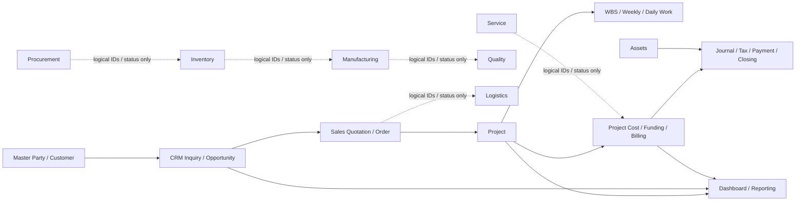
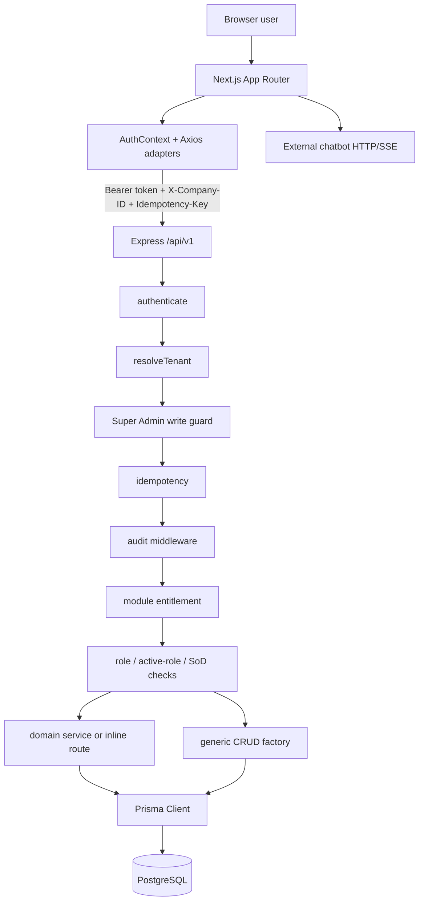
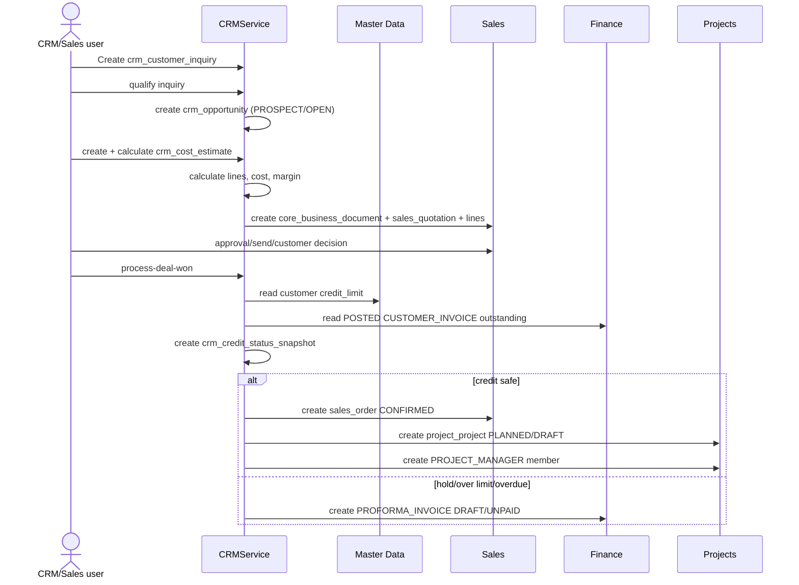
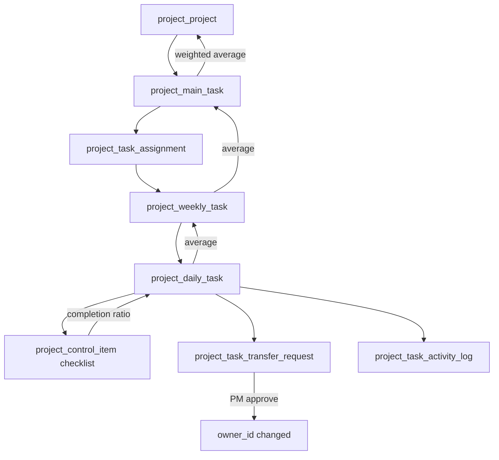
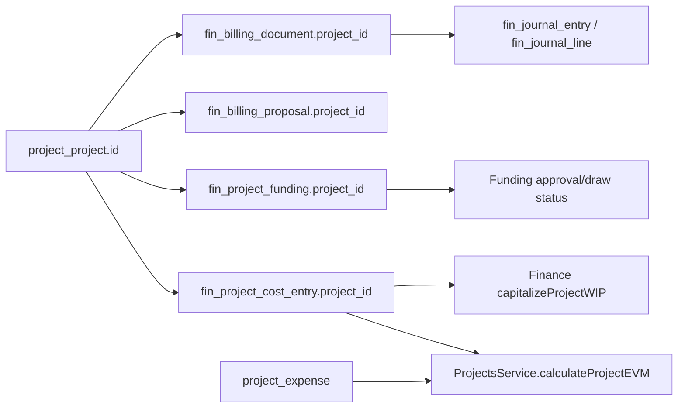
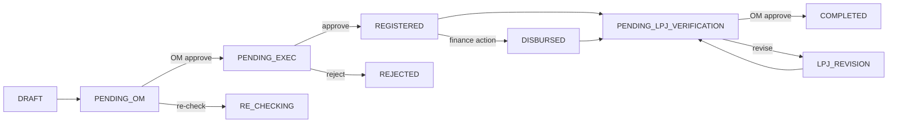

# System Integration Audit — AS-IS

**Audit date:** 8 September 2026  
**Runtime in scope:** `backend-express/` + `frontend-next/` + PostgreSQL schema/migrations in `backend-express/prisma/`  
**Legacy reference only:** `backend/` (Django) and `uji_prototype/` are not the active production runtime.  
**Purpose:** technical documentation, business-process reference, developer handover, QA reference, and baseline for subsequent development.

> **Access-control addendum — 10 September 2026:** audit ini merekam kondisi awal source pada 8 September. Temuan akses yang telah ditutup sampai 10 September diberi status resolved/partially resolved di bawah, termasuk active-role enforcement dan kontrak Frontend Route → Module → API. Baseline operasional dan change log yang berlaku adalah [Access Control Baseline and Change Log](./ACCESS_CONTROL_CHANGELOG.md).

## 1. Scope, method, and evidence rules

This document describes the implementation found in source code. It does not treat a model name, an `*_id` column, a diagram, seed data, or an old Django implementation as proof that an integration is operational.

Evidence reviewed:

- Express composition and middleware: `backend-express/src/app.ts`.
- Domain routes and services: `backend-express/src/modules/**`.
- Workflow engine: `backend-express/src/workflows/**` and `backend-express/src/utils/fsm.ts`.
- Prisma schema and seven migration folders: `backend-express/prisma/schema.prisma`, `backend-express/prisma/migrations/**`.
- Frontend pages, API adapters, access shell, and feature components: `frontend-next/app/**`, `frontend-next/lib/api/**`, `frontend-next/components/**`.
- Existing documentation and test summaries were used only as supporting context. Source code remains authoritative where they conflict.

Status used in this audit:

| Status | Meaning |
|---|---|
| **IMPLEMENTED** | A real executable path reads/writes the stated modules and has an identifiable output. |
| **PARTIAL** | Models/routes exist, but lifecycle, side effects, permission, atomicity, or UI contract is incomplete. |
| **INCORRECT** | Executable code conflicts with its intended business rule or another active contract. |
| **NOT FOUND** | No executable implementation was found in the active stack. |
| **UNVERIFIED LIVE** | Source exists, but the configured live database/runtime could not be checked during this audit. |

### Database verification limitation

`prisma migrate status` loaded the configured PostgreSQL datasource but failed at the schema engine while connecting to the Supabase direct host. The configured direct endpoint is IPv6-dependent in the current environment. Therefore:

- this document verifies the repository schema and migration SQL;
- it does **not** claim that all seven migrations or all constraints are present in the live production database;
- no database data or configuration was changed during this audit.

## 2. Executive conclusion

The system is a broad ERP data platform with 253 Prisma models, 251 generic CRUD mounts, custom services for CRM, Projects, Finance, Assets, Requests, Accounts, and Core, and a Next.js frontend focused on Dashboard, CRM, Projects/Tasks, Finance, Reporting, Resources, and Access Administration.

The main integration chain exists, but is not yet a single controlled end-to-end transaction:

Overall assessment:

| Area | Assessment | Main reason |
|---|---|---|
| IAM, tenant, company, module entitlement | **IMPLEMENTED / PARTIAL** | Strong company scoping and entitlement middleware; active-role semantics and unguarded module families remain inconsistent. |
| CRM → Sales → Project | **PARTIAL / INCORRECT** | Real transactional creation exists, but approval authorization, customer/PM fallback, duplicate prevention, and transaction boundaries are unsafe. |
| Project execution/WBS | **IMPLEMENTED / PARTIAL** | Assignment and bottom-up roll-up are real; multiple project status engines disagree. |
| Project → Finance | **PARTIAL** | Real shared records and EVM reads exist; many writes are generic CRUD and lack a unified lifecycle. |
| General Ledger and closing | **IMPLEMENTED / PARTIAL** | Balanced posting, reversal, period/year closing, and reports exist; frontend and generic CRUD can bypass parts of the intended FSM. |
| Assets → Finance | **IMPLEMENTED / INCORRECT RISK** | Depreciation/disposal create journals, but disposal account selection appears to credit the accumulated-depreciation account as the asset-cost account. |
| Requests → Finance | **PARTIAL / INCORRECT** | Approval states exist, but backend role gates and real Finance disbursement/journal records are missing. |
| Procurement → Inventory → Finance | **PARTIAL** | Referential columns and isolated actions exist; receipt, stock ledger, AP, and journal side effects are not orchestrated. |
| Manufacturing → Inventory/Quality/Finance | **PARTIAL** | Models share IDs; actions only change status and do not issue stock, create inspections, or post cost. |
| Sales → Logistics / Service | **PARTIAL** | Shared IDs exist; dispatch/POD/resolve actions do not complete the upstream/downstream lifecycle. |
| Analytics | **STUB** | Recalculate/evaluate endpoints return success without computation or persistence. |
| Reporting | **PARTIAL / INCORRECT** | Several projections are real, while some KPI values are hard-coded. |
| Frontend integration | **PARTIAL** | Main screens use real APIs; several payload/path/lifecycle mismatches and swallowed errors remain. |

## 3. Runtime architecture and ownership

### 3.1 Active runtime boundaries

| Layer | Actual implementation | Notes |
|---|---|---|
| Frontend | Next.js App Router, React, Axios | The browser stores authentication/company context and calls Express. |
| API | Express/TypeScript | Controllers are mostly inline route handlers; there is no repository layer. |
| Domain service | CRM, Projects, Finance, Assets, Requests, Core, Accounts | Other modules mostly use inline status updates plus generic CRUD. |
| ORM | Prisma | Schema contains scalar IDs but no Prisma `@relation` declarations. |
| Database | PostgreSQL/Supabase | Live connectivity was not verified in this audit. |
| Workflow | Two mechanisms | Tenant workflow registry for Project/Sales Order/Purchase Order; separate `DocumentFSM` for Finance. |
| Audit | `core_audit_event` | Global mutation audit plus explicit domain delta events in selected services. |
| Queue/outbox | **NOT FOUND** | Cross-module effects are synchronous request-driven operations. |

### 3.2 Module catalog

The company entitlement catalog in `prisma/seed.ts` contains 16 codes:

`CORE`, `REQUESTS`, `CRM`, `SALES`, `PROJECTS`, `FINANCE`, `PROCUREMENT`, `INVENTORY`, `MANUFACTURING`, `QUALITY`, `ASSETS`, `SERVICE`, `LOGISTICS`, `ANALYTICS`, `IMPLEMENTATION`, and `REPORTING`.

The active Express application mounts 19 router groups because Accounts/Auth, Commands, Dashboard, Core, and Requests are separate API concerns. `master-data`, `core`, `commands`, and `dashboard` do not all have a uniform top-level entitlement check.

The Ghost/PT Coba Arsalynk configuration in both `prisma/seed.ts` and migration `20260908090000_reconcile_ghost_company_modules` enables six modules: `CORE`, `REQUESTS`, `CRM`, `SALES`, `PROJECTS`, and `FINANCE`. It is not configured as CRM-only in the current repository.

### 3.3 Frontend coverage

Dedicated pages exist for:

- `/dashboard`
- `/crm`
- `/projects`
- `/tasks`
- `/finance`
- `/reporting`
- `/resources`

There are no dedicated active Next pages for Procurement, Inventory, Manufacturing, Quality, Logistics, Implementation, or Service. Some of their raw records are reachable from `/resources`; Fixed Assets is embedded inside Finance. This means backend module availability and frontend product availability are not equivalent.

## 4. Integration map

| Source | Trigger/API | Target and data written/read | Status | Important behavior |
|---|---|---|---|---|
| Master Data | Party/customer profile CRUD and `customer-profiles/set-credit-limit` | CRM customer, Sales customer, Project customer, Finance party | **IMPLEMENTED / PARTIAL** | Shared through `customer_party_id`/`party_id`; no ORM relation. |
| CRM Inquiry | `POST /crm/customer-inquiries/:id/qualify` | `crm_opportunity`; inquiry becomes `QUALIFIED` | **IMPLEMENTED** | Runs in a transaction and stores `opportunity_id`. |
| CRM Estimate | `POST /crm/cost-estimates/:id/calculate` | Estimate totals and opportunity expected amount/margin | **IMPLEMENTED / PARTIAL** | Creates a synthetic Rp100,000,000 material line when estimate has no lines and direct cost is zero. |
| CRM Estimate | `POST /crm/cost-estimates/:id/create-quotation` | `core_business_document`, `sales_quotation`, lines, `crm_quotation_version` | **IMPLEMENTED / PARTIAL** | Real cross-module creation; nested service transaction path is not consistently atomic. |
| CRM Opportunity | `POST /crm/opportunities/:id/process-deal-won` | Credit snapshot, then Sales Order + Project or Finance proforma | **IMPLEMENTED / INCORRECT** | Falls back to the first active party if customer is absent; PM lookup is username-based; duplicate handoff protection not found. |
| CRM approval | `/crm/executive-approvals/:id/{decide,approve,reject}` | `crm_executive_approval` decision | **PARTIAL / INCORRECT** | Route does not itself require Director; generic CRUD exposes the same approval table. |
| Sales quotation | `/sales/quotations/*`, `/commands/sales/quotations/:id/convert-to-order` | Sales Order; quotation `ACCEPTED` | **IMPLEMENTED / PARTIAL** | Conversion is transactional, but can create multiple orders for one quotation. |
| Sales Order | `/sales/orders/:id/convert-to-project` | `project_project` | **IMPLEMENTED / INCORRECT** | Creates blank `customer_name` and synthetic project name; PM lookup depends on username `pm`. |
| Project WBS | Main Task assignment and Weekly/Daily CRUD/actions | Project progress and activity log | **IMPLEMENTED** | Checklist/Daily → Weekly average → Main average → weighted Project roll-up. |
| Project | Funding/cost/billing routes and frontend API | `fin_project_funding`, `fin_project_cost_entry`, `fin_billing_proposal` | **PARTIAL** | Shared company/project IDs; lifecycle frequently handled by generic CRUD. |
| Project | EVM/financial-performance | Finance cost entries and project expenses | **IMPLEMENTED / PARTIAL** | Actual cost is `max(fin_project_cost_entry total, project_expense total)`, which avoids double count but may understate combined distinct costs. |
| Finance Billing | `/finance/billing-documents/:id/post` | Billing status, tax transaction, GL journal/lines | **IMPLEMENTED / PARTIAL** | Customer-invoice posting is implemented; generic UI status changes bypass this side effect. |
| Finance Payment | `/finance/payments/:id/{submit,approve,execute}` | Payment status | **PARTIAL** | FSM exists, but execute only changes status/date; payment allocation, bank movement, and GL posting are not created here. |
| Finance Funding | `/finance/project-fundings/:id/{decide,draw}` | Funding approval/draw status | **PARTIAL** | `decideFunding` does not invoke `DocumentFSM`; direct PATCH paths also exist. |
| Assets | Depreciate/batch/dispose | Asset book/depreciation and Finance journals | **IMPLEMENTED / INCORRECT RISK** | Real transaction and period guard; disposal account mapping needs correction/verification. |
| Requests | Request approval endpoints | Workflow instance/approval/audit/notification | **IMPLEMENTED / PARTIAL** | Data payload lives primarily in audit JSON; Finance disbursement does not write Finance models. |
| Procurement | Requisition → RFQ | `proc_rfq` | **IMPLEMENTED / PARTIAL** | No requisition status transition or line copy was found. |
| Procurement | PO three-way match | `proc_three_way_match` | **INCORRECT / STUB-LIKE** | Creates `MATCHED` without comparing PO, receipt, and supplier invoice values. |
| Inventory | Complete stock move | `inv_stock_move.status=COMPLETED` | **PARTIAL** | No stock ledger, stock balance, valuation, reservation release, or Finance posting is produced. |
| Manufacturing | Release/issue/start/complete | Production/work-order statuses | **PARTIAL** | No actual inventory issue/output, QA inspection, or cost journal side effect. |
| Quality | Complete inspection | `qa_inspection.status=COMPLETED` | **PARTIAL** | Does not gate Project/Manufacturing/Sales lifecycle or generate NCR automatically. |
| Sales/Logistics | Dispatch/POD | Delivery or shipment/POD status/data | **PARTIAL** | POD does not update shipment/delivery/order fulfillment. |
| Service | Resolve case | `service_case.status=RESOLVED` | **PARTIAL** | Resolution, replacement delivery, inventory, credit note, and billing effects are not orchestrated. |
| Dashboard | `/dashboard/bootstrap` | CRM/Project/Finance read models | **IMPLEMENTED** | Company/user/role/module-scoped server aggregation with process-local cache. |
| Reporting | Reporting endpoints/views | CRM, Project, Finance, Timesheet projections | **PARTIAL / INCORRECT** | Some calculations are real; some KPI values are constants. |
| Analytics | `kpis/recalculate`, `alerts/evaluate` | None | **STUB** | Returns success and zero count without database calculation. |
| Implementation | Generic CRUD only | Implementation tables | **PARTIAL** | No integration service or automated handoff to Project/Service/Reporting found. |

## 5. End-to-end business workflows

### 5.1 CRM inquiry → estimate → quotation → order → project/finance

Actors and permission path:

- Top-level CRM access requires module `CRM` plus one assigned role among CRM Lead, Sales, Project Manager, or Director; an explicit per-user module delegation can satisfy the role middleware.
- Director mutations are restricted to executive override and executive approval routes.
- The override endpoint is therefore reachable by CRM Lead/Sales/PM through the broad CRM role gate and by Director through the allow-list. A Director-only check inside the route/service is **not found**.

Inputs and outputs:

| Stage | Inputs | Process | Output/status |
|---|---|---|---|
| Inquiry create | customer/contact, subject, source, expected date | Generic CRUD | `crm_customer_inquiry` with caller-provided/default status. |
| Qualify | inquiry ID | Creates opportunity if absent | Inquiry `QUALIFIED`; opportunity `PROSPECT`, `OPEN`, 10%. |
| Estimate calculate | estimate and line amounts | Sums direct/overhead/contingency, applies markup | Estimate `CALCULATED`; opportunity amount/margin updated. |
| Create quotation | calculated estimate | Creates business document, quotation, lines, version | Estimate and inquiry `QUOTED`; quotation `DRAFT`. |
| Submit/send/decision | quotation ID | Inline Sales route status update | `PENDING_APPROVAL`, `SENT`, `ACCEPTED`/`REJECTED`. |
| Convert quotation | quotation ID | Creates `sales_order` | Order `CONFIRMED`; quotation `ACCEPTED`. |
| Deal won | opportunity/customer/amount | Credit snapshot and branch | Opportunity `WON`; order+project or proforma. |

Observed gaps:

1. `processDealWon` sets an opportunity to `WON` before proving the handoff is safe and may assign the first active company party when `customer_party_id` is absent. This can attach a deal to the wrong customer.
2. `calculateCreditSnapshot` uses the global Prisma client while called from an outer transaction. The snapshot and the surrounding handoff do not share one explicit transaction client.
3. Quotation selection during deal-won uses the first quotation for the customer, not necessarily the opportunity/accepted quotation.
4. No uniqueness/idempotent lookup prevents repeated deal-won calls from creating multiple orders/projects/proformas. HTTP idempotency only protects reuse of the same key, not semantic duplicates across new keys.
5. Executive override creates an order/project directly without checking or consuming a `crm_executive_approval` record.
6. `acceptQuotation` and `rejectQuotation` in `frontend-next/lib/api/crm.api.ts` send `{accepted: boolean}`, but `sales.routes.ts` requires `decision: 'ACCEPTED'|'REJECTED'`; the active contract is incompatible.
7. The frontend sends a hard-coded quotation email recipient (`customer@example.com`), while the backend send route merely changes status and does not send email.
8. The existing `CRM_FLOW_DOCUMENTATION.md` describes automatic service/warranty and payment continuation paths that are not implemented end-to-end in the active Express service.

### 5.2 Project execution and personal work lifecycle

Workflow details:

- Main Task assignment: PM/authorized project user calls `/projects/main-tasks/:id/assign_members` and creates `project_task_assignment` records.
- Staff/Supervisor weekly planning: `POST /projects/weekly-tasks` is allowed only when the caller has an assignment on the selected Main Task. The backend forces `assignee_id` to the current user.
- Daily execution: Daily Task belongs to Weekly Task through `weekly_task_id`; owner updates progress, blocking information, and task content.
- Checklist authority: when `project_control_item` rows exist, completed checklist count determines Daily Task progress/status.
- Roll-up: Daily average → Weekly average → Main average; Main Tasks use `weight` for project `progress_percent`.
- Transfer: requester creates a pending transfer; PM can approve/reject, and approved transfer changes Daily Task `owner_id`.

Implemented statuses actually used:

| Entity | Observed statuses |
|---|---|
| Main/Weekly Task | `PLANNED`, `IN_PROGRESS`, `BLOCKED`, `COMPLETED` |
| Daily Task | `NOT_STARTED`, `IN_PROGRESS`, `BLOCKED`, `COMPLETED`; frontend also uses `ON_PROGRESS` and backend normalizes some variants |
| Transfer | `PENDING`, `APPROVED`, `REJECTED`, `CANCELLED` |
| Checklist completed aliases | `DONE`, `COMPLETED`, `CHECKED`, `APPROVED` |

Project lifecycle conflict:

| Mechanism | States used |
|---|---|
| `ProjectsService.advanceStage` | `DRAFT → VERIFIED → RESERVED → STARTED → COMPLETED` |
| Arsalynk Workflow Registry | `DRAFT → VERIFIED → RESOURCE_RESERVED → IN_PROGRESS → QC_REVIEW → COMPLETED`, plus `ON_HOLD` |
| Commands shortcuts | Start writes `ACTIVE`; close writes `COMPLETED` |
| Generic project creation | Defaults `status=IN_PROGRESS`, `lifecycle_status=ACTIVE` |
| CRM/Sales handoff | Creates `status=PLANNED`, `lifecycle_status=DRAFT` |

These are multiple active state machines over the same `project_project.status` field. They are **incorrect as a unified lifecycle**. The frontend additionally falls back to a direct project PATCH after an advance-stage error, which can bypass lifecycle validation.

### 5.3 Project → Finance

Trigger paths:

- Project page and `project.api.ts` create/read/delete `fin_project_cost_entry`, `fin_project_funding`, and `fin_billing_proposal` directly.
- Project router also exposes `/projects/:id/funding_requests`, `/financial-performance`, `/costs`, and `/update_financials`.
- Finance and dashboard read the same records grouped by `project_id`.
- Finance can capitalize WIP through `/finance/projects/:id/capitalize-wip`.

Data flow:

Gaps:

- Project role access does not automatically authorize Finance. The Project frontend conditionally omits Finance reads, but direct Project routes themselves query Finance tables under the Projects entitlement.
- Project users can create Finance-owned records through `/projects` integration routes or `/finance` endpoints depending on their Finance entitlement/delegation; ownership and approval responsibilities are not consistently separated.
- `update_financials` directly changes `budget_amount`, `contract_amount`, and `target_margin_percent` without a change-request or approval lifecycle.
- There is no automatic cost posting from timesheet, inventory issue, procurement receipt, or manufacturing output.
- A project can have both `project_expense` and `fin_project_cost_entry`; no canonical source or reconciliation key is enforced.

### 5.4 Finance/accounting lifecycle

#### Journal

`DRAFT → POSTED → REVERSED`

- Posting requires at least two lines and debit/credit equality within 0.001.
- Posting checks fiscal-period availability.
- Reversal creates a new posted entry with debit/credit swapped and marks the original `REVERSED`.
- Generic CRUD blocks updates/deletes for Finance records whose status/payment/approval state is one of `POSTED`, `PAID`, `CLOSED`, `LOCKED`, `EXECUTED`, `REVERSED`.

#### Billing FSM

`DRAFT → SUBMITTED → VERIFIED → APPROVED → POSTED`, with `REJECTED`/`CANCELLED` branches.

- Verify and approve have route-level role and SoD checks.
- Posting creates a tax transaction when tax is positive and creates posted GL journal lines when required accounts exist.
- The frontend also directly PATCHes Billing Documents to `MATCHED` and `PAID`, bypassing the FSM and accounting side effects.

#### Payment FSM

`DRAFT → SUBMITTED → APPROVED → POSTED`, with rejection/cancellation branches.

- Approval has SoD.
- Execute applies the FSM event `post` and writes `payment_date`.
- No automatic GL journal, bank ledger movement, billing allocation, or outstanding update was found in the execute route.

#### Project funding FSM

Declared: `DRAFT → SUBMITTED → APPROVED → DRAWN`, with reject/cancel branches.

Actual inconsistency:

- `decideFunding` writes `APPROVED`/`REJECTED` directly without checking current state through the FSM.
- the frontend contains both the correct `/decide` action and an older direct PATCH path;
- UI/dashboard logic also recognizes `DISBURSED`, `COMPLETED`, and `ACTIVE`, which are outside `FUND_REQUEST_FSM`.

#### Period closing

- Requester may not approve the same closing.
- Executor must differ according to configured closing governance.
- Monthly close rejects periods with draft journals, creates a financial snapshot, and closes the period.
- Year-end closes nominal accounts to retained earnings and closes all periods/year.
- Reopen creates reversal journal entries.
- Snapshot creation during monthly close catches and suppresses database errors; the close can succeed without the snapshot.
- `assertPeriodOpen` allows posting when no fiscal period exists, which is intentional bootstrap behavior but weak for production accounting control.

### 5.5 Internal Request → approval → disbursement → LPJ

Storage and output:

- `core_workflow_instance` is the current-state backplane.
- `core_workflow_approval` stores OM/Executive/LPJ decisions.
- The full request payload, disbursement metadata, and LPJ payload are reconstructed from `core_audit_event.after_data` rather than a dedicated request table.
- Notifications are created for approval stages.

Resolved access controls:

- Request transitions now enforce the exact active role: OM for validation/LPJ verification, PM or Director for executive approval, and Finance for disbursement. These strict actions do not accept module delegation as a substitute for the business actor.
- LPJ submission verifies that the caller is the original requester.

Remaining integration gaps:

- `disburseRequest` changes workflow state and writes audit metadata only. It does not create `fin_payment`, bank transaction, journal entry, or allocation.
- Executive approval marks the workflow's overall `status=COMPLETED` while `current_state=REGISTERED`, before disbursement/LPJ completion; these two status dimensions conflict.

### 5.6 Procurement → Inventory → Finance

Implemented fragments:

1. Purchase Requisition and lines exist.
2. `convert-to-rfq` creates one `proc_rfq` referencing `requisition_id`.
3. Supplier quotation, Purchase Order, lines, Goods Receipt, lines, and Three-Way Match models/CRUD exist.
4. Workflow Registry supports Purchase Order approval states.
5. Procurement records contain `project_id`, supplier, product, receipt, and billing references.

Missing/incorrect orchestration:

- Requisition lines are not copied into RFQ lines; an RFQ line model is not present.
- PO conversion from accepted supplier quotation was not found.
- Receiving a PO through Workflow Registry only changes PO status; it does not create a Goods Receipt or Inventory Stock Move.
- `three-way-match` creates `match_status='MATCHED'` without reading PO lines, Goods Receipt lines, or supplier billing documents.
- No AP billing document, tax, payment schedule, or journal is generated from the match.
- No automatic Project cost is generated for project-related procurement.

Therefore the full Procure-to-Pay workflow is **NOT IMPLEMENTED end-to-end**.

### 5.7 Inventory → Manufacturing → Quality

The schema has logical links:

- stock moves/reservations/ledger entries can reference Project and Production Order;
- Production Orders reference Project, BOM, routing, warehouse, and product;
- Work Orders reference Production Order;
- QA Inspection can reference Goods Receipt, Production Order, and Work Order;
- manufacturing cost ledger entries reference Project/Production/Work Order.

The executable actions do not implement those effects:

- Inventory complete sets only `inv_stock_move.status='COMPLETED'`.
- Manufacturing issue-materials sets only Production Order `IN_PROGRESS`.
- Work Order start/complete changes status and timestamps only.
- QA complete sets only `qa_inspection.status='COMPLETED'`.

No stock quantity mutation, valuation layer, production output, scrap costing, QA gate, project cost, or finance journal is created by those actions. The model graph is broader than the operational workflow.

### 5.8 Assets → Finance

Implemented:

- Monthly depreciation validates active asset/book, resolves COA, checks fiscal period, creates `asset_depreciation_line`, updates `asset_book`, creates posted journal/lines, and writes audit.
- Batch depreciation processes active assets in chunks of 50.
- Disposal creates a posted journal, `asset_disposal`, changes asset to `DISPOSED`, and writes audit.

Accounting risk:

- In disposal, the variable used as `assetAccount` is looked up with the accumulated-depreciation COA code and is then used both to debit accumulated depreciation and credit the asset cost basis. A distinct fixed-asset cost account should normally be credited. The current implementation should not be accepted as accounting-correct until the category account mapping and journal test are corrected/verified.

### 5.9 Sales → Logistics and Service

- Sales Delivery dispatch changes only `sales_delivery.delivery_status='DISPATCHED'`.
- Logistics POD creates `logistics_proof_of_delivery` with `verification_status='VERIFIED'`; it does not update `logistics_shipment`, `sales_delivery`, or `sales_order`.
- Service resolve changes only `service_case.status='RESOLVED'` and `resolved_at`.
- Warranty checks, serial history validation, repair work order, replacement stock/delivery, credit note, and customer billing are represented by possible fields/models but no end-to-end active service was found.

### 5.10 Reporting, dashboard, and analytics

Dashboard bootstrap:

- sections `projects`, `finance`, and `crm` are authorized separately;
- cache identity includes tenant, company, user, active role, enabled modules, and requested sections;
- Project and Finance use PostgreSQL JSON projections; CRM uses scoped Prisma aggregates;
- Finance is deliberately excluded from the Project bootstrap projection and loaded by the Finance section.

Reporting:

- periodic project summary and attendance summary read real Daily Task/Timesheet data;
- portfolio report reads real Project data;
- reporting views are mounted read-only;
- `reporting/crm-sales-dashboard` returns hard-coded `average_sales_cycle_days=14`, `offering_margin_percent=25.5`, and pending approvals `0`;
- `reporting/finance-main-dashboard` returns hard-coded `cash_position=1,500,000,000` and overdue count `0`.

Analytics:

- KPI recalculation and alert evaluation endpoints do not query or update the database. They are placeholders despite returning HTTP success.

## 6. Database relationship map

### 6.1 Physical versus logical relations

The Prisma schema contains **zero `@relation` declarations**. The seven repository migrations explicitly create only these foreign keys:

- `iam_user_company_membership.user_id → iam_user.id`
- `iam_user_company_membership.company_id → core_company.id`
- `iam_company_module_access.company_id → core_company.id`
- `iam_user_module_access.company_id → core_company.id`
- `iam_user_module_access.user_id → iam_user.id`

The live database may contain additional constraints inherited from an earlier schema, but that could not be verified. Accordingly, all other entries below are **logical references used by code**, not guaranteed database foreign keys.

### 6.2 Key logical relations

| Owner field | Intended target | Used by executable code |
|---|---|---|
| `crm_customer_inquiry.opportunity_id` | `crm_opportunity.id` | Qualification and quotation flow |
| `crm_cost_estimate.inquiry_id` | `crm_customer_inquiry.id` | Estimate/quotation flow |
| `crm_cost_estimate.opportunity_id` | `crm_opportunity.id` | Estimate updates opportunity |
| `sales_quotation.opportunity_id` | `crm_opportunity.id` | CRM quotation creation |
| `sales_order.quotation_id` | `sales_quotation.id` | Quotation conversion/deal won |
| `project_project.sales_order_id` | `sales_order.id` | Sales/CRM project handoff |
| `project_project.customer_party_id` | `master_party.id` | Customer/project views |
| `project_main_task.project_id` | `project_project.id` | WBS roll-up |
| `project_task_assignment.main_task_id` | `project_main_task.id` | Assignment authorization |
| `project_weekly_task.main_task_id` | `project_main_task.id` | Weekly plan hierarchy |
| `project_daily_task.weekly_task_id` | `project_weekly_task.id` | Daily plan hierarchy |
| `project_control_item.daily_task_id` | `project_daily_task.id` | Checklist progress |
| `fin_project_cost_entry.project_id` | `project_project.id` | Cost/EVM/dashboard/WIP |
| `fin_project_funding.project_id` | `project_project.id` | Funding/dashboard |
| `fin_billing_proposal.project_id` | `project_project.id` | Billing/dashboard |
| `fin_billing_document.project_id` | `project_project.id` | Billing/journal dimension |
| `fin_billing_document.sales_order_id` | `sales_order.id` | Commercial billing reference |
| `fin_tax_transaction.billing_document_id` | `fin_billing_document.id` | Tax creation on billing post |
| `fin_journal_line.journal_entry_id` | `fin_journal_entry.id` | GL posting/balance/reversal |
| `fin_journal_line.project_id` | `project_project.id` | Project accounting dimension |
| `proc_rfq.requisition_id` | `proc_purchase_requisition.id` | Requisition conversion |
| `proc_purchase_order_line.project_id` | `project_project.id` | Project procurement dimension |
| `proc_goods_receipt.purchase_order_id` | `proc_purchase_order.id` | Receipt reference only |
| `proc_three_way_match.purchase_order_id` | `proc_purchase_order.id` | Stub-like match creation |
| `proc_three_way_match.goods_receipt_id` | `proc_goods_receipt.id` | Field exists; action does not validate it |
| `inv_stock_move.project_id` | `project_project.id` | Logical dimension only |
| `inv_stock_move.production_order_id` | `mfg_production_order.id` | Logical dimension only |
| `mfg_production_order.project_id` | `project_project.id` | Logical dimension only |
| `qa_inspection.goods_receipt_id` | `proc_goods_receipt.id` | Logical dimension only |
| `qa_inspection.production_order_id` | `mfg_production_order.id` | Logical dimension only |
| `asset_asset.project_id` | `project_project.id` | Asset attribution |
| `asset_depreciation_line.journal_entry_id` | `fin_journal_entry.id` | Depreciation posting |
| `asset_disposal.journal_entry_id` | `fin_journal_entry.id` | Disposal posting |
| `service_case.sales_order_id` | `sales_order.id` | Logical customer history |
| `service_case.billing_document_id` | `fin_billing_document.id` | Logical billing reference |
| `logistics_shipment.sales_order_id` | `sales_order.id` | Logical delivery reference |
| `logistics_proof_of_delivery.shipment_id` | `logistics_shipment.id` | POD creation |

### 6.3 Integrity implications

- Orphan IDs can be created unless each route validates the referenced record.
- An ID can point to a record in another company unless every write validates both ID and company.
- Deleting a parent through generic CRUD can leave logical children when no live FK exists.
- Prisma cannot use nested relation queries/cascades because relations are not declared.
- Status columns are mostly unrestricted `String`; database CHECK constraints are not broadly present.
- Unique constraints prevent only selected duplicates, for example one opportunity per inquiry, but do not cover all semantic handoffs.

## 7. API and service integration map

### 7.1 Domain services with real orchestration

| Service | Main methods | Cross-module dependencies |
|---|---|---|
| `CRMService` | `qualifyInquiry`, `calculateEstimate`, `createQuotationFromEstimate`, `calculateCreditSnapshot`, `processDealWon`, `executiveOverride` | Master, Sales, Project, Finance, IAM, Core document |
| `ProjectsService` | hierarchy, roll-up, EVM, stage, progress, blocked, transfer/reassign, override | Project, IAM, Finance cost |
| `FinanceService` | COA/journal, posting/reversal, transfer, bank import/reconcile, reports, funding, billing/tax, WIP, NTPN, audit report | Finance, Project, Core audit |
| `PeriodClosingService` | period guard, monthly/year close, reopen | Finance journal/account/snapshot, Core audit |
| `AssetService` | depreciation, batch, schedule, disposal | Assets, Finance accounts/journals, period guard, Core audit |
| `RequestService` | create, OM validation, executive approval, disburse, LPJ, notifications/feed | Core workflow/audit/notification, IAM |
| `AccountsService` / access context | login, refresh, profile, invite, roles/modules | IAM, Core company/tenant |

### 7.2 Important custom endpoint families

| Domain | Endpoint families |
|---|---|
| CRM | inquiry qualify; estimate calculate/create quotation; credit snapshot; deal won; executive override/approval; customer 360 |
| Sales | quotation submit/send/customer decision; order confirm/allocate/convert to project; delivery dispatch |
| Projects | hierarchy, health/EVM, stage, finance summary/funding, assignment, daily progress/block/transfer/reassign |
| Finance | journal post/reverse; trial balance/P&L/balance sheet; bank transfer/import/reconcile; funding; billing; payment; tax; WIP; closing; audit |
| Assets | depreciation, batch depreciation, schedule, disposal |
| Requests | create/list; OM validation; executive approval; disburse; LPJ submit/verify |
| Procurement | requisition to RFQ; PO three-way match |
| Inventory | stock-move complete |
| Manufacturing | production release/material issue; work-order start/complete |
| Quality | inspection complete |
| Logistics | proof of delivery |
| Service | case resolve |
| Commands | generic workflow registry/execute; document status; quotation conversion; project shortcuts; reporting shortcuts |
| Dashboard/Reporting | company-scoped aggregate reads and read-only projections |

### 7.3 Generic CRUD surface

`createCrudRouter` provides metadata, list/get, create, update/patch, delete, and bulk operations for almost every Prisma model. It also:

- applies tenant/company/resource scope;
- auto-fills many missing required scalar values;
- maps compatibility aliases such as `project → project_id`;
- adds common tenant/company/creator values;
- blocks mutation of configured Finance terminal statuses;
- exposes raw status fields for most non-terminal and non-Finance resources.

This factory is useful for migration compatibility and Data Explorer, but it is also the largest integration risk because custom workflow actions and generic status PATCH operations coexist on the same tables.

## 8. Roles, permissions, and data scope

### 8.1 Request security pipeline

All protected `/api/v1` routes pass through:

1. JWT authentication and active-user loading.
2. Tenant/company resolution.
3. Super Admin operational write guard.
4. Idempotency enforcement for configured transactional roots.
5. Mutation audit logging.
6. Module/role/SoD checks where a router declares them.
7. Resource scope and write-scope validation in generic CRUD.

### 8.2 Module/role matrix at the Express mount

| Route root | Module entitlement | Top-level role restriction |
|---|---|---|
| `/crm` | `CRM` | CRM Lead, Sales, PM, Director; Director mutation allow-list |
| `/sales` | `SALES` | CRM Lead, Sales, PM, Director |
| `/projects` | `PROJECTS` | PM, OM, Director, Supervisor, Staff; role-specific mutation restrictions |
| `/finance` | `FINANCE` | Finance, Director; Director mutation allow-list |
| `/requests` | `REQUESTS` | **None** |
| Procurement/Inventory/Manufacturing/Quality/Assets/Service/Logistics/Analytics/Implementation/Reporting | Matching module | **None at mount**; selected actions add local role checks |
| `/master-data` | **None** | **None** |
| `/core` | **None** | Selected admin routes only |
| `/commands` | Per-subtree/endpoint | Mixed |
| `/dashboard` | Per-section inside endpoint | Per-section logic |

### 8.3 Assigned role versus active role — historical finding, superseded 9 September 2026

- At audit time, `requireRole` accepted any role in `req.user.roles`, not only `active_role_code`.
- At audit time, `restrictActiveRoleMutations` used `active_role_code`.
- At audit time, Finance's `requireFinanceRole` also checked the union of assigned roles.
- The frontend route shell checked the union of roles while rendering role-specific navigation from a detected active role.

Consequently, at audit time changing active role did not consistently change all authorization. This is resolved by `ACC-2026-09-09-01`; section 8.5 and the access-control changelog describe the active baseline.

### 8.4 Per-user module delegation

Effective access is:

`company entitlement ceiling` + optional `iam_user_module_access` override.

- Missing override means inherit company access.
- Override cannot enable a company-disabled module.
- Explicit read/write delegation can satisfy `requireRole` when mounted immediately after entitlement middleware.
- Company Admin UI lists only company-approved modules for user delegation.

### 8.5 Access-control remediation — 10 September 2026

Temuan audit yang berkaitan dengan active role, Project task ownership, Request transition, CRM executive action, dan SoD telah diperbaiki pada source aktif.

- `requireRole` mengevaluasi `active_role_code`; strict `requireActiveRole` dipakai untuk approval/disbursement/override sehingga delegasi module personal tidak dapat menggantikan role bisnis.
- Project generic CRUD dan canonical detail route memakai row scope: PM hanya project kelolaan, Staff/Supervisor hanya membership/assignment/owner yang relevan, OM/Director portfolio sesuai policy, dan admin platform tetap memiliki scope administratif.
- Daily progress/output/blocker owner-only. PM/OM mengelola structure, transfer approval, dan reassignment pada project yang memang dikelola.
- Request route kini memiliki gate OM, PM/Director, Finance, dan ownership LPJ sesuai transisi; CRM executive override/decision Director-only.
- SoD maker=checker fail-closed; Delegation of Authority belum dianggap implemented karena schema belum memiliki atribut grant yang diperlukan.
- Frontend route/module/API contract dipusatkan pada `frontend-next/lib/access/module-contract.ts`. `/tasks` memakai `PROJECTS`; `/reporting` memakai `REPORTING`; Dashboard BFF dinilai per-section.
- Auth profile mengekspos `delegated_modules`. AppShell, Sidebar, Data Explorer, modular loaders, panel global, dan Axios preflight menggunakan active role serta entitlement efektif yang sama.
- Project tidak lagi mencoba endpoint Finance sebelum endpoint funding milik Projects. Finance Assets, Inventory, Reporting, dan source lintas-module lain tidak dimuat bila kontrak akses aktif tidak mengizinkan.

Verifikasi implementasi terbaru adalah Q11 9/9 PASS serta frontend/backend TypeScript PASS. Perubahan ini tidak menyelesaikan gap lifecycle/finance lain yang tetap tercatat di audit.

## 9. Lifecycle and status consistency

| Process | Canonical implementation found | Conflicting paths |
|---|---|---|
| CRM inquiry | `QUALIFIED`, `QUOTED` plus caller-provided initial states | Generic CRUD permits arbitrary strings. |
| Opportunity | `OPEN/PROSPECT → WON` | Generic CRUD and frontend can write state directly. |
| Sales quotation | `DRAFT`, `PENDING_APPROVAL`, `SENT`, `ACCEPTED`, `REJECTED` | No single quotation FSM; executive approval record is loosely coupled. |
| Sales order | Tenant workflow has multi-level approval/QC states | Inline routes jump directly to `CONFIRMED`/`ALLOCATED`; CRM creates `CONFIRMED`. |
| Project | Arsalynk workflow registry | `advanceStage`, command shortcuts, CRUD defaults, and CRM handoff use different states. |
| WBS | Roll-up statuses described in §5.2 | Frontend still emits `ON_PROGRESS` aliases. |
| Billing | `DocumentFSM` | UI direct PATCH creates `MATCHED`/`PAID` outside FSM. |
| Payment | `DocumentFSM` ending `POSTED` | Other code/dashboard recognizes `EXECUTED`/`RECEIVED`. |
| Funding | `DocumentFSM` ending `DRAWN` | UI/dashboard recognizes `DISBURSED`, `COMPLETED`, `ACTIVE`; decision bypasses FSM. |
| Period close | Request → approve → execute | Snapshot failure is suppressed; no-period posting allowed. |
| Request | `current_state` state machine | Top-level workflow `status` can become `COMPLETED` before LPJ completion. |

## 10. Dependency and consistency analysis

### 10.1 Transaction boundaries

Strong atomic paths:

- Inquiry qualification.
- Quotation/order conversion where all work uses the same transaction client.
- Project progress roll-up.
- Journal reversal.
- Asset depreciation/disposal core writes.
- Year-end closing journal and status writes.

Weak or split boundaries:

- CRM methods call other methods that use the global Prisma client from inside a transaction callback.
- Request state updates/approvals are transactional, but audit and notification writes occur afterward.
- Monthly closing snapshot is outside the final period update transaction and its failure is swallowed.
- Global audit writes after response completion and does not roll back the business mutation if audit persistence fails.
- Idempotency response completion is asynchronous and can fail after business processing.

### 10.2 Consistency mechanisms present

- Company and tenant scoping on most CRUD reads/writes.
- Explicit lookup by `id + company_id` in many custom actions.
- Idempotency keys on transactional route roots.
- Global mutation audit with sensitive-field redaction.
- Explicit domain delta audit in Finance/Assets/Projects/Requests.
- Finance terminal-record immutability in generic CRUD.
- Read-only reporting views/routes.
- SoD on selected Finance actions.

### 10.3 Consistency mechanisms not found

- Database RLS policies in repository.
- A comprehensive FK graph in Prisma/migrations.
- Transactional outbox/event bus.
- Background worker/queue for cross-module retries.
- Central canonical lifecycle per entity.
- Domain-wide semantic uniqueness for conversion/handoff operations.
- Full cross-module reconciliation jobs.
- Uniform optimistic locking/version checks.

## 11. Integration gaps and potential problems

### P0 — security/accounting/data corruption risk

| ID | Finding | Impact |
|---|---|---|
| INT-P0-01 — RESOLVED 2026-09-09 | Request approval/disbursement/LPJ routes previously lacked backend actor-role enforcement. Active-role gates now protect OM validation/LPJ verification, PM-or-Director executive approval, and Finance disbursement; LPJ verifies original requester ownership. | Regressed by Q11; transaction-state and accounting completeness remain separate gaps. |
| INT-P0-02 — PARTIALLY RESOLVED 2026-09-09 | CRM executive override and executive decisions are now Director-active-role-only. | Role bypass by CRM/Sales/PM is closed. Requirement for an approved approval record remains an independent lifecycle rule to verify before treating override as fully governed. |
| INT-P0-03 | Almost all relationships are scalar UUIDs without Prisma relations or repository-created FKs. | Orphans, cross-company references, and unsafe deletes are possible. |
| INT-P0-04 | Finance UI directly PATCHes funding/billing/payment-like statuses outside custom actions. | SoD, FSM validation, journal/tax effects, and audit semantics can be bypassed. |
| INT-P0-05 | Asset disposal appears to use the accumulated-depreciation account as both contra-asset and asset-cost account. | Disposal journal may be materially wrong. |
| INT-P0-06 | Generic CRUD exposes approval/workflow tables and pre-terminal Finance state mutation. | Users can bypass named approval transitions before terminal-state protection applies. |

### P1 — broken workflow or inconsistent business result

| ID | Finding | Impact |
|---|---|---|
| INT-P1-01 | Four competing Project lifecycle vocabularies write the same status fields. | UI, API, reporting, and workflow availability disagree. |
| INT-P1-02 | Frontend quotation decision payload does not match backend contract. | Accept/reject action returns validation error instead of changing state. |
| INT-P1-03 | CRM deal-won can attach the first active party and an arbitrary username-based PM. | Wrong customer/owner and synthetic project data. |
| INT-P1-04 | CRM/Sales conversion lacks semantic duplicate guards. | Repeated requests with new idempotency keys can duplicate order/project/proforma records. |
| INT-P1-05 | Request disbursement is not a Finance transaction. | Workflow says disbursed while cash, payment, journal, and reconciliation records remain absent. |
| INT-P1-06 | Payment execute does not post GL/bank/allocation/outstanding effects. | Payment status can disagree with accounting and receivables/payables. |
| INT-P1-07 | Procurement three-way match performs no three-way comparison. | Invalid invoices/receipts can be marked matched. |
| INT-P1-08 | Inventory/manufacturing/quality actions only change status. | Stock, valuation, production cost, and QA state are not synchronized. |
| INT-P1-09 | Reporting returns hard-coded financial and CRM KPIs. | Management reports can present false values as real data. |
| INT-P1-10 — RESOLVED 2026-09-09 | Active-role selection and assigned-role authorization were inconsistent. | `requireRole` and Finance policy now use active role; strict sensitive actions reject module-delegation bypass. |
| INT-P1-11 — RESOLVED 2026-09-10 | Frontend route labels, page-local maps, and background loaders could resolve or request a module that differed from the backend mount contract. | One registry now maps routes, API prefixes, active roles, entitlements, delegation, strict actions, and Dashboard BFF sections; known unauthorized requests are cancelled before transmission. |

### P2 — maintainability, UX, and auditability risk

| ID | Finding | Impact |
|---|---|---|
| INT-P2-01 | Generic auto-fill writes empty/default values for required domain fields. | Invalid/incomplete records can look operational. |
| INT-P2-02 — PARTIALLY RESOLVED 2026-09-10 | Module-aware loaders no longer issue expected unauthorized cross-module requests, and inventory no longer substitutes production-looking fallback rows. Other `.catch(() => null/[])` paths still exist. | Remaining paths can still hide genuine 500/timeout/data-contract failures and require a separate error-propagation audit. |
| INT-P2-03 | No dedicated frontend for multiple licensed backend modules. | A module may be enabled but have no usable product workflow. |
| INT-P2-04 | Dashboard/request cache is process-local. | Multi-instance deployments can show inconsistent cached projections. |
| INT-P2-05 | Global audit is best-effort after response. | Successful mutations may have no audit record after an audit write failure. |
| INT-P2-06 | Existing high-level CRM workflow document overstates Service/Finance automation. | Developers and QA may test an intended design rather than current behavior. |
| INT-P2-07 | Route registration smoke tests prove routing/security reachability, not committed business side effects. | Green route coverage can be mistaken for integration completeness. |
| INT-P2-08 | External avatar service and chatbot are browser-side dependencies. | CSP/privacy/offline behavior depends on external availability. |

## 12. Recommended remediation roadmap

### Completed access remediation — 10 September 2026

The previous Phase A items for Request actor policy, LPJ ownership, Director-only CRM executive action, active-role alignment, task/project row scope, and Frontend Route → Module → API alignment are implemented. Their acceptance evidence is Q11 and the [Access Control Baseline and Change Log](./ACCESS_CONTROL_CHANGELOG.md). The remaining roadmap items below are still open unless explicitly marked otherwise.

### Phase A — protect authoritative transitions

1. Make generic CRUD read-only for lifecycle-controlled models, or strip protected fields (`status`, decision, approval actor/date, posting fields) from generic create/update.
2. Add backend actor policies for every Request transition and verify requester ownership on LPJ.
3. Require Director active role and an approved `crm_executive_approval` record for CRM override.
4. Replace Finance UI PATCH operations with named `/decide`, `/verify`, `/approve`, `/post`, `/execute`, and `/draw` actions.
5. Correct and test Asset disposal journal account mapping before production use.

### Phase B — establish one lifecycle per aggregate

1. Select the Workflow Registry or a domain service as the sole Project/Sales Order/Purchase Order status writer.
2. Define one canonical status enum per aggregate and migrate aliases (`RESERVED`, `RESOURCE_RESERVED`, `STARTED`, `ACTIVE`, and so on).
3. Remove frontend fallback PATCH after failed workflow transitions.
4. Make handoff commands semantically idempotent using unique constraints such as quotation→order and order/opportunity→project.
5. Couple approval records and business transitions in one database transaction.

### Phase C — enforce the data graph

1. Inventory all `*_id` columns and add PostgreSQL FKs in staged migrations, beginning with CRM→Sales→Project→Finance and WBS hierarchy.
2. Add composite company consistency enforcement where a child and parent both have `company_id`.
3. Declare Prisma `@relation` fields after live-data orphan cleanup.
4. Add indexes for all high-volume reference/filter fields.
5. Replace hard delete with explicit retention/soft-delete rules for auditable business records.

### Phase D — complete transaction chains

1. Implement payment execution as one transaction: bank/cash journal, allocation, billing outstanding/payment status, and reconciliation reference.
2. Implement Request disbursement through Finance Payment/Journal instead of audit JSON only.
3. Implement Procure-to-Pay: PR/RFQ/quotation/PO/receipt/validated three-way match/AP/tax/payment/project cost.
4. Implement Inventory posting: move lines → ledger → balance → valuation; connect manufacturing consumption/output.
5. Implement QA gates and downstream status transitions.
6. Implement Logistics POD completion into Sales Delivery/Order and Service replacement workflows.

### Phase E — make reporting trustworthy

1. Remove all hard-coded KPIs and derive them from scoped queries/views.
2. Label unavailable metrics as `not_available`, never as a plausible number.
3. Reconcile project cost sources instead of using `max(project_expense, fin_project_cost_entry)`.
4. Add reconciliation reports for orphan references, cross-company links, workflow/status conflicts, and accounting side effects.
5. Use a shared cache or explicit invalidation strategy for multi-instance deployment.

## 13. QA acceptance matrix for integrations

Each workflow test should verify actor, entitlement, input, records written, records not written, status, audit, duplicate retry, and cross-company rejection.

| Scenario | Minimum assertions |
|---|---|
| Inquiry qualification | One opportunity only; same company/customer; inquiry qualified; duplicate call stable. |
| Estimate to quotation | Totals match lines; quotation links correct opportunity/customer; no synthetic cost without explicit authorization. |
| Deal won safe | Correct accepted quotation; one order; one project; valid PM membership; no proforma. |
| Deal won hold | No order/project; one proforma; approved override required before handoff. |
| Project task roll-up | Checklist controls Daily; averages roll up; unrelated project unchanged. |
| Weekly task by Staff | Assigned Main Task succeeds; unassigned/cross-company Main Task returns 403. |
| Funding | Only valid FSM transitions; maker/checker enforced; direct status PATCH rejected. |
| Billing post | Tax and balanced journal created exactly once; closed period rejected. |
| Payment execute | Payment, allocations, bill outstanding, bank/GL all reconcile. Currently expected to fail completeness. |
| Request disbursement | Correct Finance actor and payment/journal links. Currently expected to fail completeness. |
| Three-way match | Quantity/value/tolerance comparison and mismatch case. Current action should not be accepted as proof. |
| Inventory completion | Ledger, balance, valuation, reservation, and source status all agree. Currently incomplete. |
| Asset disposal | Correct asset cost, accumulated depreciation, cash, and gain/loss accounts; balanced journal. |
| Reporting | Every displayed KPI traces to current company data; no constants. |

## 14. Source evidence index

| Concern | Primary source |
|---|---|
| Router composition and entitlement/RBAC | `backend-express/src/app.ts` |
| Tenant scope | `backend-express/src/middlewares/tenant.middleware.ts` |
| Module entitlement | `backend-express/src/middlewares/entitlement.middleware.ts` |
| Role/active-role controls | `backend-express/src/middlewares/rbac.middleware.ts` |
| Frontend route/module/API contract | `frontend-next/lib/access/module-contract.ts`, `components/layout/AppShell.tsx`, `components/layout/Sidebar.tsx`, `lib/api/axios.ts` |
| SoD | `backend-express/src/middleware/sod.middleware.ts` |
| Idempotency/audit | `backend-express/src/middlewares/idempotency.middleware.ts`, `audit.middleware.ts` |
| Generic CRUD and terminal guard | `backend-express/src/utils/crud-factory.ts` |
| CRM orchestration | `backend-express/src/modules/crm/crm.service.ts`, `crm.routes.ts` |
| Sales conversion/actions | `backend-express/src/modules/sales/sales.routes.ts`, `modules/commands/commands.routes.ts` |
| Project execution/EVM | `backend-express/src/modules/projects/projects.service.ts`, `projects.routes.ts` |
| Finance/accounting | `backend-express/src/modules/finance/finance.service.ts`, `finance.routes.ts`, `period-closing.service.ts` |
| Finance FSM | `backend-express/src/utils/fsm.ts` |
| Assets integration | `backend-express/src/modules/assets/asset.service.ts`, `assets.routes.ts` |
| Request workflow | `backend-express/src/modules/core/request.service.ts`, `request.routes.ts` |
| Other operational modules | Corresponding `backend-express/src/modules/*/*.routes.ts` |
| Workflow Registry | `backend-express/src/workflows/tenants/arsalynk/*.workflow.ts` |
| Database model graph | `backend-express/prisma/schema.prisma`, `prisma/migrations/**` |
| Frontend API contracts | `frontend-next/lib/api/*.api.ts`, `frontend-next/app/(app)/**/*Client.tsx` |
| Frontend access/navigation | `frontend-next/components/layout/AppShell.tsx`, `Sidebar.tsx`, `contexts/AuthContext.tsx` |

## 15. Final AS-IS statement

The active system has a credible foundation for IAM/company isolation, CRM commercial handoff, Project work execution, selected Finance controls, Asset accounting, and read projections. It does not yet provide a consistently enforced ERP-wide integration boundary. The most important distinction for handover is:

- **real transactional integration:** selected CRM, Project roll-up, Finance journal/closing, and Asset operations;
- **shared data/read integration:** Project–Finance dashboards and reports;
- **logical model integration only:** much of Procurement, Inventory, Manufacturing, Quality, Logistics, Service, and Implementation;
- **incorrect or bypassable integration:** privileged Request actions, CRM override, Finance UI state mutation, competing lifecycle writers, and hard-coded reports.

No feature, API, relationship, status, or automation absent from the active source should be treated as implemented merely because it appears in legacy Django code, seed data, a schema field, or prior conceptual documentation.
