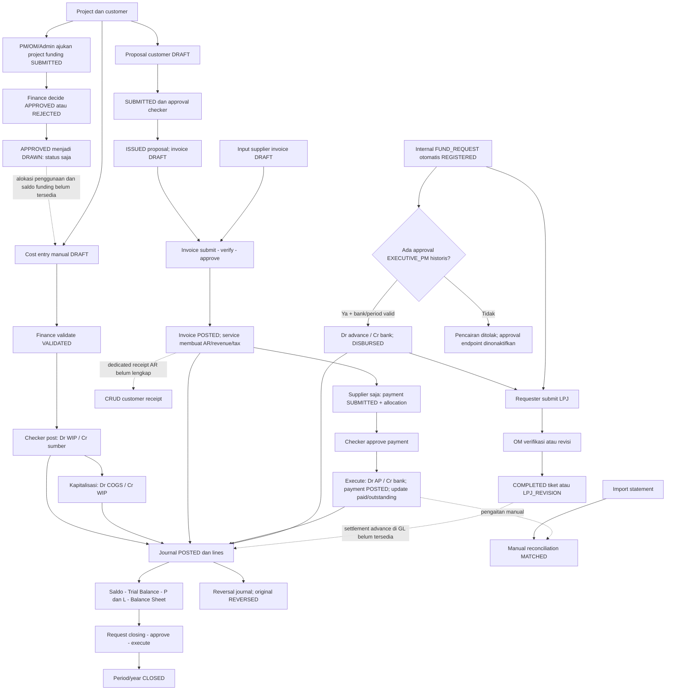

# Flow Finance ERP — implementasi aktual

Tanggal pemeriksaan: **7 Oktober 2026 (Asia/Jakarta)**. Dokumen Finance untuk pekerjaan ini berada seluruhnya dalam file ini.

## 1. Batas pembuktian dan sumber

Runtime aktif adalah **Express/TypeScript + Prisma/PostgreSQL** di `backend-express/`, dengan Next.js di `frontend-next/`. Django di `backend/` merupakan implementasi historis. Keberadaan model, tombol, komentar kode, atau endpoint saja tidak membuktikan alur bisnis lengkap.

Kategori yang digunakan:

- **Implemented**: operasi dan penghubungnya tersedia dalam kode aktif. Label ini bukan jaminan bahwa seluruh transaksi production sudah diuji.
- **Partially Implemented**: data/operasi tersedia, tetapi rantai proses, kontrol, atau posting belum lengkap/konsisten.
- **Not Implemented / Cannot Be Verified**: tidak ditemukan implementasi aktif, atau kondisi runtime/production tidak dibuktikan.

Sumber yang dibaca:

| Bukti | Lokasi |
| --- | --- |
| Tabel, tipe, indeks, PK dan kolom relasi | [schema.prisma](../../backend-express/prisma/schema.prisma), [baseline SQL](../../backend-express/prisma/migrations/20260922000000_production_baseline/migration.sql) |
| Pemasangan router dan pembatasan role | [app.ts](../../backend-express/src/app.ts), [RBAC](../../backend-express/src/middlewares/rbac.middleware.ts), [module-permissions](../../backend-express/src/utils/module-permissions.ts), [SoD](../../backend-express/src/middleware/sod.middleware.ts) |
| API Finance | [finance.routes.ts](../../backend-express/src/modules/finance/finance.routes.ts) |
| GL, funding, billing, bank, pajak, reversal | [finance.service.ts](../../backend-express/src/modules/finance/finance.service.ts) |
| Cost → WIP, proposal → invoice, AP payment | [finance-hardening.service.ts](../../backend-express/src/modules/finance/finance-hardening.service.ts) |
| Dokumen sumber | [finance-document.service.ts](../../backend-express/src/modules/finance/finance-document.service.ts) |
| Periode dan closing | [period-closing.service.ts](../../backend-express/src/modules/finance/period-closing.service.ts) |
| Funding dari Project dan metrik project | [projects.routes.ts](../../backend-express/src/modules/projects/projects.routes.ts), [projects.service.ts](../../backend-express/src/modules/projects/projects.service.ts) |
| Request, pencairan advance, LPJ | [request.routes.ts](../../backend-express/src/modules/core/request.routes.ts), [request.service.ts](../../backend-express/src/modules/core/request.service.ts), [request-disbursement.service.ts](../../backend-express/src/modules/finance/request-disbursement.service.ts) |
| Lifecycle, generic CRUD, immutable | [fsm.ts](../../backend-express/src/utils/fsm.ts), [crud-factory.ts](../../backend-express/src/utils/crud-factory.ts) |
| Tampilan dan adapter Finance | [FinanceClient.tsx](../../frontend-next/app/(app)/finance/FinanceClient.tsx), [finance.api.ts](../../frontend-next/lib/api/finance.api.ts), [workspace Finance](../../frontend-next/components/finance) |
| Procurement matching, laporan, command alternatif | [three-way-match.service.ts](../../backend-express/src/modules/procurement/three-way-match.service.ts), [reporting.routes.ts](../../backend-express/src/modules/reporting/reporting.routes.ts), [commands.routes.ts](../../backend-express/src/modules/commands/commands.routes.ts) |

Database **QA lokal** `marka_qa_20261005` pada `127.0.0.1:55440` diperiksa: tersedia 37 tabel `fin_*`. Query katalog FK untuk sembilan tabel utama funding/cost/billing/payment/journal menghasilkan **0 constraint FOREIGN KEY**. Prisma mendefinisikan sebagian besar hubungan Finance sebagai kolom ID scalar, bukan `@relation`; baseline SQL juga memuat PK dan indeks tabel-tabel tersebut tanpa FK Finance terkait. Hubungan logis tetap digunakan service. Constraint dan kelengkapan migration **production tidak diperiksa dalam pekerjaan ini**; jangan menyamakan hasil QA dengan audit production.

## 2. Gambaran umum dan role

Finance mencatat biaya project, permintaan modal, invoice, pembayaran, rekening bank, jurnal, pajak, laporan keuangan, serta tutup buku. Project menyediakan identitas project, customer dan anggaran; Finance memakai ID tersebut untuk costing, billing dan dimensi jurnal. Staff menjalankan request dan LPJ, sementara PM/OM mengelola project sesuai kewenangan existing.

| Role/konteks | Kewenangan efektif yang ditemukan |
| --- | --- |
| `ROLE-FINANCE` | Akses Finance jika entitlement aktif; input master/transaksi, validasi cost, posting WIP, proses billing/payment, laporan dan closing. Maker–checker masih berlaku pada aksi tertentu. |
| `ROLE-PM` | Mengajukan funding melalui Project yang boleh dikelolanya; tidak otomatis mendapat akses tulis modul Finance. |
| `ROLE-OM` | Pengelolaan project sesuai policy; pengajuan funding project; verifikasi LPJ internal request. Approval awal request OM sudah dinonaktifkan. |
| `ROLE-STAFF` / Supervisor | Internal request dan LPJ milik pembuat; tidak otomatis mempunyai kewenangan Finance. Kewenangan operasional project tidak sama dengan approval dana. |
| `ROLE-DIRECTOR` | Mount `/finance` membatasi mutasi secara default: preview/read. Beberapa handler menyebut Director sebagai approver, tetapi pembatasan mount tetap berlaku kecuali override Admin yang tervalidasi. |
| Company Admin | Governance entitlement/delegasi; funding project sesuai authority. Akses Finance mengikuti override/delegasi yang tervalidasi, bukan hak universal berdasarkan nama role. |
| Super Admin | Governance dan monitoring. Middleware global membatasi data operasional menjadi read-only; keberadaan bypass pada middleware role tidak otomatis mengizinkan mutasi Finance. |
| Customer/vendor | `master_party` sebagai pihak invoice/payment; bukan role login yang otomatis boleh menjalankan endpoint Finance. |

Urutan pemeriksaan akses: autentikasi → tenant/company efektif → entitlement modul dan delegasi → role aktif/pembatasan mutasi → validasi objek/lifecycle/SoD → persistence. Mutasi memakai company eksplisit dan mekanisme idempotency existing. Keberhasilan write membatalkan cache dashboard. Input finansial bukan izin untuk melewati scope company.

**Maker–checker:** `enforceSoD` menolak creator yang melakukan aksi checker pada objek yang sama. Jika handler menyediakan `getAmountValue`, threshold konfigurasi dapat berlaku; jangan menganggap seluruh aksi mempunyai pengecualian nominal. Delegation of Authority dengan delegator, masa berlaku dan revocation belum tersedia; status `DELEGATED` tidak diakui sebagai bypass. Kontrol WIP menolak pembuat yang mem-post cost. Payment/closing menerapkan pemisahan executor ketika terdapat ≥2 assignment user Finance; jika maker/requester dan approver berbeda, aturan ini praktis membutuhkan user ketiga sebagai executor, bukan sekadar dua orang.

## 3. Project Funding

### 3.1 Pengajuan project — Implemented

`POST /api/v1/projects/projects/:id/funding_requests` memerlukan PM/OM/Company Admin atau override Project, dan `assertCanManageProject` pada project company aktif.

Input:

- `amount` atau `requested_amount`: angka finite >0.
- `category`: `OPERATIONAL`, `MATERIAL`, `LOGISTICS`, `EQUIPMENT`, atau `OTHER`.
- `description` atau `purpose`: alasan wajib dan tidak kosong.

Backend membuat `fin_project_funding` dengan `project_id`, tenant/company dari project, `created_by_id` dan `requested_by_id` dari caller, `funding_type=category`, `purpose`, `requested_amount`, `submitted_at`, `approved_limit=0`, `status=SUBMITTED`. Pemohon tidak otomatis memperoleh akses modul Finance.

`GET` pada route yang sama mengembalikan funding berdasarkan project/company; handler ini tidak memanggil assertion authority project yang dipakai oleh POST. Jangan mengklaim seluruh route read funding mempunyai pemeriksaan authority objek yang identik.

Alternatif `POST /api/v1/finance/project-fundings/` memakai generic CRUD dan membuat `DRAFT`. Schema juga menyediakan party sumber dana, currency, interest, start/maturity date, limit serta metadata review. Field tersedia bukan bukti mekanisme pinjaman lengkap.

### 3.2 Approval dan draw — Partially Implemented

`POST /finance/project-fundings/:id/decide` menerima `decision=APPROVED|REJECTED`, atau adapter `action=approve`; mengambil objek company aktif lalu menyimpan status, `approved_by_id`, `approved_at`. **Implementasi tidak memvalidasi status asal, tidak menerapkan maker–checker pada route ini, tidak mengisi approved_limit dari requested_amount, dan parameter remarks tidak disimpan.** Penolakan menggunakan metadata approved yang sama, bukan `rejected_by_id/rejected_at`.

`POST /finance/project-fundings/:id/draw` memakai FSM: **APPROVED → DRAWN**. Handler hanya mengubah `status`. Tidak ada perintah transfer bank, `fin_payment`, jurnal, atau `fin_project_funding_transaction` yang dibuat dalam handler.

FSM mendefinisikan DRAFT → SUBMITTED → APPROVED/REJECTED → DRAWN, tetapi route submit funding khusus tidak ditemukan di router Finance aktif. Generic CRUD melarang penulisan field lifecycle `status`, sehingga DRAFT yang dibuat melalui CRUD tidak mempunyai jalur submit yang terbukti pada router ini. Pengajuan melalui Project sudah langsung SUBMITTED.

### 3.3 Penggunaan dan sisa dana

`fin_project_funding_transaction` mempunyai `project_funding_id`, `payment_id`, `journal_entry_id`, `transaction_type`, tanggal, amount, outstanding_balance. **Not Implemented / Cannot Be Verified:** tidak ditemukan command aktif yang mengisi tabel ini saat decide/draw/cost, maupun perhitungan saldo funding dari transaksi tersebut.

Cost dan funding sama-sama mempunyai `project_id`, tetapi **cost entry tidak mempunyai funding_id**. Tidak ada alokasi biaya otomatis ke satu funding atau pengurangan dana tersedia. Tampilan “sisa anggaran” dari budget project minus cost merupakan **sisa budget**, bukan sisa kas funding yang sudah dicairkan.

## 4. Internal FUND_REQUEST dan LPJ: jalur berbeda

Alur ini memakai `core_workflow_instance`, `request_ticket` dan audit payload, bukan `fin_project_funding`.

1. `RequestService.createRequest` membuat DRAFT bila `is_draft`; selain itu otomatis REGISTERED. Jenis FUND_REQUEST, judul, amount, project opsional, requester dan pihak terkait disimpan sesuai payload/request existing.
2. Endpoint compatibility `validate-om` dan `approve-exec` saat ini melempar validation error: approval awal OM/PM/Director **sudah dinonaktifkan**. Middleware request mengaktifkan status historis PENDING_OM/PENDING_EXEC/RE_CHECKING menjadi REGISTERED.
3. `POST /requests/:id/disburse` adalah Finance-only. Memerlukan rekening aktif dengan ledger, referensi transfer aktual, amount positif dari audit CREATE_REQUEST, akun advance **1140**, periode terbuka, workflow INTERNAL_FUND_REQUEST dalam REGISTERED, **serta** `core_workflow_approval` dengan `decision=APPROVED`, `approval_level=EXECUTIVE_PM`.
4. Jika syarat lengkap, transaksi Serializable membuat business document REQUEST_ADVANCE_PAYMENT, jurnal POSTED **Dr advance 1140 / Cr ledger bank**, payment REQUEST_ADVANCE POSTED dan audit DISBURSE_FUND. Workflow menjadi DISBURSED. Replay advance yang sudah dicairkan dapat mengembalikan payment existing. Command **mencatat transfer yang sudah dilakukan**, tidak memanggil bank.
5. `submit-lpj` hanya pembuat workflow. Status asal yang diterima: REGISTERED, DISBURSED, LPJ_REVISION. Input realisasi >0, discrepancy amount/type, notes dan invoices. Workflow menjadi PENDING_LPJ_VERIFICATION; rincian LPJ dicatat dalam audit dan dikirim notifikasi OM.
6. OM melalui `verify-lpj-om`: APPROVE → COMPLETED; REVISE → LPJ_REVISION. Keputusan dan catatan disimpan sebagai workflow approval/audit. Status COMPLETED di sini menutup **tiket**, bukan otomatis menutup tahun buku/project.

**Partially Implemented:** request baru otomatis aktif tetapi pencairannya tetap meminta bukti approval executive yang tidak dibuat jalur approval baru. Request historis yang mempunyai bukti tersebut dapat memenuhi guard; request baru belum membentuk rantai pencairan lengkap dari route yang diperiksa. LPJ menyimpan data realisasi/selisih, tetapi tidak ditemukan posting settlement **Dr expense/WIP / Cr advance**, pengembalian sisa, atau tambahan pencairan otomatis. Jangan menganggap LPJ COMPLETED berarti advance sudah diselesaikan di GL.

## 5. Project Cost / pengeluaran

### 5.1 Pencatatan — Implemented

UI Costing membuat `fin_project_cost_entry` melalui CRUD, dengan `source_type=MANUAL_COST`, referensi sumber, deskripsi, project, division opsional, `cost_element`, tanggal, quantity, unit_cost dan total_cost. Pilihan UI: **MATERIAL, LABOR, EQUIPMENT, SUBCONTRACTOR, OVERHEAD**. Field source_type/cost_element berupa String dalam schema, bukan enum database yang menjamin daftar ini untuk seluruh caller.

Relasi material/transaksi memakai `source_reference` berupa String dan dimensi project/division. Tidak ditemukan FK material/stock/payment/funding pada cost entry. `project_expense` adalah entitas terpisah dan digabung oleh endpoint Project costs; bukan sinonim otomatis untuk jurnal atau WIP.

### 5.2 Validasi dan WIP — Implemented

- CRUD membuat DRAFT.
- `POST /project-cost-entries/:id/validate`: DRAFT → VALIDATED; memeriksa total_cost >0 dan project company aktif; menyimpan validator/tanggal. Validasi VALIDATED dapat mengembalikan objek existing.
- `GET /project-cost-entries/wip-readiness`: pemeriksaan status dan maker, tanpa posting; hasil `can_post`, `reason` READY/MAKER_CHECKER_REQUIRED/INVALID_STATUS serta message.
- `POST /project-cost-entries/:id/post-to-wip`: hanya VALIDATED, caller berbeda dari creator; wajib `credit_account_id` akun aktif company yang berbeda dari WIP. Transaksi Serializable membuat business document PROJECT_COST_WIP, periode terbuka, jurnal POSTED, **Dr WIP 1150 / Cr akun sumber yang dipilih**, lalu cost menjadi POSTED_TO_WIP dengan journal ID dan metadata posting.

Biaya VALIDATED belum otomatis menjadi beban GL. WIP merupakan ASSET sampai dipindah ke COGS. Ringkasan project di `ProjectsService` menghitung cost berstatus VALIDATED, APPROVED, POSTED_TO_WIP; APPROVED adalah status yang dibaca, bukan transisi cost yang dibuat command validasi di atas.

`POST /finance/projects/:id/capitalize-wip`: Dr COGS 5100 / Cr WIP 1150. Nominal dibatasi saldo WIP; kelebihan dapat dicatat sebagai cost variance. **Partially Implemented:** saldo pembatas dihitung menggunakan akun WIP seluruh company, bukan saldo WIP khusus project, walau journal line hasil diberi project_id. Catatan variance dapat diabaikan saat write gagal. Tidak ada hubungan otomatis dengan funding, material issue, atau invoice milestone.

**Not Implemented / Cannot Be Verified:** collector otomatis yang mengubah seluruh consumption material, labor/equipment dan overhead menjadi cost entry pada runtime Express. Tabel/snapshot/aturan overhead tersedia, tetapi bukan bukti bahwa semua sumber biaya sudah diposting otomatis. Fungsi costing Django historis tidak dipakai sebagai bukti runtime aktif.

## 6. Billing / proposal / pembayaran

### 6.1 Proposal customer — Implemented

CRUD `/billing-proposals` membuat DRAFT; project wajib. `CustomerPartyService.ensureForProject` memastikan party customer project dan backend menetapkan customer_id/requested_by_id. Input meliputi trigger_type, description, subtotal >0, tax_rate/tax_amount non-negatif, total_amount >0, tax_scheme opsional. Backend memeriksa angka tersebut, tetapi tidak menghitung ulang seluruh pajak/total dari invoice line pada hook ini.

Transisi:

`DRAFT → SUBMITTED → APPROVED → ISSUED`

Submit menyimpan submitted_at; approve memerlukan checker berbeda dari creator dan menyimpan approver/tanggal. Issue hanya APPROVED, project/customer aktif dalam company, invoice number unik dalam company. Menghasilkan business document CUSTOMER_INVOICE, billing document **DRAFT**, satu billing line quantity=1, serta link proposal.billing_document_id; proposal menjadi ISSUED. Jika proposal sudah mempunyai invoice valid, issue mengembalikan invoice itu. **APPROVED proposal bukan invoice POSTED.**

### 6.2 Invoice — Implemented, dengan batas akuntansi

Schema mendukung CUSTOMER_INVOICE dan SUPPLIER_INVOICE melalui billing_type String. Invoice menyimpan project/party, currency, payment term, sales/purchase order opsional, subtotal, tax, total, paid/outstanding, status serta verification/approval metadata.

Workflow command:

`DRAFT → SUBMITTED → VERIFIED → APPROVED → POSTED`

Finance submit; checker Finance verify; checker Finance approve; Finance berbeda dari creator post. Reject dari SUBMITTED/VERIFIED → REJECTED tersedia, tetapi route reject tidak memakai `enforceSoD`. FSM mencantumkan cancel/reverse billing, namun tidak ditemukan route aktif yang menjalankan semua event itu pada billing document.

Posting invoice membuat/menautkan business document, status invoice POSTED, journal POSTED **Dr AR 1130 sebesar total / Cr revenue 4100 sebesar subtotal / Cr tax liability 2120 sebesar tax**. Tax transaction CALCULATED dapat dibuat jika tax_amount >0. Implementasi mengisi tax_rate **11** secara literal dan tax_direction bergantung billing_type. Ini penjelasan kode, **bukan pernyataan tarif pajak yang berlaku**.

**Partially Implemented:** service posting tersebut menggunakan jurnal AR/revenue juga ketika billing_type=SUPPLIER_INVOICE; tidak ditemukan percabangan posting supplier ke expense/WIP/input tax dan AP. Karena itu invoice supplier POSTED tidak membuktikan saldo AP yang benar. Pajak/tax_scheme frontend tidak otomatis membuktikan penghitungan seluruh pajak konsisten di service posting.

### 6.3 AP payment — Implemented, tetapi pencatatan bank eksternal

`POST /billing-documents/:id/create-payment` menerima **SUPPLIER_INVOICE POSTED saja**. Wajib amount >0 dan ≤outstanding, bank aktif dengan ledger, reference_number belum dipakai, payment_date dan payment_method opsional. Membuat business document AP_PAYMENT, `fin_payment` tipe OUTGOING **SUBMITTED** dan allocation ke billing. Belum mengurangi outstanding atau mencatat GL pada saat submit.

Payment generic dapat dibuat DRAFT dan disubmit. Approve menggunakan FSM SUBMITTED → APPROVED dan SoD terhadap creator. Execute memerlukan APPROVED, execution_reference, allocation, total allocation≈amount (toleransi 0,01), bank ledger aktif, AP 2110, periode terbuka dan guard executor.

Execute secara Serializable menghasilkan **Dr AP 2110 / Cr bank ledger**, jurnal POSTED, business document POSTED, payment POSTED dengan executed_by/at/reference. Untuk setiap allocation, `paid_amount += allocated_amount`, `outstanding=max(total-paid,0)`; payment_status menjadi PARTIALLY_PAID atau PAID (outstanding≤0,01). Overpayment ditolak. Replay payment POSTED dengan journal ID mengembalikan payment existing; guard route tetap dievaluasi.

Tidak ada panggilan bank/virtual account/payment gateway. Status POSTED adalah catatan aplikasi, bukan bukti konfirmasi bank independen. Line jurnal payment AP belum diisi project_id; project dapat ditelusuri melalui payment allocation → billing.project_id, bukan langsung dari setiap payment journal line.

### 6.4 AR receipt dan selesai/closed

`/customer-receipts` dan `/vendor-payments` merupakan alias CRUD model **fin_payment yang sama**; router tidak otomatis menyaring/memaksa payment_type berdasarkan nama alias. UI menyediakan pencatatan penerimaan, tetapi dedicated command receipt **Dr bank / Cr AR** beserta allocation/settlement AR tidak ditemukan. `executePayment` selalu menggunakan AP/bank; jangan menyebutnya mesin eksekusi AR yang lengkap.

**Partially Implemented:** data receipt tersedia; alur receipt → approval → posting AR → pelunasan customer secara lengkap belum terbukti. Create-payment customer invoice ditolak oleh guard supplier-only.

Invoice dianggap **lunas** secara data ketika payment_status=PAID dan outstanding≈0. Status dokumen tetap POSTED; tidak ada command billing CLOSED yang ditemukan. Proposal ISSUED berarti invoice sudah dibuat, bukan sudah dibayar. Penyelesaian invoice, tiket LPJ, project dan periode fiskal adalah kejadian berbeda.

## 7. Pembukuan dan akuntansi yang tersedia

### 7.1 Kapan transaksi masuk buku

Penyimpanan funding, cost DRAFT/VALIDATED, proposal, invoice DRAFT dan payment SUBMITTED/APPROVED belum berarti masuk GL. Pembukuan GL ada pada `fin_journal_entry` + `fin_journal_line`; laporan service saldo/trial balance/P&L/balance sheet memakai jurnal **POSTED**.

| Kejadian | Representasi buku |
| --- | --- |
| Funding decide/draw | Status funding saja; tidak membuat journal/payment |
| Internal advance dengan seluruh guard terpenuhi | Dr advance 1140 / Cr bank |
| Cost posting WIP | Dr WIP 1150 / Cr sumber pilihan Finance |
| WIP capitalization | Dr COGS 5100 / Cr WIP |
| Posting billing | Dr AR / Cr revenue + tax liability; keterbatasan supplier di §6 |
| Eksekusi AP payment | Dr AP / Cr bank; allocation memperbarui paid/outstanding invoice |
| Internal transfer rekening | Dua jurnal melalui Cash in Transit 1140: Dr transit/Cr rekening asal, Dr rekening tujuan/Cr transit |
| Jurnal manual | Entry/line draft, lalu command post dengan minimal dua baris dan selisih debit–credit ≤0,001 |
| Reversal | Journal pembalik POSTED, debit/kredit ditukar; original menjadi REVERSED |
| Closing tahunan | Jurnal penutup akun REVENUE/EXPENSE menuju retained earnings 3200 |

Pemasukan kas, pendapatan dan piutang bukan data yang sama: invoice posting mengakui AR/revenue; penerimaan seharusnya menyelesaikan AR tetapi jalur khususnya belum terbukti. Pengeluaran bank bukan selalu expense langsung: advance dan WIP tercatat sebagai ASSET. Pembukuan project memakai journal_line.project_id jika command mengisinya.

### 7.2 Account, jurnal dan laporan — Implemented

COA standard mempunyai ASSET, LIABILITY, EQUITY, REVENUE, EXPENSE dan normal_balance DEBIT/CREDIT. Akun penting: 1110 kas, 1120 bank, 1130 AR, 1140 advance/transit, 1150 WIP, 1200 fixed assets, 2110 AP, 2120 tax liability, 2130 accrued, 3100 capital, 3200 retained earnings, 4100 project revenue, 4200 other revenue, 5100 direct cost, 6100 payroll, 6200 operational expense.

Journal entry menyimpan journal/fiscal_period/currency, exchange_rate, source document, posting date, description, status; line menyimpan account, debit/credit base, transaction amount/currency, party, project, cost center, department, product/warehouse serta due date. Saldo DEBIT normal = debit−credit; CREDIT normal = credit−debit. Saldo rekening bank berasal dari ledger account; rekening tanpa ledger menghasilkan balance=0 dengan note, bukan saldo bank yang telah diverifikasi.

Service laporan tersedia untuk trial balance, profit-and-loss berdasarkan tanggal, dan balance sheet as-of. **Batas:** `postJournalEntry` memeriksa periode dengan `assertPeriodOpen(postingDate)` tanpa companyId, kemudian mengganti posting_date dengan waktu saat post. Periode yang tidak ditemukan diperbolehkan oleh assertPeriodOpen. WIP/AP menggunakan `ensureOpenPostingPeriod` yang lebih kuat dan scoped. Jangan mengklaim semua jalur posting memiliki guard periode yang sama.

### 7.3 Reconciliation — Partially Implemented

Import statement JSON/CSV membuat `fin_bank_statement` dan line; status JSON UNRECONCILED, jalur CSV menggunakan statement IMPORTED. `POST /bank-statement-lines/:id/reconcile` membuat `fin_bank_reconciliation` MATCHED dengan statement line, payment/journal line opsional, amount dan match type; menolak statement line yang sudah punya reconciliation.

Tidak ada matching otomatis yang ditemukan. Service memeriksa statement line company aktif, tetapi tidak memvalidasi lengkap target payment/journal line atau kesetaraan amount terhadap mutasi bank; status statement line tidak ikut diubah oleh command match tersebut. Jadi MATCHED adalah catatan pengaitan, bukan bukti rekonsiliasi lengkap/penutupan statement atau settlement invoice.

### 7.4 Closing — Implemented dengan keterbatasan

Request `/period-closings/request` membuat PENDING_APPROVAL, jenis MONTHLY dengan fiscal_period_id atau YEAR_END dengan fiscal_year_id/document_id. Finance selain requester approve → APPROVED. Executor yang memenuhi guard menjalankan service lalu request menjadi COMPLETED.

- Bulanan: period harus OPEN, tidak boleh ada jurnal DRAFT dalam rentang tanggal. Menghitung P&L jurnal POSTED, mencoba menyimpan financial snapshot PERIOD_CLOSE, kemudian period CLOSED dan audit. Kegagalan snapshot ditangkap/dilewati; langkah bulanan dan update request tidak berada dalam satu transaksi menyeluruh.
- Tahunan: menghitung saldo akun nominal, membuat jurnal penutup ke retained earnings 3200, menutup seluruh periode/tahun. Perubahan jurnal dan status utama dibungkus transaksi service, tetapi request/audit terpisah. Ketepatan untuk saldo nominal abnormal belum diverifikasi; kode memakai nilai absolut pada beberapa line closing.
- Route lama `/fiscal-periods/:id/close` dan `/fiscal-years/:id/year-end-closing` sengaja menolak dan mengarahkan ke request → approve → execute.
- Monthly reopen menyetel period OPEN melalui command; tidak meminta alasan/SoD pada handler itu.
- Year reopen mempunyai service storno dan alasan ≥10 karakter, tetapi route memakai `requireSuperadmin` sementara Super Admin global read-only dan Director Finance read-only secara default. Akses efektif route tersebut belum terbukti sebagai jalur operasional yang dapat dipakai.

### 7.5 Reversal / correction — Partially Implemented

`POST /journal-entries/:id/reverse`: Finance dan checker berbeda creator, reason minimal 5 karakter; hanya original POSTED dengan line. Membuat reversal POSTED dengan `reversal_of_entry_id`, pertukaran debit/kredit dan salinan dimensi; original REVERSED. Original tidak dihapus.

**Kesenjangan dari source:** laporan service memilih jurnal POSTED saja, sehingga original REVERSED dikecualikan sementara reversal tetap dihitung. Inferensi aritmetika dari kode: original Dr100/Cr100 lalu reversal dapat menghasilkan hanya efek negatif original dalam laporan, bukan net zero. Tidak ada sinkronisasi reversal tersebut ke billing.payment_status, payment allocation atau cost status. Service reversal juga tidak memanggil guard periode terbuka. Karena itu keberadaan reversal journal **bukan** bukti reversal bisnis menyeluruh yang akurat. Koreksi lewat generic CRUD pada record terminal tetap ditolak.

**Not Implemented / Cannot Be Verified:** koreksi/reversal funding, settlement LPJ, receipt AR dan billing/payment/cost secara terpadu; bank integration; complete automatic reconciliation; validated DoA; automation recurring payment run dan distribusi overhead dari rule sampai GL.

## 8. Administrasi, dokumen, pemeriksaan dan audit

Administrasi berjalan sepanjang proses, bukan tahap tunggal setelah akuntansi:

1. Persiapan company/tenant, party/customer/vendor, COA, bank ledger, fiscal year/period, currency dan payment term.
2. Input dokumen/biaya dengan project dan scope yang benar; nominal, akun, party, tanggal serta reference sesuai command.
3. Verifikasi/approval sesuai entity: cost validate; invoice verify/approve; proposal approve; payment approve; closing approve. Funding decide dan reject billing memiliki kontrol yang lebih terbatas daripada aksi SoD lain.
4. Posting WIP/invoice/payment serta pencatatan referensi eksternal. Dokumen sumber dari FinanceDocumentService berupa `core_business_document`, bukan ID tabel cost/payment yang dipaksakan ke source_document_id.
5. Pemeriksaan ledger, saldo bank, allocation/outstanding, reconciliation dan tax. Tax CALCULATED → PAID melalui record-ntpn dengan ntpn/payment_reference/paid_at; NTPN dicatat aplikasi, tidak diverifikasi ke sistem pajak eksternal. UI memiliki tindakan yang menyatakan belum tersedia bila command-nya tidak ada; tabel tax tidak membuktikan integrasi e-Faktur/filing otomatis.
6. LPJ/request completion, closing fiskal, atau reversal hanya melalui jalur yang tersedia, dengan batasan pada §4/§7.

Audit middleware umum dan `AuditService` menyimpan entity, actor, event/action, before/after, waktu, company dan context pada `core_audit_event`. Request payload, assignment, disbursement dan LPJ memakai audit untuk rekonstruksi feed. Named service tertentu juga mencatat audit. Endpoint Finance audit-trail/executive-audit-report serta UI audit tersedia.

**Batas audit:** jangan mengklaim log kriptografis/tamper-proof atau seluruh langkah dalam satu transaksi. Beberapa audit/snapshot dikerjakan setelah transaksi atau dengan error yang dilewati; draft LPJ berada pada JSON audit, bukan seluruhnya tabel normalisasi khusus. Print/document UI menyediakan representasi dokumen; bukan bukti tanda tangan digital/legal approval atau verifikasi bukti transfer eksternal.

## 9. Status, permission, transisi dan immutable

| Entitas | Status dan arti / transisi aktif | Pengubah |
| --- | --- | --- |
| Project funding | SUBMITTED menunggu keputusan; APPROVED disetujui; REJECTED ditolak; DRAWN ditandai pencairan. DRAFT melalui CRUD, jalur submit DRAFT belum terbukti. Decide dapat mengganti status tanpa guard status asal. | Pemohon ber-authority di Project; decide/draw memakai akses tulis Finance efektif |
| Cost | DRAFT input → VALIDATED data valid → POSTED_TO_WIP ada jurnal WIP | Finance validator; poster selain creator |
| Proposal | DRAFT → SUBMITTED → APPROVED → ISSUED (invoice dibuat) | Finance; approve checker |
| Billing | DRAFT → SUBMITTED → VERIFIED → APPROVED → POSTED; SUBMITTED/VERIFIED → REJECTED | Finance efektif; verify/approve/post memakai SoD, reject tidak memakai SoD |
| Billing payment_status | UNPAID → PARTIALLY_PAID → PAID; ≤0,01 dianggap lunas | Service executePayment lewat allocation; bukan field generic write |
| Payment | DRAFT → SUBMITTED → APPROVED → POSTED; rejected/cancel ada definisi FSM tetapi route khususnya tidak ditemukan | Finance submit/approve/execute dengan guard terkait |
| Journal | Draft/manual → POSTED setelah balance check; POSTED → REVERSED + reversal baru POSTED | Finance efektif; reverse SoD + reason |
| Internal request | DRAFT/REGISTERED; legacy pending otomatis REGISTERED; pencairan valid DISBURSED; LPJ PENDING_LPJ_VERIFICATION → COMPLETED/LPJ_REVISION | Requester, Finance, OM sesuai langkah; approval awal dinonaktifkan |
| Fiscal period/year | OPEN boleh posting; CLOSED/LOCKED menolak posting pada guard yang tersedia; command reopen period OPEN | Finance/closing workflow; batas year reopen di §7 |
| Closing request | PENDING_APPROVAL → APPROVED → COMPLETED | Requester Finance, approver selain requester, executor memenuhi guard |
| Tax | CALCULATED dari invoice; PAID saat NTPN dicatat | Finance efektif |
| Bank | Statement IMPORTED/UNRECONCILED; reconciliation MATCHED | Finance import/manual match |

`assertRecordMutable` melarang generic update/delete model `fin_*` ketika **status, payment_status atau approval_status** berisi POSTED, PAID, CLOSED, LOCKED, EXECUTED, REVERSED. Lifecycle fields pada cost/proposal/billing/payment/tax/journal/period/year/funding dilindungi dari generic CRUD termasuk bulk. Dokumen finansial tidak boleh dipindahkan lifecycle dengan PATCH status biasa; gunakan named command.

**Batas aktual immutability:** POSTED_TO_WIP dan ISSUED tidak termasuk daftar terminal umum. `fin_journal_line` dan invoice line tidak membawa status parent; generic guard tidak menelusuri parent POSTED. Maka belum terbukti semua line/nominal/dimensi terminal immutable end-to-end. Kategori status String di schema tidak mempunyai enum database yang membatasi seluruh nilai. Definisi event FSM yang memiliki `requiresRole/requiresSoD` tidak menjalankan middleware itu secara otomatis; handler/mount harus memasangnya. Tidak semua event FSM mempunyai endpoint.

## 10. Database dan hubungan logis

Semua tabel utama berikut memakai `id` String dengan PK dan umumnya `tenant_id`, `company_id`, `created_by_id`; nilai biaya menggunakan Decimal. Indeks tenant/company membantu scoping tetapi bukan pengganti permission atau FK.

| Tabel | Field penting | Hubungan logis yang dipakai/disediakan |
| --- | --- | --- |
| `project_project` | budget_amount, contract_amount, customer_party_id, created_by_id | Project sumber biaya/funding/billing; creator menentukan authority PM |
| `fin_project_funding` | project_id, requested_amount, approved_limit, purpose, funding_type, requested_by_id, approved_by_id, status | project → funding; party sumber/currency/document opsional |
| `fin_project_funding_transaction` | project_funding_id, payment_id, journal_entry_id, amount, outstanding_balance | Relasi disediakan schema; command pengisian aktif belum ditemukan |
| `fin_project_cost_entry` | project_id wajib, division_id, source_type/reference, cost_element, total_cost, journal_entry_id, validator/poster/status | project/division → cost → journal; tanpa funding_id |
| `project_expense` | project_id, expense_date, category, title/vendor_name, amount, billing_document_id | Biaya Project terpisah dari cost WIP |
| `fin_billing_proposal` | project_id wajib, customer_id, trigger_type, subtotal/tax/total, billing_document_id unique | project/customer → proposal → satu invoice terkait |
| `fin_billing_document` | document_id, project_id, party_id, sales_order_id, purchase_order_id, total/paid/outstanding, status/payment_status | business document/project/party/order → billing |
| `fin_billing_document_line` | billing_document_id, project_id, product_id, quantity, unit_price, line_total | billing → detail product/project |
| `fin_payment` | document_id, party_id, bank_account_id, amount, type/status, reference, journal_entry_id, approval/execution metadata | business document/bank/party → payment → journal |
| `fin_payment_allocation` | payment_id, billing_document_id, allocated_amount, discount/writeoff/exchange_difference | payment ↔ invoice (bisa beberapa allocation) |
| `fin_account` | account_code/name/type, parent_account_id, normal_balance, is_posting_account | COA/hierarchy; account → journal line |
| `fin_journal` / `fin_journal_entry` | journal_id, fiscal_period_id, source_document_id, reversal_of_entry_id, posting_date, status | buku/period/dokumen → entry; reversal → original entry |
| `fin_journal_line` | journal_entry_id, account_id, project_id, party_id, debit_base/credit_base dan dimensi | entry → lines → account/project/party |
| `fin_bank_account` | ledger_account_id, party/currency, account_number/name/status | bank → GL account |
| `fin_bank_statement` / `_line` | bank_account_id; bank_statement_id, debit_amount/credit_amount, reference/status | bank → statement → mutasi |
| `fin_bank_reconciliation` | bank_statement_line_id, payment_id, journal_line_id, matched_amount/status | mutasi ↔ payment atau journal line |
| `fin_tax_transaction` | billing_document_id, tax_code_id, taxable/tax amount, direction/status, ntpn | invoice → tax; bukti pembayaran disimpan manual |
| `fin_fiscal_year` / `_period` | fiscal_year_id, period_number, start/end_date/status | year → period → journal |
| `fin_period_closing` / `_financial_snapshot` | fiscal_period_id/document_id, requester/approver/executor/status; period/revenue/expense/P&L | closing request dan snapshot laporan |
| `core_business_document` | document_type/number/date/status | ID sumber dokumen Finance yang dipakai named service |
| `iam_user`, role/membership, `core_workflow_instance`, `_approval`, `_audit_event`, `request_ticket` | actor/scope, request status, decision, audit JSON | kewenangan, request advance dan LPJ |

Tabel tambahan di schema: `fin_ar_ap_schedule`, `fin_budget`, `_budget_line`, `fin_credit_facility`, `fin_recurring_payment_rule`, `_run`, `fin_project_wip_snapshot`, `fin_cost_baseline`, `_line`, `_variance`, `fin_overhead_rule`, `_allocation`, `fin_project_cost_snapshot`, `fin_unit_cost_snapshot`, `fin_invoice_variance_case`, `fin_customer_credit_limit`. Sebagian mempunyai CRUD/ringkasan; keberadaannya tidak membuktikan scheduler, alokasi otomatis, atau complete credit control.

Untuk sembilan tabel utama yang diperiksa di QA, *_id di atas adalah **relasi logis**, bukan FK fisik terverifikasi. Service named mengecek relasi tertentu dengan `findFirst` dan company. Generic CRUD memakai pola scope existing; tidak boleh diasumsikan semua *_id memiliki pemeriksaan FK lengkap. Year closing/reopen memakai fiscalYearId sebagai source_document_id, berbeda dari pola FinanceDocumentService yang memakai core_business_document.id.

## 11. API / backend flow

Prefix default tabel berikut: **`/api/v1/finance`**. Semua akses mengikuti mount/entitlement/role aktif pada §2; “Finance” berarti akses tulis efektif yang tervalidasi, bukan hanya label role. Respons command Finance menggunakan objek/array langsung dari `sendSuccess`; CRUD list menggunakan `count,next,previous,results`. Mutasi membutuhkan kontrak idempotency existing; scope company dari context/header, bukan payload bebas.

| Method/path | Input / hasil penting | Akses dan persistence |
| --- | --- | --- |
| GET/POST `/api/v1/projects/projects/:id/funding_requests` | amount/category/description → SUBMITTED funding; GET daftar | POST PM/OM/Admin atau override + project authority; fin_project_funding |
| POST `/project-fundings/:id/decide` | decision/action, remarks → status + approver/time | Finance mount; decide tidak memasang SoD/status asal |
| POST `/project-fundings/:id/draw` | ID APPROVED → DRAWN | Finance mount; update status saja |
| POST `/project-cost-entries/:id/validate` | ID DRAFT → VALIDATED + validator/time | Finance; cost/project scope |
| GET `/project-cost-entries/wip-readiness` | entry_id opsional → can_post/reason/message | Finance; read cost status/creator |
| POST `/project-cost-entries/:id/post-to-wip` | credit_account_id → POSTED_TO_WIP + journal ID | Finance selain creator; cost/document/account/period/journal/lines |
| POST `/projects/:id/capitalize-wip` | amount, description → capitalized/overrun/journal | Finance efektif; handler tidak memasang SoD; WIP/COGS, variance opsional |
| POST `/billing-proposals/:id/submit`, `/approve` | ID/status → submitted/approved proposal | Finance; approve SoD |
| POST `/billing-proposals/:id/issue-billing-document` | invoice_number/date/due_date/currency/payment_term opsional → invoice | Finance; proposal/project/customer/business doc/billing/line |
| POST `/billing-documents/:id/submit`, `/verify`, `/approve`, `/reject`, `/post` | ID + lifecycle → invoice; post membuat journal/tax | Finance; verify/approve/post SoD, reject berbeda kontrol |
| POST `/billing-documents/:id/create-payment` | amount, bank_account_id, payment_date, reference_number, method/description → SUBMITTED AP payment | Finance; supplier invoice/payment/allocation/document |
| POST `/payments/:id/submit`, `/approve`, `/execute` | execute wajib execution_reference → POSTED payment | Finance; approve SoD, executor guard; allocation/billing/GL/period/document |
| POST `/journal-entries/:id/post` | ID/lines seimbang → POSTED | Finance mount; journal/lines, period guard terbatas |
| POST `/journal-entries/:id/reverse` | reason≥5 → original/reversal IDs | Finance + SoD; journal/lines saja |
| POST `/accounts/setup-standard` | setup company → COA | Finance; fin_account |
| GET `/accounts/:id/balance`, `/bank-accounts/:id/balance` | scope ID → debit/credit/net/balance | read Finance/Director sesuai mount; account/GL |
| POST `/bank-accounts/internal-transfer` | from_bank_account_id,to_bank_account_id,amount,description,reference_number opsional → transfer jurnal | Finance; dua rekening, COA/transit, journal/line |
| POST `/bank-accounts/:id/import-statement`, `/import-csv` | statement_date+lines atau csv_content → statement/lines | Finance mount; bank/statement/line |
| POST `/bank-statement-lines/:id/reconcile` | payment_id/journal_line_id, matched_amount, match_type → MATCHED | Finance; bank_reconciliation, batas validasi §7 |
| GET `/trial-balance`, `/profit-and-loss`, `/balance-sheet` | filter tanggal sesuai handler → laporan POSTED journals | read Finance/Director; account/entry/line |
| GET `/tax-summary`, `/tax-transactions/projection` | filter query → tax summary/projection | read Finance/Director; tax/billing/project terkait |
| POST `/tax-transactions/:id/record-ntpn` | ntpn,payment_reference,paid_at → PAID | Finance mount; tax transaction |
| POST `/period-closings/request`, `/:id/approve`, `/:id/execute` | MONTHLY/YEAR_END dan period/year ID → closing request/result | Finance; approval/executor guard, period/year/journals/snapshot |
| GET `/fiscal-periods/status` | period metadata → status list | read Finance/Director |
| POST `/fiscal-periods/:id/close`, `/fiscal-years/:id/year-end-closing` | compatibility → error directing closing workflow | sengaja tidak mengeksekusi closing langsung |
| POST `/fiscal-periods/:id/reopen` | ID → OPEN | Finance efektif; period |
| POST `/fiscal-years/:id/reopen-year-end` | reason≥10 → rollback | requireSuperadmin + mount; keterjangkauan belum terbukti |
| GET `/audit-trail`, `/executive-audit-report` | company/filter/tahun → audit projection | read Finance/Director; audit/journals/request/period |
| GET `/project-options`, `/party-options` | party role opsional → scoped selector | read Finance/Director; project/party |
| POST `/api/v1/requests/:id/disburse` | disburse_account_id/reference → advance payment/journal/status | Finance; approval guard lama tetap wajib |
| POST `/api/v1/requests/:id/submit-lpj`, `/verify-lpj-om` | realization/discrepancy/invoices atau decision/remarks → LPJ status | requester atau OM; workflow/approval/audit |

CRUD resource aktif meliputi `/accounts`, `/journals`, `/journal-entries`, `/journal-lines`, `/fiscal-years`, `/fiscal-periods`, `/billing-documents`, `/billing-document-lines`, `/billing-proposals`, `/payments`, `/customer-receipts`, `/vendor-payments`, `/payment-lines`/`payment-allocations`, `/bank-accounts`, `/bank-statements`, `/bank-statement-lines`, `/bank-reconciliations`, `/tax-transactions`, `/budgets`, `/budget-lines`, `/project-cost-entries`, `/project-fundings`, `/credit-facilities`, `/recurring-payment-rules`, `/overhead-rules`. Detail/create/update/delete mengikuti factory; lifecycle/terminal guard tetap membatasi operasi tertentu. Tidak ada router `project-funding-transactions` pada daftar aktif ini.

Ada command alternatif `POST /api/v1/commands/finance/journal-entries/:id/post` yang memanggil service posting, dan `GET /commands/finance/flow-status` hanya mengembalikan `{status:ACTIVE,healthy:true}` secara literal. Endpoint flow-status **bukan health check database atau bukti seluruh chain Finance sukses**.

Procurement mempunyai three-way-match service yang membandingkan PO, receipt dan invoice. Modal verifikasi Finance secara eksplisit menjelaskan bahwa verify invoice hanya lifecycle SUBMITTED → VERIFIED, tidak mengklaim otomatis 3-way match. PO/receipt/material adalah alur terkait, bukan langkah yang terbukti selalu dipanggil oleh invoice verify.

## 12. Flow end-to-end aktual

Diagram memisahkan cabang yang memang tersedia. Garis putus-putus berarti penghubung belum dibuktikan/masih parsial; bukan automation yang tersedia.

Alur yang paling lengkap adalah **Project → cost manual → validate → post WIP → jurnal/laporan**, serta **proposal → invoice → workflow posting** dan **supplier invoice POSTED → payment approval → AP execution → allocation**. Namun supplier posting, AR settlement, funding cash dan reversal/reporting masih mempunyai kesenjangan di atas; diagram tidak menyatakan seluruh rantai benar secara akuntansi.

## 13. Perbedaan dokumentasi, database, backend dan frontend

| Perbedaan | Bukti dan konsekuensi |
| --- | --- |
| README historis/Django menggambarkan Finance lengkap | README menandai Express + Next sebagai runtime aktif; model/test/service Django tidak membuktikan fungsi Express |
| Daftar route dokumentasi lama menyebut Director dapat approval/reverse/close | Handler boleh menyebut Director, tetapi mount Finance default read-only; permission efektif harus membaca keseluruhan pipeline |
| FLOW funding atau label “pencairan” memberi kesan transfer | Draw hanya status; tidak ada payment/journal/funding transaction otomatis |
| Request auto-created tanpa approval vs disbursement guard | Approval endpoint dinonaktifkan, tetapi advance tetap memerlukan EXECUTIVE_PM approval; chain request baru belum lengkap |
| Tabel transaction/snapshot/rule ada | Banyak data model belum dihubungkan oleh command/scheduler aktif; tidak otomatis Implemented end-to-end |
| Customer receipt UI dan alias API | Alias memakai fin_payment umum; create-payment supplier-only dan execute selalu AP/bank; posting receipt AR belum terbukti |
| Invoice supplier dan customer berbeda makna | Service invoice post tetap AR/revenue; tax_direction saja berbeda |
| “Verify invoice” vs three-way match | Verify Finance hanya status; service matching procurement terpisah |
| Sisa budget vs sisa funding | Frontend menghitung budget−cost; bukan draw−usage funding |
| Dashboard laporan Finance vs laporan GL | `/reporting/finance-main-dashboard` menjumlahkan payment EXECUTED, sementara executePayment menghasilkan POSTED; cash_position literal 1.500.000.000 dan overdue count literal 0. Tidak boleh dipakai sebagai saldo/overdue terverifikasi. Service GL menghitung dari POSTED journals. |
| Storno tersedia vs laporan setelah reversal | Original REVERSED dikeluarkan oleh filter POSTED; reversal tetap dimasukkan. Net effect laporan membutuhkan perbaikan/verifikasi terpisah. |
| Klaim immutable keseluruhan | Generic terminal guard tidak memeriksa parent line dan belum memasukkan POSTED_TO_WIP/ISSUED |
| Source document identity | Cost/AP/billing memakai core_business_document; year close/reopen memakai fiscalYearId pada kolom sama |
| Foreign key pada nama field | Prisma scalar ID dan katalog QA tidak membuktikan FK fisik; relasi utama ditegakkan sebagian lewat service |

Temuan Finance ini **didokumentasikan, bukan diperbaiki** dalam pekerjaan task/notulensi/dashboard agar scope Finance tetap dokumentasi saja.

## 14. Validasi dan bagian yang belum terverifikasi

Pemeriksaan aktual mencakup source aktif, schema, baseline migration, akses/lifecycle, frontend adapter dan katalog database QA lokal. Pengujian perubahan task/notulensi/dashboard terpisah dari verifikasi Finance; hasilnya tidak membuktikan semua workflow Finance end-to-end.

Uji Finance regresi yang digunakan: `tests/integration-hardening.unit.ts` memeriksa three-way-match tepat/mismatch, referensi lintas scope tanpa write, input advance invalid, serta guard lifecycle/tax; persistence-nya **mocked**, bukan bank/live GL. `tests/project-financial-targets.unit.ts` dan guardrail/module-permission tests memeriksa kontrak terkait. Daftar hasil eksekusi final disampaikan pada ringkasan pekerjaan.

**Cannot Be Verified dari pekerjaan ini:** migration/constraint/data production, konfirmasi transfer eksternal, akurasi saldo riil, kelengkapan bukti approval historis, ketepatan seluruh pajak, receipt AR end-to-end, funding usage/remainder, settlement advance LPJ, automatic cost collection, overhead/recurring scheduler, serta hasil akuntansi setelah reversal/year reopen. Kesenjangan yang dapat dibaca langsung dari kode telah diberi label parsial; fitur yang tidak ditemukan tidak dipresentasikan sebagai tersedia.
