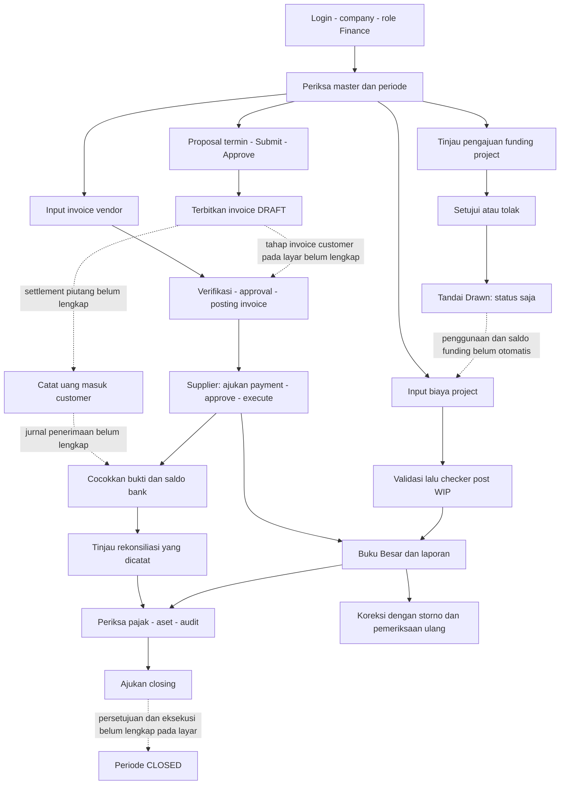

# Panduan Penggunaan Finance ERP

Panduan ini ditujukan untuk tim Finance yang memakai aplikasi sehari-hari. Nama menu dan tombol mengikuti aplikasi yang diperiksa pada **7 Oktober 2026**. Seluruh panduan Finance untuk pekerjaan ini berada dalam satu file ini.

## 1. Mulai dari login

1. Buka aplikasi ERP, lalu masuk menggunakan email dan password akun yang diberikan perusahaan.
2. Pastikan company/perusahaan aktif sesuai tempat transaksi akan dicatat. User operasional mengikuti company yang ditugaskan; pilihan perusahaan mengikuti hak akun.
3. Pastikan role aktif adalah **Finance**. Memiliki beberapa role tidak berarti semuanya aktif bersamaan; gunakan pergantian role yang tersedia pada akun.
4. Buka **Finance** pada navigasi utama. Halaman yang muncul bernama **Finance & Accounting**.
5. Jika menu tidak muncul atau muncul pesan akses ditolak, hubungi Admin untuk memeriksa assignment dan akses modul. Jangan mencoba mencatat transaksi melalui akun perusahaan lain.
6. Pada layar kecil, gunakan **Buka Menu** untuk membuka menu Finance. Klik ikon refresh untuk mengambil data terbaru.

Finance dapat mencatat dan memproses transaksi sesuai aksesnya. Pimpinan umumnya melihat laporan; hak kelola tambahan mengikuti pengaturan Admin. PM/OM mengelola project dan pengajuan funding sesuai tanggung jawabnya. Staff mengajukan request pribadi dan menyampaikan LPJ. Customer/vendor merupakan pihak transaksi, bukan otomatis pengguna aplikasi.

### Istilah yang perlu dipahami

| Istilah | Arti praktis |
| --- | --- |
| Maker | Orang yang membuat transaksi atau permintaan. |
| Checker | Orang lain yang memeriksa/menyetujui transaksi. |
| Posting | Memasukkan transaksi ke buku besar melalui jurnal. Simpan draft belum sama dengan posting. |
| WIP | Biaya pekerjaan project yang masih dicatat sebagai pekerjaan dalam proses. |
| AR / Piutang | Tagihan kepada customer. |
| AP / Utang | Tagihan dari vendor. |
| Outstanding | Bagian tagihan yang belum dilunasi. |
| Storno / reversal | Jurnal pembalik untuk koreksi; bukan menghapus jurnal asli. |

Pada persetujuan proposal, invoice, pembayaran dan closing tertentu, pembuat tidak boleh menyetujui permintaannya sendiri. Posting biaya WIP juga memerlukan user Finance lain. Jika sistem menolak karena pemisahan tugas, serahkan tahap tersebut kepada petugas yang memenuhi kewenangan. Eksekusi pembayaran/closing dapat memerlukan petugas ketiga ketika ada beberapa user Finance.

## 2. Peta menu Finance

| Menu | Dipakai untuk |
| --- | --- |
| Dashboard | Melihat ringkasan pendapatan, biaya, funding dan anggaran project. |
| Executive Report | Memeriksa laporan dan ringkasan audit untuk pimpinan. |
| Profitabilitas | Membandingkan pendapatan dan biaya project yang tampil. |
| Master Perusahaan | Memeriksa identitas perusahaan, rekening, fasilitas kredit dan unit organisasi. |
| Funding Proyek | Meninjau permohonan pendanaan dan menandai dana ditarik. |
| Costing & WIP | Mencatat biaya, memvalidasi dan mem-post biaya ke WIP. |
| Billing Termin | Membuat, mengajukan dan menyetujui proposal termin serta menerbitkan invoice. |
| Tagihan Vendor | Memeriksa invoice vendor dan mengajukan, menyetujui serta mengeksekusi pencatatan pembayaran. |
| Piutang | Melihat/catat penerimaan customer, dengan batasan proses pada bagian 9. |
| Kas & Bank | Memeriksa rekening dan saldo buku; mencatat penerimaan melalui form yang sama dengan Piutang. |
| Buku Besar | Membaca Trial Balance, jurnal umum dan melakukan storno yang diizinkan. |
| Laporan Keuangan | Memeriksa laba rugi dan neraca. |
| Rekonsiliasi | Melihat mutasi bank dan hasil pencocokan yang sudah dicatat. |
| Perpajakan | Memeriksa transaksi pajak dari billing dan mencatat referensi pajak. |
| Aset Tetap | Memeriksa register, jadwal penyusutan, proses penyusutan dan pelepasan aset. |
| Tutup Buku | Melihat periode fiskal, mengajukan closing dan membuka kembali periode sesuai izin. |
| Audit Trail | Menelusuri catatan perubahan transaksi dan pelakunya. |

Menu **Aset Tetap** memerlukan akses modul Assets. Menu atau tombol yang terlihat tetap dapat ditolak bila akun, status transaksi atau company tidak memenuhi syarat.

## 3. Persiapan sebelum mencatat transaksi

Buka **Master Perusahaan**, lalu periksa informasi di kelompok **Financial** dan **Operational** yang tersedia.

- Pastikan identitas perusahaan yang tampil benar. Simpan perubahan hanya bila akun memiliki kewenangan; bidang KPP/status PKP pada tampilan saat ini belum didukung untuk penyimpanan.
- Untuk rekening baru, gunakan form **Tambah Rekening Bank Resmi**. Periksa nama bank, nomor rekening, pemilik, currency dan akun pembukuan yang dipilih. Rekening yang akan digunakan untuk pembayaran harus aktif dan mempunyai akun buku besar yang sesuai.
- Gunakan **Tambah Fasilitas Kredit Bank** untuk mencatat fasilitas/plafon kredit. Pencatatan fasilitas belum berarti pinjaman dicairkan atau pembayaran angsuran otomatis dijalankan.
- Gunakan **Tambah Unit Divisi Organisasi** bila memang diperlukan dan diizinkan. Daftar aset operasional dapat diperiksa pada kelompok Operational; pengelolaan aset mengikuti modul terkait.
- Pastikan project dan customer/vendor sudah tersedia. Bila pilihan kosong, minta pengelola project atau Admin melengkapi data, lalu refresh.
- Sebelum posting, periksa **Tutup Buku**: tanggal transaksi harus berada dalam periode yang sesuai dan masih terbuka. Daftar akun serta tahun/periode fiskal harus sudah disiapkan oleh pihak berwenang; jangan menganggap layar Finance menyediakan form untuk seluruh pengaturan awal tersebut.

## 4. Membaca Dashboard dan Profitabilitas

1. Buka **Dashboard** untuk melihat ringkasan yang tersedia.
2. Periksa pilihan project saat membandingkan anggaran dan biaya.
3. Buka **Profitabilitas** untuk meninjau nilai pendapatan, biaya dan selisih yang ditampilkan.
4. Refresh setelah transaksi selesai agar data terbaru terbaca.

**Batas penggunaan:** ringkasan layar belum seluruhnya setara dengan laporan akuntansi resmi. Ada ringkasan yang menjumlahkan data operasional tanpa membatasi seluruh status posting. Sisa anggaran merupakan anggaran project dikurangi biaya, bukan saldo funding yang sudah ditransfer. Beberapa indikator pada Piutang dan ringkasan Finance masih berupa angka tetap. Gunakan jurnal, laporan keuangan dan rekening koran sebagai bahan pemeriksaan sebelum menyimpulkan saldo atau laba aktual.

## 5. Funding Proyek: pengajuan sampai penandaan pencairan

### Pengajuan dari project

PM/OM atau pengelola project yang berwenang mengajukan funding dari project terkait. Data yang diperlukan: project, nominal positif, kategori kebutuhan dan alasan penggunaan. Kategori yang tersedia pada pengajuan project meliputi operasional, material, logistik, equipment dan lainnya.

Pengajuan tersebut masuk **SUBMITTED**, yaitu menunggu keputusan. Finance meninjaunya melalui **Funding Proyek**.

### Pengajuan dari layar Finance

1. Klik **Request Funding** pada toolbar atau **Request Dana** di Funding Proyek.
2. Pilih project, isi jumlah dana dan keperluannya.
3. Klik **Ajukan Request Dana**.
4. Periksa baris dan status hasil penyimpanan. Pengajuan dari form Finance saat ini membuat **DRAFT**; tombolnya tidak menjamin hasil langsung SUBMITTED. Jalur submit draft funding khusus belum tersedia, walau layar menyediakan keputusan pada draft.

### Keputusan dan draw

1. Buka **Funding Proyek** dan cocokkan project, nominal serta kebutuhan dengan dokumen pendukung.
2. Klik **Setujui** atau **Tolak** sesuai hasil pemeriksaan, lalu konfirmasi.
3. Untuk funding APPROVED, gunakan **Tandai Drawn** bila perlu mencatat penarikan sesuai prosedur perusahaan.
4. Refresh dan periksa status **DRAWN**.

**Batas fitur — sebagian tersedia:** Tandai Drawn hanya menandai status. Aplikasi belum otomatis mentransfer bank, membuat pembayaran/jurnal funding, mengurangi saldo funding karena biaya project, atau menghitung sisa dana per funding. Nominal pengajuan yang tampil juga belum menjadi bukti bahwa limit dana yang disetujui sudah terisi. Catatan keputusan pada form belum terbukti disimpan oleh proses keputusan saat ini. Simpan bukti keputusan dan transfer melalui administrasi perusahaan yang berlaku.

## 6. Fund Request dan LPJ pada kartu permintaan

Ini merupakan alur terpisah dari Funding Proyek.

1. Pemohon membuat **Fund Request** melalui **Request Card / Tambahkan Kartu**, mengisi kebutuhan, nominal dan project bila relevan.
2. Request non-draft langsung aktif **REGISTERED**. Approval awal OM/pimpinan pada alur baru telah dinonaktifkan.
3. Finance membuka detail request yang akan dicairkan, memilih rekening dan mengisi referensi transfer yang benar.
4. Jika diterima, pencairan dicatat sebagai uang muka dan request menjadi **DISBURSED**. Aplikasi mencatat transfer; pembayaran bank dilakukan melalui prosedur perusahaan di luar aplikasi.
5. Pemohon mengirim LPJ berupa realisasi, selisih, catatan serta rincian invoice/bukti pengeluaran.
6. OM memverifikasi LPJ. Persetujuan menghasilkan **COMPLETED**; permintaan revisi menghasilkan **LPJ_REVISION** dan pemohon memperbaiki LPJ.

**Batas fitur — sebagian tersedia:** proses pencairan masih mensyaratkan bukti approval executive historis, sementara approval awal request baru sudah dinonaktifkan. Akibatnya request baru dapat ditolak saat pencairan. Jangan membuat persetujuan fiktif untuk melewatinya; laporkan request yang terhambat kepada Admin/pengelola sistem. LPJ COMPLETED menutup tiket, tetapi belum otomatis menyelesaikan saldo uang muka di buku besar, mencatat refund atau pencairan tambahan.

## 7. Costing & WIP: mencatat penggunaan/biaya project

1. Buka **Costing & WIP** dan klik **New Entry**.
2. Pilih project serta divisi bila diperlukan, isi kategori, jumlah biaya dan keterangan.
3. Pilih kategori yang sesuai: **MATERIAL, LABOR, EQUIPMENT, SUBCONTRACTOR, OVERHEAD**.
4. Simpan, lalu periksa hasil sebagai **DRAFT**.
5. Jalankan **Validasi** pada biaya yang sudah diperiksa. Hasil menjadi **VALIDATED**.
6. User Finance lain yang memenuhi syarat memilih **Akun sumber kredit posting WIP**, lalu menjalankan posting untuk biaya VALIDATED.
7. Pastikan hasil menjadi **POSTED_TO_WIP**, lalu periksa jurnal di **Buku Besar**.

Jika muncul “Menunggu checker”, pembuat biaya harus meminta user Finance lain mem-post biaya tersebut. Bila periode tertutup atau akun sumber belum dipilih, lengkapi prasyarat sebelum melanjutkan.

Biaya WIP adalah pekerjaan dalam proses, belum otomatis menjadi beban akhir. Pemindahan WIP ke biaya pekerjaan tersedia pada proses aplikasi, tetapi layar Costing & WIP ini tidak menyediakan langkah kapitalisasi lengkap. Jangan menganggap posting WIP sudah otomatis menutup biaya project. Penggunaan funding dan cost hanya dikaitkan melalui project; pengurangan funding per biaya serta pengumpulan seluruh biaya material/labor secara otomatis belum lengkap. Perhitungan kapitalisasi WIP juga masih perlu pemeriksaan karena saldo pembatas belum khusus per project.

## 8. Billing Termin: membuat tagihan customer

1. Buka **Billing Termin**, klik **Buat Proposal** atau **Create Billing**.
2. Pilih project yang mempunyai customer valid.
3. Isi **Nilai Termin Sebelum PPN**, keterangan termin dan skema pajak yang tersedia.
4. Periksa ringkasan nilai sebelum pajak, pajak dan total, lalu simpan proposal.
5. Pada proposal DRAFT, klik **Submit**; status menjadi **SUBMITTED**.
6. User checker yang berbeda dari pembuat klik **Approve**; status menjadi **APPROVED**.
7. Klik **Terbitkan Billing**; proposal menjadi **ISSUED** dan invoice dibuat sebagai **DRAFT**.

**ISSUED berarti invoice sudah dibuat, belum dibayar dan belum otomatis masuk buku besar.** Invoice mempunyai tahap pemeriksaan/persetujuan/posting tersendiri. Tampilan Billing Termin saat ini hanya menangani proposal dan penerbitan; pengendalian seluruh tahap invoice customer belum tersedia sebagai satu alur lengkap pada layar tersebut.

Perhitungan pajak form menggunakan parameter aplikasi saat ini. Finance tetap harus memeriksa kesesuaiannya dengan transaksi dan ketentuan yang digunakan perusahaan; angka form bukan bukti tarif yang sudah diverifikasi.

## 9. Piutang dan pencatatan uang masuk

1. Buka **Piutang**.
2. Periksa riwayat penerimaan customer yang tersedia.
3. Untuk pencatatan, klik **Catat Uang Masuk (Customer Payment)**.
4. Lengkapi customer, project/referensi invoice, rekening penerima, tanggal, jumlah, referensi bank dan keterangan yang diminta form.
5. Simpan dan refresh; cocokkan kembali dengan bukti transfer.

**Batas fitur — sebagian tersedia:** form penerimaan dan riwayat tersedia, tetapi pelunasan invoice customer beserta jurnal penerimaan bank terhadap piutang belum terhubung lengkap. Label **DITERIMA & POSTED** pada riwayat selalu ditampilkan sama; label itu sendiri tidak membuktikan jurnal sudah POSTED. Sisa piutang dan rata-rata siklus pelunasan pada ringkasan juga masih memakai angka tetap, bukan seluruh hasil perhitungan transaksi aktual.

Jangan menyatakan invoice lunas hanya karena ada catatan penerimaan. Periksa allocation, nilai paid/outstanding dan jurnal yang relevan bersama petugas berwenang. Pelunasan customer secara menyeluruh masih membutuhkan perbaikan alur aplikasi, bukan sekadar mengklik form ini.

## 10. Tagihan Vendor dan pembayaran

### Input dan pemeriksaan invoice

1. Buka **Tagihan Vendor**, gunakan form tambah tagihan yang tersedia.
2. Pilih vendor, isi nomor invoice, nominal dan jatuh tempo.
3. Simpan invoice DRAFT.
4. Klik **Submit** → **SUBMITTED**.
5. Checker klik **Verifikasi Dokumen** → **VERIFIED**.
6. Checker klik **Setujui** → **APPROVED**.
7. Petugas yang memenuhi pemisahan tugas klik **Posting** → **POSTED**.

Verifikasi Dokumen saat ini adalah pemeriksaan status invoice. Aplikasi tidak otomatis membuktikan kecocokan purchase order, penerimaan barang dan invoice dari tombol tersebut. Label **Match (Siap Bayar)** dapat tampil sejak VERIFIED/APPROVED, tetapi tombol Bayar tagihan baru tersedia pada invoice POSTED.

**Batas akuntansi:** proses posting invoice supplier saat ini masih menggunakan pola piutang/pendapatan seperti invoice customer. Oleh karena itu invoice supplier POSTED perlu ditinjau akuntansi; jangan menganggap semua saldo utang/beban otomatis benar.

### Permintaan dan eksekusi pembayaran

1. Untuk invoice supplier POSTED yang belum lunas, klik **Bayar tagihan**.
2. Pilih rekening aktif, metode/tanggal pembayaran, nomor referensi dan catatan.
3. Konfirmasi pengajuan. Hasil awal adalah payment **SUBMITTED**, bukan pembayaran yang sudah dieksekusi.
4. Pada **Permintaan Pembayaran AP**, checker klik **Setujui Payment** → **APPROVED**.
5. Executor yang memenuhi syarat klik **Eksekusi Payment**.
6. Jika berhasil, payment menjadi **POSTED**, jurnal pembayaran dibuat, dan paid/outstanding invoice diperbarui.
7. Periksa apakah invoice **PARTIALLY_PAID** atau **PAID**, lalu cocokkan dengan bukti transfer bank.

Form pembayaran saat ini menggunakan total invoice. Untuk invoice yang sudah dibayar sebagian, jumlah tersebut bisa melebihi sisa tagihan dan ditolak. Jangan mengirim berulang tanpa memeriksa outstanding dan hasil sebelumnya.

Eksekusi mencatat pembayaran ke buku besar; aplikasi tidak mengirim instruksi transfer ke bank. Invoice yang lunas tetap dapat berstatus dokumen POSTED. Tidak ada tombol closing invoice khusus yang ditemukan.

## 11. Kas & Bank dan Rekonsiliasi

### Kas & Bank

1. Buka **Kas & Bank** untuk memeriksa rekening dan saldo buku.
2. Periksa rekening yang digunakan sebelum mencatat penerimaan atau pembayaran.
3. **Catat Uang Masuk** membuka form penerimaan yang sama dengan Piutang dan mempunyai batasan yang sama.
4. Cocokkan saldo buku dengan rekening koran. Rekening tanpa akun buku besar yang lengkap tidak memberikan saldo bank terverifikasi.

Transfer antarrekening didukung oleh proses aplikasi, tetapi belum tersedia form lengkap pada layar ini. Hubungi pengelola sistem untuk tindak lanjut; perpindahan saldo tidak otomatis terjadi dari tampilan rekening.

### Rekonsiliasi

1. Buka **Rekonsiliasi** dan periksa statement/mutasi yang sudah dimasukkan.
2. Bandingkan tanggal, referensi, debit/kredit dan status dengan rekening koran.
3. Periksa hasil MATCHED yang tersedia dan telusuri transaksi sumbernya.

**Batas fitur — sebagian tersedia:** proses aplikasi mendukung pemasukan statement dan pencocokan manual, tetapi layar saat ini terutama menampilkan hasil dan belum menyediakan form import/pencocokan lengkap untuk pengguna. Pencocokan otomatis yang disebut dalam deskripsi layar belum dapat dipastikan tersedia. MATCHED tidak menjamin seluruh statement sudah seimbang atau invoice sudah lunas. Jika statement kosong, hubungi petugas/Admin untuk tindak lanjut; tombol import belum tersedia pada layar ini.

## 12. Buku Besar dan koreksi jurnal

1. Buka **Buku Besar**.
2. Pada **Trial Balance**, periksa daftar akun, total debit, total kredit dan indikator keseimbangan. Data berasal dari jurnal POSTED.
3. Buka **Jurnal Umum** untuk memeriksa nomor jurnal, tanggal, keterangan dan status.
4. Cocokkan jurnal dengan cost, invoice atau payment sumbernya.
5. Bila koreksi memang diperlukan dan diperbolehkan, pilih **Storno** pada jurnal POSTED.
6. Isi alasan yang jelas, minimal lima karakter, lalu klik **Konfirmasi Storno Jurnal**. Pembuat jurnal tidak boleh melakukan reversal sendiri.
7. Periksa jurnal pembalik dan status jurnal asli **REVERSED**.

Layar Buku Besar saat ini terutama menyediakan pembacaan dan storno; form pembuatan/penulisan detail jurnal manual belum ditemukan pada layar ini. Pembukuan otomatis terbentuk dari proses posting yang didukung, bukan dari menyimpan sembarang draft transaksi.

**Batas koreksi:** storno jurnal belum otomatis membalik status invoice, payment allocation atau cost. Laporan saat ini mengeluarkan jurnal asli REVERSED tetapi tetap membaca jurnal pembalik POSTED; hasil neto setelah storno perlu diperiksa karena bisa tidak menjadi nol. Pemeriksaan periode pada beberapa jalur posting/reversal juga belum seragam. Libatkan penanggung jawab akuntansi sebelum menggunakan storno sebagai koreksi akhir.

## 13. Laporan Keuangan dan Executive Report

1. Buka **Laporan Keuangan** untuk melihat laporan laba rugi/neraca yang tersedia.
2. Gunakan periode/tanggal yang disediakan pada layar, lalu periksa data hasil pemuatan.
3. Bandingkan pendapatan, beban, aset, kewajiban dan ekuitas dengan **Buku Besar**.
4. Gunakan pilihan export/cetak yang tersedia untuk laporan yang sudah diperiksa. Bila tombol memberi pesan belum tersedia, jangan menganggap file sudah dihasilkan.
5. Buka **Executive Report**, refresh, periksa laporan/ringkasan audit yang disediakan dan gunakan print bila diperlukan.

Trial Balance seimbang belum menjamin klasifikasi akun atau seluruh transaksi sudah benar. Khusus supplier invoice, penerimaan customer, kapitalisasi WIP dan reversal, gunakan batasan pada bagian sebelumnya ketika menilai laporan.

## 14. Perpajakan

1. Buka **Perpajakan** untuk melihat transaksi pajak dari invoice yang sudah diposting.
2. Cocokkan project, customer, dasar pengenaan pajak, nilai pajak dan dokumen pendukung.
3. Buka tindakan **Verifikasi Bukti Potong (Bupot) PPh Klien** yang tersedia.
4. Isi referensi/bukti dan tanggal yang diminta, simpan, lalu refresh dan periksa hasil.

Form saat ini mencatat referensi pada transaksi pajak, termasuk status PAID melalui proses pencatatan referensi. Ini bukan pengiriman atau verifikasi otomatis ke sistem pajak eksternal. Penerbitan transaksi pajak lokal dari tombol tambah dinonaktifkan; transaksi harus berasal dari billing terposting. Pengisian NPWP/PKP/Bupot pada tampilan tidak membuktikan semua konsep tersebut disimpan sebagai struktur pajak lengkap. Tarif dan penerapan pajak tetap harus diperiksa oleh Finance.

## 15. Aset Tetap

Menu ini tersedia bila akun mempunyai akses Assets.

1. Buka **Aset Tetap** → **Daftar Aset**; periksa aset, biaya perolehan dan nilai buku yang tampil.
2. Pilih **Jadwal Penyusutan** pada aset yang akan diperiksa.
3. Pilih **Periode Penyusutan** sebelum menjalankan penyusutan individual atau batch.
4. Jalankan tindakan yang diizinkan, lalu periksa **Hasil Batch**/pesan berhasil, dilewati atau gagal.
5. Periksa jurnal hasil penyusutan dan nilai buku terbaru.
6. Untuk pelepasan aset, gunakan form yang tersedia, isi tanggal dan hasil penjualan, kemudian periksa laba/rugi serta jurnal hasilnya.

Jangan menjalankan ulang hanya karena tampilan belum refresh. Periksa terlebih dahulu apakah periode tersebut sudah diproses atau operasi sebelumnya menghasilkan jurnal. Pencatatan aset operasional pada Master Perusahaan tidak otomatis membuktikan seluruh data aset tetap sudah lengkap; sumber register di sini mengikuti modul Assets.

## 16. Tutup Buku dan membuka kembali periode

### Pemeriksaan sebelum closing

- Cocokkan saldo bank dengan rekening koran.
- Periksa invoice/payment yang belum selesai dan outstanding.
- Periksa biaya yang belum diposting dan jurnal DRAFT pada periode tersebut.
- Tinjau Trial Balance, laba rugi, neraca dan hasil koreksi.
- Pastikan penyusutan serta administrasi pajak yang relevan sudah diperiksa.

Daftar ini merupakan langkah kerja pemeriksaan; tidak semuanya dijalankan otomatis oleh aplikasi.

### Pengajuan closing

1. Buka **Tutup Buku** dan periksa periode berstatus **OPEN**.
2. Gunakan tindakan tutup periode untuk mengajukan closing bulanan, atau pilih tahun lalu tindakan tutup buku tahunan.
3. Pesan “Permintaan ... menunggu persetujuan Finance” berarti permintaan sudah dibuat, **bukan periode sudah ditutup**.
4. Closing membutuhkan approval dan eksekusi oleh petugas yang memenuhi pemisahan tugas.
5. Refresh dan pastikan periode/tahun berubah menjadi **CLOSED** setelah seluruh proses berhasil.

**Batas fitur — sebagian tersedia pada layar:** proses aplikasi mendukung pengajuan → persetujuan → eksekusi, tetapi layar Tutup Buku yang diperiksa belum menampilkan daftar permintaan beserta tombol persetujuan/eksekusinya. Pengajuan dari layar ini belum menyelesaikan closing otomatis; hubungi Admin/pengelola sistem untuk tindak lanjut. Periksa kembali status periode dan laporan karena penyimpanan ringkasan bulanan belum menjamin seluruh tahap closing berhasil bersama.

### Reopen

Tindakan membuka kembali periode bulanan tersedia sesuai izin. Rollback tahun meminta alasan minimal sepuluh karakter; akses efektifnya masih perlu verifikasi karena dibatasi role administratif. Reopen berbeda dari membatalkan invoice/payment. Periksa laporan dan jurnal setelahnya; jangan menganggap rollback menyelesaikan seluruh koreksi transaksi.

## 17. Audit Trail dan administrasi harian

1. Buka **Audit Trail**.
2. Gunakan filter yang disediakan dan perluas baris perubahan untuk membaca detail sebelum/sesudah.
3. Periksa pelaku, waktu, entity dan tindakan yang tercatat.
4. Cocokkan nomor transaksi dengan dokumen sumber dan bukti eksternal perusahaan.

Audit membantu penelusuran, tetapi belum membuktikan semua kejadian tercatat sempurna atau log tidak dapat diubah. Bukti transfer bank, invoice vendor, keputusan internal dan dokumen pajak tetap harus disimpan melalui administrasi perusahaan yang berlaku. Tidak seluruh form menyediakan upload dokumen; jangan menganggap menulis keterangan sama dengan menyimpan lampiran bukti.

### Urutan kerja harian yang dapat dipakai

1. Login, periksa company dan role.
2. Refresh Dashboard; tinjau Funding Proyek, Tagihan Vendor dan Billing Termin yang membutuhkan tindak lanjut.
3. Periksa data master/rekening/project untuk transaksi yang akan dibuat.
4. Input biaya dan proposal; serahkan tahap checker kepada petugas lain.
5. Proses pencatatan pembayaran yang memenuhi syarat dan cocokkan bukti transfer.
6. Periksa penerimaan, outstanding, pajak dan aset sesuai transaksi hari itu.
7. Tinjau Buku Besar, Laporan Keuangan serta Audit Trail.
8. Pada akhir periode, lakukan pemeriksaan dan ajukan closing; pastikan approval/eksekusi benar-benar selesai.
9. Logout setelah pekerjaan selesai.

## 18. Mengenali status dan hasil tindakan

| Status | Artinya bagi pengguna |
| --- | --- |
| DRAFT | Tersimpan sebagai rancangan, belum tentu diajukan atau masuk buku. |
| SUBMITTED | Sudah diajukan untuk tahap berikutnya. |
| VERIFIED / VALIDATED | Sudah diverifikasi/divalidasi pada tahap tertentu; belum otomatis dibayar/terposting. |
| APPROVED | Sudah disetujui; masih perlu tahap penerbitan, posting atau eksekusi sesuai jenis transaksi. |
| REJECTED | Ditolak; tidak boleh dianggap siap diproses. |
| DRAWN | Funding ditandai ditarik, bukan bukti transfer bank otomatis. |
| ISSUED | Proposal sudah menghasilkan invoice. |
| POSTED_TO_WIP | Cost sudah menghasilkan jurnal WIP. |
| POSTED | Transaksi/jurnal terposting menurut proses yang dijalankan; tetap cocokkan bukti eksternal. |
| UNPAID / PARTIALLY_PAID / PAID | Belum dibayar, dibayar sebagian atau lunas menurut pencatatan allocation yang tersedia. |
| REGISTERED / DISBURSED | Request aktif / pencairan advance tercatat. |
| PENDING_LPJ_VERIFICATION / LPJ_REVISION / COMPLETED | LPJ menunggu verifikasi / perlu revisi / tiket selesai. |
| MATCHED | Pengaitan rekonsiliasi dicatat, bukan otomatis semua mutasi sudah direkonsiliasi. |
| OPEN / CLOSED / LOCKED | Periode terbuka / ditutup / dikunci. |
| PENDING_APPROVAL / COMPLETED pada closing | Permintaan closing menunggu persetujuan / proses permintaan selesai. |
| REVERSED | Jurnal asli dibalik dengan jurnal lain; bukan dihapus. |

Transaksi POSTED/PAID dan periode CLOSED/LOCKED umumnya tidak boleh diedit/dihapus melalui penyuntingan biasa. Perlindungan seluruh detail belum lengkap, sehingga jangan memakai celah tombol untuk mengganti nominal setelah posting. Status POSTED_TO_WIP/ISSUED juga belum mempunyai perlindungan terminal umum yang sama. Gunakan koreksi resmi dan pemeriksaan penanggung jawab.

## 19. Alur menyeluruh aplikasi

Garis putus-putus menandai penghubung yang masih parsial; bukan langkah otomatis yang dapat diandalkan.

Tidak semua transaksi harus melewati setiap cabang. Funding, biaya project, tagihan customer dan tagihan vendor merupakan proses terkait yang mempunyai status sendiri. Administrasi berlangsung sepanjang pekerjaan, bukan hanya setelah posting.

## 20. Jika muncul error atau data tidak sesuai

| Gejala | Langkah pengguna |
| --- | --- |
| Menu/tombol tidak tersedia atau akses ditolak | Periksa role/company; minta Admin memeriksa hak akses. |
| Menunggu checker / tidak boleh menyetujui sendiri | Serahkan tahap tersebut kepada user lain yang memenuhi syarat. |
| Project/customer/vendor/rekening tidak ditemukan | Periksa master dan scope company, lalu refresh. |
| Periode tertutup | Gunakan periode yang benar; pengajuan reopen mengikuti kewenangan/prosedur perusahaan. |
| Tagihan tidak siap dibayar | Periksa apakah supplier invoice sudah POSTED dan masih mempunyai outstanding. |
| Payment gagal atau koneksi terputus | Periksa payment, invoice dan jurnal terlebih dahulu. Jangan langsung mengajukan pembayaran yang sama lagi. |
| Pencairan Fund Request meminta approval lama | Alur masih parsial; laporkan nomor request kepada pengelola sistem. |
| Saldo/label pada ringkasan tidak cocok | Cocokkan jurnal, detail transaksi dan rekening koran; beberapa indikator layar masih berupa nilai tetap/label tampilan. |
| Tombol menyatakan fitur belum tersedia | Jangan menganggap tindakan tersimpan; gunakan prosedur resmi perusahaan dan laporkan kebutuhan tersebut. |

## 21. Bagian yang tersedia dan yang belum lengkap

**Implemented — sudah tersedia:** login/akses sesuai role dan company, pencatatan cost, validasi/posting WIP dengan checker, proposal billing sampai penerbitan invoice, tahap invoice vendor, permintaan/approval/eksekusi pencatatan pembayaran AP, pembacaan jurnal dan laporan, pencatatan referensi pajak, proses aset yang disebut di atas, permintaan closing, serta audit yang tersedia.

**Partially Implemented — sebagian tersedia:** pencairan/saldo funding; pencairan request baru; penyelesaian advance melalui LPJ; pelunasan customer dan jurnal penerimaan; akuntansi supplier invoice; kapitalisasi WIP per project; form rekonsiliasi/import; tindak lanjut closing pada layar; perlindungan seluruh detail setelah posting; dampak storno terhadap laporan dan transaksi sumber.

**Not Implemented / Cannot Be Verified — belum tersedia atau belum dapat dipastikan:** transfer bank otomatis, verifikasi pajak eksternal, saldo funding tersisa otomatis, rekonsiliasi otomatis menyeluruh, pengumpulan semua biaya project otomatis, pembayaran berulang otomatis dari aturan, serta hasil seluruh proses di deployment produksi. Panduan ini diperiksa dari aplikasi dan source yang tersedia; bukan hasil uji seluruh transaksi Finance production.

Saat prosedur perusahaan mengharuskan proses yang masih parsial, pengguna harus menandainya sebagai pekerjaan yang belum selesai. Keberadaan tombol, pesan sukses atau label tampilan tidak menggantikan pemeriksaan status, dokumen dan buku besar.
