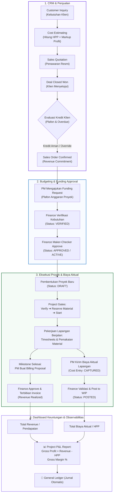

# Panduan Skenario Pengujian End-to-End: Alur Terpadu CRM ➔ Budgeting ➔ Proyek ➔ Finance ➔ Dashboard Keuntungan

Dokumen ini memandu pengujian **alur data bisnis terpadu** pada Arsalynt ERP yang menghubungkan 4 pilar utama sistem:
1. **CRM & Penjualan** (Inquiry, Estimasi HPP, Quotation, Deal Won & Credit Check).
2. **Budgeting & Funding** (Pengajuan anggaran proyek & persetujuan Finance).
3. **Eksekusi Proyek & Biaya Aktual** (Stage-gates, Timesheets, Alokasi Material, Handoff Cost Entry).
4. **Dashboard Keuntungan & Observabilitas** (Penerbitan Invoice, Gross Profit, Gross Margin %, General Ledger).

---

## 🗺️ Diagram Alur Data Terpadu (End-to-End Pipeline)

---

## 🧪 Langkah Uji Praktis Menggunakan Frontend Baru

Gunakan frontend prototype modular (`http://127.0.0.1:5500` atau `http://localhost:5500`):

### Tahap 1: CRM & Evaluasi Kredit (Role: CRM Manager / Staff)
1. **Pilih Akun**: Masuk sebagai `dummy.staff@example.com` atau `dummy.manager@example.com`.
2. **Buka Menu CRM & Sales** (`#/crm`):
   - Klik tab **Incoming Inquiry** ➔ Klik **⚡ Qualify Inquiry** pada inquiry yang masuk.
   - Buka tab **Estimating & Quoting** ➔ Klik **⚡ Hitung HPP** ➔ Klik **📄 Buat Quotation**.
   - Buka tab **Deal & Credit Management** ➔ Klik **⚡ Process Deal Won & Check Credit**.
3. **Hasil yang Terlihat**:
   - Modal evaluasi kredit akan memeriksa plafon limit kredit customer.
   - Jika kredit aman (atau di-override dengan tombol **👑 Executive Override**), pesanan berubah menjadi `CONFIRMED`.

---

### Tahap 2: Pengajuan Budgeting / Funding (Role: Project Manager & Finance)
1. **Ganti Akun**: Masuk sebagai `project.manager.demo@erp.local`.
2. **Buka Menu Accounting / Finance ➔ Funding Approval** (`#/finance/funding`):
   - Klik **Refresh funding** untuk melihat pengajuan dana yang terkait dengan pesanan baru.
3. **Ganti Akun**: Masuk sebagai `finance.approver@example.com` (Finance Approver).
   - Klik tombol **Verify** ➔ lalu klik tombol **Approve**.
4. **Hasil yang Terlihat**:
   - Status funding request berubah menjadi `APPROVED` / `ACTIVE`, menandakan plafon anggaran proyek siap digunakan.

---

### Tahap 3: Eksekusi Proyek & Pencatatan Biaya Lapangan (Role: Project Manager)
1. **Ganti Akun**: Masuk kembali sebagai `project.manager.demo@erp.local`.
2. **Buka Menu Project Management** (`#/projects`):
   - Pilih proyek yang bersangkutan pada dropdown.
   - Klik tombol **⚡ Majukan Stage Lifecycle** untuk menggerakkan stage:
     `DRAFT` ➔ `VERIFIED` ➔ `MATERIAL_RESERVED` ➔ `STARTED / ACTIVE`.
3. **Kirim Biaya Aktual ke Finance (Cost Handoff)**:
   - Pada bagian bawah halaman proyek (*Handoff Operasional ke Accounting*), klik **+ Kirim Biaya ke Finance**.
   - Masukkan biaya Material (contoh: Rp 250.000.000) dan biaya Labor (contoh: Rp 80.000.000).
4. **Buat Pengajuan Termin Tagihan (Billing Proposal)**:
   - Klik **+ Buat Billing Proposal**.
   - Masukkan subtotal termin milestone (contoh: Rp 500.000.000) dengan pajak 11%.
5. **Ganti Akun**: Masuk sebagai `finance.demo@erp.local`:
   - Buka `#/finance/costing` ➔ Klik **Validate** lalu **Post to WIP** pada cost entry.
   - Buka `#/finance/project-billing` ➔ Klik **Approve & Create Invoice** pada billing proposal.

---

### Tahap 4: Dashboard Keuntungan & Observabilitas Finansial (Role: Executive)
1. **Ganti Akun**: Masuk sebagai `executive.demo@erp.local`.
2. **Buka Menu 📊 Reporting & Observability** (`#/reporting`):
   - Pilih proyek pada dropdown **P&L Proyek**.
3. **Hasil & Verifikasi Metrik Finansial**:
   - **Nilai Kontrak (Revenue)**: Rp 500.000.000
   - **Total Biaya Aktual (COGS / HPP)**: Rp 330.000.000 (Material + Labor)
   - **Gross Profit (Laba Kotor)**: Rp 170.000.000 (Positif / Hijau)
   - **Gross Margin %**: **34.0%**
   - Buka tab **General Ledger & Jurnal Keuangan** untuk melihat jurnal debet-kredit yang otomatis tercatat.
