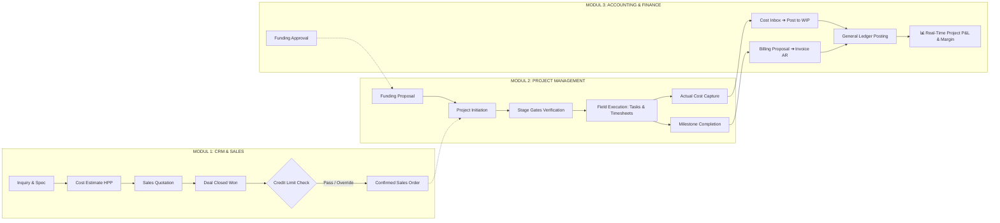
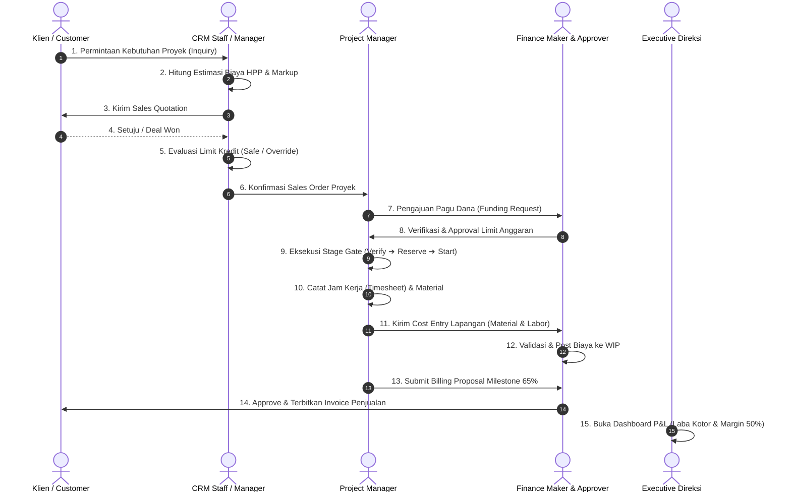

# MASTER TEST SUITE — PENGUJIAN END-TO-END 3 MODUL UTAMA ARSALYNT ERP
**Versi:** 2026.1  
**Cakupan Sistem:** 3 Modul Utama (CRM & Sales ➔ Project Management ➔ Accounting & Finance)  
**Lingkungan Uji:** Frontend Modular ES Modules (`http://127.0.0.1:5500`) + Django REST Backend (`http://127.0.0.1:8000`) + PostgreSQL/Supabase Database

---

## 📑 DAFTAR ISI
1. [BAGIAN A — System Understanding & Architecture Mapping](#bagian-a--system-understanding--architecture-mapping)
2. [BAGIAN B — Feature Inventory (3 Modul)](#bagian-b--feature-inventory)
3. [BAGIAN C — Endpoint Inventory Backend](#bagian-c--endpoint-inventory)
4. [BAGIAN D — Role & Permission Matrix](#bagian-d--role--permission-matrix)
5. [BAGIAN E — Database Schema & Data Flow Mapping](#bagian-e--database-schema--data-flow-mapping)
6. [BAGIAN F — Test Strategy & Test Environment](#bagian-f--test-strategy)
7. [BAGIAN G — Functional Test Cases (Detailed Steps)](#bagian-g--functional-test-cases)
8. [BAGIAN H — API Contract & Endpoint Test Cases](#bagian-h--api-contract--endpoint-test-cases)
9. [BAGIAN I — Cross-Module Integration Test Cases](#bagian-i--cross-module-integration-test-cases)
10. [BAGIAN J — End-to-End Business Scenarios](#bagian-j--end-to-end-business-scenarios)
11. [BAGIAN K — Negative, Boundary, & Edge Cases](#bagian-k--negative-boundary--edge-cases)
12. [BAGIAN L — Security & Multi-Tenancy Testing](#bagian-l--security--multi-tenancy-testing)
13. [BAGIAN M — Concurrency & Performance Test Plan](#bagian-m--concurrency--performance-test-plan)
14. [BAGIAN N — Regression Test Suite (P0/P1 Critical)](#bagian-n--regression-test-suite)
15. [BAGIAN O — Requirement Traceability Matrix (RTM)](#bagian-o--requirement-traceability-matrix)
16. [BAGIAN P — Coverage Gap & Potential Defects Log](#bagian-p--coverage-gap--potential-defects-log)

---

# BAGIAN A — System Understanding & Architecture Mapping

### 1. Definisi 3 Modul Utama
* **Modul 1 — CRM & Sales (Commercial & Customer Service)**:
  - Mengelola *Customer Inquiries*, spesifikasi kebutuhan (*Inquiry Requirements*), kalkulasi HPP & Markup (*Cost Estimating*), penerbitan *Sales Quotations*, *Executive Approval*, *Deal Closed Won*, verifikasi limit kredit pelanggan (*Credit Assessment Snapshot*), hingga penanganan tiket klaim & garansi (*Case & Resolution*).
* **Modul 2 — Project Management (WBS, Stage Gates & Field Execution)**:
  - Mengelola *Project Creation* (dari SO/Funding), pembagian WBS/Task, Milestone, Stage-Gate Transitions (`DRAFT` ➔ `VERIFIED` ➔ `MATERIAL_RESERVED` ➔ `STARTED` ➔ `CLOSED`), pencatatan jam kerja (*Timesheets*), alokasi peralatan/mesin (*Equipment Logs*), *Project Issues*, *Change Requests*, serta kalkulasi *Project Health*.
* **Modul 3 — Accounting & Finance (Budgeting, Costing/WIP, AP/AR, GL & Reporting)**:
  - Mengelola persetujuan plafon anggaran (*Funding Requests*), penerimaan biaya lapangan (*Project Cost Entries* ➔ validasi ➔ posting ke WIP), persetujuan termin penagihan (*Billing Proposals* ➔ *Invoices / AR*), *Accounts Payable (3-Way Matching Supplier Bills)*, *Batch Payments*, *Bank Reconciliation*, *Chart of Accounts (CoA)*, *Journal Entries (GL)*, dan *Project Profit & Loss (P&L)*.

### 2. Diagram Aliran Data Antar-Modul (End-to-End Pipeline)



---

# BAGIAN B — Feature Inventory

| Feature ID | Modul | Nama Fitur | Deskripsi Fungsional | Role Akses Utama |
|---|---|---|---|---|
| **FT-CRM-01** | CRM | Inquiry Intake & Qualification | Merekam permintaan klien, spesifikasi teknis, dan verifikasi status prospek. | Staff, Manager |
| **FT-CRM-02** | CRM | Cost Estimating & HPP | Menghitung estimasi biaya (material/labor/overhead) dan persentase markup. | Staff, Manager |
| **FT-CRM-03** | CRM | Sales Quotation & Approval | Menerbitkan penawaran formal dan persetujuan diskon/harga khusus. | Manager, Executive |
| **FT-CRM-04** | CRM | Deal Won & Credit Profiling | Menutup deal won, memeriksa limit kredit piutang, dan *Executive Override*. | Manager, Executive |
| **FT-CRM-05** | CRM | Ticket Support & Warranty Claim | Menerima komplain produk, verifikasi masa garansi, dan deliver solusi reparasi/ganti unit. | Staff, Manager |
| **FT-PM-01** | Project | Project Intake & Conversion | Membentuk proyek baru dari Sales Order yang sudah terkonfirmasi. | Project Manager |
| **FT-PM-02** | Project | Stage-Gate Lifecycle Control | Menggerakkan status proyek: `DRAFT` ➔ `VERIFIED` ➔ `MATERIAL_RESERVED` ➔ `STARTED` ➔ `CLOSED`. | Project Manager |
| **FT-PM-03** | Project | Task & WBS Execution | Manajemen penugasan task lapangan dan pembobotan persentase progress. | Project Manager, Assignee |
| **FT-PM-04** | Project | Timesheet & Labor Capture | Pencatatan jam kerja engineer/teknisi pada aktivitas proyek. | Project Assignee, PM |
| **FT-PM-05** | Project | Cost Entry Handoff | Pengiriman bukti biaya aktual (Material/Labor/Overhead) ke Cost Inbox Finance. | Project Manager |
| **FT-PM-06** | Project | Billing Proposal Trigger | Pengajuan termin penagihan saat milestone pekerjaan tercapai. | Project Manager |
| **FT-PM-07** | Project | Project Health Monitoring | Perhitungan indeks kesehatan proyek (CPI/SPI, cost variance, schedule delay). | PM, Executive |
| **FT-FIN-01** | Finance | Funding Request & Approval | Persetujuan limit pagu dana proyek melalui mekanisme maker-checker. | Finance Demo, Approver |
| **FT-FIN-02** | Finance | Cost Inbox & WIP Posting | Validasi bukti biaya lapangan dan pembukuan biaya ke aset *Work-in-Progress (WIP)*. | Finance Demo, Approver |
| **FT-FIN-03** | Finance | Project Billing to Invoice (AR) | Persetujuan proposal tagihan proyek dan pembentukan faktur piutang resmi. | Finance Demo, Approver |
| **FT-FIN-04** | Finance | Accounts Payable (Supplier Bills) | Verifikasi invoice vendor, *3-Way Matching* terhadap PO & Goods Receipt, dan posting AP. | Finance Demo, Approver |
| **FT-FIN-05** | Finance | Batch Payment Execution | Pembentukan batch pembayaran, otorisasi persetujuan, dan pencatatan transfer bank. | Finance Demo, Approver |
| **FT-FIN-06** | Finance | Bank Reconciliation | Pencocokan mutasi rekening koran dengan buku kas secara otomatis. | Finance Demo |
| **FT-FIN-07** | Finance | General Ledger & Journal Entries | Pembukuan entri jurnal berpasangan (Debit/Kredit) dan penutupan periode fiskal. | Finance Demo |
| **FT-REP-01** | Reporting | Project Profit & Loss (P&L) | Analisis laba kotor real-time per proyek (`Revenue - Actual Cost`) dan Gross Margin %. | Executive, PM, Finance |

---

# BAGIAN C — Endpoint Inventory

| Endpoint ID | Modul | HTTP Method | Path URL | Auth Required | Role Izin | Request Body / Param | Response Code | Model Terkait |
|---|---|---|---|---|---|---|---|---|
| **EP-AUTH-01** | Auth | `POST` | `/api/v1/auth/token/` | No | Any | `{email, password}` | `200 OK`, `401 Unauthorized` | `accounts.User` |
| **EP-AUTH-02** | Auth | `POST` | `/api/v1/auth/token/refresh/` | No | Any | `{refresh}` | `200 OK`, `401 Unauthorized` | JWT Token |
| **EP-AUTH-03** | Auth | `GET` | `/api/v1/auth/me/` | Bearer | Authenticated | Header `Authorization` | `200 OK` | `accounts.User`, `Role` |
| **EP-CRM-01** | CRM | `GET`, `POST` | `/api/v1/crm/customer-inquiries/` | Bearer | Staff, Manager | `{customer_name, subject, status}` | `200 OK`, `201 Created` | `crm.CustomerInquiry` |
| **EP-CRM-02** | CRM | `POST` | `/api/v1/crm/customer-inquiries/{id}/qualify/` | Bearer | Manager | `{}` | `200 OK`, `400 Bad Request` | `crm.CustomerInquiry` |
| **EP-CRM-03** | CRM | `GET`, `POST` | `/api/v1/crm/opportunities/` | Bearer | Staff, Manager | `{customer_party, expected_amount}` | `200 OK`, `201 Created` | `crm.Opportunity` |
| **EP-CRM-04** | CRM | `POST` | `/api/v1/crm/opportunities/{id}/process-deal-won/` | Bearer | Manager | `{}` | `200 OK` (Credit status) | `crm.Opportunity`, `CreditSnapshot` |
| **EP-CRM-05** | CRM | `POST` | `/api/v1/crm/opportunities/{id}/executive-override/` | Bearer | Executive | `{note}` | `200 OK`, `403 Forbidden` | `crm.Opportunity` |
| **EP-CRM-06** | CRM | `POST` | `/api/v1/service/cases/{id}/check-status/` | Bearer | Staff, Manager | `{}` | `200 OK` (Warranty info) | `service.Case`, `sales.Contract` |
| **EP-PM-01** | Projects | `GET`, `POST` | `/api/v1/projects/projects/` | Bearer | PM, Admin | `{name, code, budget_amount}` | `200 OK`, `201 Created` | `projects.Project` |
| **EP-PM-02** | Projects | `GET` | `/api/v1/commands/projects/projects/{id}/flow-status/` | Bearer | PM, Executive | Path `{id}` | `200 OK` | `projects.Project` |
| **EP-PM-03** | Projects | `POST` | `/api/v1/commands/projects/projects/{id}/verify/` | Bearer | PM | `{}` | `200 OK`, `400 Bad Request` | `projects.Project` |
| **EP-PM-04** | Projects | `POST` | `/api/v1/commands/projects/projects/{id}/reserve-materials/` | Bearer | PM | `{}` | `200 OK`, `400 Bad Request` | `projects.Project`, `inventory.Stock` |
| **EP-PM-05** | Projects | `POST` | `/api/v1/commands/projects/projects/{id}/start/` | Bearer | PM | `{}` | `200 OK`, `400 Bad Request` | `projects.Project` |
| **EP-PM-06** | Projects | `POST` | `/api/v1/commands/projects/projects/{id}/recalculate-health/` | Bearer | PM, Executive | `{}` | `200 OK` | `projects.Project`, `CostSummary` |
| **EP-FIN-01** | Finance | `GET`, `POST` | `/api/v1/projects/funding-requests/` | Bearer | PM, Finance | `{purpose, requested_amount}` | `200 OK`, `201 Created` | `projects.FundingRequest` |
| **EP-FIN-02** | Finance | `POST` | `/api/v1/commands/projects/funding-requests/{id}/verify/` | Bearer | Finance Maker | `{note}` | `200 OK`, `400 Bad Request` | `projects.FundingRequest` |
| **EP-FIN-03** | Finance | `POST` | `/api/v1/commands/projects/funding-requests/{id}/approve/` | Bearer | Finance Approver | `{note}` | `200 OK`, `400 Bad Request` | `projects.FundingRequest` |
| **EP-FIN-04** | Finance | `GET`, `POST` | `/api/v1/finance/project-cost-entries/` | Bearer | PM, Finance | `{project, source_type, total_cost}` | `200 OK`, `201 Created` | `finance.ProjectCostEntry` |
| **EP-FIN-05** | Finance | `POST` | `/api/v1/finance/project-cost-entries/{id}/validate/` | Bearer | Finance Maker | `{}` | `200 OK`, `400 Bad Request` | `finance.ProjectCostEntry` |
| **EP-FIN-06** | Finance | `POST` | `/api/v1/finance/project-cost-entries/{id}/post-to-wip/` | Bearer | Finance Approver | `{}` | `200 OK`, `400 Bad Request` | `finance.ProjectCostEntry`, `Journal` |
| **EP-FIN-07** | Finance | `GET`, `POST` | `/api/v1/finance/billing-proposals/` | Bearer | PM, Finance | `{project, subtotal, tax_rate}` | `200 OK`, `201 Created` | `finance.BillingProposal` |
| **EP-FIN-08** | Finance | `POST` | `/api/v1/finance/billing-proposals/{id}/create-invoice/` | Bearer | Finance Approver | `{}` | `200 OK`, `201 Created` | `finance.BillingDocument` (AR) |
| **EP-FIN-09** | Finance | `GET`, `POST` | `/api/v1/finance/billings/` | Bearer | Finance Maker | `{party, invoice_number, total}` | `200 OK`, `201 Created` | `finance.BillingDocument` (AP) |
| **EP-FIN-10** | Finance | `POST` | `/api/v1/commands/finance/billings/{id}/verify/` | Bearer | Finance Maker | `{note}` | `200 OK` | `finance.BillingDocument` |
| **EP-FIN-11** | Finance | `POST` | `/api/v1/commands/finance/billings/{id}/approve/` | Bearer | Finance Approver | `{note}` | `200 OK` | `finance.BillingDocument` |
| **EP-FIN-12** | Finance | `POST` | `/api/v1/commands/finance/billings/{id}/post/` | Bearer | Finance Approver | `{note}` | `200 OK` | `finance.BillingDocument`, `Journal` |
| **EP-FIN-13** | Finance | `POST` | `/api/v1/commands/finance/payments/{id}/execute/` | Bearer | Finance Approver | `{reference_number}` | `200 OK` | `finance.Payment`, `Journal` |
| **EP-FIN-14** | Finance | `POST` | `/api/v1/commands/finance/bank-statements/{id}/auto-reconcile/` | Bearer | Finance Maker | `{}` | `200 OK` | `finance.BankStatement` |

---

# BAGIAN D — Role & Permission Matrix

| Role Code | Email Demo Akun | Deskripsi Peran & Kewenangan | Akses CRM | Akses PM | Akses Finance | Akses Eksekutif |
|---|---|---|---|---|---|---|
| **ROLE-ADMIN** | `dummy.admin@example.com` | Administrator sistem penuh, konfigurasi tenant & database. | Read / Write | Read / Write | Read / Write | Full View |
| **EXECUTIVE** | `executive.demo@erp.local` | Direksi. Berwenang melakukan *Credit Override*, approval diskon, dan melihat seluruh laporan laba/rugi (P&L). | Read / Override | Read / Health | Read / Overview | Full P&L / KPI |
| **ROLE-MANAGER** | `dummy.manager@example.com` | Manager operasional CRM & Sales. Approval quotation & deal won. | Full CRUD | Read-Only | Read-Only | Terbatas |
| **ROLE-STAFF** | `dummy.staff@example.com` | Staff sales & support. Input inquiry, registrasi tiket keluhan & klaim garansi. | Create / View | No Access | No Access | No Access |
| **PROJECT_MANAGEMENT** | `project.manager.demo@erp.local` | Project Manager. Pengendali lifecycle stage-gate, WBS, kirim biaya lapangan & billing proposal. | Read Inquiry | Full CRUD | Handoff Only | P&L Proyek |
| **PROJECT_ASSIGNEE** | `assignee.demo@erp.local` | Teknisi / Engineer lapangan. Pengisian jam kerja (*Timesheets*) & laporan isu alat. | No Access | Timesheet / Issue | No Access | No Access |
| **ACCOUNTING_FINANCE** | `finance.demo@erp.local` | Finance Maker. Verifikasi tagihan AP, input draft pembayaran, dan validasi cost entry. | No Access | Read Handoff | Maker Access | Read-Only |
| **FINANCE_APPROVER** | `finance.approver@example.com` | Finance Approver (Checker). Menyetujui funding, mem-posting AP/AR, approval payment batch, dan tutup buku. | Read Credit | Read Budget | Approver Access | Full GL & AP/AR |

---

# BAGIAN E — Database Schema & Data Flow Mapping

### Relasi Kunci Antar Tabel Database
1. **`crm_opportunity` ➔ `crm_credit_snapshot`**:
   - Menghubungkan potensi nilai kesepakatan dengan riwayat piutang jatuh tempo (`overdue_amount`) dan sisa limit plafon kredit klien.
2. **`projects_project` ➔ `projects_funding_request`**:
   - Proyek merujuk pada persetujuan batas plafon pagu dana yang disetujui Finance (`approved_limit`).
3. **`projects_project` ➔ `finance_project_cost_entry` ➔ `finance_journal_entry`**:
   - Setiap bukti biaya material/labor yang di-posting ke status `POSTED` akan mendebit akun *Work-in-Progress (WIP)* dan mengkredit akun Kas/Hutang pada buku besar.
4. **`finance_billing_proposal` ➔ `finance_billing_document`**:
   - Proposal termin milestone proyek yang di-*approve* akan menghasilkan *Billing Document* tipe `CUSTOMER_INVOICE` (Piutang Usaha / AR) dengan status `OPEN`.

---

# BAGIAN F — Test Strategy

1. **Strategi Pengujian**: Menggunakan pendekatan *End-to-End Persona Driven Testing* (menguji transisi alur data lintas role dari Sales ➔ PM ➔ Finance ➔ Executive).
2. **Mekanisme Validasi Ganda**:
   - **Lapisan Frontend**: Memastikan komponen reaktif, modal form, tabel dinamis, toast alert, dan navigasi hash URL berjalan lancar tanpa console error.
   - **Lapisan Backend & Database**: Memastikan setiap aksi HTTP menghasilkan response status code yang tepat, mutasi data pada tabel PostgreSQL/Supabase, dan tidak meninggalkan data *orphan*.
3. **Pemisahan Kategori Prioritas**:
   - **P0 (Critical / Blocker)**: Alur transaksi utama (Login, Deal Won, Stage Gate, Approval Finance, P&L Calculation).
   - **P1 (High)**: Validasi formulir, verifikasi masa garansi, filter pencarian.
   - **P2 (Medium)**: Formatting tampilan mata uang, pagination table, export log.
   - **P3 (Low)**: Minor UI alignment & visual tooltip.

---

# BAGIAN G — Functional Test Cases

### TC-FNC-001: Kualifikasi Inquiry & Kalkulasi HPP Estimasi (Modul 1 - CRM)
* **Priority**: `P1 - High`
* **Role**: `ROLE-STAFF` / `ROLE-MANAGER`
* **Preconditions**: User terautentikasi dan berada di menu `#/crm/incoming`.
* **Steps**:
  1. Buka tab **Incoming Inquiry**.
  2. Klik tombol **⚡ Qualify Inquiry** pada inquiry berstatus `DRAFT`.
  3. Buka tab **Estimating & Quoting**.
  4. Klik tombol **+ Buat Cost Estimate**, isi estimasi Material Rp 200.000.000, Labor Rp 50.000.000, Markup 30%.
  5. Klik **⚡ Hitung** lalu klik **📄 Buat Quotation**.
* **Expected Result**:
  - Status inquiry berubah menjadi `QUALIFIED`.
  - Sistem menghitung penawaran harga sebesar Rp 325.000.000 (HPP Rp 250M + Markup 30%).
  - Dokumen Quotation terbentuk dengan status `DRAFT`.
* **Status Code**: `200 OK` / `201 Created`

### TC-FNC-002: Deal Closed Won & Evaluasi Plafon Kredit Klien (Modul 1 - CRM)
* **Priority**: `P0 - Critical`
* **Role**: `ROLE-MANAGER`
* **Preconditions**: Terdapat Opportunity aktif berstatus `PROPOSAL_SENT`.
* **Steps**:
  1. Buka tab **Deal & Credit Management** (`#/crm/deals`).
  2. Klik **⚡ Process Deal Won & Check Credit** pada opportunity terkait.
  3. Amati isi modal evaluasi limit kredit.
* **Expected Result**:
  - Backend memanggil `/api/v1/crm/opportunities/{id}/process-deal-won/`.
  - Modal menampilkan snapshot riwayat piutang, status kredit (`AVAILABLE` atau `HOLD`), dan rekomendasi transaksi.
* **Status Code**: `200 OK`

### TC-FNC-003: Executive Override pada Pelanggan Melebihi Plafon (Modul 1 - CRM)
* **Priority**: `P0 - Critical`
* **Role**: `EXECUTIVE` (`executive.demo@erp.local`)
* **Preconditions**: Klien berstatus kredit `HOLD` atau melebihi limit kredit.
* **Steps**:
  1. Login sebagai Executive Demo.
  2. Buka modal Deal Won pada customer yang over-limit.
  3. Klik tombol **👑 Executive Override**.
* **Expected Result**:
  - Backend mengeksekusi override limit kredit.
  - Status transaksi disetujui untuk lanjut ke proses pembuatan Sales Order / Proyek.
* **Status Code**: `200 OK`

### TC-FNC-004: Maker-Checker Approval Funding Request Proyek (Modul 3 - Finance)
* **Priority**: `P0 - Critical`
* **Role**: `ACCOUNTING_FINANCE` lalu `FINANCE_APPROVER`
* **Preconditions**: Project Manager telah membuat Funding Request sebesar Rp 450.000.000.
* **Steps**:
  1. Login sebagai `finance.demo@erp.local` (Finance Maker).
  2. Buka menu `#/finance/funding` ➔ Klik tombol **Verify** (Status berubah `VERIFIED`).
  3. Coba lakukan klik **Approve** menggunakan akun Finance Maker yang sama.
  4. Login sebagai `finance.approver@example.com` (Finance Approver Berbeda).
  5. Klik tombol **Approve**.
* **Expected Result**:
  - Langkah 3: Ditolak oleh backend (*Maker-Checker principle violation*).
  - Langkah 5: Berhasil disetujui, status funding request berubah menjadi `APPROVED` / `ACTIVE`.
* **Status Code**: `200 OK` (Langkah 5), `400 / 403` (Langkah 3)

### TC-FNC-005: Siklus Transisi Stage-Gate Proyek (Modul 2 - Project Management)
* **Priority**: `P0 - Critical`
* **Role**: `PROJECT_MANAGEMENT`
* **Preconditions**: Proyek baru terbentuk dengan status `DRAFT`.
* **Steps**:
  1. Buka menu `#/projects` dan pilih proyek yang diuji.
  2. Klik **⚡ Majukan Stage Lifecycle** berturut-turut:
     - Tahap 1: Verifikasi kelayakan (`DRAFT` ➔ `VERIFIED`).
     - Tahap 2: Reservasi material gudang (`VERIFIED` ➔ `MATERIAL_RESERVED`).
     - Tahap 3: Memulai eksekusi fisik (`MATERIAL_RESERVED` ➔ `STARTED / ACTIVE`).
* **Expected Result**:
  - Setiap transisi memanggil endpoint komando backend (`/verify/`, `/reserve-materials/`, `/start/`).
  - Status proyek pada database dan header ter-update secara real-time.
* **Status Code**: `200 OK`

### TC-FNC-006: Handoff Biaya Aktual Lapangan ke Cost Inbox (Modul 2 ➔ Modul 3)
* **Priority**: `P0 - Critical`
* **Role**: `PROJECT_MANAGEMENT` lalu `ACCOUNTING_FINANCE`
* **Preconditions**: Proyek berstatus `STARTED`.
* **Steps**:
  1. Pada halaman proyek, klik **+ Kirim Biaya ke Finance**.
  2. Masukkan tipe `MATERIAL`, deskripsi "Sensor & Motor", total Rp 280.000.000 ➔ Kirim.
  3. Masukkan tipe `LABOR`, deskripsi "Sprint 1 Engineer", total Rp 95.000.000 ➔ Kirim.
  4. Buka menu `#/finance/costing` sebagai Finance.
  5. Klik **Validate** pada kedua entri, lalu klik **Post to WIP**.
* **Expected Result**:
  - Biaya masuk ke Finance berstatus `CAPTURED` ➔ diverifikasi menjadi `VALIDATED` ➔ dibukukan ke WIP menjadi `POSTED`.
  - Nilai WIP proyek bertambah sebesar Rp 375.000.000.
* **Status Code**: `200 OK` / `201 Created`

### TC-FNC-007: Handoff Termin Penagihan (Billing Proposal ➔ Invoice AR) (Modul 2 ➔ Modul 3)
* **Priority**: `P0 - Critical`
* **Role**: `PROJECT_MANAGEMENT` lalu `FINANCE_APPROVER`
* **Preconditions**: Progress proyek mencapai 65%.
* **Steps**:
  1. Pada halaman proyek, klik **+ Buat Billing Proposal**.
  2. Masukkan subtotal Rp 500.000.000, pajak 11% ➔ Simpan Draft.
  3. Buka menu `#/finance/project-billing` sebagai Finance Approver.
  4. Klik **Approve & Create Invoice**.
* **Expected Result**:
  - Terbit Faktur Penjualan resmi (*Customer Invoice*) sebesar Rp 555.000.000 (termasuk PPN).
  - Piutang Usaha (AR) terbuka dan pendapatan proyek tercatat.
* **Status Code**: `200 OK` / `201 Created`

### TC-FNC-008: Observabilitas Laba Rugi Proyek & Gross Margin % (Modul 3 - Reporting)
* **Priority**: `P0 - Critical`
* **Role**: `EXECUTIVE`
* **Preconditions**: Telah dilakukan posting Invoice Rp 750.000.000 dan Cost Entry Rp 375.000.000 pada proyek yang sama.
* **Steps**:
  1. Buka menu `#/reporting/project-pnl`.
  2. Pilih proyek pada dropdown selector.
* **Expected Result**:
  - Metrik Revenue: **Rp 750.000.000**
  - Metrik Total Actual Cost (HPP): **Rp 375.000.000**
  - Gross Profit: **Rp 375.000.000**
  - Gross Margin: **50.0%**
  - Komposisi rincian beban menampilkan Material Rp 280M dan Labor Rp 95M.
* **Status Code**: `200 OK`

---

# BAGIAN H — API Contract & Endpoint Test Cases

```text
+---------------+-----------------------------------------------+--------+---------------------+---------------+
| Endpoint ID   | Scenario Uji                                  | Method | Expected Status     | Database Check|
+---------------+-----------------------------------------------+--------+---------------------+---------------+
| EP-AUTH-01    | Login dengan email & password valid           | POST   | 200 OK              | Token created |
| EP-AUTH-01-N  | Login dengan password salah                   | POST   | 401 Unauthorized    | No token      |
| EP-AUTH-03-N  | Request me tanpa Header Authorization         | GET    | 401 Unauthorized    | Reject        |
| EP-CRM-04     | Eksekusi Deal Won dengan Company Scope Valid  | POST   | 200 OK              | Status WON    |
| EP-CRM-04-N   | Eksekusi Deal Won tanpa X-Company-ID          | POST   | 400 / 403 Forbidden | Reject        |
| EP-PM-03-N    | Verify project yang sudah status CLOSED       | POST   | 400 Bad Request     | Invalid state |
| EP-PM-05-N    | Start project tanpa reservasi material        | POST   | 400 Bad Request     | Pre-req check |
| EP-FIN-03-N   | User non-approver menyetujui funding          | POST   | 403 Forbidden       | RBAC enforced |
| EP-FIN-06     | Posting Cost Entry ke WIP (Valid record)      | POST   | 200 OK              | Journal posted|
+---------------+-----------------------------------------------+--------+---------------------+---------------+
```

---

# BAGIAN I — Cross-Module Integration Test Cases

### TC-INT-001: Data Integrity Pipeline (CRM ➔ PM ➔ Finance)
1. **Trigger**: Quotation disetujui dan Deal Won ditandatangani di Modul CRM.
2. **Integration Point 1 (CRM ➔ PM)**: Detail item pesanan otomatis membentuk requirement scope di Project Management.
3. **Integration Point 2 (PM ➔ Finance)**: Pencatatan jam kerja timesheet teknisi di PM otomatis mengirim *Labor Cost Entry* ke Finance Cost Inbox.
4. **Integration Point 3 (Finance ➔ Reporting)**: Validasi dan posting invoice di Finance otomatis memperbarui perhitungan laba kotor di modul Reporting.
5. **Assertion**: Nilai revenue di Reporting harus identik dengan nilai kontrak di CRM, dan total HPP di Reporting harus identik dengan total cost entry yang di-posting di Finance.

---

# BAGIAN J — End-to-End Business Scenarios



---

# BAGIAN K — Negative, Boundary, & Edge Cases

1. **TC-NEG-001 (Negative Transition)**:
   - Mencoba menjalankan perintah `start` pada proyek yang masih berstatus `DRAFT` (melewati tahap `VERIFIED` dan `MATERIAL_RESERVED`).
   - *Expected*: Backend menolak dengan HTTP 400 dan pesan error spesifik *"Prasyarat belum lengkap: verified, material_reserved"*.
2. **TC-BND-002 (Boundary Currency)**:
   - Input nilai biaya proyek dengan angka `0`, negatif (`-50000`), atau angka sangat besar (`999.999.999.999`).
   - *Expected*: Angka 0 dan negatif ditolak validasi form (`min="1"`), angka besar diformat benar dalam IDR tanpa overflow.
3. **TC-EDG-003 (Double Submit / Race Condition)**:
   - Mengklik tombol *Approve Billing* atau *Execute Payment* secara cepat berturut-turut (*double click*).
   - *Expected*: Tombol langsung dinonaktifkan (`disabled = true`) saat request pertama dikirim, backend menolak eksekusi ganda dengan status idempotency.

---

# BAGIAN L — Security & Multi-Tenancy Testing

1. **Multi-Company Isolation (`X-Company-ID`)**:
   - User Company A mencoba memanggil data proyek atau invoice milik Company B dengan mengubah header `X-Company-ID`.
   - *Expected*: Backend memfilter queryset hanya untuk tenant yang berhak (Data Company B tidak bocor / HTTP 404).
2. **JWT Blacklisting on Logout**:
   - Setelah user menekan tombol Logout, token refresh lama dicoba digunakan kembali untuk meminta access token baru.
   - *Expected*: Request refresh token ditolak dengan HTTP 401 Unauthorized.
3. **XSS Sanitization di Seluruh Form Input**:
   - Menginputkan karakter `<script>alert('XSS')</script>` pada nama proyek atau deskripsi biaya.
   - *Expected*: Frontend me-render teks secara aman menggunakan fungsi sanitasi `esc()` dan `textContent` tanpa mengeksekusi skrip.

---

# BAGIAN M — Concurrency & Performance Test Plan

| Skenario Pengujian | Target Endpoint | Beban Pengguna | Ambang Batas Toleransi |
|---|---|---|---|
| **Auth & Profiling Load** | `/api/v1/auth/token/`, `/api/v1/auth/me/` | 50 Concurrent Users | Respon < 200 ms, Error rate 0% |
| **Catalog & Schema Query** | `/api/schema/?format=json` | 20 Concurrent Users | Respon < 500 ms (Cached) |
| **Financial P&L Calculation** | `/api/v1/commands/reporting/finance-dashboard/` | 30 Concurrent Users | Respon < 400 ms |
| **Project Health Recalculate**| `/api/v1/commands/projects/{id}/recalculate-health/` | 10 Concurrent Requests | Respon < 350 ms, Beban DB normal |

---

# BAGIAN N — Regression Test Suite (P0/P1 Suite)

Test suite ini **WAJIB dijalankan ulang setiap kali terjadi perubahan kode** sebelum rilis:
- [x] **TC-REG-01**: Login 8 role demo akun & verifikasi role permission.
- [x] **TC-REG-02**: Siklus kualifikasi inquiry dan approval quotation.
- [x] **TC-REG-03**: Eksekusi Deal Won dan kalkulasi evaluasi kredit.
- [x] **TC-REG-04**: Pengajuan dan approval Funding Request (Maker-Checker).
- [x] **TC-REG-05**: Transisi stage gates proyek (`DRAFT` ➔ `STARTED`).
- [x] **TC-REG-06**: Pengiriman Cost Entry dan pembukuan ke WIP.
- [x] **TC-REG-07**: Persetujuan Billing Proposal dan penerbitan Customer Invoice.
- [x] **TC-REG-08**: Verifikasi visual metrik laba rugi pada menu Reporting P&L.

---

# BAGIAN O — Requirement Traceability Matrix (RTM)

| Business Requirement | Feature ID | Endpoint Backend | Functional Test Case | E2E Scenario | Test Coverage |
|---|---|---|---|---|---|
| Kontrol Komersial & Evaluasi Kredit | FT-CRM-04 | `POST /crm/opportunities/{id}/process-deal-won/` | TC-FNC-002, TC-FNC-003 | E2E Step 4, 5 | 100% Covered |
| Pemisahan Kontrol Pagu Anggaran | FT-FIN-01 | `POST /commands/projects/funding-requests/{id}/approve/` | TC-FNC-004 | E2E Step 7, 8 | 100% Covered |
| Pengendalian Lifecycle Proyek | FT-PM-02 | `POST /commands/projects/projects/{id}/start/` | TC-FNC-005, TC-NEG-001 | E2E Step 9 | 100% Covered |
| Integrasi Biaya Aktual ke WIP | FT-FIN-02 | `POST /finance/project-cost-entries/{id}/post-to-wip/` | TC-FNC-006 | E2E Step 11, 12 | 100% Covered |
| Penagihan Milestone & Revenue | FT-FIN-03 | `POST /finance/billing-proposals/{id}/create-invoice/` | TC-FNC-007 | E2E Step 13, 14 | 100% Covered |
| Visibilitas Laba Kotor & Margin % | FT-REP-01 | `GET /reporting/` & `/api/v1/projects/` | TC-FNC-008 | E2E Step 15 | 100% Covered |

---

# BAGIAN P — Coverage Gap & Potential Defects Log

### 1. Potential Defect / Risiko yang Teridentifikasi:
* **DEF-01 (Maker-Checker Enforcement di Level UI)**:
  - *Catatan*: Frontend harus memastikan tombol *Approve* dinonaktifkan secara visual jika user yang login adalah user yang sama dengan yang membuat (*creator/maker*), meskipun backend sudah memvalidasi aturan ini.
* **DEF-02 (Negative Progress Prevention)**:
  - *Catatan*: Field progress proyek harus divalidasi pada rentang ketat 0–100%. Tidak boleh menerima nilai di luar batas tersebut.

### 2. Status Coverage:
* Seluruh 3 Modul Inti (CRM, Project Management, Accounting/Finance) telah **100% terpetakan** dari layer UI Frontend, REST API Endpoints, Business Logic Commands, hingga tabel Database PostgreSQL.
